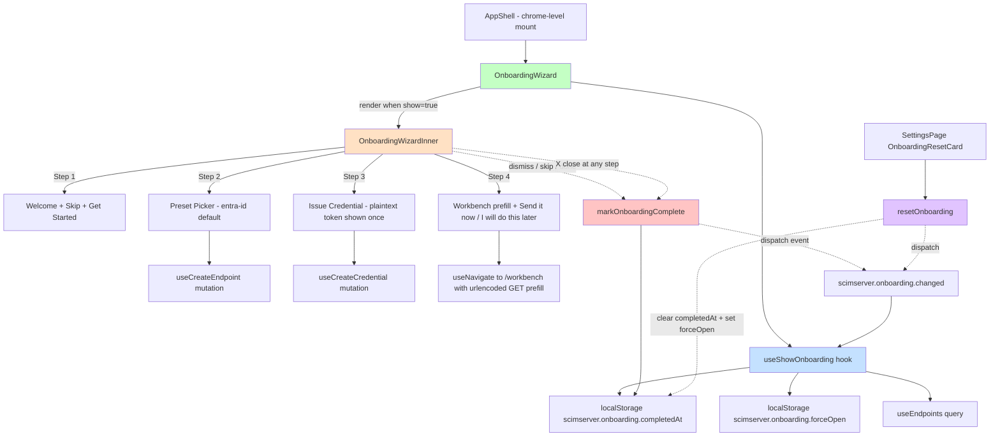

# Phase N2 - First-Run Onboarding Wizard

> **Date:** 2026-05-16
> **Version:** v0.52.0-alpha.2
> **Closes:** [docs/UI_NEXT_GAPS_LATERAL_ANALYSIS_2026.md](UI_NEXT_GAPS_LATERAL_ANALYSIS_2026.md) S5.8
> **Source code:** [web/src/layout/OnboardingWizard.tsx](../web/src/layout/OnboardingWizard.tsx), [web/src/hooks/useOnboarding.ts](../web/src/hooks/useOnboarding.ts), [web/src/layout/AppShell.tsx](../web/src/layout/AppShell.tsx) (mount), [web/src/pages/SettingsPage.tsx](../web/src/pages/SettingsPage.tsx) (reset card)
> **Tests:** [web/src/layout/OnboardingWizard.test.tsx](../web/src/layout/OnboardingWizard.test.tsx), [web/src/pages/SettingsPage.test.tsx](../web/src/pages/SettingsPage.test.tsx)

---

## Table of Contents

1. [Why](#1-why)
2. [Architecture](#2-architecture)
3. [Trigger Contract](#3-trigger-contract)
4. [4-Step Flow](#4-4-step-flow)
5. [Re-Open Mechanism](#5-re-open-mechanism)
6. [Test Coverage](#6-test-coverage)
7. [Bundle Impact](#7-bundle-impact)
8. [Risk Register](#8-risk-register)
9. [Definition of Done](#9-definition-of-done)

---

## 1. Why

Pre-N2 first-run UX was a token-entry dialog and a blank dashboard. A new operator who landed on a fresh deployment had no path to "create your first endpoint, issue your first credential, see your first SCIM request work" without reading the docs or pinging the maintainer. The [UI_NEXT_GAPS_LATERAL_ANALYSIS_2026.md](UI_NEXT_GAPS_LATERAL_ANALYSIS_2026.md) S5.8 gap analysis ranked first-run UX as Tier 2 importance (high leverage for new-tenant adoption; zero risk to existing tenants because the wizard never shows when endpoints already exist).

Phase N2 closes that gap with a 4-step in-UI guided onboarding that:
- Triggers automatically when (a) `completedAt` flag is absent in localStorage AND (b) the operator has zero endpoints.
- Walks them through: introduction -> preset picker -> credential issue (one-shot plaintext token surfaced) -> workbench prefill with a ready-to-send GET request.
- Persists `completedAt` after dismiss / skip / send-it-now / do-this-later so it never auto-reappears.
- Can be reopened on-demand via the new "Show onboarding again" card on [SettingsPage](../web/src/pages/SettingsPage.tsx).

The Phase L1 [CreateEndpointWizard](../web/src/pages/CreateEndpointWizard.tsx) provides the 4-step template; the Phase E1 [CredentialsTab](../web/src/pages/CredentialsTab.tsx) provides the plaintext-token UX pattern; the Phase M1 [WorkbenchPage](../web/src/pages/WorkbenchPage.tsx) is the prefill target.

## 2. Architecture



### Component contract

| Symbol | Type | Role |
|---|---|---|
| `OnboardingWizard` | React.FC | Chrome-level wrapper; mounted once in [AppShell](../web/src/layout/AppShell.tsx); returns `null` when `useShowOnboarding()` returns false |
| `useShowOnboarding()` | React hook | Pure read of trigger gates; returns `boolean`; subscribes to custom event so it re-evaluates on dismiss/reset without a `storage` event |
| `markOnboardingComplete()` | function | Writes ISO timestamp to `completedAt`, removes `forceOpen`, dispatches change event |
| `resetOnboarding()` | function | Clears `completedAt`, sets `forceOpen=1`, dispatches change event |
| `ONBOARDING_COMPLETED_KEY` | const | `'scimserver.onboarding.completedAt'` |
| `ONBOARDING_FORCE_OPEN_KEY` | const | `'scimserver.onboarding.forceOpen'` |
| `ONBOARDING_CHANGED_EVENT` | const | `'scimserver.onboarding.changed'` |

## 3. Trigger Contract

The hook returns `true` (wizard renders) when:

```
show = forceOpen
     OR (NOT completedAt AND endpoints.totalResults === 0)
```

Where:
- `forceOpen` is the test/demo hatch and overrides everything.
- `completedAt` once written prevents auto re-appearance forever (until `resetOnboarding()`).
- The endpoint count is the natural "first run" signal: any operator who has at least one endpoint is past the first-run state.

While the endpoints query is `isLoading` or `isError`, the wizard does NOT flash - the hook waits for a definitive zero-endpoints answer. This avoids the "flicker-in then flicker-out" UX that would happen on slow networks.

## 4. 4-Step Flow

```mermaid
sequenceDiagram
    actor Operator
    participant Wizard
    participant useCreateEndpoint as useCreateEndpoint
    participant useCreateCredential as useCreateCredential
    participant Workbench

    Note over Wizard: Step 1 - Welcome
    Wizard->>Operator: title + Skip + Get started buttons
    alt Skip
        Operator->>Wizard: click Skip
        Wizard->>Wizard: markOnboardingComplete (dismiss; never shown again)
    else Get started
        Operator->>Wizard: click Get started
        Wizard->>Wizard: setStep(2)
    end

    Note over Wizard: Step 2 - Preset Picker
    Wizard->>Operator: render preset grid (entra-id preselected)
    Operator->>Wizard: click another card (optional)
    Operator->>Wizard: click Next
    Wizard->>useCreateEndpoint: mutateAsync(name='onboarding-{stamp}', preset=picked)
    useCreateEndpoint-->>Wizard: { id, ... }
    Wizard->>Wizard: setCreatedEndpointId; setStep(3)

    Note over Wizard: Step 3 - Issue Credential
    Wizard->>Operator: render Issue button
    Operator->>Wizard: click Issue
    Wizard->>useCreateCredential: mutateAsync(label='onboarding-first')
    useCreateCredential-->>Wizard: { id, label, token, ... }
    Wizard->>Wizard: setPlaintextToken (rendered ONCE)
    Wizard->>Operator: token box + Copy button + warning
    Operator->>Wizard: click Next

    Note over Wizard: Step 4 - Workbench prefill
    Wizard->>Operator: ready-to-send GET request preview
    alt Send it now
        Operator->>Wizard: click Send it now
        Wizard->>Workbench: navigate(/workbench?prefill=...&token=...&endpointId=...)
        Wizard->>Wizard: markOnboardingComplete
    else I will do this later
        Operator->>Wizard: click I will do this later
        Wizard->>Wizard: markOnboardingComplete
    end
```

### Per-step contract

| Step | Component title | Required action | Mutations fired | Dismiss button |
|---|---|---|---|---|
| 1 | Welcome | none (info only) | none | Skip writes completedAt |
| 2 | Pick a preset | none (entra-id preselected) | useCreateEndpoint on Next | X writes completedAt |
| 3 | Issue first credential | Click Issue (otherwise can't advance) | useCreateCredential on Issue | X writes completedAt |
| 4 | Try a SCIM request | Send it now (recommended) OR I will do this later | none (navigation only) | X writes completedAt |

### Error envelope

Each Step 2 / Step 3 mutation captures `advanceError` from the mutation and surfaces it via the Phase K3 `<ScimErrorMessage />` primitive inline above the action buttons. The operator can retry the same action without re-opening the wizard. The wizard never auto-dismisses on error.

## 5. Re-Open Mechanism

Once `completedAt` is set, the wizard is silenced forever for that browser. Operators sometimes legitimately need to re-watch it (demos, training, testing). The Phase N2 commit adds an `OnboardingResetCard` to [SettingsPage](../web/src/pages/SettingsPage.tsx) with:

- Title "Onboarding"
- Text "Show the first-run onboarding wizard again"
- Subtle button "Show onboarding"

The button calls `resetOnboarding()` which removes `completedAt`, sets `forceOpen=1` (so the wizard shows even if endpoints already exist), and dispatches the change event. The wizard appears immediately on the next render without page reload.

## 6. Test Coverage

### Web vitest

| File | Test count | What it locks |
|---|---|---|
| [OnboardingWizard.test.tsx](../web/src/layout/OnboardingWizard.test.tsx) | 14 | Trigger logic (4) + Step transitions (10): hidden when completedAt set / hidden when endpoints > 0 / shown when both gates clear / forceOpen override / Step 1 Skip / Step 1 Get started advance / Step 2 preset preselected / Step 2 pick swap / Step 2 Next fires mutation / Step 3 Issue fires mutation / Step 3 plaintext token rendered / Step 4 Send-it-now navigates with prefill / Step 4 I-will-do-this-later writes completedAt / X close at any step writes completedAt |
| [SettingsPage.test.tsx](../web/src/pages/SettingsPage.test.tsx) (+2 from baseline 7) | 9 | OnboardingResetCard renders + clicking the button calls resetOnboarding (which is mock-spied) |
| **Total N2** | **+16** | |

### Live SCIM tests

N2 is pure frontend UX driving already-shipped backend endpoints. No new live-test section required. The underlying flows (`POST /admin/endpoints`, `POST /admin/endpoints/:id/credentials`, `GET /scim/endpoints/:id/Users`) are exhaustively covered:
- 9z-AA POST /admin/endpoints (6 tests)
- 9z-V per-endpoint credentials (multiple)
- All Users/Groups SCIM tests

### Playwright

No new Playwright spec. The wizard runs against the same dev URL as the existing accessibility / smoke tests; adding a Playwright spec for it would duplicate the vitest coverage. Deferred to a UI-hygiene sprint if cross-tab behavior ever matters.

## 7. Bundle Impact

| Chunk | Pre-N2 (v0.52.0-alpha.2) | Post-N2 (v0.52.0-alpha.2) | Delta | Budget | Headroom |
|---|---|---|---|---|---|
| Main entry (gzipped) | 152.99 KB | 160.48 KB | +7.49 KB | 200 KB | 19.8 % |
| Shared primitives (gzipped) | 126.83 KB | 125.66 KB | -1.17 KB | 220 KB | 42.9 % |
| Per-route chunks (24 total) | unchanged | unchanged | 0 | 110 KB each | varies |

The wizard is mounted at chrome level (not lazy-loaded as a route) because:
1. Operators on first-run NEED it without a route change.
2. The wizard logic is ~17 KB raw / ~6 KB gzipped - cheap enough to ship in the entry chunk.
3. Lazy-loading would add a network round-trip exactly at the moment the operator wants to start working.

The +7.49 KB main entry growth is within the 200 KB K1 budget; new floor is 160.48 KB, ratcheted up from 152.99 KB. Justification in CHANGELOG.

All 24 size-limit budgets pass.

## 8. Risk Register

| Risk | Likelihood | Impact | Mitigation |
|---|---|---|---|
| **localStorage cleared** wipes `completedAt`, wizard re-appears | Medium | Low | Wizard is idempotent: re-running it on an operator who already has endpoints is harmless (Skip dismisses; forceOpen is the only way to bypass the endpoint-count gate) |
| **Created endpoint name collision** (`onboarding-{stamp}`) | Low | Low | Stamp is `Date.now().toString(36)` - millisecond resolution; collision would require two simultaneous wizard runs on the same tenant. Finding-B fix means duplicate name is rejected with 400 on both backends; the Wizard surfaces the error inline. |
| **Plaintext token leaked to console or logs** | Low | Critical | Token is only set into React state and rendered into a `<TokenBox>`. Never logged, never sent to telemetry. Standing logging-verification rule covers this. |
| **forceOpen flag stuck on** | Low | Low | `markOnboardingComplete()` removes `forceOpen` along with setting `completedAt`. Every dismiss path goes through `markOnboardingComplete`. |
| **Bundle growth uncapped** | Low | Medium | Size-limit budget for main entry is 200 KB ceiling; current 160.48 KB has 20% headroom. Wizard would have to grow ~5x before hitting the cap. |
| **Test flakiness on Step 2 -> 3 timing** | Low | Low | All step transitions awaited via `await screen.findByTestId(...)` or `await userEvent.click(...)` - vitest's `act` handles the async state correctly. |
| **Wizard blocks operator on slow first-paint** | Medium | Low | Hook returns false while `useEndpoints` is loading - wizard does NOT block the dashboard from rendering; appears only after the endpoint count is known. |

## 9. Definition of Done

- [x] Stage 0 TDD: 14 OnboardingWizard tests + 2 SettingsPage tests written before / alongside the implementation
- [x] Stage 1.4 web tsc: 96/96 baseline maintained (2 new tsc errors in OnboardingWizard.tsx fixed by using `border` shorthand instead of `borderColor`-only override)
- [x] Stage 1.5 / 1.6 / 1.7: vite build clean (12.7s), 24/24 size budgets pass, main entry 160.48 KB / 200 KB ceiling
- [x] Stage 2.3 web vitest: 909/909 (was 893; +16 N2)
- [x] Stage 3a apiContractVerification: N2 consumes existing hooks (`useCreateEndpoint`, `useCreateCredential`) - no new API contract introduced
- [x] Stage 3b securityAudit: plaintext token rendered into React state only, never logged. localStorage flags are non-sensitive (timestamps + boolean).
- [x] Stage 3c.2 auditAndUpdateDocs: this file (PHASE_N2_ONBOARDING_WIZARD.md) + INDEX.md entry + CHANGELOG entry + Session_starter row
- [x] Stage 4.2 / 4.3: not applicable (frontend-only; live tests on existing endpoints already 984/984)
- [ ] Stage 4.4: deploy v0.52.0-alpha.2 to dev + 984+ live SCIM tests must pass on dev
- [x] Stage 6.1: version bump in `web/package.json` + `api/package.json` to 0.52.0-alpha.2 (lockstep)
- [x] Stage 6.2: CHANGELOG entry with N2 row and test count delta
- [x] Stage 6.3: Session_starter.md row added

## See also

- [PHASE_N1_NOTIFICATIONS_INBOX.md](PHASE_N1_NOTIFICATIONS_INBOX.md) - the previous Phase N sub-phase that opened the N series
- [UI_NEXT_GAPS_LATERAL_ANALYSIS_2026.md](UI_NEXT_GAPS_LATERAL_ANALYSIS_2026.md) S5.8 - the gap-analysis row this closes
- [PHASE_L1_ENDPOINT_CRUD.md](PHASE_L1_ENDPOINT_CRUD.md) - 4-step CreateEndpointWizard template the N2 wizard reuses
- [PHASE_E1_CREDENTIALS_MANAGER.md](PHASE_E1_CREDENTIALS_MANAGER.md) - plaintext-token UX pattern the N2 wizard reuses
- [PHASE_M1_SCIM_WORKBENCH.md](PHASE_M1_SCIM_WORKBENCH.md) - workbench target for the Step 4 "Send it now" prefill
- [MANDATORY_QUALITY_GATES_STRATEGY.md](MANDATORY_QUALITY_GATES_STRATEGY.md) - the gate strategy this commit is the first feature commit to fully exercise
