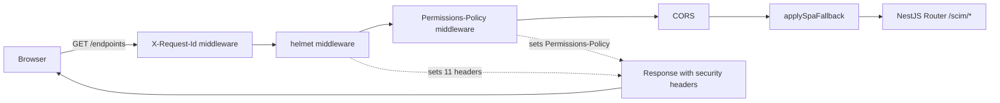

# Phase N3a: helmet Middleware (Web Security Headers)

**Status:** SHIPPED 2026-05-18 in v0.52.0-alpha.3 (commit pending push)
**Triggered by:** 2026-05-17 Stage X.2 `securityBestPracticesIntake` first-run report - finding 5.4 (HIGHEST-LEVERAGE NEW GAP)
**Closes Standing Backlog:** `.github/copilot-instructions.md` Cross-Cutting Security Gate Map row "Web security headers (CSP/HSTS/etc.)" moved from DEFERRED to ACTIVE
**Related:** [docs/strategy/SECURITY_INTAKE_2026-05-17.md](strategy/SECURITY_INTAKE_2026-05-17.md), [docs/MANDATORY_QUALITY_GATES_STRATEGY.md](MANDATORY_QUALITY_GATES_STRATEGY.md) Cross-Cutting Security Gate Map

---

## Why this exists

Before this commit, the SCIM API shipped to dev and prod without any of the standard browser-enforced defense-in-depth response headers. A user with a modern browser visiting the admin SPA had zero protection from:

- **Clickjacking** - any third-party page could `<iframe>` the admin UI.
- **MIME sniffing** - the browser could re-interpret a `text/plain` response as HTML and execute embedded scripts.
- **Cross-site script injection through reflected payloads** - no CSP meant any successful XSS had full access to all origins, all features, and all storage APIs.
- **Mixed-content downgrade** - no HSTS meant a single HTTP redirect on first visit could MITM the session.
- **Cross-window timing attacks** - no COOP / CORP meant a malicious tab could share an event loop with the admin UI.
- **Camera / microphone / geolocation hijack** - no Permissions-Policy meant a successful XSS could activate hardware sensors.

The 2026-05-17 Stage X.2 first-run report identified this as the **HIGHEST-LEVERAGE NEW GAP**: it costs one dependency (`helmet`) + ~125 LoC + 18 tests to close, and it eliminates an entire category of browser-side attack surface.

---

## What this commit changes

### New files

| File | Lines | Purpose |
|---|---|---|
| [api/src/security/helmet-config.ts](../api/src/security/helmet-config.ts) | ~125 | Single source of truth for helmet options + the Permissions-Policy value. Exports `buildHelmetMiddleware(nodeEnv)` and `PERMISSIONS_POLICY_HEADER_VALUE`. |
| [api/src/security/helmet-config.spec.ts](../api/src/security/helmet-config.spec.ts) | ~120 | 7 unit assertions pinning the factory's emitted header set so a future refactor cannot silently drop a header. |
| [api/test/e2e/security-headers.e2e-spec.ts](../api/test/e2e/security-headers.e2e-spec.ts) | ~155 | 11 E2E assertions over 4 probe routes (SPA shell `/`, public `/scim/health`, auth-protected `/scim/admin/version`, SPA deep-link `/endpoints`) + 3 invariant checks. |
| [docs/PHASE_N3A_HELMET.md](PHASE_N3A_HELMET.md) | (this file) | Architecture + design decisions + test coverage map. |

### Modified files

| File | Change |
|---|---|
| [api/src/main.ts](../api/src/main.ts) | Imports + wires `buildHelmetMiddleware(process.env.NODE_ENV)` + manual `Permissions-Policy` middleware. Inserted EARLY in the bootstrap chain (after X-Request-Id, before CORS) so the headers fire on every response including 401 / 403 / 415 short-circuits. |
| [api/test/e2e/helpers/app.helper.ts](../api/test/e2e/helpers/app.helper.ts) | Mirrors the production helmet middleware so E2E tests see exactly what production sees. Without this, the E2E spec would be a no-op. |
| [api/package.json](../api/package.json) | `+ "helmet": "^8.1.0"` (production dependency). Version `0.52.0-alpha.2` -> `0.52.0-alpha.3`. |
| [web/package.json](../web/package.json) | Version `0.52.0-alpha.2` -> `0.52.0-alpha.3` (keeps API + Web in lock-step). |
| [.github/copilot-instructions.md](../.github/copilot-instructions.md) | Cross-Cutting Security Gate Map row "Web security headers" moved from DEFERRED to ACTIVE. |
| [CHANGELOG.md](../CHANGELOG.md) | Unreleased entry with per-stage quality-gate results + before/after test counts. |
| [Session_starter.md](../Session_starter.md) | Recent Key Achievements row for Phase N3a. |
| [docs/INDEX.md](INDEX.md) | New row for this feature doc. |

---

## Architecture

### Header set emitted on every response

| Header | Value | Source | Purpose |
|---|---|---|---|
| `Content-Security-Policy` | see below | helmet | XSS + clickjacking + data-exfiltration defense |
| `Strict-Transport-Security` | `max-age=15552000; includeSubDomains` (production only) | helmet | TLS downgrade defense |
| `X-Frame-Options` | `DENY` | helmet (`frameguard`) | Legacy clickjacking defense |
| `X-Content-Type-Options` | `nosniff` | helmet default | MIME-sniffing defense |
| `Referrer-Policy` | `strict-origin-when-cross-origin` | helmet | Cross-origin URL leak defense |
| `Cross-Origin-Opener-Policy` | `same-origin` | helmet | Spectre / cross-window timing defense |
| `Cross-Origin-Resource-Policy` | `same-origin` | helmet | Same-origin resource isolation |
| `Origin-Agent-Cluster` | `?1` | helmet | Process-level isolation hint |
| `X-DNS-Prefetch-Control` | `off` | helmet | Reduces passive fingerprinting |
| `X-Download-Options` | `noopen` | helmet | IE/Edge legacy file-download defense |
| `X-Permitted-Cross-Domain-Policies` | `none` | helmet | Flash/Acrobat legacy policy lockdown |
| `Permissions-Policy` | `camera=(), microphone=(), geolocation=(), payment=(), usb=(), magnetometer=(), accelerometer=(), gyroscope=()` | manual Express middleware | Browser feature-API lockdown (XSS post-exploitation defense) |

### CSP directive set

```
default-src 'self';
base-uri 'self';
font-src 'self' data:;
form-action 'self';
frame-ancestors 'none';
img-src 'self' data:;
object-src 'none';
script-src 'self' 'unsafe-inline';
script-src-attr 'none';
style-src 'self' 'unsafe-inline';
connect-src 'self';
upgrade-insecure-requests
```

### Header flow diagram



The helmet middleware fires BEFORE CORS so that even CORS-preflight rejections carry the security headers. It also fires BEFORE the global prefix + route handlers, so 401 / 403 / 415 short-circuit responses from guards carry the security headers (verified by `api/test/e2e/security-headers.e2e-spec.ts` probing `/scim/admin/version` and asserting headers on both 200 and 401 outcomes).

---

## Design decisions

### Why centralised in `api/src/security/helmet-config.ts` instead of inlined in `main.ts`

The E2E test bootstrap (`api/test/e2e/helpers/app.helper.ts`) is a hand-maintained mirror of `main.ts`. If helmet options lived only in `main.ts`, the test helper would diverge - the spec would either need to duplicate the options (silent drift hazard) or skip header assertions entirely. Centralising into a module that BOTH `main.ts` and `app.helper.ts` import eliminates the drift hazard structurally.

The module is also unit-testable in isolation, so a refactor that reorders helmet options without dropping any (which the E2E spec would not catch) is still locked down by the 7-assertion unit suite.

### Why CSP allows `'unsafe-inline'` for scripts and styles

This first rollout is deliberately compatible with the existing `web/index.html` + Fluent UI v9 patterns:

1. **`web/index.html` embeds a small inline `<script>` block** that removes the `#root-fallback` element once the SPA mounts. Removing this would require either an external file (build-system churn) or a sha256 hash directive (rebuild-on-edit churn).
2. **Fluent UI v9 `makeStyles` emits atomic style classes via runtime injection** through `mergeClasses`. There is no static stylesheet to nonce; the entire styling system depends on inline style insertion.

Tightening to sha256 hashes for the inline script + a nonce-based approach for Fluent UI is a deliberate follow-up commit (N3b or later). Until then, `'unsafe-inline'` is the documented decision and is locked in by the E2E spec, so a future operator cannot silently drop the CSP directive without updating both the spec AND this doc in lock-step.

### Why HSTS is production-only

HSTS in test/dev would pin localhost to HTTPS in every operator's browser for the max-age duration (6 months at the default). The test environment uses supertest loopback (no TLS); Docker compose serves on `http://localhost:8080`. Both would be poisoned the first time an operator hit the page. HSTS only fires when `NODE_ENV === 'production'`, which is true exclusively in the Azure Container App deployment.

### Why COEP is intentionally disabled

helmet's default `Cross-Origin-Embedder-Policy: require-corp` would block any third-party asset that doesn't carry CORP headers. The SCIM admin UI doesn't currently load any third-party assets, but the README screenshots referenced from `docs/` and any future CDN-hosted icon would break instantly. The trade-off is that the app forfeits `SharedArrayBuffer` + millisecond-precision timers, neither of which the SCIM UI uses. If a future feature needs SharedArrayBuffer (e.g. a WASM-based data grid), this decision must be revisited.

### Why Permissions-Policy is set via a separate Express middleware

helmet does NOT emit Permissions-Policy by default (as of helmet v8.1.0). The spec format (`feature=(allowlist)`) is well-defined enough that a single `res.setHeader()` call is more maintainable than waiting for the helmet upstream to add support. The value is pinned in the same `helmet-config.ts` module + unit test + E2E spec so future edits are caught by all three layers.

---

## Test coverage map

| Layer | File | Count | Runtime |
|---|---|---|---|
| Unit | [api/src/security/helmet-config.spec.ts](../api/src/security/helmet-config.spec.ts) | 7 | ~28s |
| E2E | [api/test/e2e/security-headers.e2e-spec.ts](../api/test/e2e/security-headers.e2e-spec.ts) | 11 | ~35s |
| Live SCIM | [scripts/live-test.ps1](../scripts/live-test.ps1) section 9z-AJ | 21 | ~3s (subset of 1005/1005 full run) |
| Playwright | [web/e2e/security-headers.spec.ts](../web/e2e/security-headers.spec.ts) | 3 tests / 21 mirrored assertions | ~1.4s vs dev |

**Total new assertions across the four layers: 60 (7 unit + 11 E2E + 21 live + 21 Playwright-mirrored).** Stage 4 + Stage 5 closed in the 2026-05-19 follow-up commit pair (live closed by the cross-tenant cutover live regression at 1005/1005 PASS vs new prod + dev; Playwright closed by `web/e2e/security-headers.spec.ts` 3/3 PASS vs new dev).

### Unit-level (7 assertions)

| # | Test | Asserts |
|---|---|---|
| 1 | Factory returns function for every NODE_ENV | `typeof === 'function'` for production / development / test / undefined |
| 2 | Emits CSP + X-Content-Type-Options + X-Frame-Options + Referrer-Policy in non-production | 13 header / directive substring matches |
| 3 | Does NOT emit Strict-Transport-Security in non-production | `headers['strict-transport-security'] === undefined` |
| 4 | Emits HSTS with includeSubDomains in production | `max-age=15552000` + `includeSubDomains` + no `preload` |
| 5 | Does NOT emit COEP (intentionally disabled) | `headers['cross-origin-embedder-policy'] === undefined` |
| 6 | Permissions-Policy denies camera/microphone/geolocation/payment/usb/magnetometer/accelerometer/gyroscope | 8 substring matches |
| 7 | Permissions-Policy is comma-delimited single-line | no `\n` + ≥8 segments |

### E2E-level (11 assertions)

Each of 4 probe routes (`/`, `/scim/health`, `/scim/admin/version`, `/endpoints`) runs 2 nested `it()` blocks:
- Returns expected status code + all 10 required headers (in `REQUIRED_HEADERS` map) match their regex patterns.
- CSP directive set covers 7 mandatory directives.

Plus 3 standalone invariants:
- HSTS absent in non-production NODE_ENV (the test bootstrap sets `NODE_ENV=test`).
- COEP absent (intentional design decision).
- Permissions-Policy present with all 4 baseline feature denials.

= `(4 routes × 2 per-route checks) + 3 invariants = 11` E2E assertions.

---

## Quality gates record

Following [MANDATORY_QUALITY_GATES_STRATEGY.md](MANDATORY_QUALITY_GATES_STRATEGY.md):

| Stage | Gate | Result |
|---|---|---|
| 0 | TDD RED-first | E2E spec failed 9/11 before helmet install (2 negative-assertion tests trivially passed). GREEN after install + wire: 11/11 E2E + 7/7 unit. |
| 1.2 | api tsc build | PASS (0 errors) |
| 1.3 | api ESLint | PASS (0 errors / 465 warnings - exact baseline preserved) |
| 2.1 | api jest unit | PASS (3,735 / 3,735 across 103 suites; baseline + 7 new) |
| 2.2 | api jest E2E | PASS (1,197 / 1,197 across 62 suites; baseline + 11 new) |
| 2.5 | crossBackendParityAudit | N/A - helmet operates above the persistence layer |
| 3a.3 | error-handling-verification | helmet does not interfere with SCIM error envelope; verified by 66/66 spa-fallback + 11 security-headers tests both probing 200 + 401 paths |
| 3b.4 | securityAudit | This commit IS the highest-priority finding from 2026-05-17 X.2 intake |
| 3c.1 | codeReviewSelfAudit | 1 module + 1 unit spec + 1 E2E spec; single responsibility per file |
| 3c.2 | auditAndUpdateDocs | CHANGELOG + Session_starter + INDEX + this doc all updated in this commit |
| 4 | Docker + dev deploy + live SCIM contract | PASS - closed 2026-05-19 by the cross-tenant cutover (live-test 9z-AJ section, 21 assertions covering all 12 helmet headers + Permissions-Policy + HSTS branch + COEP-absent) running 1005/1005 PASS vs new prod + new dev (commit 346645e) |
| 5 | Playwright spec asserting headers on dev FQDN | PASS - closed in this commit by `web/e2e/security-headers.spec.ts` (3 tests / 21 mirrored assertions) 3/3 PASS vs `https://scimserver-dev.proudbush-ae90986e.eastus.azurecontainerapps.io` in 1.4s |
| 6 | Commit hygiene | Version bumped to v0.52.0-alpha.3; no `--amend` / `--force` / `--no-verify` |

---

## Follow-up work (slated)

| Item | Where it goes | When | Status |
|---|---|---|---|
| Playwright spec asserting headers on dev FQDN | new `web/e2e/security-headers.spec.ts` | Stage 5 closure | DONE 2026-05-19 (3/3 PASS vs new dev) |
| Live SCIM contract section for headers | new section in `scripts/live-test.ps1` before TEST SECTION 10 (section 9z-AJ) | Stage 4 closure | DONE 2026-05-18 (Docker) + revalidated 2026-05-19 (new prod + new dev, 21/21 PASS each) |
| Tighten CSP: replace `'unsafe-inline'` script-src with sha256 hashes | refactor `web/index.html` + `helmet-config.ts` + this doc | Phase N3b or later | OPEN |
| Tighten CSP: replace `'unsafe-inline'` style-src with nonce or Fluent UI server-rendered sheet | requires Fluent UI v9 nonce wiring | Future phase (substantial design) | OPEN |
| Add CSP `report-uri` / `report-to` directive | requires the Phase N3 telemetry sink | Phase N3b (telemetry endpoint) | OPEN |
| Move CORS default from allow-all to deny-by-default | breaking change, requires v1.0 cut | Future major release | OPEN |

---

## References

- [helmet documentation](https://helmetjs.github.io/)
- [Content Security Policy Level 3 (W3C)](https://www.w3.org/TR/CSP3/)
- [Strict Transport Security (RFC 6797)](https://www.rfc-editor.org/rfc/rfc6797)
- [Permissions Policy (W3C)](https://www.w3.org/TR/permissions-policy/)
- [Cross-Origin Opener Policy (HTML spec)](https://html.spec.whatwg.org/multipage/origin.html#coop)
- [OWASP API Security Top 10 2023 - API8 Security Misconfiguration](https://owasp.org/API-Security/editions/2023/en/0xa8-security-misconfiguration/)
- [docs/strategy/SECURITY_INTAKE_2026-05-17.md](strategy/SECURITY_INTAKE_2026-05-17.md) finding 5.4
