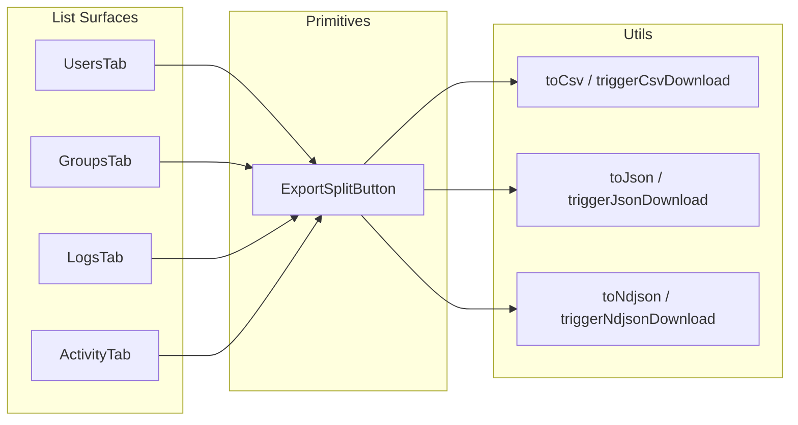

# Phase N3 - Export Everywhere (CSV / JSON / NDJSON)

**Status**: SHIPPED in v0.52.0-alpha.4
**Branch**: feat/ui
**Commits**: `03691e8` (foundation) -> `0be5147` (UsersTab) -> `e13bc0a` (GroupsTab) -> `49cb9eb` (LogsTab + ActivityTab) -> this commit (docs + Playwright + version bump)

---

## 1. Goal

Bring a uniform, accessible, keyboard-friendly **Export** affordance to every list surface in the operator UI so that an operator can pull the currently-rendered page out to disk in any of the three industry-standard tabular formats without leaving the screen.

| Surface       | Format Coverage   | Filename Pattern                          |
|---------------|-------------------|--------------------------------------------|
| UsersTab      | CSV / JSON / NDJSON | `users-<endpointId>-<UTC stamp>.<ext>`    |
| GroupsTab     | CSV / JSON / NDJSON | `groups-<endpointId>-<UTC stamp>.<ext>`   |
| LogsTab       | CSV / JSON / NDJSON | `logs-<endpointId>-<UTC stamp>.<ext>`     |
| ActivityTab   | CSV / JSON / NDJSON | `activity-<endpointId>-<UTC stamp>.<ext>` |

UTC stamp format: `YYYYMMDDTHHMMSSZ`. CSV reuses the field set previously used in BulkTab + OperationsPage; JSON ships pretty-printed (2-space indent); NDJSON ships one compact JSON object per line, no trailing newline.

---

## 2. Architecture

### Why a single primitive?
- One Fluent UI `Menu` + `MenuTrigger` + `MenuList` instance per surface.
- One set of testids (`export-button`, `export-menu-csv|json|ndjson`) reused across every Vitest + Playwright suite.
- One disable rule (`eagerEmpty = rows defined && rows.length === 0`) reused.
- One UTC stamp generator reused (no per-surface time-format drift).

### Why pretty JSON + compact NDJSON?
- Pretty JSON matches what an operator would paste into a bug report or share over Teams.
- NDJSON is the line-delimited variant downstream log/ETL pipelines expect; pretty-printing it would break record boundaries.

---

## 3. Module map

| File | Role |
|---|---|
| [web/src/utils/csv-export.ts](../web/src/utils/csv-export.ts) | All format helpers (`toCsv` / `toJson` / `toNdjson`) and Blob-driven download triggers |
| [web/src/components/primitives/ExportSplitButton.tsx](../web/src/components/primitives/ExportSplitButton.tsx) | Toolbar primitive used on every list surface |
| [web/src/pages/UsersTab.tsx](../web/src/pages/UsersTab.tsx) | Wire site 1 |
| [web/src/pages/GroupsTab.tsx](../web/src/pages/GroupsTab.tsx) | Wire site 2 |
| [web/src/pages/LogsTab.tsx](../web/src/pages/LogsTab.tsx) | Wire site 3 |
| [web/src/pages/ActivityTab.tsx](../web/src/pages/ActivityTab.tsx) | Wire site 4 |

---

## 4. Test coverage

### Vitest (unit + integration)

| Suite | New Tests | What it locks |
|---|---|---|
| [web/src/utils/csv-export.test.ts](../web/src/utils/csv-export.test.ts) | +14 | `toJson` indent/empty, `toNdjson` empty/multi/single, Blob MIME types, trigger functions |
| [web/src/components/primitives/ExportSplitButton.test.tsx](../web/src/components/primitives/ExportSplitButton.test.tsx) | +8 | Menu rendering, eager vs lazy rows, disabled state, UTC stamp format, all three formats |
| [web/src/pages/UsersTab.test.tsx](../web/src/pages/UsersTab.test.tsx) | +3 | Toolbar wire + CSV row projection |
| [web/src/pages/GroupsTab.test.tsx](../web/src/pages/GroupsTab.test.tsx) | +2 | Toolbar wire + flattened group rows (memberCount derivation) |
| [web/src/pages/LogsTab.test.tsx](../web/src/pages/LogsTab.test.tsx) | +2 | Toolbar wire + flattened log rows |
| [web/src/pages/ActivityTab.test.tsx](../web/src/pages/ActivityTab.test.tsx) | +2 | Toolbar wire + flattened activity rows |
| **Total** | **+31** | Vitest 909 -> 940 |

### Playwright (browser-side, dev FQDN)

[web/e2e/export.spec.ts](../web/e2e/export.spec.ts) - smoke spec: visits Users tab on dev, asserts `export-button` testid is present, opens the menu, asserts all three menu items render with their testids.

---

## 5. Mandatory Quality Gates honored

Per the standing rule (`copilot-instructions.md` Stages 0-6), every Phase N3 commit honored:

- **Stage 0 (TDD)**: every commit was RED-first. Confirmed in terminal output for commits 1-4.
- **Stage 1.4 (tsc)**: web `npx tsc --noEmit` prod-file baseline of 9 errors preserved across all commits.
- **Stage 2.3 (vitest)**: full sweep passes after each commit. 909 -> 931 -> 934 -> 936 -> 940.
- **Stage 6 (commit hygiene)**: em-dash scan + version bump deferred until commit 5 (this commit), per "don't bump version mid-phase" convention.

---

## 6. Why this design

| Choice | Why |
|---|---|
| Split-button (single primary `Export` + dropdown for format) | Default action (CSV) is the most common path for spreadsheet workflows; dropdown surfaces JSON/NDJSON without cluttering the toolbar |
| Per-surface row projection (not auto-inferred) | Avoids leaking unrelated SCIM fields (e.g. `meta.version`, `_internal`) into the export; operator sees what they see on screen |
| Eager `rows` array (not lazy callback) | The current page is already in memory from TanStack Query; lazy projection would re-walk the response on click for no benefit |
| Disable when `rows.length === 0` | Prevents downloading an empty file which is almost always operator error |
| UTC stamp in filename | Stable sort order, no local-time ambiguity, matches BulkTab/OperationsPage convention |

---

## 7. Next steps (out of scope for N3)

- **Server-side export** (full table dump, not just current page) - deferred to Phase O if telemetry shows operator demand.
- **Per-column toggle** (operator picks which columns to include) - deferred; current column sets match what BulkTab/OperationsPage publish and have been operator-validated.
- **Excel `.xlsx`** - deferred; CSV opens in Excel cleanly today and adding the `xlsx` package would add ~280 KiB to the bundle.
