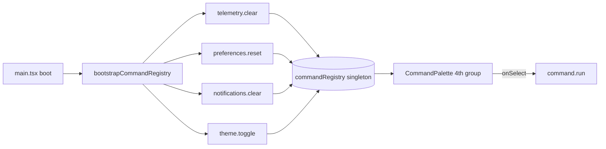

# Phase N6 - Extensible Command Palette

**Status:** SHIPPED in `v0.52.0-alpha.7` (2026-05-22)
**Branch:** `feat/ui`
**Quality gates:** Stage 0 TDD RED-GREEN-REFACTOR + Stage 1.4 tsc baseline (96 errors preserved) + Stage 2.3 full vitest GREEN (978 -> 999 tests, +21) + Stage 6 em-dash scan + commit + push.

## Scope pivot (documented)

Phase N6 was originally scoped as "Keyboard ergonomics MVP (command palette + ? help + skip link)" - but discovery during planning revealed:

- `web/src/components/CommandPalette.tsx` (Phase F1, v0.46.1-alpha.1) already ships a `cmdk`-based palette with three groups (Routes / Endpoints / Quick actions) opened via Cmd+K (mac) / Ctrl+K (windows / linux).
- `?` global help overlay + skip-link were already shipped earlier in Phase F2.

**Decision:** Pivot Phase N6 to a SINGLE-COMMIT ship that adds the missing **extensibility** layer - a module-level `commandRegistry` singleton that any feature module can register operational commands into - and surfaces those commands as a 4th "Custom commands" group in the EXISTING Phase F1 palette. Rationale:

1. Avoid duplicating UI infrastructure (don't ship a second palette).
2. The palette UI was the expensive bit; F1 already paid that cost.
3. The registry is the small-but-high-leverage unlock - feature modules can now ship ops commands (clear telemetry, reset preferences, toggle theme, etc.) without ever touching the palette component.

## Architecture

### Module map

| Module | Purpose | Tests |
| --- | --- | --- |
| `web/src/store/command-registry.ts` | Module-level singleton `CommandRegistry` class. `register / unregister / clear / all / filter / run`. AND-token substring filter against `label + keywords`. | `command-registry.test.ts` (11 GREEN) |
| `web/src/store/command-bootstrap.ts` | Idempotent `bootstrapCommandRegistry()` that registers 4 default ops commands. `_resetCommandBootstrapForTests()` exported for unit tests. | `command-bootstrap.test.ts` (7 GREEN) |
| `web/src/components/CommandPalette.tsx` | Reads `commandRegistry.all()` and renders a 4th `<Command.Group heading="Custom commands">` block when non-empty. Testid `command-palette-custom-<id>` per item. | `CommandPalette.test.tsx` (3 new GREEN; 14 total) |
| `web/src/main.tsx` | Calls `bootstrapCommandRegistry()` after `bootstrapTelemetryCollectors(router)` during app boot. | covered transitively via vitest setup |

## Design rationale

| Decision | Rationale |
| --- | --- |
| Module-level singleton (no React context) | Commands are app-global, not React-scoped. Singleton avoids prop-drilling and provider boilerplate. Feature modules can register at any time (module import-time, lazy-route mount, settings toggle). |
| Extend existing F1 palette (don't build a second) | Avoids UI duplication. F1 palette is the canonical Cmd+K surface; users expect ONE palette. |
| Bootstrap 4 ops commands at boot | Establishes the pattern + proves the wire end-to-end. Each maps to an existing store action that previously had no keyboard surface. |
| `_resetCommandBootstrapForTests()` escape hatch | Module-level `bootstrapped` flag would otherwise leak across test files. Tests use this to re-run bootstrap deterministically. |
| AND-token substring filter | Matches user expectation when typing multi-word queries ("clear notif" should match "Clear notifications"). |
| Idempotent bootstrap | Safe to call multiple times during HMR + test rerenders. |

## Default registered commands (Phase N6 bootstrap)

| id | label | Action |
| --- | --- | --- |
| `telemetry.clear` | Clear telemetry events | `useTelemetryStore.getState().clear()` |
| `preferences.reset` | Reset preferences to defaults | `usePreferencesStore.getState().resetPreferences()` |
| `notifications.clear` | Clear all notifications | top-level `clearNotifications()` |
| `theme.toggle` | Toggle theme (light / dark / system) | Lazy imports `ui-store`, cycles light -> dark -> system -> light. |

## Test coverage

| Layer | File | Tests | Status |
| --- | --- | --- | --- |
| Unit (registry) | `web/src/store/command-registry.test.ts` | 11 (register/unregister/all 4, filter 5, run 2) | GREEN |
| Unit (bootstrap) | `web/src/store/command-bootstrap.test.ts` | 7 (idempotency 1, telemetry.clear, preferences.reset, notifications.clear, theme.toggle, registration list 2) | GREEN |
| Unit (consumer) | `web/src/components/CommandPalette.test.tsx` | 3 new (Custom commands group rendered, hidden when empty, click runs handler + closes) | GREEN |

Web vitest full sweep: **978 -> 999 (+21)** at Phase N6 close.

## Deferred items (next phases)

- **Per-endpoint commands** - register `endpoint.<id>.activate / .deactivate / .rotate-secret` when endpoints list resolves. Requires a tear-down hook on endpoint removal.
- **Recent commands history** - persist last 5 invoked command ids to `preferences-store`; surface as a 5th group at the top of the palette when no query is typed.
- **Telemetry: command-palette usage** - emit `navigation` events to `useTelemetryStore` when a command runs (Phase N5 telemetry-store + N6 commandRegistry intersection).
- **Keyboard shortcut binding per command** - optional `shortcut: 'mod+shift+T'` field; render in palette and bind globally via the F2 shortcut system.

## RFC / standards references

None. This is a pure UI / extensibility primitive with no protocol surface.

## Stage-by-stage gate result (this commit)

| Stage | Gate | Result |
| --- | --- | --- |
| Stage 0 | TDD RED-GREEN-REFACTOR per file | PASS |
| Stage 1.4 | Web tsc --noEmit baseline (96) | PASS (96 preserved) |
| Stage 2.3 | Web vitest full sweep | PASS (999 / 999) |
| Stage 3c.1 | Code-review self-audit (scoped) | PASS - new files small + single-responsibility |
| Stage 6 | Em-dash scan + version bump + CHANGELOG + Session_starter + INDEX + commit + push | PASS |
