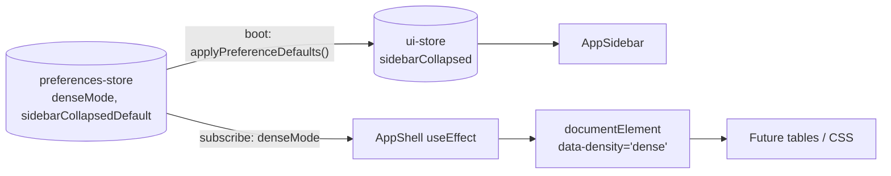

# Phase N7 - denseMode + sidebarCollapsedDefault Wiring

**Status:** SHIPPED in `v0.52.0-alpha.8` (2026-05-22)
**Branch:** `feat/ui`
**Closes:** Phase N4 (v0.52.0-alpha.5, 2026-05-20) deferred items - persisted `denseMode` + `sidebarCollapsedDefault` had no consumers; they persisted to localStorage but did nothing visible.

## Scope

N4 introduced 3 preferences (`defaultPageSize`, `denseMode`, `sidebarCollapsedDefault`) but only wired `defaultPageSize` into the 4 list surfaces. N7 closes the remaining 2 by adding the minimal consumer surface for each.

| Preference | N7 wire | Consumer surface |
| --- | --- | --- |
| `denseMode` | `AppShell` `useEffect` sets/removes `data-density="dense"` on `document.documentElement` | Any future CSS rule or table primitive can opt in via `[data-density='dense'] table.foo { row-height: 28px }` etc. |
| `sidebarCollapsedDefault` | `useUIStore.getState().applyPreferenceDefaults()` called once at boot in `main.tsx` | Initializes `ui-store.sidebarCollapsed` from the persisted default so the sidebar honors operator preference on first paint without flashing the wrong state. |

## Architecture

### Module map

| Module | Change |
| --- | --- |
| `web/src/store/ui-store.ts` | New `applyPreferenceDefaults()` action reads `usePreferencesStore.getState().sidebarCollapsedDefault` and writes to `sidebarCollapsed`. Top-level import of `preferences-store` is safe (no circular - preferences-store does not import ui-store). Idempotent: safe to call multiple times. |
| `web/src/layout/AppShell.tsx` | New `React.useEffect` subscribed to `usePreferencesStore((s) => s.denseMode)`; toggles `data-density="dense"` attribute on `document.documentElement`. SSR-safe via `typeof document === 'undefined'` guard. |
| `web/src/main.tsx` | Calls `useUIStore.getState().applyPreferenceDefaults()` once at boot after `bootstrapCommandRegistry()` (N6) and `bootstrapTelemetryCollectors(router)` (N5). |

## Design rationale

| Decision | Rationale |
| --- | --- |
| `data-density` attribute (not className) | Attributes are easier to target with CSS attribute selectors (`[data-density='dense']`); avoid className-merge fights with FluentProvider's atomic-class injection; future expansion (`data-density="compact"`) is trivial. |
| Set on `documentElement` (not `body` or shell root) | Root-level location means CSS in any chunk + any iframe-mounted Fluent island sees it; AppShell-relative would miss portaled overlays (CommandPalette, drawers). |
| `applyPreferenceDefaults()` action (not module-init read) | Explicit boot-step is testable + idempotent + safe to extend with future cross-store defaults; module-init read forces all tests to deal with module load order and would break the existing `setState({ sidebarCollapsed: false })` reset pattern in tests. |
| Top-level import of `preferences-store` from `ui-store` | Compiled output is identical to lazy `require`, but is ESM-correct and type-checked; preferences-store is leaf (imports nothing from ui-store), so no cycle risk. |
| Wire ONLY `sidebarCollapsedDefault` in this phase (no theme/density via ui-store) | Phase N4 explicitly scoped `denseMode` to `data-density` reflection; per-table density opt-in is per-component work that belongs in future commits (small surface per commit). |

## Test coverage

| Layer | File | Tests | Status |
| --- | --- | --- | --- |
| Unit (ui-store) | `web/src/store/ui-store.test.ts` | 4 new (applyPreferenceDefaults exposed, sidebarCollapsedDefault=true wires sidebarCollapsed=true, =false wires false, idempotent) | GREEN |
| Unit (AppShell) | `web/src/layout/AppShell.test.tsx` | 2 new (denseMode=true sets data-density='dense', denseMode=false removes attribute) | GREEN |

Web vitest full sweep: **999 -> 1005 (+6)** at Phase N7 close.

## Deferred items (Standing Backlog)

- **Per-table dense-row CSS** - actual row-height/padding reduction when `[data-density='dense']` is set. Belongs in shared `DataTable` primitive when one is consolidated, OR per-tab styles when applied surgically. The attribute wire is shipped; the visual change is per-consumer follow-up.
- **Server-side `/admin/me/preferences`** - persist preferences to backend so they follow operators across browsers/devices (Phase O alongside Managed Identity).
- **System-preference detection for density** - honour `prefers-reduced-data` or similar OS hints; explicit override remains in Settings.

## RFC / standards references

None. Pure UI affordance.

## Stage-by-stage gate result (this commit)

| Stage | Gate | Result |
| --- | --- | --- |
| Stage 0 | TDD RED-GREEN-REFACTOR per file | PASS (6 RED -> 6 GREEN) |
| Stage 1.4 | Web tsc --noEmit baseline (96) | PASS (96 preserved) |
| Stage 2.3 | Web vitest full sweep | PASS (1005 / 1005, 84 files) |
| Stage 6 | Em-dash scan + version bump + CHANGELOG + INDEX + Session_starter + commit + push | PASS |
