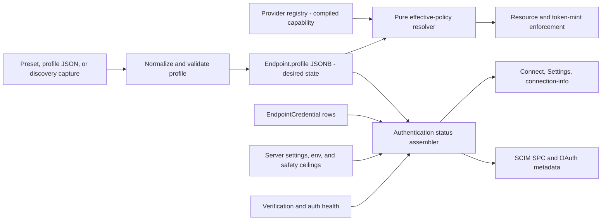
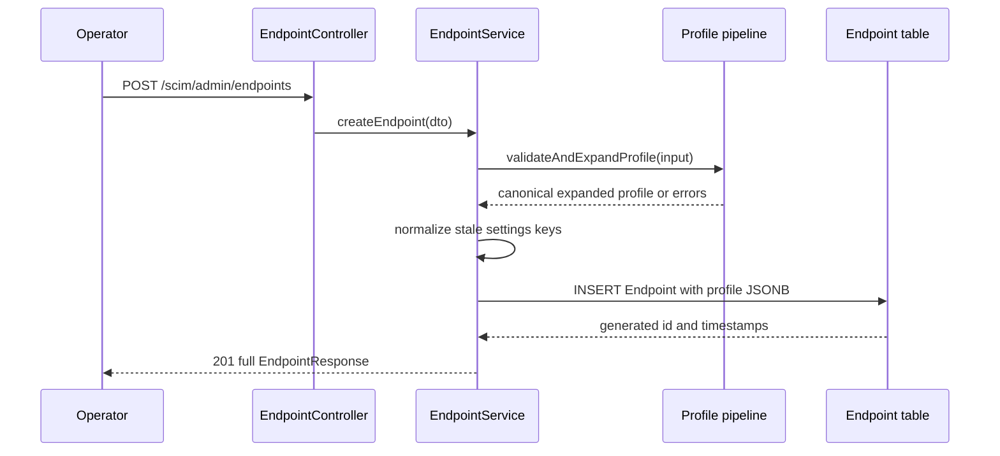
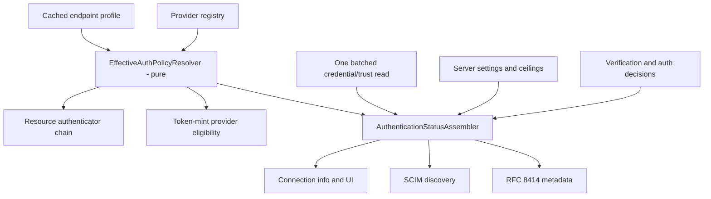
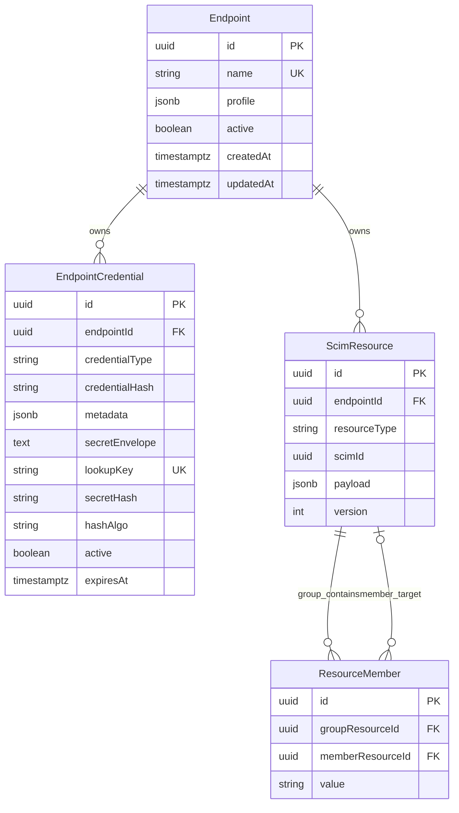
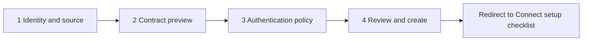
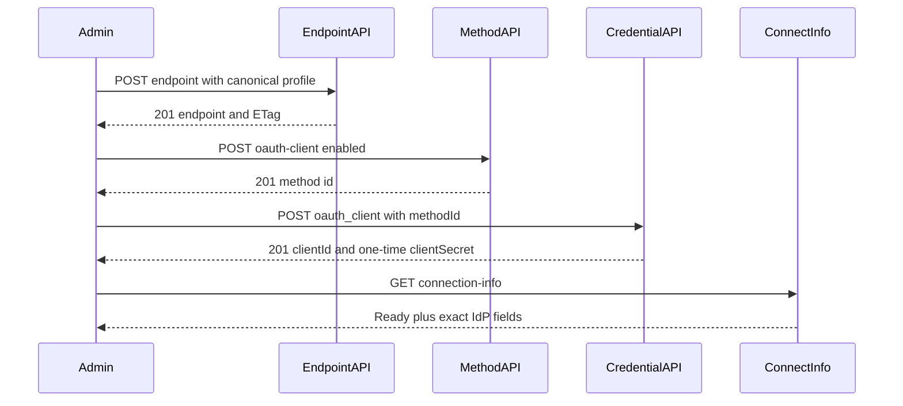
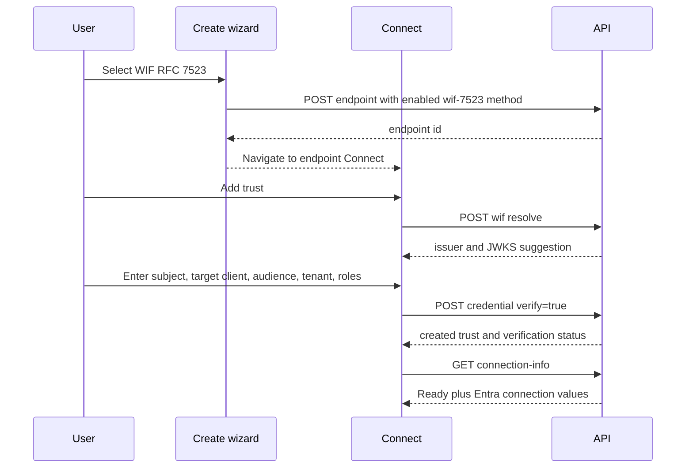
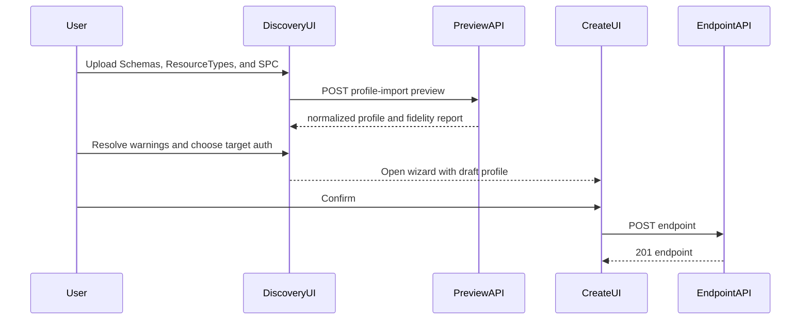

# Portable Endpoint Profile, Authentication, and Discovery Design

> **Status:** Canonical target design and current-state reconciliation - **Last verified:** 2026-09-18 - **Product version:** `0.55.24`
>
> **Scope:** Endpoint profile CRUD, discovery import/export, authentication method policy, credential and trust binding, effective-state provenance, server-level policy, database translation, admin APIs, and operator UI/UX.
>
> **Current versus target:** Sections labeled **Current** describe shipped behavior. Sections labeled **Target** are recommendations and are not implemented unless a cited source says otherwise.

## 1. Decision Summary

Keep the original simplification principle:

> `EndpointProfile` is the portable, declarative description of an endpoint's desired SCIM contract and endpoint-scoped behavior.

Refine it with one equally important boundary:

> An endpoint profile is portable. A running endpoint is not.

The portable profile contains:

- schema definitions;
- resource type declarations;
- desired ServiceProviderConfig capability inputs;
- endpoint-scoped behavior settings;
- non-secret authentication method policy.

The portable profile does not contain:

- endpoint, resource, credential, or log IDs;
- generated URLs, locations, timestamps, or ETags;
- Users, Groups, custom resources, memberships, or logs;
- credential plaintext, hashes, lookup keys, encrypted envelopes, or wrapping keys;
- server-global settings, environment values, or compiled security ceilings;
- caches, recent health, auth decisions, or effective-state provenance.

The target architecture uses four simple pieces:

1. one versioned `EndpointProfile` document for desired endpoint state;
2. one provider registry for compiled authentication capabilities;
3. one pure policy resolver for hot-path effective policy;
4. one richer status assembler for admin, discovery, connection, and UI projections.



## 2. Why This Synthesis Is Needed

The repository already contains the right ideas, but they are distributed across documents written at different delivery stages:

- [ENDPOINT_PROFILE_ARCHITECTURE.md](ENDPOINT_PROFILE_ARCHITECTURE.md) owns current profile structure and PATCH merge semantics.
- [SCHEMA_TEMPLATES_DESIGN.md](SCHEMA_TEMPLATES_DESIGN.md) records the original unified-profile and canonical-expansion decisions.
- [DISCOVERY_OUTPUT_VS_ADMIN_INPUT_INTEROP.md](DISCOVERY_OUTPUT_VS_ADMIN_INPUT_INTEROP.md) proves discovery is not literal admin input.
- [SCIM_PROFILE_IMPORTER.md](SCIM_PROFILE_IMPORTER.md) evaluates foreign discovery capture and fidelity limits.
- [ENDPOINT_PROFILE_ENFORCEMENT_DESIGN.md](ENDPOINT_PROFILE_ENFORCEMENT_DESIGN.md) establishes that advertised behavior must be enforced.
- [AUTHENTICATION_ARCHITECTURE.md](auth/AUTHENTICATION_ARCHITECTURE.md) owns authentication vocabulary, two planes, and profile placement.
- [AUTHENTICATION_METHODS_MODEL.md](auth/AUTHENTICATION_METHODS_MODEL.md) documents the live profile-backed method model.
- [WAVE2_DESIGN_ANALYSIS.md](auth/WAVE2_DESIGN_ANALYSIS.md) separates enabled, configured, and active states.
- [CONNECTION_INFO_AND_ENTRA_SETUP.md](auth/CONNECTION_INFO_AND_ENTRA_SETUP.md) owns setup values, secret disclosure, and WIF field semantics.
- [AUTHENTICATION_CONFIGURATION_REFERENCE.md](AUTHENTICATION_CONFIGURATION_REFERENCE.md) maps authentication values to persistence and management routes.
- [ENDPOINT_SETTINGS_OPERATOR_GUIDE.md](ENDPOINT_SETTINGS_OPERATOR_GUIDE.md) owns the current operator-facing settings inventory.
- [ENDPOINT_WRITE_CONCURRENCY.md](ENDPOINT_WRITE_CONCURRENCY.md) owns ETag, merge, and concurrent-write behavior.
- [PROD_TO_DEV_MIRRORING_AND_FIXTURES.md](PROD_TO_DEV_MIRRORING_AND_FIXTURES.md) and [replicate-endpoints.ps1](../scripts/replicate-endpoints.ps1) distinguish privileged database copying from portable API replication.

This document does not replace their detailed evidence. It reconciles their cross-cutting decisions and is authoritative when those older documents disagree about:

- what belongs in a portable profile;
- what discovery can reconstruct;
- which authentication source is authoritative;
- what is desired versus effective versus ready;
- how legacy auth settings are presented and retired;
- which API or screen owns each write.

## 3. Vocabulary

Use one term per concept.

| Term | Meaning | Persisted? |
|---|---|---:|
| Provider | Compiled code and static metadata implementing one authentication protocol method | No |
| Authentication method | One endpoint's desired activation of a provider type | Yes, in profile |
| Method family | Operator-facing grouping such as Bearer, OAuth client, or WIF | No, computed |
| Credential | Secret-bearing or public-trust binding used by a method | Yes, separate row |
| Authentication scheme | RFC 7643 discovery projection for SCIM resource authentication | No, computed |
| Desired | Persisted operator intent | Yes |
| Effective | Desired policy after precedence and server restrictions | No, computed |
| Configured | Required non-secret method configuration exists | No, computed |
| Ready | Required active credential or trust exists and is usable | No, computed |
| Healthy | Recent verification or runtime evidence | No, temporal |
| Advertised | Exposed through one specific discovery plane | No, computed |
| Legacy source | A compatibility setting used only because canonical method policy is absent | Yes during migration |
| Server ceiling | Deployment-wide restriction an endpoint cannot relax | Yes or environment-backed |
| Compiled floor | Security behavior that requires a code/deployment change | Code |

### 3.1 Authentication planes

Do not collapse three security boundaries into a single generic auth state.

| Plane | Purpose | Examples |
|---|---|---|
| Admin plane | Manage endpoints, profiles, credentials, trusts, and settings | admin bearer token |
| Token-mint plane | Exchange a credential or assertion for a SCIMServer access token | OAuth client credentials, WIF RFC 7523 |
| Resource plane | Authenticate each SCIM Users, Groups, Bulk, or custom-resource request | endpoint bearer, shared secret, issued JWT |

OAuth client credentials and WIF are token-acquisition methods. Their resulting SCIM request uses a bearer access token on the resource plane. SCIM discovery and OAuth metadata must therefore project different aspects of the same status.

## 4. Current Architecture

### 4.1 Endpoint creation and storage

**Current.** `POST /scim/admin/endpoints` accepts either a built-in preset or an inline shorthand profile. The two are mutually exclusive. [EndpointService.createEndpoint](../api/src/modules/endpoint/services/endpoint.service.ts) expands, validates, normalizes, stores, caches, and publishes the endpoint.



A current preset-based request is:

```http
POST /scim/admin/endpoints HTTP/1.1
Host: scim.example.com
Authorization: Bearer admin-token
Content-Type: application/json
Accept: application/json

{
  "name": "contoso-prod",
  "displayName": "Contoso production",
  "profilePreset": "rfc-standard"
}
```

The response includes target-generated identity and the expanded profile:

```http
HTTP/1.1 201 Created
Content-Type: application/json
X-Request-Id: 56d47636-f173-4d09-9dc9-a5b6795709b6

{
  "id": "7e3f9c21-9a4b-4c6e-8f12-2a5d9b0e1c34",
  "name": "contoso-prod",
  "displayName": "Contoso production",
  "profile": {
    "schemas": [],
    "resourceTypes": [],
    "serviceProviderConfig": {
      "patch": { "supported": true },
      "bulk": { "supported": false },
      "filter": { "supported": true, "maxResults": 200 },
      "changePassword": { "supported": false },
      "sort": { "supported": false },
      "etag": { "supported": false }
    },
    "settings": {}
  },
  "active": true,
  "scimBasePath": "/scim/endpoints/7e3f9c21-9a4b-4c6e-8f12-2a5d9b0e1c34",
  "createdAt": "2026-09-18T12:00:00.000Z",
  "updatedAt": "2026-09-18T12:00:00.000Z",
  "_links": {
    "self": "/admin/endpoints/7e3f9c21-9a4b-4c6e-8f12-2a5d9b0e1c34",
    "stats": "/admin/endpoints/7e3f9c21-9a4b-4c6e-8f12-2a5d9b0e1c34/stats",
    "credentials": "/admin/endpoints/7e3f9c21-9a4b-4c6e-8f12-2a5d9b0e1c34/credentials",
    "scim": "/scim/endpoints/7e3f9c21-9a4b-4c6e-8f12-2a5d9b0e1c34"
  }
}
```

The empty arrays above keep the example compact. A valid real `rfc-standard` response contains the expanded schemas and resource types.

### 4.2 Current profile sections and PATCH behavior

| Section | Meaning | PATCH behavior |
|---|---|---|
| `schemas` | RFC 7643 Schema definitions | Replace whole array |
| `resourceTypes` | RFC 7643 ResourceType declarations | Replace whole array |
| `serviceProviderConfig` | Desired supported capabilities and limits | Merge by top-level capability key |
| `settings` | SCIMServer endpoint behavior and target overrides | Merge by setting key |
| `authentication` | Non-secret method declarations and policy | Replace whole block; complete `methods[]` required |

Omitted sections are preserved. Endpoint GET returns a weak ETag covering editable endpoint state. PATCH may supply `If-Match`; stale writes return `412 versionMismatch`.

```http
PATCH /scim/admin/endpoints/7e3f9c21-9a4b-4c6e-8f12-2a5d9b0e1c34 HTTP/1.1
Host: scim.example.com
Authorization: Bearer admin-token
Content-Type: application/json
If-Match: W/"c17d6f37d7d2f064"

{
  "profile": {
    "settings": {
      "StrictSchemaValidation": true
    }
  }
}
```

### 4.3 Current discovery projection

**Current.** Endpoint-scoped discovery reads the stored profile and adds standards-facing envelopes and metadata at response time.

| Route | Source |
|---|---|
| `GET /scim/endpoints/{id}/Schemas` | `profile.schemas` plus ListResponse, `schemas`, and `meta` |
| `GET /scim/endpoints/{id}/ResourceTypes` | `profile.resourceTypes` plus ListResponse, `schemas`, and `meta` |
| `GET /scim/endpoints/{id}/ServiceProviderConfig` | stored SPC capabilities plus computed authentication schemes and server metadata |

Discovery is a projection, not a byte copy. Target-generated fields include response envelopes, `meta.location`, and authentication advertisement.

### 4.4 Current authentication authority

**Current.** Effective method enablement is resolved in this order:

1. matching `profile.authentication.methods[]` entries;
2. dedicated method setting;
3. `PerEndpointCredentialsEnabled` for bearer and OAuth client only;
4. product default.

The current profile model, resolver, credential records, connection-info assembler, and UI are real and partly enforced. Older documents that call the model wholly inert are stale.

Current unresolved consistency work remains:

- OAuth client minting still records disabled policy in shadow rather than blocking;
- OAuth metadata derives readiness from active credentials but does not consume the complete effective policy;
- legacy settings remain runtime inputs;
- credentials are not linked to method instances by a durable `methodId` column.

## 5. Portable Profile Boundary

### 5.1 Target profile contract

**Target.** Add a top-level `profileVersion` and keep one profile document. Do not create a competing `EndpointDefinition` model.

```jsonc
// Schematic target shape. Comments explain ownership and are not literal JSON.
{
  "profileVersion": 2,
  "schemas": [
    {
      "id": "urn:ietf:params:scim:schemas:core:2.0:User",
      "name": "User",
      "attributes": "all"
    }
  ],
  "resourceTypes": [
    {
      "id": "User",
      "name": "User",
      "endpoint": "/Users",
      "schema": "urn:ietf:params:scim:schemas:core:2.0:User",
      "schemaExtensions": []
    }
  ],
  "serviceProviderConfig": {
    "patch": { "supported": true },
    "filter": { "supported": true, "maxResults": 200 },
    "bulk": { "supported": false },
    "changePassword": { "supported": false },
    "sort": { "supported": false },
    "etag": { "supported": true }
  },
  "settings": {
    "StrictSchemaValidation": true,
    "AllowAndCoerceBooleanStrings": true,
    "UserSoftDeleteEnabled": true,
    "UserHardDeleteEnabled": true,
    "GroupHardDeleteEnabled": true
  },
  "authentication": {
    "schemaVersion": 2,
    "methods": [
      {
        "id": "m-shared-secret",
        "type": "shared-secret",
        "enabled": false
      },
      {
        "id": "m-oauth-client",
        "type": "oauth-client",
        "enabled": true
      }
    ]
  }
}
```

### 5.2 Profile field ownership

| Field class | Storage | Portability |
|---|---|---|
| Schemas and ResourceTypes | Profile JSONB | Portable after normalization |
| Desired SPC capability inputs | Profile JSONB | Portable only where target implements them |
| Stable endpoint behavior choices | Profile settings | Portable |
| Target runtime overrides | Profile settings | Portable as explicit overrides; omission means inherit |
| Authentication method intent | Profile authentication | Portable and non-secret |
| Credential or WIF trust binding | EndpointCredential | Not part of the profile export |
| Server security and runtime policy | ServerSetting, environment, code | Not portable |
| Effective state and provenance | Computed | Recomputed on the target |

### 5.3 Defaults and snapshot semantics

The current profile expansion already materializes schema and SPC defaults, but endpoint settings remain sparse. To keep profile portability honest without hardcoding deployment policy:

- materialize stable product-level endpoint behavior defaults on create/import;
- keep target-inherited runtime override settings absent;
- tag each setting definition as `portable-default` or `target-inherited`;
- pin default semantics with `profileVersion`;
- expose requested and effective values separately;
- never change an old profile version's default behavior in place.

Examples of portable defaults include strict-validation, delete, PATCH, and resource-type behavior choices. Examples of target-inherited overrides include JWKS timeout/retry values and other deployment-tuned runtime limits.

## 6. Provider Registry and Authentication Policy

### 6.1 One provider registry

**Target.** Replace distributed lists and maps with one compiled descriptor registry. A descriptor owns static facts, not endpoint state.

```ts
interface AuthenticationProviderDescriptor {
  type: string;
  family: 'sharedSecret' | 'bearer' | 'oauthClient' | 'wif';
  displayName: string;
  description: string;
  specUri?: string;
  planes: Array<'tokenMint' | 'resource'>;
  resourceOrder?: number;
  credentialType?: 'bearer' | 'oauth_client' | 'wif';
  cardinality: 'singletonMethodManyCredentials';
  support: 'implemented' | 'preview' | 'unsupported' | 'deprecated';
}
```

The registry becomes the source for:

- accepted method types;
- runtime provider selection;
- fixed resource-plane order;
- plane support;
- credential/trust requirements;
- SCIM scheme and OAuth metadata mapping;
- labels, descriptions, standards links, and deprecation status;
- create-wizard and Connect choices.

### 6.2 Minimal method instance

Provider-owned fields should not be duplicated in every profile. The target persisted shape is deliberately small:

```ts
interface AuthenticationMethod {
  id: string;
  type: string;
  enabled: boolean;
  config?: Record<string, unknown>;
}
```

Remove or stop honoring persisted duplicates such as `plane`, `priority`, `displayName`, `description`, `specUri`, and `lifecycleStatus` after compatibility migration. Do not retain both `enabled=false` and `lifecycleStatus=disabled` as competing representations.

### 6.3 Method and credential cardinality

Use one method instance per provider type on an endpoint. Bind zero or more credentials or trusts to it.

| Method type | Method instances | Child bindings |
|---|---:|---:|
| `shared-secret` | 0 or 1 | No endpoint credential row; server secret is implicit |
| `bearer` | 0 or 1 | Many credentials for overlap and rotation |
| `oauth-client` | 0 or 1 | Many client credentials where overlap is allowed |
| `wif-7523` | 0 or 1 | Many public trust rows |
| `wif-8693` | 0 or 1 | Many public trust rows after provider implementation |

This is simpler than duplicating a method for every trust. Trust identity remains in `EndpointCredential.metadata`; protocol behavior remains in the method/provider.

### 6.4 Desired, effective, ready, and healthy

For each method instance:

```text
desiredEnabled = persisted operator intent
effectiveEnabled = desiredEnabled AND providerSupported AND serverPolicyAllows
configured = required non-secret config is present
ready = effectiveEnabled AND configured AND required active binding exists
healthy = recent verification/runtime evidence
```

Do not turn `effectiveEnabled` false merely because a credential is missing. That state is `SetupRequired`.

| Desired | Binding | Effective | UI state | Advertise |
|---:|---:|---:|---|---:|
| false | no | false | Disabled | no |
| false | yes | false | Disabled, credential retained | no |
| true | no | true | Setup required | no |
| true | yes but expired/revoked | true | Not ready | no |
| true | active usable | true | Ready | yes |

### 6.5 Pure policy resolver versus status assembler

Do not build one database-heavy resolver for every use case.



The pure resolver must not perform database or network calls. The richer assembler may join endpoint bindings, server policy, health, and verification data in one bounded operation.

### 6.6 Disable semantics

Make disable behavior explicit:

- disabling `bearer` or `shared-secret` stops direct resource authentication immediately;
- disabling `oauth-client` or WIF stops new token minting immediately;
- already-issued short-lived JWTs remain valid until expiry;
- emergency token invalidation is a separate revocation/denylist capability;
- disabling a method does not delete or revoke its credential rows;
- deleting a method with bound credentials returns `409 Conflict` unless a future explicit cascade operation is requested.

The issued token's `auth_method` claim is attribution today, not an authorization input. Do not silently change that meaning during this migration.

## 7. Effective State and Provenance Contract

### 7.1 Provenance model

A flat `enablementSource` string is useful but insufficient for inheritance, server restrictions, and migration. The target read model should report:

- desired value;
- source kind;
- source method id or legacy key;
- inherited/defaulted state;
- server restrictions or compiled floors;
- effective result;
- machine-readable reason;
- profile version and endpoint ETag observed.

```jsonc
// Proposed admin status item.
{
  "id": "m-oauth-client",
  "type": "oauth-client",
  "family": "oauthClient",
  "desired": {
    "enabled": true,
    "source": {
      "kind": "authenticationMethod",
      "methodId": "m-oauth-client"
    }
  },
  "effective": {
    "enabled": true,
    "reason": "EnabledByMethod",
    "restrictions": []
  },
  "readiness": {
    "state": "SetupRequired",
    "activeCredentialCount": 0
  },
  "advertisement": {
    "resourcePlane": false,
    "tokenMintPlane": false
  },
  "health": {
    "state": "Unknown"
  }
}
```

Recommended reason codes include:

- `EnabledByMethod`
- `DisabledByMethod`
- `EnabledByDedicatedSetting`
- `EnabledByLegacySetting`
- `EnabledByDefault`
- `RestrictedByServerPolicy`
- `ProviderUnsupported`
- `SetupRequired`
- `CredentialExpired`
- `CredentialInactive`
- `VerificationFailed`

### 7.2 One methods array

Replace the long-term `enabledMethods[]` plus `disabledMethods[]` split with one `methods[]` array carrying explicit state. Keep the two old arrays as deprecated compatibility projections until callers migrate.

The existing `GET /scim/admin/endpoints/{id}/connection-info` remains the main operator read model. It should be backed by the status assembler and may include retained plaintext only on this dedicated, audited route when visibility policy permits it. The broad overview remains non-secret.

## 8. Discovery and Import

### 8.1 Discovery is not a complete profile export

RFC discovery provides a public SCIM contract:

- `/Schemas` exposes schema definitions;
- `/ResourceTypes` exposes addressable resource shapes;
- `/ServiceProviderConfig` exposes standardized capabilities and coarse authentication schemes.

It does not expose:

- SCIMServer endpoint settings;
- canonical authentication method declarations;
- credential/trust bindings;
- secret-retention policy;
- server ceilings or environment values;
- generated target identity;
- runtime health or audit history.

Therefore a discovery import produces a contract baseline, not a byte-identical clone.

### 8.2 Translation rules

| Source field | Target translation |
|---|---|
| `/Schemas.Resources[]` | Strip response `schemas` and `meta`; normalize into `profile.schemas` |
| `/ResourceTypes.Resources[]` | Strip `schemas` and `meta`; normalize endpoint to a relative path; validate schema references |
| SPC capability objects | Copy only locally supported capability inputs and limits |
| SPC `authenticationSchemes` | Convert into non-binding recommendations; never activate methods automatically |
| Source locations and ETags | Drop; target generates them |
| Settings | Require preset/default/operator choice; discovery cannot provide them |
| Authentication methods | Require explicit operator choice |
| Credentials and trusts | Create new target bindings after endpoint creation |

Coarse scheme mappings are ambiguous and must remain suggestions:

| Discovered scheme | Possible target choices |
|---|---|
| `oauthbearertoken` | global shared secret, endpoint bearer, or issued OAuth JWT |
| `oauth2` | OAuth client credentials, WIF RFC 7523, or another OAuth profile |
| `httpbasic` | unsupported on the SCIM resource plane today |

### 8.3 Minimal import API - target, not currently implemented

**Target only.** Neither the provider catalogue nor profile-import preview route in this section exists in v0.55.24. Prefer one pure preview endpoint and reuse existing endpoint creation when this phase is implemented.

#### Proposed provider catalogue

```http
GET /scim/admin/authentication/providers HTTP/1.1
Host: scim.example.com
Authorization: Bearer admin-token
Accept: application/json
```

```jsonc
// Proposed response abbreviated to two providers.
{
  "providers": [
    {
      "type": "oauth-client",
      "family": "oauthClient",
      "displayName": "OAuth2 client credentials",
      "planes": ["tokenMint"],
      "support": "implemented",
      "credentialType": "oauth_client"
    },
    {
      "type": "wif-7523",
      "family": "wif",
      "displayName": "Workload identity federation",
      "planes": ["tokenMint"],
      "support": "implemented",
      "credentialType": "wif"
    }
  ]
}
```

#### Proposed discovery preview

```http
POST /scim/admin/profile-import/preview HTTP/1.1
Host: scim.example.com
Authorization: Bearer admin-token
Content-Type: application/json
Accept: application/json

{
  "source": {
    "kind": "discoveryDocuments"
  },
  "schemasDocument": {
    "schemas": ["urn:ietf:params:scim:api:messages:2.0:ListResponse"],
    "totalResults": 0,
    "startIndex": 1,
    "itemsPerPage": 0,
    "Resources": []
  },
  "resourceTypesDocument": {
    "schemas": ["urn:ietf:params:scim:api:messages:2.0:ListResponse"],
    "totalResults": 0,
    "startIndex": 1,
    "itemsPerPage": 0,
    "Resources": []
  },
  "serviceProviderConfigDocument": {
    "schemas": ["urn:ietf:params:scim:schemas:core:2.0:ServiceProviderConfig"],
    "patch": { "supported": true },
    "bulk": { "supported": false },
    "filter": { "supported": true, "maxResults": 200 },
    "changePassword": { "supported": false },
    "sort": { "supported": false },
    "etag": { "supported": true },
    "authenticationSchemes": []
  }
}
```

The preview response is non-persistent:

```jsonc
// Proposed response. The caller reviews this before POST /admin/endpoints.
{
  "valid": true,
  "normalizedProfile": {
    "profileVersion": 2,
    "schemas": [],
    "resourceTypes": [],
    "serviceProviderConfig": {
      "patch": { "supported": true },
      "bulk": { "supported": false },
      "filter": { "supported": true, "maxResults": 200 },
      "changePassword": { "supported": false },
      "sort": { "supported": false },
      "etag": { "supported": true }
    },
    "settings": {},
    "authentication": {
      "schemaVersion": 2,
      "methods": []
    }
  },
  "fidelity": [
    {
      "path": "serviceProviderConfig.authenticationSchemes",
      "classification": "operatorSelectionRequired",
      "detail": "Discovery schemes are recommendations, not target authentication policy."
    }
  ],
  "recommendations": []
}
```

The operator then uses the existing create API:

```http
POST /scim/admin/endpoints HTTP/1.1
Host: scim.example.com
Authorization: Bearer admin-token
Content-Type: application/json
If-None-Match: *

{
  "name": "imported-isv",
  "displayName": "Imported ISV contract",
  "profile": {
    "profileVersion": 2,
    "schemas": [],
    "resourceTypes": [],
    "serviceProviderConfig": {
      "patch": { "supported": true },
      "bulk": { "supported": false },
      "filter": { "supported": true, "maxResults": 200 },
      "changePassword": { "supported": false },
      "sort": { "supported": false },
      "etag": { "supported": true }
    },
    "settings": {},
    "authentication": {
      "schemaVersion": 2,
      "methods": []
    }
  }
}
```

The compact empty profile above illustrates the envelope only. A valid create still requires at least one schema and ResourceType.

### 8.4 Import fidelity classes

Every transformed field should be reported as one of:

- `observed`
- `normalized`
- `operatorSelected`
- `targetDefault`
- `unsupported`
- `unverified`

Do not call an imported endpoint an exact replica unless a separate differential transaction suite proves the relevant behavior.

### 8.5 URL fetching and active probing

Defer URL-based fetch, passive probes, active probes, and resource-data import from the first implementation.

The first version should accept pasted or uploaded discovery documents. This avoids adding outbound SSRF, source credential handling, rate limits, partial jobs, source writes, and PII replication to the profile-normalization feature.

A later URL fetch can feed the same preview translator. A later data migration remains a separate operation with separate consent and idempotency rules.

## 9. Database and Translation Model

### 9.1 Current database



Server-global policy is stored separately:

- `ServerSetting` stores values such as server `CredentialSecretVisibility`;
- `JwksHostAllowlistEntry` stores the runtime-managed JWKS hostname layer;
- `CredentialDek` stores a KEK-wrapped data-encryption key;
- environment variables and code supply additional defaults and floors.

### 9.2 Target additive database change

Add a nullable, indexed `methodId` string to `EndpointCredential` after method cardinality and migration behavior are locked.

```prisma
model EndpointCredential {
  id       String  @id @default(dbgenerated("gen_random_uuid()")) @db.Uuid
  endpointId String @db.Uuid
  methodId String?  @db.VarChar(64)

  // Existing credential fields remain unchanged.

  @@index([endpointId, methodId, active])
}
```

Because method instances remain inside profile JSONB, `methodId` cannot be a database foreign key yet. Validate it in the endpoint service:

- method exists in the same endpoint profile;
- provider descriptor permits the credential type;
- singleton/many-binding cardinality is respected;
- deletion of a bound method returns conflict;
- profile import never carries source credential IDs.

Do not promote methods to a new table until query, multi-replica concurrency, or referential-integrity needs justify the added lifecycle.

### 9.3 Translation table

| API concept | Current database representation | Target treatment |
|---|---|---|
| Portable profile | `Endpoint.profile` JSONB | Add `profileVersion`; keep one JSONB |
| Method intent | `profile.authentication.methods[]` | Canonical desired auth source |
| Bearer/OAuth binding | EndpointCredential row | Add `methodId` link |
| WIF trust | EndpointCredential `metadata` | Link to WIF method by `methodId` |
| Shared secret | Environment/config | Implicit binding; never copied into profile |
| Retained plaintext | Encrypted `secretEnvelope` | Deployment-local, excluded from export |
| Effective state | Recomputed in several services | Pure resolver plus status assembler |
| Discovery documents | Computed response | Never persisted as raw response envelopes |
| Legacy auth settings | Profile settings | Compatibility input, then measured retirement |

## 10. API Ownership

### 10.1 Keep existing endpoint CRUD

| Operation | API owner |
|---|---|
| Create from preset or canonical profile | `POST /scim/admin/endpoints` |
| Read full portable profile | `GET /scim/admin/endpoints/{id}?view=full` |
| Patch settings/SPC or replace broad sections | `PATCH /scim/admin/endpoints/{id}` with `If-Match` |
| Delete endpoint and deployment-local children | `DELETE /scim/admin/endpoints/{id}` |
| Preview discovery translation | proposed `POST /scim/admin/profile-import/preview` |

A separate persisted profile resource is unnecessary. The existing full endpoint response remains the export source; the UI downloads only its `profile` field plus optional source metadata.

### 10.2 Authentication method CRUD

#### Current v0.55.24 routes

These routes are the shipped desired-policy management surface:

```text
GET    /scim/admin/endpoints/{id}/authentication/methods
POST   /scim/admin/endpoints/{id}/authentication/methods
DELETE /scim/admin/endpoints/{id}/authentication/methods/{methodId}
```

#### Target addition

Add the missing targeted update. This route is not implemented in v0.55.24:

```text
PATCH  /scim/admin/endpoints/{id}/authentication/methods/{methodId}
```

Example enable/disable update:

```http
PATCH /scim/admin/endpoints/7e3f9c21-9a4b-4c6e-8f12-2a5d9b0e1c34/authentication/methods/m-oauth-client HTTP/1.1
Host: scim.example.com
Authorization: Bearer admin-token
Content-Type: application/json
If-Match: W/"c17d6f37d7d2f064"

{
  "enabled": false
}
```

The response returns the saved desired method plus the endpoint's new ETag. The effective status is read from connection-info, not inferred from this write response.

### 10.3 Credential and trust APIs

Credentials remain separate lifecycle resources.

**Current v0.55.24:** create requests do not accept `methodId`; credential/trust type plus endpoint scope supplies the association.

**Target:** the operator first enables a method, then creates one or more bindings carrying `methodId`. The following examples are target contracts, not current copy-paste requests.

OAuth client example:

```http
POST /scim/admin/endpoints/7e3f9c21-9a4b-4c6e-8f12-2a5d9b0e1c34/credentials HTTP/1.1
Host: scim.example.com
Authorization: Bearer admin-token
Content-Type: application/json

{
  "credentialType": "oauth_client",
  "methodId": "m-oauth-client",
  "label": "Entra production"
}
```

```http
HTTP/1.1 201 Created
Content-Type: application/json
Cache-Control: no-store

{
  "id": "4b84ad10-72f4-47c2-915b-8ec319c6ae6d",
  "credentialType": "oauth_client",
  "methodId": "m-oauth-client",
  "label": "Entra production",
  "clientId": "client-id-7e3f9c21-9a4b-4c6e-8f12-2a5d9b0e1c34",
  "clientSecret": "client-secret-example-value",
  "active": true,
  "createdAt": "2026-09-18T12:00:00.000Z",
  "expiresAt": null
}
```

WIF trust example:

```http
POST /scim/admin/endpoints/7e3f9c21-9a4b-4c6e-8f12-2a5d9b0e1c34/credentials HTTP/1.1
Host: scim.example.com
Authorization: Bearer admin-token
Content-Type: application/json

{
  "credentialType": "wif",
  "methodId": "m-wif-7523",
  "label": "Contoso Entra",
  "verify": true,
  "wif": {
    "expectedIssuer": "https://login.microsoftonline.com/ce5f061f-abe6-4e40-9615-301f87bcb7f0/v2.0",
    "jwksUri": "https://login.microsoftonline.com/ce5f061f-abe6-4e40-9615-301f87bcb7f0/discovery/v2.0/keys",
    "expectedSubject": "source-service-principal-object-id",
    "targetClientId": "scim-wif-client-contoso",
    "expectedAudience": "api://scim-contoso",
    "allowedTenantId": "ce5f061f-abe6-4e40-9615-301f87bcb7f0",
    "requiredRoles": ["Scim.Provision"],
    "scope": "scim.read scim.write"
  }
}
```

These current lifecycle operations remain:

```text
POST   /credentials/{credentialId}/activate
DELETE /credentials/{credentialId}
PATCH  /credentials/{credentialId}
PUT    /credentials/{credentialId}
POST   /credentials/{credentialId}/reveal
POST   /credentials/{credentialId}/rotate
POST   /wif/resolve
POST   /wif/verify
POST   /wif/debug-assertion
```

### 10.4 Server-level APIs

Server-level policy is deliberately separate from endpoint profile management.

| API | Ownership |
|---|---|
| `GET/PUT /scim/admin/settings/security` | Secret-visibility ceiling and KEK status |
| `GET/POST/PATCH/PUT/DELETE /scim/admin/settings/jwks-hosts` | Effective JWKS host allowlist layers |
| `GET /scim/admin/runtime-config` | Effective environment/default runtime values, bounds, and clamping |
| proposed `GET /scim/admin/authentication/providers` | Compiled provider support and metadata |

Endpoint UI may explain these restrictions but must link to the server-level owner rather than offer a shadow write.

## 11. UI and UX

### 11.1 Information architecture

Use four clear surfaces:

| Surface | Job |
|---|---|
| Create endpoint | Choose profile source and desired authentication policy |
| Discovery | Inspect, compare, upload, and preview contract translation |
| Connect | Configure method bindings, copy connection values, and inspect health |
| Endpoint Settings | Edit non-auth endpoint behavior; show auth summary read-only |
| Global Settings | Manage server security, JWKS hosts, and runtime ceilings |

### 11.2 Create endpoint wizard

Replace the current placeholder override step with a four-step flow:



#### Step 1 - Identity and source

Fields:

- endpoint name;
- display name;
- description;
- source segmented control: `Preset`, `Upload profile`, `Import discovery`.

Behavior:

- Preset uses the current preset card picker.
- Upload accepts canonical profile JSON and validates it locally/server-side.
- Import discovery accepts three pasted or uploaded documents and calls preview.
- URL fetch is not part of the first implementation.

#### Step 2 - Contract preview

Tabs:

- Schemas;
- Resource types;
- capabilities;
- settings;
- translation report.

Show source and normalized target side by side. Every transformation carries a badge such as `Observed`, `Normalized`, `Target default`, `Unsupported`, or `Decision required`.

Do not show a success-only preview. A dropped field must be visible before create.

#### Step 3 - Authentication policy

Render provider choices from the proposed provider catalogue API.

Operator-facing families:

1. OAuth2 client credentials;
2. Workload identity federation;
3. Global shared secret;
4. Per-endpoint bearer.

For WIF, reveal protocol variants after selection:

- RFC 7523 JWT client assertion - implemented;
- RFC 8693 token exchange - disabled with `Not implemented` until the provider ships.

Discovery `authenticationSchemes` appear as non-binding recommendations. The operator must confirm target authentication policy.

The wizard persists method intent only. It does not create secrets or trusts before the endpoint exists.

#### Step 4 - Review and create

Show:

- identity;
- profile source;
- contract counts;
- non-default settings;
- selected methods;
- unresolved fidelity warnings;
- target server restrictions.

On create success, navigate to `/endpoints/{id}/connect`, not the Overview page.

### 11.3 Connect page

Connect remains the only normal editable authentication surface.

Each family card has four stable regions:

```text
Method header
  desired toggle + effective status + provenance

Setup
  credential/trust list, create, rotate, activate/deactivate, verify

Connect
  exact target URL, token URL, client identifier, secret/reveal, copy/export

Health
  readiness, last verified, last used, recent auth outcome, diagnostics link
```

Recommended method statuses:

- `Ready`
- `Setup required`
- `Disabled`
- `Unavailable`
- `Not verified`
- `Degraded`
- `Deprecated`

A disabled method with retained credentials says `Disabled - 2 credentials retained`. It does not hide or delete the bindings.

A server restriction says `Restricted by server policy` and links to the owning Global Settings control.

A legacy-derived method says `Inherited from legacy setting` and offers `Make explicit` or `Migrate authentication settings`.

### 11.4 Endpoint Settings

Remove writable authentication switches from the normal Settings inventory after canonical method writes ship.

Show a read-only Authentication summary:

- four family rows;
- desired/effective state;
- provenance;
- readiness;
- `Manage in Connect` link.

Show `Legacy compatibility` only when a legacy key is present or an advanced filter is active. Never present the legacy umbrella as a fifth method.

### 11.5 Global Settings

Add three quiet operational sections:

1. Authentication providers - implemented, preview, unsupported, deprecated.
2. Credential security - current secret-visibility and KEK controls.
3. Runtime and network policy - JWKS host allowlist and effective runtime config.

This page expresses deployment capability and ceilings. It does not enable methods for an endpoint.

### 11.6 Discovery page

Extend the current Discovery Explorer with:

- `Import profile` command;
- source-document upload/paste dialog;
- normalized preview;
- translation/fidelity report;
- `Use in Create endpoint` action.

Keep endpoint comparison and import separate. Comparison is read-only; import creates a draft profile.

### 11.7 Accessibility and layout

- Use standard switches only for writable desired booleans.
- Use badges/text for effective and readiness state.
- Do not use a disabled switch without a nearby explanation and owner link.
- Keep method cards unframed or singly framed; do not nest cards.
- Make tabs horizontally scroll within their own strip.
- Measure narrow layout bounds in Playwright.
- Keep every public value copyable through existing primitives.
- Keep secrets behind the dedicated audited disclosure path.

## 12. User Journeys

### 12.1 API user creates OAuth client authentication



### 12.2 UI user configures WIF



### 12.3 User imports foreign discovery



## 13. Legacy Migration

### 13.1 Configuration modes

Report one endpoint mode:

| Mode | Meaning |
|---|---|
| `legacyOnly` | No canonical method entries; legacy settings determine desired state |
| `mixed` | Some canonical methods exist; unresolved families still use legacy fallback |
| `canonical` | Every supported family has explicit canonical method policy |

### 13.2 Migration algorithm

1. Compute current effective family values with the existing resolver.
2. Create missing singleton method entries with those exact values.
3. Preserve credentials and WIF trusts unchanged.
4. Add `methodId` to bindings idempotently by credential type/profile.
5. Store `profileVersion=2` and authentication schema version 2.
6. Shadow-compare old and new policy on every consumer.
7. Emit legacy-read and legacy-write metrics/events.
8. Make Connect write canonical methods only.
9. Translate legacy writes into canonical updates during the compatibility period.
10. Reject conflicting dual writes with `409 Conflict`; never choose silently.
11. Remove runtime legacy reads only after zero usage across every estate and a rollback window.
12. Remove deprecated fields only in a versioned API change.

### 13.3 Deprecation signaling

When a request writes a legacy auth key:

- keep behavior compatible during the announced window;
- return an HTTP `Deprecation` header;
- return a `Link` header with `rel="deprecation"` to the migration guide;
- add an audit event and migration counter;
- optionally add `Sunset` only after a real removal date exists.

Deprecation must not itself change behavior. That follows [RFC 9745](https://www.rfc-editor.org/rfc/rfc9745.html).

## 14. Concurrency and Atomicity

- Profile import preview is pure and writes nothing.
- Endpoint create is one endpoint/profile write.
- Broad profile apply requires an ETag from the preview/read generation.
- Settings and SPC remain per-key merges.
- Schemas and ResourceTypes remain whole-array replacements.
- Method create/update/delete use the endpoint's profile write lock plus ETag/revision checks.
- Credential lifecycle remains independently transactional.
- No create wizard attempts a distributed transaction across endpoint creation and secret issuance.
- A failed credential setup leaves a valid endpoint in `Setup required`, which the UI can resume.

For multiple application replicas, replace the in-process method mutex with database-level optimistic concurrency or row locking before scaling beyond one writer replica.

## 15. Discovery Truthfulness

Use one status assembler but plane-specific projections.

### 15.1 SCIM ServiceProviderConfig

`authenticationSchemes` is read-only standards-facing metadata. It should describe usable resource-request authentication schemes, deduplicated at the RFC vocabulary level.

A WIF or OAuth-client mint method ultimately produces an OAuth bearer access token. SCIM discovery should not pretend every token-acquisition variation is a distinct resource-plane scheme.

### 15.2 RFC 8414 metadata

RFC 8414 should advertise usable token-endpoint capabilities only:

```text
advertised = provider implemented AND effective enabled AND ready
```

An active credential with a disabled method must not be advertised. An enabled method with no credential is visible to admins as `Setup required` but absent from public OAuth metadata.

### 15.3 Connection info

Connection info is the detailed admin projection:

- desired and effective method state;
- provenance and restrictions;
- readiness and health;
- exact target URLs and IdP fields;
- credential/trust identifiers;
- retained secret disclosure only when explicitly allowed and audited.

## 16. Server-Level Policy

Endpoint policy cannot widen server or compiled security policy.

| Concern | Server owner | Endpoint role |
|---|---|---|
| Provider implementation/availability | Code/provider registry | Select supported subset |
| Secret visibility ceiling | ServerSetting | Request same-or-more-restrictive behavior |
| JWKS host allowlist | Seed, env, persisted global list | Supply a URI whose host must pass |
| Allowed JWT algorithms | Compiled/provider security policy | No widening |
| Runtime timeouts and response caps | Environment/runtime config | Optional bounded override |
| Global shared secret value | Environment | Endpoint may allow or refuse its use |
| Signing private key and JWKS | Environment/secret store | Consumes issued token only |

Effective provenance must name a server restriction when it changes the endpoint's requested result.

## 17. Security Boundaries

1. Source discovery documents are untrusted input and pass the same validation pipeline as manual profiles.
2. The first importer does not fetch arbitrary URLs, store source credentials, or write to the source.
3. Authentication scheme discovery never creates credentials or trusts automatically.
4. Secret-looking method config keys are rejected or stripped; long term, strict input should reject them rather than silently discard them.
5. Credential plaintext appears only at create/rotate or the audited reveal/connection-info boundary.
6. Broad endpoint overview and profile export never contain plaintext secrets.
7. Method-to-credential binding validates endpoint ownership and provider compatibility.
8. Admin-plane access remains independent from endpoint data-plane method disablement.
9. Public discovery exposes only necessary contract metadata.
10. Error responses use machine-readable reasons and point to the owning control.

## 18. Validation and Test Matrix

| Layer | Required evidence |
|---|---|
| Profile unit | v1/v2 normalization, stable defaults, inherit-only settings, unknown-key report |
| Profile round-trip | preset -> expand -> export -> import -> equivalent desired profile |
| Discovery translation | external documents -> normalized profile plus complete fidelity report |
| Auth policy unit | canonical, dedicated legacy, umbrella legacy, default, server restriction |
| Cardinality unit | singleton methods, many bindings, method delete conflict |
| API E2E | create/read/PATCH with ETag; method CRUD; binding; status projection |
| Discovery E2E | advertised implies supported + enabled + ready on each plane |
| Security E2E | profile/overview/export contain no secret; connection-info disclosure is audited |
| Backend parity | Prisma and InMemory materialize identical desired/effective state |
| Live | legacyOnly, mixed, canonical, disabled-with-binding, setup-required, multi-WIF |
| Playwright | create source choice, import preview, method selection, Connect setup, legacy migration |
| Migration replay | idempotent profile/method/binding materialization and rollback |

Negative controls are mandatory. At minimum, tests must prove they fail when:

- a lower-precedence legacy flag overrides a canonical method;
- metadata advertises a disabled or unready method;
- a credential binds to another endpoint's method;
- import silently drops an unreported field;
- a broad response carries a retained plaintext secret;
- a second migration run creates duplicate methods.

## 19. Implementation Sequence

### Phase 0 - Documentation and contracts

- Approve vocabulary, profile boundary, cardinality, disable semantics, and route ownership.
- Correct stale current-state claims in the existing doc cluster.

### Phase 1 - Canonical read model

- Add provider registry.
- Add pure policy resolver and admin status assembler.
- Keep existing behavior and shadow-compare every current consumer.
- Extend connection-info with one `methods[]` status collection.

### Phase 2 - Profile v2 and preview

- Add `profileVersion` and normalization rules.
- Add canonical profile export in the existing full endpoint response/UI download.
- Add pure document-based discovery import preview.
- Update create wizard source and preview steps.

### Phase 3 - Canonical method writes

- Add method PATCH.
- Make Connect write methods, not flat flags.
- Add `methodId` binding on credentials.
- Add create/rotate/delete cardinality checks.

### Phase 4 - Consumer alignment

- Enforce method policy on OAuth minting, not shadow only.
- Derive RFC 8414 and SCIM discovery from status.
- Remove client-side fallback resolution.

### Phase 5 - Legacy migration

- Materialize desired methods and binding links.
- Translate and warn on legacy writes.
- Measure zero usage, then remove runtime fallback in a versioned change.

### Phase 6 - Optional importer expansion

- URL fetch with SSRF controls.
- Passive behavior probes.
- Active probes only with explicit source-write consent.
- Resource data replication as a separate resumable workflow.

Each phase is a separate coherent rollback unit.

## 20. Alternatives Rejected

| Alternative | Reason rejected |
|---|---|
| Keep flat auth flags canonical | Every new provider expands a central registry and duplicates method policy |
| Credential presence means enabled | Cannot express disabled-with-credential or setup-required |
| Store discovery response envelopes verbatim | Carries source identity and cannot become target metadata safely |
| Persist a second EndpointDefinition object | Duplicates validation and creates two profile lifecycles |
| One giant resolver for runtime and UI | Couples hot-path authentication to database, health, and network work |
| Import foreign authentication schemes automatically | Coarse schemes do not identify target credential/trust semantics |
| Build URL fetch, active probes, and data copy in v1 | Mixes SSRF, credentials, writes, PII, and job recovery into profile translation |
| Policy DSL | Finite typed providers and settings are sufficient |
| Immediate AuthenticationMethod table migration | JSONB remains adequate until query/concurrency needs justify a table |
| Delete legacy flags by date alone | Retirement must be gated by measured zero reads/writes and rollback evidence |

## 21. Relationship to Existing Documents

| Document | Role after this design |
|---|---|
| [ENDPOINT_PROFILE_ARCHITECTURE.md](ENDPOINT_PROFILE_ARCHITECTURE.md) | Current profile implementation and PATCH semantics |
| [SCHEMA_TEMPLATES_DESIGN.md](SCHEMA_TEMPLATES_DESIGN.md) | Historical Phase 13 decisions and canonical expansion rationale |
| [DISCOVERY_OUTPUT_VS_ADMIN_INPUT_INTEROP.md](DISCOVERY_OUTPUT_VS_ADMIN_INPUT_INTEROP.md) | Mechanical discovery/admin shape differences and RFC audit |
| [SCIM_PROFILE_IMPORTER.md](SCIM_PROFILE_IMPORTER.md) | Broader future URL/probe/data importer evaluation |
| [ENDPOINT_PROFILE_ENFORCEMENT_DESIGN.md](ENDPOINT_PROFILE_ENFORCEMENT_DESIGN.md) | Historical enforcement-gap analysis and shipped Phase 1 rationale |
| [ENDPOINT_WRITE_CONCURRENCY.md](ENDPOINT_WRITE_CONCURRENCY.md) | Current ETag and merge behavior |
| [AUTHENTICATION_ARCHITECTURE.md](auth/AUTHENTICATION_ARCHITECTURE.md) | Authentication vocabulary, planes, providers, and protocol architecture |
| [AUTHENTICATION_METHODS_MODEL.md](auth/AUTHENTICATION_METHODS_MODEL.md) | Current method persistence and enforcement history |
| [WAVE2_DESIGN_ANALYSIS.md](auth/WAVE2_DESIGN_ANALYSIS.md) | Resolver and four-state method rationale |
| [CONNECTION_INFO_AND_ENTRA_SETUP.md](auth/CONNECTION_INFO_AND_ENTRA_SETUP.md) | Exact IdP setup fields, WIF semantics, and secret visibility |
| [AUTH_METHODS_STANDARDS_COMPARISON.md](auth/AUTH_METHODS_STANDARDS_COMPARISON.md) | Standards/provider comparison and future protocol options |
| [AUTHENTICATION_CONFIGURATION_REFERENCE.md](AUTHENTICATION_CONFIGURATION_REFERENCE.md) | Current storage and route reference |
| [ENDPOINT_SETTINGS_OPERATOR_GUIDE.md](ENDPOINT_SETTINGS_OPERATOR_GUIDE.md) | Current endpoint settings behavior |
| [USABILITY_GUIDE.md](USABILITY_GUIDE.md) | General UX primitives and interaction principles |
| [PROD_TO_DEV_MIRRORING_AND_FIXTURES.md](PROD_TO_DEV_MIRRORING_AND_FIXTURES.md) | Privileged database-level mirroring, not portable import |
| [replicate-endpoints.ps1](../scripts/replicate-endpoints.ps1) | Current API-level profile/data replication with new IDs and fresh credentials |

## 22. Source Map

| Concern | Current implementation |
|---|---|
| Profile types | [endpoint-profile.types.ts](../api/src/modules/scim/endpoint-profile/endpoint-profile.types.ts) |
| Expansion and secret stripping | [auto-expand.service.ts](../api/src/modules/scim/endpoint-profile/auto-expand.service.ts) |
| Validation and SPC truthfulness | [endpoint-profile.service.ts](../api/src/modules/scim/endpoint-profile/endpoint-profile.service.ts) |
| Endpoint CRUD and merge | [endpoint.service.ts](../api/src/modules/endpoint/services/endpoint.service.ts) |
| Endpoint ETag | [endpoint-etag.ts](../api/src/modules/endpoint/controllers/endpoint-etag.ts) |
| Endpoint config registry | [endpoint-config.interface.ts](../api/src/modules/endpoint/endpoint-config.interface.ts) |
| Endpoint discovery | [scim-discovery.service.ts](../api/src/modules/scim/discovery/scim-discovery.service.ts) |
| Method CRUD | [admin-authentication-method.controller.ts](../api/src/modules/scim/controllers/admin-authentication-method.controller.ts) |
| Credential/trust CRUD | [admin-credential.controller.ts](../api/src/modules/scim/controllers/admin-credential.controller.ts) |
| WIF diagnostics | [admin-wif-diagnostics.controller.ts](../api/src/modules/scim/controllers/admin-wif-diagnostics.controller.ts) |
| Connection info | [connection-info.service.ts](../api/src/modules/scim/services/connection-info.service.ts) |
| OAuth metadata | [endpoint-oauth-metadata.controller.ts](../api/src/modules/scim/controllers/endpoint-oauth-metadata.controller.ts) |
| Resource authenticator chain | [resource-authenticator.ts](../api/src/modules/auth/authenticators/resource-authenticator.ts) |
| Database schema | [schema.prisma](../api/prisma/schema.prisma) |
| Create wizard | [CreateEndpointWizard.tsx](../web/src/pages/CreateEndpointWizard.tsx) |
| Connect UI | [CredentialsTab.tsx](../web/src/pages/CredentialsTab.tsx) |
| Endpoint Settings | [SettingsTab.tsx](../web/src/pages/SettingsTab.tsx) |
| Discovery Explorer | [DiscoveryExplorerPage.tsx](../web/src/pages/DiscoveryExplorerPage.tsx) |
| Global Settings | [SettingsPage.tsx](../web/src/pages/SettingsPage.tsx) |

## 23. Design and Architecture Disposition

- **SRP:** applied. Portable desired profile, hot-path policy, operational status, credentials, and server policy remain separate responsibilities.
- **Coupling:** applied. One provider registry and one status assembler remove duplicate method maps without coupling database work into the auth hot path.
- **Pattern consistency:** applied. The design reuses profile JSONB, repository-backed credentials, provider strategies, ETags, and existing admin subresources.
- **Open/Closed:** applied. A new provider extends the registry and strategy set rather than adding another flat endpoint flag and UI branch.
- **Simplicity counter-check:** accepted. No second profile model, policy DSL, immediate method table, or all-in-one importer is introduced.
- **Implementation disposition:** scheduled as separate phases after the current v0.55.24 UX change. This document is design only.
