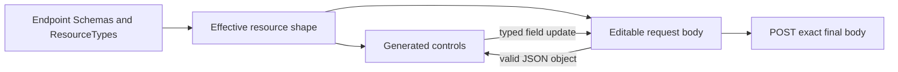

# Profile-Authoritative Resource UI

> **Status:** Implemented locally - **Last verified:** 2026-09-23 - **Product version:** `0.55.28`

## Outcome

Endpoint resource UI is now a projection of the endpoint's live discovery contract instead of a second configuration model.

- User, Group, and custom ResourceType create dialogs share one bidirectional form and JSON editor.
- Control types come from the published attribute definition. Only a non-empty `canonicalValues` array creates a dropdown.
- Runtime profile updates invalidate endpoint detail, Schemas, ResourceTypes, ServiceProviderConfig, and custom-resource caches.
- Removing the selected ResourceType removes its tab and redirects to Resource types.
- Endpoint detail publishes a dedicated Service Provider Config tab.
- The dev reference fixture adds an `AIAgent` custom type and keeps Device `platform` as an unconstrained string.

## State Ownership



`ProfileResourceBodyEditor` owns the synchronization boundary. Known profile fields are projected from the current JSON body. A control edit updates only its matching core or extension member and preserves unrelated operator-authored members. A valid JSON-object edit replaces the draft and immediately updates all known controls. Invalid JSON or a non-object value stays visible for correction and disables submission.

## Attribute Mapping

| Published shape | Control |
|---|---|
| Boolean | Switch |
| Integer or decimal | Numeric input |
| Scalar with non-empty `canonicalValues` | Dropdown |
| Other scalar, including dateTime and reference | Text input |
| Complex or multi-valued | JSON editor |
| `mutability: readOnly` | Not editable |

The Device fixture deliberately publishes `platform` without `canonicalValues`, so it renders as text. AIAgent deliberately publishes controlled `status` and `riskTier` values, so those render as dropdowns.

## Endpoint Discovery

The endpoint Service Provider Config route is:

```text
/endpoints/{endpointId}/service-provider-config
```

It shows capability support, filter and bulk limits, authentication schemes, documentation links, and the complete copyable discovery JSON. The data comes from the endpoint-scoped `/ServiceProviderConfig`, never the global root document.

## Runtime Resource Types

Endpoint detail tabs derive from `profile.resourceTypes[]`. Profile mutation and `scim.endpoint.updated` events invalidate:

- endpoint detail and overview;
- `/Schemas`;
- `/ResourceTypes` and `/ServiceProviderConfig`;
- all custom-resource lists for the endpoint.

If the current User, Group, or custom ResourceType route is no longer declared, the layout replaces the stale route with the Resource types tab.

## AIAgent Reference Type

`AIAgent` is a project-defined SCIM ResourceType for AI identity and governance inventory. It is not presented as a standardized SCIM schema.

| Attribute | Type | Characteristics |
|---|---|---|
| `agentId` | string | required, immutable, server unique |
| `displayName` | string | required |
| `description` | string | optional |
| `status` | string | active, paused, retired |
| `riskTier` | string | low, moderate, high, critical |
| `provider`, `model`, `purpose` | string | optional |
| `capabilities` | string | multi-valued |
| `owner` | reference | external reference |
| `active` | boolean | optional |
| `lastReviewAt` | dateTime | optional |

The shape is compatible with RFC 7643 custom schemas and ResourceTypes while reflecting current AI inventory concepts from Microsoft Entra Agent ID, NIST AI RMF, and ISO/IEC 42001.

## Validation

- Full web Vitest/coverage: 1,514/1,514 across 113 files.
- Focused web unit slice: 149/149; review-fix slice: 125/125.
- Profile browser workflow: 1/1, including AIAgent canonical, multi-valued, reference, boolean, and dateTime controls.
- SPC click and deep-link browser checks: 2/2.
- Fixture parser: 0 errors; self-test: 16/16.
- Production build: passed.
- Route budgets: 25/25, SPC 1.47 kB gzipped / 110 kB.

Full-suite, live, merged-master deployment, named fixture application, and dev visual verification are consolidation gates and are recorded in the changelog when complete.