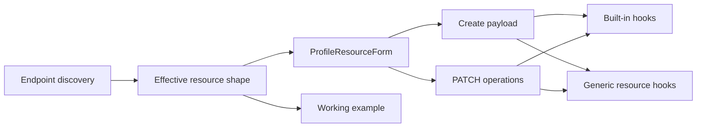
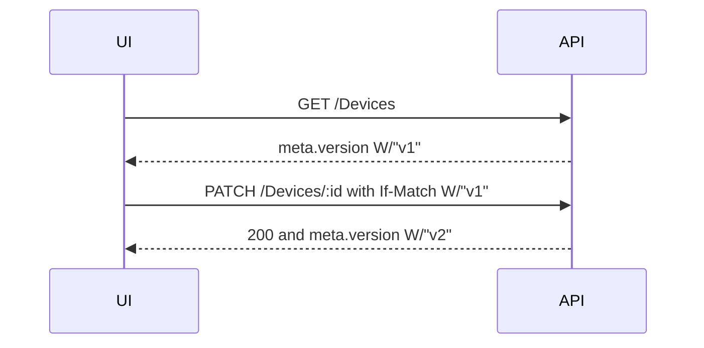

# Profile-Driven Resource Forms and Custom Resources

> **Status:** Implemented - **Last verified:** 2026-09-23 - **Product version:** `0.55.26`

## Purpose

SCIM resource create and edit workflows now derive their fields from each endpoint's published `/Schemas` and `/ResourceTypes` metadata. User, Group, and custom ResourceType instances share one form, example, payload, and PATCH engine.

## Operator Experience

- Users and Groups expose **Create** actions in both populated and empty states.
- Existing User and Group drawers edit every writable core and extension attribute declared by the endpoint profile.
- Each custom ResourceType appears as a first-class endpoint tab with list, create, edit, and delete workflows.
- Manual Provision renders one tab per endpoint ResourceType and reuses the same generated form.
- Resource Types shows each type's effective core plus extension schema paths and characteristics.
- Forms begin with working examples. The adjacent request preview is the exact JSON submitted.

## Architecture



The owning modules are:

| Module | Responsibility |
|---|---|
| `web/src/resources/profile-resource-shape.ts` | Combine core and extension schemas, exclude read-only fields from forms, generate examples, build create payloads, and build changed-field PATCH operations. |
| `web/src/resources/ProfileResourceForm.tsx` | Render text, number, boolean, canonical-value, complex, and multi-valued controls from field descriptors. |
| `web/src/resources/CreateProfileResourceDialog.tsx` | Provide a reusable create flow with a copyable live request preview. |
| `web/src/pages/GenericResourcesTab.tsx` | List and manage instances of an arbitrary custom ResourceType. |
| `web/src/components/detail/ResourceDetailDrawer.tsx` | Edit and delete built-in or custom resources with ETag-aware PATCH. |
| `web/src/api/queries.ts` | Query and mutate arbitrary ResourceType endpoints through one generic API surface. |

Generic resource SSE events invalidate the endpoint-wide custom-resource cache prefix, so another tab or browser session sees changes without waiting for stale time.

## Field Mapping

| SCIM shape | Control | Submitted value |
|---|---|---|
| Scalar string, dateTime, binary, reference | Editable text field | String |
| Integer or decimal | Editable numeric field | Number |
| Boolean | Switch | Boolean |
| `canonicalValues` | Dropdown | Selected canonical value |
| Complex or multi-valued | Editable JSON field | Parsed object or array |

Read-only attributes are visible in resource details but never rendered as editable fields. Immutable fields are available on create and excluded from PATCH operations.
Core and extension list values use the same descriptor-aware accessor as edit forms, so extension fields are read from their schema URN block rather than the resource root.

## Extension Placement

Core attributes remain at the resource root. Extension attributes are nested under their schema URN in create payloads and use extension-qualified PATCH paths.

```json
{
  "schemas": [
    "urn:ietf:params:scim:schemas:core:2.0:User",
    "urn:ietf:params:scim:schemas:extension:enterprise:2.0:User"
  ],
  "userName": "alex.taylor@example.com",
  "urn:ietf:params:scim:schemas:extension:enterprise:2.0:User": {
    "employeeNumber": "employee-number-example"
  }
}
```

```json
{
  "schemas": [
    "urn:ietf:params:scim:api:messages:2.0:PatchOp"
  ],
  "Operations": [
    {
      "op": "replace",
      "path": "urn:ietf:params:scim:schemas:extension:enterprise:2.0:User:employeeNumber",
      "value": "200"
    }
  ]
}
```

## Concurrency Contract

Generic resources now emit canonical version ETags in the same form enforced by the shared write guard: `W/"vN"`. The previous generic response form, `W/"N"`, could not be replayed as `If-Match` and caused every UI edit to open a false conflict dialog.



## Validation Evidence

| Layer | Result |
|---|---|
| Focused web Vitest consolidation | 178/178 |
| Full web Vitest | 1,481/1,481 across 110 files |
| Full API unit | 5,140/5,140 across 174 suites |
| Full API E2E | 1,524/1,524 across 96 suites |
| Generic service unit suite | 68/68 |
| Profile resource browser workflow | 1/1, including custom 204 delete |
| Full local live SCIM | 1,500/1,500 |
| New live custom-resource ETag section | T1-T6 plus cleanup passed |
| Web production build | Passed |
| Route size budgets | Passed; GenericResourcesTab 1.6 kB gzipped / 110 kB |
| Touched-file TypeScript check | Zero errors |

The Playwright workflow creates a disposable endpoint, adds a User extension and Device ResourceType, creates and edits both resource kinds in the browser, checks the rendered values after refetch, and deletes the endpoint in `afterEach`.

## Scope

This rollback unit does not add Workbench request templates, seed the named dev fixture, change the portable profile format, or deploy to dev. Those remain separate rollback units.
