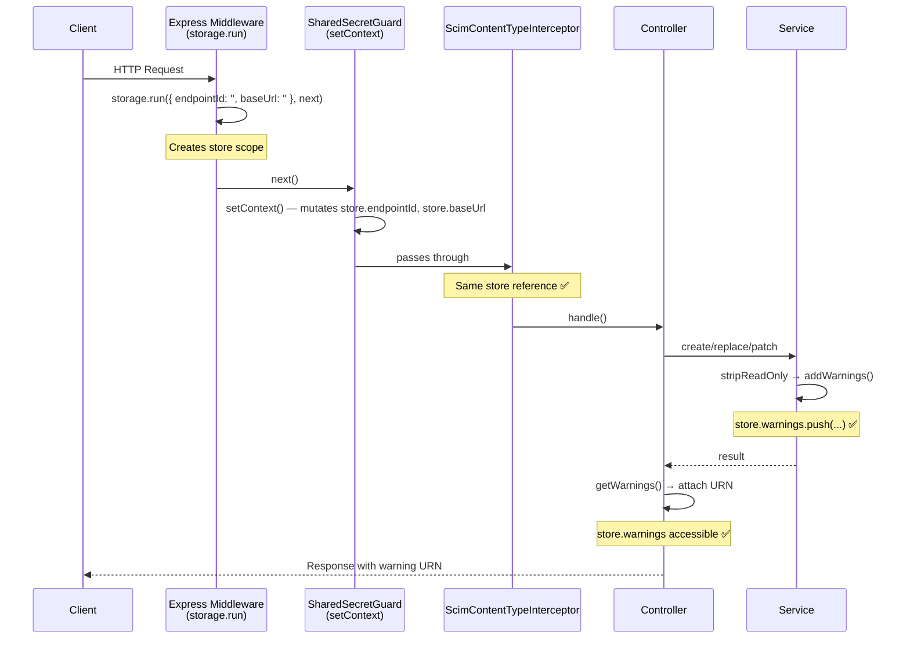
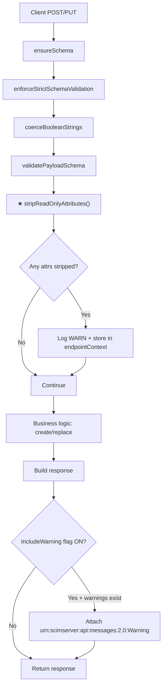
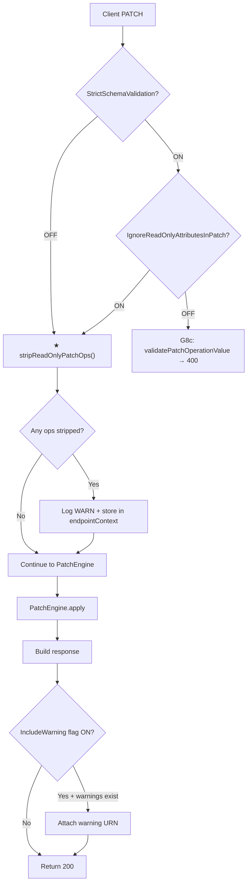
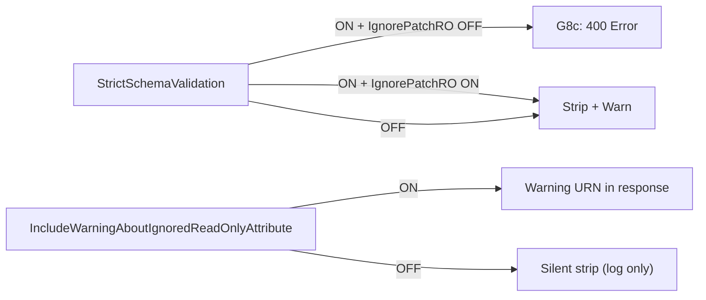

# ReadOnly Attribute Stripping & Warning System

## Overview

**Feature**: RFC 7643 §2.2 readOnly attribute stripping + warning extension for POST/PUT/PATCH  
**Version**: v0.22.0  
**Status**: ✅ Complete  
**RFC References**:
- [RFC 7643 §2.2 — Mutability](https://datatracker.ietf.org/doc/html/rfc7643#section-2.2)
- [RFC 7644 §3.5.2 — Modifying with PATCH](https://datatracker.ietf.org/doc/html/rfc7644#section-3.5.2)
- [RFC 7644 §3.12 — Error Handling](https://datatracker.ietf.org/doc/html/rfc7644#section-3.12)

### Problem Statement

Prior to v0.22.0, readOnly attributes sent by clients in POST/PUT bodies were handled inconsistently:

1. **`groups` in POST/PUT** — Silently stored in `rawPayload` and served back to clients, even though `groups` is `mutability: 'readOnly'` (RFC 7643 §4.1). This created phantom data that doesn't reflect actual group memberships.
2. **`meta` in POST/PUT** — Leaked into `rawPayload` in Users and Groups `extractAdditionalAttributes()`. Harmless but dirty — dead data polluting storage.
3. **`manager.displayName` (sub-attribute)** — `readOnly` sub-attribute of `readWrite` parent `manager`. Client-supplied value stored AND served back because `validateSingleValue()` has no mutability guard. Live in ALL modes.
4. **Groups `id` client-controlled** — `createGroupForEndpoint()` accepted client-supplied `id` as `scimId` instead of always generating `randomUUID()`. Direct RFC 7643 §3.1 violation (`id` is server-assigned).
5. **PATCH readOnly in non-strict mode** — When `StrictSchemaValidation` is OFF (default), PATCH operations targeting readOnly attributes (`groups`, `meta`) were silently applied by the PatchEngine with zero validation.
6. **No client feedback** — Clients sending readOnly attributes received no indication their data was ignored. Industry peers (Okta, Ping, AWS SSO) return warning extensions.

### Solution

A **schema-driven strip-and-warn pipeline** that:

- **Always strips** readOnly attributes from POST/PUT bodies before storage (no flag needed — mandatory per RFC)
- **Always strips** readOnly PATCH operations in non-strict mode (baseline safety)
- **Optionally warns** clients via a response extension URN when readOnly attributes were ignored
- **Preserves** existing G8c hard-reject behavior for strict mode PATCH (400 error)
- **Adds** a new `IgnoreReadOnlyAttributesInPatch` flag to override G8c strict rejection → strip+warn instead

### RFC 7643 §2.2 Compliance

> **readOnly** — The attribute SHALL NOT be modified. [...] A "readOnly" attribute
> MAY be included in the request body from the client, but the service provider
> SHALL ignore the provided value.

The RFC explicitly allows clients to **send** readOnly attributes — but the server **SHALL ignore** them. This means:

1. Returning 400 for readOnly attributes in POST/PUT is **stricter than the RFC mandates** (but permitted by SHOULD-level language)
2. The **correct baseline** behavior is to silently strip + optionally warn
3. Hard-reject (400) should only apply when explicitly opted in via `StrictSchemaValidation`

## Architecture

### Pipeline Position

```
Client Request (POST / PUT / PATCH)
    │
    ▼
┌─────────────────────────────────────────────────────────────┐
│  1. ensureSchema()      — validate schemas[] array          │
│  2. enforceStrictSchema — reject unknown extension URNs     │
│  3. coerceBooleans      — "True"→true before validation     │
│  4. validatePayload     — StrictSchemaValidation gate       │
│                                                             │
│  ★ 5. stripReadOnly()   — NEW: remove readOnly attrs        │
│     ├── POST/PUT: stripReadOnlyAttributes(payload, schemas) │
│     └── PATCH:   stripReadOnlyPatchOps(ops, schemas)        │
│                                                             │
│  6. Business logic      — uniqueness, create/update         │
└─────────────────────────────────────────────────────────────┘
    │
    ▼
┌─────────────────────────────────────────────────────────────┐
│  Controller response assembly                               │
│  ★ If IncludeWarningAboutIgnoredReadOnlyAttribute = true    │
│    AND strippedAttributes.length > 0:                       │
│    → Attach warning extension URN to response               │
└─────────────────────────────────────────────────────────────┘
```

### PATCH Behavior Matrix

| StrictSchema | IgnorePatchRO | Behavior | Response |
|:---:|:---:|---|---|
| OFF | - | Strip readOnly ops + WARN log | 200 + optional warning URN |
| ON | OFF | 400 hard-reject (G8c unchanged) | 400 error |
| ON | ON | Strip readOnly ops + WARN log | 200 + optional warning URN |

**Special case**: PATCH targeting `id` → **always 400** regardless of flags (never strip, never ignore).

### POST/PUT Behavior

Always strip readOnly attributes. No flag needed — this is mandatory RFC behavior.
Warning URN in response is gated by `IncludeWarningAboutIgnoredReadOnlyAttribute`.

## Configuration Flags

### `IncludeWarningAboutIgnoredReadOnlyAttribute` (new)

| Property | Value |
|----------|-------|
| Type | boolean |
| Default | `false` |
| Scope | All operations (POST, PUT, PATCH) |
| Purpose | When `true`, attach warning extension URN to responses when readOnly attributes were stripped |

### `IgnoreReadOnlyAttributesInPatch` (new)

| Property | Value |
|----------|-------|
| Type | boolean |
| Default | `false` |
| Scope | PATCH operations only |
| Purpose | When `true` AND `StrictSchemaValidation` is also `true`, override G8c hard-reject → strip+warn instead of 400 |
| Precedence | Only meaningful when `StrictSchemaValidation` is ON. When strict is OFF, PATCH readOnly ops are always stripped (baseline). |

### Warning Extension URN

```
urn:scimserver:api:messages:2.0:Warning
```

Pragmatic unregistered NID following the same pattern as Okta (`urn:okta`) and Ping Identity.

Example response with warning:

```json
{
  "schemas": [
    "urn:ietf:params:scim:schemas:core:2.0:User",
    "urn:scimserver:api:messages:2.0:Warning"
  ],
  "id": "abc-123",
  "userName": "jdoe",
  "urn:scimserver:api:messages:2.0:Warning": {
    "detail": "The following readOnly attributes were ignored: groups, meta"
  }
}
```

## ReadOnly Attributes Inventory

### Core User Schema

| Attribute | Type | ReadOnly | Notes |
|-----------|------|:---:|-------|
| `id` | string | ✅ | Server-assigned. Always stripped (POST/PUT), always hard-reject (PATCH). |
| `meta` | complex | ✅ | +5 sub-attrs (resourceType, created, lastModified, location, version) |
| `groups` | complex[] | ✅ | +4 sub-attrs (value, $ref, display, type). Server-managed via Group membership. |

### Enterprise Extension

| Attribute | Type | ReadOnly | Notes |
|-----------|------|:---:|-------|
| `manager` | complex | ❌ (readWrite) | Parent is writable |
| `manager.displayName` | string | ✅ | ReadOnly sub-attr of readWrite parent. Phase 2 — deferred to sub-attr implementation. |

### Core Group Schema

| Attribute | Type | ReadOnly | Notes |
|-----------|------|:---:|-------|
| `id` | string | ✅ | Server-assigned |
| `meta` | complex | ✅ | Same as User |

## Key Components

| Component | File | Purpose |
|-----------|------|---------|
| `ValidationWarning` | `validation-types.ts` | New interface for non-fatal validation feedback |
| `stripReadOnlyAttributes()` | `scim-service-helpers.ts` | Strip top-level readOnly attrs from POST/PUT payloads |
| `stripReadOnlyPatchOps()` | `scim-service-helpers.ts` | Remove/filter PATCH operations targeting readOnly attrs |
| `IncludeWarningAboutIgnoredReadOnlyAttribute` | `endpoint-config.interface.ts` | Flag: attach warning URN to response |
| `IgnoreReadOnlyAttributesInPatch` | `endpoint-config.interface.ts` | Flag: override G8c → strip instead of 400 |
| `addWarnings()` / `getWarnings()` | `endpoint-context.storage.ts` | Request-scoped warning accumulation |
| Controller warning attachment | `endpoint-scim-users.controller.ts`, `endpoint-scim-groups.controller.ts` | Attach warning URN to response |

## Implementation Details

### 1. Strip Helper for POST/PUT

```typescript
export function stripReadOnlyAttributes(
  payload: Record<string, unknown>,
  schemaDefinitions: readonly SchemaDefinition[],
): string[] {
  const stripped: string[] = [];
  // Walk core + extension schemas, find readOnly top-level attrs
  // Use findKeyIgnoreCase for case-insensitive matching
  // Delete matching keys from payload, collect names
  // Skip 'id' (handled separately), skip 'externalId' (readWrite)
  return stripped;
}
```

### 2. Strip Helper for PATCH

```typescript
export function stripReadOnlyPatchOps(
  operations: PatchOperation[],
  schemaDefinitions: readonly SchemaDefinition[],
): { filtered: PatchOperation[]; stripped: string[] } {
  // For each op, resolve the target attribute from path or value keys
  // If readOnly → remove from operations array, add to stripped list
  // If path targets 'id' → DO NOT strip, let G8c reject with 400
  return { filtered, stripped };
}
```

### 3. Warning Accumulation via EndpointContextStorage

The `EndpointContextStorage` gets `addWarnings()` and `getWarnings()` methods. Services call `addWarnings()` after stripping. Controllers check `getWarnings()` and attach the warning URN if the flag is ON.

#### AsyncLocalStorage Middleware (Critical Fix)

**Problem**: The initial implementation used `AsyncLocalStorage.enterWith()` in the controller guard to set the endpoint context. However, NestJS's interceptor pipeline (`ScimContentTypeInterceptor`, `ScimEtagInterceptor` via `APP_INTERCEPTOR`) creates new async boundaries. `enterWith()` scopes the store to the current execution context only — child async operations spawned by interceptors lose the store reference.

**Root Cause**: `storage.getStore()` returned `undefined` inside service methods because the interceptor pipeline broke the `enterWith()` continuation chain.

**Solution**: Express middleware wrapping each request in `storage.run()`:

```
Request → Express Middleware (storage.run({...}))
            ↓
         NestJS Guards (setContext mutates store in-place)
            ↓
         NestJS Interceptors (same store reference ✅)
            ↓
         Controller + Service (addWarnings/getWarnings ✅)
            ↓
         Response
```

**Key design decisions:**

1. **`createMiddleware()`** — `EndpointContextStorage` exposes a factory method returning Express middleware: `(req, res, next) => this.storage.run({ endpointId: '', baseUrl: '' }, next)`
2. **`setContext()` mutates** — instead of replacing the store with `enterWith()`, it mutates the existing store object created by the middleware. This preserves the `storage.run()` scope chain.
3. **`ScimModule.configure()`** — `ScimModule` implements `NestModule` and registers the middleware on `forRoutes('*')` via the NestJS `MiddlewareConsumer`.
4. **Warnings survive `setContext()`** — `setContext()` does NOT reset the `warnings` array, so warnings accumulated before or after context setup are preserved.



### 4. Generic Service Dynamic Schema Resolution

The Generic service (`EndpointScimGenericService`) handles custom resource types registered via the Admin API. Unlike Users/Groups which have hardcoded schema constants, Generic resources require dynamic schema lookup:

```typescript
private async getSchemaDefinitions(
  resourceType: string,
  endpointId: string,
): Promise<SchemaDefinition[]> {
  const registeredType = await this.resourceTypeRepo.findByName(endpointId, resourceType);
  if (!registeredType?.schemaUrn) return [];
  
  const schemaDef = this.schemaRegistry.getSchemaByUrn(registeredType.schemaUrn);
  if (!schemaDef) return [];
  
  const definitions: SchemaDefinition[] = [{ urn: registeredType.schemaUrn, attributes: schemaDef.attributes ?? [] }];
  
  // Add extension schemas
  for (const ext of registeredType.schemaExtensions ?? []) {
    const extDef = this.schemaRegistry.getSchemaByUrn(ext.schema);
    if (extDef) {
      definitions.push({ urn: ext.schema, attributes: extDef.attributes ?? [] });
    }
  }
  return definitions;
}
```

This enables readOnly attribute stripping for **any** custom schema with readOnly attributes, not just the built-in User/Group schemas.

### 5. Controller Response Assembly

```typescript
// In controller after service call:
const warnings = this.endpointContext.getWarnings();
if (warnings.length > 0 && getConfigBoolean(config, ENDPOINT_CONFIG_FLAGS.INCLUDE_WARNING_ABOUT_IGNORED_READONLY_ATTRIBUTE)) {
  result.schemas.push('urn:scimserver:api:messages:2.0:Warning');
  result['urn:scimserver:api:messages:2.0:Warning'] = {
    detail: `The following readOnly attributes were ignored: ${warnings.join(', ')}`,
  };
}
```

## Bug Fixes Included

### BF-1: Groups `id` Client-Controlled (Critical)

**File**: `endpoint-scim-groups.service.ts` line 143  
**Before**: `const scimId = dto.id && typeof dto.id === 'string' ? dto.id : randomUUID();`  
**After**: `const scimId = randomUUID();`  
**Impact**: Clients could set resource identity → RFC 7643 §3.1 violation. Server MUST assign `id`.

### BF-2: `meta` Leak in extractAdditionalAttributes

**File**: `endpoint-scim-users.service.ts` and `endpoint-scim-groups.service.ts`  
**Issue**: `extractAdditionalAttributes()` did not delete `meta` before storing in `rawPayload`.  
**Fix**: The new `stripReadOnlyAttributes()` helper runs before `extractAdditionalAttributes()`, removing `meta` (and all other readOnly attrs) from the payload before it reaches storage.

## Deferred to Phase 2

### Sub-Attribute readOnly Validation

**Gap**: `validateSingleValue()` in `schema-validator.ts` performs type-only validation — no mutability guard. `validateSubAttributes()` delegates to `validateSingleValue()` without adding its own readOnly check. This means readOnly sub-attributes of readWrite parents (e.g., `manager.displayName`) pass validation silently.

**Impact**: Client-supplied `manager.displayName` is stored and served back. Low severity — `manager.displayName` is typically derived from the `manager.value` reference.

**Planned Fix**: Add readOnly check in `validateSubAttributes()` or `validateSingleValue()` for sub-attrs of readWrite parents. The strip helper will also need recursion into readWrite complex attrs to strip readOnly sub-keys.

## Mermaid Diagrams

### POST/PUT Flow



### PATCH Flow



### Config Flag Interaction



## Test Coverage (Planned)

### Unit Tests

| Test Area | Count | Description |
|-----------|-------|-------------|
| `stripReadOnlyAttributes()` | ~10 | Core: strips groups/meta/id; preserves externalId/userName; case-insensitive; extension URN attrs; empty payload |
| `stripReadOnlyPatchOps()` | ~8 | Removes readOnly ops; preserves non-readOnly; id always kept for rejection; no-path ops with readOnly keys; extension targets |
| `ValidationWarning` type | ~2 | Interface shape; warnings array in ValidationResult |
| Service integration | ~6 | Strip called in create/replace/patch for Users and Groups |

### E2E Tests (17 tests — `readonly-stripping.e2e-spec.ts`)

| Test Area | Count | Description |
|-----------|-------|-------------|
| POST /Users strip | 4 | groups stripped; id stripped; meta stripped; preserved attrs unchanged |
| PUT /Users strip | 1 | readOnly stripped on replace |
| PATCH /Users strip | 3 | Ops targeting readOnly stripped; id rejection always 400; op count preserved |
| POST /Groups strip | 1 | Client-supplied id ignored; server assigns UUID |
| Warning URN | 5 | Warning present when flag ON; absent when OFF; correct shape; URN on PUT; URN on PATCH |
| PATCH behavior matrix | 3 | strict OFF → strip; strict+ignore → strip; strict without ignore → G8c 400 |

### Live Integration Tests (Section 9t — Implemented)

| Test ID | Description |
|---------|-------------|
| 9t.1 | POST /Users with groups[] — groups stripped, not in response |
| 9t.2 | POST /Users with meta — meta stripped, server meta used |
| 9t.3 | PUT /Users with groups + meta — both stripped |
| 9t.4 | PATCH /Users replace groups — op stripped (non-strict) |
| 9t.5 | Warning URN when flag enabled |
| 9t.6 | No warning URN when flag disabled |
| 9t.7 | PATCH /Users replace groups (strict + ignore flag) — strip instead of 400 |
| 9t.8 | PATCH /Users replace id — always 400 |
| 9t.9 | POST /Groups — server assigns id, client id ignored |
| 9t.10 | POST /Groups with meta — meta not in rawPayload |

## Files Changed

| File | Change |
|------|--------|
| `api/src/domain/validation/validation-types.ts` | Add `ValidationWarning` interface + `warnings[]` to `ValidationResult` |
| `api/src/domain/validation/index.ts` | Export `ValidationWarning` |
| `api/src/modules/endpoint/endpoint-config.interface.ts` | Add 2 new config flags + defaults + validation |
| `api/src/modules/endpoint/endpoint-context.storage.ts` | Add `addWarnings()` / `getWarnings()` |
| `api/src/modules/scim/common/scim-service-helpers.ts` | Add `stripReadOnlyAttributes()` + `stripReadOnlyPatchOps()` |
| `api/src/domain/validation/schema-validator.ts` | ReadOnly → warning (optional), collect readOnly attribute sets |
| `api/src/modules/scim/services/endpoint-scim-users.service.ts` | Call strip helpers in create + replace + patch |
| `api/src/modules/scim/services/endpoint-scim-groups.service.ts` | Call strip helpers + fix `id` bug (line 143 → always randomUUID) + fix meta leak |
| `api/src/modules/scim/services/endpoint-scim-generic.service.ts` | Call strip helpers in create + replace + patch; dynamic schema resolution via `getSchemaDefinitions()` |
| `api/src/modules/scim/controllers/endpoint-scim-users.controller.ts` | Attach warning URN to responses |
| `api/src/modules/scim/controllers/endpoint-scim-groups.controller.ts` | Attach warning URN to responses |
| `api/src/modules/scim/controllers/endpoint-scim-generic.controller.ts` | Attach warning URN to POST/PUT/PATCH responses |
| `api/src/modules/endpoint/endpoint-context.storage.ts` | Major rewrite: `createMiddleware()` with `storage.run()`, mutating `setContext()`, request-scoped warnings |
| `api/src/modules/scim/scim.module.ts` | Implements `NestModule`; registers AsyncLocalStorage middleware on all routes |
| `api/test/e2e/readonly-stripping.e2e-spec.ts` | 17 E2E tests: strip behavior + warning URN + PATCH behavior matrix |
| `scripts/live-test.ps1` | Section 9t: 10 live integration tests |
| `docs/READONLY_ATTRIBUTE_STRIPPING_AND_WARNINGS.md` | This document |

## Migration Plan Impact

This feature addresses multiple gaps from the migration plan:

- **G8d** (partial): readOnly attribute handling on POST/PUT — strip instead of reject
- **BF-1**: Groups `id` client-controlled (RFC 7643 §3.1 violation)
- **BF-2**: `meta` leak into rawPayload (data hygiene)
- **Industry alignment**: Warning extension URN (Okta, Ping, AWS SSO pattern)

## Industry Precedent

| Provider | ReadOnly Handling | Warning Mechanism |
|----------|------------------|-------------------|
| **Okta** | Silently ignores readOnly attrs | `urn:okta:...` extension warnings |
| **Ping Identity** | Silently ignores | Custom warning header |
| **AWS SSO** | Silently ignores | No explicit warning |
| **Azure AD / Entra ID** | Ignores, some case returns warning | Extension-based |
| **SCIMServer (this)** | Strip + optional warning URN | `urn:scimserver:api:messages:2.0:Warning` |
