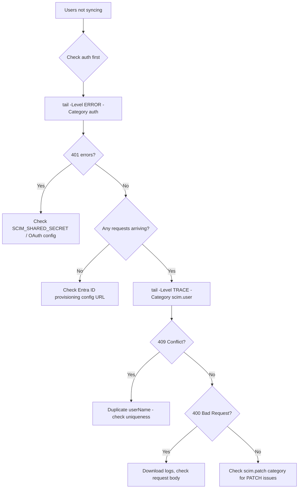
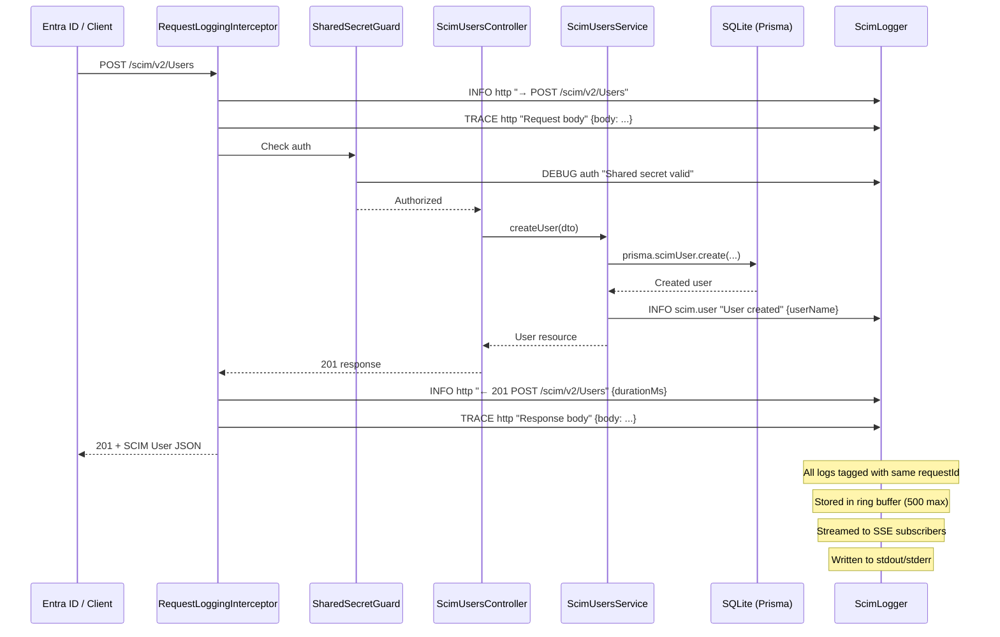
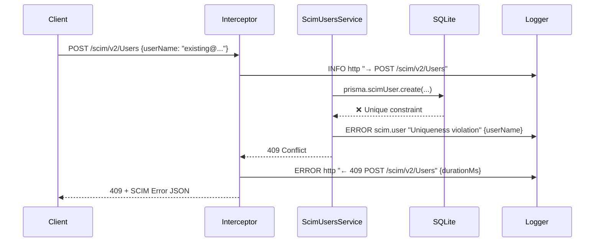

# SCIMServer — Remote Debugging & Diagnosis Guide

> **Version**: 1.0 · **Date**: February 2026 · **Applies to**: SCIMServer v0.10.0+

---

## Table of Contents

1. [Quick Reference](#1-quick-reference)
2. [Remote Log Access Architecture](#2-remote-log-access-architecture)
3. [Log Levels & Categories](#3-log-levels--categories)
4. [Runtime Log Configuration API](#4-runtime-log-configuration-api)
5. [Live Log Tailing (SSE Stream)](#5-live-log-tailing-sse-stream)
6. [Log File Download](#6-log-file-download)
7. [Recent Logs (Ring Buffer)](#7-recent-logs-ring-buffer)
8. [Remote Log Script](#8-remote-log-script)
9. [Azure Container Apps — Remote Access](#9-azure-container-apps--remote-access)
10. [Diagnosis Workflows](#10-diagnosis-workflows)
11. [Log Samples & Patterns](#11-log-samples--patterns)
12. [Debugging Request Flows](#12-debugging-request-flows)
13. [Postman / Insomnia / curl Reference](#13-postman--insomnia--curl-reference)
14. [Troubleshooting Common Issues](#14-troubleshooting-common-issues)

---

## 1. Quick Reference

### All Admin Log Endpoints

| Method | URL | Description |
|--------|-----|-------------|
| `GET` | `/scim/admin/log-config` | Get current log configuration |
| `PUT` | `/scim/admin/log-config` | Update log configuration (partial) |
| `PUT` | `/scim/admin/log-config/level/:level` | Quick global level change |
| `PUT` | `/scim/admin/log-config/category/:cat/:level` | Set per-category level |
| `PUT` | `/scim/admin/log-config/endpoint/:id/:level` | Set per-endpoint level |
| `DELETE` | `/scim/admin/log-config/endpoint/:id` | Remove endpoint override |
| `GET` | `/scim/admin/log-config/recent` | Fetch recent logs (ring buffer) |
| `DELETE` | `/scim/admin/log-config/recent` | Clear ring buffer |
| `GET` | `/scim/admin/log-config/stream` | **SSE live log tail** *(new)* |
| `GET` | `/scim/admin/log-config/download` | **Download log file** *(new)* |

### Quick Commands

```powershell
# Tail live logs from Azure production
.\scripts\remote-logs.ps1 -Mode tail -BaseUrl https://myapp.azurecontainerapps.io

# Download logs
.\scripts\remote-logs.ps1 -Mode download -BaseUrl https://myapp.azurecontainerapps.io

# Set TRACE level for debugging
.\scripts\remote-logs.ps1 -Mode config -Action trace -BaseUrl https://myapp.azurecontainerapps.io

# Tail with curl
curl -N https://myapp.azurecontainerapps.io/scim/admin/log-config/stream?level=WARN
```

---

## 2. Remote Log Access Architecture

```
┌──────────────────────────────┐
│     Your Local Machine       │
│                              │
│  ┌────────────────────────┐  │
│  │ VS Code / Terminal     │  │
│  │ ┌──────────────────┐   │  │
│  │ │ remote-logs.ps1  │   │  │
│  │ │ or curl / browser │   │  │
│  │ └────────┬─────────┘   │  │
│  └──────────┼─────────────┘  │
└─────────────┼────────────────┘
              │ HTTPS
              ▼
┌──────────────────────────────┐     ┌─────────────────────────┐
│  Azure Container Apps        │     │  Log Locations          │
│  ┌────────────────────────┐  │     │                         │
│  │  SCIMServer Container  │  │     │  1. stdout/stderr       │
│  │  ┌──────────────────┐  │  │────▶│     → az containerapp   │
│  │  │  ScimLogger      │  │  │     │       logs show         │
│  │  │  ┌────────────┐  │  │  │     │                         │
│  │  │  │ Ring Buffer│  │  │  │     │  2. Ring Buffer (500)   │
│  │  │  │ (500 max)  │  │  │  │     │     → GET /recent       │
│  │  │  └────────────┘  │  │  │     │     → GET /download     │
│  │  │  ┌────────────┐  │  │  │     │                         │
│  │  │  │ EventEmitter│  │  │  │     │  3. SSE Stream          │
│  │  │  │ (live SSE) │  │  │  │     │     → GET /stream       │
│  │  │  └────────────┘  │  │  │     │                         │
│  │  └──────────────────┘  │  │     │  4. RequestLog DB table │
│  │  ┌──────────────────┐  │  │     │     → SQLite data.db    │
│  │  │ LogConfigCtrl    │  │  │     │                         │
│  │  │  /stream (SSE)   │  │  │     │  5. Azure Monitor       │
│  │  │  /download       │  │  │     │     → Container insights│
│  │  │  /recent         │  │  │     └─────────────────────────┘
│  │  └──────────────────┘  │  │
│  └────────────────────────┘  │
└──────────────────────────────┘
```

### 5 Log Access Methods

| # | Method | Latency | History | Best For |
|---|--------|---------|---------|----------|
| 1 | `az containerapp logs show --follow` | ~2s | Azure retention (30d) | Platform-level logs, startup issues |
| 2 | `GET /admin/log-config/recent` | Instant | Last 500 entries | Quick recent lookup, filtering by requestId |
| 3 | `GET /admin/log-config/stream` (SSE) | Real-time | N/A (live only) | Watching live traffic, reproducing issues |
| 4 | `GET /admin/log-config/download` | Instant | Last 500 entries | Offline analysis, sharing with team |
| 5 | Azure Monitor / Log Analytics | ~5min | 30+ days | Historical analysis, alerting |

---

## 3. Log Levels & Categories

### Log Levels (ascending severity)

| Level | Value | Color | Use Case |
|-------|-------|-------|----------|
| `TRACE` | 0 | Gray | Full request/response bodies, SQL queries, patch path resolution |
| `DEBUG` | 1 | Cyan | Filter parsing, member resolution, config reads |
| `INFO` | 2 | Green | Business events: user created, group patched, endpoint activated |
| `WARN` | 3 | Yellow | Deprecated header, slow query (>2s), backup retry |
| `ERROR` | 4 | Red | Auth failure, uniqueness violation, DB error |
| `FATAL` | 5 | Magenta | DB connection lost, secret not configured |
| `OFF` | 6 | — | Suppress all output |

#### Level Filtering Cascade (3-tier)

```
Request arrives → check endpoint-level override
                    ↓ (not set?)
                  check category-level override
                    ↓ (not set?)
                  use global level
```

### Log Categories

| Category | Enum Value | What It Covers |
|----------|------------|----------------|
| HTTP | `http` | Request/response lifecycle, timing |
| Auth | `auth` | Authentication, authorization, guards |
| SCIM User | `scim.user` | User CRUD operations |
| SCIM Group | `scim.group` | Group CRUD operations |
| SCIM Patch | `scim.patch` | PATCH operation details |
| SCIM Filter | `scim.filter` | Filter parsing & evaluation |
| SCIM Discovery | `scim.discovery` | ServiceProviderConfig, Schemas, ResourceTypes |
| Endpoint | `endpoint` | Endpoint management |
| Database | `database` | Prisma/SQLite operations |
| Backup | `backup` | Azure Blob backup/restore |
| OAuth | `oauth` | Token generation/validation |
| General | `general` | Uncategorized |

---

## 4. Runtime Log Configuration API

### GET — Current Configuration

```bash
curl https://HOST/scim/admin/log-config
```

**Response:**
```json
{
  "globalLevel": "INFO",
  "categoryLevels": {
    "scim.patch": "TRACE",
    "auth": "WARN"
  },
  "endpointLevels": {},
  "includePayloads": false,
  "includeStackTraces": true,
  "maxPayloadSizeBytes": 8192,
  "format": "json",
  "availableLevels": ["TRACE", "DEBUG", "INFO", "WARN", "ERROR", "FATAL", "OFF"],
  "availableCategories": ["http", "auth", "scim.user", "scim.group", "scim.patch",
    "scim.filter", "scim.discovery", "endpoint", "database", "backup", "oauth", "general"]
}
```

### PUT — Update Configuration (partial)

```bash
curl -X PUT https://HOST/scim/admin/log-config \
  -H "Content-Type: application/json" \
  -d '{
    "globalLevel": "DEBUG",
    "includePayloads": true,
    "includeStackTraces": true,
    "format": "json",
    "categoryLevels": {
      "scim.patch": "TRACE",
      "auth": "WARN"
    }
  }'
```

**Response:**
```json
{
  "message": "Log configuration updated",
  "config": {
    "globalLevel": "DEBUG",
    "categoryLevels": { "scim.patch": "TRACE", "auth": "WARN" },
    "includePayloads": true,
    "includeStackTraces": true,
    "maxPayloadSizeBytes": 8192,
    "format": "json",
    "availableLevels": ["TRACE", "DEBUG", "INFO", "WARN", "ERROR", "FATAL", "OFF"],
    "availableCategories": ["http", "auth", "scim.user", "scim.group", "scim.patch",
      "scim.filter", "scim.discovery", "endpoint", "database", "backup", "oauth", "general"]
  }
}
```

### PUT — Quick Level Change

```bash
# Set global level to TRACE (max verbosity)
curl -X PUT https://HOST/scim/admin/log-config/level/TRACE

# Response:
# { "message": "Global log level set to TRACE", "globalLevel": "TRACE" }
```

### PUT — Per-Category Level

```bash
# Only TRACE-level PATCH operations
curl -X PUT https://HOST/scim/admin/log-config/category/scim.patch/TRACE

# Only ERROR+ for HTTP category
curl -X PUT https://HOST/scim/admin/log-config/category/http/ERROR
```

### PUT — Per-Endpoint Level Override

```bash
# TRACE a specific endpoint
curl -X PUT https://HOST/scim/admin/log-config/endpoint/abc123/TRACE

# Remove override
curl -X DELETE https://HOST/scim/admin/log-config/endpoint/abc123
```

---

## 5. Live Log Tailing (SSE Stream)

### Endpoint

```
GET /scim/admin/log-config/stream
```

### Query Parameters

| Parameter | Type | Description |
|-----------|------|-------------|
| `level` | string | Minimum log level: TRACE, DEBUG, INFO, WARN, ERROR, FATAL |
| `category` | string | Filter by category: http, auth, scim.user, etc. |
| `endpointId` | string | Filter by SCIM endpoint ID |

### Response Format (Server-Sent Events)

```
event: connected
data: {"message":"Log stream connected","filters":{"level":"ALL","category":"ALL","endpointId":"ALL"}}

data: {"timestamp":"2026-02-18T14:30:00.123Z","level":"INFO","category":"http","message":"→ GET /scim/v2/Users","requestId":"a1b2c3d4-...","method":"GET","path":"/scim/v2/Users"}

data: {"timestamp":"2026-02-18T14:30:00.456Z","level":"INFO","category":"scim.user","message":"Listed 25 users","requestId":"a1b2c3d4-...","durationMs":12}

: ping 2026-02-18T14:30:30.000Z
```

### Usage Examples

#### curl (Terminal)

```bash
# Tail all logs
curl -N https://myapp.azurecontainerapps.io/scim/admin/log-config/stream

# Tail only WARN+ logs
curl -N "https://myapp.azurecontainerapps.io/scim/admin/log-config/stream?level=WARN"

# Tail only auth-related logs
curl -N "https://myapp.azurecontainerapps.io/scim/admin/log-config/stream?category=auth"

# Tail with Bearer token
curl -N -H "Authorization: Bearer eyJ..." \
  "https://myapp.azurecontainerapps.io/scim/admin/log-config/stream?level=INFO"

# Pretty-print with jq
curl -N -s "https://HOST/scim/admin/log-config/stream" | \
  grep --line-buffered "^data: " | \
  sed -u 's/^data: //' | \
  jq -r '"\(.timestamp[11:23]) \(.level | .[0:5]) \(.category) \(.message)"'
```

#### PowerShell (remote-logs.ps1)

```powershell
# Tail all logs
.\scripts\remote-logs.ps1 -Mode tail -BaseUrl https://myapp.azurecontainerapps.io

# Tail WARN+ for auth category
.\scripts\remote-logs.ps1 -Mode tail -BaseUrl https://myapp.azurecontainerapps.io -Level WARN -Category auth

# Tail specific endpoint
.\scripts\remote-logs.ps1 -Mode tail -BaseUrl https://myapp.azurecontainerapps.io -EndpointId abc123
```

#### JavaScript (Browser/Node.js)

```javascript
const evtSource = new EventSource('/scim/admin/log-config/stream?level=INFO');

evtSource.onmessage = (event) => {
  const entry = JSON.parse(event.data);
  console.log(`${entry.timestamp} [${entry.level}] ${entry.category}: ${entry.message}`);
};

evtSource.addEventListener('connected', (event) => {
  console.log('Stream connected:', JSON.parse(event.data));
});

evtSource.onerror = () => console.log('Stream disconnected, reconnecting...');
```

### SSE Protocol Notes

- **Keep-alive**: Server sends `: ping <timestamp>` every 30 seconds to prevent proxy timeouts
- **Reconnection**: SSE clients (EventSource) auto-reconnect on disconnect
- **NGINX**: `X-Accel-Buffering: no` header is set to disable proxy buffering
- **Azure Container Apps**: Ingress supports SSE natively (no special configuration needed)

---

## 6. Log File Download

### Endpoint

```
GET /scim/admin/log-config/download
```

### Query Parameters

| Parameter | Type | Default | Description |
|-----------|------|---------|-------------|
| `format` | string | `ndjson` | Output format: `ndjson` (newline-delimited JSON) or `json` (array) |
| `limit` | number | all (max 500) | Max entries to include |
| `level` | string | all | Minimum level filter |
| `category` | string | all | Category filter |
| `requestId` | string | — | Filter by correlation ID |
| `endpointId` | string | — | Filter by endpoint ID |

### Response Headers

```
Content-Type: application/x-ndjson   (or application/json)
Content-Disposition: attachment; filename="scimserver-logs-2026-02-18T14-30-00.ndjson"
```

### Usage Examples

#### curl

```bash
# Download as NDJSON (default)
curl -o scim-logs.ndjson \
  https://HOST/scim/admin/log-config/download

# Download as JSON array
curl -o scim-logs.json \
  "https://HOST/scim/admin/log-config/download?format=json"

# Download only ERROR+ entries
curl -o scim-errors.ndjson \
  "https://HOST/scim/admin/log-config/download?level=ERROR"

# Download logs for a specific request ID
curl -o request-trace.ndjson \
  "https://HOST/scim/admin/log-config/download?requestId=a1b2c3d4-e5f6-..."
```

#### PowerShell

```powershell
# Download with auto-generated filename
.\scripts\remote-logs.ps1 -Mode download -BaseUrl https://myapp.azurecontainerapps.io

# Download ERROR+ as JSON
.\scripts\remote-logs.ps1 -Mode download -Level ERROR -Format json

# Download to specific file
.\scripts\remote-logs.ps1 -Mode download -OutputFile "C:\logs\scim-debug.ndjson"
```

### NDJSON Sample Output

```json
{"timestamp":"2026-02-18T14:30:00.123Z","level":"INFO","category":"http","message":"→ POST /scim/v2/Users","requestId":"a1b2c3d4-e5f6-7890-abcd-1234567890ab","method":"POST","path":"/scim/v2/Users"}
{"timestamp":"2026-02-18T14:30:00.234Z","level":"INFO","category":"scim.user","message":"User created","requestId":"a1b2c3d4-e5f6-7890-abcd-1234567890ab","durationMs":45,"data":{"userName":"alice@example.com"}}
{"timestamp":"2026-02-18T14:30:00.345Z","level":"INFO","category":"http","message":"← 201 POST /scim/v2/Users","requestId":"a1b2c3d4-e5f6-7890-abcd-1234567890ab","durationMs":56,"data":{"status":201}}
```

---

## 7. Recent Logs (Ring Buffer)

### Endpoint

```
GET /scim/admin/log-config/recent
```

### Query Parameters

| Parameter | Type | Default | Description |
|-----------|------|---------|-------------|
| `limit` | number | 100 | Max entries (up to 500) |
| `level` | string | all | Minimum level |
| `category` | string | all | Category filter |
| `requestId` | string | — | Correlation ID filter |
| `endpointId` | string | — | Endpoint filter |

### Usage Examples

```bash
# Get last 50 entries
curl "https://HOST/scim/admin/log-config/recent?limit=50"

# Get only errors
curl "https://HOST/scim/admin/log-config/recent?level=ERROR"

# Trace a specific request across all categories
curl "https://HOST/scim/admin/log-config/recent?requestId=a1b2c3d4-e5f6-7890-abcd-1234567890ab"

# Get patch-related logs
curl "https://HOST/scim/admin/log-config/recent?category=scim.patch"
```

### Response

```json
{
  "count": 3,
  "entries": [
    {
      "timestamp": "2026-02-18T14:30:00.123Z",
      "level": "INFO",
      "category": "http",
      "message": "→ POST /scim/v2/Users",
      "requestId": "a1b2c3d4-e5f6-7890-abcd-1234567890ab",
      "method": "POST",
      "path": "/scim/v2/Users"
    },
    {
      "timestamp": "2026-02-18T14:30:00.234Z",
      "level": "TRACE",
      "category": "http",
      "message": "Request body",
      "requestId": "a1b2c3d4-e5f6-7890-abcd-1234567890ab",
      "data": {
        "body": {
          "schemas": ["urn:ietf:params:scim:schemas:core:2.0:User"],
          "userName": "alice@example.com"
        }
      }
    },
    {
      "timestamp": "2026-02-18T14:30:00.345Z",
      "level": "INFO",
      "category": "http",
      "message": "← 201 POST /scim/v2/Users",
      "requestId": "a1b2c3d4-e5f6-7890-abcd-1234567890ab",
      "durationMs": 56,
      "data": { "status": 201 }
    }
  ]
}
```

### Clear Ring Buffer

```bash
curl -X DELETE https://HOST/scim/admin/log-config/recent
# Response: 204 No Content
```

---

## 8. Remote Log Script

### Location

```
scripts/remote-logs.ps1
```

### Synopsis

```powershell
.\scripts\remote-logs.ps1 -Mode <tail|recent|download|config> [options]
```

### Full Parameter Reference

| Parameter | Type | Default | Description |
|-----------|------|---------|-------------|
| `-Mode` | string | *required* | `tail`, `recent`, `download`, or `config` |
| `-BaseUrl` | string | `http://localhost:8080` | SCIMServer base URL |
| `-Token` | string | — | OAuth Bearer token |
| `-Level` | string | — | TRACE, DEBUG, INFO, WARN, ERROR, FATAL |
| `-Category` | string | — | Log category filter |
| `-EndpointId` | string | — | SCIM endpoint ID filter |
| `-RequestId` | string | — | Correlation request ID filter |
| `-Limit` | int | 100 | Max entries (recent/download) |
| `-Format` | string | `ndjson` | Output format (download): ndjson, json |
| `-OutputFile` | string | auto | Filename for download |
| `-Action` | string | `get` | Config action: get, update, trace, debug, info, warn, error |
| `-ConfigUpdate` | string | — | JSON body for config update |

### Examples

```powershell
# ─── Tailing ───
# Tail all logs from Azure production
.\scripts\remote-logs.ps1 -Mode tail -BaseUrl https://scimserver.azurecontainerapps.io

# Tail only errors
.\scripts\remote-logs.ps1 -Mode tail -Level ERROR

# Tail auth category on local dev
.\scripts\remote-logs.ps1 -Mode tail -Category auth

# ─── Recent ───
# Get last 50 ERROR+ entries
.\scripts\remote-logs.ps1 -Mode recent -Level ERROR -Limit 50

# Trace a specific request
.\scripts\remote-logs.ps1 -Mode recent -RequestId "a1b2c3d4-e5f6-7890-abcd-1234567890ab"

# ─── Download ───
# Download all NDJSON
.\scripts\remote-logs.ps1 -Mode download -BaseUrl https://scimserver.azurecontainerapps.io

# Download errors as JSON
.\scripts\remote-logs.ps1 -Mode download -Level ERROR -Format json

# ─── Config ───
# View current config
.\scripts\remote-logs.ps1 -Mode config

# Set TRACE for deep debugging
.\scripts\remote-logs.ps1 -Mode config -Action trace

# Enable payloads and stack traces
.\scripts\remote-logs.ps1 -Mode config -Action update \
  -ConfigUpdate '{"includePayloads":true,"includeStackTraces":true,"globalLevel":"DEBUG"}'

# Reset to production defaults
.\scripts\remote-logs.ps1 -Mode config -Action update \
  -ConfigUpdate '{"globalLevel":"INFO","includePayloads":false,"format":"json"}'
```

---

## 9. Azure Container Apps — Remote Access

### Method 1: Admin Log API (Recommended)

All the endpoints in this guide work directly over HTTPS through the Container App's ingress URL. No special configuration needed.

```bash
# Your Container App URL
export SCIM_URL=https://scimserver.azurecontainerapps.io

# Tail logs
curl -N "$SCIM_URL/scim/admin/log-config/stream?level=INFO"

# Download logs
curl -o logs.ndjson "$SCIM_URL/scim/admin/log-config/download"
```

### Method 2: Azure CLI Log Streaming

```powershell
# Stream stdout/stderr from the container (platform-level)
az containerapp logs show \
  -n scimserver \
  -g MyResourceGroup \
  --follow

# Get last 100 log lines
az containerapp logs show \
  -n scimserver \
  -g MyResourceGroup \
  --tail 100
```

### Method 3: Shell into Container

```powershell
# Interactive shell
az containerapp exec \
  -n scimserver \
  -g MyResourceGroup \
  --command sh

# Inside the container:
# Check database
ls -la /app/data.db
# Check node process
ps aux
# Check memory
cat /proc/meminfo | head -5
```

### Method 4: Azure Monitor / Log Analytics

```kusto
// KQL query in Log Analytics workspace
ContainerAppConsoleLogs
| where ContainerName == "scimserver"
| where Log contains "ERROR" or Log contains "FATAL"
| order by TimeGenerated desc
| take 50
```

### Method 5: Node Inspector (Emergency Only)

```powershell
# ⚠️ SECURITY RISK — only for emergencies, remove immediately after
az containerapp update \
  -n scimserver \
  -g MyResourceGroup \
  --set-env-vars "NODE_OPTIONS=--inspect=0.0.0.0:9229"

# Revert immediately after debugging
az containerapp update \
  -n scimserver \
  -g MyResourceGroup \
  --set-env-vars "NODE_OPTIONS=--max_old_space_size=384"
```

---

## 10. Diagnosis Workflows

### Workflow 1: "Users are not syncing from Entra ID"



**Step-by-step:**
```powershell
# 1. Enable TRACE logging
.\scripts\remote-logs.ps1 -Mode config -Action trace -BaseUrl $SCIM_URL

# 2. Tail auth errors
.\scripts\remote-logs.ps1 -Mode tail -Level ERROR -Category auth -BaseUrl $SCIM_URL

# 3. Check recent user operations
.\scripts\remote-logs.ps1 -Mode recent -Category scim.user -Limit 50 -BaseUrl $SCIM_URL

# 4. Download full trace for analysis
.\scripts\remote-logs.ps1 -Mode download -BaseUrl $SCIM_URL -Format json -OutputFile sync-debug.json

# 5. Reset to INFO when done
.\scripts\remote-logs.ps1 -Mode config -Action info -BaseUrl $SCIM_URL
```

### Workflow 2: "PATCH operations failing"

```powershell
# 1. Enable TRACE for PATCH category only
curl -X PUT "$SCIM_URL/scim/admin/log-config/category/scim.patch/TRACE"

# 2. Tail PATCH logs in real-time
curl -N "$SCIM_URL/scim/admin/log-config/stream?category=scim.patch"

# 3. Trigger the failing PATCH from Entra ID / client

# 4. Check the detailed log output for:
#    - "Request body" (TRACE) — shows the exact PatchOp JSON
#    - "Applying op" (DEBUG) — shows parsed op, path, value
#    - Error message — shows what failed and why

# 5. Reset category level
curl -X PUT "$SCIM_URL/scim/admin/log-config/category/scim.patch/INFO"
```

### Workflow 3: "Slow responses / timeouts"

```powershell
# 1. Check for slow request warnings
.\scripts\remote-logs.ps1 -Mode recent -Level WARN -Category http -BaseUrl $SCIM_URL

# 2. Tail in real-time to see durationMs on each response
.\scripts\remote-logs.ps1 -Mode tail -Category http -BaseUrl $SCIM_URL

# 3. Look for database-related slowness
.\scripts\remote-logs.ps1 -Mode recent -Category database -Level WARN -BaseUrl $SCIM_URL

# 4. Check if backup operations are blocking
.\scripts\remote-logs.ps1 -Mode recent -Category backup -BaseUrl $SCIM_URL
```

### Workflow 4: "Debug a specific request"

```bash
# 1. Get the X-Request-Id from the response header of the failing request
# 2. Query all logs for that request:
curl "https://HOST/scim/admin/log-config/recent?requestId=a1b2c3d4-e5f6-7890-abcd-1234567890ab&limit=500"

# 3. Download the full trace for that request:
curl -o request-trace.ndjson \
  "https://HOST/scim/admin/log-config/download?requestId=a1b2c3d4-e5f6-7890-abcd-1234567890ab"
```

---

## 11. Log Samples & Patterns

### Normal User Creation Flow (INFO level)

```json
{"timestamp":"2026-02-18T14:30:00.100Z","level":"INFO","category":"http","message":"→ POST /scim/v2/Users","requestId":"a1b2c3d4-e5f6-7890-abcd-1234567890ab","method":"POST","path":"/scim/v2/Users","data":{"userAgent":"Azure AD","contentType":"application/scim+json"}}

{"timestamp":"2026-02-18T14:30:00.150Z","level":"INFO","category":"scim.user","message":"User created","requestId":"a1b2c3d4-e5f6-7890-abcd-1234567890ab","durationMs":45,"data":{"userName":"alice@example.com","userId":"uuid-1234"}}

{"timestamp":"2026-02-18T14:30:00.155Z","level":"INFO","category":"http","message":"← 201 POST /scim/v2/Users","requestId":"a1b2c3d4-e5f6-7890-abcd-1234567890ab","durationMs":55,"data":{"status":201}}
```

### User Creation Flow (TRACE level — full detail)

```json
{"timestamp":"2026-02-18T14:30:00.100Z","level":"INFO","category":"http","message":"→ POST /scim/v2/Users","requestId":"a1b2c3d4-...","method":"POST","path":"/scim/v2/Users","data":{"userAgent":"Azure AD","contentType":"application/scim+json","ip":"20.1.2.3"}}

{"timestamp":"2026-02-18T14:30:00.101Z","level":"TRACE","category":"http","message":"Request body","requestId":"a1b2c3d4-...","data":{"body":{"schemas":["urn:ietf:params:scim:schemas:core:2.0:User"],"userName":"alice@example.com","name":{"givenName":"Alice","familyName":"Example"},"emails":[{"value":"alice@example.com","type":"work","primary":true}],"active":true}}}

{"timestamp":"2026-02-18T14:30:00.110Z","level":"DEBUG","category":"auth","message":"Shared secret authentication successful","requestId":"a1b2c3d4-..."}

{"timestamp":"2026-02-18T14:30:00.145Z","level":"INFO","category":"scim.user","message":"User created","requestId":"a1b2c3d4-...","durationMs":45,"data":{"userName":"alice@example.com"}}

{"timestamp":"2026-02-18T14:30:00.150Z","level":"TRACE","category":"http","message":"Response body","requestId":"a1b2c3d4-...","data":{"body":{"schemas":["urn:ietf:params:scim:schemas:core:2.0:User"],"id":"uuid-1234","userName":"alice@example.com","meta":{"resourceType":"User","created":"2026-02-18T14:30:00.145Z"}}}}

{"timestamp":"2026-02-18T14:30:00.155Z","level":"INFO","category":"http","message":"← 201 POST /scim/v2/Users","requestId":"a1b2c3d4-...","durationMs":55,"data":{"status":201}}
```

### PATCH Operation Flow

```json
{"timestamp":"2026-02-18T14:31:00.100Z","level":"INFO","category":"http","message":"→ PATCH /scim/v2/Users/uuid-1234","requestId":"b2c3d4e5-...","method":"PATCH","path":"/scim/v2/Users/uuid-1234"}

{"timestamp":"2026-02-18T14:31:00.101Z","level":"TRACE","category":"http","message":"Request body","requestId":"b2c3d4e5-...","data":{"body":{"schemas":["urn:ietf:params:scim:api:messages:2.0:PatchOp"],"Operations":[{"op":"replace","path":"active","value":false}]}}}

{"timestamp":"2026-02-18T14:31:00.110Z","level":"DEBUG","category":"scim.patch","message":"Applying op","requestId":"b2c3d4e5-...","data":{"op":"replace","path":"active","value":false}}

{"timestamp":"2026-02-18T14:31:00.130Z","level":"INFO","category":"scim.user","message":"User patched","requestId":"b2c3d4e5-...","durationMs":30}

{"timestamp":"2026-02-18T14:31:00.135Z","level":"INFO","category":"http","message":"← 200 PATCH /scim/v2/Users/uuid-1234","requestId":"b2c3d4e5-...","durationMs":35,"data":{"status":200}}
```

### Authentication Failure

```json
{"timestamp":"2026-02-18T14:32:00.100Z","level":"INFO","category":"http","message":"→ GET /scim/v2/Users","requestId":"c3d4e5f6-...","method":"GET","path":"/scim/v2/Users"}

{"timestamp":"2026-02-18T14:32:00.102Z","level":"ERROR","category":"auth","message":"Authentication failed: invalid shared secret","requestId":"c3d4e5f6-...","error":{"message":"Invalid or missing authorization token","name":"UnauthorizedException"}}

{"timestamp":"2026-02-18T14:32:00.103Z","level":"ERROR","category":"http","message":"← 401 GET /scim/v2/Users","requestId":"c3d4e5f6-...","durationMs":3,"data":{"status":401}}
```

### Slow Request Warning

```json
{"timestamp":"2026-02-18T14:33:00.100Z","level":"INFO","category":"http","message":"→ GET /scim/v2/Groups?filter=displayName eq \"Engineering\"","requestId":"d4e5f6a7-...","method":"GET","path":"/scim/v2/Groups"}

{"timestamp":"2026-02-18T14:33:02.600Z","level":"WARN","category":"http","message":"Slow request: 2500ms","requestId":"d4e5f6a7-...","durationMs":2500,"data":{"status":200}}

{"timestamp":"2026-02-18T14:33:02.601Z","level":"INFO","category":"http","message":"← 200 GET /scim/v2/Groups","requestId":"d4e5f6a7-...","durationMs":2501,"data":{"status":200}}
```

### Database Error

```json
{"timestamp":"2026-02-18T14:34:00.100Z","level":"ERROR","category":"database","message":"Prisma query failed","requestId":"e5f6a7b8-...","error":{"message":"Unique constraint violation: userName must be unique","name":"PrismaClientKnownRequestError","stack":"PrismaClientKnownRequestError: ...\n    at ScimUsersService.create (/app/dist/modules/scim/services/...)"}}
```

---

## 12. Debugging Request Flows

### Mermaid Sequence Diagrams

#### Create User Flow



#### Error Flow (Uniqueness Violation)



### X-Request-Id Correlation

Every request gets a unique `requestId` (UUID) that appears in:

1. **Response header**: `X-Request-Id: a1b2c3d4-e5f6-7890-abcd-1234567890ab`
2. **Every log entry**: `"requestId": "a1b2c3d4-..."`
3. **Request log DB table**: `requestLogs.requestId`

To trace a specific request:

```bash
# If you have the X-Request-Id from a response:
curl "https://HOST/scim/admin/log-config/recent?requestId=a1b2c3d4-e5f6-7890-abcd-1234567890ab"

# Or download:
curl -o trace.ndjson \
  "https://HOST/scim/admin/log-config/download?requestId=a1b2c3d4-e5f6-7890-abcd-1234567890ab"
```

---

## 13. Postman / Insomnia / curl Reference

### Headers Required

| Header | Value | When |
|--------|-------|------|
| `Authorization` | `Bearer <token>` | If OAuth is enabled |
| `Content-Type` | `application/json` | For PUT body requests |
| `Accept` | `text/event-stream` | Optional, for SSE stream |

### Complete curl Command Reference

```bash
HOST="https://myapp.azurecontainerapps.io"

# ── Configuration ──
# Get current config
curl "$HOST/scim/admin/log-config"

# Set TRACE level
curl -X PUT "$HOST/scim/admin/log-config/level/TRACE"

# Enable payloads + stack traces
curl -X PUT "$HOST/scim/admin/log-config" \
  -H "Content-Type: application/json" \
  -d '{"includePayloads":true,"includeStackTraces":true}'

# Set category-level override
curl -X PUT "$HOST/scim/admin/log-config/category/scim.patch/TRACE"

# Set endpoint-level override
curl -X PUT "$HOST/scim/admin/log-config/endpoint/MY_ENDPOINT_ID/DEBUG"

# Remove endpoint override
curl -X DELETE "$HOST/scim/admin/log-config/endpoint/MY_ENDPOINT_ID"

# ── Recent Logs ──
# Last 100 entries
curl "$HOST/scim/admin/log-config/recent?limit=100"

# Errors only
curl "$HOST/scim/admin/log-config/recent?level=ERROR"

# By category
curl "$HOST/scim/admin/log-config/recent?category=scim.patch"

# By request ID
curl "$HOST/scim/admin/log-config/recent?requestId=UUID"

# Clear buffer
curl -X DELETE "$HOST/scim/admin/log-config/recent"

# ── Live Stream ──
# Stream all
curl -N "$HOST/scim/admin/log-config/stream"

# Stream WARN+
curl -N "$HOST/scim/admin/log-config/stream?level=WARN"

# Stream specific category
curl -N "$HOST/scim/admin/log-config/stream?category=auth"

# ── Download ──
# NDJSON (default)
curl -o logs.ndjson "$HOST/scim/admin/log-config/download"

# JSON array
curl -o logs.json "$HOST/scim/admin/log-config/download?format=json"

# Filtered download
curl -o errors.ndjson "$HOST/scim/admin/log-config/download?level=ERROR&limit=100"

# ── Reset to Production Defaults ──
curl -X PUT "$HOST/scim/admin/log-config" \
  -H "Content-Type: application/json" \
  -d '{"globalLevel":"INFO","includePayloads":false,"includeStackTraces":true,"format":"json"}'
```

### Postman Collection Variables

| Variable | Example Value | Description |
|----------|---------------|-------------|
| `base_url` | `http://localhost:6000/scim/endpoints/{endpointId}` | SCIM endpoint base |
| `admin_url` | `http://localhost:6000/scim` | Admin API base |
| `token` | `eyJhbGciOi...` | OAuth Bearer token |
| `user_id` | `a1b2c3d4-...` | SCIM User ID |
| `endpoint_id` | `ep-...` | SCIM Endpoint ID |
| `request_id` | `a1b2c3d4-...` | X-Request-Id for log tracing |

---

## 14. Troubleshooting Common Issues

### "I can't connect to the admin API"

| Symptom | Cause | Fix |
|---------|-------|-----|
| `Connection refused` | Server not running | Check `docker ps` / Azure Container App status |
| `404 Not Found` | Wrong URL path | Use `/scim/admin/log-config`, not `/admin/log-config` |
| `401 Unauthorized` | Auth required | Add `-H "Authorization: Bearer TOKEN"` or `-Token TOKEN` |
| `CORS error` (browser) | Cross-origin | Use curl/PowerShell instead, or check CORS config |

### "SSE stream disconnects after ~60s"

- **Azure Container Apps**: Request timeout defaults to 240s. SSE connections include keep-alive pings every 30s.
- **NGINX/Cloudflare**: May buffer or timeout SSE connections. Check `X-Accel-Buffering: no` header is respected.
- **Solution**: Use `curl -N` (disable buffering), or the `remote-logs.ps1 -Mode tail` script.

### "Ring buffer shows only 500 entries"

The in-memory ring buffer is intentionally limited to 500 entries to prevent memory bloat. For full history:
- Use `az containerapp logs show` (30-day retention)
- Enable Azure Monitor / Log Analytics for long-term storage
- Download periodically with `remote-logs.ps1 -Mode download`

### "Logs show [REDACTED] for some fields"

The logger automatically redacts fields matching `secret|password|token|authorization|bearer|jwt`. This is security behavior and cannot be disabled.

### "I need source maps for stack traces"

The production image is built with `sourceMap: false` (by design). Stack traces show compiled JS file:line which maps 1:1 to TypeScript since NestJS uses a straightforward tsc compilation. All class/function names are preserved.

### Recommended Debugging Setup

```bash
# Step 1: Enable maximum visibility (TRADE-OFF: more CPU, more stdout volume)
curl -X PUT "$HOST/scim/admin/log-config" \
  -H "Content-Type: application/json" \
  -d '{
    "globalLevel": "TRACE",
    "includePayloads": true,
    "includeStackTraces": true,
    "format": "json"
  }'

# Step 2: Tail in real-time while reproducing the issue
curl -N "$HOST/scim/admin/log-config/stream"

# Step 3: Download the captured logs
curl -o debug-session.ndjson "$HOST/scim/admin/log-config/download"

# Step 4: Reset to production defaults
curl -X PUT "$HOST/scim/admin/log-config" \
  -H "Content-Type: application/json" \
  -d '{"globalLevel": "INFO", "includePayloads": false, "format": "json"}'
```

---

> **Note**: All admin endpoints are under `/scim/admin/` which is typically not exposed to SCIM clients (Entra ID, Okta, etc.) — they only use `/scim/v2/Users` and `/scim/v2/Groups`.
