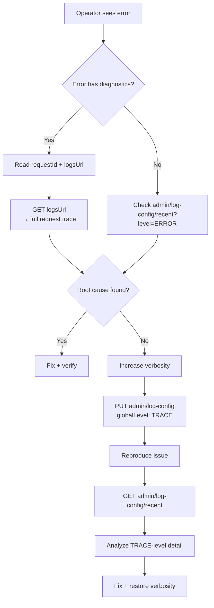
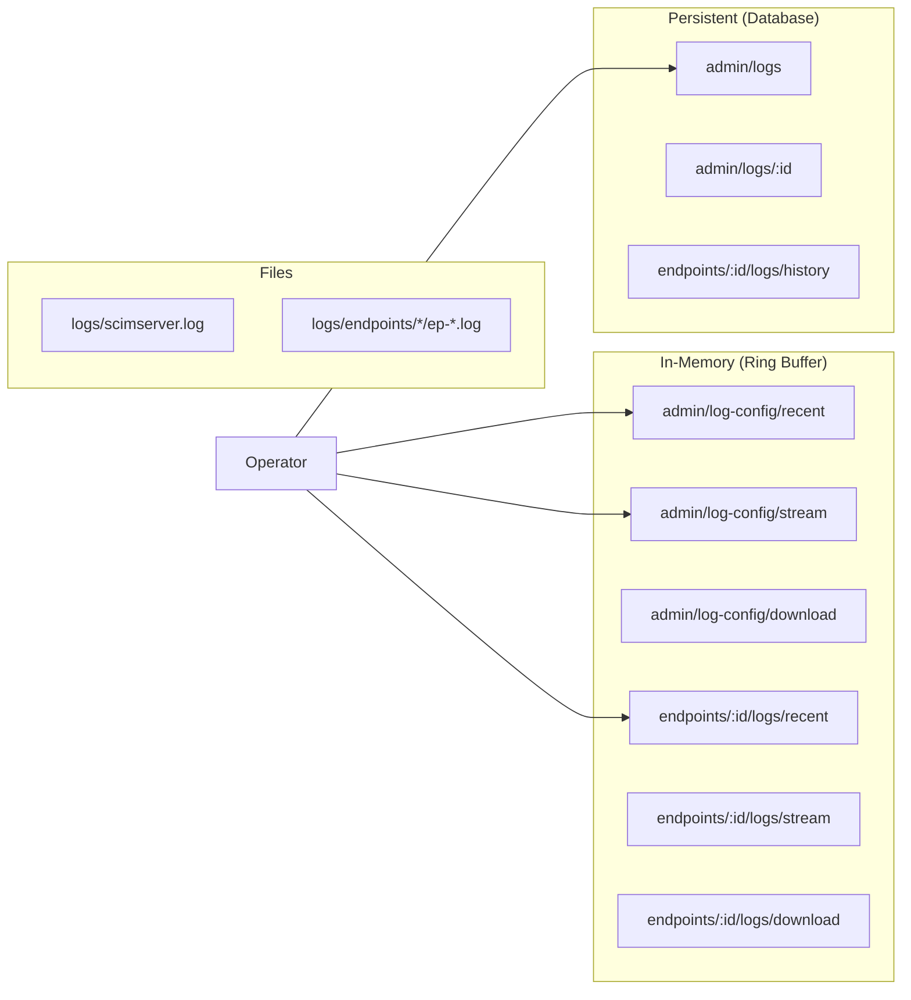

# Remote Debugging & Diagnosis Guide

> **Version:** 3.0 - **Source-verified against:** v0.40.0 - **Rewritten:** April 13, 2026  
> Complete guide for diagnosing production issues without SSH access.

---

## Table of Contents

0. [Quick Start - Fetching Logs & Audit Data](#0-quick-start--fetching-logs--audit-data)
   - [0.1 Authentication](#01-authentication)
   - [0.2 View Recent Logs (Ring Buffer)](#02-view-recent-logs-ring-buffer)
   - [0.3 View Audit Trail](#03-view-audit-trail)
   - [0.4 View Per-Endpoint Logs](#04-view-per-endpoint-logs-tenant-isolated)
   - [0.5 View Persistent Request History](#05-view-persistent-request-history-full-requestresponse-bodies)
   - [0.6 Trace a Failed Request (RCA)](#06-trace-a-failed-request-rca-via-requestid)
   - [0.7 Log Files (On-Disk)](#07-log-files-on-disk)
   - [0.8 SSE Live Stream](#08-sse-live-stream-real-time-tail)
   - [0.9 Change Log Level at Runtime](#09-change-log-level-at-runtime)
   - [0.10 Web UI (Admin Dashboard)](#010-web-ui-admin-dashboard)
   - [0.11 Health Endpoint](#011-health-endpoint)
1. [Zero-Access Diagnosis Model](#1-zero-access-diagnosis-model)
2. [Diagnosis Endpoints](#2-diagnosis-endpoints)
3. [Self-Service RCA via Error Responses](#3-self-service-rca-via-error-responses)
4. [Ring Buffer Query Recipes](#4-ring-buffer-query-recipes)
5. [SSE Live Tailing](#5-sse-live-tailing)
6. [Log Download & Export](#6-log-download--export)
7. [Per-Endpoint Log Isolation](#7-per-endpoint-log-isolation)
8. [Persistent Log History](#8-persistent-log-history)
9. [Runtime Log Level Tuning](#9-runtime-log-level-tuning)
10. [Audit Trail](#10-audit-trail)
11. [Diagnosis Workflows](#11-diagnosis-workflows)
12. [Troubleshooting: Common Errors (20 Scenarios)](#12-troubleshooting-common-errors-20-scenarios)
13. [Deployment-Specific Access](#13-deployment-specific-access)
14. [Mermaid Diagrams](#14-mermaid-diagrams)
15. [Quick Reference Card](#15-quick-reference-card)

---

## 0. Quick Start - Fetching Logs & Audit Data

> **Audience:** Colleague who has never used SCIMServer. This section gets you from zero to reading logs in under 2 minutes.

### 0.1 Authentication

All observability endpoints require a bearer token. Use the **shared secret** for the deployment you're targeting:

| Deployment | Base URL | Shared Secret (Bearer Token) |
|------------|----------|------------------------------|
| **Local** (InMemory, port 6000) | `http://localhost:6000` | `local-secret` |
| **Docker** (PostgreSQL, port 8080) | `http://localhost:8080` | `devscimsharedsecret` |
| **Azure** (live production) | `https://scimserver2.yellowsmoke-af7a3fff.eastus.azurecontainerapps.io` | `changeme-scim` |

Every request below requires this header:

```
Authorization: Bearer <shared-secret>
```

**PowerShell setup (choose one):**

```powershell
# Azure (live):
$base = "https://scimserver2.yellowsmoke-af7a3fff.eastus.azurecontainerapps.io"
$h = @{ Authorization = "Bearer changeme-scim" }

# Docker:
# $base = "http://localhost:8080"; $h = @{ Authorization = "Bearer devscimsharedsecret" }

# Local:
# $base = "http://localhost:6000"; $h = @{ Authorization = "Bearer local-secret" }
```

---

### 0.2 View Recent Logs (Ring Buffer)

The server keeps the last 2,000 log entries in an in-memory ring buffer. This is the fastest way to see what happened.

| Property | Value |
|----------|-------|
| **Method** | `GET` |
| **URL** | `/scim/admin/log-config/recent?limit=25` |
| **Headers** | `Authorization: Bearer <token>` |
| **Query params** | `limit` (int), `level` (TRACE\|DEBUG\|INFO\|WARN\|ERROR\|FATAL), `category` (http\|auth\|scim.user\|...), `requestId` (UUID), `endpointId` (UUID) |

**Request:**

```http
GET /scim/admin/log-config/recent?limit=3&level=INFO HTTP/1.1
Host: scimserver2.yellowsmoke-af7a3fff.eastus.azurecontainerapps.io
Authorization: Bearer changeme-scim
```

**Response: `200 OK`**

```json
{
  "count": 3,
  "entries": [
    {
      "timestamp": "2026-04-13T10:30:45.123Z",
      "level": "INFO",
      "category": "scim.user",
      "message": "User created",
      "requestId": "a1b2c3d4-e5f6-7890-abcd-ef1234567890",
      "endpointId": "f8e7d6c5-b4a3-2190-fedc-ba0987654321",
      "method": "POST",
      "path": "/scim/endpoints/f8e7d6c5-.../Users",
      "durationMs": 45,
      "authType": "oauth",
      "resourceType": "User",
      "resourceId": "usr-abc-123",
      "operation": "create"
    },
    {
      "timestamp": "2026-04-13T10:30:46.456Z",
      "level": "WARN",
      "category": "http",
      "message": "Slow request: 3456ms",
      "requestId": "b2c3d4e5-...",
      "method": "GET",
      "path": "/scim/endpoints/.../Users",
      "durationMs": 3456
    },
    {
      "timestamp": "2026-04-13T10:30:47.789Z",
      "level": "INFO",
      "category": "auth",
      "message": "OAuth 2.0 authentication successful",
      "authType": "oauth",
      "data": { "clientId": "scimclient" }
    }
  ]
}
```

**PowerShell:**

```powershell
# All recent logs
Invoke-RestMethod "$base/scim/admin/log-config/recent?limit=25" -Headers $h | ConvertTo-Json -Depth 5

# Errors only (WARN+)
Invoke-RestMethod "$base/scim/admin/log-config/recent?level=WARN&limit=50" -Headers $h | ConvertTo-Json -Depth 5

# Only auth events
Invoke-RestMethod "$base/scim/admin/log-config/recent?category=auth" -Headers $h | ConvertTo-Json -Depth 5
```

**curl:**

```bash
curl -s "https://scimserver2.yellowsmoke-af7a3fff.eastus.azurecontainerapps.io/scim/admin/log-config/recent?limit=25" \
  -H "Authorization: Bearer changeme-scim" | jq
```

---

### 0.3 View Audit Trail

The audit trail filters the ring buffer to show only CONFIG, ENDPOINT, and AUTH category events - config changes, endpoint CRUD, credential management, auth successes/failures.

| Property | Value |
|----------|-------|
| **Method** | `GET` |
| **URL** | `/scim/admin/log-config/audit?limit=100` |
| **Headers** | `Authorization: Bearer <token>` |

**Request:**

```http
GET /scim/admin/log-config/audit?limit=100 HTTP/1.1
Authorization: Bearer changeme-scim
```

**Response: `200 OK`**

```json
{
  "count": 4,
  "entries": [
    {
      "timestamp": "2026-04-13T10:00:00.000Z",
      "level": "INFO",
      "category": "config",
      "message": "Log configuration updated",
      "data": {
        "changes": {
          "globalLevel": { "from": 2, "to": 0 }
        }
      }
    },
    {
      "timestamp": "2026-04-13T09:55:00.000Z",
      "level": "INFO",
      "category": "auth",
      "message": "OAuth 2.0 authentication successful",
      "data": { "clientId": "scimclient" }
    },
    {
      "timestamp": "2026-04-13T09:50:00.000Z",
      "level": "INFO",
      "category": "endpoint",
      "message": "Endpoint created",
      "data": { "name": "contoso-prod", "preset": "entra-id" }
    },
    {
      "timestamp": "2026-04-13T09:45:00.000Z",
      "level": "WARN",
      "category": "auth",
      "message": "Authentication failed – per-endpoint, OAuth, and legacy token all invalid",
      "requestId": "c3d4e5f6-..."
    }
  ]
}
```

**PowerShell:**

```powershell
Invoke-RestMethod "$base/scim/admin/log-config/audit?limit=100" -Headers $h | ConvertTo-Json -Depth 5
```

---

### 0.4 View Per-Endpoint Logs (Tenant-Isolated)

Each SCIM endpoint has isolated log access. Per-endpoint credential holders can only see their own endpoint's logs.

**Step 1 - List endpoints to get IDs:**

| Property | Value |
|----------|-------|
| **Method** | `GET` |
| **URL** | `/scim/admin/endpoints` |

```powershell
Invoke-RestMethod "$base/scim/admin/endpoints" -Headers $h | ConvertTo-Json -Depth 3
```

**Response excerpt:**

```json
{
  "totalResults": 2,
  "endpoints": [
    { "id": "f8e7d6c5-b4a3-2190-fedc-ba0987654321", "name": "contoso-prod", "isActive": true },
    { "id": "a1b2c3d4-5678-90ab-cdef-1234567890ab", "name": "fabrikam-test", "isActive": true }
  ]
}
```

**Step 2 - Get logs for that endpoint:**

| Property | Value |
|----------|-------|
| **Method** | `GET` |
| **URL** | `/scim/endpoints/{endpointId}/logs/recent?limit=50` |
| **Headers** | `Authorization: Bearer <token>` |
| **Query params** | `limit`, `level`, `category`, `requestId`, `method` |

**Request:**

```http
GET /scim/endpoints/f8e7d6c5-b4a3-2190-fedc-ba0987654321/logs/recent?limit=10&level=INFO HTTP/1.1
Authorization: Bearer changeme-scim
```

**Response: `200 OK`**

```json
{
  "endpointId": "f8e7d6c5-b4a3-2190-fedc-ba0987654321",
  "count": 10,
  "entries": [
    {
      "timestamp": "2026-04-13T10:30:45.123Z",
      "level": "INFO",
      "category": "scim.user",
      "message": "User created",
      "requestId": "a1b2c3d4-...",
      "endpointId": "f8e7d6c5-...",
      "method": "POST",
      "path": "/scim/endpoints/f8e7d6c5-.../Users",
      "durationMs": 45,
      "resourceType": "User",
      "operation": "create"
    }
  ]
}
```

**PowerShell:**

```powershell
$epId = "f8e7d6c5-b4a3-2190-fedc-ba0987654321"
Invoke-RestMethod "$base/scim/endpoints/$epId/logs/recent?limit=50" -Headers $h | ConvertTo-Json -Depth 5
```

---

### 0.5 View Persistent Request History (Full Request/Response Bodies)

Beyond the ring buffer, every HTTP request is persisted to the database with full headers and bodies. This survives server restarts.

| Property | Value |
|----------|-------|
| **Method** | `GET` |
| **URL** | `/scim/admin/logs?pageSize=10` |
| **Headers** | `Authorization: Bearer <token>` |
| **Query params** | `page`, `pageSize`, `method`, `status`, `search`, `since`, `until`, `minDurationMs`, `includeAdmin`, `hideKeepalive` |

**Request - list recent requests:**

```http
GET /scim/admin/logs?pageSize=5&status=409 HTTP/1.1
Authorization: Bearer changeme-scim
```

**Response: `200 OK`**

```json
{
  "total": 23,
  "page": 1,
  "pageSize": 5,
  "count": 5,
  "hasNext": true,
  "hasPrev": false,
  "items": [
    {
      "id": "clu8x9y0z-log-uuid-001",
      "method": "POST",
      "url": "/scim/endpoints/f8e7d6c5-.../Users",
      "status": 409,
      "durationMs": 23,
      "createdAt": "2026-04-13T10:30:45.000Z",
      "errorMessage": "A resource with userName 'jsmith@contoso.com' already exists.",
      "reportableIdentifier": "jsmith@contoso.com"
    }
  ]
}
```

**Request - full detail for one entry (includes headers + bodies):**

| Property | Value |
|----------|-------|
| **Method** | `GET` |
| **URL** | `/scim/admin/logs/{logId}` |

```http
GET /scim/admin/logs/clu8x9y0z-log-uuid-001 HTTP/1.1
Authorization: Bearer changeme-scim
```

**Response: `200 OK`**

```json
{
  "id": "clu8x9y0z-log-uuid-001",
  "method": "POST",
  "url": "/scim/endpoints/f8e7d6c5-.../Users",
  "status": 409,
  "durationMs": 23,
  "createdAt": "2026-04-13T10:30:45.000Z",
  "requestHeaders": {
    "content-type": "application/scim+json",
    "authorization": "Bearer ey...",
    "x-request-id": "f47ac10b-58cc-4372-a567-0e02b2c3d479",
    "user-agent": "azure-ad-scim-provisioning/1.0"
  },
  "requestBody": {
    "schemas": ["urn:ietf:params:scim:schemas:core:2.0:User"],
    "userName": "jsmith@contoso.com",
    "name": { "givenName": "John", "familyName": "Smith" },
    "emails": [{ "value": "jsmith@contoso.com", "primary": true }],
    "active": true
  },
  "responseHeaders": {
    "content-type": "application/scim+json; charset=utf-8",
    "x-request-id": "f47ac10b-58cc-4372-a567-0e02b2c3d479",
    "etag": "W/\"v1-abc123\""
  },
  "responseBody": {
    "schemas": ["urn:ietf:params:scim:api:messages:2.0:Error"],
    "detail": "A resource with userName 'jsmith@contoso.com' already exists.",
    "status": "409",
    "scimType": "uniqueness",
    "urn:scimserver:api:messages:2.0:Diagnostics": {
      "requestId": "f47ac10b-58cc-4372-a567-0e02b2c3d479",
      "endpointId": "f8e7d6c5-...",
      "errorCode": "UNIQUENESS_USERNAME",
      "operation": "create",
      "conflictingAttribute": "userName",
      "conflictingResourceId": "usr-existing-456",
      "incomingValue": "jsmith@contoso.com",
      "logsUrl": "/scim/endpoints/f8e7d6c5-.../logs/recent?requestId=f47ac10b-..."
    }
  },
  "errorMessage": "A resource with userName 'jsmith@contoso.com' already exists.",
  "reportableIdentifier": "jsmith@contoso.com"
}
```

**PowerShell:**

```powershell
# List recent requests
Invoke-RestMethod "$base/scim/admin/logs?pageSize=10" -Headers $h | ConvertTo-Json -Depth 5

# Search by userName or email
Invoke-RestMethod "$base/scim/admin/logs?search=jsmith@contoso.com" -Headers $h | ConvertTo-Json -Depth 5

# Full detail for one request
$logId = "clu8x9y0z-log-uuid-001"
Invoke-RestMethod "$base/scim/admin/logs/$logId" -Headers $h | ConvertTo-Json -Depth 10
```

---

### 0.6 Trace a Failed Request (RCA via requestId)

Every SCIM error response includes a `requestId` in the diagnostics extension. Use it to retrieve all correlated log entries for that exact request.

**Step 1 - Find the requestId in the error response:**

When any SCIM request fails, the response body includes:

```json
{
  "schemas": ["urn:ietf:params:scim:api:messages:2.0:Error"],
  "detail": "A resource with userName 'jsmith@contoso.com' already exists.",
  "status": "409",
  "scimType": "uniqueness",
  "urn:scimserver:api:messages:2.0:Diagnostics": {
    "requestId": "f47ac10b-58cc-4372-a567-0e02b2c3d479",
    "logsUrl": "/scim/endpoints/f8e7d6c5-.../logs/recent?requestId=f47ac10b-..."
  }
}
```

**Step 2 - Query logs by requestId:**

```http
GET /scim/admin/log-config/recent?requestId=f47ac10b-58cc-4372-a567-0e02b2c3d479 HTTP/1.1
Authorization: Bearer changeme-scim
```

**Response - the full correlated trace for that request:**

```json
{
  "count": 5,
  "entries": [
    { "level": "DEBUG", "category": "http", "message": "→ POST /scim/endpoints/.../Users",
      "data": { "userAgent": "azure-ad-scim-provisioning/1.0", "contentType": "application/scim+json" } },
    { "level": "TRACE", "category": "http", "message": "Request body",
      "data": { "body": { "schemas": ["..."], "userName": "jsmith@contoso.com" } } },
    { "level": "INFO",  "category": "auth", "message": "OAuth 2.0 authentication successful" },
    { "level": "INFO",  "category": "scim.user", "message": "Uniqueness conflict: userName",
      "data": { "conflictingResourceId": "usr-existing-456" } },
    { "level": "INFO",  "category": "http", "message": "← 409 POST /scim/endpoints/.../Users" }
  ]
}
```

**PowerShell:**

```powershell
$reqId = "f47ac10b-58cc-4372-a567-0e02b2c3d479"
Invoke-RestMethod "$base/scim/admin/log-config/recent?requestId=$reqId" -Headers $h | ConvertTo-Json -Depth 5
```

---

### 0.7 Log Files (On-Disk)

SCIMServer writes structured JSON logs to rotating files. Each line is one JSON object (NDJSON format).

#### File Layout

```
logs/
  scimserver.log                              ← ALL traffic (current, up to 10 MB)
  scimserver.log.1                            ← previous rotation
  scimserver.log.2                            ← oldest rotation (3 files max)
  endpoints/
    contoso-prod_ep-f8e7d6c5/
      contoso-prod_ep-f8e7d6c5.log            ← endpoint-specific logs
```

#### Configuration

| Env Var | Default | Description |
|---------|---------|-------------|
| `LOG_FILE` | `logs/scimserver.log` | Main log path. Set `""` to disable file logging. |
| `LOG_FILE_MAX_SIZE` | `10485760` (10 MB) | Max bytes per file before rotation |
| `LOG_FILE_MAX_COUNT` | `3` | Rotated files to keep |

#### Accessing Log Files by Deployment

**Local:**

```powershell
# Tail last 20 entries
Get-Content logs/scimserver.log -Tail 20 | ForEach-Object { $_ | ConvertFrom-Json } | Format-Table timestamp, level, category, message

# Stream in real-time
Get-Content logs/scimserver.log -Wait | ForEach-Object { $_ | ConvertFrom-Json }
```

**Docker:**

```bash
# Copy file out of container
docker cp scimserver-api:/app/logs/scimserver.log ./scimserver.log

# View inside container
docker exec scimserver-api cat /app/logs/scimserver.log | jq

# If volume-mounted (docker-compose.yml: volumes: - ./logs:/app/logs):
tail -f logs/scimserver.log | jq
```

**Azure Container Apps:**

Log files are **ephemeral** inside the container (lost on restart/scale). Use the download API instead:

| Property | Value |
|----------|-------|
| **Method** | `GET` |
| **URL** | `/scim/admin/log-config/download` |
| **Query params** | `format` (ndjson\|json), `limit`, `level`, `category`, `requestId`, `endpointId` |
| **Response** | File download with `Content-Disposition` header |

```http
GET /scim/admin/log-config/download?format=ndjson&level=WARN HTTP/1.1
Authorization: Bearer changeme-scim
```

**Response:** File download - `scimserver-logs-2026-04-13T10-30-45.ndjson`

```
{"timestamp":"2026-04-13T10:30:46.456Z","level":"WARN","category":"http","message":"Slow request: 3456ms","durationMs":3456,...}
{"timestamp":"2026-04-13T10:31:02.789Z","level":"ERROR","category":"http","message":"Unhandled TypeError on POST /scim/...","error":{"message":"Cannot read properties of undefined",...},...}
```

**PowerShell:**

```powershell
# Download as NDJSON (default)
Invoke-RestMethod "$base/scim/admin/log-config/download" -Headers $h -OutFile "scimserver-logs.ndjson"

# Download errors only as JSON array
Invoke-RestMethod "$base/scim/admin/log-config/download?format=json&level=WARN" -Headers $h -OutFile "errors.json"

# Per-endpoint download
Invoke-RestMethod "$base/scim/endpoints/$epId/logs/download?format=ndjson" -Headers $h -OutFile "endpoint-logs.ndjson"
```

Azure also ingests stdout/stderr JSON into Log Analytics:

```bash
az containerapp logs show -n scimserver2 -g scimserver-rg --tail 50
```

---

### 0.8 SSE Live Stream (Real-Time Tail)

Stream log entries as they happen via Server-Sent Events. Use `curl` (not `Invoke-RestMethod` - SSE requires a streaming client).

| Property | Value |
|----------|-------|
| **Method** | `GET` |
| **URL** | `/scim/admin/log-config/stream?level=INFO` |
| **Headers** | `Authorization: Bearer <token>` |
| **Response** | `text/event-stream` (SSE) |

**Request:**

```bash
curl -N "https://scimserver2.yellowsmoke-af7a3fff.eastus.azurecontainerapps.io/scim/admin/log-config/stream?level=INFO" \
  -H "Authorization: Bearer changeme-scim"
```

**Response (streaming):**

```
event: connected
data: {"message":"Log stream connected","filters":{"level":"INFO","category":"ALL","endpointId":"ALL"}}

data: {"timestamp":"2026-04-13T10:30:45.123Z","level":"INFO","category":"scim.user","message":"User created","requestId":"a1b2c3d4-...","endpointId":"f8e7d6c5-...","method":"POST","path":"/scim/endpoints/.../Users","durationMs":45}

: ping 2026-04-13T10:31:15.000Z

data: {"timestamp":"2026-04-13T10:31:20.456Z","level":"WARN","category":"http","message":"Slow request: 3456ms","durationMs":3456}
```

**Per-endpoint stream:**

```bash
curl -N "https://host/scim/endpoints/f8e7d6c5-.../logs/stream?level=WARN" \
  -H "Authorization: Bearer changeme-scim"
```

Press `Ctrl+C` to stop.

---

### 0.9 Change Log Level at Runtime

Increase verbosity for debugging without restarting the server. Levels: `TRACE` > `DEBUG` > `INFO` > `WARN` > `ERROR` > `FATAL` > `OFF`.

| Property | Value |
|----------|-------|
| **Method** | `PUT` |
| **URL** | `/scim/admin/log-config/level/{level}` |

**Request - set to TRACE (maximum detail, shows full request/response bodies):**

```http
PUT /scim/admin/log-config/level/TRACE HTTP/1.1
Authorization: Bearer changeme-scim
```

**Response: `200 OK`**

```json
{
  "message": "Global log level set to TRACE",
  "globalLevel": "TRACE"
}
```

**View current config:**

```http
GET /scim/admin/log-config HTTP/1.1
Authorization: Bearer changeme-scim
```

**Response: `200 OK`**

```json
{
  "globalLevel": "TRACE",
  "categoryLevels": {},
  "endpointLevels": {},
  "includePayloads": true,
  "includeStackTraces": true,
  "maxPayloadSizeBytes": 8192,
  "format": "pretty",
  "availableLevels": ["TRACE", "DEBUG", "INFO", "WARN", "ERROR", "FATAL", "OFF"],
  "availableCategories": ["http", "auth", "scim.user", "scim.group", "scim.patch", "scim.filter", "scim.discovery", "endpoint", "database", "oauth", "scim.bulk", "scim.resource", "config", "general"]
}
```

**Restore after debugging:**

```http
PUT /scim/admin/log-config/level/INFO HTTP/1.1
Authorization: Bearer changeme-scim
```

**PowerShell:**

```powershell
# View current config
Invoke-RestMethod "$base/scim/admin/log-config" -Headers $h | ConvertTo-Json -Depth 3

# Set to TRACE
Invoke-RestMethod -Method PUT "$base/scim/admin/log-config/level/TRACE" -Headers $h

# Set only one endpoint to DEBUG
Invoke-RestMethod -Method PUT "$base/scim/admin/log-config/endpoint/$epId/DEBUG" -Headers $h

# Set only PATCH category to TRACE
Invoke-RestMethod -Method PUT "$base/scim/admin/log-config/category/scim.patch/TRACE" -Headers $h

# Restore to INFO
Invoke-RestMethod -Method PUT "$base/scim/admin/log-config/level/INFO" -Headers $h
```

---

### 0.10 Web UI (Admin Dashboard)

SCIMServer includes a built-in React SPA served at `/admin` that provides a browser-based interface for all log and data browsing operations.

**Access URL:** `{base-url}/admin`

| Deployment | Admin Dashboard URL |
|------------|-------------------|
| **Local** | `http://localhost:6000/admin` |
| **Docker** | `http://localhost:8080/admin` |
| **Azure** | `https://scimserver2.yellowsmoke-af7a3fff.eastus.azurecontainerapps.io/admin` |

**Features:**

| Tab | Description |
|-----|-------------|
| **Activity Feed** | Human-readable log entries with icons, severity colors, keepalive filtering, auto-refresh (10s) |
| **Raw Logs** | Searchable request log list with method/status/duration filters, full request/response detail modal |
| **Database** | Browse Users and Groups with pagination, search, detail modals, inline JSON payload view |
| **Manual Provisioning** | Create users/groups directly for collision testing |

**Authentication:** The SPA requires a bearer token on first use. Enter the shared secret for your deployment (same as the API token). The token is stored in `localStorage` (`scimserver.authToken`).

**No separate build required** - the SPA is pre-built and served as static files from `api/public/`. It uses client-side routing at `/admin`.

---

### 0.11 Health Endpoint

The health endpoint is public (no auth required) and used by Docker HEALTHCHECK and container orchestrators.

| Property | Value |
|----------|-------|
| **Method** | `GET` |
| **URL** | `/health` |
| **Auth** | None (public, `@Public()` decorator) |

**Request:**

```http
GET /health HTTP/1.1
Host: scimserver2.yellowsmoke-af7a3fff.eastus.azurecontainerapps.io
```

**Response: `200 OK`**

```json
{
  "status": "ok",
  "uptime": 86400,
  "timestamp": "2026-04-13T10:30:45.123Z"
}
```

**curl:**

```bash
# No auth needed
curl -s https://scimserver2.yellowsmoke-af7a3fff.eastus.azurecontainerapps.io/health | jq
```

---

## 1. Zero-Access Diagnosis Model

SCIMServer is designed for environments where operators have **no SSH/shell access** to the running container (Azure Container Apps, managed Docker, etc.). All diagnosis is done through HTTP endpoints.

### Diagnosis Capabilities

| Capability | Endpoint | Auth Required |
|-----------|----------|---------------|
| View recent logs | `GET /scim/admin/log-config/recent` | Bearer token |
| Live-tail logs | `GET /scim/admin/log-config/stream` | Bearer token |
| Download logs | `GET /scim/admin/log-config/download` | Bearer token |
| Change log verbosity | `PUT /scim/admin/log-config` | Bearer token |
| View audit trail | `GET /scim/admin/log-config/audit` | Bearer token |
| View request history | `GET /scim/admin/logs` | Bearer token |
| View request detail | `GET /scim/admin/logs/:id` | Bearer token |
| Per-endpoint logs | `GET /scim/endpoints/:id/logs/recent` | Bearer token |
| Self-service RCA | _(embedded in error responses)_ | Not needed |

### Architecture

```
┌──────────────────────────────────────────────────┐
│                   Operator                        │
│                                                   │
│  1. Sees error response with diagnostics          │
│     → requestId, endpointId, logsUrl              │
│                                                   │
│  2. Clicks logsUrl (or queries admin API)          │
│     → GET /scim/admin/log-config/recent?requestId  │
│                                                   │
│  3. Gets full request trace with correlation       │
│     → auth, service, DB, response - all linked     │
│                                                   │
│  4. If more detail needed:                         │
│     → PUT /scim/admin/log-config with TRACE level  │
│     → Reproduce issue                              │
│     → GET /scim/admin/log-config/recent            │
│                                                   │
│  5. Download logs for offline analysis              │
│     → GET /scim/admin/log-config/download           │
└──────────────────────────────────────────────────┘
```

---

## 2. Diagnosis Endpoints

### Admin Log Config API (`/scim/admin/log-config/*`)

| Method | Route | Description |
|--------|-------|-------------|
| `GET` | `/scim/admin/log-config` | Current log configuration |
| `PUT` | `/scim/admin/log-config` | Update config (partial) |
| `PUT` | `/scim/admin/log-config/level/:level` | Set global log level |
| `PUT` | `/scim/admin/log-config/category/:cat/:level` | Set category level |
| `PUT` | `/scim/admin/log-config/endpoint/:id/:level` | Set endpoint level |
| `DELETE` | `/scim/admin/log-config/endpoint/:id` | Remove endpoint override |
| `GET` | `/scim/admin/log-config/recent` | Ring buffer query |
| `GET` | `/scim/admin/log-config/audit` | Audit trail |
| `DELETE` | `/scim/admin/log-config/recent` | Clear ring buffer |
| `GET` | `/scim/admin/log-config/stream` | SSE live stream |
| `GET` | `/scim/admin/log-config/download` | File download |

### Per-Endpoint Log API (`/scim/endpoints/:id/logs/*`)

| Method | Route | Description |
|--------|-------|-------------|
| `GET` | `/scim/endpoints/:id/logs/recent` | Ring buffer filtered by endpoint |
| `GET` | `/scim/endpoints/:id/logs/stream` | SSE stream filtered by endpoint |
| `GET` | `/scim/endpoints/:id/logs/download` | Download filtered by endpoint |
| `GET` | `/scim/endpoints/:id/logs/history` | Persistent DB logs filtered |

### Persistent Log API (`/scim/admin/logs/*`)

| Method | Route | Description |
|--------|-------|-------------|
| `GET` | `/scim/admin/logs` | Paginated log list with filters |
| `GET` | `/scim/admin/logs/:id` | Full request/response detail |
| `POST` | `/scim/admin/logs/clear` | Clear all persistent logs |
| `POST` | `/scim/admin/logs/prune?retentionDays=N` | Delete logs older than N days (default: `LOG_RETENTION_DAYS` or 30) |

### Activity Feed API (`/scim/admin/activity/*`)

| Method | Route | Description |
|--------|-------|-------------|
| `GET` | `/scim/admin/activity` | Human-readable activity feed (parsed from raw logs) |
| `GET` | `/scim/admin/activity/summary` | Activity summary stats (last 24h, last week, by type) |

The activity feed converts raw request logs into human-readable entries with icons, severity levels, and Entra keepalive detection. Query params: `page`, `limit`, `type` (user/group/system), `severity` (info/success/warning/error), `search`, `hideKeepalive` (true/false).

---

## 3. Self-Service RCA via Error Responses

Every SCIM error response includes a diagnostics extension with everything needed for root cause analysis:

### Example: 409 Conflict

```json
{
  "schemas": ["urn:ietf:params:scim:api:messages:2.0:Error"],
  "detail": "userName \"jsmith\" already exists on this endpoint",
  "status": "409",
  "scimType": "uniqueness",
  "urn:scimserver:api:messages:2.0:Diagnostics": {
    "requestId": "f47ac10b-58cc-4372-a567-0e02b2c3d479",
    "endpointId": "ep-contoso-prod",
    "errorCode": "UNIQUENESS_VIOLATION",
    "conflictingAttribute": "userName",
    "conflictingResourceId": "usr-existing-123",
    "incomingValue": "jsmith",
    "logsUrl": "/scim/endpoints/ep-contoso-prod/logs/recent?requestId=f47ac10b-58cc-4372-a567-0e02b2c3d479"
  }
}
```

### RCA Workflow

1. **Read the error response** - `detail`, `scimType`, and diagnostics tell you what happened
2. **Click/query `logsUrl`** - see all correlated logs for this exact request
3. **Check `conflictingResourceId`** - look up the existing resource that caused the conflict
4. **If more detail needed** - set endpoint to TRACE, reproduce, check ring buffer

---

## 4. Ring Buffer Query Recipes

The ring buffer holds the last 2,000 log entries in memory. Queries are instant and don't require database access.

### Common Queries

```bash
# Last 25 entries (default)
curl -s https://host/scim/admin/log-config/recent?limit=25 \
  -H "Authorization: Bearer $TOKEN" | jq '.entries'

# Errors only (WARN and above)
curl -s https://host/scim/admin/log-config/recent?level=WARN&limit=100 \
  -H "Authorization: Bearer $TOKEN" | jq '.entries[] | {level, category, message}'

# Trace a specific request
curl -s "https://host/scim/admin/log-config/recent?requestId=f47ac10b-..." \
  -H "Authorization: Bearer $TOKEN" | jq '.entries'

# All PATCH operations
curl -s https://host/scim/admin/log-config/recent?category=scim.patch \
  -H "Authorization: Bearer $TOKEN"

# Specific endpoint's logs
curl -s "https://host/scim/admin/log-config/recent?endpointId=ep-abc123" \
  -H "Authorization: Bearer $TOKEN"

# Or use endpoint-scoped URL (same result):
curl -s https://host/scim/endpoints/ep-abc123/logs/recent \
  -H "Authorization: Bearer $TOKEN"
```

### Response Format

```json
{
  "count": 25,
  "entries": [
    {
      "timestamp": "2026-04-13T10:30:45.123Z",
      "level": "INFO",
      "category": "scim.user",
      "message": "User created",
      "requestId": "a1b2c3d4-...",
      "endpointId": "ep-contoso-prod",
      "method": "POST",
      "path": "/scim/endpoints/ep-contoso-prod/Users",
      "durationMs": 45,
      "authType": "oauth",
      "resourceType": "User",
      "resourceId": "usr-abc-123",
      "operation": "create"
    }
  ]
}
```

### Miss Hint

When a `requestId` search returns nothing (entry evicted from ring buffer), the API suggests checking persistent logs:

```json
{
  "count": 0,
  "entries": [],
  "hint": "No entries in ring buffer for requestId 'abc'. Try persistent logs: GET /scim/admin/logs?search=abc"
}
```

---

## 5. SSE Live Tailing

Real-time log streaming via Server-Sent Events - no polling required.

### Usage

```bash
# Terminal 1: Stream all INFO+ logs
curl -N https://host/scim/admin/log-config/stream?level=INFO \
  -H "Authorization: Bearer $TOKEN"

# Terminal 2: Stream auth events only
curl -N https://host/scim/admin/log-config/stream?category=auth \
  -H "Authorization: Bearer $TOKEN"

# Terminal 3: Stream for a specific endpoint
curl -N https://host/scim/endpoints/ep-abc123/logs/stream \
  -H "Authorization: Bearer $TOKEN"
```

### Output

```
event: connected
data: {"message":"Log stream connected","filters":{"level":"INFO","category":"ALL","endpointId":"ALL"}}

data: {"timestamp":"2026-04-13T10:30:45.123Z","level":"INFO","category":"scim.user","message":"User created",...}

data: {"timestamp":"2026-04-13T10:30:46.456Z","level":"WARN","category":"http","message":"Slow request: 3456ms",...}

: ping 2026-04-13T10:31:15.000Z

data: {"timestamp":"...","level":"ERROR","category":"http","message":"Unhandled TypeError on POST /scim/...",...}
```

### JavaScript/Browser

```javascript
const source = new EventSource('/scim/admin/log-config/stream?level=WARN');

source.addEventListener('connected', (e) => {
  console.log('Connected:', JSON.parse(e.data));
});

source.onmessage = (e) => {
  const entry = JSON.parse(e.data);
  console.log(`[${entry.level}] ${entry.category}: ${entry.message}`);
};

source.onerror = () => console.log('SSE connection lost, retrying...');
```

### Protocol Details

- Keep-alive pings every 30 seconds prevent proxy timeouts
- `X-Accel-Buffering: no` disables NGINX buffering
- Up to 50 concurrent SSE clients supported
- Automatic cleanup on client disconnect

---

## 6. Log Download & Export

Download ring buffer contents as a file for offline analysis:

```bash
# NDJSON format (default - one JSON per line, ideal for grep/jq)
curl -O https://host/scim/admin/log-config/download \
  -H "Authorization: Bearer $TOKEN"

# JSON format (array, for tools that need strict JSON)
curl -O https://host/scim/admin/log-config/download?format=json \
  -H "Authorization: Bearer $TOKEN"

# Filtered download (only errors, last 500 entries)
curl -O "https://host/scim/admin/log-config/download?level=ERROR&limit=500" \
  -H "Authorization: Bearer $TOKEN"

# Per-endpoint download
curl -O https://host/scim/endpoints/ep-abc123/logs/download?format=ndjson \
  -H "Authorization: Bearer $TOKEN"
```

### File Details

| Format | Content-Type | Extension | Example |
|--------|-------------|-----------|---------|
| NDJSON | `application/x-ndjson` | `.ndjson` | `scimserver-logs-2026-04-13T10-30-45.ndjson` |
| JSON | `application/json` | `.json` | `scimserver-logs-2026-04-13T10-30-45.json` |

The `Content-Disposition` header triggers browser download with a timestamped filename.

---

## 7. Per-Endpoint Log Isolation

Each SCIM endpoint has isolated log access, providing tenant-safe log visibility:

```bash
# Per-endpoint recent logs
GET /scim/endpoints/{endpointId}/logs/recent?limit=50

# Per-endpoint SSE stream
GET /scim/endpoints/{endpointId}/logs/stream?level=INFO

# Per-endpoint log download
GET /scim/endpoints/{endpointId}/logs/download

# Per-endpoint persistent history
GET /scim/endpoints/{endpointId}/logs/history?page=1&pageSize=20
```

### Security Model

- The `endpointId` is taken from the URL path parameter (not query string)
- Per-endpoint credential holders can only access their own endpoint's logs
- Admin token holders can access all endpoints via the admin API

### History Endpoint

The `/history` endpoint queries the persistent database (not ring buffer):

```bash
GET /scim/endpoints/{id}/logs/history?method=POST&status=409&search=userName&page=1
```

Supports: `page`, `pageSize`, `method`, `status`, `search`, `since`, `until`, `minDurationMs`

---

## 8. Persistent Log History

Beyond the ring buffer, every request is persisted to the database with full request/response payloads.

### List Logs

```bash
# Paginated list (SCIM provisioning only, admin endpoints excluded by default)
GET /scim/admin/logs?page=1&pageSize=50

# Filter by method
GET /scim/admin/logs?method=PATCH

# Filter by status
GET /scim/admin/logs?status=409

# Full text search (searches URL, headers, bodies, error messages)
GET /scim/admin/logs?search=jsmith@contoso.com

# Date range
GET /scim/admin/logs?since=2026-04-01T00:00:00Z&until=2026-04-13T23:59:59Z

# Slow requests only
GET /scim/admin/logs?minDurationMs=2000

# Include admin traffic
GET /scim/admin/logs?includeAdmin=true

# Hide Entra ID keepalive probes
GET /scim/admin/logs?hideKeepalive=true
```

### View Full Request Detail

```bash
GET /scim/admin/logs/{logId}
```

Returns complete request/response including:
- All headers (request + response)
- Full request body
- Full response body
- Error message and stack trace (if error)
- Derived reportable identifier (userName, email, displayName)

---

## 9. Runtime Log Level Tuning

Change log verbosity at runtime without server restart - essential for production debugging:

### Increase Verbosity for Debugging

```bash
# Set global level to TRACE (maximum detail)
curl -X PUT https://host/scim/admin/log-config/level/TRACE \
  -H "Authorization: Bearer $TOKEN"

# Set only PATCH operations to TRACE (targeted)
curl -X PUT https://host/scim/admin/log-config/category/scim.patch/TRACE \
  -H "Authorization: Bearer $TOKEN"

# Set only one endpoint to DEBUG
curl -X PUT https://host/scim/admin/log-config/endpoint/ep-abc123/DEBUG \
  -H "Authorization: Bearer $TOKEN"
```

### Restore Normal Verbosity

```bash
# Set global to INFO
curl -X PUT https://host/scim/admin/log-config/level/INFO \
  -H "Authorization: Bearer $TOKEN"

# Remove endpoint override
curl -X DELETE https://host/scim/admin/log-config/endpoint/ep-abc123 \
  -H "Authorization: Bearer $TOKEN"
```

### Level Override Priority

```
Endpoint override > Category override > Global level
```

Example: If global=INFO but endpoint "ep-abc123" is set to TRACE, all requests hitting that endpoint log at TRACE level regardless of category settings.

---

## 10. Audit Trail

View configuration changes, endpoint management, and authentication events:

```bash
GET /scim/admin/log-config/audit?limit=100
```

Returns ring buffer entries filtered to CONFIG, ENDPOINT, and AUTH categories:

```json
{
  "count": 5,
  "entries": [
    {
      "timestamp": "2026-04-13T10:00:00Z",
      "level": "INFO",
      "category": "config",
      "message": "Log configuration updated",
      "data": {
        "changes": {
          "globalLevel": { "from": 2, "to": 0 }
        }
      }
    },
    {
      "timestamp": "2026-04-13T09:55:00Z",
      "level": "INFO",
      "category": "auth",
      "message": "Per-endpoint credential authentication successful",
      "data": { "endpointId": "ep-abc123", "credentialId": "cred-xyz" }
    }
  ]
}
```

---

## 11. Diagnosis Workflows

### Workflow 1: "User creation is failing with 409"

```bash
# Step 1: Check recent errors
curl -s "https://host/scim/admin/log-config/recent?level=ERROR&category=scim.user" \
  -H "Authorization: Bearer $TOKEN" | jq '.entries[-1]'

# Step 2: Get requestId from error response diagnostics
# The 409 response body contains:
# "urn:scimserver:api:messages:2.0:Diagnostics": {
#   "requestId": "f47ac10b-...",
#   "conflictingResourceId": "usr-existing-123"
# }

# Step 3: Trace the full request
curl -s "https://host/scim/admin/log-config/recent?requestId=f47ac10b-..." \
  -H "Authorization: Bearer $TOKEN" | jq '.entries'

# Step 4: Look up the conflicting resource
curl -s "https://host/scim/endpoints/ep-contoso/Users/usr-existing-123" \
  -H "Authorization: Bearer $TOKEN"
```

### Workflow 2: "Requests are slow"

```bash
# Step 1: Check slow request warnings
curl -s "https://host/scim/admin/log-config/recent?level=WARN&category=http" \
  -H "Authorization: Bearer $TOKEN" | jq '.entries[] | {message, durationMs, path}'

# Step 2: Check persistent logs for slow requests
curl -s "https://host/scim/admin/logs?minDurationMs=2000" \
  -H "Authorization: Bearer $TOKEN"

# Step 3: If database is slow, set database category to DEBUG for connection details
curl -X PUT "https://host/scim/admin/log-config/category/database/DEBUG" \
  -H "Authorization: Bearer $TOKEN"

# Step 4: Reproduce and check
curl -s "https://host/scim/admin/log-config/recent?category=database" \
  -H "Authorization: Bearer $TOKEN"
```

### Workflow 3: "Auth is failing for one endpoint"

```bash
# Step 1: Set that endpoint to WARN to catch auth events
curl -X PUT "https://host/scim/admin/log-config/endpoint/ep-abc123/WARN" \
  -H "Authorization: Bearer $TOKEN"

# Step 2: Stream auth events for that endpoint
curl -N "https://host/scim/endpoints/ep-abc123/logs/stream?category=auth" \
  -H "Authorization: Bearer $TOKEN"

# Step 3: Have the client retry
# Watch for "Authentication failed" or "Per-endpoint credentials not enabled" messages
```

### Workflow 4: "Need full PATCH operation trace"

```bash
# Step 1: Set PATCH category to TRACE
curl -X PUT "https://host/scim/admin/log-config/category/scim.patch/TRACE" \
  -H "Authorization: Bearer $TOKEN"

# Step 2: Stream PATCH logs
curl -N "https://host/scim/admin/log-config/stream?category=scim.patch" \
  -H "Authorization: Bearer $TOKEN"

# Step 3: Reproduce the PATCH operation
# Watch for path resolution, sub-attribute handling, value application

# Step 4: Restore normal verbosity
curl -X PUT "https://host/scim/admin/log-config/category/scim.patch/INFO" \
  -H "Authorization: Bearer $TOKEN"
```

---

## 12. Troubleshooting: Common Errors (20 Scenarios)

Every scenario below includes the **exact error response** the server returns, the **request that triggered it**, and the **resolution**. All error bodies are source-verified.

---

### TS-01: 401 - "Missing bearer token"

**Symptom:** All requests return 401.

**Request:**
```http
GET /scim/endpoints/ep-abc123/Users HTTP/1.1
Host: your-host
```

**Response:**
```http
HTTP/1.1 401 Unauthorized
Content-Type: application/scim+json; charset=utf-8
WWW-Authenticate: Bearer realm="SCIM"

{
  "schemas": ["urn:ietf:params:scim:api:messages:2.0:Error"],
  "detail": "Missing bearer token.",
  "status": "401",
  "scimType": "invalidToken"
}
```

**Cause:** No `Authorization: Bearer <token>` header sent.

**Resolution:** Add the header. For local dev use `SCIM_SHARED_SECRET` env var value; for OAuth, obtain a JWT from `POST /scim/oauth/token` first.

```bash
curl -H "Authorization: Bearer $TOKEN" https://host/scim/endpoints/ep-abc123/Users
```

---

### TS-02: 401 - "Invalid bearer token"

**Symptom:** Token is sent but rejected.

**Response:**
```json
{
  "schemas": ["urn:ietf:params:scim:api:messages:2.0:Error"],
  "detail": "Invalid bearer token.",
  "status": "401",
  "scimType": "invalidToken"
}
```

**Cause:** All 3 auth methods failed: per-endpoint credential mismatch, OAuth JWT invalid/expired, legacy shared secret mismatch.

**Resolution:**
1. Check `SCIM_SHARED_SECRET` env var matches the token you're sending
2. If using OAuth: POST to `/scim/oauth/token` with correct `client_id` + `client_secret` and use the returned `access_token`
3. If using per-endpoint credentials: verify the credential is active and not expired via `GET /scim/admin/endpoints/{id}/credentials`
4. Check logs: `GET /scim/admin/log-config/recent?category=auth&level=WARN`

---

### TS-03: 403 - "Endpoint is inactive"

**Symptom:** SCIM operations return 403 on a specific endpoint.

**Response:**
```json
{
  "schemas": ["urn:ietf:params:scim:api:messages:2.0:Error"],
  "detail": "Endpoint \"contoso-prod\" is inactive. SCIM operations are not allowed.",
  "status": "403"
}
```

**Cause:** Endpoint `isActive` is set to `false`.

**Resolution:**
```bash
curl -X PATCH https://host/scim/admin/endpoints/ep-abc123 \
  -H "Authorization: Bearer $TOKEN" \
  -H "Content-Type: application/json" \
  -d '{"isActive": true}'
```

---

### TS-04: 404 - "Resource not found" (noTarget)

**Symptom:** GET/PATCH/PUT/DELETE by ID returns 404.

**Request:**
```http
GET /scim/endpoints/ep-abc123/Users/nonexistent-id HTTP/1.1
Authorization: Bearer token123
```

**Response:**
```json
{
  "schemas": ["urn:ietf:params:scim:api:messages:2.0:Error"],
  "detail": "Resource nonexistent-id not found.",
  "status": "404",
  "scimType": "noTarget",
  "urn:scimserver:api:messages:2.0:Diagnostics": {
    "requestId": "a1b2c3d4-...",
    "endpointId": "ep-abc123",
    "errorCode": "RESOURCE_NOT_FOUND",
    "logsUrl": "/scim/endpoints/ep-abc123/logs/recent?requestId=a1b2c3d4-..."
  }
}
```

**Cause:** Resource ID does not exist on this endpoint. Resources are per-endpoint isolated.

**Resolution:**
1. Verify you're using the correct `endpointId` in the URL
2. List resources: `GET /scim/endpoints/ep-abc123/Users?filter=userName eq "jsmith"`
3. Resources created on one endpoint are invisible to others

---

### TS-05: 409 - "userName already exists" (uniqueness)

**Symptom:** POST or PUT User returns 409.

**Request:**
```http
POST /scim/endpoints/ep-abc123/Users HTTP/1.1
Authorization: Bearer token123
Content-Type: application/scim+json

{
  "schemas": ["urn:ietf:params:scim:schemas:core:2.0:User"],
  "userName": "jsmith@contoso.com",
  "name": { "givenName": "John", "familyName": "Smith" }
}
```

**Response:**
```json
{
  "schemas": ["urn:ietf:params:scim:api:messages:2.0:Error"],
  "detail": "A resource with userName 'jsmith@contoso.com' already exists.",
  "status": "409",
  "scimType": "uniqueness",
  "urn:scimserver:api:messages:2.0:Diagnostics": {
    "requestId": "f47ac10b-...",
    "endpointId": "ep-abc123",
    "errorCode": "UNIQUENESS_USERNAME",
    "operation": "create",
    "conflictingAttribute": "userName",
    "conflictingResourceId": "usr-existing-456",
    "incomingValue": "jsmith@contoso.com",
    "logsUrl": "/scim/endpoints/ep-abc123/logs/recent?requestId=f47ac10b-..."
  }
}
```

**Cause:** Another User with the same `userName` already exists on this endpoint.

**Resolution:**
1. Look up the conflicting resource using `conflictingResourceId` from diagnostics
2. If duplicate: PATCH the existing resource instead of POST
3. If stale (soft-deleted): check if `active=false`, re-enable with PATCH `active=true`
4. If Entra ID provisioning: Entra automatically retries with PATCH on 409 (expected behavior)

---

### TS-06: 409 - "displayName already exists" (Group uniqueness)

**Response:**
```json
{
  "schemas": ["urn:ietf:params:scim:api:messages:2.0:Error"],
  "detail": "A group with displayName 'Engineering' already exists.",
  "status": "409",
  "scimType": "uniqueness",
  "urn:scimserver:api:messages:2.0:Diagnostics": {
    "errorCode": "UNIQUENESS_DISPLAY_NAME",
    "conflictingAttribute": "displayName",
    "conflictingResourceId": "grp-existing-789",
    "incomingValue": "Engineering",
    "logsUrl": "..."
  }
}
```

**Resolution:** Group `displayName` is unique per endpoint. Use a different name, or PATCH the existing group.

---

### TS-07: 400 - "Missing required schema" (invalidSyntax)

**Request:**
```http
POST /scim/endpoints/ep-abc123/Users HTTP/1.1
Content-Type: application/scim+json

{
  "userName": "jsmith"
}
```

**Response:**
```json
{
  "schemas": ["urn:ietf:params:scim:api:messages:2.0:Error"],
  "detail": "Missing required schema 'urn:ietf:params:scim:schemas:core:2.0:User'.",
  "status": "400",
  "scimType": "invalidSyntax",
  "urn:scimserver:api:messages:2.0:Diagnostics": {
    "errorCode": "VALIDATION_REQUIRED",
    "logsUrl": "..."
  }
}
```

**Resolution:** Include `"schemas": ["urn:ietf:params:scim:schemas:core:2.0:User"]` in the request body.

---

### TS-08: 400 - PATCH invalidPath / mutability

**Request:**
```http
PATCH /scim/endpoints/ep-abc123/Users/usr-123 HTTP/1.1
Content-Type: application/scim+json

{
  "schemas": ["urn:ietf:params:scim:api:messages:2.0:PatchOp"],
  "Operations": [{ "op": "replace", "path": "id", "value": "new-id" }]
}
```

**Response:**
```json
{
  "schemas": ["urn:ietf:params:scim:api:messages:2.0:Error"],
  "detail": "Attribute 'id' is readOnly and cannot be modified via PATCH",
  "status": "400",
  "scimType": "mutability",
  "urn:scimserver:api:messages:2.0:Diagnostics": {
    "errorCode": "VALIDATION_PATCH",
    "failedOperationIndex": 0,
    "failedPath": "id",
    "failedOp": "replace",
    "logsUrl": "..."
  }
}
```

**Cause:** `id`, `meta`, and `groups` are readOnly. Cannot be changed by PATCH.

**Resolution:** Remove the readOnly attribute from your PATCH operations. Attributes with `mutability:readOnly` include: `id`, `meta`, `groups` (User), `meta` (Group).

---

### TS-09: 400 - "Unsupported filter expression" (invalidFilter)

**Request:**
```http
GET /scim/endpoints/ep-abc123/Users?filter=foo%20eq%20%22bar%22 HTTP/1.1
```

**Response:**
```json
{
  "schemas": ["urn:ietf:params:scim:api:messages:2.0:Error"],
  "detail": "Unsupported or invalid filter expression: 'foo eq \"bar\"'.",
  "status": "400",
  "scimType": "invalidFilter",
  "urn:scimserver:api:messages:2.0:Diagnostics": {
    "errorCode": "FILTER_INVALID",
    "logsUrl": "..."
  }
}
```

**Cause:** Filter attribute `foo` is not a recognized SCIM attribute, or the expression syntax is invalid.

**Resolution:** Use supported filter attributes: `userName`, `externalId`, `displayName`, `emails.value`, `active`, `id`, `meta.lastModified`. Format: `attribute op "value"` (e.g., `userName eq "jsmith"`).

---

### TS-10: 412 - "ETag mismatch" (versionMismatch)

**Request:**
```http
PUT /scim/endpoints/ep-abc123/Users/usr-123 HTTP/1.1
If-Match: W/"old-version"
Content-Type: application/scim+json

{ ... }
```

**Response:**
```json
{
  "schemas": ["urn:ietf:params:scim:api:messages:2.0:Error"],
  "detail": "ETag mismatch. Expected: W/\"old-version\", current: W/\"abc123\". The resource has been modified.",
  "status": "412",
  "scimType": "versionMismatch",
  "urn:scimserver:api:messages:2.0:Diagnostics": {
    "errorCode": "PRECONDITION_VERSION_MISMATCH",
    "currentETag": "W/\"abc123\"",
    "logsUrl": "..."
  }
}
```

**Cause:** The resource was modified since you last read it. Your `If-Match` header is stale.

**Resolution:** Re-read the resource (`GET`), extract the new `ETag` from the response header, and retry the PUT/PATCH with the updated `If-Match`.

---

### TS-11: 428 - "If-Match header is required"

**Request:**
```http
PUT /scim/endpoints/ep-abc123/Users/usr-123 HTTP/1.1
Content-Type: application/scim+json

{ ... }
```

**Response:**
```json
{
  "schemas": ["urn:ietf:params:scim:api:messages:2.0:Error"],
  "detail": "If-Match header is required for this operation. Current ETag: W/\"abc123\"",
  "status": "428",
  "urn:scimserver:api:messages:2.0:Diagnostics": {
    "errorCode": "PRECONDITION_IF_MATCH",
    "currentETag": "W/\"abc123\"",
    "logsUrl": "..."
  }
}
```

**Cause:** Endpoint has `RequireIfMatch=true` and no `If-Match` header was sent.

**Resolution:** Add `If-Match: *` (always match) or `If-Match: W/"version"` from a prior GET.

---

### TS-12: 415 - "Unsupported Media Type"

**Request:**
```http
POST /scim/endpoints/ep-abc123/Users HTTP/1.1
Content-Type: text/xml

<User>...</User>
```

**Response:**
```json
{
  "schemas": ["urn:ietf:params:scim:api:messages:2.0:Error"],
  "detail": "Unsupported Media Type: \"text/xml\". SCIM requests MUST use Content-Type \"application/scim+json\" or \"application/json\" (RFC 7644 §3.1).",
  "status": "415",
  "urn:scimserver:api:messages:2.0:Diagnostics": {
    "errorCode": "CONTENT_TYPE_UNSUPPORTED",
    "logsUrl": "..."
  }
}
```

**Resolution:** Set `Content-Type: application/scim+json` or `Content-Type: application/json`.

---

### TS-13: 400 - "Hard delete is not enabled"

**Request:**
```http
DELETE /scim/endpoints/ep-abc123/Users/usr-123 HTTP/1.1
```

**Response:**
```json
{
  "schemas": ["urn:ietf:params:scim:api:messages:2.0:Error"],
  "detail": "User hard delete is not enabled for this endpoint.",
  "status": "400",
  "scimType": "invalidValue",
  "urn:scimserver:api:messages:2.0:Diagnostics": {
    "errorCode": "HARD_DELETE_DISABLED",
    "logsUrl": "..."
  }
}
```

**Cause:** `UserHardDeleteEnabled=false` in endpoint profile settings. By default, Entra ID presets disable hard delete and use soft-delete (PATCH `active=false`) instead.

**Resolution:**
1. Use PATCH to soft-delete: `{"Operations": [{"op": "replace", "path": "active", "value": false}]}`
2. Or enable hard delete: PATCH the endpoint settings with `"UserHardDeleteEnabled": true`

---

### TS-14: 403 - "Bulk operations are not enabled"

**Response:**
```json
{
  "schemas": ["urn:ietf:params:scim:api:messages:2.0:Error"],
  "detail": "Bulk operations are not enabled for this endpoint. Set bulk.supported=true in the endpoint profile.",
  "status": "403"
}
```

**Resolution:** Enable bulk in the endpoint profile: include `"bulk": {"supported": true, "maxOperations": 1000}` in the ServiceProviderConfig section.

---

### TS-15: 400 - PATCH "Adding multiple members not allowed"

**Request:**
```http
PATCH /scim/endpoints/ep-abc123/Groups/grp-123 HTTP/1.1
Content-Type: application/scim+json

{
  "schemas": ["urn:ietf:params:scim:api:messages:2.0:PatchOp"],
  "Operations": [{
    "op": "add",
    "path": "members",
    "value": [
      {"value": "usr-1"},
      {"value": "usr-2"},
      {"value": "usr-3"}
    ]
  }]
}
```

**Response:**
```json
{
  "schemas": ["urn:ietf:params:scim:api:messages:2.0:Error"],
  "detail": "Adding multiple members in a single operation is not allowed. Set MultiMemberPatchOpForGroupEnabled=true to enable.",
  "status": "400",
  "scimType": "invalidValue"
}
```

**Resolution:** Enable multi-member PATCH: set `MultiMemberPatchOpForGroupEnabled=true` in endpoint settings.

---

### TS-16: 500 - "Internal server error" (unhandled)

**Response:**
```json
{
  "schemas": ["urn:ietf:params:scim:api:messages:2.0:Error"],
  "detail": "Internal server error",
  "status": "500",
  "urn:scimserver:api:messages:2.0:Diagnostics": {
    "requestId": "a1b2c3d4-...",
    "endpointId": "ep-abc123",
    "logsUrl": "/scim/endpoints/ep-abc123/logs/recent?requestId=a1b2c3d4-..."
  }
}
```

**RCA Steps:**
1. Copy the `requestId` from the diagnostics
2. Query: `GET /scim/admin/log-config/recent?requestId=a1b2c3d4-...`
3. Look for the ERROR-level entry with stack trace
4. Common causes: database connection lost, Prisma migration not applied, unexpected null from repository

---

### TS-17: 503 - Database connection failure

**Response:**
```json
{
  "schemas": ["urn:ietf:params:scim:api:messages:2.0:Error"],
  "detail": "Failed to create user: database connection error",
  "status": "503",
  "urn:scimserver:api:messages:2.0:Diagnostics": {
    "errorCode": "DATABASE_ERROR",
    "triggeredBy": "database",
    "logsUrl": "..."
  }
}
```

**Cause:** PostgreSQL is unreachable (Prisma error P1001/P1002/P1008).

**Resolution:**
1. Check `DATABASE_URL` env var is correct
2. Verify PostgreSQL is running and accessible from the container
3. Check network/firewall rules for Azure Database for PostgreSQL
4. View DB logs: `GET /scim/admin/log-config/recent?category=database&level=ERROR`

---

### TS-18: 404 - "/Me" endpoint - "No User resource found"

**Request:**
```http
GET /scim/endpoints/ep-abc123/Me HTTP/1.1
Authorization: Bearer <jwt-token>
```

**Response:**
```json
{
  "schemas": ["urn:ietf:params:scim:api:messages:2.0:Error"],
  "detail": "No User resource found with userName matching the authenticated subject \"jsmith@contoso.com\".",
  "status": "404",
  "scimType": "noTarget"
}
```

**Cause:** The JWT `sub` claim doesn't match any User's `userName` on this endpoint.

**Resolution:**
1. Verify the JWT `sub` claim matches an existing User's `userName` (case-insensitive)
2. Ensure the User was created on the same endpoint
3. If using legacy token (not JWT): `/Me` requires OAuth authentication with a JWT containing a `sub` claim

---

### TS-19: 413 - Bulk payload too large

**Response:**
```json
{
  "schemas": ["urn:ietf:params:scim:api:messages:2.0:Error"],
  "detail": "Bulk request payload (2097152 bytes) exceeds maximum allowed size (1048576 bytes).",
  "status": "413",
  "scimType": "tooLarge",
  "urn:scimserver:api:messages:2.0:Diagnostics": {
    "errorCode": "BULK_PAYLOAD_TOO_LARGE"
  }
}
```

**Resolution:** Split your bulk request into smaller batches. Max payload is 1 MB.

---

### TS-20: 400 - Strict schema validation failure

**Request:**
```http
POST /scim/endpoints/ep-abc123/Users HTTP/1.1
Content-Type: application/scim+json

{
  "schemas": ["urn:ietf:params:scim:schemas:core:2.0:User"],
  "userName": "jsmith",
  "customField": "not-in-schema"
}
```

**Response:**
```json
{
  "schemas": ["urn:ietf:params:scim:api:messages:2.0:Error"],
  "detail": "Schema validation failed: Unknown attribute 'customField' is not defined in the schema.",
  "status": "400",
  "urn:scimserver:api:messages:2.0:Diagnostics": {
    "errorCode": "VALIDATION_SCHEMA",
    "triggeredBy": "StrictSchemaValidation",
    "logsUrl": "..."
  }
}
```

**Cause:** `StrictSchemaValidation=true` on this endpoint. Unknown attributes are rejected.

**Resolution:**
1. Remove the unknown attribute from the request
2. Or register a custom extension schema for the endpoint that includes the attribute
3. Or set `StrictSchemaValidation=false` in endpoint settings (lenient mode)

---

## 13. Deployment-Specific Access

### Azure Container Apps

```bash
# All log endpoints are available at the public URL
BASE_URL="https://your-app.azurecontainerapps.io"

# JSON logs are automatically ingested by Azure Monitor
# Use Log Analytics workspace for historical queries:
# ContainerAppConsoleLogs_CL | where Log_s contains "requestId"

# For real-time diagnosis, use the admin API:
curl -s "$BASE_URL/scim/admin/log-config/recent?level=WARN" \
  -H "Authorization: Bearer $TOKEN"
```

### Docker

```bash
# Standard docker logs
docker logs -f scimserver 2>&1 | jq

# Admin API via port mapping
curl -s "http://localhost:8080/scim/admin/log-config/recent" \
  -H "Authorization: Bearer docker-secret"

# File logs (if volume mounted)
# docker-compose.yml:
#   volumes:
#     - ./logs:/app/logs
tail -f logs/scimserver.log | jq
```

### Standalone / Local

```bash
# Direct access
curl -s "http://localhost:6000/scim/admin/log-config/recent" \
  -H "Authorization: Bearer local-secret"

# Log files in working directory
tail -f logs/scimserver.log | jq
```

---

## 14. Mermaid Diagrams

### Diagnosis Flow


```mermaid
flowchart TD
    A[Operator sees error] --> B{Error has diagnostics?}
    B -->|Yes| C[Read requestId + logsUrl]
    B -->|No| D[Check admin/log-config/recent?level=ERROR]

    C --> E[GET logsUrl<br/>→ full request trace]
    E --> F{Root cause found?}
    F -->|Yes| G[Fix + verify]
    F -->|No| H[Increase verbosity]

    D --> F

    H --> I[PUT admin/log-config<br/>globalLevel: TRACE]
    I --> J[Reproduce issue]
    J --> K[GET admin/log-config/recent]
    K --> L[Analyze TRACE-level detail]
    L --> M[Fix + restore verbosity]
```

### Log Access Architecture


```mermaid
flowchart LR
    subgraph "In-Memory (Ring Buffer)"
        A[admin/log-config/recent]
        B[admin/log-config/stream]
        C[admin/log-config/download]
        D[endpoints/:id/logs/recent]
        E[endpoints/:id/logs/stream]
        F[endpoints/:id/logs/download]
    end

    subgraph "Persistent (Database)"
        G[admin/logs]
        H[admin/logs/:id]
        I[endpoints/:id/logs/history]
    end

    subgraph "Files"
        J[logs/scimserver.log]
        K[logs/endpoints/*/ep-*.log]
    end

    L[Operator] --> A
    L --> B
    L --> G
    L --> D
```

---

## 15. Quick Reference Card

### Most Common Commands

```bash
TOKEN="your-bearer-token"
BASE="https://your-host"

# View recent errors
curl -s "$BASE/scim/admin/log-config/recent?level=WARN&limit=50" -H "Authorization: Bearer $TOKEN" | jq

# Trace a request (from error diagnostics)
curl -s "$BASE/scim/admin/log-config/recent?requestId=REQUEST_ID" -H "Authorization: Bearer $TOKEN" | jq

# Live tail
curl -N "$BASE/scim/admin/log-config/stream?level=INFO" -H "Authorization: Bearer $TOKEN"

# Set to TRACE for debugging
curl -X PUT "$BASE/scim/admin/log-config/level/TRACE" -H "Authorization: Bearer $TOKEN"

# Restore INFO after debugging
curl -X PUT "$BASE/scim/admin/log-config/level/INFO" -H "Authorization: Bearer $TOKEN"

# Download logs for offline analysis
curl -O "$BASE/scim/admin/log-config/download?format=ndjson&level=WARN" -H "Authorization: Bearer $TOKEN"

# View config
curl -s "$BASE/scim/admin/log-config" -H "Authorization: Bearer $TOKEN" | jq

# Search persistent logs
curl -s "$BASE/scim/admin/logs?search=jsmith&pageSize=10" -H "Authorization: Bearer $TOKEN" | jq
```

### Key URLs (relative)

| URL | Purpose |
|-----|---------|
| `/scim/admin/log-config` | Current config |
| `/scim/admin/log-config/recent?limit=25` | Recent entries |
| `/scim/admin/log-config/stream?level=INFO` | Live SSE stream |
| `/scim/admin/log-config/download` | Download NDJSON |
| `/scim/admin/log-config/audit` | Audit trail |
| `/scim/admin/logs` | Persistent log list |
| `/scim/admin/logs/:id` | Full request detail |
| `/scim/endpoints/:id/logs/recent` | Per-endpoint recent |
| `/scim/endpoints/:id/logs/stream` | Per-endpoint stream |
| `/scim/endpoints/:id/logs/history` | Per-endpoint history |
