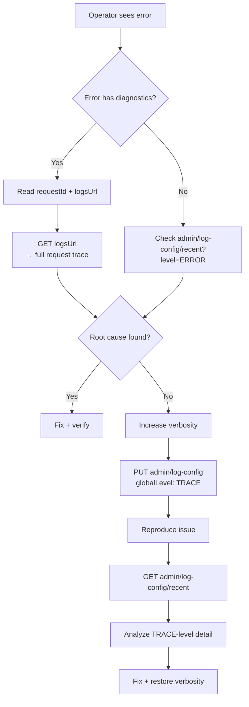
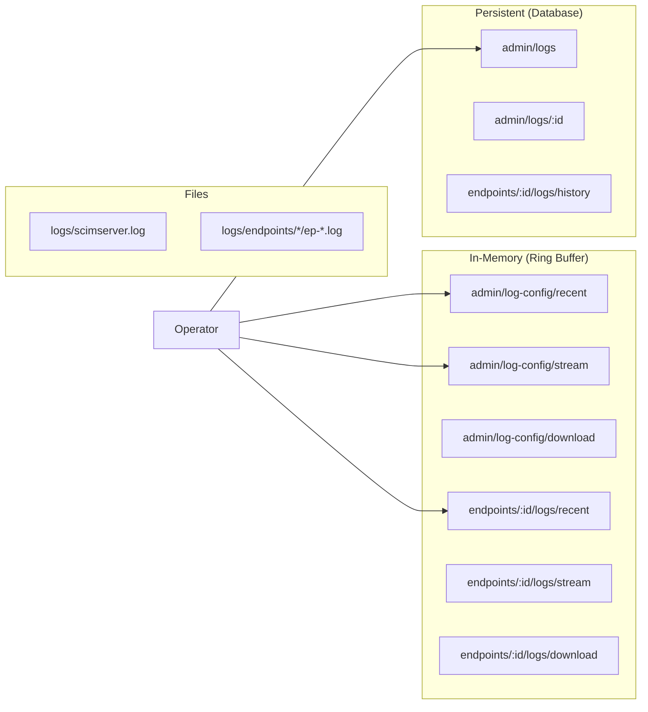

# Remote Debugging & Diagnosis Guide

> **Version:** 3.0 · **Source-verified against:** v0.34.0 · **Rewritten:** April 13, 2026  
> Complete guide for diagnosing production issues without SSH access.

---

## Table of Contents

1. [Zero-Access Diagnosis Model](#1-zero-access-diagnosis-model)
2. [Diagnosis Endpoints](#2-diagnosis-endpoints)
3. [Self-Service RCA via Error Responses](#3-self-service-rca-via-error-responses)
4. [Ring Buffer Query Recipes](#4-ring-buffer-query-recipes)
5. [SSE Live Tailing](#5-sse-live-tailing)
6. [Log Download & Export](#6-log-download--export)
7. [Per-Endpoint Log Isolation](#7-per-endpoint-log-isolation)
8. [Persistent Log History](#8-persistent-log-history)
9. [Runtime Log Level Tuning](#9-runtime-log-level-tuning)
10. [Audit Trail](#10-audit-trail)
11. [Diagnosis Workflows](#11-diagnosis-workflows)
12. [Deployment-Specific Access](#12-deployment-specific-access)
13. [Mermaid Diagrams](#13-mermaid-diagrams)
14. [Quick Reference Card](#14-quick-reference-card)

---

## 1. Zero-Access Diagnosis Model

SCIMServer is designed for environments where operators have **no SSH/shell access** to the running container (Azure Container Apps, managed Docker, etc.). All diagnosis is done through HTTP endpoints.

### Diagnosis Capabilities

| Capability | Endpoint | Auth Required |
|-----------|----------|---------------|
| View recent logs | `GET /scim/admin/log-config/recent` | Bearer token |
| Live-tail logs | `GET /scim/admin/log-config/stream` | Bearer token |
| Download logs | `GET /scim/admin/log-config/download` | Bearer token |
| Change log verbosity | `PUT /scim/admin/log-config` | Bearer token |
| View audit trail | `GET /scim/admin/log-config/audit` | Bearer token |
| View request history | `GET /scim/admin/logs` | Bearer token |
| View request detail | `GET /scim/admin/logs/:id` | Bearer token |
| Per-endpoint logs | `GET /scim/endpoints/:id/logs/recent` | Bearer token |
| Self-service RCA | _(embedded in error responses)_ | Not needed |

### Architecture

```
┌──────────────────────────────────────────────────┐
│                   Operator                        │
│                                                   │
│  1. Sees error response with diagnostics          │
│     → requestId, endpointId, logsUrl              │
│                                                   │
│  2. Clicks logsUrl (or queries admin API)          │
│     → GET /scim/admin/log-config/recent?requestId  │
│                                                   │
│  3. Gets full request trace with correlation       │
│     → auth, service, DB, response — all linked     │
│                                                   │
│  4. If more detail needed:                         │
│     → PUT /scim/admin/log-config with TRACE level  │
│     → Reproduce issue                              │
│     → GET /scim/admin/log-config/recent            │
│                                                   │
│  5. Download logs for offline analysis              │
│     → GET /scim/admin/log-config/download           │
└──────────────────────────────────────────────────┘
```

---

## 2. Diagnosis Endpoints

### Admin Log Config API (`/scim/admin/log-config/*`)

| Method | Route | Description |
|--------|-------|-------------|
| `GET` | `/scim/admin/log-config` | Current log configuration |
| `PUT` | `/scim/admin/log-config` | Update config (partial) |
| `PUT` | `/scim/admin/log-config/level/:level` | Set global log level |
| `PUT` | `/scim/admin/log-config/category/:cat/:level` | Set category level |
| `PUT` | `/scim/admin/log-config/endpoint/:id/:level` | Set endpoint level |
| `DELETE` | `/scim/admin/log-config/endpoint/:id` | Remove endpoint override |
| `GET` | `/scim/admin/log-config/recent` | Ring buffer query |
| `GET` | `/scim/admin/log-config/audit` | Audit trail |
| `DELETE` | `/scim/admin/log-config/recent` | Clear ring buffer |
| `GET` | `/scim/admin/log-config/stream` | SSE live stream |
| `GET` | `/scim/admin/log-config/download` | File download |

### Per-Endpoint Log API (`/scim/endpoints/:id/logs/*`)

| Method | Route | Description |
|--------|-------|-------------|
| `GET` | `/scim/endpoints/:id/logs/recent` | Ring buffer filtered by endpoint |
| `GET` | `/scim/endpoints/:id/logs/stream` | SSE stream filtered by endpoint |
| `GET` | `/scim/endpoints/:id/logs/download` | Download filtered by endpoint |
| `GET` | `/scim/endpoints/:id/logs/history` | Persistent DB logs filtered |

### Persistent Log API (`/scim/admin/logs/*`)

| Method | Route | Description |
|--------|-------|-------------|
| `GET` | `/scim/admin/logs` | Paginated log list with filters |
| `GET` | `/scim/admin/logs/:id` | Full request/response detail |
| `DELETE` | `/scim/admin/logs` | Clear all persistent logs |

---

## 3. Self-Service RCA via Error Responses

Every SCIM error response includes a diagnostics extension with everything needed for root cause analysis:

### Example: 409 Conflict

```json
{
  "schemas": ["urn:ietf:params:scim:api:messages:2.0:Error"],
  "detail": "userName \"jsmith\" already exists on this endpoint",
  "status": "409",
  "scimType": "uniqueness",
  "urn:scimserver:api:messages:2.0:Diagnostics": {
    "requestId": "f47ac10b-58cc-4372-a567-0e02b2c3d479",
    "endpointId": "ep-contoso-prod",
    "errorCode": "UNIQUENESS_VIOLATION",
    "conflictingAttribute": "userName",
    "conflictingResourceId": "usr-existing-123",
    "incomingValue": "jsmith",
    "logsUrl": "/scim/endpoints/ep-contoso-prod/logs/recent?requestId=f47ac10b-58cc-4372-a567-0e02b2c3d479"
  }
}
```

### RCA Workflow

1. **Read the error response** — `detail`, `scimType`, and diagnostics tell you what happened
2. **Click/query `logsUrl`** — see all correlated logs for this exact request
3. **Check `conflictingResourceId`** — look up the existing resource that caused the conflict
4. **If more detail needed** — set endpoint to TRACE, reproduce, check ring buffer

---

## 4. Ring Buffer Query Recipes

The ring buffer holds the last 2,000 log entries in memory. Queries are instant and don't require database access.

### Common Queries

```bash
# Last 25 entries (default)
curl -s https://host/scim/admin/log-config/recent?limit=25 \
  -H "Authorization: Bearer $TOKEN" | jq '.entries'

# Errors only (WARN and above)
curl -s https://host/scim/admin/log-config/recent?level=WARN&limit=100 \
  -H "Authorization: Bearer $TOKEN" | jq '.entries[] | {level, category, message}'

# Trace a specific request
curl -s "https://host/scim/admin/log-config/recent?requestId=f47ac10b-..." \
  -H "Authorization: Bearer $TOKEN" | jq '.entries'

# All PATCH operations
curl -s https://host/scim/admin/log-config/recent?category=scim.patch \
  -H "Authorization: Bearer $TOKEN"

# Specific endpoint's logs
curl -s "https://host/scim/admin/log-config/recent?endpointId=ep-abc123" \
  -H "Authorization: Bearer $TOKEN"

# Or use endpoint-scoped URL (same result):
curl -s https://host/scim/endpoints/ep-abc123/logs/recent \
  -H "Authorization: Bearer $TOKEN"
```

### Response Format

```json
{
  "count": 25,
  "entries": [
    {
      "timestamp": "2026-04-13T10:30:45.123Z",
      "level": "INFO",
      "category": "scim.user",
      "message": "User created",
      "requestId": "a1b2c3d4-...",
      "endpointId": "ep-contoso-prod",
      "method": "POST",
      "path": "/scim/endpoints/ep-contoso-prod/Users",
      "durationMs": 45,
      "authType": "oauth",
      "resourceType": "User",
      "resourceId": "usr-abc-123",
      "operation": "create"
    }
  ]
}
```

### Miss Hint

When a `requestId` search returns nothing (entry evicted from ring buffer), the API suggests checking persistent logs:

```json
{
  "count": 0,
  "entries": [],
  "hint": "No entries in ring buffer for requestId 'abc'. Try persistent logs: GET /scim/admin/logs?search=abc"
}
```

---

## 5. SSE Live Tailing

Real-time log streaming via Server-Sent Events — no polling required.

### Usage

```bash
# Terminal 1: Stream all INFO+ logs
curl -N https://host/scim/admin/log-config/stream?level=INFO \
  -H "Authorization: Bearer $TOKEN"

# Terminal 2: Stream auth events only
curl -N https://host/scim/admin/log-config/stream?category=auth \
  -H "Authorization: Bearer $TOKEN"

# Terminal 3: Stream for a specific endpoint
curl -N https://host/scim/endpoints/ep-abc123/logs/stream \
  -H "Authorization: Bearer $TOKEN"
```

### Output

```
event: connected
data: {"message":"Log stream connected","filters":{"level":"INFO","category":"ALL","endpointId":"ALL"}}

data: {"timestamp":"2026-04-13T10:30:45.123Z","level":"INFO","category":"scim.user","message":"User created",...}

data: {"timestamp":"2026-04-13T10:30:46.456Z","level":"WARN","category":"http","message":"Slow request: 3456ms",...}

: ping 2026-04-13T10:31:15.000Z

data: {"timestamp":"...","level":"ERROR","category":"http","message":"Unhandled TypeError on POST /scim/...",...}
```

### JavaScript/Browser

```javascript
const source = new EventSource('/scim/admin/log-config/stream?level=WARN');

source.addEventListener('connected', (e) => {
  console.log('Connected:', JSON.parse(e.data));
});

source.onmessage = (e) => {
  const entry = JSON.parse(e.data);
  console.log(`[${entry.level}] ${entry.category}: ${entry.message}`);
};

source.onerror = () => console.log('SSE connection lost, retrying...');
```

### Protocol Details

- Keep-alive pings every 30 seconds prevent proxy timeouts
- `X-Accel-Buffering: no` disables NGINX buffering
- Up to 50 concurrent SSE clients supported
- Automatic cleanup on client disconnect

---

## 6. Log Download & Export

Download ring buffer contents as a file for offline analysis:

```bash
# NDJSON format (default — one JSON per line, ideal for grep/jq)
curl -O https://host/scim/admin/log-config/download \
  -H "Authorization: Bearer $TOKEN"

# JSON format (array, for tools that need strict JSON)
curl -O https://host/scim/admin/log-config/download?format=json \
  -H "Authorization: Bearer $TOKEN"

# Filtered download (only errors, last 500 entries)
curl -O "https://host/scim/admin/log-config/download?level=ERROR&limit=500" \
  -H "Authorization: Bearer $TOKEN"

# Per-endpoint download
curl -O https://host/scim/endpoints/ep-abc123/logs/download?format=ndjson \
  -H "Authorization: Bearer $TOKEN"
```

### File Details

| Format | Content-Type | Extension | Example |
|--------|-------------|-----------|---------|
| NDJSON | `application/x-ndjson` | `.ndjson` | `scimserver-logs-2026-04-13T10-30-45.ndjson` |
| JSON | `application/json` | `.json` | `scimserver-logs-2026-04-13T10-30-45.json` |

The `Content-Disposition` header triggers browser download with a timestamped filename.

---

## 7. Per-Endpoint Log Isolation

Each SCIM endpoint has isolated log access, providing tenant-safe log visibility:

```bash
# Per-endpoint recent logs
GET /scim/endpoints/{endpointId}/logs/recent?limit=50

# Per-endpoint SSE stream
GET /scim/endpoints/{endpointId}/logs/stream?level=INFO

# Per-endpoint log download
GET /scim/endpoints/{endpointId}/logs/download

# Per-endpoint persistent history
GET /scim/endpoints/{endpointId}/logs/history?page=1&pageSize=20
```

### Security Model

- The `endpointId` is taken from the URL path parameter (not query string)
- Per-endpoint credential holders can only access their own endpoint's logs
- Admin token holders can access all endpoints via the admin API

### History Endpoint

The `/history` endpoint queries the persistent database (not ring buffer):

```bash
GET /scim/endpoints/{id}/logs/history?method=POST&status=409&search=userName&page=1
```

Supports: `page`, `pageSize`, `method`, `status`, `search`, `since`, `until`, `minDurationMs`

---

## 8. Persistent Log History

Beyond the ring buffer, every request is persisted to the database with full request/response payloads.

### List Logs

```bash
# Paginated list (SCIM provisioning only, admin endpoints excluded by default)
GET /scim/admin/logs?page=1&pageSize=50

# Filter by method
GET /scim/admin/logs?method=PATCH

# Filter by status
GET /scim/admin/logs?status=409

# Full text search (searches URL, headers, bodies, error messages)
GET /scim/admin/logs?search=jsmith@contoso.com

# Date range
GET /scim/admin/logs?since=2026-04-01T00:00:00Z&until=2026-04-13T23:59:59Z

# Slow requests only
GET /scim/admin/logs?minDurationMs=2000

# Include admin traffic
GET /scim/admin/logs?includeAdmin=true

# Hide Entra ID keepalive probes
GET /scim/admin/logs?hideKeepalive=true
```

### View Full Request Detail

```bash
GET /scim/admin/logs/{logId}
```

Returns complete request/response including:
- All headers (request + response)
- Full request body
- Full response body
- Error message and stack trace (if error)
- Derived reportable identifier (userName, email, displayName)

---

## 9. Runtime Log Level Tuning

Change log verbosity at runtime without server restart — essential for production debugging:

### Increase Verbosity for Debugging

```bash
# Set global level to TRACE (maximum detail)
curl -X PUT https://host/scim/admin/log-config/level/TRACE \
  -H "Authorization: Bearer $TOKEN"

# Set only PATCH operations to TRACE (targeted)
curl -X PUT https://host/scim/admin/log-config/category/scim.patch/TRACE \
  -H "Authorization: Bearer $TOKEN"

# Set only one endpoint to DEBUG
curl -X PUT https://host/scim/admin/log-config/endpoint/ep-abc123/DEBUG \
  -H "Authorization: Bearer $TOKEN"
```

### Restore Normal Verbosity

```bash
# Set global to INFO
curl -X PUT https://host/scim/admin/log-config/level/INFO \
  -H "Authorization: Bearer $TOKEN"

# Remove endpoint override
curl -X DELETE https://host/scim/admin/log-config/endpoint/ep-abc123 \
  -H "Authorization: Bearer $TOKEN"
```

### Level Override Priority

```
Endpoint override > Category override > Global level
```

Example: If global=INFO but endpoint "ep-abc123" is set to TRACE, all requests hitting that endpoint log at TRACE level regardless of category settings.

---

## 10. Audit Trail

View configuration changes, endpoint management, and authentication events:

```bash
GET /scim/admin/log-config/audit?limit=100
```

Returns ring buffer entries filtered to CONFIG, ENDPOINT, and AUTH categories:

```json
{
  "count": 5,
  "entries": [
    {
      "timestamp": "2026-04-13T10:00:00Z",
      "level": "INFO",
      "category": "config",
      "message": "Log configuration updated",
      "data": {
        "changes": {
          "globalLevel": { "from": 2, "to": 0 }
        }
      }
    },
    {
      "timestamp": "2026-04-13T09:55:00Z",
      "level": "INFO",
      "category": "auth",
      "message": "Per-endpoint credential authentication successful",
      "data": { "endpointId": "ep-abc123", "credentialId": "cred-xyz" }
    }
  ]
}
```

---

## 11. Diagnosis Workflows

### Workflow 1: "User creation is failing with 409"

```bash
# Step 1: Check recent errors
curl -s "https://host/scim/admin/log-config/recent?level=ERROR&category=scim.user" \
  -H "Authorization: Bearer $TOKEN" | jq '.entries[-1]'

# Step 2: Get requestId from error response diagnostics
# The 409 response body contains:
# "urn:scimserver:api:messages:2.0:Diagnostics": {
#   "requestId": "f47ac10b-...",
#   "conflictingResourceId": "usr-existing-123"
# }

# Step 3: Trace the full request
curl -s "https://host/scim/admin/log-config/recent?requestId=f47ac10b-..." \
  -H "Authorization: Bearer $TOKEN" | jq '.entries'

# Step 4: Look up the conflicting resource
curl -s "https://host/scim/endpoints/ep-contoso/Users/usr-existing-123" \
  -H "Authorization: Bearer $TOKEN"
```

### Workflow 2: "Requests are slow"

```bash
# Step 1: Check slow request warnings
curl -s "https://host/scim/admin/log-config/recent?level=WARN&category=http" \
  -H "Authorization: Bearer $TOKEN" | jq '.entries[] | {message, durationMs, path}'

# Step 2: Check persistent logs for slow requests
curl -s "https://host/scim/admin/logs?minDurationMs=2000" \
  -H "Authorization: Bearer $TOKEN"

# Step 3: If database is slow, set database category to DEBUG for connection details
curl -X PUT "https://host/scim/admin/log-config/category/database/DEBUG" \
  -H "Authorization: Bearer $TOKEN"

# Step 4: Reproduce and check
curl -s "https://host/scim/admin/log-config/recent?category=database" \
  -H "Authorization: Bearer $TOKEN"
```

### Workflow 3: "Auth is failing for one endpoint"

```bash
# Step 1: Set that endpoint to WARN to catch auth events
curl -X PUT "https://host/scim/admin/log-config/endpoint/ep-abc123/WARN" \
  -H "Authorization: Bearer $TOKEN"

# Step 2: Stream auth events for that endpoint
curl -N "https://host/scim/endpoints/ep-abc123/logs/stream?category=auth" \
  -H "Authorization: Bearer $TOKEN"

# Step 3: Have the client retry
# Watch for "Authentication failed" or "Per-endpoint credentials not enabled" messages
```

### Workflow 4: "Need full PATCH operation trace"

```bash
# Step 1: Set PATCH category to TRACE
curl -X PUT "https://host/scim/admin/log-config/category/scim.patch/TRACE" \
  -H "Authorization: Bearer $TOKEN"

# Step 2: Stream PATCH logs
curl -N "https://host/scim/admin/log-config/stream?category=scim.patch" \
  -H "Authorization: Bearer $TOKEN"

# Step 3: Reproduce the PATCH operation
# Watch for path resolution, sub-attribute handling, value application

# Step 4: Restore normal verbosity
curl -X PUT "https://host/scim/admin/log-config/category/scim.patch/INFO" \
  -H "Authorization: Bearer $TOKEN"
```

---

## 12. Deployment-Specific Access

### Azure Container Apps

```bash
# All log endpoints are available at the public URL
BASE_URL="https://your-app.azurecontainerapps.io"

# JSON logs are automatically ingested by Azure Monitor
# Use Log Analytics workspace for historical queries:
# ContainerAppConsoleLogs_CL | where Log_s contains "requestId"

# For real-time diagnosis, use the admin API:
curl -s "$BASE_URL/scim/admin/log-config/recent?level=WARN" \
  -H "Authorization: Bearer $TOKEN"
```

### Docker

```bash
# Standard docker logs
docker logs -f scimserver 2>&1 | jq

# Admin API via port mapping
curl -s "http://localhost:8080/scim/admin/log-config/recent" \
  -H "Authorization: Bearer docker-secret"

# File logs (if volume mounted)
# docker-compose.yml:
#   volumes:
#     - ./logs:/app/logs
tail -f logs/scimserver.log | jq
```

### Standalone / Local

```bash
# Direct access
curl -s "http://localhost:6000/scim/admin/log-config/recent" \
  -H "Authorization: Bearer local-secret"

# Log files in working directory
tail -f logs/scimserver.log | jq
```

---

## 13. Mermaid Diagrams

### Diagnosis Flow


```mermaid
flowchart TD
    A[Operator sees error] --> B{Error has diagnostics?}
    B -->|Yes| C[Read requestId + logsUrl]
    B -->|No| D[Check admin/log-config/recent?level=ERROR]

    C --> E[GET logsUrl<br/>→ full request trace]
    E --> F{Root cause found?}
    F -->|Yes| G[Fix + verify]
    F -->|No| H[Increase verbosity]

    D --> F

    H --> I[PUT admin/log-config<br/>globalLevel: TRACE]
    I --> J[Reproduce issue]
    J --> K[GET admin/log-config/recent]
    K --> L[Analyze TRACE-level detail]
    L --> M[Fix + restore verbosity]
```

### Log Access Architecture


```mermaid
flowchart LR
    subgraph "In-Memory (Ring Buffer)"
        A[admin/log-config/recent]
        B[admin/log-config/stream]
        C[admin/log-config/download]
        D[endpoints/:id/logs/recent]
        E[endpoints/:id/logs/stream]
        F[endpoints/:id/logs/download]
    end

    subgraph "Persistent (Database)"
        G[admin/logs]
        H[admin/logs/:id]
        I[endpoints/:id/logs/history]
    end

    subgraph "Files"
        J[logs/scimserver.log]
        K[logs/endpoints/*/ep-*.log]
    end

    L[Operator] --> A
    L --> B
    L --> G
    L --> D
```

---

## 14. Quick Reference Card

### Most Common Commands

```bash
TOKEN="your-bearer-token"
BASE="https://your-host"

# View recent errors
curl -s "$BASE/scim/admin/log-config/recent?level=WARN&limit=50" -H "Authorization: Bearer $TOKEN" | jq

# Trace a request (from error diagnostics)
curl -s "$BASE/scim/admin/log-config/recent?requestId=REQUEST_ID" -H "Authorization: Bearer $TOKEN" | jq

# Live tail
curl -N "$BASE/scim/admin/log-config/stream?level=INFO" -H "Authorization: Bearer $TOKEN"

# Set to TRACE for debugging
curl -X PUT "$BASE/scim/admin/log-config/level/TRACE" -H "Authorization: Bearer $TOKEN"

# Restore INFO after debugging
curl -X PUT "$BASE/scim/admin/log-config/level/INFO" -H "Authorization: Bearer $TOKEN"

# Download logs for offline analysis
curl -O "$BASE/scim/admin/log-config/download?format=ndjson&level=WARN" -H "Authorization: Bearer $TOKEN"

# View config
curl -s "$BASE/scim/admin/log-config" -H "Authorization: Bearer $TOKEN" | jq

# Search persistent logs
curl -s "$BASE/scim/admin/logs?search=jsmith&pageSize=10" -H "Authorization: Bearer $TOKEN" | jq
```

### Key URLs (relative)

| URL | Purpose |
|-----|---------|
| `/scim/admin/log-config` | Current config |
| `/scim/admin/log-config/recent?limit=25` | Recent entries |
| `/scim/admin/log-config/stream?level=INFO` | Live SSE stream |
| `/scim/admin/log-config/download` | Download NDJSON |
| `/scim/admin/log-config/audit` | Audit trail |
| `/scim/admin/logs` | Persistent log list |
| `/scim/admin/logs/:id` | Full request detail |
| `/scim/endpoints/:id/logs/recent` | Per-endpoint recent |
| `/scim/endpoints/:id/logs/stream` | Per-endpoint stream |
| `/scim/endpoints/:id/logs/history` | Per-endpoint history |
