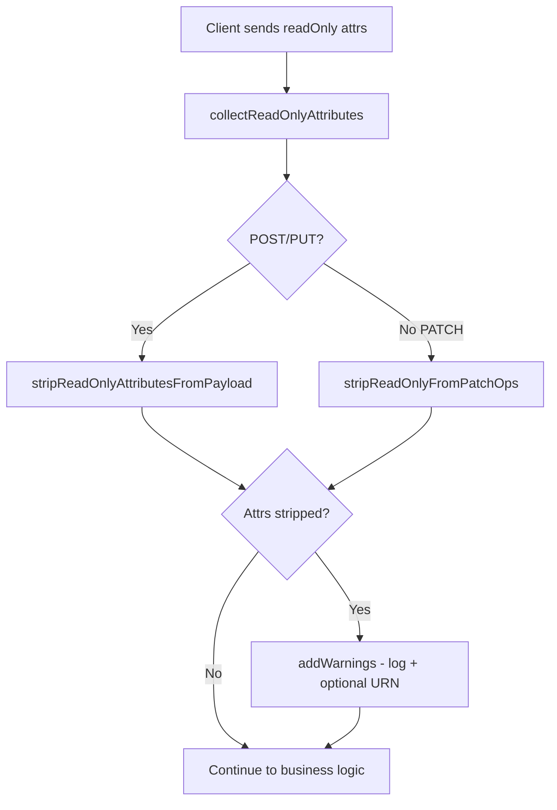
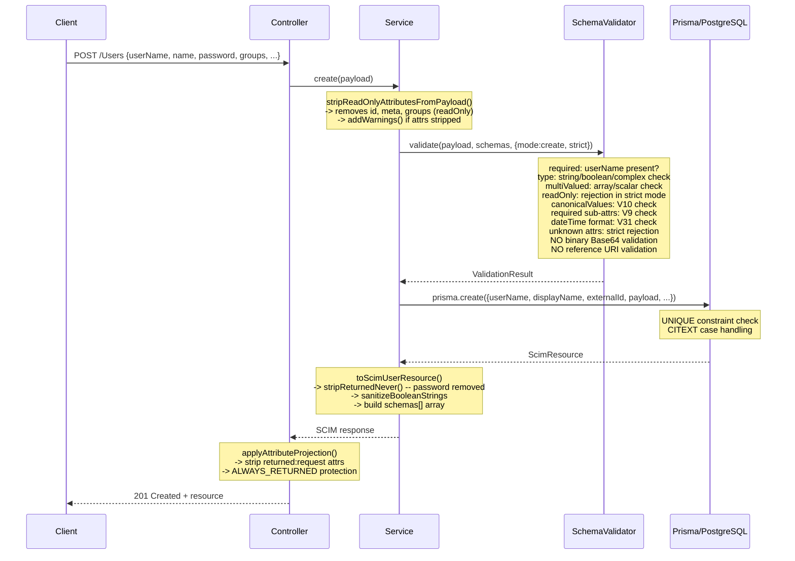
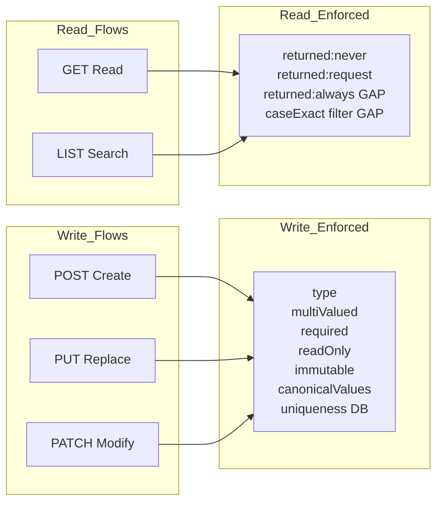
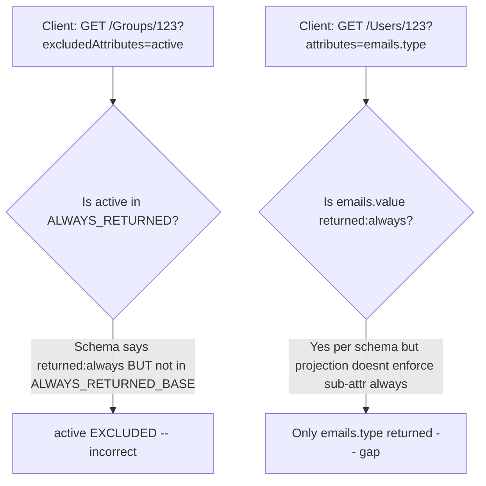

# RFC 7643 §2 — Attribute Characteristics Full Audit

## Overview

**Feature**: Comprehensive audit of all 11 RFC 7643 §2 attribute characteristics across every SCIM flow, sub-attribute, DB storage layer, and discovery endpoint
**Version**: v0.22.0 (audit baseline)
**Date**: 2026-03-01
**Status**: 🔍 Audit complete — **20 remaining work items** catalogued across 3 priority tiers
**RFC References**:
- [RFC 7643 §2 — Attribute Characteristics](https://datatracker.ietf.org/doc/html/rfc7643#section-2)
- [RFC 7643 §2.2 — Mutability](https://datatracker.ietf.org/doc/html/rfc7643#section-2.2)
- [RFC 7643 §2.3 — Data Types](https://datatracker.ietf.org/doc/html/rfc7643#section-2.3)
- [RFC 7643 §2.4 — Returned / Required / Uniqueness / CaseExact](https://datatracker.ietf.org/doc/html/rfc7643#section-2.4)
- [RFC 7643 §4.1 — Core User Schema](https://datatracker.ietf.org/doc/html/rfc7643#section-4.1)
- [RFC 7643 §4.2 — Core Group Schema](https://datatracker.ietf.org/doc/html/rfc7643#section-4.2)
- [RFC 7643 §4.3 — Enterprise User Extension](https://datatracker.ietf.org/doc/html/rfc7643#section-4.3)
- [RFC 7643 §7 — Schema Definition](https://datatracker.ietf.org/doc/html/rfc7643#section-7)
- [RFC 7644 §3.4.2.5 — Attribute Projection](https://datatracker.ietf.org/doc/html/rfc7644#section-3.4.2.5)

### Problem Statement

After closing all 27 migration gaps (G1—G20) through v0.22.0, a comprehensive per-characteristic, per-flow, per-sub-attribute audit was needed to:

1. **Confirm full RFC 7643 §2 compliance** for each of the 11 attribute characteristics across all 7 SCIM flows
2. **Audit sub-attribute characteristics** — ensure recursive enforcement for every complex attribute's sub-attributes
3. **Verify DB storage alignment** — confirm column types and constraints match schema definitions
4. **Validate `/Schemas` discovery** — ensure all characteristics are correctly exposed to clients
5. **Catalogue any remaining gaps** not captured by the G1—G20 framework

### Solution

A systematic audit examining **1,122 lines** of `schema-validator.ts`, **561 lines** of `scim-schemas.constants.ts`, **320 lines** of `scim-attribute-projection.ts`, **298 lines** of `apply-scim-filter.ts`, plus all service/controller/PatchEngine files.

**Result**: 7 of 11 characteristics are fully complete, 3 are functional with gaps, 1 is not enforced at runtime. A total of **20 work items** remain across P1/P2/P3 tiers (~36 hours estimated).

---

## Architecture

### Multi-Layer Enforcement Pipeline

```
Client Request (POST / PUT / PATCH)
    |
    v
+-------------------------------------------------------------+
|  Layer 1: Controller                                        |
|  +-------------------------------------------------------+  |
|  | applyAttributeProjection(resource, attrs, excluded,   |  |
|  |   requestOnlyAttrs)                                   |  |
|  | -> returned:'always' protection (ALWAYS_RETURNED_BASE)|  |
|  | -> returned:'request' stripping                       |  |
|  | -> attributes/excludedAttributes projection           |  |
|  +-------------------------------------------------------+  |
+------------------------+------------------------------------+
                         |
+------------------------+------------------------------------+
|  Layer 2: Service                                           |
|  +-------------------------------------------------------+  |
|  | * stripReadOnlyAttributesFromPayload() -- POST/PUT    |  |
|  | * stripReadOnlyFromPatchOps() -- PATCH                |  |
|  | * validatePayloadSchema() -- type/required/multiValued|  |
|  | * checkImmutableAttributes() -- PUT/PATCH             |  |
|  | * toScimResource() -- stripReturnedNever + sanitize   |  |
|  +-------------------------------------------------------+  |
+------------------------+------------------------------------+
                         |
+------------------------+------------------------------------+
|  Layer 3: Domain -- SchemaValidator                         |
|  +-------------------------------------------------------+  |
|  | validate() -> type, multiValued, required, readOnly,  |  |
|  |   unknown attrs, canonicalValues (V10), required      |  |
|  |   sub-attrs (V9), dateTime (V31), schemas[] (V25)    |  |
|  | checkImmutable() -> deep compare for immutable attrs  |  |
|  | validatePatchOperationValue() -> G8c PATCH pre-check  |  |
|  | collectReturnedCharacteristics() -> never/request Sets|  |
|  | collectReadOnlyAttributes() -> core/extensions Sets   |  |
|  | validateFilterAttributePaths() -> V32 filter paths    |  |
|  +-------------------------------------------------------+  |
+------------------------+------------------------------------+
                         |
+------------------------+------------------------------------+
|  Layer 4: Domain -- PatchEngine                             |
|  +-------------------------------------------------------+  |
|  | UserPatchEngine / GroupPatchEngine / GenericPatchEngine|  |
|  | WARNING: ZERO schema awareness -- mechanical patching |  |
|  | All validation done BEFORE (G8c) and AFTER (validate) |  |
|  +-------------------------------------------------------+  |
+------------------------+------------------------------------+
                         |
+------------------------+------------------------------------+
|  Layer 5: Data -- Prisma / PostgreSQL                       |
|  +-------------------------------------------------------+  |
|  | userName:    Citext  (caseExact=false)  UNIQUE         |  |
|  | displayName: Citext  (caseExact=false)  UNIQUE         |  |
|  | externalId:  Text    (caseExact=true)   UNIQUE         |  |
|  | active:      Boolean  payload: JSONB    version: Int   |  |
|  +-------------------------------------------------------+  |
+-------------------------------------------------------------+
```

### Key Architectural Finding

PatchEngines are **not schema-aware**. All characteristic enforcement is external:

| Enforcement | Where | When |
|---|---|---|
| readOnly rejection | SchemaValidator.validate() | Pre-patch (strict mode) |
| readOnly stripping | scim-service-helpers | Pre-patch (always) |
| readOnly PATCH pre-check | validatePatchOperationValue() | Pre-patch (G8c) |
| immutable check | checkImmutableAttributes() | Post-patch |
| type/required validation | SchemaValidator.validate(patch) | Post-patch |
| returned:never strip | toScimResource() | Response building |
| returned:request strip | applyAttributeProjection() | Controller response |

---

## RFC 7643 §2 Characteristic Reference

Per RFC 7643 §2, each SCIM attribute definition includes these 11 characteristics:

| # | Characteristic | Type | RFC Section | Purpose |
|---|---|---|---|---|
| 1 | `name` | String | §2 | Attribute identifier (case-insensitive per §2.1) |
| 2 | `type` | String | §2.3 | Data type: string, boolean, integer, decimal, dateTime, reference, binary, complex |
| 3 | `multiValued` | Boolean | §2.4 | Whether value is an array |
| 4 | `required` | Boolean | §2.4 | Whether attribute MUST be present on create/replace |
| 5 | `mutability` | String | §2.2 | Access rules: readOnly, readWrite, immutable, writeOnly |
| 6 | `returned` | String | §2.4 | Response rules: always, default, request, never |
| 7 | `caseExact` | Boolean | §2.4 | Whether string comparisons are case-sensitive |
| 8 | `uniqueness` | String | §2.4 | Uniqueness scope: none, server, global |
| 9 | `canonicalValues` | Array | §2.4 | Suggested/enforced enumeration values |
| 10 | `referenceTypes` | Array | §2.3.7 | Valid reference target types for `type=reference` |
| 11 | `description` | String | §2 | Human-readable description (informational only) |

---

## Executive Compliance Matrix

| Characteristic | POST | PUT | PATCH | GET | LIST | Filter | Discovery | Overall |
|---|:---:|:---:|:---:|:---:|:---:|:---:|:---:|:---:|
| **name** | ✅ | ✅ | ✅ | ✅ | ✅ | ✅ | ✅ | ✅ **Complete** |
| **type** | ✅1 | ✅1 | ✅1 | — | — | — | ✅ | ✅ **Complete** (strict) |
| **multiValued** | ✅1 | ✅1 | ✅1 | — | — | — | ✅ | ✅ **Complete** (strict) |
| **required** | ✅1 | ✅1 | ✅2 | — | — | — | ✅ | ✅ **Complete** (strict) |
| **mutability:readOnly** | ✅ | ✅ | ✅ | ✅ | ✅ | — | ✅ | ✅ **Complete** |
| **mutability:readWrite** | ✅ | ✅ | ✅ | ✅ | ✅ | — | ✅ | ✅ **Complete** |
| **mutability:immutable** | ✅ | ✅ | ✅ | ✅ | ✅ | — | ✅ | ✅ **Complete** |
| **mutability:writeOnly** | ✅ | ✅ | ✅ | ✅3 | ✅3 | — | ✅ | ⚠️ **Functional** |
| **returned:always** | ⚠️ | ⚠️ | ⚠️ | ⚠️ | ⚠️ | — | ✅ | ⚠️ **Gap** |
| **returned:default** | ✅ | ✅ | ✅ | ✅ | ✅ | — | ✅ | ✅ **Complete** |
| **returned:never** | ✅ | ✅ | ✅ | ✅ | ✅ | — | ✅ | ✅ **Complete** |
| **returned:request** | ✅ | ✅ | ✅ | ✅ | ✅ | — | ✅ | ✅ **Complete** |
| **caseExact** | — | — | — | — | — | ⚠️ | ✅ | ⚠️ **Gap** |
| **uniqueness** | ⚠️ | ⚠️ | ⚠️ | — | — | — | ⚠️ | ⚠️ **Gap** |
| **canonicalValues** | ✅1 | ✅1 | ✅1 | — | — | — | ✅ | ✅ **Complete** (strict) |
| **referenceTypes** | ❌ | ❌ | ❌ | — | — | — | ✅ | ❌ **Not Enforced** |
| **description** | — | — | — | — | — | — | ✅ | ✅ **Complete** |

> 1 Gated behind `StrictSchemaValidation` flag
> 2 PATCH mode skips required check (correct — PATCH is partial)
> 3 writeOnly enforcement via `returned:never` coupling only

---

## Characteristic-by-Characteristic Deep Audit

### 4.1 `name` — ✅ Complete

**RFC**: Attribute names MUST be case-insensitive (RFC 7643 §2.1).

| Flow | Implementation | File |
|---|---|---|
| POST/PUT | Case-insensitive Map lookup: `attr.name.toLowerCase()` | `schema-validator.ts` |
| PATCH | `resolvePatchPath()` uses case-insensitive matching | `schema-validator.ts` |
| GET/LIST | `findKey()` does case-insensitive object key lookup | `scim-attribute-projection.ts` |
| Filter | Column maps use lowercase keys; V32 validates paths case-insensitively | `apply-scim-filter.ts` |
| Discovery | Constants expose original case; matching is case-insensitive | `scim-schemas.constants.ts` |

**Sub-attributes**: ✅ Case-insensitive matching in `validateSubAttributes()`.
**Remaining**: None.

---

### 4.2 `type` — ✅ Complete (strict-gated)

**RFC**: 8 data types — string, boolean, integer, decimal, dateTime, reference, binary, complex (RFC 7643 §2.3).

**Type validation in `validateSingleValue()` (`schema-validator.ts`)**:

| Type | Check | Status |
|---|---|---|
| `string` | `typeof === 'string'` | ✅ |
| `boolean` | `typeof === 'boolean'` | ✅ |
| `integer` | `typeof === 'number' && Number.isInteger()` | ✅ |
| `decimal` | `typeof === 'number'` | ✅ |
| `dateTime` | `typeof === 'string'` + ISO 8601 regex (V31) | ✅ |
| `reference` | `typeof === 'string'` | ⚠️ No URI format validation |
| `binary` | `typeof === 'string'` | ⚠️ No Base64 format validation |
| `complex` | `typeof === 'object'` + sub-attribute recursion | ✅ |

All 8 types are validated on POST/PUT/PATCH via `SchemaValidator.validate()`. Gated behind `StrictSchemaValidation`.

**Sub-attributes**: ✅ Types checked recursively via `validateSubAttributes()`.
**DB storage**: JSONB preserves JS types natively.

**Remaining gaps**:

| ID | Gap | Effort | Priority |
|---|---|---|---|
| R-TYPE-1 | `type: 'reference'` should validate URI format (RFC 3986) | 1 hr | P3 |
| R-TYPE-2 | `type: 'binary'` should validate Base64 encoding (RFC 4648) | 1 hr | P3 |

---

### 4.3 `multiValued` — ✅ Complete (strict-gated)

**RFC**: `multiValued: true` -> value MUST be an array. `false` -> MUST be a scalar (RFC 7643 §2.4).

Enforced in `SchemaValidator.validate()`: `multiValued && !Array.isArray()` -> error; `!multiValued && Array.isArray()` -> error. Runs on POST/PUT/PATCH (post-patch). Gated behind `StrictSchemaValidation`.

**Sub-attributes**: ✅ Each sub-attr has `multiValued` defined; checked recursively.
**DB storage**: JSONB preserves array/scalar distinction.
**Remaining**: None.

---

### 4.4 `required` — ✅ Complete (strict-gated)

**RFC**: `required: true` -> attribute MUST be present on create/replace. Server-assigned readOnly+required attrs (e.g., `id`) are exempt (RFC 7643 §2.4, §7).

| Flow | Behavior |
|---|---|
| POST (create) | ✅ Missing required -> 400 (readOnly attrs exempt) |
| PUT (replace) | ✅ Same |
| PATCH | ✅ Not checked (PATCH is partial by design; post-patch `validate(patch)` skips required) |

**Required attributes inventory**:

| Resource | Attribute | required | readOnly | Enforcement |
|---|---|:---:|:---:|---|
| User | `id` | ✅ | ✅ | Exempt — server-assigned |
| User | `userName` | ✅ | ❌ | Client MUST provide on POST/PUT |
| Group | `id` | ✅ | ✅ | Exempt — server-assigned |
| Group | `displayName` | ✅ | ❌ | Client MUST provide on POST/PUT |
| emails[] | `value` | ✅ | ❌ | V9: required within each email object |
| phoneNumbers[] | `value` | ✅ | ❌ | V9: required within each phone object |
| members[] | `value` | ✅ | ❌ | V9: required within each member object |

**Sub-attributes**: ✅ V9 enforcement in `validateSubAttributes()` — if complex value is present, required sub-attrs must exist.
**Remaining**: None.

---

### 4.5 `mutability` — Mixed Status

RFC 7643 §2.2 defines 4 mutability modes:

#### 4.5.1 `readOnly` — ✅ Complete

| Flow | Implementation | File |
|---|---|---|
| POST | SchemaValidator rejects (strict) + `stripReadOnlyAttributesFromPayload()` always strips | `schema-validator.ts`, `scim-service-helpers.ts` |
| PUT | Same as POST | same |
| PATCH | `stripReadOnlyFromPatchOps()` strips + G8c `validatePatchOperationValue()` pre-validates | `scim-service-helpers.ts`, `schema-validator.ts` |
| GET/LIST | ReadOnly attrs returned normally (server-assigned) | — |

**ReadOnly attrs**: `id`, `meta` (+5 sub-attrs), `groups` (+4 sub-attrs), `manager.displayName`.

**Sub-attribute gap**: `stripReadOnlyAttributes()` only strips **top-level** readOnly attributes. ReadOnly sub-attributes within readWrite parents (e.g., `manager.displayName` inside readWrite `manager`) are **not stripped** on POST/PUT. Similarly, `validateSubAttributes()` does not check sub-attribute `mutability` — only `required`, `type`, and unknown attrs. The code contains: `// Sub-attribute stripping (e.g. manager.displayName inside readWrite parent) is deferred to Phase 2.`

For PATCH, `validatePatchOperationValue()` (G8c) catches path-based ops targeting readOnly sub-attrs (e.g., `path: "manager.displayName"` → resolves and checks), but no-path PATCH ops with nested readOnly sub-attrs within the value object are not validated at the sub-attribute level.

| ID | Gap | Effort | Priority |
|---|---|---|---|
| R-MUT-2 | Strip/validate readOnly sub-attrs within readWrite parents (e.g., `manager.displayName`) on POST/PUT/PATCH — update `collectReadOnlyAttributes()` and `validateSubAttributes()` | 2 hr | P2 |

**ReadOnly stripping chain (v0.22.0)**:



#### 4.5.2 `readWrite` — ✅ Complete

Default mutability. No special enforcement needed — accepted on all write flows, returned in all read flows.

#### 4.5.3 `immutable` — ✅ Complete

| Flow | Implementation |
|---|---|
| POST | ✅ Accepted (can be set initially) |
| PUT | ✅ `checkImmutableAttributes()` compares existing vs incoming; change -> 400 |
| PATCH | ✅ Post-PATCH `checkImmutableAttributes()` runs |

**checkImmutable() deep behavior** (`schema-validator.ts`):
- Simple types: strict equality comparison
- Complex types with immutable sub-attrs: deep comparison per sub-attr
- Multi-valued complex (e.g., `members[]`): matches by `value` key, then checks each sub-attr

**Immutable attrs**: Group `members[].value`, `members[].display`, `members[].type`.

#### 4.5.4 `writeOnly` — ⚠️ Functional (gap for custom schemas)

| Flow | Implementation |
|---|---|
| POST/PUT/PATCH | ✅ SchemaValidator does NOT reject writeOnly (correct per RFC — it should be accepted) |
| GET/LIST | ✅ `password` stripped via `returned: 'never'` in `toScimResource()` |

**Analysis**: The only `writeOnly` attribute is `password`, which also has `returned: 'never'`. The writeOnly semantics are achieved indirectly through `returned: 'never'` stripping. This works correctly for `password`.

**Gap**: If a custom schema defines `mutability: 'writeOnly'` WITHOUT also setting `returned: 'never'`, the value would leak in responses. The response builder does not independently check for writeOnly.

| ID | Gap | Effort | Priority |
|---|---|---|---|
| R-MUT-1 | Response builder should treat `mutability: 'writeOnly'` as implying `returned: 'never'` for defense-in-depth | 1 hr | P2 |

---

### 4.6 `returned` — Mixed Status

RFC 7643 §2.4 defines 4 returned modes:

#### 4.6.1 `always` — ⚠️ Gap (semi-hardcoded)

**Implementation**: `ALWAYS_RETURNED_BASE` in `scim-attribute-projection.ts`:

```typescript
const ALWAYS_RETURNED_BASE = new Set(['schemas', 'id', 'meta', 'username']);
// + 'displayname' added for Groups by getAlwaysReturnedForResource()
```

**Attrs with `returned: 'always'` in schema constants**:

| Resource | Attribute | In ALWAYS_RETURNED_BASE? | Status |
|---|---|:---:|:---:|
| User | `id` | ✅ | ✅ |
| User | `userName` | ✅ | ✅ |
| Group | `id` | ✅ | ✅ |
| Group | `displayName` | ✅ | ✅ |
| Group | `active` | ❌ | ⚠️ **Missing** |
| emails[] | `value` | ❌ (sub-attr) | ⚠️ **Not enforced** |
| members[] | `value` | ❌ (sub-attr) | ⚠️ **Not enforced** |

**Gaps**:

| ID | Gap | Effort | Priority |
|---|---|---|---|
| R-RET-1 | Make `ALWAYS_RETURNED` schema-driven via `collectReturnedCharacteristics()` (add `always` Set) | 2 hr | P2 |
| R-RET-2 | Add Group `active` to always-returned set | 15 min | P2 |
| R-RET-3 | Enforce sub-attr `returned: 'always'` at projection level (when `?attributes=emails.type`, force-include `emails.value`) | 3 hr | P2 |

#### 4.6.2 `default` — ✅ Complete

Default behavior — returned in all responses unless excluded via `excludedAttributes`.

#### 4.6.3 `never` — ✅ Complete

| Flow | Implementation |
|---|---|
| All responses | `toScimUserResource()` / `toScimGroupResource()` -> `stripReturnedNever(resource, neverAttrs)` |
| Extension URNs | `stripReturnedNever()` also walks inside `urn:...` objects |

Implementation: `collectReturnedCharacteristics()` builds `never` Set from schema definitions (walks sub-attributes recursively). Applied to ALL responses (POST/PUT/PATCH/GET/LIST).

#### 4.6.4 `request` — ✅ Complete

| Flow | Implementation |
|---|---|
| All responses | Controller calls `applyAttributeProjection()` with `requestOnlyAttrs` — strips unless in `?attributes=` |

Infrastructure fully functional. Tested with synthetic schemas. No built-in attributes currently use `returned: 'request'`.

---

### 4.7 `caseExact` — ⚠️ Gap (JSONB filter not schema-driven)

**RFC**: `caseExact: false` -> comparisons MUST be case-insensitive. `caseExact: true` -> case-sensitive (RFC 7643 §2.4).

**Filter push-down implementation** (`apply-scim-filter.ts`):

Case sensitivity is determined by **column type**, not by the schema `caseExact` property:

| Column | DB Type | Schema `caseExact` | Filter Behavior | Correct? |
|---|---|:---:|---|:---:|
| userName | citext | false | `mode: 'insensitive'` | ✅ |
| displayName | citext | false | `mode: 'insensitive'` | ✅ |
| externalId | text | true | Case-sensitive (no mode) | ✅ |
| id | uuid | true | UUID comparison | ✅ |
| active | boolean | N/A | Boolean equality | ✅ |

**This works correctly for all indexed columns.** The problem is:

| Scenario | Behavior | Correct? |
|---|---|:---:|
| Filter on indexed column (e.g., `userName eq "jdoe"`) | DB push-down with correct caseExact | ✅ |
| Filter on JSONB attr (e.g., `emails.value eq "j@x.com"`) | Falls to in-memory `evaluateFilter()` | ⚠️ |
| Filter on extension attr (e.g., `employeeNumber eq "ABC"`) | Falls to in-memory `evaluateFilter()` | ⚠️ |

The in-memory `evaluateFilter()` in `scim-filter-parser.ts` does **not** consult the schema's `caseExact` property. It uses plain string comparison.

| ID | Gap | Effort | Priority |
|---|---|---|---|
| R-CASE-1 | In-memory `evaluateFilter()` should consult schema `caseExact` for JSONB/extension attrs | 3 hr | P2 |
| R-CASE-2 | Dynamic column map from schema defs for custom resource types | 4 hr | P3 |

---

### 4.8 `uniqueness` — ⚠️ Gap (DB-only, missing from discovery)

**RFC**: `none` — no uniqueness. `server` — unique per service provider. `global` — globally unique (RFC 7643 §2.4).

**Current enforcement**:

| Attribute | Schema `uniqueness` | DB Constraint | Status |
|---|:---:|---|:---:|
| User `id` | `server` ✅ | PK (`scimId`) | ✅ |
| User `userName` | `server` ✅ | UNIQUE [endpointId, userName] | ✅ |
| User `externalId` | (not set) | UNIQUE [endpointId, resourceType, externalId] | ⚠️ |
| Group `id` | `server` ✅ | PK | ✅ |
| Group `displayName` | (not set) | UNIQUE [endpointId, displayName] + G8f | ⚠️ |
| Group `externalId` | (not set) | UNIQUE [endpointId, resourceType, externalId] | ⚠️ |

DB constraints enforce uniqueness correctly at runtime, but the `uniqueness` property is missing from multiple attribute definitions in `scim-schemas.constants.ts`, so `/Schemas` discovery doesn't report it.

| ID | Gap | Effort | Priority |
|---|---|---|---|
| R-UNIQ-1 | Add `uniqueness` to all attrs in constants missing it (Group displayName, externalId, etc.) | 30 min | P1 |
| R-UNIQ-2 | Schema-driven uniqueness for custom JSONB attrs | 4 hr | P3 |

---

### 4.9 `canonicalValues` — ✅ Complete (strict-gated)

**RFC**: Collection of suggested/enforced enumeration values (RFC 7643 §2.4).

**Enforced by**: V10 in `SchemaValidator.validateSingleValue()`. Non-canonical value -> error (strict) or warning (lenient).

| Attribute | canonicalValues | RFC Source |
|---|---|---|
| `emails[].type` | ['work', 'home', 'other'] | §4.1.2 |
| `phoneNumbers[].type` | ['work', 'home', 'mobile', 'fax', 'pager', 'other'] | §4.1.2 |
| `addresses[].type` | ['work', 'home', 'other'] | §4.1.2 |
| `groups[].type` | ['direct', 'indirect'] | §4.1.2 |

**Sub-attributes**: ✅ Validated through recursive `validateSubAttributes()`.
**Remaining**: None.

---

### 4.10 `referenceTypes` — ❌ Not Enforced at Runtime

**RFC**: For `type: 'reference'`, specifies valid target types (RFC 7643 §2.3.7).

**Defined in constants but never validated**:

| Attribute | type | referenceTypes | Runtime Validation |
|---|---|---|:---:|
| User `profileUrl` | reference | ['external'] | ❌ |
| User `groups[].$ref` | reference | ['User', 'Group'] | ❌ |
| User `meta.location` | reference | ['uri'] | ❌ |
| Enterprise `manager.$ref` | reference | ['User'] | ❌ |
| Group `meta.location` | reference | ['uri'] | ❌ |
| **Group `members[].$ref`** | **MISSING** | **N/A** | ❌ |

**Critical Finding**: Group `members` sub-attributes are **missing the `$ref` sub-attribute entirely**. Per RFC 7643 §4.2, members SHOULD include `$ref` with `referenceTypes: ['User', 'Group']`.

| ID | Gap | Effort | Priority |
|---|---|---|---|
| R-REF-1 | Add `$ref` sub-attr to Group `members` in constants | 15 min | **P1** |
| R-REF-2 | Validate `type: 'reference'` values as URIs (RFC 3986) | 1 hr | P3 |
| R-REF-3 | Validate reference targets match `referenceTypes` | 4 hr | P3 |
| R-REF-4 | Server-generate `$ref` URIs for members/groups in response | 3 hr | P3 |

---

### 4.11 `description` — ✅ Complete

Purely informational. All attributes have `description` in constants. Exposed in `/Schemas` discovery. No enforcement needed.

---

## Sub-Attribute Audit

Each complex attribute's sub-attributes carry their own characteristics. This section audits every sub-attribute group.

### 5.1 User `name` sub-attributes

Parent: `name` — type: complex, multiValued: false, mutability: readWrite, returned: default

| Sub-Attr | type | multiValued | required | mutability | returned | caseExact | Status |
|---|---|:---:|:---:|---|---|:---:|:---:|
| formatted | string | false | false | readWrite | default | (not set) | ⚠️ |
| familyName | string | false | false | readWrite | default | (not set) | ⚠️ |
| givenName | string | false | false | readWrite | default | (not set) | ⚠️ |
| middleName | string | false | false | readWrite | default | (not set) | ⚠️ |
| honorificPrefix | string | false | false | readWrite | default | (not set) | ⚠️ |
| honorificSuffix | string | false | false | readWrite | default | (not set) | ⚠️ |

**Validation**: ✅ All validated recursively by SchemaValidator.
**Gap**: `caseExact` not set on any name sub-attr. Per RFC 7643 §4.1.1 these should be `caseExact: false`.

| ID | Gap | Effort | Priority |
|---|---|---|---|
| R-SUB-1 | Add `caseExact: false` to all name sub-attrs in constants | 10 min | P1 |

---

### 5.2 User `emails` sub-attributes

Parent: `emails` — type: complex, multiValued: true, mutability: readWrite, returned: default

| Sub-Attr | type | multiValued | required | mutability | returned | caseExact | canonicalValues | Status |
|---|---|:---:|:---:|---|---|:---:|---|:---:|
| value | string | false | **true** | readWrite | **always** | false | — | ⚠️ |
| type | string | false | false | readWrite | default | false | [work,home,other] | ✅ |
| primary | boolean | false | false | readWrite | default | — | — | ✅ |

**Gap**: `emails[].value` has `returned: 'always'` but projection does NOT enforce sub-attribute always-returned. If `?attributes=emails.type`, response may include `emails[].type` without forcing `emails[].value`.

(Covered by R-RET-3 above.)

---

### 5.3 User `phoneNumbers` sub-attributes

Parent: `phoneNumbers` — type: complex, multiValued: true, mutability: readWrite, returned: default

| Sub-Attr | type | multiValued | required | mutability | returned | caseExact | canonicalValues | Status |
|---|---|:---:|:---:|---|---|:---:|---|:---:|
| value | string | false | **true** | readWrite | default | false | — | ✅ |
| type | string | false | false | readWrite | default | false | [work,home,mobile,fax,pager,other] | ✅ |
| primary | boolean | false | false | readWrite | default | — | — | ✅ |

**Status**: ✅ Complete — all characteristics properly defined and enforced.

---

### 5.4 User `addresses` sub-attributes

Parent: `addresses` — type: complex, multiValued: true, mutability: readWrite, returned: default

| Sub-Attr | type | multiValued | required | mutability | returned | caseExact | Status |
|---|---|:---:|:---:|---|---|:---:|:---:|
| formatted | string | false | false | readWrite | default | (not set) | ⚠️ |
| streetAddress | string | false | false | readWrite | default | (not set) | ⚠️ |
| locality | string | false | false | readWrite | default | (not set) | ⚠️ |
| region | string | false | false | readWrite | default | (not set) | ⚠️ |
| postalCode | string | false | false | readWrite | default | (not set) | ⚠️ |
| country | string | false | false | readWrite | default | (not set) | ⚠️ |
| type | string | false | false | readWrite | default | false | ✅ |
| primary | boolean | false | false | readWrite | default | — | ✅ |

**Gap**: `caseExact` not set on most address sub-attrs. Per RFC 7643 §4.1.2 these should be `caseExact: false`.

| ID | Gap | Effort | Priority |
|---|---|---|---|
| R-SUB-3 | Add `caseExact: false` to address sub-attrs | 10 min | P1 |

---

### 5.5 User `roles` sub-attributes

Parent: `roles` — type: complex, multiValued: true, mutability: readWrite, returned: default

| Sub-Attr | type | multiValued | required | mutability | returned | Status |
|---|---|:---:|:---:|---|---|:---:|
| value | string | false | false | readWrite | default | ✅ |
| display | string | false | false | readWrite | default | ✅ |
| type | string | false | false | readWrite | default | ✅ |
| primary | boolean | false | false | readWrite | default | ✅ |

**Status**: ✅ Complete.

---

### 5.6 User `groups` sub-attributes

Parent: `groups` — type: complex, multiValued: true, **mutability: readOnly**, returned: default

| Sub-Attr | type | multiValued | required | mutability | returned | caseExact | referenceTypes | Status |
|---|---|:---:|:---:|---|---|:---:|---|:---:|
| value | string | false | false | **readOnly** | default | false | ' + D + ' | ✅ |
| $ref | **reference** | false | false | **readOnly** | default | false | ['User','Group'] | ✅ |
| display | string | false | false | **readOnly** | default | false | ' + D + ' | ✅ |
| type | string | false | false | **readOnly** | default | false | ['direct','indirect'] | ✅ |

**Status**: ✅ Complete — all sub-attrs correctly marked readOnly (matching parent). `$ref` has `referenceTypes`. `type` has `canonicalValues`.

---

### 5.7 User `meta` sub-attributes

Parent: `meta` — type: complex, multiValued: false, **mutability: readOnly**, returned: default

| Sub-Attr | type | multiValued | required | mutability | returned | caseExact | referenceTypes | Status |
|---|---|:---:|:---:|---|---|:---:|---|:---:|
| resourceType | string | false | false | readOnly | default | true | ' + D + ' | ✅ |
| created | **dateTime** | false | false | readOnly | default | ' + D + ' | ' + D + ' | ✅ |
| lastModified | **dateTime** | false | false | readOnly | default | ' + D + ' | ' + D + ' | ✅ |
| location | **reference** | false | false | readOnly | default | true | ['uri'] | ✅ |
| version | string | false | false | readOnly | default | true | ' + D + ' | ✅ |

**Status**: ✅ Complete — all server-assigned/readOnly. `meta` in `ALWAYS_RETURNED_BASE`.

---

### 5.8 EnterpriseUser `manager` sub-attributes

Parent: `manager` — type: complex, multiValued: false, mutability: readWrite, returned: default

| Sub-Attr | type | multiValued | required | mutability | returned | referenceTypes | Status |
|---|---|:---:|:---:|---|---|---|:---:|
| value | string | false | false | readWrite | default | — | ✅ |
| $ref | **reference** | false | false | readWrite | default | ['User'] | ✅ |
| displayName | string | false | false | **readOnly** | default | — | ✅ |

**Status**: ✅ Characteristics defined correctly. `displayName` correctly marked readOnly (server SHOULD resolve from target User).

**Mutability gap**: `manager.displayName` has `mutability: 'readOnly'` but its parent `manager` is `readWrite`. Since `stripReadOnlyAttributes()` only works at the top level, client-supplied `manager.displayName` is **accepted and stored in JSONB** on POST/PUT. This violates RFC 7643 §2.2 which says readOnly attributes SHALL be ignored by the service provider. The SchemaValidator's `validateSubAttributes()` also does not check sub-attribute mutability during validation. Covered by **R-MUT-2** above.

Additional enhancements:

| ID | Gap | Effort | Priority |
|---|---|---|---|
| R-MUT-2 | (see §4.5.1) Strip readOnly sub-attrs within readWrite parents | 2 hr | P2 |
| R-SUB-4 | Server-resolve `manager.displayName` from manager's User record | 2 hr | P3 |
| R-SUB-5 | Validate `manager.$ref` points to a valid User resource | 1 hr | P3 |

---

### 5.9 Group `members` sub-attributes — ⚠️ Critical Gap

Parent: `members` — type: complex, multiValued: true, mutability: readWrite, returned: default

| Sub-Attr | type | multiValued | required | mutability | returned | referenceTypes | Status |
|---|---|:---:|:---:|---|---|---|:---:|
| value | string | false | **true** | **immutable** | **always** | — | ⚠️ |
| display | string | false | false | **immutable** | default | — | ✅ |
| type | string | false | false | **immutable** | default | — | ✅ |
| **$ref** | **MISSING** | — | — | — | — | — | ❌ |

**Critical gaps**:

1. ❌ **`$ref` sub-attribute is MISSING** from `GROUP_SCHEMA_ATTRIBUTES`. Per RFC 7643 §4.2, members SHOULD include `$ref` with `type: 'reference'`, `referenceTypes: ['User', 'Group']`, `mutability: 'immutable'`.
2. ⚠️ `members[].value` has `returned: 'always'` but sub-attr always-returned is not enforced at projection level.

**Mutability**: ✅ All sub-attrs correctly marked `immutable` — `checkImmutableAttributes()` deep-compares on PUT/PATCH.
**Required**: ✅ `value` is `required: true` — enforced by V9 in `validateSubAttributes()`.

(R-REF-1 and R-RET-3 cover these gaps.)

---

### 5.10 Group `meta` sub-attributes

Same as User meta (§5.7). All readOnly, server-assigned. ✅ Complete.

---

## DB Storage Audit

### ScimResource Model

```prisma
model ScimResource {
  id           Int       @id @default(autoincrement())
  scimId       String    @default(uuid()) @db.Uuid
  resourceType String
  endpointId   String    @db.Uuid
  externalId   String?   @db.Text          // caseExact=true  (RFC 7643)
  userName     String?   @db.Citext        // caseExact=false (RFC 7643)
  displayName  String?   @db.Citext        // caseExact=false (RFC 7643)
  active       Boolean?  @default(true)
  payload      Json      @default("{}")    // JSONB -- all non-indexed attrs
  version      Int       @default(1)
  deletedAt    DateTime?
  createdAt    DateTime  @default(now())
  updatedAt    DateTime  @updatedAt
}
```

### What Gets Pushed to DB

| Data | Storage | Notes |
|---|---|---|
| `id` (scimId) | UUID column | Server-assigned via `randomUUID()` |
| `userName` | Citext column | Extracted from payload; uniqueness enforced |
| `displayName` | Citext column | Extracted from payload; uniqueness enforced |
| `externalId` | Text column | Extracted from payload; uniqueness enforced |
| `active` | Boolean column | Extracted from payload |
| `meta` | Not stored | Server-generated from `createdAt`/`updatedAt`/`scimId` |
| `password` | **JSONB payload** | ⚠️ Stored as cleartext — writeOnly + returned:never prevents exposure |
| All other attrs | JSONB payload | Arrays, objects, scalars preserved by JSONB |
| Extension attrs | JSONB under URN key | `payload["urn:..."] = {...}` |

### Characteristic Alignment at DB Layer

| Characteristic | DB Enforcement | Notes |
|---|:---:|---|
| type | ✅ | JSONB preserves JS types natively |
| multiValued | ✅ | JSONB preserves arrays |
| required | ❌ | Application-layer only |
| mutability:readOnly | ❌ | Application strips before write |
| mutability:immutable | ❌ | Application checks before write |
| uniqueness | ✅ | DB UNIQUE constraints on userName, displayName, externalId |
| caseExact | ✅ | Column types: Citext=insensitive, Text=sensitive |
| returned | ❌ | Application strips on response |

| ID | Gap | Effort | Priority |
|---|---|---|---|
| R-DB-1 | Hash or exclude `password` before DB write (security hardening) | 2 hr | P3 |

---

## Discovery Endpoint Audit

The `/Schemas` endpoint serves attribute definitions from `scim-schemas.constants.ts` via `ScimSchemaRegistry`.

### Characteristics Exposed in /Schemas Response

| Characteristic | Exposed | Gap |
|---|:---:|---|
| name | ✅ | — |
| type | ✅ | — |
| multiValued | ✅ | — |
| required | ✅ | — |
| description | ✅ | — |
| mutability | ✅ | — |
| returned | ✅ | — |
| caseExact | ⚠️ | Missing on `name.*`, `addresses.*` sub-attrs |
| uniqueness | ⚠️ | Missing on Group `displayName`, User/Group `externalId` |
| canonicalValues | ✅ | — |
| referenceTypes | ✅ | Except Group `members.$ref` missing entirely |
| subAttributes | ✅ | Properly nested for all complex attrs |

---

## Mermaid Diagrams

### POST /Users — Full Characteristic Enforcement Trace



### Characteristic Enforcement by Flow



### ALWAYS_RETURNED Gap Visualization



---

## Key Components

| Component | File | Purpose |
|---|---|---|
| `SchemaAttributeDefinition` | `validation-types.ts` | Interface defining all 11 characteristics + subAttributes |
| `SchemaValidator.validate()` | `schema-validator.ts` | Core validation: type, multiValued, required, readOnly, canonicalValues, dateTime, unknown attrs |
| `SchemaValidator.checkImmutable()` | `schema-validator.ts` | Deep comparison for immutable attrs on PUT/PATCH |
| `SchemaValidator.validatePatchOperationValue()` | `schema-validator.ts` | G8c PATCH readOnly pre-check |
| `SchemaValidator.collectReturnedCharacteristics()` | `schema-validator.ts` | Builds never/request Sets (walks sub-attrs) |
| `SchemaValidator.collectReadOnlyAttributes()` | `schema-validator.ts` | Builds core/extensions readOnly Sets |
| `SchemaValidator.validateFilterAttributePaths()` | `schema-validator.ts` | V32 filter path validation |
| `USER_SCHEMA_ATTRIBUTES` | `scim-schemas.constants.ts` | 17 User attribute definitions with sub-attrs |
| `ENTERPRISE_USER_ATTRIBUTES` | `scim-schemas.constants.ts` | 6 EnterpriseUser attribute definitions |
| `GROUP_SCHEMA_ATTRIBUTES` | `scim-schemas.constants.ts` | 6 Group attribute definitions with sub-attrs |
| `ALWAYS_RETURNED_BASE` | `scim-attribute-projection.ts` | Hardcoded always-returned set: {schemas, id, meta, username} |
| `applyAttributeProjection()` | `scim-attribute-projection.ts` | Attribute projection with request-only + always-returned |
| `stripReturnedNever()` | `scim-attribute-projection.ts` | Removes returned:never attrs from responses |
| `stripReadOnlyAttributes()` | `scim-service-helpers.ts` | Strips readOnly attrs from POST/PUT payloads |
| `stripReadOnlyPatchOps()` | `scim-service-helpers.ts` | Strips readOnly ops from PATCH operations |
| `buildColumnFilter()` | `apply-scim-filter.ts` | Column-type-based caseExact in filter push-down |
| `evaluateFilter()` | `scim-filter-parser.ts` | In-memory filter evaluation (NO schema caseExact awareness) |
| `UserPatchEngine` | `user-patch-engine.ts` | PATCH application (zero schema awareness) |
| `GroupPatchEngine` | `group-patch-engine.ts` | PATCH application (zero schema awareness) |
| `GenericPatchEngine` | `generic-patch-engine.ts` | PATCH application (zero schema awareness) |

---

## Remaining Work Items — Complete List

### Priority 1 — Schema & Discovery Completeness (~1 hour)

Quick constant-file fixes that improve `/Schemas` discovery correctness.

| ID | Work Item | Effort | Files |
|---|---|---|---|
| **R-REF-1** | Add `$ref` sub-attribute to Group `members`: `{ name: '$ref', type: 'reference', multiValued: false, required: false, mutability: 'immutable', returned: 'default', referenceTypes: ['User', 'Group'] }` | 15 min | `scim-schemas.constants.ts` |
| **R-UNIQ-1** | Add `uniqueness` to all attrs missing it (Group displayName -> `server`, externalId -> `none`, etc.) | 30 min | `scim-schemas.constants.ts` |
| **R-SUB-1** | Add `caseExact: false` to all name sub-attrs (`formatted`, `familyName`, `givenName`, `middleName`, `honorificPrefix`, `honorificSuffix`) | 10 min | `scim-schemas.constants.ts` |
| **R-SUB-3** | Add `caseExact: false` to address sub-attrs (`formatted`, `streetAddress`, `locality`, `region`, `postalCode`, `country`) | 10 min | `scim-schemas.constants.ts` |

### Priority 2 — Behavioral Gaps (~10 hours)

Fixes real RFC non-compliance that affects runtime behavior.

| ID | Work Item | Effort | Impact |
|---|---|---|---|
| **R-RET-1** | Make `ALWAYS_RETURNED` schema-driven: add `always` Set to `collectReturnedCharacteristics()`, replace hardcoded `ALWAYS_RETURNED_BASE` | 2 hr | Correct `excludedAttributes` handling for dynamic/custom schemas |
| **R-RET-2** | Add Group `active` to always-returned set (interim fix before R-RET-1) | 15 min | Group `active` survives `?excludedAttributes=active` |
| **R-RET-3** | Enforce sub-attr `returned: 'always'` at projection level — when a complex attr appears in response, its always-returned sub-attrs must also appear (e.g., `emails[].value`, `members[].value`) | 3 hr | Sub-attr always-returned compliance |
| **R-MUT-1** | Response builder: treat `mutability: 'writeOnly'` as implying `returned: 'never'` for defense-in-depth | 1 hr | Custom schemas with writeOnly won't leak data |
| **R-MUT-2** | Strip/validate readOnly sub-attrs within readWrite parents (e.g., `manager.displayName`) — update `collectReadOnlyAttributes()` to walk sub-attributes + `validateSubAttributes()` to check mutability | 2 hr | Correct readOnly enforcement for nested attrs |
| **R-CASE-1** | In-memory `evaluateFilter()` should accept schema defs and consult `caseExact` when comparing JSONB/extension attribute values | 3 hr | Correct case-sensitivity for JSONB filters |

### Priority 3 — Advanced RFC Compliance (~23 hours)

Nice-to-have enhancements for stricter compliance and cross-resource integrity.

| ID | Work Item | Effort | Impact |
|---|---|---|---|
| R-TYPE-1 | Validate `type: 'reference'` values as URIs (RFC 3986) | 1 hr | Stricter input validation |
| R-TYPE-2 | Validate `type: 'binary'` values as Base64 (RFC 4648) | 1 hr | Stricter input validation |
| R-REF-2 | Validate reference URI format | 1 hr | Input correctness |
| R-REF-3 | Validate reference targets match `referenceTypes` (e.g., `$ref` pointing to User URI) | 4 hr | Cross-resource integrity |
| R-REF-4 | Server-generate `$ref` URIs for Group members and User groups in responses | 3 hr | Full RFC §4.2 compliance |
| R-UNIQ-2 | Schema-driven uniqueness check for custom resource type JSONB attrs | 4 hr | Custom resource types |
| R-CASE-2 | Dynamic column map from schema defs for caseExact filter push-down | 4 hr | Custom resource type filters |
| R-SUB-4 | Server-resolve `manager.displayName` from manager's User record | 2 hr | EnterpriseUser spec compliance |
| R-SUB-5 | Validate `manager.$ref` points to valid User resource | 1 hr | Reference integrity |
| R-DB-1 | Hash or exclude `password` before DB write (security hardening) | 2 hr | Security |

### Effort Summary

| Priority | Items | Effort | Nature |
|---|:---:|---|---|
| P1 — Schema/Discovery | 4 | ~1 hr | Constants file updates | ✅ Complete (v0.23.0) |
| P2 — Behavioral | 6 | ~12 hr | Code changes + tests | ✅ Complete (v0.24.0) |
| P3 — Advanced | 10 | ~23 hr | New features + tests | Not started |
| **Total** | **20** | **~36 hr** | | P1+P2 done |

---

## Test Coverage Context

Audit performed against the v0.24.0 test baseline (P1+P2 complete).

> 📊 See [PROJECT_HEALTH_AND_STATS.md](PROJECT_HEALTH_AND_STATS.md#test-suite-summary) for current test counts.

Each P1/P2 work item when implemented should include:
- Unit tests for the specific characteristic enforcement
- E2E tests exercising the flow end-to-end
- Live integration test section in `scripts/live-test.ps1`
- Discovery `/Schemas` response validation

---

## Files Audited

| File | Lines | Purpose |
|---|:---:|---|
| `api/src/domain/validation/validation-types.ts` | 78 | `SchemaAttributeDefinition` interface — all 11 characteristics |
| `api/src/domain/validation/schema-validator.ts` | 1,122 | Core validation engine — validate, checkImmutable, collectReturned/ReadOnly |
| `api/src/modules/scim/discovery/scim-schemas.constants.ts` | 561 | User/EnterpriseUser/Group schema attribute definitions |
| `api/src/modules/scim/discovery/scim-schema-registry.ts` | 759 | ScimSchemaAttribute interface, registry for discovery |
| `api/src/modules/scim/common/scim-attribute-projection.ts` | 320 | ALWAYS_RETURNED, projection, stripReturnedNever |
| `api/src/modules/scim/common/scim-service-helpers.ts` | — | stripReadOnly*, validatePayload*, checkImmutable* helpers |
| `api/src/modules/scim/filters/apply-scim-filter.ts` | 298 | Column-type-based caseExact, filter push-down |
| `api/src/modules/scim/services/endpoint-scim-users.service.ts` | — | User CRUD with schema enforcement calls |
| `api/src/modules/scim/services/endpoint-scim-groups.service.ts` | — | Group CRUD with schema enforcement calls |
| `api/src/modules/scim/services/endpoint-scim-generic.service.ts` | — | Generic CRUD with dynamic schema resolution |
| `api/src/domain/patch/user-patch-engine.ts` | — | User PatchEngine (no schema awareness) |
| `api/src/domain/patch/group-patch-engine.ts` | — | Group PatchEngine (no schema awareness) |
| `api/src/domain/patch/generic-patch-engine.ts` | — | Generic PatchEngine (no schema awareness) |
| `api/src/modules/scim/controllers/endpoint-scim-users.controller.ts` | — | Controller-layer projection calls |
| `api/src/modules/scim/controllers/schemas.controller.ts` | — | /Schemas discovery endpoint |
| `api/prisma/schema.prisma` | — | DB model: ScimResource with indexed columns + JSONB payload |

---

## Industry Precedent

| Provider | readOnly handling | returned:never | caseExact filter | referenceTypes validated | $ref generated |
|---|---|---|---|---|---|
| **Azure AD / Entra ID** | Strip + ignore | ✅ Strip password | Column-type-based | ❌ No | ✅ Yes |
| **Okta** | Strip + warn | ✅ Strip password | Schema-driven | ❌ No | ✅ Yes |
| **Ping Identity** | Strip + warn | ✅ Strip password | Schema-driven | ❌ No | ✅ Yes |
| **AWS SSO** | Strip + ignore | ✅ Strip password | Partial | ❌ No | ❌ No |
| **SCIMServer v0.24.0** | Strip + warn ✅ | ✅ Strip password | Schema-driven ✅ | ❌ No | ❌ No |

---

*Document created 2026-03-01, updated 2026-03-01. Covers RFC 7643 §2 attribute characteristics full audit for SCIMServer v0.24.0. P1 items complete (v0.23.0), P2 behavioral fixes complete (v0.24.0). Tracks 10 remaining P3 work items.*
