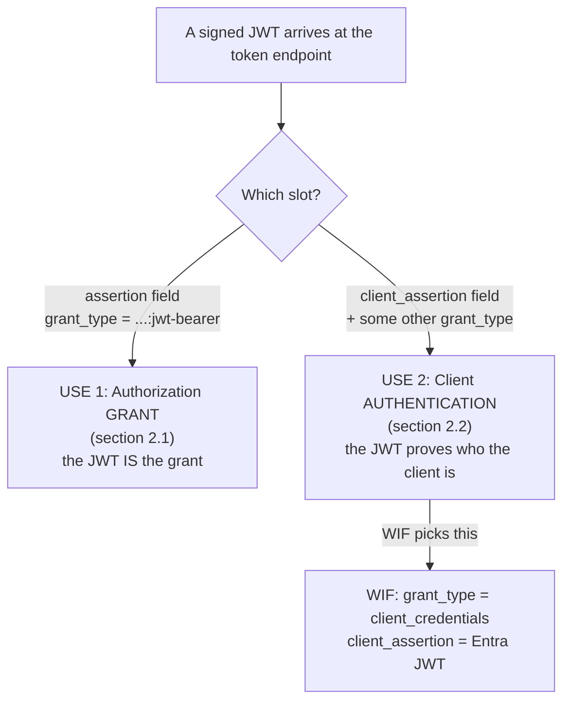
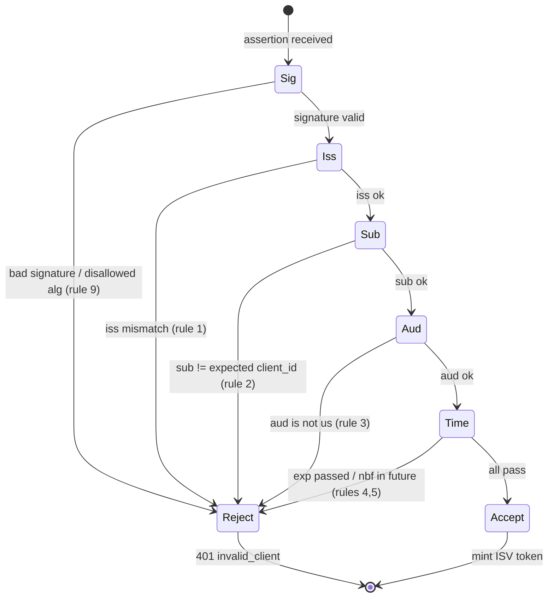

# RFC 7523 Explained - JWT Profile for OAuth 2.0 Client Authentication and Authorization Grants

> **What this is.** A plain-language, implementation-focused walkthrough of [RFC 7523](https://www.rfc-editor.org/rfc/rfc7523) (Proposed Standard, May 2015; Jones, Campbell, Mortimore). The authoritative text is mirrored in-repo at [rfcs/rfc7523.txt](rfcs/rfc7523.txt). This explainer exists so the SCIMServer team can reason about the **WIF `jwt-bearer` profile** ([WIF_JWT_BEARER_ASSERTION_FOR_SCIM.md](WIF_JWT_BEARER_ASSERTION_FOR_SCIM.md)) without re-reading 26 KB of RFC prose each time.

> **Status:** Reference / explainer. Dated 2026-06-15. Grounds [section 4.2](WIF_JWT_BEARER_ASSERTION_FOR_SCIM.md#42-rfc-7523-in-depth-the-jwt-bearer-profile) of the WIF design doc. No code; analysis only.

> **One-line takeaway.** RFC 7523 defines **two orthogonal, separable** uses of a JWT at the OAuth token endpoint - as an **authorization grant** (section 2.1) and as a **client-authentication credential** (section 2.2). **WIF uses only section 2.2.** The Microsoft-signed JWT proves *who the caller is*; a separate `grant_type` (for WIF, `client_credentials`) asks for the token.

---

## Table of contents

- [1. Why RFC 7523 exists](#1-why-rfc-7523-exists)
- [2. The two uses (and which one WIF uses)](#2-the-two-uses-and-which-one-wif-uses)
- [3. Wire format for each use](#3-wire-format-for-each-use)
- [4. The section-3 processing rules (the validator contract)](#4-the-section-3-processing-rules-the-validator-contract)
- [5. Error codes](#5-error-codes)
- [6. Interoperability requirements (section 5)](#6-interoperability-requirements-section-5)
- [7. Security model (section 6 and beyond)](#7-security-model-section-6-and-beyond)
- [8. How SCIMServer maps to RFC 7523](#8-how-scimserver-maps-to-rfc-7523)
- [9. Common misreadings and pitfalls](#9-common-misreadings-and-pitfalls)
- [10. Related specs](#10-related-specs)

---

## 1. Why RFC 7523 exists

OAuth 2.0 ([RFC 6749](https://www.rfc-editor.org/rfc/rfc6749)) lets a client obtain an access token from an authorization server (AS) by presenting an **authorization grant**, and lets a client **authenticate** to the token endpoint. Both points are extensible. The **OAuth Assertion Framework** ([RFC 7521](https://www.rfc-editor.org/rfc/rfc7521), mirrored at [rfcs/rfc7521.txt](rfcs/rfc7521.txt)) is the abstract umbrella for using a *security token* (an "assertion") in those two slots. RFC 7523 is the **concrete JWT profile** of that umbrella - it says exactly how a JWT fills each slot. (Its sibling [RFC 7522](https://www.rfc-editor.org/rfc/rfc7522) does the same for SAML 2.0 assertions.)

The key sentence from the RFC's introduction:

> "The use of a security token for client authentication is orthogonal to and separable from using a security token as an authorization grant. They can be used either in combination or separately."

That single sentence is the entire reason WIF is *not* "RFC 7523 grant-type usage" even though it uses an RFC 7523 JWT.

---

## 2. The two uses (and which one WIF uses)



| | **Use 1 - Authorization grant** (section 2.1) | **Use 2 - Client authentication** (section 2.2) - **WIF** |
|---|---|---|
| URN | `urn:ietf:params:oauth:grant-type:jwt-bearer` | `urn:ietf:params:oauth:client-assertion-type:jwt-bearer` |
| Carried in form field | `assertion` (and it **is** the `grant_type`) | `client_assertion` (+ `client_assertion_type`) |
| Combined with | nothing - the JWT is the whole grant | **some other** `grant_type` (WIF uses `client_credentials`) |
| `sub` semantics | the resource owner / authorized accessor (may be pseudonymous) | **MUST be the `client_id` of the OAuth client** |
| Failure error code | `invalid_grant` | **`invalid_client`** |
| Number of JWTs allowed | the `assertion` MUST contain a single JWT | the `client_assertion` MUST NOT contain more than one JWT |

> **WIF = Use 2.** Entra's JWT authenticates the client; a separate `grant_type=client_credentials` requests the token. So the correct failure code for a bad WIF assertion is **`invalid_client`**, and the assertion's `sub` is validated against the configured expected subject (Entra's workload-identity object id), which plays the `client_id` role in this trust relationship.

---

## 3. Wire format for each use

**Use 1 - JWT as the grant** (not WIF, shown for contrast):

```http
POST /token.oauth2 HTTP/1.1
Host: as.example.com
Content-Type: application/x-www-form-urlencoded

grant_type=urn%3Aietf%3Aparams%3Aoauth%3Agrant-type%3Ajwt-bearer
&assertion=eyJhbGciOiJFUzI1NiIsImtpZCI6IjE2In0.<payload>.<sig>
&scope=...
```

**Use 2 - JWT as client authentication** (the WIF shape; the RFC's own example pairs it with an `authorization_code` grant, WIF pairs it with `client_credentials`):

```http
POST /token.oauth2 HTTP/1.1
Host: as.example.com
Content-Type: application/x-www-form-urlencoded

grant_type=client_credentials
&client_assertion_type=urn%3Aietf%3Aparams%3Aoauth%3Aclient-assertion-type%3Ajwt-bearer
&client_assertion=eyJhbGciOiJSUzI1NiIsImtpZCI6IjIyIn0.<payload>.<sig>
&scope=...
```

> **Note both are `application/x-www-form-urlencoded`, never JSON.** This is exactly the gap called out in the WIF doc: SCIMServer's current token endpoint reads JSON and would see empty fields for a form-encoded assertion.

---

## 4. The section-3 processing rules (the validator contract)

Section 3 lists the criteria the AS **MUST** validate. This is the heart of the spec and the exact checklist a SCIMServer WIF validator implements. Mapped to WIF:

| # | RFC 7523 rule | Presence | WIF mapping |
|---|---|---|---|
| 1 | `iss` claim identifying the JWT issuer. Compare by **Simple String Comparison** (RFC 3986 section 6.2.1) absent an application profile. | MUST | `iss` == configured v2 issuer `https://login.microsoftonline.com/<TenantID>/v2.0`, exact-match |
| 2 | `sub` claim. **For client authentication, `sub` MUST be the `client_id`.** | MUST | Entra's `sub` (workload-identity object id) validated against the configured expected subject |
| 3 | `aud` claim identifying the AS; the token-endpoint URL MAY be the value. The AS **MUST reject** a JWT not containing its own identity as audience. Simple String Comparison. | MUST | `aud` == the bare `{appid}` GUID (reviewer-corrected; see WIF section 4.1) |
| 4 | `exp` claim; reject if expired (clock skew allowed). MAY reject an `exp` unreasonably far in the future. | MUST | time-window check |
| 5 | `nbf` (not before). | MAY | enforced if present |
| 6 | `iat` (issued at). | MAY | logged |
| 7 | `jti` - the AS MAY track used `jti`s for the `exp` window to prevent replay. | MAY | optional replay defense |
| 8 | other claims. | MAY | `tid`, `oid`, `appid`/`azp`, `ver` |
| 9 | The JWT **MUST be digitally signed or MAC'd**; reject invalid signature/MAC. | MUST | RS256 over the Microsoft JWKS; **never** accept `alg:none` or an HMAC alg with a public key |
| 10 | Reject a JWT invalid in any other respect per RFC 7519. | MUST | standard JWT structural validity |



---

## 5. Error codes

Section 3.1 and 3.2 split the failure code by which slot the JWT filled:

| Bad JWT used as... | `error` code |
|---|---|
| Authorization **grant** (section 2.1) | `invalid_grant` |
| Client **authentication** (section 2.2) - **WIF** | **`invalid_client`** |

Because WIF is the client-authentication form, every WIF assertion-validation failure returns **`invalid_client`** (HTTP 401), consistent with [RFC 6749](https://www.rfc-editor.org/rfc/rfc6749) section 5.2 and the WIF doc's error section.

---

## 6. Interoperability requirements (section 5)

- **RS256 is mandatory-to-implement.** Every conforming implementation must support RSASSA-PKCS1-v1_5 using SHA-256. This is exactly what Entra signs WIF assertions with, so an RS256-capable validator is sufficient.
- **Values that MUST be agreed out of band:** the issuer and audience identifiers, the token-endpoint location, the signing key (delivered via JWKS for WIF), any one-time-use (`jti`) restriction, and the maximum JWT lifetime. These map one-to-one onto the fields the per-endpoint WIF trust record stores.

> **Design consequence.** The WIF trust record is, almost verbatim, the RFC 7523 section-5 "agree out of band" list: `{ expectedIssuer, expectedAudience, expectedSubject, jwksUri, (optional) maxLifetime, (optional) jtiReplayWindow }`.

---

## 7. Security model (section 6 and beyond)

- **Replay protection is OPTIONAL** in RFC 7523 (`jti` tracking is a MAY, not a MUST). For WIF the assertion is short-lived and presented over TLS to a single ISV token endpoint, so replay risk is bounded; `jti` tracking is a hardening option, not a requirement.
- **Always enforce the signature first.** The most common catastrophic bug in JWT validators is accepting `alg:none` or confusing an HMAC `alg` with an asymmetric key. Rule 9 makes signature verification mandatory; pin the accepted algorithms to the asymmetric set the JWKS advertises (RS256 for Entra).
- **Audience rejection is mandatory** (rule 3): an AS MUST reject a JWT whose audience is not itself. This is what stops a token minted for service A from being replayed at service B.

---

## 8. How SCIMServer maps to RFC 7523

| RFC 7523 concept | SCIMServer (Phase Q6) realization |
|---|---|
| Section 2.2 client-authentication profile | the `jwt-bearer` `assertionProfile` on a per-endpoint `wif` trust record |
| `client_assertion` form field | new form-body parse path on the token endpoint (today it reads JSON only) |
| Rule 1-4 claim checks | exact-string `iss`/`aud`/`sub` compare + time window |
| Rule 9 signature check | fetch JWKS by `kid` (cache by `kid`, fail-closed on unknown-kid + unreachable), verify RS256 |
| Section 5 out-of-band values | the stored trust record fields |
| `invalid_client` failure | the token endpoint's WIF-path error response |

See [WIF section 4.2](WIF_JWT_BEARER_ASSERTION_FOR_SCIM.md#42-rfc-7523-in-depth-the-jwt-bearer-profile) for the design-level treatment and [WIF section 8](WIF_JWT_BEARER_ASSERTION_FOR_SCIM.md#8-backend-design) for the backend shape.

---

## 9. Common misreadings and pitfalls

1. **"WIF is the `jwt-bearer` grant type."** No. WIF uses the `jwt-bearer` **client-assertion type** (section 2.2) with `grant_type=client_credentials`. The grant-type URN (`urn:ietf:params:oauth:grant-type:jwt-bearer`) is a *different* thing (section 2.1) that WIF does not use.
2. **Returning `invalid_grant` for a bad assertion.** Client-authentication failures are `invalid_client`.
3. **Forgetting `sub` MUST equal the client identity.** For client authentication this is normative, not optional.
4. **Accepting JSON bodies only.** The assertion arrives form-urlencoded.
5. **Skipping the audience-is-us check.** Rule 3 is a MUST and is the anti-replay-across-services control.
6. **Allowing `alg:none` / HMAC.** Pin to the asymmetric algorithm the JWKS advertises.

---

## 10. Related specs

| Spec | Role | Local copy |
|---|---|---|
| [RFC 7521](https://www.rfc-editor.org/rfc/rfc7521) | Assertion Framework - the umbrella RFC 7523 profiles | [rfcs/rfc7521.txt](rfcs/rfc7521.txt) |
| [RFC 7523](https://www.rfc-editor.org/rfc/rfc7523) | **this doc** - JWT profile | [rfcs/rfc7523.txt](rfcs/rfc7523.txt) |
| [RFC 8693](https://www.rfc-editor.org/rfc/rfc8693) | Token Exchange - WIF's *other* profile; composes with RFC 7523 | [rfcs/rfc8693.txt](rfcs/rfc8693.txt), [RFC_8693_EXPLAINED.md](RFC_8693_EXPLAINED.md) |
| [RFC 7519](https://www.rfc-editor.org/rfc/rfc7519) | JSON Web Token - the token format | (online) |
| [RFC 6749](https://www.rfc-editor.org/rfc/rfc6749) | OAuth 2.0 - the framework (section 5.2 errors) | (online) |
| [WIF_JWT_BEARER_ASSERTION_FOR_SCIM.md](WIF_JWT_BEARER_ASSERTION_FOR_SCIM.md) | the SCIMServer design that consumes this RFC | in-repo |
