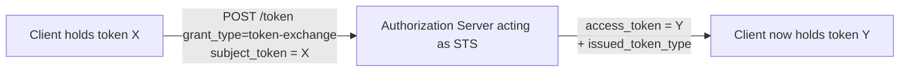
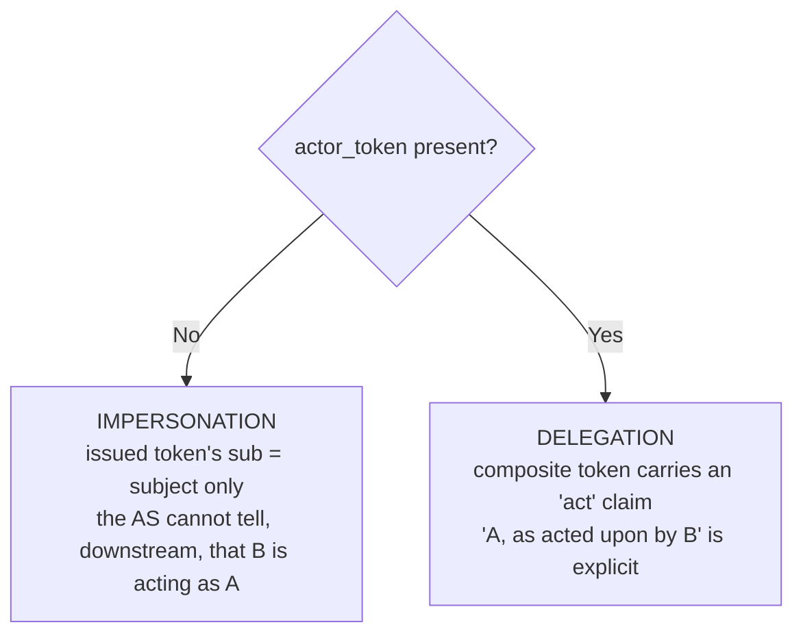
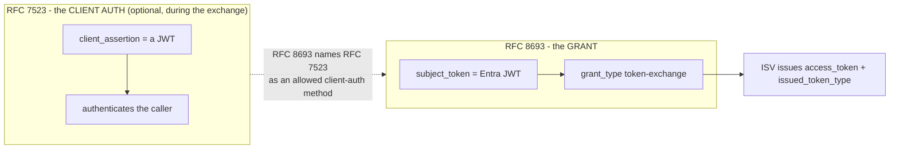

# RFC 8693 Explained - OAuth 2.0 Token Exchange

> **What this is.** A plain-language, implementation-focused walkthrough of [RFC 8693](https://www.rfc-editor.org/rfc/rfc8693) (Proposed Standard, January 2020; Jones & Nadalin of **Microsoft**, Campbell ed. of Ping, Bradley of Yubico, Mortimore of Visa). The authoritative text is mirrored in-repo at [rfcs/rfc8693.txt](rfcs/rfc8693.txt). This explainer grounds the **WIF `token-exchange` profile** ([WIF_JWT_BEARER_ASSERTION_FOR_SCIM.md](WIF_JWT_BEARER_ASSERTION_FOR_SCIM.md)) - the upcoming profile whose example ISV is Google.

> **Status:** Reference / explainer. Dated 2026-06-15. Grounds [section 4.3](WIF_JWT_BEARER_ASSERTION_FOR_SCIM.md#43-rfc-8693-in-depth-the-token-exchange-profile) of the WIF design doc. No code; analysis only.

> **One-line takeaway.** RFC 8693 defines a lightweight **Security Token Service (STS)** over OAuth: a client **trades one token for another** via the extension grant `urn:ietf:params:oauth:grant-type:token-exchange`. In WIF, Entra presents its signed JWT as the **`subject_token`** and the ISV returns its own access token. It **composes with** RFC 7523 (which can be the client-authentication method *during* the exchange), it does not replace it.

---

## Table of contents

- [1. Why RFC 8693 exists](#1-why-rfc-8693-exists)
- [2. The request (section 2.1)](#2-the-request-section-21)
- [3. The response (section 2.2)](#3-the-response-section-22)
- [4. Token type identifiers (section 3)](#4-token-type-identifiers-section-3)
- [5. Impersonation vs delegation (the act and may_act claims)](#5-impersonation-vs-delegation-the-act-and-may_act-claims)
- [6. Error codes](#6-error-codes)
- [7. resource vs audience vs scope](#7-resource-vs-audience-vs-scope)
- [8. How RFC 8693 composes with RFC 7523](#8-how-rfc-8693-composes-with-rfc-7523)
- [9. The two shipping WIF bodies side by side](#9-the-two-shipping-wif-bodies-side-by-side)
- [10. How SCIMServer maps to RFC 8693](#10-how-scimserver-maps-to-rfc-8693)
- [11. Common misreadings and pitfalls](#11-common-misreadings-and-pitfalls)
- [12. Related specs](#12-related-specs)

---

## 1. Why RFC 8693 exists

OAuth 2.0 issues access tokens to clients, but real deployments often need to **transform** a token: exchange a frontend token for one usable at a backend, drop privileges, switch audiences, or record that one party is acting on behalf of another. RFC 8693 standardizes that transformation as a single token-endpoint grant type, turning the authorization server into a minimal STS.



For WIF: token X is the Entra-signed JWT (an "impersonated application token"); token Y is the ISV's own short-lived bearer token used on the SCIM calls.

---

## 2. The request (section 2.1)

A token-exchange request is an **extension grant** (RFC 6749 section 4.5), `application/x-www-form-urlencoded`, UTF-8. Client authentication to the AS uses the normal OAuth mechanisms - **and the RFC explicitly names RFC 7523 (bearer JWTs) as one such client-authentication method** (this is the composition point).

| Parameter | Presence | Meaning | WIF / Google use |
|---|---|---|---|
| `grant_type` | **REQUIRED** | `urn:ietf:params:oauth:grant-type:token-exchange` | fixed |
| `subject_token` | **REQUIRED** | the token representing the party on whose behalf the request is made; typically becomes the subject of the issued token | **the Entra-signed JWT** |
| `subject_token_type` | **REQUIRED** | type identifier (section 3) of `subject_token` | **consumer-defined** - Google sets `...:id_token` |
| `resource` | OPTIONAL | absolute URI of the target service (query allowed, **no fragment**); repeatable | unused by Google; SuccessFactors borrows it in its `jwt-bearer` body |
| `audience` | OPTIONAL | logical name of the target service; repeatable; may combine with `resource` | Google: the workload-identity-pool provider URI |
| `scope` | OPTIONAL | space-delimited, case-sensitive requested scopes | Google: the GCP platform scope |
| `requested_token_type` | OPTIONAL | the desired **issued** token type (section 3) | Google: `...:access_token` |
| `actor_token` | OPTIONAL | a token for the **acting** party (delegation) | unused in basic WIF |
| `actor_token_type` | REQUIRED **iff** `actor_token` present (else MUST NOT appear) | type of `actor_token` | unused in basic WIF |

> **`subject_token_type` is not fixed.** Google treats the Entra token as an **id_token** (`urn:ietf:params:oauth:token-type:id_token`), not the generic `...:jwt`. A validator MUST read the *configured expected* type, never hard-code one.

---

## 3. The response (section 2.2)

A normal OAuth token response (`application/json`, HTTP 200) **plus** the RFC-8693-required `issued_token_type`:

| Member | Presence | Meaning |
|---|---|---|
| `access_token` | **REQUIRED** | the issued security token (named `access_token` "for historical reasons" - it need not be an OAuth access token) |
| `issued_token_type` | **REQUIRED** | type identifier (section 3) of the issued token |
| `token_type` | **REQUIRED** | how to use it: `Bearer`, or `N_A` if not usable as an access token |
| `expires_in` | RECOMMENDED | lifetime in seconds |
| `scope` | OPTIONAL | issued scope if it differs from requested |
| `refresh_token` | OPTIONAL | rarely used in exchange |

```json
{
  "access_token": "<ISV-issued JWT>",
  "issued_token_type": "urn:ietf:params:oauth:token-type:access_token",
  "token_type": "Bearer",
  "expires_in": 3600
}
```

> **The `issued_token_type` is the one field that distinguishes a token-exchange response from an ordinary `client_credentials` response.** A `jwt-bearer` (RFC 7523) flow does **not** include it; a `token-exchange` (RFC 8693) flow MUST.

---

## 4. Token type identifiers (section 3)

The `*_token_type` parameters and `issued_token_type` use **URIs**. Defined by RFC 8693:

| URI | Meaning |
|---|---|
| `urn:ietf:params:oauth:token-type:access_token` | an OAuth 2.0 access token from this AS (opaque to the client) |
| `urn:ietf:params:oauth:token-type:refresh_token` | an OAuth 2.0 refresh token |
| `urn:ietf:params:oauth:token-type:id_token` | an OIDC ID Token (this is what Google calls the Entra JWT) |
| `urn:ietf:params:oauth:token-type:saml1` | base64url SAML 1.1 assertion |
| `urn:ietf:params:oauth:token-type:saml2` | base64url SAML 2.0 assertion |
| `urn:ietf:params:oauth:token-type:jwt` (from [RFC 7519](https://www.rfc-editor.org/rfc/rfc7519) section 9) | a JWT, as a token *format* |

> **`access_token` vs `jwt` is a subtle distinction the RFC calls out.** `access_token` = "a typical opaque OAuth access token from this AS" (it *could* be a JWT, but the client need not know). `jwt` = "specifically a JWT format," often used cross-domain as an authorization grant feeding RFC 7523. WIF cares about this because Google labels the *subject* token `id_token` and asks for an `access_token` as output.

---

## 5. Impersonation vs delegation (the `act` and `may_act` claims)

RFC 8693 distinguishes two relationships, decided by whether an `actor_token` is present:



- **`act` (actor) claim** - a JSON object in the issued JWT expressing that **delegation occurred** and naming the acting party. It can nest (`act` inside `act`) to express a chain. The **current** actor is always the top-level `act`.
- **`may_act` claim** - states that a named party **is authorized to act on behalf of** the subject. An AS can consult `may_act` in the subject token to decide whether to permit a requested delegation.

> **Basic WIF is impersonation, not delegation.** Entra presents a single subject token and no actor token, so the issued ISV token has no `act` claim. Delegation (`actor_token` -> composite `act`) is out of scope until a concrete integration needs a two-party "B acting for A" audit trail.

---

## 6. Error codes

| Condition | `error` code |
|---|---|
| Request itself invalid, or `subject_token` / `actor_token` invalid or unacceptable by policy | **`invalid_request`** |
| AS unwilling/unable to issue a token for a requested `resource` / `audience` target | **`invalid_target`** (SHOULD) |
| Others as appropriate (per RFC 6749 section 5.2) | e.g. `invalid_client` for the client-auth step |

> **Note the difference from RFC 7523.** A bad **subject token** in a token exchange is `invalid_request` (RFC 8693), whereas a bad **client-authentication assertion** is `invalid_client` (RFC 7523). In WIF's `token-exchange` profile both can occur: `invalid_client` if the RFC 7523 client-auth (if used) fails, `invalid_request` if the `subject_token` itself is bad.

---

## 7. resource vs audience vs scope

Section 2.1.1 ties these together: the client asks for a token **with the requested `scope`** that is **usable at all the requested target services** (named by `resource` URIs and/or `audience` logical names). The effective access is the **Cartesian product** of scopes across targets - so requesting many targets at once raises the chance of an `invalid_target` rejection. Best practice: keep the target set narrow.

| Parameter | Form | Example |
|---|---|---|
| `resource` | absolute URI (physical location) | `https://backend.example.com/api` |
| `audience` | logical name (AS-and-client agreed) | `//iam.googleapis.com/projects/.../providers/...` |
| `scope` | space-delimited capability strings | `https://www.googleapis.com/auth/cloud-platform` |

---

## 8. How RFC 8693 composes with RFC 7523

The two RFCs are **not** competitors:



- **RFC 7523** = a *client-authentication method* (who is calling).
- **RFC 8693** = a *grant type* for exchanging tokens (what is being traded).
- RFC 8693 section 2.1 explicitly says RFC 7523 bearer-JWT client authentication is one way to authenticate during a token exchange.

Both WIF profiles end identically for the SCIM endpoint: a short-lived ISV-issued **Bearer** token rides the SCIM calls.

---

## 9. The two shipping WIF bodies side by side

| | **SuccessFactors** (`jwt-bearer`, RFC 7523) | **Google** (`token-exchange`, RFC 8693) |
|---|---|---|
| `grant_type` | `client_credentials` | `urn:ietf:params:oauth:grant-type:token-exchange` |
| Entra JWT field | `client_assertion` (+ `client_assertion_type`) | `subject_token` (+ `subject_token_type=...:id_token`) |
| Extra params | `client_id`, **`resource`** (custom SAP URN, borrowed from RFC 8693) | `requested_token_type=...:access_token`, `audience` (pool URI), `scope` |
| Response adds | nothing beyond standard token response | **`issued_token_type`** (REQUIRED) |
| Failure of the JWT | `invalid_client` | `invalid_request` |

> **SuccessFactors is the interesting edge case:** a `jwt-bearer` (RFC 7523) request that **carries an RFC 8693 `resource` parameter**. A robust validator tolerates `resource` on the `jwt-bearer` path and treats it as a routing hint, not part of the signature-plus-claims check. See [WIF section 2.2](WIF_JWT_BEARER_ASSERTION_FOR_SCIM.md#22-the-two-shipping-implementations-concrete-request-bodies).

---

## 10. How SCIMServer maps to RFC 8693

| RFC 8693 concept | SCIMServer (Phase Q6) realization |
|---|---|
| `grant_type=token-exchange` | the `token-exchange` `assertionProfile` on a per-endpoint `wif` trust record |
| `subject_token` | the field the validator reads the Entra JWT from (vs `client_assertion` for `jwt-bearer`) |
| `subject_token_type` | a configured expected value in the trust record (Google: `...:id_token`); never hard-coded |
| JWKS + `iss`/`aud`/`sub`/time validation | **identical** to the `jwt-bearer` path - the only differences are the grant type and the field name |
| `issued_token_type` (response) | the response member SCIMServer MUST add on the token-exchange path |
| `resource` / `audience` / `requested_token_type` / `scope` | profile-specific routing + issuance hints stored per endpoint, not part of the core check |
| `invalid_request` / `invalid_target` | the token-exchange-path error responses |

See [WIF section 4.3](WIF_JWT_BEARER_ASSERTION_FOR_SCIM.md#43-rfc-8693-in-depth-the-token-exchange-profile) and [WIF section 2.1](WIF_JWT_BEARER_ASSERTION_FOR_SCIM.md#21-the-token-exchange-variant-rfc-8693-upcoming).

---

## 11. Common misreadings and pitfalls

1. **Hard-coding `subject_token_type=...:jwt`.** Google uses `...:id_token`. Read the configured expected type.
2. **Omitting `issued_token_type` in the response.** It is REQUIRED for token exchange (and is what distinguishes it from a `client_credentials` response).
3. **Returning `invalid_client` for a bad `subject_token`.** A bad subject token is `invalid_request`; `invalid_client` is for the (separate) client-auth step.
4. **Treating `resource` and `audience` as the same field.** `resource` is a physical absolute URI (no fragment); `audience` is a logical agreed name. They can coexist.
5. **Requesting too many targets.** The Cartesian-product semantics make broad requests likely to draw `invalid_target`.
6. **Assuming impersonation == delegation.** Without an `actor_token` there is no `act` claim; "B acting as A" is not recorded.
7. **Thinking RFC 8693 replaces RFC 7523.** It composes with it; the client-auth during the exchange may itself be an RFC 7523 assertion.

---

## 12. Related specs

| Spec | Role | Local copy |
|---|---|---|
| [RFC 8693](https://www.rfc-editor.org/rfc/rfc8693) | **this doc** - Token Exchange | [rfcs/rfc8693.txt](rfcs/rfc8693.txt) |
| [RFC 7523](https://www.rfc-editor.org/rfc/rfc7523) | JWT client-auth profile; composes with token exchange | [rfcs/rfc7523.txt](rfcs/rfc7523.txt), [RFC_7523_EXPLAINED.md](RFC_7523_EXPLAINED.md) |
| [RFC 7521](https://www.rfc-editor.org/rfc/rfc7521) | Assertion Framework | [rfcs/rfc7521.txt](rfcs/rfc7521.txt) |
| [RFC 7519](https://www.rfc-editor.org/rfc/rfc7519) | JSON Web Token - the `...:jwt` type and JWT format | (online) |
| [RFC 6749](https://www.rfc-editor.org/rfc/rfc6749) | OAuth 2.0 - extension grants (section 4.5), errors (section 5.2) | (online) |
| [RFC 7662](https://www.rfc-editor.org/rfc/rfc7662) | Token Introspection - where `act`/`may_act` also appear | (online) |
| [WIF_JWT_BEARER_ASSERTION_FOR_SCIM.md](WIF_JWT_BEARER_ASSERTION_FOR_SCIM.md) | the SCIMServer design that consumes this RFC | in-repo |
