# RFC 7643/7644 Attribute Characteristics — Full Analysis & Gap Assessment

> **Date:** 2026-03-01  
> **Scope:** All 11 attribute characteristics × all 5 SCIM operations × core + extension + custom extension schemas  
> **References:** RFC 7643 §2.1–§2.5, §3.1, §4, §7 | RFC 7644 §3.3–§3.12

---

## Table of Contents

1. [Complete Attribute Characteristics Reference](#1-complete-attribute-characteristics-reference)
2. [Characteristic × Operation Matrix (RFC Spec)](#2-characteristic--operation-matrix-rfc-spec)
3. [Current Project Implementation State](#3-current-project-implementation-state)
4. [Gap Analysis — Per Characteristic](#4-gap-analysis--per-characteristic)
5. [Request/Response Flow Diagrams](#5-requestresponse-flow-diagrams)
6. [Extension & Custom Extension Handling](#6-extension--custom-extension-handling)
7. [Sub-Attribute Characteristics & Inheritance](#7-sub-attribute-characteristics--inheritance)
8. [Database Schema & Stored Values](#8-database-schema--stored-values)
9. [Detailed Gap Inventory & Remediation Plan](#9-detailed-gap-inventory--remediation-plan)
10. [Effort Estimation & Phase Mapping](#10-effort-estimation--phase-mapping)

---

## 1. Complete Attribute Characteristics Reference

RFC 7643 §2.2 and §7 define **11 attribute characteristics**. Every attribute in a SCIM schema carries these properties:

| # | Characteristic | Type | Default | RFC Section | Description |
|---|---------------|------|---------|-------------|-------------|
| 1 | `name` | string | — | §7 | The attribute's name |
| 2 | `type` | string | `"string"` | §2.3, §7 | Data type: string, boolean, decimal, integer, dateTime, reference, binary, complex |
| 3 | `multiValued` | boolean | `false` | §2.4, §7 | Whether the attribute is an array |
| 4 | `required` | boolean | `false` | §7 | Whether the attribute MUST be present on create/replace |
| 5 | `mutability` | string | `"readWrite"` | §2.2, §7 | When the attribute can be written: readOnly, readWrite, immutable, writeOnly |
| 6 | `returned` | string | `"default"` | §2.2, §7 | When the attribute appears in responses: always, never, default, request |
| 7 | `uniqueness` | string | `"none"` | §2.2, §7 | Uniqueness scope: none, server, global |
| 8 | `caseExact` | boolean | `false` | §2.2, §7 | Whether string comparisons and storage are case-sensitive |
| 9 | `canonicalValues` | string[] | none | §7 | Suggested/allowed values (e.g., "work", "home" for email type) |
| 10 | `referenceTypes` | string[] | none | §7 | For reference-type attrs: which resource types can be referenced |
| 11 | `description` | string | — | §7 | Human-readable description |

### Defaults Applied When Not Specified (RFC 7643 §2.2)

```json
{
  "type": "string",
  "multiValued": false,
  "required": false,
  "mutability": "readWrite",
  "returned": "default",
  "uniqueness": "none",
  "caseExact": false
}
```

---

## 2. Characteristic × Operation Matrix (RFC Spec)

### 2.1 Mutability × Operation

```
┌──────────────────────────────────────────────────────────────────────────────────┐
│                     MUTABILITY × OPERATION MATRIX (RFC 7644)                     │
├──────────────┬──────────────────┬──────────────────┬──────────────────┬──────────┤
│ Mutability   │ POST (Create)    │ PUT (Replace)    │ PATCH (Modify)   │ GET      │
├──────────────┼──────────────────┼──────────────────┼──────────────────┼──────────┤
│ readOnly     │ SHALL be IGNORED │ SHALL be IGNORED │ MUST NOT modify  │ Returned │
│              │ (§3.3)           │ (§3.5.1)         │ → 400 mutability │ normally │
│              │                  │                  │ (§3.5.2)         │          │
├──────────────┼──────────────────┼──────────────────┼──────────────────┼──────────┤
│ readWrite    │ Accepted.        │ Replaces value.  │ Add/Replace/     │ Returned │
│              │ Default if       │ If omitted: MAY  │ Remove freely    │ normally │
│              │ omitted          │ clear or default │                  │          │
├──────────────┼──────────────────┼──────────────────┼──────────────────┼──────────┤
│ immutable    │ MAY be set       │ MUST match       │ Add ONLY if no   │ Returned │
│              │ (initial value)  │ existing value   │ prior value.     │ normally │
│              │                  │ → else 400       │ MUST NOT modify  │          │
│              │                  │ mutability       │ → 400 mutability │          │
├──────────────┼──────────────────┼──────────────────┼──────────────────┼──────────┤
│ writeOnly    │ Accepted         │ Replaces value   │ Add/Replace      │ NEVER    │
│              │                  │                  │ allowed          │ returned │
└──────────────┴──────────────────┴──────────────────┴──────────────────┴──────────┘
```

### 2.2 Returned × Operation

```
┌──────────────────────────────────────────────────────────────────────────────────┐
│                      RETURNED × RESPONSE BEHAVIOR (RFC 7643)                    │
├──────────────┬──────────────────────────────────────────────────────────────────┤
│ returned     │ Behavior                                                         │
├──────────────┼──────────────────────────────────────────────────────────────────┤
│ always       │ ALWAYS included in every response (GET, POST, PUT, PATCH)        │
│              │ Cannot be excluded via excludedAttributes parameter              │
│              │ Examples: id, schemas, meta                                      │
├──────────────┼──────────────────────────────────────────────────────────────────┤
│ never        │ NEVER included in any response body                             │
│              │ MAY still be filterable in queries                               │
│              │ Examples: password                                               │
├──────────────┼──────────────────────────────────────────────────────────────────┤
│ default      │ Included by default. Can be overridden:                          │
│              │  - Excluded if not in `attributes` param (when specified)        │
│              │  - Excluded via `excludedAttributes` param                       │
│              │ Most attributes use this                                         │
├──────────────┼──────────────────────────────────────────────────────────────────┤
│ request      │ On write responses: only if client included the attribute       │
│              │ On GET: only if explicitly in `attributes` param                │
│              │ NOT returned by default                                          │
└──────────────┴──────────────────────────────────────────────────────────────────┘
```

### 2.3 Required × Operation

```
┌──────────────────────────────────────────────────────────────────────────────────┐
│                       REQUIRED ATTRIBUTE ENFORCEMENT (RFC)                       │
├───────────┬──────────────────────────────────────────────────────────────────────┤
│ Operation │ Behavior                                                             │
├───────────┼──────────────────────────────────────────────────────────────────────┤
│ POST      │ MUST be present → 400 if missing                                    │
│ PUT       │ MUST be present → 400 if missing (§3.5.1)                           │
│ PATCH     │ MUST NOT remove → 400 mutability if removed/unassigned (§3.5.2.2)   │
│ GET       │ No effect                                                            │
│ DELETE    │ No effect                                                            │
└───────────┴──────────────────────────────────────────────────────────────────────┘
```

### 2.4 Full Characteristic × Operation Summary

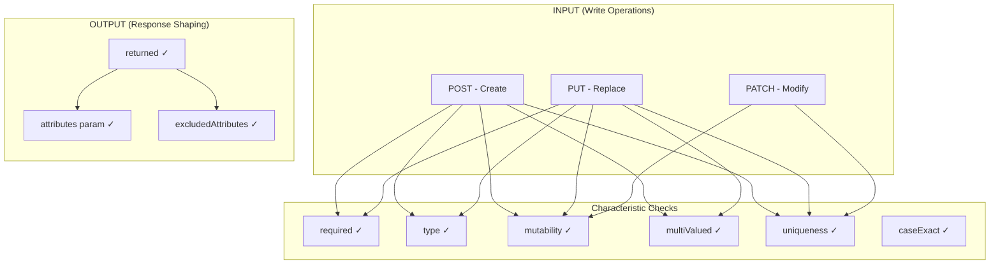

---

## 3. Current Project Implementation State

### 3.1 Architecture Layers

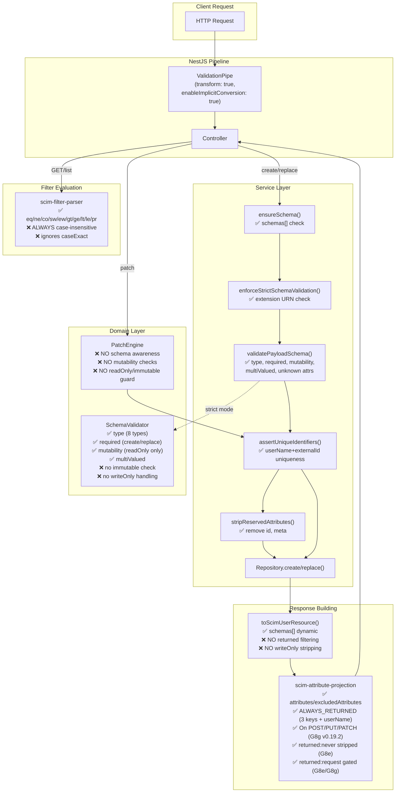

### 3.2 Current Characteristic Coverage

| Characteristic | Defined in Schema Constants | In ValidationTypes Interface | Runtime Enforcement | Where Enforced | Gaps |
|:--------------|:--:|:--:|:--:|:--|:--|
| `name` | ✅ | ✅ | ✅ | SchemaValidator (case-insensitive match) | — |
| `type` | ✅ | ✅ | ✅ (strict only) | SchemaValidator.validateSingleValue() | binary not base64-validated; reference not URI-validated |
| `multiValued` | ✅ | ✅ | ✅ (strict only) | SchemaValidator.validateAttribute() | — |
| `required` | ✅ | ✅ | ⚠️ (strict only) | SchemaValidator.validate() on create/replace | Not enforced when StrictSchemaValidation=false |
| `mutability` | ✅ | ✅ | ⚠️ (partial) | SchemaValidator rejects readOnly on create/replace; PatchEngine pre-validates readOnly (G8c v0.17.3) | **immutable** not checked on PUT; PATCH immutable not fully checked |
| `returned` | ✅ | ✅ | ✅ (G8e + G8g) | `stripReturnedNever()` + `collectReturnedCharacteristics()` + `applyAttributeProjection()` on all responses | Schema-driven; all 4 modes implemented |
| `uniqueness` | ⚠️ (userName only) | ❌ | ✅ (hardcoded + G8f) | Service layer: assertUniqueIdentifiers() → 409; Group PATCH re-check (G8f v0.19.1) | Not schema-driven; not on all attributes |
| `caseExact` | ⚠️ (partial) | ❌ | ❌ | Filter parser always lowercases | externalId should be case-sensitive |
| `canonicalValues` | ❌ | ❌ | ❌ | — | Not defined anywhere |
| `referenceTypes` | ⚠️ (2 attrs) | ✅ | ❌ | — | No runtime validation |
| `description` | ✅ | ❌ | N/A | informational | — |

### 3.3 Schema Constants — What Each Attribute Has

**User Schema (`urn:ietf:params:scim:schemas:core:2.0:User`):**

| Attribute | type | multi | req | mutability | returned | caseExact | uniqueness | canonicalValues | referenceTypes |
|:----------|:-----|:---:|:---:|:-----------|:---------|:---------:|:----------:|:---------------:|:--------------:|
| userName | string | ✗ | ✓ | readWrite | always | ✗ | server | — | — |
| name | complex | ✗ | ✗ | readWrite | default | — | — | — | — |
| name.givenName | string | ✗ | ✗ | readWrite | default | ✗ | — | — | — |
| name.familyName | string | ✗ | ✗ | readWrite | default | ✗ | — | — | — |
| displayName | string | ✗ | ✗ | readWrite | default | ✗ | — | — | — |
| nickName | string | ✗ | ✗ | readWrite | default | ✗ | — | — | — |
| profileUrl | reference | ✗ | ✗ | readWrite | default | — | — | — | external |
| title | string | ✗ | ✗ | readWrite | default | ✗ | — | — | — |
| userType | string | ✗ | ✗ | readWrite | default | ✗ | — | — | — |
| preferredLanguage | string | ✗ | ✗ | readWrite | default | ✗ | — | — | — |
| locale | string | ✗ | ✗ | readWrite | default | ✗ | — | — | — |
| timezone | string | ✗ | ✗ | readWrite | default | ✗ | — | — | — |
| active | boolean | ✗ | ✗ | readWrite | default | — | — | — | — |
| emails | complex(mv) | ✓ | ✗ | readWrite | default | — | — | — | — |
| emails.value | string | ✗ | ✓ | readWrite | default | ✗ | — | — | — |
| emails.type | string | ✗ | ✗ | readWrite | default | ✗ | — | ❌ missing | — |
| emails.primary | boolean | ✗ | ✗ | readWrite | default | — | — | — | — |
| phoneNumbers | complex(mv) | ✓ | ✗ | readWrite | default | — | — | — | — |
| addresses | complex(mv) | ✓ | ✗ | readWrite | default | — | — | — | — |
| roles | complex(mv) | ✓ | ✗ | readWrite | default | — | — | — | — |
| externalId | string | ✗ | ✗ | readWrite | default | ✓ | — | — | — |

**Missing from User schema constants (per RFC 7643 §4.1):**

| Attribute | type | mutability | returned | Notes |
|:----------|:-----|:-----------|:---------|:------|
| **password** | string | **writeOnly** | **never** | MUST exist per RFC; no `password` attr defined |
| ims | complex(mv) | readWrite | default | Instant messaging addresses |
| photos | complex(mv) | readWrite | default | Photo URLs |
| entitlements | complex(mv) | readWrite | default | Entitlement values |
| x509Certificates | complex(mv) | readWrite | default | X.509 certificates |
| groups | complex(mv) | **readOnly** | default | Groups the user belongs to (server-populated) |

**Enterprise User Extension:**

| Attribute | type | multi | req | mutability | returned | caseExact | Notes |
|:----------|:-----|:---:|:---:|:-----------|:---------|:---------:|:------|
| employeeNumber | string | ✗ | ✗ | readWrite | default | ✗ | ✅ |
| costCenter | string | ✗ | ✗ | readWrite | default | ✗ | ✅ |
| organization | string | ✗ | ✗ | readWrite | default | ✗ | ✅ |
| division | string | ✗ | ✗ | readWrite | default | ✗ | ✅ |
| department | string | ✗ | ✗ | readWrite | default | ✗ | ✅ |
| manager | complex | ✗ | ✗ | readWrite | default | — | ✅ |
| manager.value | string | ✗ | ✗ | readWrite | default | ✗ | ✅ |
| manager.displayName | string | ✗ | ✗ | **readOnly** | default | ✗ | ✅ |
| manager.$ref | reference | ✗ | ✗ | readWrite | default | — | ✅ (referenceTypes: ['User']) |

**Group Schema:**

| Attribute | type | multi | req | mutability | returned | Notes |
|:----------|:-----|:---:|:---:|:-----------|:---------|:------|
| displayName | string | ✗ | ✓ | readWrite | default | ✅ (RFC says returned=always) |
| members | complex(mv) | ✓ | ✗ | readWrite | default | ✅ |
| members.value | string | ✗ | ✓ | **immutable** | default | ✅ defined, ❌ not enforced |
| members.display | string | ✗ | ✗ | readOnly | default | ✅ defined |
| members.$ref | reference | ✗ | ✗ | immutable | default | ❌ missing from constants |
| members.type | string | ✗ | ✗ | immutable | default | ✅ defined |
| externalId | string | ✗ | ✗ | readWrite | default | ✅ |

---

## 4. Gap Analysis — Per Characteristic

### 4.1 `required` — ⚠️ PARTIAL

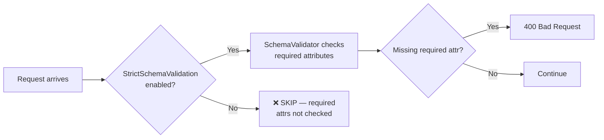

**What RFC says:**
> If `required` is `true`, clients MUST specify the attribute. Server returns 400.

**Current state:**
- ✅ SchemaValidator checks `required` on create/replace
- ✅ Correctly skips in `patch` mode
- ❌ **Gated behind `StrictSchemaValidation` flag** — when disabled (default for new endpoints), required attributes like `userName` are only enforced by DTO decorators (`@IsString()` on userName)
- ❌ PATCH remove of required attribute doesn't return 400 with scimType `"mutability"`

**Example — required enforcement OFF (default):**
```http
POST /scim/v2/endpoints/ep-1/Users
Content-Type: application/scim+json

{
  "schemas": ["urn:ietf:params:scim:schemas:core:2.0:User"]
}
```
```json
// Current: 400 — only because @IsString() on userName in DTO
// This is a DTO validation error, NOT a schema validation error
{
  "schemas": ["urn:ietf:params:scim:api:messages:2.0:Error"],
  "status": "400",
  "detail": "userName must be a string"
}
```

---

### 4.2 `type` — ✅ IMPLEMENTED (strict mode)

**What RFC says:**
> The attribute's data type. Valid values: string, boolean, decimal, integer, dateTime, reference, binary, complex.

**Current state:**
- ✅ All 8 types validated in SchemaValidator.validateSingleValue()
- ✅ Complex type recursion via validateSubAttributes()
- ✅ DateTime validates ISO 8601 via Date.parse()
- ⚠️ `binary` accepts any string — no Base64 format validation
- ⚠️ `reference` accepts any string — no URI format validation, `referenceTypes` not checked

**Type validation decision tree:**
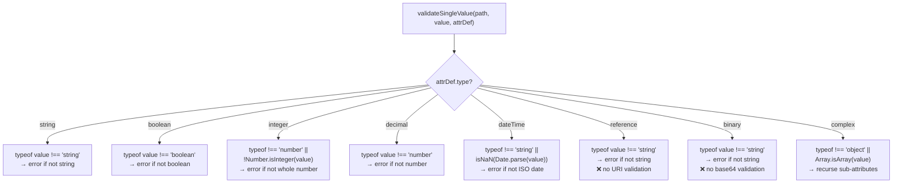

---

### 4.3 `mutability` — ⚠️ PARTIALLY ADDRESSED (G8c v0.17.3)

```mermaid
flowchart TB
    subgraph "Current Implementation"
        direction TB
        CR["POST/PUT (create/replace)"]
        PA["PATCH (modify)"]

        CR --> SV["SchemaValidator"]
        SV --> RO["✅ readOnly → reject"]
        SV --> RW["✅ readWrite → accept"]
        SV --> IM["❌ immutable → accept<br/>(should check on PUT)"]
        SV --> WO["❌ writeOnly → accept<br/>(correct, but no response strip)"]

        PA --> PE["PatchEngine"]
        PE --> ROG["✅ readOnly → pre-validated & rejected (G8c v0.17.3)"]
        PE --> NONE2["❌ immutable, writeOnly<br/>still not checked in PATCH"]
    end

    subgraph "RFC Required"
        direction TB
        CR2["POST/PUT"]
        PA2["PATCH"]

        CR2 --> SV2["Schema checks"]
        SV2 --> RO2["readOnly → IGNORE silently"]
        SV2 --> IM2["immutable (PUT) → MATCH existing<br/>or 400 mutability"]
        SV2 --> RW2["readWrite → accept"]
        SV2 --> WO2["writeOnly → accept"]

        PA2 --> PE2["Mutability guard"]
        PE2 --> RO3["readOnly → 400 mutability"]
        PE2 --> IM3["immutable → add only if<br/>no prior value, else 400"]
        PE2 --> RW3["readWrite → add/replace/remove"]
        PE2 --> WO3["writeOnly → add/replace"]
    end
```

**Critical gaps:**

| Scenario | RFC Behavior | Current Behavior | Impact |
|:---------|:-------------|:-----------------|:-------|
| PUT with `immutable` attr changed | 400 with scimType `"mutability"` | ✅ Accepted — value overwritten | **HIGH** — data integrity |
| PATCH replace `readOnly` attr | 400 with scimType `"mutability"` | ✅ Accepted — value modified | **HIGH** — RFC violation |
| PATCH modify `immutable` attr | 400 with scimType `"mutability"` | ✅ Accepted — value modified | **HIGH** — data integrity |
| PATCH add to `immutable` with existing value | 400 with scimType `"mutability"` | ✅ Accepted — value replaced | **HIGH** — data integrity |
| PATCH add to `immutable` with NO prior value | Accept (set initial value) | ✅ Accepted (correct by accident) | None |
| PATCH remove `required` attr | 400 with scimType `"mutability"` | ✅ Accepted — attr removed | **MEDIUM** |

**Example — PATCH modifies readOnly attribute (current allows, RFC forbids):**

```http
PATCH /scim/v2/endpoints/ep-1/Groups/grp-1
Content-Type: application/scim+json

{
  "schemas": ["urn:ietf:params:scim:api:messages:2.0:PatchOp"],
  "Operations": [
    {
      "op": "replace",
      "path": "members[value eq \"user-1\"].display",
      "value": "Hacked Display Name"
    }
  ]
}
```
```json
// Current response: 200 OK — display modified
// RFC-correct response:
{
  "schemas": ["urn:ietf:params:scim:api:messages:2.0:Error"],
  "status": "400",
  "scimType": "mutability",
  "detail": "Attribute 'members.display' has mutability 'readOnly' and cannot be modified."
}
```

---

### 4.4 `returned` — ✅ IMPLEMENTED (G8e v0.17.4 + G8g v0.19.2)

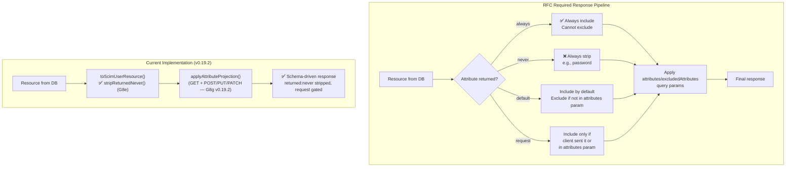

**Current state:**
- ✅ `ALWAYS_RETURNED = {schemas, id, meta}` — protected from exclusion (hardcoded)
- ✅ `attributes` and `excludedAttributes` query params work on GET
- ✅ `returned: "never"` — stripped from ALL responses via `stripReturnedNever()` in `toScim*Resource()` **(G8e v0.17.4)**
- ✅ `returned: "request"` — stripped from responses unless explicitly requested via `?attributes=` **(G8e/G8g)**
- ✅ `returned: "always"` — `userName` added to always-returned set for Users **(G8e v0.17.4)**
- ✅ Projection applied on POST/PUT/PATCH response bodies **(G8g v0.19.2)**
- ✅ Schema-aware response filtering via `SchemaValidator.collectReturnedCharacteristics()` **(G8e v0.17.4)**

**Example — password leaks in response (if stored):**

```http
POST /scim/v2/endpoints/ep-1/Users
Content-Type: application/scim+json

{
  "schemas": ["urn:ietf:params:scim:schemas:core:2.0:User"],
  "userName": "jane@test.com",
  "password": "S3cret!123"
}
```
```json
// Current response (if password is stored in rawPayload):
{
  "schemas": ["urn:ietf:params:scim:schemas:core:2.0:User"],
  "id": "uuid-here",
  "userName": "jane@test.com",
  "password": "S3cret!123",  // ❌ LEAKED — should NEVER be returned
  "meta": { ... }
}

// RFC-correct response:
{
  "schemas": ["urn:ietf:params:scim:schemas:core:2.0:User"],
  "id": "uuid-here",
  "userName": "jane@test.com",
  // password stripped — returned: "never"
  "meta": { ... }
}
```

---

### 4.5 `uniqueness` — ⚠️ PARTIAL (hardcoded)

**Current state:**
- ✅ `userName` uniqueness enforced per endpoint (case-insensitive) → 409 Conflict
- ✅ `externalId` uniqueness enforced per endpoint → 409 Conflict
- ✅ Group `displayName` uniqueness enforced → 409 Conflict
- ✅ Checked on POST, PUT, and User PATCH (after apply)
- ✅ Group PATCH re-checks `displayName` uniqueness after operations **(G8f v0.19.1)**
- ❌ **Not schema-driven** — hardcoded in service methods
- ❌ `uniqueness` property from schema definitions never read at runtime

**Example — 409 Conflict on duplicate userName (working correctly):**

```http
POST /scim/v2/endpoints/ep-1/Users
Content-Type: application/scim+json

{ "schemas": ["urn:ietf:params:scim:schemas:core:2.0:User"], "userName": "existing@test.com" }
```
```json
{
  "schemas": ["urn:ietf:params:scim:api:messages:2.0:Error"],
  "status": "409",
  "scimType": "uniqueness",
  "detail": "Resource with userName 'existing@test.com' already exists for this endpoint."
}
```

---

### 4.6 `caseExact` — ❌ NOT ENFORCED

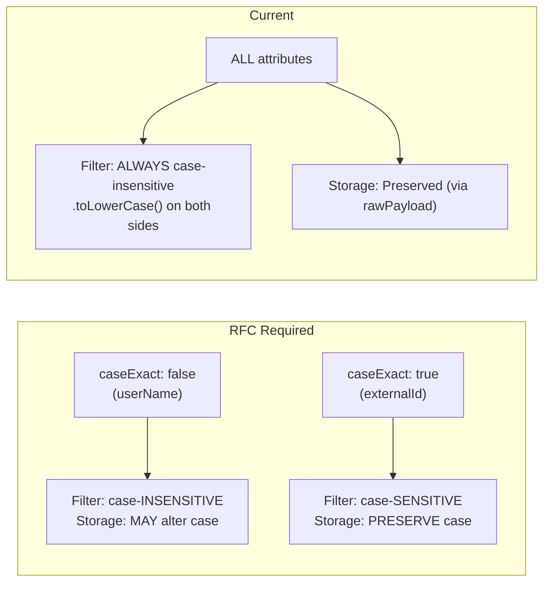

**Current state:**
- ❌ Filter parser always lowercases — `compareValues()` does `actual.toLowerCase()` and `expected.toLowerCase()` unconditionally
- ❌ `caseExact` property in schema constants never read at runtime
- ✅ Storage preserves case (rawPayload is stored as-is)

**Example — incorrect filter behavior:**

```http
GET /scim/v2/endpoints/ep-1/Users?filter=externalId eq "ABC-123"
```
```
Current: Returns user with externalId "abc-123" or "ABC-123" (case-insensitive match)
RFC-correct: Should ONLY return user with externalId "ABC-123" (caseExact: true)
```

---

### 4.7 `canonicalValues` — ❌ NOT DEFINED

**What RFC says:**
> Suggested canonical values that MAY be used (e.g., "work", "home", "other" for email/phone type).

**Current state:**
- ❌ Not defined in `SchemaAttributeDefinition` interface
- ❌ Not defined in `ScimSchemaAttribute` interface
- ❌ Not present in any schema constant definition
- ❌ Not exposed via `/Schemas` discovery endpoint
- ❌ Not enforced at runtime

Per RFC, enforcement is OPTIONAL ("MAY restrict"), but definitions SHOULD exist for `/Schemas` discovery.

**RFC example:**
```json
{
  "name": "type",
  "type": "string",
  "canonicalValues": ["work", "home", "other"]
}
```

---

### 4.8 `referenceTypes` — ⚠️ PARTIAL (defined, not enforced)

**Current state:**
- ✅ Defined in `ValidationTypes` interface (`referenceTypes?: readonly string[]`)
- ✅ Defined on `profileUrl` (`["external"]`) and `manager.$ref` (`["User"]`)
- ❌ Missing on Group `members.$ref` (should be `["User", "Group"]`)
- ❌ SchemaValidator validates reference as `typeof === 'string'` only — no URI format check, no referenceTypes enforcement
- ❌ No runtime validation that referenced resource actually exists

---

## 5. Request/Response Flow Diagrams

### 5.1 POST (Create) — Complete Flow

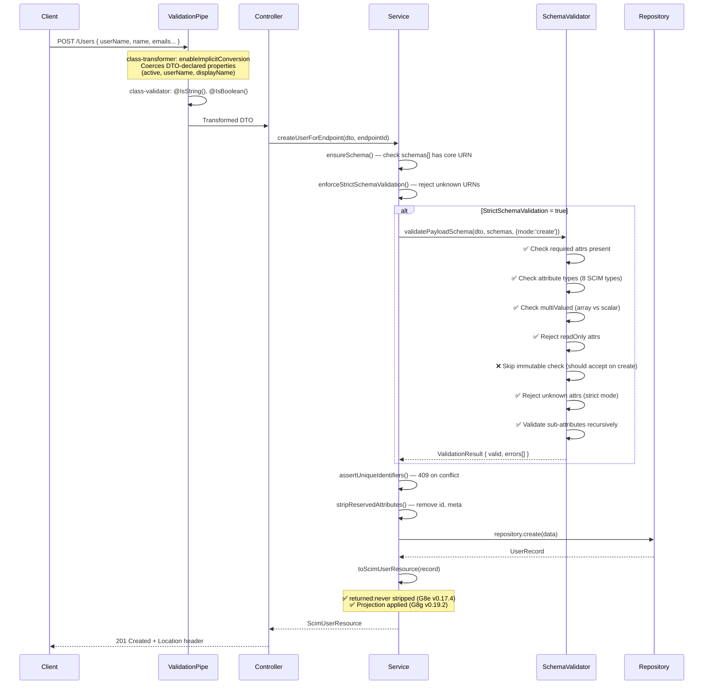

### 5.2 PUT (Replace) — Complete Flow

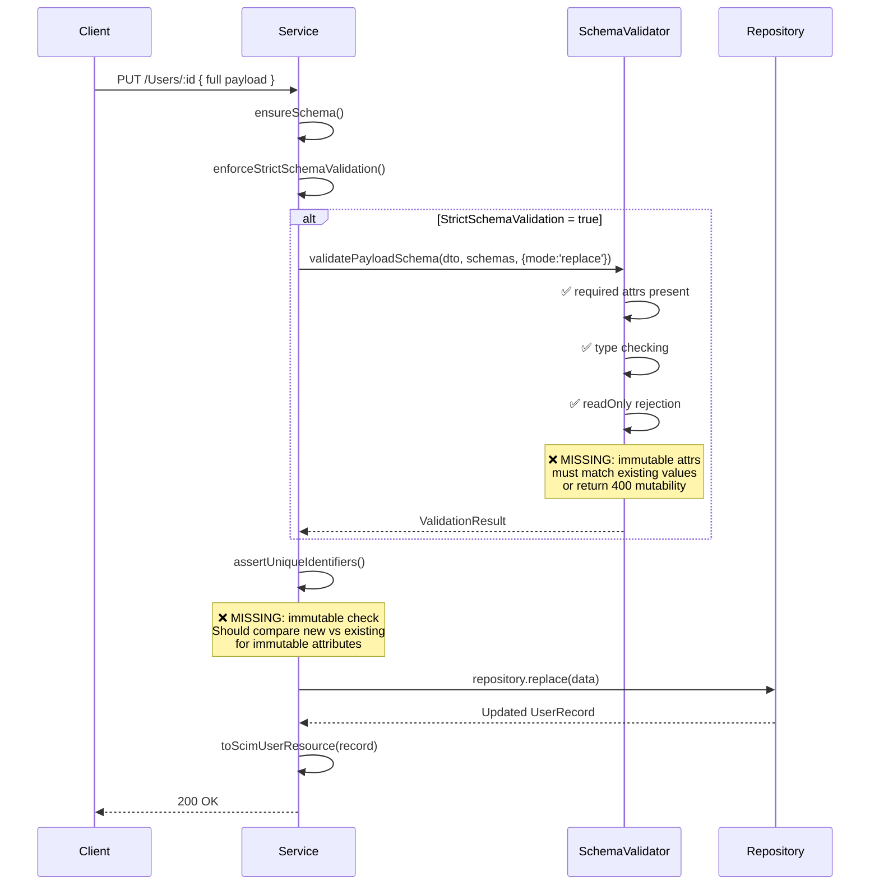

### 5.3 PATCH (Modify) — Complete Flow

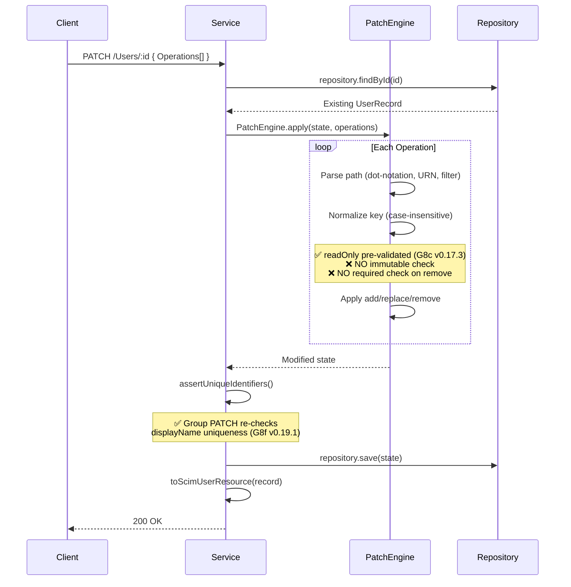

### 5.4 GET — Response Attribute Filtering

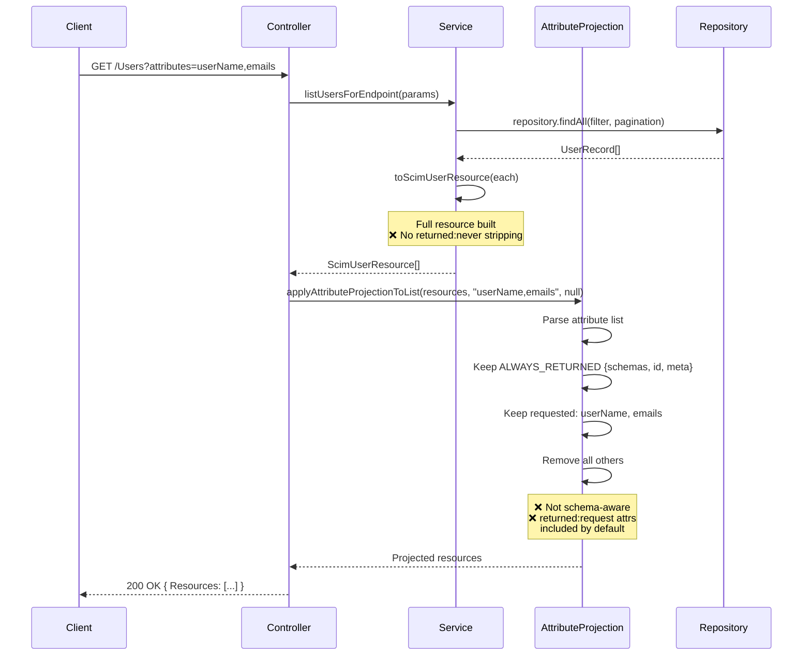

---

## 6. Extension & Custom Extension Handling

### 6.1 Extension Attribute Flow

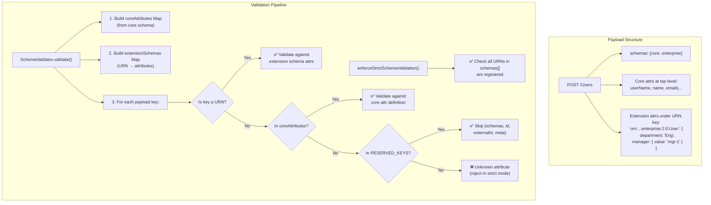

### 6.2 Extension Attribute Storage in Database

```
┌─────────────────────────────────────────────────────────────────────────────────┐
│ scim_resource table                                                             │
├──────────┬────────────┬──────────┬──────┬─────────────────────────────────────────┤
│ scim_id  │ userName   │ active   │ ...  │ raw_payload (JSONB)                     │
├──────────┼────────────┼──────────┼──────┼─────────────────────────────────────────┤
│ uuid-1   │ jane@co.co │ true     │ ...  │ {                                       │
│          │            │          │      │   "name": {"givenName":"Jane"},          │
│          │            │          │      │   "emails": [{"value":"jane@co.co"}],    │
│          │            │          │      │   "urn:...:enterprise:2.0:User": {       │
│          │            │          │      │     "department": "Engineering",          │
│          │            │          │      │     "manager": {"value":"mgr-uuid"}      │
│          │            │          │      │   }                                      │
│          │            │          │      │ }                                        │
└──────────┴────────────┴──────────┴──────┴─────────────────────────────────────────┘
```

Extension attributes are transparently stored inside `raw_payload` JSONB. The schema validation at input ensures they conform to the registered schema before storage.

### 6.3 Custom Extension Registration & Validation

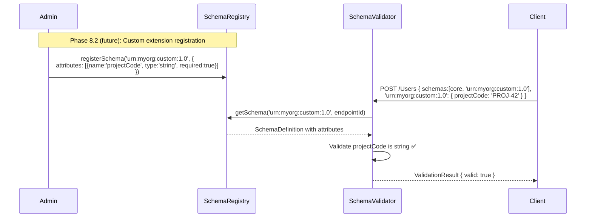

---

## 7. Sub-Attribute Characteristics & Inheritance

### 7.1 RFC Rules for Sub-Attributes

Per RFC 7643 §7:
> Sub-attributes have the **same set of characteristics** as top-level attributes (name, type, multiValued, required, mutability, returned, uniqueness, caseExact, canonicalValues, referenceTypes, description).

**They do NOT inherit** from the parent. Each sub-attribute is independently defined.

**Structural constraint:**
> A complex attribute **MUST NOT** contain sub-attributes that themselves have sub-attributes (max depth = 1).

### 7.2 Sub-Attribute Validation Flow

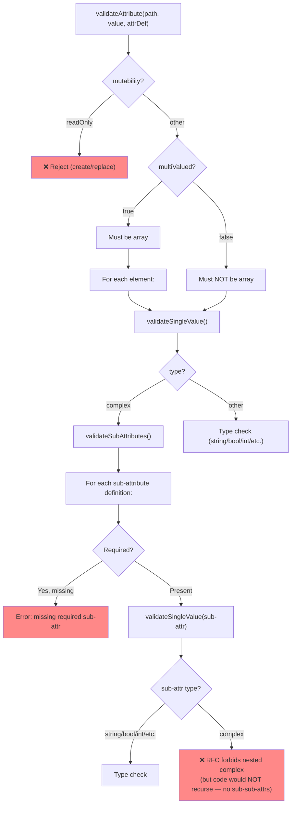

### 7.3 Key Sub-Attribute Characteristics in Current Schema

| Parent Attr | Sub-Attr | mutability | returned | Notes |
|:------------|:---------|:-----------|:---------|:------|
| name | givenName | readWrite | default | ✅ |
| name | familyName | readWrite | default | ✅ |
| emails | value | readWrite | default | required: true |
| emails | primary | readWrite | default | `true` MUST appear ≤1 time |
| manager | displayName | **readOnly** | default | Server-populated; client input accepted (by design) |
| manager | $ref | readWrite | default | referenceTypes: ['User'] |
| members | value | **immutable** | default | ❌ Not enforced in PatchEngine |
| members | display | **readOnly** | default | ❌ Not enforced in PatchEngine |
| members | type | **immutable** | default | ❌ Not enforced in PatchEngine |

### 7.4 Sub-Attribute Mutability Gap

The **PatchEngine** does not enforce sub-attribute mutability at all. This means:

```http
PATCH /scim/v2/endpoints/ep-1/Groups/grp-1
Content-Type: application/scim+json

{
  "schemas": ["urn:ietf:params:scim:api:messages:2.0:PatchOp"],
  "Operations": [
    {
      "op": "replace",
      "path": "members[value eq \"user-1\"].type",
      "value": "Admin"
    }
  ]
}
```

| | Current | RFC Required |
|:--|:--------|:-------------|
| **Behavior** | ✅ Accepted — type changed to "Admin" | ❌ 400 — members.type is `immutable` |
| **Status** | 200 OK | 400 Bad Request |
| **scimType** | — | `"mutability"` |

---

## 8. Database Schema & Stored Values

### 8.1 Resource Table Structure

```sql
CREATE TABLE scim_resource (
    id              UUID PRIMARY KEY DEFAULT gen_random_uuid(),
    scim_id         VARCHAR(255) NOT NULL,
    endpoint_id     VARCHAR(255) NOT NULL,
    resource_type   VARCHAR(50) NOT NULL,      -- 'User' or 'Group'
    user_name       VARCHAR(255),              -- first-class for uniqueness
    display_name    VARCHAR(255),              -- first-class for Groups
    external_id     VARCHAR(255),              -- first-class for uniqueness
    active          BOOLEAN DEFAULT true,      -- first-class for User
    raw_payload     JSONB NOT NULL,            -- all SCIM attributes
    version         INTEGER DEFAULT 1,         -- ETag support
    created_at      TIMESTAMPTZ DEFAULT NOW(),
    last_modified   TIMESTAMPTZ DEFAULT NOW(),
    deleted_at      TIMESTAMPTZ,               -- soft delete
    UNIQUE (endpoint_id, resource_type, scim_id)
);
```

### 8.2 What Gets Stored vs. What Gets Validated

```
┌─────────────────────────────────────────────────────────────────────────────────┐
│                     STORAGE vs. VALIDATION PIPELINE                             │
├─────────────────────────────────┬───────────────────────────────────────────────┤
│ First-Class Columns             │ rawPayload (JSONB)                            │
│ (Always stored, indexed)        │ (Pass-through, validated by SchemaValidator)  │
├─────────────────────────────────┼───────────────────────────────────────────────┤
│ userName     ← @IsString DTO   │ name: { givenName, familyName, ... }          │
│ externalId   ← @IsString DTO   │ emails: [{ value, type, primary }]            │
│ active       ← @IsBoolean DTO   │ phoneNumbers: [...]                           │
│ displayName  ← @IsString DTO   │ addresses: [...]                              │
│                                 │ roles: [...]                                  │
│ (Validated by DTO + uniqueness) │ urn:...:enterprise:2.0:User: { ... }          │
│                                 │ (Validated by SchemaValidator in strict mode)  │
├─────────────────────────────────┼───────────────────────────────────────────────┤
│ ❌ password never stored in     │ ❌ password CAN end up here if client sends   │
│    first-class column           │    it — no writeOnly stripping in current code│
└─────────────────────────────────┴───────────────────────────────────────────────┘
```

### 8.3 Endpoint Config Flags

```sql
SELECT key, value FROM "EndpointConfig" WHERE "endpointId" = 'ep-1';
```

| key | value | Effect on Attribute Characteristics |
|:----|:------|:------------------------------------|
| StrictSchemaValidation | True | Enables type, required, mutability (readOnly), unknown attr, multiValued checks |
| StrictSchemaValidation | False | Only DTO decorators + uniqueness checks apply |
| SoftDeleteEnabled | True/False | No effect on attribute characteristics |

---

## 9. Detailed Gap Inventory & Remediation Plan

### 9.1 Gap Summary Matrix

```
┌───┬──────────────────────────────────────┬──────────┬───────────────────────────┐
│ # │ Gap                                  │ Severity │ Where to Fix              │
├───┼──────────────────────────────────────┼──────────┼───────────────────────────┤
│G1 │ ✅ PatchEngine mutability (H-1+G8c)   │ ~~HIGH~~ │ PatchEngine + schema wire │
│G2 │ ✅ immutable enforced on PUT (H-2)     │ ~~HIGH~~ │ SchemaValidator + service │
│G3 │ ✅ returned:never stripped (G8e)      │ ~~MEDIUM~~ │ Response builder        │
│G4 │ ✅ returned:request gated (G8e/G8g)   │ ~~MEDIUM~~ │ Response builder        │
│G5 │ ✅ userName always-returned (G8e)      │ ~~MEDIUM~~ │ Attribute projection    │
│G6 │ ✅ Projection on POST/PUT/PATCH (G8g)  │ ~~MEDIUM~~ │ Controller layer        │
│G7 │ caseExact ignored in filters         │ MEDIUM   │ Filter evaluator          │
│G8 │ ✅ canonicalValues defined (BUG-007)  │ ~~LOW~~  │ Schema constants + types  │
│G9 │ referenceTypes not enforced          │ LOW      │ SchemaValidator           │
│G10│ ✅ password in schema (G8e)           │ ~~MEDIUM~~ │ Schema constants        │
│G11│ binary/reference not fully validated │ LOW      │ SchemaValidator           │
│G12│ ✅ Group PATCH uniqueness (G8f)       │ ~~MEDIUM~~ │ Groups service          │
│G13│ PATCH remove required → no error     │ MEDIUM   │ PatchEngine               │
│G14│ members.$ref missing from constants  │ LOW      │ Schema constants          │
│G15│ required attrs not always enforced   │ MEDIUM   │ Service layer (flag gate) │
├───┼──────────────────────────────────────┼──────────┼───────────────────────────┤
│D1 │ Discovery endpoints require auth     │ HIGH     │ Controllers + @Public()   │
│D2 │ No GET /Schemas/{uri} lookup         │ MEDIUM   │ Controllers + registry    │
│D3 │ No GET /ResourceTypes/{id} lookup    │ MEDIUM   │ Controllers + registry    │
│D4 │ Schema resources missing schemas[]   │ LOW      │ Schema constants          │
│D5 │ ResourceType resources missing schemas│ LOW      │ RT constants              │
│D6 │ SPC authSchemes missing primary      │ VERY LOW │ SPC constants             │
└───┴──────────────────────────────────────┴──────────┴───────────────────────────┘

See [DISCOVERY_ENDPOINTS_RFC_AUDIT.md](DISCOVERY_ENDPOINTS_RFC_AUDIT.md) for full audit.
```

### 9.2 Detailed Remediation

#### G1 — PatchEngine Mutability Checks (HIGH)

**What needs to change:**
```typescript
// user-patch-engine.ts — add schema-aware mutability guard
class UserPatchEngine {
  static apply(
    state: UserPatchState,
    operations: PatchOperation[],
    schemaDefinitions?: SchemaDefinition[]  // NEW parameter
  ): UserPatchState {
    for (const op of operations) {
      // NEW: Before applying, check mutability
      if (schemaDefinitions) {
        const attrDef = findAttributeDefinition(op.path, schemaDefinitions);
        if (attrDef) {
          if (attrDef.mutability === 'readOnly') {
            // RFC 7644 §3.5.2: "MUST NOT modify readOnly"
            throw new PatchError(400, `Attribute '${op.path}' is readOnly`, 'mutability');
          }
          if (attrDef.mutability === 'immutable' && op.op !== 'add') {
            throw new PatchError(400, `Attribute '${op.path}' is immutable`, 'mutability');
          }
          if (attrDef.mutability === 'immutable' && op.op === 'add') {
            const existing = getExistingValue(state, op.path);
            if (existing !== undefined && existing !== null) {
              throw new PatchError(400, `Attribute '${op.path}' is immutable and already has a value`, 'mutability');
            }
          }
        }
        // Check removing required attributes
        if (op.op === 'remove' && attrDef?.required) {
          throw new PatchError(400, `Cannot remove required attribute '${op.path}'`, 'mutability');
        }
      }
      // ... existing apply logic
    }
  }
}
```

**Effort:** ~3-4 hours (engine changes + attribute lookup utility + tests)

#### G2 — Immutable Enforcement on PUT (HIGH)

**What needs to change:**
```typescript
// SchemaValidator — add immutable check for replace mode
private static validateAttribute(
  path: string, value: unknown, attrDef: SchemaAttributeDefinition,
  options: ValidationOptions, errors: ValidationError[], existingResource?: Record<string, unknown>
) {
  // Existing: reject readOnly
  if (attrDef.mutability === 'readOnly' && (options.mode === 'create' || options.mode === 'replace')) {
    errors.push({ path, message: `...readOnly...`, scimType: 'mutability' });
    return;
  }

  // NEW: immutable on replace — must match existing value
  if (attrDef.mutability === 'immutable' && options.mode === 'replace' && existingResource) {
    const existingValue = existingResource[attrDef.name];
    if (existingValue !== undefined && existingValue !== null && !deepEqual(value, existingValue)) {
      errors.push({ path, message: `Attribute '${attrDef.name}' is immutable and cannot be changed`, scimType: 'mutability' });
      return;
    }
  }
}
```

**Effort:** ~2-3 hours (validator changes + service wiring to pass existing resource + tests)

#### G3+G4 — Response `returned` Filtering (MEDIUM)

**What needs to change:**
```typescript
// New: schema-aware response filter
function applyReturnedFiltering(
  resource: Record<string, unknown>,
  schemaDefinitions: SchemaDefinition[],
  context: { operation: 'get' | 'create' | 'replace' | 'patch', clientSentAttributes?: Set<string> }
): Record<string, unknown> {
  const result = { ...resource };

  for (const schema of schemaDefinitions) {
    for (const attr of schema.attributes) {
      const returned = attr.returned ?? 'default';

      if (returned === 'never') {
        delete result[attr.name];  // Always strip
      }

      if (returned === 'request') {
        if (context.operation === 'get') {
          delete result[attr.name];  // Only include if in ?attributes=
        } else if (!context.clientSentAttributes?.has(attr.name)) {
          delete result[attr.name];  // Only include if client sent it
        }
      }
    }
  }
  return result;
}
```

**Effort:** ~3-4 hours (response filter utility + wire into toScimUserResource/toScimGroupResource + tests)

#### G5+G6 — Schema-Driven Projection on All Responses (MEDIUM)

**What needs to change:**
- Move `ALWAYS_RETURNED` to be schema-driven (query schema definitions for `returned: "always"`)
- Apply projection on POST, PUT, PATCH controller responses (not just GET)
- Wire `attributes`/`excludedAttributes` query params to mutation endpoints

**Effort:** ~2-3 hours

#### G7 — caseExact in Filter Evaluation (MEDIUM)

**What needs to change:**
```typescript
// scim-filter-parser.ts
function compareValues(
  op: ScimCompareOp, actual: unknown, expected: unknown,
  caseExact: boolean = false  // NEW parameter
): boolean {
  if (!caseExact) {
    // Default: case-insensitive
    const normActual = typeof actual === 'string' ? actual.toLowerCase() : actual;
    const normExpected = typeof expected === 'string' ? expected.toLowerCase() : expected;
    return compare(op, normActual, normExpected);
  } else {
    // caseExact: true — preserve case
    return compare(op, actual, expected);
  }
}
```

This requires the filter evaluator to know which attribute is being compared, so it needs access to schema definitions.

**Effort:** ~3-4 hours (filter parser changes + schema lookup wiring + tests)

#### G8 — canonicalValues (LOW)

**What needs to change:**
- Add `canonicalValues` to `SchemaAttributeDefinition` and `ScimSchemaAttribute` interfaces
- Add to schema constants for `emails.type`, `phoneNumbers.type`, `addresses.type`, `ims.type`
- Optionally enforce at runtime (RFC says MAY restrict)
- Expose in `/Schemas` discovery

**Effort:** ~1-2 hours

#### G9 — referenceTypes Enforcement (LOW)

**What needs to change:**
- SchemaValidator checks `reference` type values are valid URIs
- Optionally verify referenced resource exists (would need repository access — may not be appropriate for domain layer)
- Add missing `referenceTypes` to Group `members.$ref`

**Effort:** ~2-3 hours

#### G10 — Password Attribute (MEDIUM)

**What needs to change:**
- Add `password` to `USER_SCHEMA_ATTRIBUTES` with `mutability: 'writeOnly'`, `returned: 'never'`
- Ensure response builder strips it (depends on G3)
- Ensure it's accepted on POST/PUT but never returned

**Effort:** ~1 hour (schema constant + response stripping via G3)

#### G11 — Binary/Reference Validation (LOW)

**What needs to change:**
- Binary: Validate Base64 format (`/^[A-Za-z0-9+/]*={0,2}$/`)
- Reference: Validate URI format per RFC 3986

**Effort:** ~1-2 hours

#### G12 — Group PATCH Uniqueness (MEDIUM)

**What needs to change:**
- After `GroupPatchEngine.apply()`, call `assertUniqueDisplayName()` (like User PATCH does for `assertUniqueIdentifiers`)

**Effort:** ~30 minutes + tests

#### G13 — PATCH Remove Required (MEDIUM)

Covered by G1 (PatchEngine mutability checks).

#### G14 — Missing members.$ref (LOW)

Add to `GROUP_SCHEMA_ATTRIBUTES`:
```typescript
{ name: '$ref', type: 'reference', multiValued: false, required: false,
  mutability: 'immutable', returned: 'default', referenceTypes: ['User', 'Group'] }
```

**Effort:** ~15 minutes

#### G15 — Required Always Enforced (MEDIUM)

Consider making `required` attribute enforcement independent of `StrictSchemaValidation` flag, or enabling `StrictSchemaValidation` by default. This is an architectural decision — currently the flag gates both strict and lenient behavior to support Entra ID compatibility.

**Effort:** ~1-2 hours (config change + test updates)

---

## 10. Effort Estimation & Phase Mapping

### 10.1 Effort Summary

| Priority | Gap(s) | Description | Estimated Effort | Dependencies |
|:---------|:-------|:------------|:----------------|:-------------|
| **P0** | ~~G1~~, G13 | ~~PatchEngine mutability~~ (G8c ✅) + required guard | ~~4-5 hours~~ 1-2h | Schema def lookup utility |
| **P0** | ~~G2~~ | ~~Immutable enforcement on PUT~~ (H-2 ✅) | ~~2-3 hours~~ Done | ~~G1 lookup utility~~ |
| **P1** | ~~G3, G4, G10~~ | ~~Response `returned` filtering + password~~ (G8e ✅) | ~~4-5 hours~~ Done | ~~Schema constants update~~ |
| **P1** | ~~G5, G6~~ | ~~Schema-driven projection on all responses~~ (G8g ✅) | ~~2-3 hours~~ Done | ~~G3~~ |
| **P1** | ~~G12~~ | ~~Group PATCH uniqueness recheck~~ (G8f ✅) | ~~30 min~~ Done | — |
| **P2** | G7 | caseExact in filter evaluation | 3-4 hours | Schema lookup in filter |
| **P3** | G8 | canonicalValues definition | 1-2 hours | — |
| **P3** | G9 | referenceTypes enforcement | 2-3 hours | — |
| **P3** | G11 | Binary base64 + reference URI validation | 1-2 hours | — |
| **P3** | G14 | Missing members.$ref definition | 15 min | — |
| **P4** | G15 | Required always enforced (arch decision) | 1-2 hours | Config discussion |

**Total remaining effort: ~10-15 hours** (reduced from ~22-30h; G1-G6, G8, G10, G12 resolved)

### 10.2 Suggested Implementation Phases

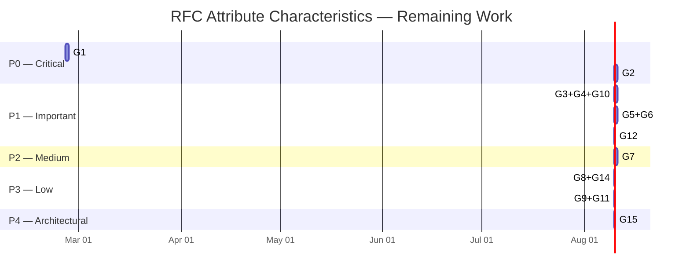

### 10.3 Mapping to Existing Migration Plan Phases

| Migration Phase | Gap Coverage | Notes |
|:----------------|:-------------|:------|
| **Phase 8 (done)** | Type, required (strict), multiValued, readOnly (create/replace), unknown attrs | v0.17.0 — Schema Validation Engine |
| **Phase 8.1 (done)** | G1, G2, G13 — Mutability enforcement across all operations | v0.17.3 (G8c) + H-1/H-2 — PatchEngine readOnly pre-validation |
| **Phase 8.2 (done)** | Custom Resource Type registration + runtime validation | v0.18.0 (G8b) — Custom Resource Types |
| **Phase 8.3 (done)** | G3, G4, G5, G6, G10 — Response shaping per `returned` | v0.17.4 (G8e) + v0.19.2 (G8g) — Schema-driven response filter |
| **Phase 8.4 (new)** | G7 — caseExact in filter evaluation | Filter parser enhancement |
| **Phase 8.5 (new)** | G8, G9, G11, G14 — Schema completeness | Constants + optional enforcement |
| **Phase 12 (existing)** | G15 — Required enforcement config | Architectural cleanup phase |

### 10.4 What It Will Take — Concrete Deliverables Per Sub-Phase

**Phase 8.1 — Mutability Enforcement (P0, ~5-8 hours):**
- New: `SchemaAttributeLookup` utility — resolves path → `SchemaAttributeDefinition` (handles dot-notation, URN paths, filter paths)
- Modified: `UserPatchEngine.apply()` — add schema definitions parameter, mutability guard before each operation
- Modified: `GroupPatchEngine.apply()` — same pattern
- Modified: `SchemaValidator.validateAttribute()` — add immutable check for replace mode
- Modified: `endpoint-scim-users.service.ts` — pass existing resource to SchemaValidator for immutable comparison on PUT, pass schema defs to PatchEngine
- Modified: `endpoint-scim-groups.service.ts` — same pattern
- New: ~40-60 unit tests for PatchEngine mutability scenarios
- New: ~10-15 E2E tests for mutability enforcement flows
- Modified: Existing PATCH tests that may need updating for new error responses

**Phase 8.3 — Response Shaping (P1, ~6-8 hours):**
- New: `SchemaResponseFilter` utility — applies `returned` characteristic to response bodies
- Modified: `toScimUserResource()` — invoke response filter before returning
- Modified: `toScimGroupResource()` — same pattern
- Modified: `scim-attribute-projection.ts` — make `ALWAYS_RETURNED` schema-driven
- Modified: Controllers — apply projection on POST/PUT/PATCH responses
- New: `password` attribute in `USER_SCHEMA_ATTRIBUTES`
- New: ~20-30 unit tests for response filtering
- New: ~10-15 E2E tests for response shaping

**Phase 8.4 — caseExact Filters (P2, ~3-4 hours):**
- Modified: `compareValues()` in filter parser — add caseExact parameter
- Modified: Filter evaluation chain — pass schema attribute definition for caseExact lookup
- New: ~10-15 unit tests for case-sensitive vs case-insensitive filter comparisons
- New: ~5-8 E2E tests for caseExact filter scenarios

---

## Appendix A — RFC Quotes (Key Sections)

### RFC 7643 §2.2 — Attribute Characteristics Defaults

> *"Unless otherwise stated in a specific attribute's definition, the following defaults apply: required is 'false', canonicalValues is none, caseExact is 'false', mutability is 'readWrite', returned is 'default', uniqueness is 'none'."*

### RFC 7644 §3.3 — Creating Resources

> *"In the request body, attributes whose mutability is 'readOnly' (see Sections 2.2 and 7 of [RFC7643]) SHALL be ignored."*

### RFC 7644 §3.5.1 — Replacing with PUT

> *"If an attribute is 'required', clients MUST specify the attribute in the PUT request."*
>
> *"immutable — If one or more values are already set for the attribute, the input value(s) MUST match, or HTTP status code 400 SHOULD be returned with a 'scimType' error code of 'mutability'."*

### RFC 7644 §3.5.2 — Modifying with PATCH

> *"A client MUST NOT modify an attribute that has mutability 'readOnly' or 'immutable'. However, a client MAY 'add' a value to an 'immutable' attribute if the attribute had no previous value."*
>
> *"If an attribute is removed or becomes unassigned and is defined as a required attribute or a read-only attribute, the server SHALL return an HTTP response status code and a JSON detail error response…with a 'scimType' error code of 'mutability'."*

### RFC 7644 §3.9 — Attribute Set

> *"For any SCIM operation where a resource representation is returned…the attributes returned are defined as the minimum attribute set plus default attribute set."*
