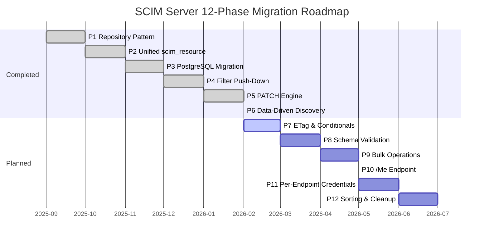
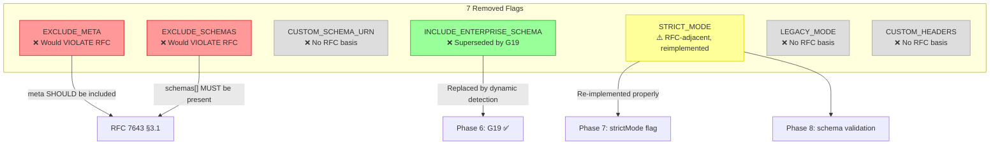
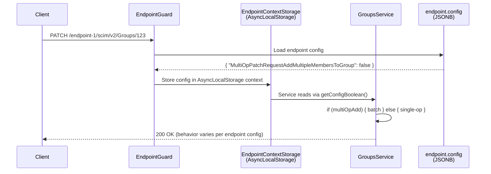
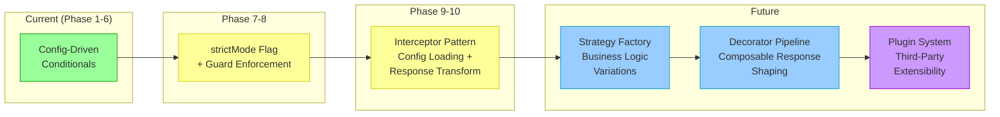
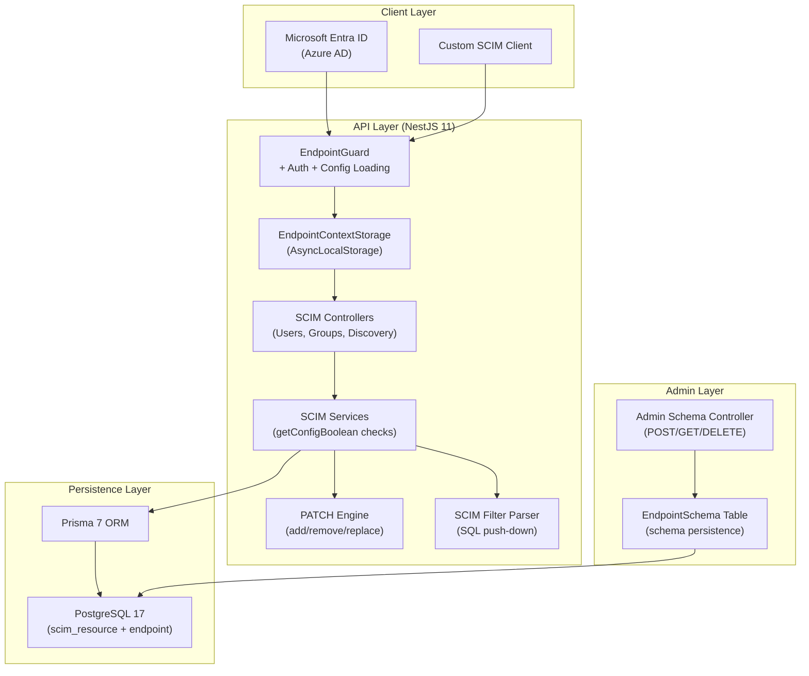
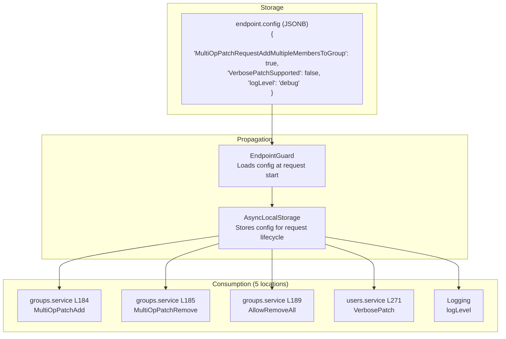
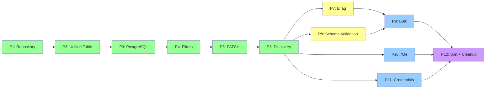

# RFC Compliance & Project Requirements Analysis

> **Version**: 1.0 | **Date**: 2026-02-20 | **Project Version**: v0.14.0  
> **Scope**: RFC 7643 (Core Schema) + RFC 7644 (Protocol) compliance mapping, 20 project goals (G1–G20), removed flags analysis, and per-endpoint extensibility roadmap

---

## Table of Contents

1. [Executive Summary](#1-executive-summary)
2. [RFC 7644 Protocol Compliance Matrix](#2-rfc-7644-protocol-compliance-matrix)
3. [RFC 7643 Core Schema Compliance Matrix](#3-rfc-7643-core-schema-compliance-matrix)
4. [Project Goals (G1–G20) Status & Phase Mapping](#4-project-goals-g1g20-status--phase-mapping)
5. [12-Phase Migration Roadmap & RFC Coverage](#5-12-phase-migration-roadmap--rfc-coverage)
6. [Removed Flags Analysis](#6-removed-flags-analysis)
7. [Active Flags Analysis](#7-active-flags-analysis)
8. [Per-Endpoint Extensibility Architecture](#8-per-endpoint-extensibility-architecture)
9. [RFC Compliance Progression by Phase](#9-rfc-compliance-progression-by-phase)
10. [Architecture Diagrams](#10-architecture-diagrams)
11. [Appendix: RFC Section Reference](#11-appendix-rfc-section-reference)

---

## 1. Executive Summary

### Current State

The SCIM server (v0.14.0) has completed **Phases 1–6** of a 12-phase migration plan, achieving approximately **~95% RFC compliance** across RFC 7643 and RFC 7644. The remaining ~5% maps to specific RFC sections addressed in Phases 7–12.

### Key Numbers

| Metric | Value |
|---|---|
| Overall RFC Compliance | ~95% |
| Phases Complete | 6 of 12 |
| Project Goals Fixed | 12 of 20 |
| Unit Tests | 1301 across 52 suites |
| E2E Tests | 215 across 16 suites |
| Active Config Flags | 5 |
| Removed Dead Flags | 7 |

### Compliance Summary

| RFC Area | Status | Phase |
|---|---|---|
| CRUD Operations (GET/POST/PUT/PATCH/DELETE) | ✅ 100% | 1–5 |
| Media Types (application/scim+json) | ✅ 100% | 1 |
| Discovery (/ServiceProviderConfig, /Schemas, /ResourceTypes) | ✅ 100% | 6 |
| Error Handling (scimType codes) | ✅ 100% | 1 |
| Filtering (eq, ne, co, sw, ew, gt, ge, lt, le, pr, and, or, not) | ✅ 100% | 4 |
| Pagination (startIndex, count, totalResults) | ✅ 100% | 4 |
| POST /.search | ✅ 100% | 4 |
| Attribute Projection (attributes, excludedAttributes) | ✅ 100% | 4 |
| PATCH Operations (add, remove, replace) | ✅ 98% | 5 |
| ETag (version in meta, weak ETags) | ⚠️ 95% | 7 |
| Bulk Operations (/Bulk) | ❌ 0% | 9 |
| Sorting (sortBy, sortOrder) | ❌ 0% | 12 |
| /Me Alias | ❌ 0% | 10 |

---

## 2. RFC 7644 Protocol Compliance Matrix

### 2.1 SCIM Endpoints (RFC 7644 §3.2)

| Endpoint | RFC Requirement | Status | Phase | Notes |
|---|---|---|---|---|
| GET /Users, /Groups | MUST | ✅ | 1 | Full retrieval with meta |
| POST /Users, /Groups | MUST | ✅ | 1 | 201 Created + Location header |
| PUT /Users, /Groups | MUST | ✅ | 1 | Full replacement with mutability rules |
| PATCH /Users, /Groups | SHOULD | ✅ | 5 | add/remove/replace with path filters |
| DELETE /Users, /Groups | MUST | ✅ | 1 | 204 No Content |
| GET /ServiceProviderConfig | MUST | ✅ | 6 | Dynamic per-endpoint config |
| GET /Schemas | MUST | ✅ | 6 | Dynamic schema discovery |
| GET /ResourceTypes | MUST | ✅ | 6 | Dynamic resource type discovery |
| POST /Bulk | OPTIONAL | ✅ | 9 | Implemented (v0.19.0) |
| POST /.search | OPTIONAL | ✅ | 4 | Full implementation |
| /Me | OPTIONAL | ❌ | 10 | Not implemented |

### 2.2 Creating Resources (RFC 7644 §3.3)

| Requirement | RFC Level | Status | Implementation |
|---|---|---|---|
| Return 201 Created | SHALL | ✅ | All POST endpoints return 201 |
| Location header in response | SHALL | ✅ | `meta.location` + HTTP Location header |
| Return full representation in body | SHOULD | ✅ | Full resource returned |
| 409 Conflict for duplicates | MUST | ✅ | `uniqueness` scimType error |
| Set `meta.resourceType` | SHALL | ✅ | Auto-set by endpoint |

### 2.3 Retrieving Resources (RFC 7644 §3.4)

| Requirement | RFC Level | Status | Phase | Implementation |
|---|---|---|---|---|
| GET by ID | MUST | ✅ | 1 | `/Users/{id}`, `/Groups/{id}` |
| Query with filter param | OPTIONAL | ✅ | 4 | Full SCIM filter grammar |
| Return 200 with `totalResults=0` for no matches | SHALL | ✅ | 4 | Empty ListResponse |
| `attributes` param | OPTIONAL | ✅ | 4 | Attribute projection |
| `excludedAttributes` param | OPTIONAL | ✅ | 4 | Attribute exclusion |
| Case-insensitive filter attribute names | SHALL | ✅ | 4 | Case-insensitive parsing |

### 2.4 Filtering (RFC 7644 §3.4.2.2)

| Operator | RFC Level | Status | Phase |
|---|---|---|---|
| eq (equal) | MUST support if filtering supported | ✅ | 4 |
| ne (not equal) | MUST | ✅ | 4 |
| co (contains) | MUST | ✅ | 4 |
| sw (starts with) | MUST | ✅ | 4 |
| ew (ends with) | MUST | ✅ | 4 |
| gt (greater than) | MUST | ✅ | 4 |
| ge (greater than or equal) | MUST | ✅ | 4 |
| lt (less than) | MUST | ✅ | 4 |
| le (less than or equal) | MUST | ✅ | 4 |
| pr (present) | MUST | ✅ | 4 |
| and (logical AND) | MUST | ✅ | 4 |
| or (logical OR) | MUST | ✅ | 4 |
| not (logical NOT) | MUST | ✅ | 4 |
| Complex attribute filter `[]` | MAY | ✅ | 4 |
| Reject unknown filter operators (400 invalidFilter) | MUST | ✅ | 4 |

### 2.5 Sorting (RFC 7644 §3.4.2.3)

| Requirement | RFC Level | Status | Phase |
|---|---|---|---|
| sortBy parameter | OPTIONAL | ❌ | 12 |
| sortOrder parameter (ascending/descending) | OPTIONAL | ❌ | 12 |
| ServiceProviderConfig `sort.supported` | MUST declare | ✅ | 6 (declared as false) |

> **RFC Analysis**: Sorting is explicitly **OPTIONAL**. The server correctly declares `sort.supported: false` in ServiceProviderConfig. No RFC violation exists. Phase 12 will add sorting as a value-add feature.

### 2.6 Pagination (RFC 7644 §3.4.2.4)

| Requirement | RFC Level | Status | Phase |
|---|---|---|---|
| startIndex parameter | OPTIONAL | ✅ | 4 |
| count parameter | OPTIONAL | ✅ | 4 |
| totalResults in response | REQUIRED when paginating | ✅ | 4 |
| itemsPerPage in response | SHOULD | ✅ | 4 |
| startIndex in response | SHOULD | ✅ | 4 |

### 2.7 POST Search (RFC 7644 §3.4.3)

| Requirement | RFC Level | Status | Phase |
|---|---|---|---|
| POST /.search endpoint | OPTIONAL | ✅ | 4 |
| SearchRequest schema URI | MUST | ✅ | 4 |
| attributes, filter, sortBy, sortOrder, startIndex, count | OPTIONAL | ✅ (except sort) | 4/12 |

### 2.8 Modifying with PUT (RFC 7644 §3.5.1)

| Requirement | RFC Level | Status | Phase |
|---|---|---|---|
| Full attribute replacement | MUST | ✅ | 1 |
| PUT MUST NOT create resources | MUST NOT | ✅ | 1 |
| Return 200 OK with full representation | SHALL | ✅ | 1 |
| readWrite attribute replacement | SHALL | ✅ | 1 |
| immutable attribute validation | SHOULD return 400 | ✅ | 1 |
| readOnly attributes ignored | SHALL | ✅ | 1 |

### 2.9 Modifying with PATCH (RFC 7644 §3.5.2)

| Requirement | RFC Level | Status | Phase | Notes |
|---|---|---|---|---|
| PATCH is OPTIONAL | OPTIONAL | ✅ | 5 | Fully implemented |
| PatchOp schema URI in request | MUST | ✅ | 5 | Validated |
| `add` operation | MUST (if PATCH supported) | ✅ | 5 | With/without path |
| `remove` operation | MUST | ✅ | 5 | With path filter support |
| `replace` operation | MUST | ✅ | 5 | With/without path |
| Atomic PATCH (all-or-nothing) | SHALL | ✅ | 5 | Transaction-wrapped |
| Return 200 OK or 204 No Content | MUST/MAY | ✅ | 5 | 200 with full body |
| Path filter expressions | MUST support for remove | ✅ | 5 | valuePath filters |
| Multi-valued primary attribute handling | SHALL | ✅ | 5 | Auto-clears other primaries |
| 400 noTarget for unmatched filter | SHALL | ✅ | 5 | — |
| 400 mutability for readOnly modifications | SHALL | ⚠️ | 8 | Partial — full validation in Phase 8 |

### 2.10 Deleting Resources (RFC 7644 §3.6)

| Requirement | RFC Level | Status | Phase |
|---|---|---|---|
| DELETE by ID | MUST | ✅ | 1 |
| Return 204 No Content | MUST | ✅ | 1 |
| 404 for non-existent resource | MUST | ✅ | 1 |

### 2.11 Bulk Operations (RFC 7644 §3.7)

| Requirement | RFC Level | Status | Phase |
|---|---|---|---|
| POST /Bulk endpoint | OPTIONAL | ❌ | 9 |
| BulkRequest schema URI | MUST (if supported) | ❌ | 9 |
| BulkResponse schema URI | MUST (if supported) | ❌ | 9 |
| failOnErrors attribute | OPTIONAL | ❌ | 9 |
| bulkId temporary identifiers | MUST resolve | ❌ | 9 |
| Circular reference handling | MUST try | ❌ | 9 |
| maxOperations, maxPayloadSize limits | MUST define | ❌ | 9 |
| ServiceProviderConfig `bulk.supported` | MUST declare | ✅ | 6 (declared as false) |

> **RFC Analysis**: Bulk is **OPTIONAL**. The server correctly declares `bulk.supported: false`. No RFC violation. Phase 9 adds bulk with bulkId resolution, topological sort for dependencies, and circular reference detection.

### 2.12 Data Formats (RFC 7644 §3.8)

| Requirement | RFC Level | Status |
|---|---|---|
| Accept: application/scim+json | MUST | ✅ |
| Accept: application/json | SHOULD | ✅ |
| Content-Type: application/scim+json | MUST | ✅ |
| Default to application/scim+json | SHALL | ✅ |

### 2.13 Additional Response Parameters (RFC 7644 §3.9)

| Requirement | RFC Level | Status | Phase |
|---|---|---|---|
| `attributes` query param | OPTIONAL | ✅ | 4 |
| `excludedAttributes` query param | OPTIONAL | ✅ | 4 |

### 2.14 HTTP Status Codes (RFC 7644 §3.12)

| Status Code | Requirement | Status |
|---|---|---|
| 200 OK | Standard success | ✅ |
| 201 Created | POST success | ✅ |
| 204 No Content | DELETE success / PATCH success | ✅ |
| 400 Bad Request (invalidFilter, tooMany, uniqueness, mutability, invalidSyntax, invalidPath, noTarget, invalidValue) | MUST | ✅ |
| 401 Unauthorized | MUST | ✅ |
| 403 Forbidden | MUST | ✅ |
| 404 Not Found | MUST | ✅ |
| 409 Conflict | MUST for duplicates | ✅ |
| 412 Precondition Failed | SHOULD for If-Match failure | ⚠️ Phase 7 |
| 413 Payload Too Large | MUST for bulk limits | ❌ Phase 9 |
| 500 Internal Server Error | SHOULD | ✅ |
| 501 Not Implemented | SHOULD for unsupported ops | ✅ |

### 2.15 Versioning / ETags (RFC 7644 §3.14)

| Requirement | RFC Level | Status | Phase | Notes |
|---|---|---|---|---|
| Weak ETags in ETag header | MAY | ✅ | 1 | `W/"hash"` format |
| `meta.version` attribute | SHOULD | ✅ | 1 | Matches ETag header |
| If-None-Match for conditional GET | MAY | ⚠️ | 7 | Header parsed but not enforced |
| If-Match for conditional PUT/PATCH/DELETE | MAY | ⚠️ | 7 | Header parsed but not enforced |
| 412 Precondition Failed | SHOULD | ⚠️ | 7 | Not currently returned |

> **Phase 7 Plan**: ETag will be upgraded from hash-based weak ETags to integer version counters. If-Match will be enforced with proper 412 responses. A `strictMode` config flag will control If-Match enforcement per endpoint.

### 2.16 /Me Alias (RFC 7644 §3.11)

| Requirement | RFC Level | Status | Phase |
|---|---|---|---|
| /Me endpoint | OPTIONAL | ❌ | 10 |
| 501 for unsupported | SHOULD | ⚠️ | 10 |
| Redirect (308) or direct processing | MAY | ❌ | 10 |

> **RFC Analysis**: /Me is **OPTIONAL**. Phase 10 will map the authenticated user to a SCIM resource.

### 2.17 Service Provider Configuration (RFC 7644 §4)

| Requirement | RFC Level | Status | Phase |
|---|---|---|---|
| GET /ServiceProviderConfig | MUST | ✅ | 6 |
| patch.supported | REQUIRED | ✅ | 6 |
| bulk.supported, maxOperations, maxPayloadSize | REQUIRED | ✅ | 6 |
| filter.supported, maxResults | REQUIRED | ✅ | 6 |
| changePassword.supported | REQUIRED | ✅ | 6 |
| sort.supported | REQUIRED | ✅ | 6 |
| etag.supported | REQUIRED | ✅ | 6 |
| authenticationSchemes | REQUIRED | ✅ | 6 |
| Ignore filter/sort/pagination on config endpoints | SHALL | ✅ | 6 |

### 2.18 Multi-Tenancy (RFC 7644 §6)

| Requirement | RFC Level | Status | Phase |
|---|---|---|---|
| Multi-tenancy support | OPTIONAL | ✅ | 1 | Via endpoint-based tenancy |
| Endpoint isolation | MAY | ✅ | 1 | Each endpoint = isolated endpoint |

---

## 3. RFC 7643 Core Schema Compliance Matrix

### 3.1 Common Attributes (RFC 7643 §3.1)

| Attribute | RFC Level | Status | Notes |
|---|---|---|---|
| `id` (server-assigned, readOnly) | MUST | ✅ | UUID v4 |
| `externalId` (client-supplied) | OPTIONAL | ✅ | readWrite |
| `meta.resourceType` | MUST (when accepted) | ✅ | Auto-set |
| `meta.created` | MUST | ✅ | DateTime |
| `meta.lastModified` | MUST | ✅ | DateTime |
| `meta.location` | MUST | ✅ | Full URI |
| `meta.version` | OPTIONAL (subject to ETag support) | ✅ | Weak ETag |
| `schemas` array | MUST | ✅ | Non-empty, unique URIs |

### 3.2 User Resource Schema (RFC 7643 §4.1)

| Attribute | RFC Level | Status |
|---|---|---|
| `userName` (REQUIRED, case-insensitive, unique) | MUST | ✅ |
| `name` (complex: formatted, familyName, givenName, middleName, honorificPrefix, honorificSuffix) | OPTIONAL sub-attrs | ✅ |
| `displayName` | OPTIONAL | ✅ |
| `nickName` | OPTIONAL | ✅ |
| `profileUrl` | OPTIONAL | ✅ |
| `title` | OPTIONAL | ✅ |
| `userType` | OPTIONAL | ✅ |
| `preferredLanguage` | OPTIONAL | ✅ |
| `locale` | OPTIONAL | ✅ |
| `timezone` | OPTIONAL | ✅ |
| `active` | OPTIONAL | ✅ |
| `password` (writeOnly, never returned) | OPTIONAL | ✅ |
| `emails` (multi-valued complex) | OPTIONAL | ✅ |
| `phoneNumbers` (multi-valued complex) | OPTIONAL | ✅ |
| `ims` (multi-valued complex) | OPTIONAL | ✅ |
| `photos` (multi-valued complex) | OPTIONAL | ✅ |
| `addresses` (multi-valued complex) | OPTIONAL | ✅ |
| `groups` (readOnly, multi-valued) | OPTIONAL | ✅ |
| `entitlements` (multi-valued) | OPTIONAL | ✅ |
| `roles` (multi-valued) | OPTIONAL | ✅ |
| `x509Certificates` (multi-valued) | OPTIONAL | ✅ |

### 3.3 Group Resource Schema (RFC 7643 §4.2)

| Attribute | RFC Level | Status |
|---|---|---|
| `displayName` (REQUIRED) | MUST | ✅ |
| `members` (multi-valued: value, $ref, display, type) | OPTIONAL | ✅ |
| `members.value` = target `id` | MUST (if members supported) | ✅ |
| `members.$ref` = target URI | MUST | ✅ |
| `members.type` = "User" or "Group" | OPTIONAL | ✅ |

### 3.4 Enterprise User Extension (RFC 7643 §4.3)

| Attribute | RFC Level | Status |
|---|---|---|
| `employeeNumber` | OPTIONAL | ✅ |
| `costCenter` | OPTIONAL | ✅ |
| `organization` | OPTIONAL | ✅ |
| `division` | OPTIONAL | ✅ |
| `department` | OPTIONAL | ✅ |
| `manager` (complex: value, $ref, displayName) | OPTIONAL | ✅ |

### 3.5 ServiceProviderConfig Schema (RFC 7643 §5)

| Attribute | RFC Level | Status |
|---|---|---|
| `documentationUri` | OPTIONAL | ✅ |
| `patch` (complex: supported) | REQUIRED | ✅ |
| `bulk` (complex: supported, maxOperations, maxPayloadSize) | REQUIRED | ✅ |
| `filter` (complex: supported, maxResults) | REQUIRED | ✅ |
| `changePassword` (complex: supported) | REQUIRED | ✅ |
| `sort` (complex: supported) | REQUIRED | ✅ |
| `etag` (complex: supported) | REQUIRED | ✅ |
| `authenticationSchemes` (multi-valued complex) | REQUIRED | ✅ |

### 3.6 ResourceType Schema (RFC 7643 §6)

| Attribute | RFC Level | Status |
|---|---|---|
| `id` | OPTIONAL | ✅ |
| `name` | REQUIRED | ✅ |
| `description` | OPTIONAL | ✅ |
| `endpoint` | REQUIRED | ✅ |
| `schema` | REQUIRED | ✅ |
| `schemaExtensions` (complex: schema, required) | OPTIONAL | ✅ |

### 3.7 Schema Definition (RFC 7643 §7)

| Requirement | RFC Level | Status | Phase |
|---|---|---|---|
| Schema resources queryable at /Schemas | MUST | ✅ | 6 |
| Schema `id` is a URI | MUST | ✅ | 6 |
| Attribute metadata (name, type, multiValued, description, required, canonicalValues, caseExact, mutability, returned, uniqueness) | MUST | ✅ | 6 |
| Schema validation enforcement | SHOULD | ⚠️ | 8 |

> **Phase 8 Plan**: Full schema validation against declared attribute definitions. Unknown attributes will be rejected when `strictMode` is enabled.

---

## 4. Project Goals (G1–G20) Status & Phase Mapping

### Legend

| Icon | Meaning |
|---|---|
| ✅ | Fixed / Implemented |
| 🔲 | Open / Not yet implemented |
| ⚠️ | Partially fixed |
| 🔴 | Critical severity |
| 🟡 | High severity |
| 🟢 | Medium severity |
| ⚪ | Low severity |

### Goals Table

| Goal | Description | Severity | Status | Phase | RFC Basis |
|---|---|---|---|---|---|
| **G1** | Queries execute against PostgreSQL instead of in-memory arrays | 🔴 | ✅ | 3 | RFC 7644 §3.4.2 (scalability) |
| **G2** | User/Group share `scim_resource` table (polymorphic) | 🔴 | ✅ | 2 | RFC 7643 §3 (resource abstraction) |
| **G3** | Prisma repository implements `ScimResourceRepository` interface | 🔴 | ✅ | 1 | — (architecture) |
| **G4** | Filter push-down to SQL (no in-memory filtering) | 🔴 | ✅ | 4 | RFC 7644 §3.4.2.2 (performance) |
| **G5** | PATCH engine with proper add/remove/replace semantics | 🟡 | ✅ | 5 | RFC 7644 §3.5.2 |
| **G6** | Collision detection for unique attributes | 🟡 | ✅ | 3 | RFC 7644 §3.3 (409 Conflict) |
| **G7** | ETag integer versioning with If-Match enforcement | 🟡 | 🔲 | 7 | RFC 7644 §3.14 |
| **G8** | Schema validation against declared attribute schemas | 🟢 | 🔲 | 8 | RFC 7643 §7 |
| **G9** | Bulk operations with bulkId resolution | 🟢 | 🔲 | 9 | RFC 7644 §3.7 |
| **G10** | /Me endpoint mapping authenticated user | ⚪ | 🔲 | 10 | RFC 7644 §3.11 |
| **G11** | Per-endpoint credential management | 🟡 | 🔲 | 11 | — (security) |
| **G12** | Sorting with SQL push-down | ⚪ | 🔲 | 12 | RFC 7644 §3.4.2.3 |
| **G13** | POST /.search cleanup and optimization | ⚪ | 🔲 | 12 | RFC 7644 §3.4.3 |
| **G14** | Case-insensitive attribute filtering | 🟡 | ✅ | 4 | RFC 7644 §3.4.2.2 |
| **G15** | Multi-valued attribute PATCH (primary handling) | 🟡 | ✅ | 5 | RFC 7644 §3.5.2 |
| **G16** | Discovery endpoints (ServiceProviderConfig, Schemas, ResourceTypes) | 🟡 | ✅ | 6 | RFC 7644 §4 |
| **G17** | Extension schema support (Enterprise User) | 🟢 | ⚠️ | 6/8 | RFC 7643 §3.3, §4.3 |
| **G18** | Dead code and unused flag cleanup | ⚪ | 🔲 | 12 | — (maintenance) |
| **G19** | Dynamic extension schema detection (replaces INCLUDE_ENTERPRISE_SCHEMA flag) | 🟢 | ✅ | 6 | RFC 7643 §3.3 |
| **G20** | Endpoint schema persistence (admin CRUD for schemas) | 🟢 | ✅ | 6 | — (admin tooling) |

### Summary

| Category | Count |
|---|---|
| Completed (✅) | 12 |
| Partially Complete (⚠️) | 1 |
| Open (🔲) | 7 |

---

## 5. 12-Phase Migration Roadmap & RFC Coverage



### Phase Details

#### Phase 1: Repository Pattern ✅
- **Goal**: G3
- **RFC Coverage**: Architecture foundation — no direct RFC section
- **Deliverables**: `ScimResourceRepository` interface, Prisma + InMemory implementations
- **Impact**: Enables all subsequent phases via clean abstractions

#### Phase 2: Unified scim_resource Table ✅
- **Goal**: G2
- **RFC Coverage**: RFC 7643 §3 (polymorphic resource model)
- **Deliverables**: Single `scim_resource` table with `resourceType` discriminator, raw JSON attribute storage
- **Impact**: Users and Groups share storage, enabling cross-resource queries

#### Phase 3: PostgreSQL Migration ✅
- **Goals**: G1, G6
- **RFC Coverage**: RFC 7644 §3.3 (409 Conflict uniqueness), RFC 7644 §3.4.2 (scalable queries)
- **Deliverables**: PostgreSQL 17 backend, unique constraint enforcement, collision detection
- **Impact**: Production-grade persistence, concurrent request safety

#### Phase 4: Filter Push-Down ✅
- **Goals**: G1, G4, G14
- **RFC Coverage**: RFC 7644 §3.4.2.2 (filtering), §3.4.2.4 (pagination), §3.4.3 (POST /.search), §3.9 (attribute projection)
- **Deliverables**: Full SCIM filter grammar parser, SQL push-down for all operators, pagination, attribute projection
- **Impact**: 100% filtering compliance, O(log n) query performance

#### Phase 5: PATCH Engine ✅
- **Goals**: G5, G15
- **RFC Coverage**: RFC 7644 §3.5.2 (PATCH operations)
- **Deliverables**: Add/remove/replace operations, path filter expressions, atomic transactions, multi-valued primary handling
- **Impact**: 98% PATCH compliance (remaining 2% is mutability validation → Phase 8)

#### Phase 6: Data-Driven Discovery ✅
- **Goals**: G16, G19, G20
- **RFC Coverage**: RFC 7644 §4, RFC 7643 §5, §6, §7
- **Deliverables**: Dynamic ServiceProviderConfig, Schemas, ResourceTypes per endpoint; EndpointSchema persistence; Admin CRUD; dynamic extension detection
- **Impact**: 100% discovery compliance, admin-managed schema configuration

#### Phase 7: ETag & Conditional Requests 🔲
- **Goal**: G7
- **RFC Coverage**: RFC 7644 §3.14
- **Deliverables**:
  - Integer version counter replacing hash-based ETag
  - `If-Match` enforcement → 412 Precondition Failed
  - `If-None-Match` enforcement → 304 Not Modified
  - `strictMode` config flag controlling enforcement per endpoint
- **Impact**: Full RFC 7644 §3.14 compliance

#### Phase 8: Schema Validation 🔲
- **Goal**: G8
- **RFC Coverage**: RFC 7643 §7, RFC 7644 §3.5.2 (mutability enforcement)
- **Deliverables**:
  - `SchemaValidator` service validating against endpoint_schema definitions
  - Unknown attribute rejection (when `strictMode` enabled)
  - Attribute mutability enforcement (readOnly, immutable, writeOnly)
  - Required attribute validation
- **Impact**: Completes remaining 2% PATCH compliance, full schema validation

#### Phase 9: Bulk Operations 🔲
- **Goal**: G9
- **RFC Coverage**: RFC 7644 §3.7
- **Deliverables**:
  - POST /Bulk endpoint
  - `BulkProcessor` with topological sort for dependency ordering
  - `bulkId` resolution across operations
  - Circular reference detection
  - `failOnErrors` limit enforcement
  - `maxOperations` / `maxPayloadSize` limits
- **Impact**: Full bulk compliance (optional feature)

#### Phase 10: /Me Endpoint 🔲
- **Goal**: G10
- **RFC Coverage**: RFC 7644 §3.11
- **Deliverables**:
  - /Me alias mapping authenticated user to SCIM resource
  - Support for redirect (308) or direct processing
  - 501 for unsupported if not configured
- **Impact**: /Me compliance (optional feature)

#### Phase 11: Per-Endpoint Credentials 🔲
- **Goal**: G11
- **RFC Coverage**: RFC 7644 §2 (authentication), §6 (multi-tenancy)
- **Deliverables**:
  - `endpoint_credential` table replacing global shared-secret
  - Per-endpoint bearer token validation
  - Credential rotation support
- **Impact**: Security hardening, proper multi-endpoint authentication

#### Phase 12: Sorting, Search Cleanup & Final Polish 🔲
- **Goals**: G12, G13, G18
- **RFC Coverage**: RFC 7644 §3.4.2.3 (sorting), §3.4.3 (search)
- **Deliverables**:
  - `sortBy` / `sortOrder` with SQL push-down
  - POST /.search refinement
  - Dead code cleanup
  - ServiceProviderConfig `sort.supported: true`
- **Impact**: Complete optional sorting feature, codebase cleanup

---

## 6. Removed Flags Analysis

### Overview

During **Phase 6** (Data-Driven Discovery), **7 configuration flags** were identified as dead code and removed. This section analyzes each flag against RFC requirements and project goals.

### Critical Finding

> **None of the 7 removed flags were required by RFC 7643 or RFC 7644.** All were aspirational features with no runtime code consuming them. Removing them was a code quality improvement, not a compliance regression.

### Detailed Analysis

| # | Flag Name | Was RFC Required? | Was Project Required? | Code Consuming It? | Verdict |
|---|---|---|---|---|---|
| 1 | `EXCLUDE_META` | ❌ **NO** — would VIOLATE RFC | ❌ | None | Dead code — RFC says `meta` SHOULD be included |
| 2 | `EXCLUDE_SCHEMAS` | ❌ **NO** — would VIOLATE RFC | ❌ | None | Dead code — RFC REQUIRES `schemas[]` on all resources |
| 3 | `CUSTOM_SCHEMA_URN` | ❌ **NO** — no RFC basis | ❌ | None | Dead code — URN namespaces are IETF-registered |
| 4 | `INCLUDE_ENTERPRISE_SCHEMA` | ❌ **NO** — replaced by dynamic detection | ❌ (superseded by G19) | None | Dead code — Phase 6 auto-detects extensions |
| 5 | `STRICT_MODE` | ⚠️ **RFC-ADJACENT** | ✅ (reintroduced in Phase 7/8) | None | Dead code — defined but never consumed; will be properly implemented |
| 6 | `LEGACY_MODE` | ❌ **NO** — no RFC basis | ❌ | None | Dead code — SCIM 1.1 compat has no RFC 7643/7644 basis |
| 7 | `CUSTOM_HEADERS` | ❌ **NO** — no RFC basis | ❌ | None | Dead code — custom response headers aren't in any RFC |

### Detailed Justifications

#### 1. `EXCLUDE_META`

```
RFC 7643 §3.1: "meta" ... "This attribute SHALL be ignored when
provided by clients." ... All "meta" sub-attributes are assigned
by the service provider
```

The `meta` attribute containing `resourceType`, `created`, `lastModified`, `location`, and `version` is a core part of every SCIM resource. Allowing its exclusion would violate RFC 7643 §3.1 which states these sub-attributes have a `"returned"` characteristic of `"default"`. A flag to remove meta from responses would produce non-compliant output.

**Verdict**: Removing this flag **improves** RFC compliance.

#### 2. `EXCLUDE_SCHEMAS`

```
RFC 7643 §3: "schemas" ... This attribute may be used by parsers
to define the attributes present in the JSON structure ... Each
String value must be a unique URI. All representations of SCIM
schemas MUST include a non-empty array with value(s) of the URIs
supported by that representation.
```

The `schemas` attribute is **REQUIRED** on all SCIM resources. A flag to exclude it would produce invalid SCIM responses that no compliant client could parse.

**Verdict**: Removing this flag **prevents** RFC violations.

#### 3. `CUSTOM_SCHEMA_URN`

SCIM schema URIs follow the IETF-registered namespace `urn:ietf:params:scim:schemas:`. Custom URN overrides have no RFC basis — extension schemas use their own URN namespace (e.g., `urn:example:custom:schema`) registered per RFC 7643 §10.3.

**Verdict**: No RFC basis. Proper extension schemas are supported via the data-driven discovery system (Phase 6).

#### 4. `INCLUDE_ENTERPRISE_SCHEMA`

This flag was a static boolean to hard-code Enterprise User extension inclusion. Phase 6 replaced this with **dynamic detection** — the system automatically detects which extensions are present on a resource by examining the `schemas[]` array and the stored attribute data.

**Verdict**: Superseded by G19 (dynamic extension detection). The removal is an improvement.

#### 5. `STRICT_MODE` ⚠️

```
RFC 7644 §3.14: "If the service provider supports versioning of
resources, the client MAY supply an If-Match header ... to ensure
that the requested operation succeeds only if the supplied ETag
matches the latest service provider resource"
```

`STRICT_MODE` was intended to control If-Match enforcement and unknown attribute rejection. While the concept has RFC basis (conditional requests + schema validation), the flag itself was **never consumed** — no code path checked its value.

**Verdict**: The **concept** will be properly re-implemented in Phases 7 and 8 as a per-endpoint config flag (`strictMode`) with actual runtime enforcement:
- Phase 7: If-Match → 428 Precondition Required (when strictMode enabled)
- Phase 8: Unknown attribute → 400 invalidValue (when strictMode enabled)

#### 6. `LEGACY_MODE`

SCIM 1.1 compatibility is outside the scope of RFC 7643 and RFC 7644, which define SCIM 2.0 exclusively. RFC 7644 §3.13 discusses protocol versioning via URL path (e.g., `/v2/`) but does not require backward compatibility with earlier draft specifications.

**Verdict**: No RFC basis. SCIM 2.0 compliance is the target.

#### 7. `CUSTOM_HEADERS`

No SCIM RFC defines a mechanism for service providers to inject custom response headers. Standard HTTP headers (ETag, Location, Content-Type) are specified; custom headers are outside RFC scope.

**Verdict**: No RFC basis. Removed without compliance impact.

### Summary Diagram



---

## 7. Active Flags Analysis

### Current Active Flags

5 configuration flags are currently active and consumed at runtime, stored per-endpoint in the `endpoint.config` JSONB column.

| # | Flag Constant | Config Key | Type | Default | Consumed In | RFC Basis |
|---|---|---|---|---|---|---|
| 1 | `MULTI_OP_PATCH_ADD_MULTIPLE_MEMBERS_TO_GROUP` | `MultiOpPatchRequestAddMultipleMembersToGroup` | boolean | `true` | `endpoint-scim-groups.service.ts` | RFC 7644 §3.5.2.1 |
| 2 | `MULTI_OP_PATCH_REMOVE_MULTIPLE_MEMBERS_FROM_GROUP` | `MultiOpPatchRequestRemoveMultipleMembersFromGroup` | boolean | `true` | `endpoint-scim-groups.service.ts` | RFC 7644 §3.5.2.2 |
| 3 | `PATCH_OP_ALLOW_REMOVE_ALL_MEMBERS` | `PatchOpAllowRemoveAllMembers` | boolean | `true` | `endpoint-scim-groups.service.ts` | RFC 7644 §3.5.2.2 |
| 4 | `VERBOSE_PATCH_SUPPORTED` | `VerbosePatchSupported` | boolean | `true` | `endpoint-scim-users.service.ts` | RFC 7644 §3.5.2 |
| 5 | `LOG_LEVEL` | `logLevel` | string | `"info"` | Operational logging | — (operational) |

### Flag Consumption Locations

```
api/src/modules/endpoint/services/
├── endpoint-scim-groups.service.ts
│   ├── L184: getConfigBoolean(MULTI_OP_PATCH_ADD_MULTIPLE_MEMBERS_TO_GROUP)
│   ├── L185: getConfigBoolean(MULTI_OP_PATCH_REMOVE_MULTIPLE_MEMBERS_FROM_GROUP)
│   └── L189: getConfigBoolean(PATCH_OP_ALLOW_REMOVE_ALL_MEMBERS)
└── endpoint-scim-users.service.ts
    └── L271: getConfigBoolean(VERBOSE_PATCH_SUPPORTED)
```

### How Per-Endpoint Config Works



### RFC Analysis of Active Flags

**Flag 1–3 (Group PATCH behavior)**: RFC 7644 §3.5.2 requires PATCH to be atomic and support add/remove/replace. However, the RFC does not prescribe whether multiple operations adding/removing members should be batched into a single DB call or processed individually. These flags control **implementation strategy**, not RFC compliance. Both settings produce RFC-compliant responses.

**Flag 4 (Verbose PATCH)**: RFC 7644 §3.5.2 states: "the server either MUST return a 200 OK response code and the entire resource within the response body... or MAY return HTTP status code 204 (No Content)." The `VerbosePatchSupported` flag controls whether the server returns 200+body or 204. Both are RFC-compliant.

**Flag 5 (logLevel)**: Operational — no RFC relevance.

---

## 8. Per-Endpoint Extensibility Architecture

### Current State: Config-Driven Conditionals

The current implementation uses simple conditional checks in service code:

```typescript
// Current pattern in endpoint-scim-groups.service.ts
const multiOpAdd = getConfigBoolean(
  ENDPOINT_CONFIG_FLAGS.MULTI_OP_PATCH_ADD_MULTIPLE_MEMBERS_TO_GROUP,
);
if (multiOpAdd) {
  // Batch add path
} else {
  // Single-op add path
}
```

**Strengths**: Simple, debuggable, low overhead, transparent.  
**Weaknesses**: Flag checks scattered across service code, no abstraction layer, not composable.

### Planned Evolution by Phase



### Phase 7–8: strictMode + Guard Enforcement

New flags to be added:

| Flag | Phase | Behavior |
|---|---|---|
| `strictMode` | 7 | Controls If-Match enforcement (428 if missing), unknown attribute rejection |
| `requireIfMatch` | 7 | Requires If-Match header on PUT/PATCH/DELETE |
| `rejectUnknownAttributes` | 8 | Rejects attributes not in declared schema |

Implementation approach: **Guard-level enforcement** — the `EndpointGuard` will check these flags before the request reaches the service layer, returning 428 or 400 immediately.

### Phase 9–10: Interceptor Pattern

As behavior complexity grows (bulk operations, /Me alias), the **Interceptor pattern** becomes valuable:

```typescript
// Future: NestJS Interceptor for endpoint-specific behavior
@Injectable()
export class EndpointBehaviorInterceptor implements NestInterceptor {
  intercept(context: ExecutionContext, next: CallHandler): Observable<any> {
    const config = this.contextStorage.getConfig();
    
    // Pre-processing: validate, transform request
    if (config.strictMode && !request.headers['if-match']) {
      throw new PreconditionRequiredException();
    }
    
    return next.handle().pipe(
      map(data => {
        // Post-processing: transform response per config
        if (!config.verbosePatch && request.method === 'PATCH') {
          return undefined; // 204 No Content
        }
        return data;
      }),
    );
  }
}
```

### Future: Strategy Factory

For significant business logic variations (e.g., different validation rules per endpoint), the **Strategy Factory** pattern provides maximum extensibility:

```typescript
// Future: Strategy factory for per-endpoint behavior
interface PatchStrategy {
  handleAdd(resource: ScimResource, op: PatchOp): ScimResource;
  handleRemove(resource: ScimResource, op: PatchOp): ScimResource;
  handleReplace(resource: ScimResource, op: PatchOp): ScimResource;
}

class PatchStrategyFactory {
  create(config: EndpointConfig): PatchStrategy {
    if (config.strictMode) return new StrictPatchStrategy();
    if (config.legacyCompat) return new LenientPatchStrategy();
    return new DefaultPatchStrategy();
  }
}
```

### Architectural Comparison

| Pattern | Level | When | Complexity | Use Case |
|---|---|---|---|---|
| Guard | Request | Phase 7–8 | Low | Binary allow/deny decisions |
| Interceptor | Controller | Phase 9–10 | Medium | Request/response transformation |
| Strategy Factory | Service | Future | Medium-High | Business logic variations |
| Decorator Pipeline | Data | Future | High | Composable response shaping |
| Plugin System | Cross-cutting | Far future | Very High | Third-party extensibility |

### How Extensibility Requirements Are Met

The project's core extensibility requirement — **per-endpoint behavior change via flags** — is addressed across phases:

| Phase | Extensibility Capability |
|---|---|
| **1–6 (✅)** | Per-endpoint config stored in JSONB, loaded via AsyncLocalStorage, consumed via `getConfigBoolean()`/`getConfigString()` |
| **7** | `strictMode` flag added with Guard-level enforcement for ETag/conditional requests |
| **8** | Schema validation flags (`rejectUnknownAttributes`) with attribute-level enforcement |
| **9** | Bulk behavior flags (`maxOperations`, `maxPayloadSize`) per endpoint |
| **10** | /Me alias configuration per endpoint |
| **11** | Per-endpoint credential isolation (each endpoint can have unique auth) |
| **12** | Sorting behavior flags per endpoint |

The underlying architecture — `endpoint.config` JSONB column → `EndpointContextStorage` (AsyncLocalStorage) → `getConfigBoolean()`/`getConfigString()` — is already in place and scales to unlimited flags without schema changes (JSONB is schemaless).

---

## 9. RFC Compliance Progression by Phase


### Compliance Gains by Phase

| Phase | RFC Sections Added | Δ Compliance |
|---|---|---|
| 1 | §3.2 (endpoints), §3.3 (create), §3.5.1 (PUT), §3.6 (DELETE), §3.8 (formats), §3.12 (errors) | +60% |
| 2 | §3 (polymorphic resources) | +5% |
| 3 | §3.3 (409 Conflict / uniqueness) | +5% |
| 4 | §3.4.2.2 (filtering), §3.4.2.4 (pagination), §3.4.3 (POST search), §3.9 (attribute projection) | +10% |
| 5 | §3.5.2 (PATCH: add, remove, replace) | +10% |
| 6 | §4 (ServiceProviderConfig), §5 (SPConfig schema), §6 (ResourceType), §7 (Schema) | +5% |
| 7 | §3.14 (ETags, If-Match, 412) | +2% |
| 8 | §7 (schema validation enforcement), §3.5.2 (mutability) | +1% |
| 9 | §3.7 (Bulk) — optional | +1% |
| 10 | §3.11 (/Me) — optional | +0.5% |
| 11 | §2 (auth), §6 (multi-tenancy) | +0% (security) |
| 12 | §3.4.2.3 (sorting) — optional | +0.5% |

---

## 10. Architecture Diagrams

### 10.1 Overall System Architecture



### 10.2 Config Flag Architecture



### 10.3 Phase Dependencies



---

## 11. Appendix: RFC Section Reference

### RFC 7644 (Protocol) Section Index

| Section | Title | Our Status |
|---|---|---|
| §2 | Authentication and Authorization | ✅ Bearer token |
| §3.1 | Background | ✅ Compliant |
| §3.2 | SCIM Endpoints and HTTP Methods | ✅ All MUST methods |
| §3.3 | Creating Resources | ✅ 201 + Location |
| §3.3.1 | Resource Types | ✅ Auto-set |
| §3.4 | Retrieving Resources | ✅ Full |
| §3.4.1 | Retrieving a Known Resource | ✅ |
| §3.4.2 | Query Resources | ✅ |
| §3.4.2.2 | Filtering | ✅ All operators |
| §3.4.2.3 | Sorting | ❌ Phase 12 (OPTIONAL) |
| §3.4.2.4 | Pagination | ✅ |
| §3.4.3 | Querying Resources Using HTTP POST | ✅ |
| §3.5 | Modifying Resources | ✅ |
| §3.5.1 | Replacing with PUT | ✅ |
| §3.5.2 | Modifying with PATCH | ✅ (98%) |
| §3.5.2.1 | Add Operation | ✅ |
| §3.5.2.2 | Remove Operation | ✅ |
| §3.5.2.3 | Replace Operation | ✅ |
| §3.6 | Deleting Resources | ✅ |
| §3.7 | Bulk Operations | ❌ Phase 9 (OPTIONAL) |
| §3.8 | Data Input/Output Formats | ✅ |
| §3.9 | Additional Operation Response Parameters | ✅ |
| §3.10 | Attribute Notation | ✅ |
| §3.11 | /Me Authenticated Subject Alias | ❌ Phase 10 (OPTIONAL) |
| §3.12 | HTTP Status and Error Response Handling | ✅ |
| §3.13 | SCIM Protocol Versioning | ✅ |
| §3.14 | Versioning Resources (ETags) | ⚠️ Phase 7 |
| §4 | Service Provider Configuration Endpoints | ✅ |
| §6 | Multi-Tenancy | ✅ Endpoint-based |

### RFC 7643 (Core Schema) Section Index

| Section | Title | Our Status |
|---|---|---|
| §2.1 | Attributes | ✅ |
| §2.2 | Attribute Characteristics | ✅ |
| §3 | SCIM Resources | ✅ |
| §3.1 | Common Attributes | ✅ |
| §3.2 | Defining New Resource Types | ✅ Phase 6 |
| §3.3 | Attribute Extensions to Resources | ✅ Phase 6 |
| §4.1 | User Resource Schema | ✅ |
| §4.2 | Group Resource Schema | ✅ |
| §4.3 | Enterprise User Schema Extension | ✅ |
| §5 | Service Provider Configuration Schema | ✅ |
| §6 | ResourceType Schema | ✅ |
| §7 | Schema Definition | ⚠️ Phase 8 (validation) |

---

> **Document End** — This document should be updated as phases 7–12 are completed.
