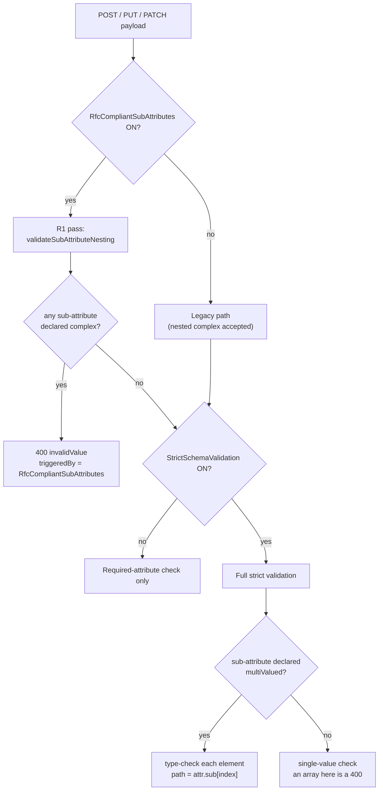
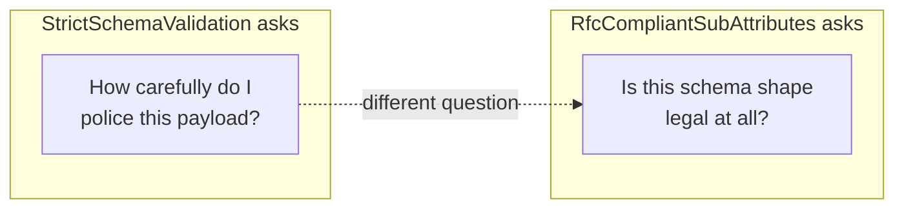

# RfcCompliantSubAttributes - RFC-Conformant Sub-Attribute Handling

**Flag:** `RfcCompliantSubAttributes` (boolean, default `false`)
**Scope:** per endpoint, via the admin API and the Settings tab
**Behavior change when off:** none for the shape this flag governs - the default preserves the existing nested-complex behavior exactly

---

## 1. Why this flag exists

SCIMServer's validator historically diverged from RFC 7643 in two opposite
directions at the same time, and both divergences live in the *sub-attribute*
layer:

1. It **accepted** a shape the RFC forbids - a complex attribute whose
   sub-attribute is itself complex.
2. It **rejected** a shape the RFC permits - a sub-attribute that is simple and
   multi-valued.

The two need opposite treatment, and conflating them was the original design
error in this flag.

**Divergence 1 is a policy tightening.** It cannot be corrected silently: an
endpoint whose custom schema already declares a nested complex sub-attribute
would start failing provisioning the moment the rule was enforced. So it ships
behind this flag, defaulting to the existing behavior, and an operator opts in
per endpoint.

**Divergence 2 was a defect, not a policy.** Strict validation honours the
`multiValued` characteristic at the attribute level and simply ignored it at the
sub-attribute level, so it rejected payloads that **conform to the schema the
server itself published** - and reported the cardinality mismatch as a type
error (`must be a string, got object`). Fixing a validator that misreads its own
schema is not something to put behind a flag, and the fix only ever accepts
more, so nothing that worked before stops working. It is therefore **base
behavior of `StrictSchemaValidation`** and is documented here only because the
two rules are so often confused.

The practical result is a flag with a contract you can state in one line:
**everything `RfcCompliantSubAttributes` does rejects something.**

The gap itself was found and documented during the sub-attribute RFC survey in
[rfcs/SCIM_SUBATTRIBUTE_TYPE_RULES.md](rfcs/SCIM_SUBATTRIBUTE_TYPE_RULES.md);
that document is the normative reference and this one is the implementation.

---

## 2. The two rules

### R1 - a complex sub-attribute is forbidden (THIS FLAG)

> A complex attribute MUST NOT contain sub-attributes that have sub-attributes
> (i.e., that are complex).
>
> - [RFC 7643 §2.3.8](rfcs/rfc7643.txt), reinforced by **erratum 8415**
>   (Verified 2025-10-28)

RFC 7644's PATCH grammar agrees independently:
`attrPath = [URI ":"] ATTRNAME *1subAttr` - the `*1` caps the path at a single
sub-attribute level, so a protocol-addressable third level cannot exist
([RFC 7644 §3.5.2](rfcs/rfc7644.txt)).

### R2 - a multi-valued SIMPLE sub-attribute is allowed (BASE BEHAVIOR, not this flag)

> ... a simple attribute, which may be singular or multi-valued ...
>
> - [RFC 7643 §1.2](rfcs/rfc7643.txt), clarified by **erratum 5607**

"Simple" and "multi-valued" are orthogonal characteristics. Only *complexity* is
capped at two levels; *cardinality* is not. A sub-attribute of type `string`
with `multiValued: true` is therefore legal and its value is an array of
primitives. RFC 9967 ships one in the wild (`securityEvents.eventUris`).

This is honoured by `StrictSchemaValidation` whenever it runs, at any setting of
`RfcCompliantSubAttributes`. Each element is type-checked individually and a bad
element is reported at its index (`licenses[0].skus[1]`), so honouring
cardinality never degrades into skipping validation.

### Combination matrix

| Sub-attribute `type` | `multiValued` | RFC 7643 | Flag OFF (default) | Flag ON |
|---|---|---|---|---|
| simple (`string`, `boolean`, `decimal`, ...) | `false` | legal | accepted | accepted |
| simple | `true` | **legal** (§1.2) | **accepted** (base behavior) | **accepted** (base behavior) |
| `complex` | `false` | **illegal** (§2.3.8) | **accepted** | **rejected** `400 invalidValue` |
| `complex` | `true` | **illegal** (§2.3.8) | accepted | **rejected** `400 invalidValue` |

Only the `complex` rows vary with the flag. That is the intended shape: the flag
is a tightening switch and nothing else.

---

## 3. Decision flow



Note that the `multiValued` branch does not consult the flag. R2 is base
behavior of strict validation.

The R1 pass runs **before** the strict branch on purpose. If it ran only inside
the lenient branch, an endpoint with strict on would still be rejected, but the
diagnostics would name `StrictSchemaValidation` as the cause - sending an
operator to a switch that does not lift the rejection. Running it first gives
one enforcement point and one correct attribution.

---

## 4. Standalone, by design



The two flags are orthogonal, which yields four supported combinations:

| Strict | Flag | Undeclared attribute | Nested complex sub-attribute | Multi-valued simple sub-attribute |
|---|---|---|---|---|
| ON | OFF | rejected | accepted | **accepted** |
| ON | ON | rejected | **rejected** | **accepted** |
| OFF | OFF | tolerated | accepted | tolerated (no type check) |
| OFF | ON | tolerated | **rejected** | tolerated (no type check) |

The last column is constant by design: it is not governed by either flag beyond
whether strict validation runs at all.

Three invariants fall out and are all asserted by tests:

- turning the flag on does **not** enable strict validation,
- turning strict off does **not** lift an R1 rejection, and
- a multi-valued simple sub-attribute is accepted at **both** flag settings.

---

## 5. Worked examples

Given a custom `User` schema that declares an illegal nested complex
sub-attribute and a legal multi-valued simple one:

```json
{
  "name": "address",
  "type": "complex",
  "multiValued": false,
  "subAttributes": [
    {
      "name": "street",
      "type": "string",
      "multiValued": false
    },
    {
      "name": "geo",
      "type": "complex",
      "multiValued": false,
      "subAttributes": [
        {
          "name": "lat",
          "type": "decimal",
          "multiValued": false
        },
        {
          "name": "lon",
          "type": "decimal",
          "multiValued": false
        }
      ]
    }
  ]
}
```

### R1 - rejected when the flag is on

```http
POST /scim/endpoints/{endpointId}/Users
Authorization: Bearer <token>
Content-Type: application/scim+json
```

```json
{
  "schemas": [
    "urn:ietf:params:scim:schemas:core:2.0:User"
  ],
  "userName": "ada@example.com",
  "displayName": "Ada Lovelace",
  "emails": [
    {
      "value": "ada@example.com",
      "type": "work"
    }
  ],
  "address": {
    "street": "1 Main St",
    "geo": {
      "lat": 47.6,
      "lon": -122.3
    }
  }
}
```

Response:

```http
HTTP/1.1 400 Bad Request
Content-Type: application/scim+json
```

```json
{
  "schemas": [
    "urn:ietf:params:scim:api:messages:2.0:Error"
  ],
  "status": "400",
  "scimType": "invalidValue",
  "detail": "Schema validation failed: address.geo: Sub-attribute 'geo' is complex, but RFC 7643 2.3.8 forbids a complex attribute from containing complex sub-attributes.",
  "urn:scimserver:api:messages:2.0:Diagnostics": {
    "errorCode": "VALIDATION_SCHEMA",
    "triggeredBy": "RfcCompliantSubAttributes",
    "attributePaths": [
      "address.geo"
    ],
    "activeConfig": {
      "StrictSchemaValidation": true,
      "RfcCompliantSubAttributes": true
    }
  }
}
```

Omitting the offending sub-attribute is accepted - the rule is about the
**payload populating** the illegal shape, so a schema can carry a legacy
declaration without every request failing.

### R2 - accepted at either flag setting

Given `licenses` (multi-valued complex) with a `skus` sub-attribute that is
`string` + `multiValued: true`:

```json
{
  "schemas": [
    "urn:ietf:params:scim:schemas:core:2.0:User"
  ],
  "userName": "grace@example.com",
  "displayName": "Grace Hopper",
  "emails": [
    {
      "value": "grace@example.com",
      "type": "work"
    }
  ],
  "licenses": [
    {
      "name": "E5",
      "skus": [
        "SKU-A",
        "SKU-B"
      ]
    }
  ]
}
```

This returns `201` and `skus` round-trips as `["SKU-A", "SKU-B"]` regardless of
the flag, because R2 is base behavior of `StrictSchemaValidation`. Before the
fix, strict validation rejected it with
`licenses[0].skus: Attribute 'skus' must be a string, got object.` - a
cardinality mismatch misreported as a type error.

Each element is still type-checked, and the failing element is named by index,
for example `licenses[0].skus[1]`. Cardinality is still enforced in the other
direction too: the schema declares `value` as singular, so
`"value": ["E5", "E3"]` remains a `400`.

---

## 6. Turning it on

### Admin API

```http
PATCH /scim/admin/endpoints/{endpointId}
Authorization: Bearer <token>
Content-Type: application/json
```

```json
{
  "profile": {
    "settings": {
      "RfcCompliantSubAttributes": true
    }
  }
}
```

### UI

Endpoint detail -> **Settings** -> **Configuration Flags** ->
`RfcCompliantSubAttributes`. The Switch is off for every existing and
newly-created endpoint.

---

## 7. Implementation

| Layer | File | Role |
|---|---|---|
| Registry | [api/src/modules/endpoint/endpoint-config.interface.ts](../api/src/modules/endpoint/endpoint-config.interface.ts) | flag constant, `boolean` type, `default: false`, description |
| Domain option | [api/src/domain/validation/validation-types.ts](../api/src/domain/validation/validation-types.ts) | `ValidationOptions.rfcCompliantSubAttributes` |
| Domain rules | [api/src/domain/validation/schema-validator.ts](../api/src/domain/validation/schema-validator.ts) | `validateSubAttributeNesting` (R1 standalone pass), `isComplexSubAttribute`, `subAttributeNestingError`. The R2 branch also lives in `validateSubAttributes` but is NOT gated on the flag |
| Users / Groups enforcement | [api/src/modules/scim/common/scim-service-helpers.ts](../api/src/modules/scim/common/scim-service-helpers.ts) | `enforceSubAttributeNesting` - the single R1 enforcement point |
| Custom resource types | [api/src/modules/scim/services/endpoint-scim-generic.service.ts](../api/src/modules/scim/services/endpoint-scim-generic.service.ts) | dynamic-URN twin of the same helper |
| UI | [web/src/pages/SettingsTab.tsx](../web/src/pages/SettingsTab.tsx) | Switch + description, `data-testid="settings-flag-RfcCompliantSubAttributes"` |

Two details are deliberate:

- **One error builder.** `SchemaValidator.subAttributeNestingError` is the only
  place the §2.3.8 message is constructed, so the standalone pass and the strict
  path cannot drift in wording or `scimType`.
- **One enforcement point per service.** `enforceSubAttributeNesting` is called
  once, before the strict branch, rather than duplicated in both branches.

---

## 8. Test coverage

| Level | File | Count |
|---|---|---|
| Unit (domain) | [api/src/domain/validation/rfc-compliant-subattributes.spec.ts](../api/src/domain/validation/rfc-compliant-subattributes.spec.ts) | 33 |
| API E2E | [api/test/e2e/rfc-compliant-subattributes.e2e-spec.ts](../api/test/e2e/rfc-compliant-subattributes.e2e-spec.ts) | 10 |
| Web unit | [web/src/pages/SettingsTab.test.tsx](../web/src/pages/SettingsTab.test.tsx) | 3 (19 in file) |
| Playwright | [web/e2e/rfc-compliant-subattributes-flag.spec.ts](../web/e2e/rfc-compliant-subattributes-flag.spec.ts) | 5 |
| Live SCIM | [scripts/live-test.ps1](../scripts/live-test.ps1) section `9z-CA` | 15 |

The R2 cases are parameterised over **every** flag setting (`absent`, `false`,
`true`) at the unit level and over both settings at the E2E and live levels, so
re-gating R2 on the flag cannot pass unnoticed. This is deliberate: the original
defect survived because each test exercised exactly one setting.

The Playwright spec asserts **outcomes**, not presence: every test drives the
real Switch and then measures either the value the server persisted or the
accept/reject decision the SCIM layer actually made. It is what caught the
misattributed `triggeredBy` described in section 3, which every API-level test
had missed because each of them exercised only one strict setting at a time.

The live-test section was verified to be a real gate by running it against an
untouched `master` build, where it fails 6 of 11 - a green section there would
have meant the assertions could not detect the feature's absence.

---

## 9. Planned evolution

> **This section is a design record.** Item 1 **shipped in v0.55.7**; items 2 and
> 3 are not live. Do not cite 2 or 3 as documentation of shipped behavior.
> Live tracking, including blocking conditions and definitions of done, is in
> [SCIM_ATTRIBUTE_VALIDATION_CONFORMANCE_ROADMAP.md](SCIM_ATTRIBUTE_VALIDATION_CONFORMANCE_ROADMAP.md).

A deeper re-reading of RFC 7643, plus a measured survey of two live estates,
produced three intended changes. The full analysis, including the evidence, is in
[rfcs/SCIM_SUBATTRIBUTE_TYPE_RULES.md](rfcs/SCIM_SUBATTRIBUTE_TYPE_RULES.md)
sections 12 to 15.

| # | Change | Status | Why |
|---|---|---|---|
| 1 | **R2 moved out of the flag into base strict validation**, so a multi-valued simple sub-attribute is accepted at either flag setting | **SHIPPED v0.55.7** | The flag was inconsistent: permissive about nesting, strict about cardinality, so it both loosened and tightened. R2 was a defect (strict honoured `multiValued` at level 1 and ignored it at level 2, rejecting schema-conformant payloads), not a policy. Measured blast radius was **0 of 2,826** declared sub-attributes, and the change only accepts more. |
| 2 | **`ON` grows from 1 rule to the full catalogue** - adds schema-definition rules D1 to D11 alongside today's P1 (not P2, which is no longer flag-gated) | planned | The flag claims RFC conformance but only checks nesting, and only at payload time. A schema that no compliant client could PATCH is currently accepted and published. |
| 3 | **The flag is renamed** | planned | `RfcCompliantSubAttributes` names only part of what it would govern - most of the new rules are *attribute* rules, not sub-attribute rules. It is set on **zero** endpoints across all three estates today, so a rename is free now and breaking later. |

Two results from the survey shaped the design and are worth carrying forward:

- A **literal** reading of section 2.3.8 ("a complex attribute has no uniqueness
or case sensitivity") would reject **our own built-in schemas**, which emit
`uniqueness: "none"` on complex attributes as a harmless default. The enforceable
rule has to target a *meaningful* value, not mere presence.
- The name-grammar rule found **two real malformed attributes** on a live
customer endpoint, named after filter expressions
(`emails[type eq "work"].primary`). Nothing else in the codebase detects this.

---

## 10. References

- [RFC 7643 §2.3.8 - Complex attributes](rfcs/rfc7643.txt)
- [RFC 7643 §1.2 - Definitions](rfcs/rfc7643.txt)
- [RFC 7644 §3.5.2 - PATCH path grammar](rfcs/rfc7644.txt)
- [SCIM_SUBATTRIBUTE_TYPE_RULES.md](rfcs/SCIM_SUBATTRIBUTE_TYPE_RULES.md) - full combination matrix, the machine-checkable rule catalogue (P1-P2, D1-D11), the measured live-estate survey, the `referenceTypes` divergence, errata and the IdP/ISV survey
- [ENDPOINT_CONFIG_FLAGS_REFERENCE.md](ENDPOINT_CONFIG_FLAGS_REFERENCE.md) - all endpoint flags
