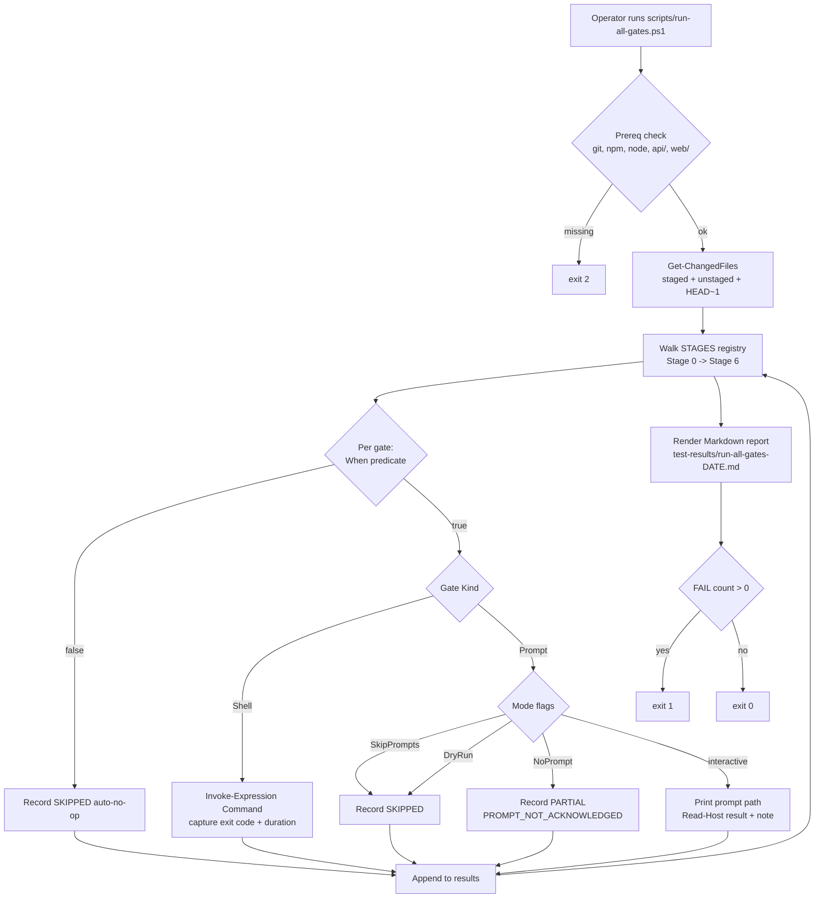

# run-all-gates.ps1 - 7-stage Mandatory Quality Gates orchestrator

**Status:** Active standing tool (2026-05-17)
**Source recommendation:** [docs/strategy/SELF_AUDIT_2026-05-16.md](strategy/SELF_AUDIT_2026-05-16.md) Section D.1
**Related:** [docs/MANDATORY_QUALITY_GATES_STRATEGY.md](MANDATORY_QUALITY_GATES_STRATEGY.md), [.github/copilot-instructions.md](../.github/copilot-instructions.md) Mandatory Quality Gates section

---

## 1. Why this exists

The first Stage X.1 self-audit found a ~25 % gate-invocation rate on the first feature commit shipped under the new strategy. Operators were skipping gates by accident: too many prompts, no single-command walker, no central scoreboard. A one-command walker that surfaces every applicable gate (and pauses on findings) drops the gap to near zero - compounding across every feature commit thereafter.

[scripts/run-all-gates.ps1](../scripts/run-all-gates.ps1) is that walker.

**Smoke-screen risk (from Section D.1):** operators could fall into the trap of "I ran the script so I'm done" without engaging with the findings. The mitigation is structural: the orchestrator pauses on every prompt-gate finding and requires explicit acknowledgment (PASS / FAIL / SKIPPED / PARTIAL + note). Operator discipline is still required; the script is the scaffold, not the substitute.

---

## 2. Architecture

Key data structures:

- **`$STAGES`** - ordered hashtable: stage name -> array of gates.
- **Gate** - hashtable with `Name`, `Kind` (Shell or Prompt), `Command` or `PromptPath`, optional `WorkDir`, optional `When` scriptblock, optional `Reason` string.
- **`$results`** - flat array of pscustomobject `{ Stage, Gate, Kind, Status, Note, Duration }` rendered into the Markdown report.

---

## 3. Per-stage gate mapping (current registry)

The registry mirrors the 7 stages in [.github/copilot-instructions.md](../.github/copilot-instructions.md) Mandatory Quality Gates section. Stage X (meta-audit) is intentionally NOT walked per-commit - it has its own 4-trigger schedule.

| Stage | Gates registered | Auto-skip-no-op |
|---|---|---|
| Stage 0 - TDD | 1 prompt (`selfImprovingTask`) | - |
| Stage 1 - Local Static | 1 prompt (`lintAndStaticAnalysis`) + 6 shell (api tsc / api lint / web tsc / web lint / web build / web size) + 2 prompts (`bundleBudgetAudit`, `prismaMigrationAudit`) | bundleBudgetAudit when `web/src/routes/` untouched; prismaMigrationAudit when `api/prisma/` untouched |
| Stage 2 - Local Tests | 4 shell (api unit / api E2E / web vitest / web coverage) + 1 prompt (`crossBackendParityAudit`) + 1 shell (`test-all-modes.ps1`) | crossBackendParityAudit when no changed api/src/ file references `isInMemoryBackend` |
| Stage 3a - Test-Completeness | 3 prompts (`addMissingTests`, `apiContractVerification`, `error-handling-verification`) | - |
| Stage 3b - Cross-Cutting | 6 prompts (`logging-verification`, `auditAgainstRFC`, `endpointConfigFlagAudit`, `securityAudit`, `dependencyCveSweep`, `performanceBenchmark`) | dependencyCveSweep when no `package*.json` change |
| Stage 3c - Code Hygiene | 2 prompts (`codeReviewSelfAudit`, `auditAndUpdateDocs`) | - |
| Stage 4 - Pipeline + Deploy | 1 prompt (`fullValidationPipeline`) + 4 shell (`full-validation-pipeline.ps1`, local node live, Docker live, dev Azure live) | - |
| Stage 5 - UI-Specific | 2 prompts (`uiTestAndValidation`, `playwrightSpecHygieneAudit`) + 1 shell (Playwright vs dev) | all 3 when no `web/` files touched |
| Stage 6 - Commit Hygiene | 4 prompts (version bump on package.json change, CHANGELOG, Session_starter, `generateCommitMessage`) | version-bump when no `package.json` changes |

Total: **39 gates** registered (5 Shell-only excluding the bundleBudget / prisma /cross-backend / version-bump conditional ones).

---

## 4. Usage

| Scenario | Command |
|---|---|
| Full walk (pre-release sanity) | `pwsh -NoProfile -File scripts/run-all-gates.ps1` |
| Fast shell-only walk (pre-push) | `pwsh -NoProfile -File scripts/run-all-gates.ps1 -SkipPrompts` |
| Preview plan (no execution) | `pwsh -NoProfile -File scripts/run-all-gates.ps1 -DryRun -SkipPrompts` |
| Iterate on Stage 1 failure | `pwsh -NoProfile -File scripts/run-all-gates.ps1 -Stage 1` |
| Stage 3a + 3b + 3c (one number) | `pwsh -NoProfile -File scripts/run-all-gates.ps1 -Stage 3` |
| Unattended CI | `pwsh -NoProfile -File scripts/run-all-gates.ps1 -NoPrompt -SkipPrompts` |
| Custom report dir | `pwsh -NoProfile -File scripts/run-all-gates.ps1 -ReportDir ./out` |

Exit codes: **0** all passed (or legitimately skipped); **1** at least one FAIL; **2** prerequisite check failed (missing `git` / `npm` / `node` / `api/` / `web/`).

The script writes a structured Markdown report to `<repo>/test-results/run-all-gates-<YYYY-MM-DD-HHmmss>.md` with one table per stage, one row per gate.

---

## 5. Auto-skip-no-op predicates

The script consults `git diff --name-only` against `--cached`, working tree, and `HEAD~1..HEAD` (unioned), so the predicates are correct both as a pre-commit and pre-push helper. If the repo is missing `git` or this is the initial commit, the predicate set is empty and all gates apply (safe default - the walker errs on the side of running more).

Five gates currently have predicates:

| Gate | Trigger | Default if no match |
|---|---|---|
| `bundleBudgetAudit` | `web/src/routes/` touched | SKIPPED auto-no-op |
| `prismaMigrationAudit` | `api/prisma/` touched | SKIPPED auto-no-op |
| `crossBackendParityAudit` | any changed `api/src/` file references `isInMemoryBackend` | SKIPPED auto-no-op |
| `dependencyCveSweep` | `package.json` or `package-lock.json` touched | SKIPPED auto-no-op |
| Stage 5 (all 3 gates) | any `web/` file touched | SKIPPED auto-no-op |
| Stage 6 version-bump | `package.json` touched | SKIPPED auto-no-op |

---

## 6. Cost vs value

| Mode | Wall time | Pre-existing alternative | Value delta |
|---|---|---|---|
| `-DryRun -SkipPrompts` | ~3 s | (none - operator memory) | Single source of truth for which gates apply to the current commit |
| `-SkipPrompts` | ~20 min (full Stage 1 + 2 + 4 shell) | Manual chain (~5 individual commands) | Removes the "I forgot to run X" failure mode + structured report for the commit message |
| full walk (interactive) | ~45-90 min (operator-paced) | Manual prompt invocation in Copilot Chat | Surfaces every prompt the strategy says applies, in the right order, with auto-skip-no-op handling - removes the ~25 % invocation gap |

**Smoke-screen cost:** the orchestrator does NOT mark a commit "safe to push." Findings still require operator engagement. The report is a scoreboard, not a stamp.

---

## 7. Contract test

[scripts/test/run-all-gates.contract.ps1](../scripts/test/run-all-gates.contract.ps1) ships alongside the orchestrator and runs ~46 assertions covering:

1. Script exists + parses without errors
2. All 4 documented parameters declared (`SkipPrompts`, `Stage`, `DryRun`, `NoPrompt`)
3. All 9 stage labels registered in the right order
4. All 9 canonical shell-gate keywords present (tsc, lint, build, size-limit, vitest, coverage, jest, test-all-modes, full-validation-pipeline)
5. All 12 canonical prompt names present
6. Exit-code contract (0 / 1 / 2)
7. Report-writing contract (test-results/ folder + `run-all-gates-` filename prefix)
8. Auto-skip-no-op references for `api/prisma/` and `isInMemoryBackend`
9. NoPrompt branches exists; PASS / FAIL / SKIPPED / PARTIAL status vocabulary present
10. Strategy doc + standing-rules file referenced inside the script

Run: `pwsh -NoProfile -File scripts/test/run-all-gates.contract.ps1` - exits 0 on pass, 1 on any contract violation. Cheap to run on every push.

---

## 8. Definition of Done

- [x] `scripts/run-all-gates.ps1` walks all 9 stage labels (Stage 0, 1, 2, 3a, 3b, 3c, 4, 5, 6) in the documented order
- [x] All 4 documented parameters work: `-SkipPrompts`, `-Stage <N>`, `-DryRun`, `-NoPrompt`
- [x] Auto-skip-no-op for 6 gates with documented triggers
- [x] Report written to `test-results/run-all-gates-<DATE>.md` with stage tables + status vocabulary
- [x] Exit codes 0 / 1 / 2 per contract
- [x] Companion `scripts/test/run-all-gates.contract.ps1` with 40+ assertions, all PASS
- [x] DryRun smoke tested - 39 gates registered, walk completes in <5 s
- [x] Linked from [docs/INDEX.md](INDEX.md) Active Documents section

---

## 9. Future evolution (Standing Backlog)

- **CI integration:** wire `-NoPrompt -SkipPrompts` into a scheduled GitHub Action so the shell gates run on every push without operator intervention; prompt gates remain operator-driven.
- **Per-gate cost metric:** record per-gate wall time across N runs and surface the median in the report so operators can see which gates are getting expensive.
- **Auto-acknowledgment for trivial prompts:** when `auditAndUpdateDocs` finds nothing to update, auto-record PASS instead of asking the operator. Requires the prompt to emit a parseable verdict line. Defer until at least one prompt opts into the contract.
- **Replace-with-prompt mode:** when running in Copilot agent mode, the orchestrator could invoke the prompt automatically (via prompt-link) instead of pausing for Read-Host. Out of scope today.
