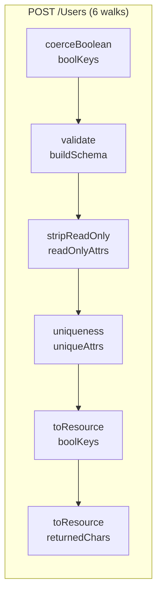
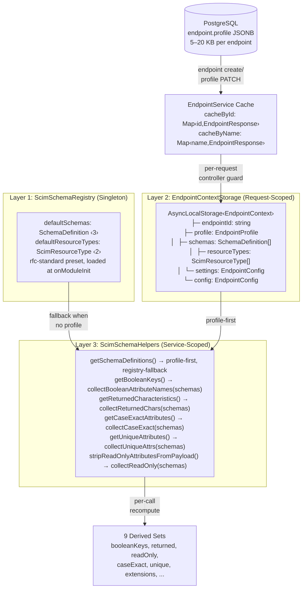
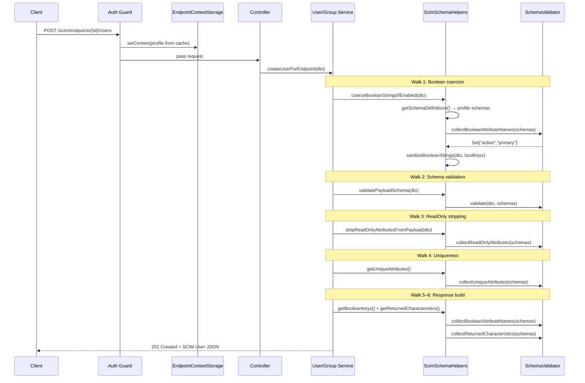

# Schema & ResourceType Runtime Data Structure Analysis

## Overview

**Feature**: Schema and ResourceType runtime storage, retrieval, and derived computation architecture  
**Version**: 0.29.0 (cache implemented 2026-03-20)  
**Status**: ✅ Implemented — Option 3 with all Parent→Children Maps  
**RFC Reference**: [RFC 7643 §2](https://datatracker.ietf.org/doc/html/rfc7643#section-2) — Attribute Characteristics, [§7](https://datatracker.ietf.org/doc/html/rfc7643#section-7) — Schema Definition  
**Related**: [ENDPOINT_PROFILE_ARCHITECTURE.md](ENDPOINT_PROFILE_ARCHITECTURE.md), [P2_ATTRIBUTE_CHARACTERISTIC_ENFORCEMENT.md](P2_ATTRIBUTE_CHARACTERISTIC_ENFORCEMENT.md)

### Problem Statement

Every SCIM request (POST, PUT, PATCH, GET, List, DELETE) must query schema definitions to enforce RFC 7643 attribute characteristics — boolean coercion, readOnly stripping, returned filtering, immutability checks, uniqueness enforcement, case-exact comparison, and schema validation. Currently, these derived sets are recomputed from the raw schema tree on every request. This document analyzes the data structures, runtime costs, storage shapes, and architectural options.

---

## 1. What's Stored vs. What's Computed

### Source of Truth (persisted)

```
┌─────────────────────────────────────────────────────────────────────┐
│  Endpoint.profile (JSONB column in PostgreSQL / in-memory map)      │
│                                                                     │
│  profile.schemas: SchemaDefinition[]                                │
│    └─ {id, name, attributes[                                        │
│         {name, type, mutability, returned, uniqueness,              │
│          caseExact, required, multiValued, subAttributes[...]}      │
│       ]}                                                            │
│                                                                     │
│  profile.resourceTypes: ScimResourceType[]                          │
│    └─ {id, name, schema, endpoint,                                  │
│        schemaExtensions[{schema, required}]}                        │
│                                                                     │
│  profile.settings: EndpointConfig                                   │
│    └─ {StrictSchemaValidation, SoftDeleteEnabled, logLevel, ...}    │
│                                                                     │
│  profile.serviceProviderConfig: ServiceProviderConfig               │
│    └─ {patch, bulk, filter, sort, etag, changePassword}             │
└─────────────────────────────────────────────────────────────────────┘
```

### Derived Sets (recomputed per-request)

```
┌─────────────────────────────────────────────────────────────────────┐
│  9 Derived Computations from schema tree                            │
│                                                                     │
│  1. booleanKeys:        Set<string>    ← collectBooleanAttrNames()  │
│  2. neverReturned:      Set<string>    ← collectReturnedChars()     │
│  3. requestReturned:    Set<string>    ← collectReturnedChars()     │
│  4. alwaysReturned:     Set<string>    ← collectReturnedChars()     │
│  5. alwaysReturnedSubs: Map<str,Set>   ← collectReturnedChars()     │
│  6. caseExactPaths:     Set<string>    ← collectCaseExactAttrs()    │
│  7. readOnlyNames:      Set<string>    ← collectReadOnlyAttrs()     │
│  8. uniqueAttrs:        Array<{...}>   ← collectUniqueAttrs()       │
│  9. extensionUrns:      string[]       ← profile.resourceTypes      │
└─────────────────────────────────────────────────────────────────────┘
```

---

## 2. Expanded Profile Sizes (Measured)

| Preset | Schemas | Attrs + SubAttrs | ResourceTypes | Expanded Profile (JSON) | DB JSONB Column |
|--------|---------|------------------|---------------|------------------------|-----------------|
| **rfc-standard** | 3 | 95 | 2 | 20,129 B | ~20 KB |
| **entra-id** | 7 | 85 | 2 | 19,285 B | ~19 KB |
| **lexmark** | 3 | 19 | 1 | 5,367 B | ~5.6 KB |
| **minimal** | 2 | 31 | 2 | 7,378 B | ~7.4 KB |

### Schema JSON Structure (abridged, entra-id User)

```json
{
  "id": "urn:ietf:params:scim:schemas:core:2.0:User",
  "name": "User",
  "attributes": [
    {
      "name": "userName",
      "type": "string",
      "mutability": "readWrite",
      "returned": "always",
      "uniqueness": "server",
      "caseExact": false,
      "required": true,
      "multiValued": false
    },
    {
      "name": "emails",
      "type": "complex",
      "multiValued": true,
      "mutability": "readWrite",
      "returned": "default",
      "subAttributes": [
        {"name": "value", "type": "string", "mutability": "readWrite", ...},
        {"name": "type", "type": "string", "mutability": "readWrite", ...},
        {"name": "primary", "type": "boolean", "mutability": "readWrite", ...}
      ]
    }
  ]
}
```

### ResourceType JSON Structure

```json
{
  "id": "User",
  "name": "User",
  "schema": "urn:ietf:params:scim:schemas:core:2.0:User",
  "endpoint": "/Users",
  "schemaExtensions": [
    {"schema": "urn:ietf:params:scim:schemas:extension:enterprise:2.0:User", "required": false},
    {"schema": "urn:msfttest:cloud:scim:schemas:extension:custom:2.0:User", "required": false}
  ]
}
```

---

## 3. Derived Set Contents (Measured)

### rfc-standard (largest schema, 95 attrs)

| Derived Set | Size | Contents |
|-------------|------|----------|
| `booleanKeys` | 2 | `{active, primary}` |
| `neverReturned` | 1 | `{password}` |
| `alwaysReturned` | 4 | `{id, username, displayname, active}` |
| `requestReturned` | 0 | `{}` |
| `caseExactPaths` | 2 | `{id, externalid}` |
| `readOnlyNames` | 5 | `{id, meta.created, meta.lastModified, meta.location, meta.version}` |
| `uniqueAttrs` | 0 | `[]` (hardcoded attrs excluded by design) |

### lexmark (smallest schema, 19 attrs)

| Derived Set | Size | Contents |
|-------------|------|----------|
| `booleanKeys` | 1 | `{active}` — **missing `primary`** |
| `neverReturned` | 2 | `{badgecode, pin}` |
| `alwaysReturned` | 2 | `{id, username}` |

### entra-id (7 schemas, 85 attrs)

| Derived Set | Size | Contents |
|-------------|------|----------|
| `booleanKeys` | 2 | `{primary, active}` |
| `neverReturned` | 1 | `{password}` |
| `alwaysReturned` | 4 | `{id, username, displayname, active}` |

---

## 4. Per-Request Computation Cost (Benchmarked)

### Individual Collector Timings (rfc-standard, 95 attrs)

| Collector | Time per Call | Complexity |
|-----------|-------------|------------|
| `collectBooleanAttributeNames()` | 2.5 µs | O(A) linear walk |
| `collectReturnedCharacteristics()` | 7.0 µs | O(A) linear walk, 4 sets built |
| `collectCaseExactAttributes()` | 7.2 µs | O(A) linear walk, path-building |
| `collectReadOnlyAttributes()` | 2.8 µs | O(A) linear walk |
| `collectUniqueAttributes()` | 1.1 µs | O(A) linear walk + skip set |
| **All 5 combined** | **19.7 µs** | |

### Collector Timings by Preset Size

| Preset | Attrs + Subs | All 5 Combined |
|--------|-------------|----------------|
| **lexmark** (19) | 19 | 7.2 µs |
| **minimal** (31) | 31 | ~11 µs |
| **entra-id** (85) | 85 | 22.5 µs |
| **rfc-standard** (95) | 95 | 19.7 µs |

### Schema Tree Walks Per Request Flow



| Flow | Tree Walks | Wall-Clock (rfc-standard) | Wall-Clock (lexmark) |
|------|-----------|--------------------------|---------------------|
| **POST** `/Users` | 6 | ~120 µs (0.12 ms) | ~43 µs |
| **PUT** `/Users/:id` | 7 | ~140 µs (0.14 ms) | ~50 µs |
| **PATCH** `/Users/:id` | 9 | ~180 µs (0.18 ms) | ~65 µs |
| **GET** `/Users/:id` | 2 | ~40 µs (0.04 ms) | ~14 µs |
| **GET** `/Users` (list) | 3 | ~60 µs (0.06 ms) | ~22 µs |
| **DELETE** `/Users/:id` | 0 | 0 µs | 0 µs |

> **Context**: A typical SCIM POST takes 2–10 ms total (DB + network). Schema overhead is 1–6% of request time.

### Walk Breakdown Per Flow

```
POST /Users:
  ├─ coerceBooleanStringsIfEnabled()     → getBooleanKeys()             [walk 1: booleanNames]
  ├─ validatePayloadSchema()             → buildSchemaDefinitions()     [walk 2: full validate]
  ├─ stripReadOnlyAttributesFromPayload()→ collectReadOnlyAttributes()  [walk 3: readOnly]
  ├─ assertSchemaUniqueness()            → collectUniqueAttributes()    [walk 4: unique]
  └─ toScimUserResource()               → getBooleanKeys()             [walk 5: booleanNames]
                                         → getReturnedCharacteristics() [walk 6: returned]

PATCH /Users/:id:
  ├─ stripReadOnlyFromPatchOps()         → collectReadOnlyAttributes()  [walk 1]
  ├─ sanitizeBooleanStrings(op.value)    → getBooleanKeys()             [walk 2]
  ├─ validatePatchOperationValue()       → buildSchemaDefinitions()     [walk 3]
  ├─ coerceBooleanStringsIfEnabled()     → getBooleanKeys()             [walk 4]
  ├─ validatePayloadSchema()             → buildSchemaDefinitions()     [walk 5]
  ├─ checkImmutableAttributes()          → buildSchemaDefinitions()     [walk 6]
  ├─ assertSchemaUniqueness()            → collectUniqueAttributes()    [walk 7]
  └─ toScimUserResource()               → getBooleanKeys()             [walk 8]
                                         → getReturnedCharacteristics() [walk 9]
```

---

## 5. Runtime Architecture (Current)

### Storage Layers



### Request Lifecycle



---

## 6. Data Structure Options

### Option 1: Current — Raw Schema Tree + On-Demand Recomputation

**Structure:**
```typescript
// Profile (stored in DB + endpoint cache + request context)
interface EndpointProfile {
  schemas: SchemaDefinition[];       // nested attribute tree
  resourceTypes: ScimResourceType[];
  settings: Record<string, string>;
  serviceProviderConfig?: object;
}

// Every request: walk the tree N times
getBooleanKeys()  → Set<string>   // walk all attrs
getReturnedChars()→ {never,request,always,alwaysSubs}  // walk all attrs
// ... 9 total walks
```

**Memory layout per endpoint in cache:**
```
EndpointResponse {
  id: "f265bbb8-..." (36 B)
  name: "Lexmark-ISV-1" (13 B)
  profile: {
    schemas: [...] (5,367 B for lexmark / 20,129 B for rfc-standard)
    resourceTypes: [...] (326 B for lexmark / 735 B for entra-id)
    settings: {...} (200 B typical)
  }
  total: ~6 KB (lexmark) / ~21 KB (rfc-standard) per cached endpoint
}
```

| Metric | Value |
|--------|-------|
| Memory per endpoint | 6–21 KB |
| Memory 100 endpoints | 0.6–2.1 MB |
| Per-request CPU | 40–180 µs (2–9 tree walks) |
| Cache invalidation | None needed |
| Code complexity | Low |

---

### Option 2: Flattened Attribute Map

**Structure:**
```typescript
interface AttributeDescriptor {
  path: string;           // "emails.primary", "active"
  name: string;           // "primary", "active"
  type: string;           // "string" | "boolean" | "complex"
  mutability: string;     // "readOnly" | "readWrite" | "writeOnly" | "immutable"
  returned: string;       // "always" | "default" | "request" | "never"
  uniqueness: string;     // "none" | "server" | "global"
  caseExact: boolean;
  required: boolean;
  multiValued: boolean;
  isSubAttribute: boolean;
  parentPath?: string;    // "emails" for "emails.primary"
  schemaUrn: string;      // owning schema URN
}

// Per endpoint:
attributeMap: Map<string, AttributeDescriptor>  // path → descriptor
// key = "active", "emails.primary", "name.givenname", "urn:ext:2.0:User.costcenter"
```

**Example map entries (entra-id User, partial):**
```
"id"                    → {name:"id", type:"string", mutability:"readOnly", returned:"always", uniqueness:"server", ...}
"username"              → {name:"userName", type:"string", mutability:"readWrite", returned:"always", uniqueness:"server", ...}
"active"                → {name:"active", type:"boolean", mutability:"readWrite", returned:"always", ...}
"emails.primary"        → {name:"primary", type:"boolean", mutability:"readWrite", returned:"default", isSubAttribute:true, parentPath:"emails", ...}
"emails.value"          → {name:"value", type:"string", mutability:"readWrite", returned:"default", isSubAttribute:true, parentPath:"emails", ...}
"roles.primary"         → {name:"primary", type:"boolean", mutability:"readWrite", returned:"default", isSubAttribute:true, parentPath:"roles", ...}
"urn:...:2.0:User.department" → {name:"department", type:"string", schemaUrn:"urn:...:enterprise:2.0:User", ...}
```

**Derived sets become filter operations:**
```typescript
booleanKeys    = new Set([...map.values()].filter(d => d.type === 'boolean').map(d => d.name.toLowerCase()))
neverReturned  = new Set([...map.values()].filter(d => d.returned === 'never').map(d => d.name.toLowerCase()))
readOnlyAttrs  = new Set([...map.values()].filter(d => d.mutability === 'readOnly').map(d => d.name.toLowerCase()))
alwaysReturned = new Set([...map.values()].filter(d => d.returned === 'always').map(d => d.name.toLowerCase()))
```

| Metric | Value |
|--------|-------|
| Memory per endpoint | 12–42 KB (raw tree + flat map) |
| Memory 100 endpoints | 1.2–4.2 MB |
| Per-request CPU | ~5 µs (filter over flat array) |
| Cache invalidation | Rebuild map on profile PATCH |
| Code complexity | Medium (flatten logic, URN-path encoding) |

**Flat map size estimate** (rfc-standard, 95 attrs+subs):
```
95 entries × ~120 bytes/entry ≈ 11,400 bytes (~11 KB)
+ raw tree for /Schemas discovery = 20,129 bytes
Total = ~31 KB per endpoint
```

---

### Option 3: Precomputed Characteristic Sets Cache

**Structure:**
```typescript
interface SchemaCharacteristicsCache {
  booleanKeys: Set<string>;                           // {"active", "primary"}
  neverReturned: Set<string>;                         // {"password"}
  requestReturned: Set<string>;                       // {}
  alwaysReturned: Set<string>;                        // {"id","username","displayname","active"}
  alwaysReturnedSubs: Map<string, Set<string>>;       // meta → {"resourcetype","created",...}
  caseExactPaths: Set<string>;                        // {"id","externalid"}
  readOnlyNames: Set<string>;                         // {"id","meta.created",...}
  uniqueAttrs: Array<{schemaUrn:string|null, attrName:string, caseExact:boolean}>;
  extensionUrns: readonly string[];                   // ["urn:...:enterprise:2.0:User"]
}

// Stored alongside profile in endpoint cache:
interface CachedEndpoint extends EndpointResponse {
  _schemaCache?: SchemaCharacteristicsCache;  // built lazily on first access
}
```

**Example cache instance (rfc-standard):**
```json
{
  "booleanKeys": ["active", "primary"],
  "neverReturned": ["password"],
  "requestReturned": [],
  "alwaysReturned": ["id", "username", "displayname", "active"],
  "alwaysReturnedSubs": {"meta": ["resourcetype", "created", "lastmodified", "location", "version"]},
  "caseExactPaths": ["id", "externalid"],
  "readOnlyNames": ["id", "meta"],
  "uniqueAttrs": [],
  "extensionUrns": ["urn:ietf:params:scim:schemas:extension:enterprise:2.0:User"]
}
```

**Cache size estimate:**
```
9 Sets/Maps with ~5-10 string entries each
≈ 9 × (overhead:64B + entries:10×40B) ≈ 4,200 bytes (~4 KB)
+ raw tree for /Schemas discovery retained
Total = raw tree + 4 KB per endpoint
```

| Metric | Value |
|--------|-------|
| Memory per endpoint | 10–25 KB (raw tree + ~4 KB cache) |
| Memory 100 endpoints | 1.0–2.5 MB |
| Per-request CPU | **0 µs** (precomputed, O(1) `.has()`) |
| Cache invalidation | Rebuild on profile PATCH (one 20µs pass) |
| Code complexity | Low–Medium (build function + lazy init) |

---

### Option 4: Composite Schema Index

**Structure:**
```typescript
interface SchemaIndex {
  // Raw data (for /Schemas, /ResourceTypes discovery)
  schemas: SchemaDefinition[];
  resourceTypes: ScimResourceType[];
  
  // Indexed by URN
  schemasByUrn: Map<string, SchemaDefinition>;
  resourceTypesByName: Map<string, ScimResourceType>;
  
  // Indexed by attribute name (for path resolution)
  attributesByName: Map<string, AttributeDescriptor[]>;  // name → all attrs with that name
  attributesByPath: Map<string, AttributeDescriptor>;     // dotted path → single descriptor
  
  // Precomputed characteristic sets
  characteristics: SchemaCharacteristicsCache;
  
  // Extension mapping
  extensionUrnSet: Set<string>;
  coreSchemaUrn: string;
}
```

| Metric | Value |
|--------|-------|
| Memory per endpoint | 25–55 KB (all indexes) |
| Memory 100 endpoints | 2.5–5.5 MB |
| Per-request CPU | **0 µs** (everything precomputed/indexed) |
| Cache invalidation | Full rebuild on profile PATCH |
| Code complexity | High (large API surface, many Maps) |

---

### Option 5: Normalized Attribute Records

**Structure:**
```typescript
interface AttributeRecord {
  schemaUrn: string;
  parentAttrName: string | null;   // null for top-level
  name: string;
  type: 'string' | 'boolean' | 'complex' | 'integer' | 'decimal' | 'dateTime' | 'reference' | 'binary';
  mutability: 'readOnly' | 'readWrite' | 'writeOnly' | 'immutable';
  returned: 'always' | 'default' | 'request' | 'never';
  uniqueness: 'none' | 'server' | 'global';
  caseExact: boolean;
  required: boolean;
  multiValued: boolean;
}

// Flat array stored per endpoint:
attributes: AttributeRecord[]
```

**Example records (emails.primary + active):**
```json
[
  {"schemaUrn": "urn:...:core:2.0:User", "parentAttrName": null,     "name": "active",  "type": "boolean", "returned": "always",  ...},
  {"schemaUrn": "urn:...:core:2.0:User", "parentAttrName": "emails", "name": "primary", "type": "boolean", "returned": "default", ...},
  {"schemaUrn": "urn:...:core:2.0:User", "parentAttrName": "emails", "name": "value",   "type": "string",  "returned": "default", ...}
]
```

| Metric | Value |
|--------|-------|
| Memory per endpoint | 12–25 KB (flat array + raw tree for discovery) |
| Memory 100 endpoints | 1.2–2.5 MB |
| Per-request CPU | ~8 µs (`.filter()` on flat array, no recursion) |
| Cache invalidation | Rebuild array from raw tree on profile PATCH |
| Code complexity | Medium (flatten/reconstruct logic) |

---

### Option 6: Lazy-Memoized Accessors

**Structure:** Same as current (raw tree), but cache results:

```typescript
class ScimSchemaHelpers {
  private _memoCache = new Map<string, Map<string, unknown>>();
  // key = endpointId, value = Map of "boolKeys" → Set, "returned" → {...}, etc.
  
  getBooleanKeys(endpointId?: string): Set<string> {
    const epKey = endpointId ?? '__global__';
    let epCache = this._memoCache.get(epKey);
    if (!epCache) { epCache = new Map(); this._memoCache.set(epKey, epCache); }
    
    let result = epCache.get('boolKeys') as Set<string> | undefined;
    if (!result) {
      const schemas = this.getSchemaDefinitions(endpointId);
      result = SchemaValidator.collectBooleanAttributeNames(schemas);
      epCache.set('boolKeys', result);
    }
    return result;
  }
  
  invalidateCache(endpointId: string): void {
    this._memoCache.delete(endpointId);
  }
}
```

| Metric | Value |
|--------|-------|
| Memory per endpoint | 6–21 KB (raw) + ~4 KB (memoized sets) |
| Memory 100 endpoints | 1.0–2.5 MB |
| Per-request CPU | 0 µs (after first request); 20 µs (first request only) |
| Cache invalidation | `invalidateCache(endpointId)` on profile PATCH / hot-reload |
| Code complexity | **Lowest** (add memo layer to existing methods) |

---

## 7. Comparison Matrix


| Option | Memory / EP | Request CPU | Code Δ | Invalidation | Discovery API | Best For |
|--------|------------|-------------|--------|--------------|---------------|----------|
| **1. Current** | 6–21 KB | 40–180 µs | 0 | None | Direct | Simplicity |
| **2. Flat Map** | 12–42 KB | ~5 µs | Medium | Rebuild map | Need raw tree | Path-qualified queries |
| **3. Precomputed Sets** | 10–25 KB | **0 µs** | Low-Med | Rebuild cache | Direct + cache | **Recommended next** |
| **4. Composite Index** | 25–55 KB | **0 µs** | High | Full rebuild | Embedded | Large-scale SaaS |
| **5. Normalized Records** | 12–25 KB | ~8 µs | Medium | Rebuild array | Reconstruct tree | SQL-aligned storage |
| **6. Lazy Memo** | 10–25 KB | 0 µs* | **Lowest** | Invalidate key | Direct | **Quickest improvement** |

\* After first access per endpoint; first access = one 20 µs pass.

---

## 8. Industry Norms for SCIM Servers

### How Production SCIM Servers Handle Schema Storage

| Server | Schema Storage | Derived Computation | Cache Strategy |
|--------|---------------|--------------------|--------------------|
| **Microsoft SCIM Reference (C#)** | Hardcoded C# classes, no JSON tree | Compile-time — attributes are class properties | None needed (static) |
| **PingIdentity SCIM SDK (Java)** | Schema loaded from JSON at startup | Precomputed attribute maps at init | Immutable after init |
| **Okta SCIM Server** | Schema defined in YAML, compiled to objects | Attribute registry pattern — flat lookup | Startup-only computation |
| **UnboundID SCIM 2 SDK** | `ResourceTypeDefinition` with attribute maps | `AttributeDefinition` objects indexed by name | Immutable + indexed |
| **AWS SSO SCIM** | Fixed schema, no custom extensions | Hardcoded behavior per attribute | No dynamic schemas |
| **OneLogin SCIM Bridge** | JSON schema loaded at startup | Flat attribute registry | Cached, never changes |

**Common patterns:**

1. **Schema is loaded once** (startup or tenant creation), not re-parsed per request
2. **Attribute lookups are O(1)** via maps or class property access
3. **Multi-tenant servers** cache per-tenant schema metadata in memory
4. **Derived characteristics** (boolean set, readOnly set, etc.) are precomputed, not scanned per request
5. **Discovery endpoints** (`/Schemas`, `/ResourceTypes`) serve from the same precomputed structure

### Our gap vs. industry norm

- We load at create/PATCH ✅ but **recompute derived sets per-request** ❌
- Industry norm: **compute once at load, cache forever (until schema changes)**
- The 40–180 µs overhead is small in absolute terms but accumulates under load and is architecturally unnecessary

---

## 9. Recommendation

### Immediate (v0.29.x)

**Option 6 (Lazy Memo)** — smallest change, biggest ROI:
- Add memoization to `getBooleanKeys()`, `getReturnedCharacteristics()`, and other accessor methods in `ScimSchemaHelpers`
- Keyed by endpointId (from `EndpointContextStorage`)
- Invalidate on profile PATCH and hot-reload
- Eliminates 2–9 redundant tree walks per request
- ~20 lines of code change

### Medium-term (v0.30+)

**Option 3 (Precomputed Sets Cache)** — build `SchemaCharacteristicsCache` at profile load:
- Single-pass build function computes all 9 derived sets in one tree walk (~20 µs)
- Attach to `EndpointProfile._cache` or alongside in endpoint cache
- Zero per-request CPU for all schema characteristic lookups
- Rebuild on profile PATCH / endpoint create / preset hot-reload
- Align with industry norm of "compute once, serve forever"

### Long-term (if needed)

**Option 4 (Composite Index)** — only if we add path-qualified attribute queries, per-attribute access control, or attribute-level audit logging that needs O(1) path→descriptor lookup.

---

## 10. Appendix: DB Column Values

### PostgreSQL `endpoint.profile` JSONB Column

The `profile` column in the `Endpoint` table stores the full expanded profile:

```sql
SELECT id, name, 
       length(profile::text) as profile_bytes,
       jsonb_array_length(profile->'schemas') as schema_count,
       jsonb_array_length(profile->'resourceTypes') as rt_count
FROM "Endpoint";
```

| Endpoint | profile_bytes | schema_count | rt_count |
|----------|--------------|--------------|----------|
| Lexmark-ISV-1 | 5,626 | 3 | 1 |
| Sagar-ISV-1 | ~19,500 | 7 | 2 |

### In-Memory Cache (InMemory backend)

```typescript
// EndpointService cache
cacheById: Map<string, EndpointResponse>   // endpointId → full response w/ profile
cacheByName: Map<string, EndpointResponse> // endpointName → same object ref

// Each cached endpoint holds profile.schemas as JS objects (~20 KB heap per entra-id endpoint)
// With 10 endpoints: ~200 KB heap for schema data
// With 100 endpoints: ~2 MB heap for schema data
```

### Profile JSONB Update (PATCH settings)

```sql
UPDATE "Endpoint"
SET profile = jsonb_set(profile, '{settings}', '{"logLevel":"DEBUG"}'::jsonb)
WHERE id = 'f265bbb8-...'
```

> Only `settings` is deep-merged on PATCH. Schemas/resourceTypes are replaced wholesale on profile PATCH (rare operation — admin only).
