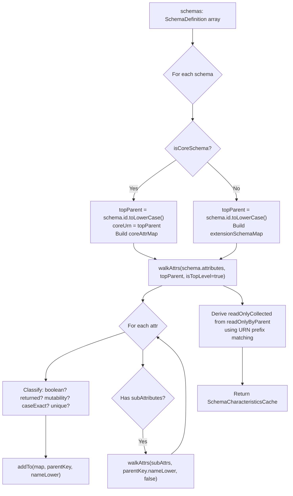
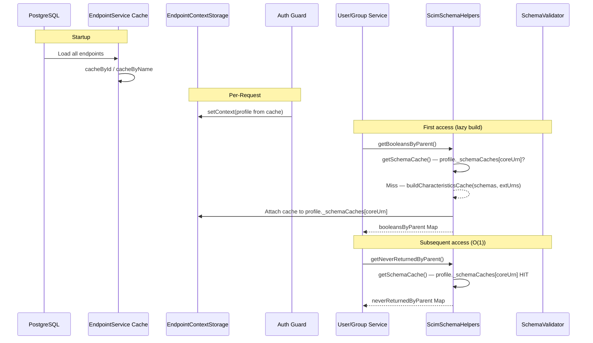

# Schema & ResourceType Runtime Data Structure Analysis

## Overview

**Feature**: Schema and ResourceType runtime storage, retrieval, and derived computation architecture  
**Version**: 0.31.0 (URN dot-path cache, 2026-03-30)  
**Status**: ✅ Implemented — URN-qualified dot-path cache with zero-collision keying  
**RFC Reference**: [RFC 7643 §2](https://datatracker.ietf.org/doc/html/rfc7643#section-2) — Attribute Characteristics, [§7](https://datatracker.ietf.org/doc/html/rfc7643#section-7) — Schema Definition  
**Related**: [ENDPOINT_PROFILE_ARCHITECTURE.md](ENDPOINT_PROFILE_ARCHITECTURE.md), [P2_ATTRIBUTE_CHARACTERISTIC_ENFORCEMENT.md](P2_ATTRIBUTE_CHARACTERISTIC_ENFORCEMENT.md)

### Evolution

| Version | Key Change |
|---------|-----------|
| v0.28.x | Raw schema tree — 2–9 tree walks per request, ~40–180 µs overhead |
| v0.29.0 | `SchemaCharacteristicsCache` with `__top__` sentinel — zero per-request tree walks |
| v0.30.0 | Pre-flattened returned Sets, sub-attr collision maps, caseExact-aware sorting |
| **v0.31.0** | **URN-qualified dot-path keys** — eliminates `__top__` sentinel, zero-collision at any nesting depth |

---

## 1. Architecture Overview

### Source of Truth (persisted)

```
┌─────────────────────────────────────────────────────────────────────┐
│  Endpoint.profile (JSONB column in PostgreSQL / in-memory map)      │
│                                                                     │
│  profile.schemas: SchemaDefinition[]                                │
│    └─ {id, name, attributes[                                        │
│         {name, type, mutability, returned, uniqueness,              │
│          caseExact, required, multiValued, subAttributes[...]}      │
│       ]}                                                            │
│                                                                     │
│  profile.resourceTypes: ScimResourceType[]                          │
│    └─ {id, name, schema, endpoint,                                  │
│        schemaExtensions[{schema, required}]}                        │
│                                                                     │
│  profile.settings: EndpointConfig                                   │
│    └─ {StrictSchemaValidation, SoftDeleteEnabled, logLevel, ...}    │
│                                                                     │
│  profile.serviceProviderConfig: ServiceProviderConfig               │
│    └─ {patch, bulk, filter, sort, etag, changePassword}             │
└─────────────────────────────────────────────────────────────────────┘
```

### Precomputed Cache (built once per profile load)

```
┌───────────────────────────────────────────────────────────────────────────┐
│  SchemaCharacteristicsCache (15 fields)                                   │
│                                                                           │
│  ─── URN-dot-path keyed maps (7) ───                                      │
│  booleansByParent:          Map<urn-dot-path, Set<attrName>>              │
│  neverReturnedByParent:     Map<urn-dot-path, Set<attrName>>              │
│  alwaysReturnedByParent:    Map<urn-dot-path, Set<attrName>>              │
│  requestReturnedByParent:   Map<urn-dot-path, Set<attrName>>              │
│  immutableByParent:         Map<urn-dot-path, Set<attrName>>              │
│  caseExactByParent:         Map<urn-dot-path, Set<attrName>>              │
│  readOnlyByParent:          Map<urn-dot-path, Set<attrName>>              │
│                                                                           │
│  ─── Convenience fields (5) ───                                           │
│  caseExactPaths:            Set<string>  (bare dotted paths for filters)  │
│  uniqueAttrs:               Array<{schemaUrn, attrName, caseExact}>       │
│  extensionUrns:             readonly string[]                             │
│  coreSchemaUrn:             string   (lowercase core schema URN)          │
│  schemaUrnSet:              ReadonlySet<string>  (all schema URNs)        │
│                                                                           │
│  ─── Precomputed lookups (2) ───                                          │
│  coreAttrMap:               Map<lowername, SchemaAttributeDefinition>     │
│  extensionSchemaMap:        Map<URN, SchemaDefinition>                    │
│                                                                           │
│  ─── Derived readOnly shape (1) ───                                       │
│  readOnlyCollected:         {core, extensions, coreSubAttrs, extSubAttrs} │
└───────────────────────────────────────────────────────────────────────────┘
```

---

## 2. URN Dot-Path Key Convention

### Key Format

Every `*ByParent` map uses **URN-qualified dot-path keys** (lowercase). The key encodes the full schema + attribute ancestry:

```
Top-level core attrs:       urn:ietf:params:scim:schemas:core:2.0:user
Top-level extension attrs:  urn:ietf:params:scim:schemas:extension:enterprise:2.0:user
Core sub-attrs:             urn:ietf:params:scim:schemas:core:2.0:user.emails
Extension sub-attrs:        urn:ietf:params:scim:schemas:extension:enterprise:2.0:user.manager
Deeper nesting:             urn:ietf:params:scim:schemas:core:2.0:user.name.honorificprefix
```

### Key Classification: `isSubAttrKey()`

```typescript
function isSubAttrKey(key: string): boolean {
  const lastColon = key.lastIndexOf(':');
  return key.indexOf('.', lastColon) !== -1;
}
```

A key is a **sub-attr key** iff it has a `.` AFTER the last `:`. This correctly handles URNs with dots in version numbers (e.g., `urn:...:2.0:User` — the `.` in `2.0` is before the last `:`).

| Key | `isSubAttrKey` | Classification |
|-----|---------------|----------------|
| `urn:...:core:2.0:user` | `false` | Top-level (core attrs) |
| `urn:...:enterprise:2.0:user` | `false` | Top-level (extension attrs) |
| `urn:...:core:2.0:user.emails` | `true` | Sub-attrs of `emails` in core |
| `urn:...:enterprise:2.0:user.manager` | `true` | Sub-attrs of `manager` in extension |
| `urn:...:core:2.0:user.name.honorific` | `true` | Deeply nested sub-attrs |

### Why Not `__top__` (Previous Design)

The previous design used `__top__` as a sentinel key for core top-level attributes, plain attribute names (e.g., `emails`) for sub-attrs, and extension URNs for extension top-level. This had a **name-collision vulnerability**:

```
Old keys:                          Collision scenario:
  __top__     → {active}           Core emails.primary (boolean)
  emails      → {primary}          Extension emails.primary (string)
  urn:ext:... → {department}       ↑ Both land under key "emails" — COLLISION
```

With URN dot-path keys, the same scenario is unambiguous:

```
New keys:
  urn:...:core:2.0:user          → {active}
  urn:...:core:2.0:user.emails   → {primary}     ← core emails sub-attrs
  urn:...:ext:2.0:user.emails    → {}             ← extension emails sub-attrs (different set)
```

---

## 3. Cache Example (rfc-standard, Entra ID style)

### Payload Trace

Given this SCIM payload:

```json
{
  "userName": "john@contoso.com",
  "active": "True",
  "emails": [{ "value": "john@contoso.com", "primary": "True" }],
  "urn:ietf:params:scim:schemas:extension:enterprise:2.0:User": {
    "department": "Engineering",
    "manager": { "value": "mgr-id-123", "displayName": "Jane" }
  }
}
```

### `booleansByParent` Map

```
urn:ietf:params:scim:schemas:core:2.0:user          → {active}
urn:ietf:params:scim:schemas:core:2.0:user.emails   → {primary}
urn:ietf:params:scim:schemas:core:2.0:user.roles    → {primary}
```

### Runtime Walk (`sanitizeBooleanStringsByParent`)

| Step | Key in payload | parentPath | Lookup | Match? | Action |
|------|---------------|------------|--------|--------|--------|
| 1 | root object | `urn:...:core:2.0:user` | booleans@`urn:...:user` | — | — |
| 2 | `"active": "True"` | `urn:...:core:2.0:user` | `active` ∈ `{active}`? | YES | `→ true` |
| 3 | `"emails": [...]` | recurse with `urn:...:user.emails` | — | — | — |
| 4 | `"primary": "True"` | `urn:...:core:2.0:user.emails` | `primary` ∈ `{primary}`? | YES | `→ true` |
| 5 | `"urn:...:enterprise"` | key starts with `urn:` → switch | `urn:...:enterprise:...` | — | — |
| 6 | `"department"` | `urn:...:enterprise:2.0:user` | booleans@`urn:...:ent` | ∅ | skip |
| 7 | `"manager": {...}` | recurse with `urn:...:enterprise:2.0:user.manager` | — | — | — |
| 8 | `"value": "mgr-id"` | `urn:...:enterprise:2.0:user.manager` | booleans@...manager | ∅ | skip |

### Other Maps (same key structure)

| Map | Key | Value Set |
|-----|-----|-----------|
| `neverReturnedByParent` | `urn:...:core:2.0:user` | `{password}` |
| `alwaysReturnedByParent` | `urn:...:core:2.0:user` | `{id, username, active}` |
| `readOnlyByParent` | `urn:...:core:2.0:user` | `{id, meta}` |
| `readOnlyByParent` | `urn:...:core:2.0:user.meta` | `{resourcetype, created, lastmodified, location, version}` |
| `readOnlyByParent` | `urn:...:enterprise:2.0:user.manager` | `{$ref, displayname}` |
| `immutableByParent` | `urn:...:core:2.0:user` | `{title}` |
| `caseExactByParent` | `urn:...:core:2.0:user` | `{id}` |
| `caseExactByParent` | `urn:...:core:2.0:user.meta` | `{location}` |

### Metadata Fields

| Field | Value |
|-------|-------|
| `coreSchemaUrn` | `urn:ietf:params:scim:schemas:core:2.0:user` |
| `schemaUrnSet` | `{urn:...:core:2.0:user, urn:...:enterprise:2.0:user}` |
| `extensionUrns` | `['urn:ietf:params:scim:schemas:extension:enterprise:2.0:User']` |
| `caseExactPaths` | `{id, meta.location}` (bare dotted paths for filter evaluator) |

---

## 4. Build Process

### `SchemaValidator.buildCharacteristicsCache(schemas, extensionUrns)`

Single tree walk, ~25 µs for 95 attributes. Called once at:
- Endpoint create
- Profile PATCH
- Lazy fallback on first request if cache is missing



### `readOnlyCollected` Derivation

The `readOnlyCollected` structured shape is derived from `readOnlyByParent` by URN prefix matching:

```
readOnlyByParent key                              → readOnlyCollected field
──────────────────────────────────────────────────  ──────────────────────────
key === coreUrn                                    → core: Set<string>
key ∈ extUrnLowerSet                               → extensions: Map<urn, Set>
key.startsWith(coreUrn + '.')                      → coreSubAttrs: Map<attrName, Set>
key.startsWith(extUrn + '.')                       → extensionSubAttrs: Map<urn, Map<attrName, Set>>
```

---

## 5. Runtime Architecture

### Cache Lifecycle



### Request Flow (POST /Users)

```
POST /scim/endpoints/{id}/Users

  1. Auth Guard → setContext(profile)
  2. Controller → createUserForEndpoint(dto)
  3. coerceBooleansByParentIfEnabled(dto)
     └─ cache.booleansByParent + cache.coreSchemaUrn
     └─ sanitizeBooleanStringsByParent(dto, boolMap, coreUrn)     [O(1) lookup]
  4. validatePayloadSchema(dto)
     └─ cache.coreAttrMap + cache.extensionSchemaMap               [O(1) lookup]
  5. stripReadOnlyAttributesFromPayload(dto)
     └─ cache.readOnlyCollected                                    [O(1) lookup]
  6. assertSchemaUniqueness(dto)
     └─ cache.uniqueAttrs                                          [O(1) lookup]
  7. toScimUserResource(dbRecord)
     └─ sanitizeBooleanStringsByParent(rawPayload, boolMap, coreUrn)
     └─ neverByParent.get(coreUrn) → strip core never-returned
     └─ neverByParent.get(urn.ext) → strip extension never-returned
     └─ neverByParent.get(coreUrn.attrName) → strip sub-attr never-returned
  8. Controller → applyAttributeProjection(resource, attrs, excluded,
                    alwaysReturnedByParent, requestReturnedByParent)
```

**All 8 steps read from precomputed cache — zero tree walks per request.**

---

## 6. `SchemaCharacteristicsCache` Interface

```typescript
interface SchemaCharacteristicsCache {
  // ─── URN-dot-path keyed maps ───
  booleansByParent:          Map<string, Set<string>>;  // boolean-typed attrs
  neverReturnedByParent:     Map<string, Set<string>>;  // returned:never or writeOnly
  alwaysReturnedByParent:    Map<string, Set<string>>;  // returned:always
  requestReturnedByParent:   Map<string, Set<string>>;  // returned:request
  immutableByParent:         Map<string, Set<string>>;  // mutability:immutable
  caseExactByParent:         Map<string, Set<string>>;  // caseExact:true
  readOnlyByParent:          Map<string, Set<string>>;  // mutability:readOnly

  // ─── Convenience / pre-flattened ───
  caseExactPaths:  Set<string>;                           // bare dotted paths for filter eval
  uniqueAttrs:     Array<{schemaUrn, attrName, caseExact}>; // uniqueness:server attrs
  extensionUrns:   readonly string[];                     // extension URNs from resource types
  coreSchemaUrn:   string;                                // lowercase core schema URN
  schemaUrnSet:    ReadonlySet<string>;                   // all schema URNs in the cache

  // ─── Precomputed attribute lookups ───
  coreAttrMap:        Map<string, SchemaAttributeDefinition>;  // for validator
  extensionSchemaMap: Map<string, SchemaDefinition>;           // for validator

  // ─── Derived readOnly shape ───
  readOnlyCollected: {
    core:              Set<string>;                        // core top-level readOnly attrs
    extensions:        Map<string, Set<string>>;           // ext URN → readOnly attrs
    coreSubAttrs:      Map<string, Set<string>>;           // attrName → readOnly sub-attrs
    extensionSubAttrs: Map<string, Map<string, Set<string>>>; // ext → attr → readOnly sub-attrs
  };
}
```

### Field Count by Category

| Category | Fields | Total Map Entries (rfc-standard, 95 attrs) |
|----------|--------|--------------------------------------------|
| Characteristic maps | 7 | ~15 entries across all maps |
| Convenience fields | 5 | 2–4 entries each |
| Attribute lookups | 2 | ~95 entries (coreAttrMap) + 1–5 (extensionSchemaMap) |
| ReadOnly derived | 1 (4 sub-fields) | ~7 entries |
| **Total** | **15** | ~120 entries |

---

## 7. Consumer Patterns

### Pattern 1: Direct cache map lookup (services)

```typescript
// Get map from cache
const neverByParent = this.schemaHelpers.getNeverReturnedByParent(endpointId);
const coreUrnLower = this.schemaHelpers.getCoreSchemaUrnLower(endpointId);

// Core top-level lookup
const coreNever = neverByParent.get(coreUrnLower);  // O(1)

// Core sub-attr lookup
const subNever = neverByParent.get(`${coreUrnLower}.${key.toLowerCase()}`);  // O(1)

// Extension top-level lookup
const extNever = neverByParent.get(urnLower);  // O(1)

// Extension sub-attr lookup
const extSubNever = neverByParent.get(`${urnLower}.${extKey.toLowerCase()}`);  // O(1)
```

### Pattern 2: Recursive walk with parentPath (sanitize booleans)

```typescript
sanitizeBooleanStringsByParent(obj, boolMap, parentPath = coreSchemaUrn);

// Inside the walker:
for (const [key, value] of Object.entries(obj)) {
  const keyLower = key.toLowerCase();
  // URN key → switch namespace; otherwise append to path
  const childPath = keyLower.startsWith('urn:') ? keyLower : `${parentPath}.${keyLower}`;
  // recurse with childPath...
}
```

### Pattern 3: Projection — extract attr-name-keyed lookup from URN-dot-path map

```typescript
// In stripRequestOnlyAttrs / stripReturnedNever / includeOnly:
const subReqByAttrName = new Map<string, Set<string>>();
for (const [parent, children] of requestByParent) {
  if (isSubAttrKey(parent)) {
    const attrName = parent.substring(parent.lastIndexOf('.') + 1);
    subReqByAttrName.set(attrName, children);
  }
}
// Then: subReqByAttrName.get('emails') → Set of request-only sub-attr names
```

---

## 8. Memory & Performance

### Cache Size (measured)

| Preset | Attrs + Subs | Raw Profile | Cache Overhead | Total |
|--------|-------------|-------------|----------------|-------|
| **rfc-standard** | 95 | 20,129 B | ~4 KB | ~24 KB |
| **entra-id** | 85 | 19,285 B | ~4 KB | ~23 KB |
| **lexmark** | 19 | 5,367 B | ~2 KB | ~7 KB |
| **minimal** | 31 | 7,378 B | ~2.5 KB | ~10 KB |

### Per-Request CPU

| Metric | Old (v0.28.x) | Current (v0.31.0) |
|--------|---------------|-------------------|
| Schema tree walks per request | 2–9 | **0** |
| Wall-clock overhead per request | 40–180 µs | **0 µs** |
| Cache build cost (one-time) | N/A | ~25 µs |

### Memory at Scale

| Endpoints | Cache Memory | Total (profile + cache) |
|-----------|-------------|------------------------|
| 10 | ~40 KB | ~240 KB |
| 100 | ~400 KB | ~2.4 MB |
| 1,000 | ~4 MB | ~24 MB |

---

## 9. Test Coverage

### Unit Tests (schema-validator-cache.spec.ts — 95 tests)

| Category | Tests | Status |
|----------|-------|--------|
| `booleansByParent` (core, sub-attrs, string exclusion) | 4 | ✅ |
| Name collision disambiguation (core vs extension top-level) | 3 | ✅ |
| `neverReturnedByParent` + `writeOnly` catch | 2 | ✅ |
| `alwaysReturnedByParent` (top-level, default exclusion) | 2 | ✅ |
| `readOnlyCollected` (core, coreSubAttrs, extensionSubAttrs) | 3 | ✅ |
| `immutableByParent` | 2 | ✅ |
| `caseExactPaths` (bare dotted paths, legacy consistency) | 4 | ✅ |
| `requestReturnedByParent` (top-level, sub-attrs) | 3 | ✅ |
| `coreAttrMap` / `extensionSchemaMap` lookups | 6 | ✅ |
| `checkImmutable` with preBuiltMaps | 3 | ✅ |
| Flat set consistency with legacy collectors | 5 | ✅ |
| Empty schema edge cases | 7 | ✅ |
| `caseExactByParent` (URN-dot-path, extension disambiguation) | 5 | ✅ |
| `readOnlyByParent` (URN-dot-path, sub-attrs, extension) | 5 | ✅ |
| `validate` / `validateFilterAttributePaths` / `validatePatchOperationValue` with preBuiltMaps | 8 | ✅ |
| Extension sub-attr `returned:never` | 1 | ✅ |
| `isCoreSchema` flag on custom URN | 3 | ✅ |
| `readOnlyCollected.extensionSubAttrs` content | 1 | ✅ |
| Multiple extension schemas (same-name attr disambiguation) | 1 | ✅ |
| `isSubAttrKey` helper (bare URNs, version dots, dot-paths, deep nesting) | 5 | ✅ |
| `coreSchemaUrn` / `schemaUrnSet` (values, size, custom URN, empty) | 7 | ✅ |
| Sub-attr level collision disambiguation (different characteristics) | 2 | ✅ |

### Concurrency Tests (schema-cache-concurrency.spec.ts — ~26 tests)

| Category | Tests |
|----------|-------|
| Idempotency (same input → equal output) | 6 |
| Profile isolation (different profiles → independent caches) | 4 |
| AsyncLocalStorage context isolation | 8 |
| Serialization/deserialization fidelity | 5 |
| Cache-through invalidation on update | 3 |

---

## 10. Appendix: Industry Norms

### How Production SCIM Servers Handle Schema Storage

| Server | Schema Storage | Derived Computation | Cache Strategy |
|--------|---------------|--------------------|--------------------|
| **Microsoft SCIM Reference (C#)** | Hardcoded C# classes | Compile-time | None needed (static) |
| **PingIdentity SCIM SDK (Java)** | Schema loaded from JSON at startup | Precomputed attribute maps at init | Immutable after init |
| **Okta SCIM Server** | Schema defined in YAML, compiled | Attribute registry pattern | Startup-only computation |
| **UnboundID SCIM 2 SDK** | `ResourceTypeDefinition` with attribute maps | Indexed by name | Immutable + indexed |
| **SCIMServer (this project)** | Profile JSONB + runtime schemas | **URN-dot-path precomputed maps** | **Lazy build, memoized on profile** |

**Our alignment with industry norms:**
- ✅ Schema loaded once at create/PATCH (not re-parsed per request)
- ✅ Attribute lookups are O(1) via maps
- ✅ Multi-tenant: per-endpoint cache in profile
- ✅ Derived characteristics precomputed, not scanned per request
- ✅ Discovery endpoints serve from same persisted structure
- ✅ Zero-collision keying handles custom extensions at any nesting depth
