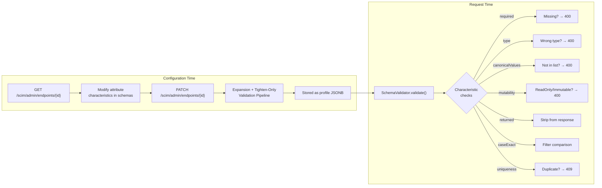
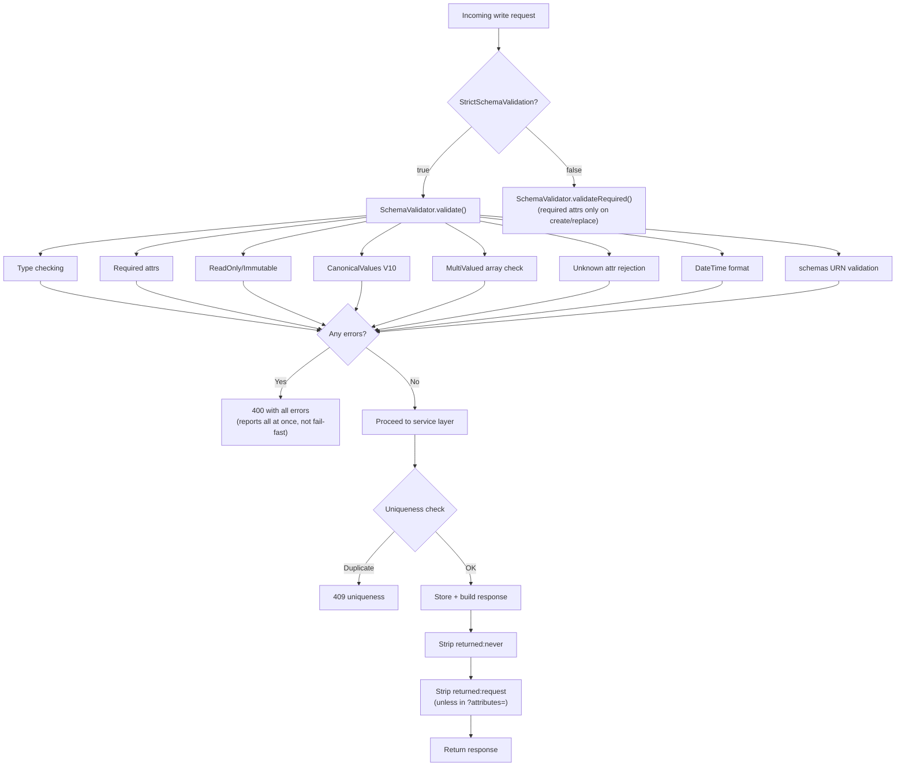

# Schema Attribute Customization Guide

> **Version**: 1.0 - **Date**: April 28, 2026 - **Status**: ✅ Complete (source-verified)  
> **SCIMServer**: v0.40.0 - **Audience**: Operators, ISV admins, Entra ID integration engineers  
> **Scope**: Per-endpoint attribute characteristic changes - canonicalValues, required, mutability, uniqueness, caseExact, returned

---

## Cross-References

| Topic | Document |
|-------|----------|
| Schema customization (extensions, custom resource types) | [SCHEMA_CUSTOMIZATION_GUIDE.md](SCHEMA_CUSTOMIZATION_GUIDE.md) |
| Profile architecture (expansion, validation pipelines) | [ENDPOINT_PROFILE_ARCHITECTURE.md](ENDPOINT_PROFILE_ARCHITECTURE.md) |
| Config flags (StrictSchemaValidation, etc.) | [ENDPOINT_CONFIG_FLAGS_REFERENCE.md](ENDPOINT_CONFIG_FLAGS_REFERENCE.md) |
| Returned characteristic implementation | [G8E_RETURNED_CHARACTERISTIC_FILTERING.md](G8E_RETURNED_CHARACTERISTIC_FILTERING.md) |
| ReadOnly stripping & warnings | [READONLY_ATTRIBUTE_STRIPPING_AND_WARNINGS.md](READONLY_ATTRIBUTE_STRIPPING_AND_WARNINGS.md) |
| Immutable enforcement | [H1_H2_ARCHITECTURE_AND_IMPLEMENTATION.md](H1_H2_ARCHITECTURE_AND_IMPLEMENTATION.md) |
| RFC 7643 schema extracts | [rfcs/RFC7643_SCHEMA_EXTRACT.md](rfcs/RFC7643_SCHEMA_EXTRACT.md) |
| Complete API reference | [COMPLETE_API_REFERENCE.md](COMPLETE_API_REFERENCE.md) |

---

## Table of Contents

1. [Overview](#1-overview)
2. [RFC Foundation - Attribute Characteristics](#2-rfc-foundation--attribute-characteristics)
3. [How Characteristics Are Enforced](#3-how-characteristics-are-enforced)
4. [Tighten-Only Rules](#4-tighten-only-rules)
5. [Step-by-Step: Modifying Attribute Characteristics](#5-step-by-step-modifying-attribute-characteristics)
6. [Characteristic Reference - What Each One Controls](#6-characteristic-reference--what-each-one-controls)
7. [Scenarios & Worked Examples](#7-scenarios--worked-examples)
8. [PATCH Merge Semantics](#8-patch-merge-semantics)
9. [Config Flags That Affect Enforcement](#9-config-flags-that-affect-enforcement)
10. [Error Catalog](#10-error-catalog)
11. [Troubleshooting](#11-troubleshooting)
12. [One-Click Templates](#12-one-click-templates)
13. [Quick Reference Card](#13-quick-reference-card)

---

## 1. Overview

Every attribute in a SCIM schema has **characteristics** - metadata properties that control how the attribute behaves during writes, reads, filters, and responses. SCIMServer lets you customize these characteristics **per-endpoint** through the profile system.

### What You Can Do

| Customization | Example | Characteristic |
|--------------|---------|----------------|
| Restrict allowed values | `title` → only `Engineer` or `PM` | `canonicalValues` |
| Make an attribute mandatory | `displayName` must be provided | `required` |
| Lock an attribute after creation | `employeeNumber` cannot change | `mutability: immutable` |
| Make an attribute read-only | Server-managed, client cannot set | `mutability: readOnly` |
| Hide an attribute from responses | `password` never returned | `returned: never` |
| Show only when explicitly requested | `ims` only in `?attributes=ims` | `returned: request` |
| Require case-sensitive matching | `externalId` exact-case filters | `caseExact: true` |
| Enforce uniqueness | `displayName` unique per endpoint | `uniqueness: server` |

### Architecture



### Key Principle

You can only **tighten** (make more restrictive) characteristics on RFC-defined schemas. You cannot loosen them below the RFC 7643 baseline. Custom schemas have no baseline - full control.

---

## 2. RFC Foundation - Attribute Characteristics

RFC 7643 §2.2 and §7 define 7 attribute characteristics with defaults:

| Characteristic | RFC Default | RFC Section | Purpose |
|---------------|-------------|-------------|---------|
| `required` | `false` | §7 | Whether the attribute must be present on create/replace |
| `canonicalValues` | none (empty) | §2.3.1, §7 | Suggested/enforceable allowed values |
| `caseExact` | `false` | §7 | Whether string matching is case-sensitive |
| `mutability` | `readWrite` | §7 | When the attribute can be set/changed |
| `returned` | `default` | §7 | When the attribute appears in responses |
| `uniqueness` | `none` | §7 | Whether values must be unique |
| `type` | `string` | §7 | Data type (structural - cannot be changed) |

### Mutability Values (RFC 7643 §7)

| Value | Meaning |
|-------|---------|
| `readWrite` | Client can set and update at any time |
| `immutable` | Client can set at creation (POST) only - no changes afterward |
| `readOnly` | Server-managed - client MUST NOT set or change |
| `writeOnly` | Client can set - value MUST NOT be returned in responses |

### Returned Values (RFC 7643 §7)

| Value | Meaning |
|-------|---------|
| `always` | Always included in responses regardless of query params |
| `default` | Included by default - removable via `excludedAttributes` |
| `request` | Only returned when explicitly listed in `?attributes=` |
| `never` | MUST NOT appear in any response (e.g., `password`) |

### Uniqueness Values (RFC 7643 §7)

| Value | Meaning |
|-------|---------|
| `none` | No uniqueness enforced |
| `server` | Must be unique within the endpoint |
| `global` | Must be unique across all endpoints (not commonly used) |

### canonicalValues (RFC 7643 §2.3.1)

> When `"canonicalValues"` is specified, service providers **MAY restrict** accepted values to the specified values.

The RFC uses **MAY** - enforcement is the provider's choice. SCIMServer enforces when `StrictSchemaValidation = true`.

---

## 3. How Characteristics Are Enforced

### Enforcement Matrix

| Characteristic | Enforced During | HTTP Status | `scimType` | Requires StrictSchema |
|---------------|-----------------|:-----------:|------------|:---------------------:|
| `type` | POST, PUT, PATCH | 400 | `invalidValue` | Yes |
| `required` | POST, PUT (not PATCH) | 400 | `invalidValue` | Yes (full); partial in lenient |
| `mutability: readOnly` | POST, PUT, PATCH | 400 | `mutability` | Yes |
| `mutability: immutable` | PUT, PATCH (change detection) | 400 | `mutability` | Yes |
| `mutability: writeOnly` | Filter (`?filter=`) | 400 | `invalidFilter` | No |
| `canonicalValues` | POST, PUT, PATCH | 400 | `invalidValue` | Yes |
| `multiValued` | POST, PUT, PATCH | 400 | `invalidSyntax` | Yes |
| `returned: never` | All responses | - | - | No (always active) |
| `returned: request` | GET, LIST, SEARCH responses | - | - | No (always active) |
| `caseExact` | Filter evaluation (`eq`, `co`, `sw`, `ew`) | - | - | No (always active) |
| `uniqueness: server` | POST, PUT, PATCH | 409 | `uniqueness` | No (always active) |
| Unknown attributes | POST, PUT, PATCH | 400 | `invalidSyntax` | Yes |
| `schemas[]` URN validation | POST, PUT, PATCH | 400 | `invalidValue` | Yes |
| DateTime format | POST, PUT, PATCH | 400 | `invalidValue` | Yes |

### Enforcement Flow



---

## 4. Tighten-Only Rules

When overriding attributes on **RFC-defined schemas** (User, Group, EnterpriseUser), a tighten-only validator ensures you can only make attributes **more restrictive** than the RFC 7643 baseline.

### Rules Matrix

| Characteristic | ✅ Allowed (Tightening) | ❌ Rejected (Loosening) | Immutable? |
|---------------|------------------------|------------------------|:----------:|
| **`type`** | Same value only | Any change | Yes |
| **`multiValued`** | Same value only | Any change | Yes |
| **`required`** | `false → true` | `true → false` | No |
| **`mutability`** | Lower rank: `readWrite → immutable → readOnly` | Higher rank: `readOnly → readWrite` | No |
| **`uniqueness`** | Lower rank: `none → server → global` | Higher rank: `server → none` | No |
| **`caseExact`** | `false → true` | `true → false` | No |
| **`returned`** | Any change **except** from `never` | `never → anything` | Partial |
| **`canonicalValues`** | Add/change freely | - | No |

### Rank Order (Lower = Tighter)

**Mutability**: `readOnly (0)` < `immutable (1)` < `writeOnly (2)` < `readWrite (3)`

**Uniqueness**: `global (0)` < `server (1)` < `none (2)`

### Custom Schemas - No Restrictions

Tighten-only rules are **skipped entirely** for custom extension schemas (e.g., `urn:mycompany:scim:ext:hr:2.0:User`). No RFC baseline exists, so you define everything from scratch with full control.

### Tighten-Only Error Example

```
PATCH /scim/admin/endpoints/{id}
→ Try to change userName mutability from "immutable" to "readWrite"

Response 400:
{
  "detail": "Profile validation failed: Tighten-only violation for 
    urn:ietf:params:scim:schemas:core:2.0:User attribute 'userName': 
    mutability cannot be loosened from 'immutable' to 'readWrite'."
}
```

---

## 5. Step-by-Step: Modifying Attribute Characteristics

### The 3-Step Pattern

```
1. GET    /scim/admin/endpoints/{id}     → Capture profile.schemas
2. Modify  attributes in the JSON         → Add/change characteristics
3. PATCH  /scim/admin/endpoints/{id}     → Send modified schemas back
```

### Headers

| Context | Headers |
|---------|---------|
| Admin API (GET/PATCH endpoints) | `Authorization: Bearer <token>` + `Content-Type: application/json` |
| SCIM API (POST/PUT/PATCH resources) | `Authorization: Bearer <token>` + `Content-Type: application/scim+json` |

### Step 1 - GET Current Endpoint

```http
GET /scim/admin/endpoints/{endpointId}
Authorization: Bearer <token>
```

Save `response.profile.schemas` - the full array you'll modify and return.

### Step 2 - Modify Target Attributes

Find the attribute in the schemas array and change/add the characteristics you want.

**Top-level attribute** - directly in `schemas[].attributes[]`:
```json
{ "name": "title", "type": "string", "canonicalValues": ["Engineer", "PM"], ... }
```

**Sub-attribute** - inside `schemas[].attributes[].subAttributes[]`:
```json
{ "name": "addresses", "subAttributes": [
    { "name": "country", "canonicalValues": ["US", "IN"], ... }
]}
```

**Extension attribute** - in the extension schema's `attributes[]`:
```json
{ "id": "urn:ietf:params:scim:schemas:extension:enterprise:2.0:User",
  "attributes": [{ "name": "department", "canonicalValues": ["HR", "Finance"], ... }]}
```

### Step 3 - PATCH the Endpoint

```http
PATCH /scim/admin/endpoints/{endpointId}
Authorization: Bearer <token>
Content-Type: application/json

{
  "profile": {
    "schemas": [ ...entire modified schemas array... ]
  }
}
```

> **CRITICAL**: `profile.schemas` is **replaced wholesale**. Include ALL schemas with ALL attributes. Omitting a schema or attribute removes it from the endpoint.

### Step 4 (Optional) - Enable StrictSchemaValidation

If not already enabled, add to the same PATCH:
```json
{
  "profile": {
    "schemas": [ ... ],
    "settings": { "StrictSchemaValidation": "True" }
  }
}
```

`settings` uses shallow merge - only the keys you provide are changed.

---

## 6. Characteristic Reference - What Each One Controls

### 6.1 canonicalValues - Restrict Allowed Values

| Property | Detail |
|----------|--------|
| **Type** | `string[]` (array of allowed values) |
| **Default** | None (any value accepted) |
| **Enforced** | POST, PUT, PATCH - when `StrictSchemaValidation = true` |
| **Matching** | Case-insensitive (`"engineer"` = `"Engineer"`) |
| **Applies to** | `type: "string"` attributes only |
| **Error** | `400 invalidValue` |

**Example definition:**
```json
{ "name": "title", "type": "string", "canonicalValues": ["Engineer", "PM"] }
```

**Rejection message:**
```
Attribute 'title' value 'CEO' is not one of the canonical values: [Engineer, PM].
```

**Use cases:** Dropdown-style allowed lists, country codes, department names, type sub-attributes.

---

### 6.2 required - Make Attributes Mandatory

| Property | Detail |
|----------|--------|
| **Type** | `boolean` |
| **Default** | `false` |
| **Enforced** | POST (create), PUT (replace) - NOT on PATCH |
| **Tighten-only** | Can change `false → true`, not `true → false` (RFC schemas) |
| **Error** | `400 invalidValue` |

**Example definition:**
```json
{ "name": "displayName", "type": "string", "required": true }
```

**Rejection message:**
```
Required attribute 'displayName' is missing.
```

**Note:** `readOnly` required attributes (like `id`) are exempt - the server generates them.

---

### 6.3 mutability - Control Write Access

| Property | Detail |
|----------|--------|
| **Type** | `string` - `readOnly`, `readWrite`, `immutable`, `writeOnly` |
| **Default** | `readWrite` |
| **Enforced** | POST, PUT, PATCH |
| **Tighten-only** | Can only tighten: `readWrite → immutable → readOnly` |
| **Error** | `400 mutability` |

**Mutability behavior matrix:**

| Value | POST (create) | PUT (replace) | PATCH (modify) | GET (read) |
|-------|:---:|:---:|:---:|:---:|
| `readWrite` | ✅ Set | ✅ Change | ✅ Change | ✅ Return |
| `immutable` | ✅ Set | ❌ Change (if set) | ❌ Change (if set) | ✅ Return |
| `readOnly` | ❌ Client cannot set | ❌ Client cannot set | ❌ Client cannot set | ✅ Return |
| `writeOnly` | ✅ Set | ✅ Change | ✅ Change | ❌ Never returned |

**Example - make `employeeNumber` immutable:**
```json
{ "name": "employeeNumber", "type": "string", "mutability": "immutable" }
```

**Rejection messages:**
- ReadOnly: `Attribute 'id' is readOnly and cannot be set by the client.`
- Immutable: `Attribute 'userName' is immutable and cannot be changed.`

---

### 6.4 returned - Control Response Visibility

| Property | Detail |
|----------|--------|
| **Type** | `string` - `always`, `default`, `request`, `never` |
| **Default** | `default` |
| **Enforced** | Response projection - always active (no config flag needed) |
| **Tighten-only** | Can change freely **except** `never → anything` (locked) |

**Response behavior matrix:**

| Value | Default response | With `?attributes=X` | With `?excludedAttributes=X` |
|-------|:---:|:---:|:---:|
| `always` | ✅ Included | ✅ Always included | ✅ Cannot exclude |
| `default` | ✅ Included | Only if listed | ❌ Excluded if listed |
| `request` | ❌ Omitted | ✅ Only if listed | ❌ Omitted |
| `never` | ❌ Stripped | ❌ Stripped | ❌ Stripped |

**Example - make `ims` only returned on request:**
```json
{ "name": "ims", "type": "complex", "returned": "request" }
```

**Security note:** `returned: "never"` cannot be loosened to any other value on RFC schemas. This prevents accidentally exposing `password`.

---

### 6.5 caseExact - Control Filter Case-Sensitivity

| Property | Detail |
|----------|--------|
| **Type** | `boolean` |
| **Default** | `false` (case-insensitive) |
| **Enforced** | Filter evaluation (`eq`, `co`, `sw`, `ew` operators) - always active |
| **Tighten-only** | Can change `false → true`, not `true → false` |

**Example - make `externalId` case-sensitive:**
```json
{ "name": "externalId", "type": "string", "caseExact": true }
```

**Impact:** `?filter=externalId eq "ABC123"` will NOT match a stored value of `"abc123"`.

---

### 6.6 uniqueness - Enforce Value Uniqueness

| Property | Detail |
|----------|--------|
| **Type** | `string` - `none`, `server`, `global` |
| **Default** | `none` |
| **Enforced** | Service layer + DB - always active (no config flag needed) |
| **Tighten-only** | Can only tighten: `none → server → global` |
| **Error** | `409 uniqueness` |

**Example - make `displayName` unique:**
```json
{ "name": "displayName", "type": "string", "uniqueness": "server" }
```

**Rejection message:**
```json
{
  "status": "409",
  "scimType": "uniqueness",
  "detail": "A resource with displayName 'John Doe' already exists."
}
```

**Note:** `userName` already has `uniqueness: "server"` in the RFC baseline. `displayName` on Groups also has `uniqueness: "server"` by default.

---

### 6.7 type and multiValued - Structural (Immutable)

These are **structural** characteristics that **cannot be changed** - not even tightened.

| Property | Values | Note |
|----------|--------|------|
| `type` | `string`, `boolean`, `integer`, `decimal`, `dateTime`, `reference`, `complex`, `binary` | Changing type is rejected |
| `multiValued` | `true` / `false` | Changing cardinality is rejected |

Any attempt to change these on an RFC-defined attribute returns a `400` tighten-only violation.

---

## 7. Scenarios & Worked Examples

### Scenario A - Value Restriction: `title` → Engineer / PM

**Characteristic:** `canonicalValues`  
**Schema:** `urn:ietf:params:scim:schemas:core:2.0:User`  

```json
{ "name": "title", "type": "string", "required": false, "caseExact": false,
  "mutability": "readWrite", "returned": "default", "multiValued": false,
  "canonicalValues": ["Engineer", "PM"] }
```

| Test | Input | Result |
|------|-------|--------|
| `"title": "CEO"` | Non-canonical | **400**: `value 'CEO' is not one of the canonical values: [Engineer, PM]` |
| `"title": "engineer"` | Case-insensitive match | **Accepted** |
| `"title": "PM"` | Exact match | **Accepted** |

---

### Scenario B - Value Restriction on Sub-Attribute: `addresses.country` → US / IN

**Characteristic:** `canonicalValues` on sub-attribute  
**Schema:** `urn:ietf:params:scim:schemas:core:2.0:User` → `addresses` → `country`

```json
{ "name": "addresses", "type": "complex", "multiValued": true,
  "subAttributes": [
    { "name": "country", "type": "string", "caseExact": false,
      "mutability": "readWrite", "returned": "default", "multiValued": false,
      "canonicalValues": ["US", "IN"] },
    ...other sub-attributes...
  ]}
```

| Test | Input | Result |
|------|-------|--------|
| `"country": "UK"` | Non-canonical | **400**: `value 'UK' is not one of the canonical values: [US, IN]` |
| `"country": "us"` | Case-insensitive | **Accepted** |

---

### Scenario C - Value Restriction on Extension: `department` → HR / Finance

**Characteristic:** `canonicalValues` on extension attribute  
**Schema:** `urn:ietf:params:scim:schemas:extension:enterprise:2.0:User`

```json
{ "name": "department", "type": "string", "required": false, "caseExact": false,
  "mutability": "readWrite", "returned": "default", "uniqueness": "none",
  "multiValued": false, "canonicalValues": ["HR", "Finance"] }
```

| Test | Input | Result |
|------|-------|--------|
| `"department": "Marketing"` | Non-canonical | **400**: `value 'Marketing' is not one of the canonical values: [HR, Finance]` |
| `"department": "hr"` | Case-insensitive | **Accepted** |

---

### Scenario D - Override RFC Default: Restrict `emails.type` to Work Only

**Characteristic:** `canonicalValues` override  
**RFC default:** `["work", "home", "other"]` → Override to `["work"]`

```json
{ "name": "type", "type": "string", "caseExact": false,
  "mutability": "readWrite", "returned": "default", "multiValued": false,
  "canonicalValues": ["work"] }
```

| Test | Input | Result |
|------|-------|--------|
| `"type": "home"` | No longer allowed | **400** |
| `"type": "work"` | Only allowed value | **Accepted** |

---

### Scenario E - Make Attribute Required + Value-Restricted

**Characteristics:** `required: true` + `canonicalValues`

```json
{ "name": "title", "type": "string", "required": true,
  "mutability": "readWrite", "returned": "default", "multiValued": false,
  "canonicalValues": ["Engineer", "PM"] }
```

| Test | Input | Result |
|------|-------|--------|
| Title omitted | Missing required | **400**: `Required attribute 'title' is missing` |
| `"title": "CEO"` | Present but invalid | **400**: `not one of the canonical values` |
| `"title": "PM"` | Valid | **Accepted** |

---

### Scenario F - Make Attribute Immutable (Set Once)

**Characteristic:** `mutability: "immutable"`

```json
{ "name": "employeeNumber", "type": "string", "mutability": "immutable",
  "returned": "default", "multiValued": false }
```

| Test | Operation | Result |
|------|-----------|--------|
| POST with `"employeeNumber": "E001"` | Create | **Accepted** - value stored |
| PUT with `"employeeNumber": "E002"` | Replace (changed) | **400**: `Attribute 'employeeNumber' is immutable and cannot be changed` |
| PATCH replace `employeeNumber` → `"E002"` | Modify (changed) | **400**: same |
| PUT with `"employeeNumber": "E001"` | Same value | **Accepted** (no change detected) |
| PUT without `employeeNumber` | Omitted | **Accepted** (omission ≠ change) |

---

### Scenario G - Hide Attribute from Responses

**Characteristic:** `returned: "request"`

```json
{ "name": "ims", "type": "complex", "multiValued": true,
  "returned": "request", "mutability": "readWrite" }
```

| Test | Query | Result |
|------|-------|--------|
| `GET /Users/{id}` | Default | `ims` **not included** in response |
| `GET /Users/{id}?attributes=ims` | Explicit request | `ims` **included** |
| `GET /Users?attributes=userName,ims` | LIST with attrs | `ims` **included** |

---

### Scenario H - Enforce Uniqueness on displayName

**Characteristic:** `uniqueness: "server"`

```json
{ "name": "displayName", "type": "string", "required": true,
  "uniqueness": "server", "mutability": "readWrite", "returned": "default" }
```

| Test | Input | Result |
|------|-------|--------|
| POST User A: `"displayName": "John Doe"` | First user | **201 Created** |
| POST User B: `"displayName": "John Doe"` | Duplicate | **409**: `A resource with displayName 'John Doe' already exists` |
| POST User B: `"displayName": "john doe"` | Case-insensitive | **409** (uniqueness is case-insensitive) |

---

### Scenario I - Combine Multiple Characteristic Changes

Apply several changes to a single attribute:

```json
{ "name": "employeeNumber", "type": "string",
  "required": true,
  "mutability": "immutable",
  "caseExact": true,
  "uniqueness": "server",
  "returned": "default",
  "multiValued": false }
```

**Result:** `employeeNumber` is now:
- ✅ Required on POST/PUT
- ✅ Set once, never changed
- ✅ Case-sensitive in filters
- ✅ Must be unique across the endpoint

---

### Scenario J - Custom Extension: Full Control

Custom schemas bypass tighten-only rules. Define anything:

```json
{
  "id": "urn:mycompany:scim:ext:hr:2.0:User",
  "name": "HRExtension",
  "attributes": [
    { "name": "employmentType", "type": "string", "required": true,
      "mutability": "readWrite", "returned": "default",
      "canonicalValues": ["full-time", "part-time", "contractor"] },
    { "name": "badgeNumber", "type": "string", "required": false,
      "mutability": "immutable", "caseExact": true, "uniqueness": "server",
      "returned": "default" },
    { "name": "internalNotes", "type": "string", "required": false,
      "mutability": "readWrite", "returned": "never" }
  ]
}
```

---

### Scenario K - Remove Value Restrictions

To remove `canonicalValues`, simply omit the property or set it to `[]`:

```json
{ "name": "title", "type": "string", "required": false,
  "mutability": "readWrite", "returned": "default", "multiValued": false }
```

After PATCH, `title` accepts any string value again.

---

### Scenario L - Value Restriction on PATCH Operations

canonicalValues enforcement applies to **all write paths** equally:

```http
PATCH /scim/endpoints/{id}/Users/{userId}
Content-Type: application/scim+json

{
  "schemas": ["urn:ietf:params:scim:api:messages:2.0:PatchOp"],
  "Operations": [
    { "op": "replace", "path": "title", "value": "CEO" }
  ]
}

→ 400 invalidValue: "value 'CEO' is not one of the canonical values: [Engineer, PM]"
```

---

## 8. PATCH Merge Semantics

When PATCHing an endpoint profile, different sections use different merge strategies:

| Profile Section | Merge Strategy | Implication |
|----------------|---------------|-------------|
| **`schemas`** | **REPLACE** (full array) | Must include ALL schemas with ALL attributes |
| **`resourceTypes`** | **REPLACE** (full array) | Must include all resource types |
| **`serviceProviderConfig`** | **Shallow merge** | Only send capabilities you want to change |
| **`settings`** | **Shallow merge** (additive) | Only send flags you want to change |

### Safe Pattern (DO ✅)

```json
{
  "profile": {
    "schemas": [ "...COMPLETE array from GET, with modifications..." ],
    "settings": { "StrictSchemaValidation": "True" }
  }
}
```

### Dangerous Pattern (DON'T ❌)

```json
{
  "profile": {
    "schemas": [
      { "id": "urn:ietf:params:scim:schemas:core:2.0:User",
        "attributes": [{ "name": "title", "canonicalValues": ["A"] }] }
    ]
  }
}
```

This **deletes all other schemas** and **all other User attributes except title**.

### Auto-Expansion Pipeline

After your PATCH, the server runs a 5-step validation pipeline:


---

## 9. Config Flags That Affect Enforcement

### Primary Flag: StrictSchemaValidation

| Flag | Default | Effect on Attribute Enforcement |
|------|---------|------|
| `StrictSchemaValidation` | `true` | **true**: Full validation - type, required, mutability, canonicalValues, unknown attrs, dateTime, schemas[] URNs |
| | | **false**: Lenient - only `required` on create/replace; PATCH gets no schema validation; canonicalValues not checked |

### Interaction Matrix

| Characteristic | StrictSchema=true | StrictSchema=false |
|---------------|:-----------------:|:------------------:|
| `canonicalValues` | ✅ Enforced | ❌ Not checked |
| `type` checking | ✅ Enforced | ❌ Not checked |
| `required` | ✅ Enforced | ✅ Enforced (create/replace only) |
| `mutability: readOnly` | ✅ 400 error | ❌ Silently stripped |
| `mutability: immutable` | ✅ 400 error | ❌ Not checked |
| `returned: never` | ✅ Stripped | ✅ Stripped (always active) |
| `returned: request` | ✅ Stripped | ✅ Stripped (always active) |
| `caseExact` | ✅ Active | ✅ Active (always active) |
| `uniqueness` | ✅ Active | ✅ Active (always active) |
| Unknown attributes | ✅ 400 error | ❌ Accepted |

### Related Flags

| Flag | Default | Relevance |
|------|---------|-----------|
| `IgnoreReadOnlyAttributesInPatch` | `false` | When `true` + StrictSchema ON: silently strip readOnly PATCH ops instead of 400 |
| `IncludeWarningAboutIgnoredReadOnlyAttribute` | `false` | Attach warning header listing stripped readOnly attrs |
| `AllowAndCoerceBooleanStrings` | `true` | Coerce `"True"`/`"False"` → native booleans before type checking |

---

## 10. Error Catalog

### SCIM Protocol Errors (Write Operations)

| `scimType` | HTTP | Trigger | Error Detail Pattern |
|-----------|:----:|---------|---------------------|
| `invalidValue` | 400 | Value not in `canonicalValues` | `Attribute 'X' value 'Y' is not one of the canonical values: [A, B].` |
| `invalidValue` | 400 | Required attribute missing | `Required attribute 'X' is missing.` |
| `invalidValue` | 400 | Wrong data type | `Attribute 'X' expected type 'boolean' but got 'string'.` |
| `invalidValue` | 400 | Invalid dateTime format | `Attribute 'X' is not a valid dateTime.` |
| `invalidSyntax` | 400 | Unknown attribute (strict) | `Attribute 'X' is not defined in schema.` |
| `invalidSyntax` | 400 | Array for single-valued attr | `Attribute 'X' is single-valued but received an array.` |
| `invalidSyntax` | 400 | Non-array for multi-valued attr | `Attribute 'X' is multi-valued but did not receive an array.` |
| `mutability` | 400 | ReadOnly attribute set by client | `Attribute 'X' is readOnly and cannot be set by the client.` |
| `mutability` | 400 | Immutable attribute changed | `Attribute 'X' is immutable and cannot be changed.` |
| `uniqueness` | 409 | Duplicate value | `A resource with X 'Y' already exists.` |
| `invalidFilter` | 400 | WriteOnly attr in filter | `Attribute 'X' is writeOnly and cannot be used in filters.` |

### Admin API Errors (Endpoint PATCH)

| Error Code | Trigger | Fix |
|------------|---------|-----|
| `TIGHTEN_ONLY_VIOLATION` | Loosened an RFC characteristic | Only tighten (see §4) |
| `RT_MISSING_SCHEMA` | ResourceType references missing schema | Include all referenced schemas |
| `RT_MISSING_EXTENSION_SCHEMA` | Extension schema not in schemas[] | Add the extension schema |
| `DUPLICATE_SCHEMA` | Same schema ID twice | Remove duplicate |
| `EXPAND_ERROR` | Invalid attribute definition | Check attribute properties |
| `SPC_UNIMPLEMENTED` | Claimed unsupported capability | Set `supported: false` |

---

## 11. Troubleshooting

### "I added canonicalValues but values aren't being rejected"

| Check | How to Fix |
|-------|-----------|
| `StrictSchemaValidation` is `"True"` | GET endpoint → check `profile.settings` - add via PATCH if missing |
| `canonicalValues` saved correctly | GET endpoint → find attribute → verify array is present and non-empty |
| Attribute is `type: "string"` | canonicalValues only enforced on strings |
| Using correct endpoint ID | SCIM URL must match the endpoint you PATCHed |

### "My PATCH dropped all schemas/attributes"

`profile.schemas` is **replaced wholesale**. Always: GET → modify → PATCH back the full array.

### "Tighten-only violation on PATCH"

You tried to loosen a characteristic on an RFC schema. See §4 for what's allowed. Custom schemas don't have this restriction.

### "ReadOnly attribute error but I want to strip silently"

Set `IgnoreReadOnlyAttributesInPatch: "True"` in the endpoint settings. ReadOnly PATCH operations will be silently stripped instead of returning 400.

### "Uniqueness is case-sensitive but I expected case-insensitive"

Uniqueness checks are always case-insensitive. `"JohnDoe"` and `"johndoe"` are considered duplicates regardless of `caseExact`.

### "returned:request attribute always shows up"

Check that you're testing with a **default** GET (no `?attributes=` param). The attribute should only appear when explicitly requested.

### "Immutable attribute change was accepted"

Immutable enforcement requires `StrictSchemaValidation = true`. Also, the attribute must have had a value set previously - setting it for the first time is always allowed.

---

## 12. One-Click Templates

### Template A - PowerShell: Add canonicalValues (Generic)

```powershell
# ═══════ CONFIGURE ═══════
$baseUrl    = "https://your-server.example.com"
$endpointId = "your-endpoint-id"
$token      = "your-bearer-token"
$schemaUrn  = "urn:ietf:params:scim:schemas:core:2.0:User"
$attrName   = "title"                # Top-level attribute name
$values     = @("Engineer", "PM")    # Canonical values
$parentAttr = $null                  # Set to "addresses" for sub-attribute
$subAttrName = $null                 # Set to "country" for sub-attribute
# ═════════════════════════

$h = @{ Authorization = "Bearer $token"; "Content-Type" = "application/json" }
$ep = Invoke-RestMethod -Uri "$baseUrl/scim/admin/endpoints/$endpointId" -Headers $h
$schemas = $ep.profile.schemas
$schema = $schemas | Where-Object { $_.id -eq $schemaUrn }

if ($parentAttr -and $subAttrName) {
    $parent = $schema.attributes | Where-Object { $_.name -eq $parentAttr }
    $sub = $parent.subAttributes | Where-Object { $_.name -eq $subAttrName }
    $sub | Add-Member -NotePropertyName "canonicalValues" -NotePropertyValue $values -Force
    Write-Host "Set $parentAttr.$subAttrName.canonicalValues = $($values -join ', ')"
} else {
    $attr = $schema.attributes | Where-Object { $_.name -eq $attrName }
    $attr | Add-Member -NotePropertyName "canonicalValues" -NotePropertyValue $values -Force
    Write-Host "Set $attrName.canonicalValues = $($values -join ', ')"
}

$body = @{ profile = @{ schemas = $schemas } } | ConvertTo-Json -Depth 30 -Compress
$result = Invoke-RestMethod -Method Patch -Uri "$baseUrl/scim/admin/endpoints/$endpointId" -Headers $h -Body $body
Write-Host "Updated: $($result.name) at $($result.updatedAt)"
```

### Template B - PowerShell: Change Any Characteristic (Generic)

```powershell
# ═══════ CONFIGURE ═══════
$baseUrl       = "https://your-server.example.com"
$endpointId    = "your-endpoint-id"
$token         = "your-bearer-token"
$schemaUrn     = "urn:ietf:params:scim:schemas:core:2.0:User"
$attrName      = "displayName"
$characteristic = "required"     # required | mutability | uniqueness | caseExact | returned
$newValue       = $true          # The new value for the characteristic
# ═════════════════════════

$h = @{ Authorization = "Bearer $token"; "Content-Type" = "application/json" }
$ep = Invoke-RestMethod -Uri "$baseUrl/scim/admin/endpoints/$endpointId" -Headers $h
$schemas = $ep.profile.schemas
$schema = $schemas | Where-Object { $_.id -eq $schemaUrn }
$attr = $schema.attributes | Where-Object { $_.name -eq $attrName }
$attr | Add-Member -NotePropertyName $characteristic -NotePropertyValue $newValue -Force
Write-Host "Set $attrName.$characteristic = $newValue"

$body = @{ profile = @{ schemas = $schemas } } | ConvertTo-Json -Depth 30 -Compress
$result = Invoke-RestMethod -Method Patch -Uri "$baseUrl/scim/admin/endpoints/$endpointId" -Headers $h -Body $body
Write-Host "Updated: $($result.name) at $($result.updatedAt)"
```

### Template C - cURL: Add canonicalValues

```bash
# Step 1: GET and save schemas
curl -s -H "Authorization: Bearer TOKEN" \
  https://SERVER/scim/admin/endpoints/ENDPOINT_ID \
  | jq '.profile.schemas' > schemas.json

# Step 2: Modify schemas.json - add canonicalValues to target attribute

# Step 3: PATCH
curl -s -X PATCH \
  -H "Authorization: Bearer TOKEN" \
  -H "Content-Type: application/json" \
  -d "{\"profile\":{\"schemas\":$(cat schemas.json)}}" \
  https://SERVER/scim/admin/endpoints/ENDPOINT_ID
```

### Template D - Complete Worked Example (3 Value Restrictions)

```
==========================================================================
  Server:   https://scimserver2.yellowsmoke-af7a3fff.eastus.azurecontainerapps.io
  Endpoint: a4225b6d-d213-4183-ae78-ef11c14a5f54 (Himanshu-ISV-1)

  Changes:
    title      → canonicalValues: [Engineer, PM]
                 (urn:ietf:params:scim:schemas:core:2.0:User)
    department → canonicalValues: [HR, Finance]
                 (urn:ietf:params:scim:schemas:extension:enterprise:2.0:User)
    country    → canonicalValues: [US, IN]
                 (urn:ietf:params:scim:schemas:core:2.0:User → addresses → country)
==========================================================================

STEP 1 - GET
GET .../scim/admin/endpoints/a4225b6d-...
Authorization: Bearer changeme-scim
→ 200 OK (save profile.schemas)

STEP 2 - PATCH (add canonicalValues, send all schemas back)
PATCH .../scim/admin/endpoints/a4225b6d-...
Authorization: Bearer changeme-scim
Content-Type: application/json
Body: {"profile":{"schemas":[ ...all 7 schemas with canonicalValues added... ]}}
→ 200 OK

STEP 3 - TEST title="CEO"           → 400 invalidValue
STEP 4 - TEST department="Marketing" → 400 invalidValue
STEP 5 - TEST country="UK"          → 400 invalidValue
STEP 6 - TEST all valid values      → 201 Created

MATCHING IS CASE-INSENSITIVE: "engineer" = "Engineer" = "ENGINEER"
==========================================================================
```

---

## 13. Quick Reference Card

### Characteristics at a Glance

| Characteristic | Default | Tighten | Loosen | Enforced When |
|---------------|---------|:-------:|:------:|---------------|
| `canonicalValues` | `[]` | ✅ | - | StrictSchema=true |
| `required` | `false` | ✅ →`true` | ❌ | StrictSchema=true (full); always (partial) |
| `mutability` | `readWrite` | ✅ →`immutable`→`readOnly` | ❌ | StrictSchema=true |
| `returned` | `default` | ✅ (except from `never`) | ❌ from `never` | Always |
| `caseExact` | `false` | ✅ →`true` | ❌ | Always (filters) |
| `uniqueness` | `none` | ✅ →`server`→`global` | ❌ | Always |
| `type` | `string` | ❌ immutable | ❌ | StrictSchema=true |
| `multiValued` | `false` | ❌ immutable | ❌ | StrictSchema=true |

### Key URNs

| URN | Usage |
|-----|-------|
| `urn:ietf:params:scim:schemas:core:2.0:User` | Core User schema |
| `urn:ietf:params:scim:schemas:core:2.0:Group` | Core Group schema |
| `urn:ietf:params:scim:schemas:extension:enterprise:2.0:User` | Enterprise extension |
| `urn:ietf:params:scim:api:messages:2.0:Error` | Error response |
| `urn:ietf:params:scim:api:messages:2.0:PatchOp` | PATCH request |

### Headers Cheat Sheet

| Context | Headers |
|---------|---------|
| Admin API | `Authorization: Bearer <token>` · `Content-Type: application/json` |
| SCIM API | `Authorization: Bearer <token>` · `Content-Type: application/scim+json` |

### The 3-Step Pattern

```
1. GET    /scim/admin/endpoints/{id}     → Capture profile.schemas
2. Modify  attribute characteristics      → In the JSON array
3. PATCH  /scim/admin/endpoints/{id}     → Send back {"profile":{"schemas":[...]}}
```

**Remember:** `schemas` = REPLACE. `settings` = MERGE. Always send the full schemas array.
