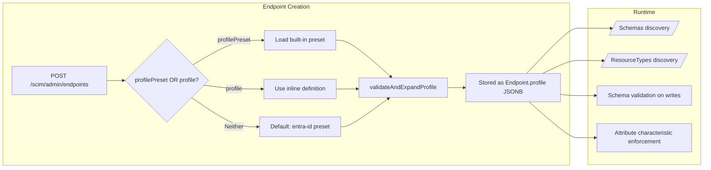
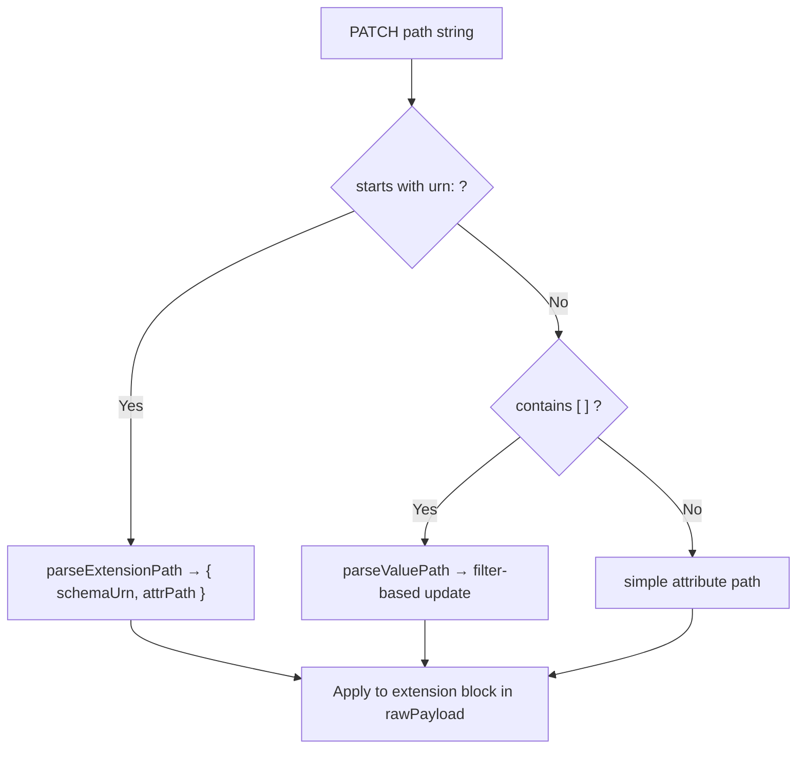
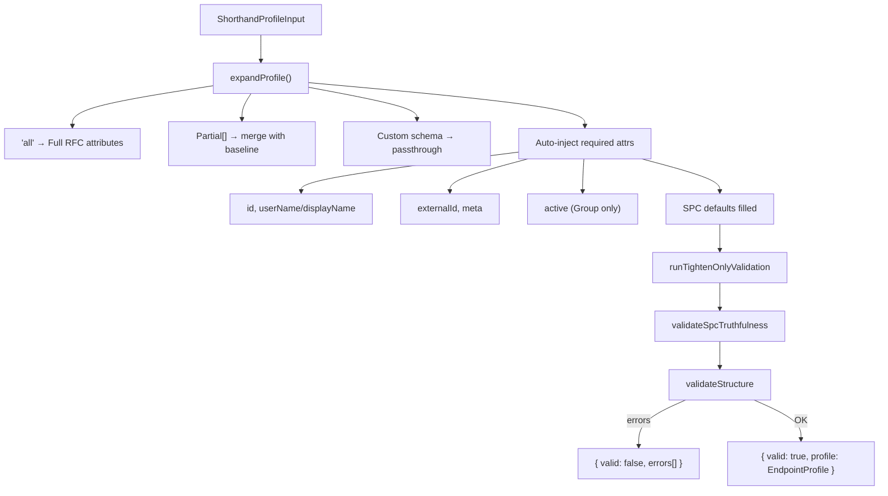
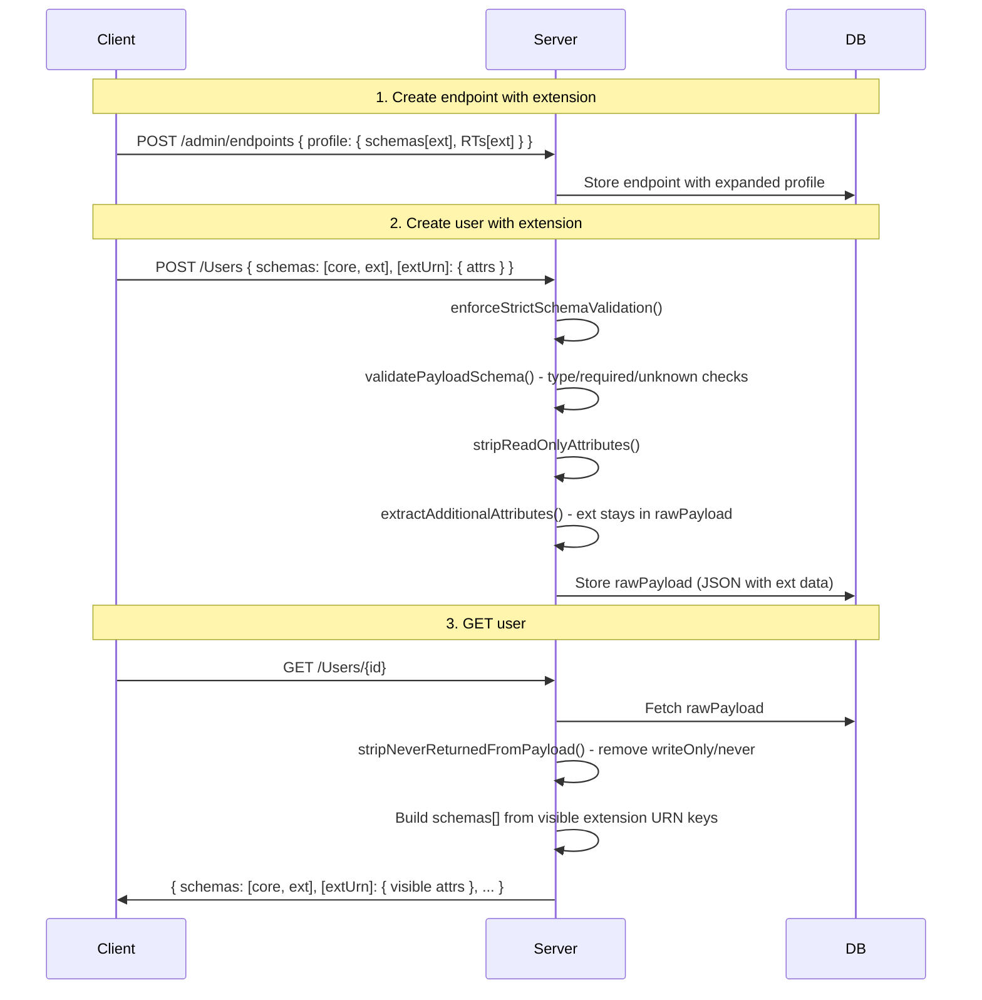

# Schema Customization Guide - Operator Reference

> **Version**: 3.0 · **Date**: April 13, 2026 · **Status**: ✅ Complete (source-verified)  
> **Audience**: Operators, DevOps engineers, ISVs configuring SCIM schema extensions & custom resource types  
> **Supersedes**: v2.0 (March 2, 2026) which referenced deleted `POST/GET/DELETE /admin/endpoints/:id/schemas` routes

---

## Cross-References

| Topic | Document |
|-------|----------|
| Profile architecture internals | [ENDPOINT_PROFILE_ARCHITECTURE.md](ENDPOINT_PROFILE_ARCHITECTURE.md) |
| One-click JSON examples (12 combos) | [examples/endpoint/create-endpoint-with-custom-extensions.json](examples/endpoint/create-endpoint-with-custom-extensions.json) |
| Config flags (14 booleans + logLevel) | [ENDPOINT_CONFIG_FLAGS_REFERENCE.md](ENDPOINT_CONFIG_FLAGS_REFERENCE.md) |
| RFC schema & extension deep dive | [RFC_SCHEMA_AND_EXTENSIONS_REFERENCE.md](RFC_SCHEMA_AND_EXTENSIONS_REFERENCE.md) |
| Complete API reference | [COMPLETE_API_REFERENCE.md](COMPLETE_API_REFERENCE.md) |
| Multi-endpoint guide | [MULTI_ENDPOINT_GUIDE.md](MULTI_ENDPOINT_GUIDE.md) |
| Extension feature doc | [FEATURE_SOFT_DELETE_STRICT_SCHEMA_CUSTOM_EXTENSIONS.md](FEATURE_SOFT_DELETE_STRICT_SCHEMA_CUSTOM_EXTENSIONS.md) |

---

## Table of Contents

1. [How Schema Customization Works (v0.28.0+)](#1-how-schema-customization-works)
2. [Registering a Custom Extension on User](#2-registering-a-custom-extension-on-user)
3. [Registering a Custom Extension on Group](#3-registering-a-custom-extension-on-group)
4. [Multiple Extensions on One Resource Type](#4-multiple-extensions-on-one-resource-type)
5. [Extensions on Both User and Group](#5-extensions-on-both-user-and-group)
6. [Custom Extension + EnterpriseUser Together](#6-custom-extension--enterpriseuser-together)
7. [Complex & Multi-Valued Extension Attributes](#7-complex--multi-valued-extension-attributes)
8. [Required Extensions](#8-required-extensions)
9. [Creating Custom Resource Types](#9-creating-custom-resource-types)
10. [Extensions on Custom Resource Types](#10-extensions-on-custom-resource-types)
11. [Adding Extensions to Existing Endpoints (PATCH)](#11-adding-extensions-to-existing-endpoints-patch)
12. [Using Extensions in SCIM Operations](#12-using-extensions-in-scim-operations)
13. [PATCH Operations on Extension Attributes](#13-patch-operations-on-extension-attributes)
14. [Schema Validation & Config Flags](#14-schema-validation--config-flags)
15. [Discovery Verification](#15-discovery-verification)
16. [Extension Attribute Reference](#16-extension-attribute-reference)
17. [Profile Expansion Pipeline](#17-profile-expansion-pipeline)
18. [Do's and Don'ts](#18-dos-and-donts)
19. [Troubleshooting](#19-troubleshooting)
20. [Quick Reference Card](#20-quick-reference-card)

---

## 1. How Schema Customization Works

### The Profile Model (v0.28.0+)

Schema customization is done **entirely through the endpoint profile** - a single JSONB document attached to each endpoint. There are **no separate admin schema/resource-type routes**; everything is defined at endpoint creation or updated via `PATCH`.



### Profile Structure

A profile has four sections:

```json
{
  "profile": {
    "schemas": [],              // Schema definitions (core + extensions)
    "resourceTypes": [],        // Resource type declarations with extension bindings
    "serviceProviderConfig": {},// RFC 7644 §4 capability advertisement
    "settings": {}              // Behavioral flags (StrictSchemaValidation, etc.)
  }
}
```

| Section | Merge Strategy on PATCH | Required |
|---------|------------------------|----------|
| `schemas` | **Replace** (full array) | ≥1 schema |
| `resourceTypes` | **Replace** (full array) | ≥1 resource type |
| `serviceProviderConfig` | Shallow merge | No (defaults applied) |
| `settings` | Shallow merge (additive) | No (defaults applied) |

### Key Architecture Points

1. **Extension data is stored in `rawPayload`** - the JSONB blob alongside core attributes. No separate table.
2. **Extension URNs must start with `urn:`** - the server detects extensions by checking payload keys that start with `urn:`.
3. **`schemas[]` array on resources is built dynamically** - from visible extension URN keys present in the stored payload.
4. **Each endpoint is fully isolated** - extension schemas on one endpoint don't affect another.

---

## 2. Registering a Custom Extension on User

### Minimal Example

```json
POST /scim/admin/endpoints
{
  "name": "hr-endpoint",
  "profile": {
    "schemas": [
      { "id": "urn:ietf:params:scim:schemas:core:2.0:User", "name": "User", "attributes": "all" },
      {
        "id": "urn:example:scim:extension:hr:2.0:User",
        "name": "HRExtension",
        "description": "HR attributes",
        "attributes": [
          { "name": "badgeNumber", "type": "string", "multiValued": false, "required": false,
            "mutability": "readWrite", "returned": "default", "caseExact": true, "uniqueness": "none" }
        ]
      },
      { "id": "urn:ietf:params:scim:schemas:core:2.0:Group", "name": "Group", "attributes": "all" }
    ],
    "resourceTypes": [
      { "id": "User", "name": "User", "endpoint": "/Users", "description": "User",
        "schema": "urn:ietf:params:scim:schemas:core:2.0:User",
        "schemaExtensions": [{ "schema": "urn:example:scim:extension:hr:2.0:User", "required": false }] },
      { "id": "Group", "name": "Group", "endpoint": "/Groups", "description": "Group",
        "schema": "urn:ietf:params:scim:schemas:core:2.0:Group", "schemaExtensions": [] }
    ],
    "serviceProviderConfig": {
      "patch": { "supported": true }, "bulk": { "supported": false },
      "filter": { "supported": true, "maxResults": 200 }, "sort": { "supported": true },
      "etag": { "supported": true }, "changePassword": { "supported": false }
    }
  }
}
```

### What Happens Under the Hood

1. **Expansion**: Core schemas with `"attributes": "all"` get expanded to full RFC 7643 attribute lists. Custom extension schemas are used as-is (no RFC baseline exists).
2. **Auto-inject**: `id`, `userName`, `externalId`, `meta` are injected into User schema if missing. `id`, `displayName`, `externalId`, `meta`, `active` are injected into Group schema.
3. **Structural validation**: Server verifies that every `schemaExtensions[].schema` references a schema in the `schemas[]` array.
4. **Cache build**: A `SchemaCharacteristicsCache` is lazily built at first access - producing O(1) lookup maps for booleans, returned characteristics, uniqueness, case-exactness, readOnly/immutable attributes, all keyed by URN-qualified dot-paths.

### The Three-Part Pattern

Every custom extension requires three things:

| Part | Where | What |
|------|-------|------|
| 1. Schema definition | `profile.schemas[]` | `id` (URN), `name`, `attributes[]` with full characteristics |
| 2. Resource type binding | `profile.resourceTypes[].schemaExtensions[]` | `{ schema: "<URN>", required: true/false }` |
| 3. Extension data in requests | SCIM payloads | URN in `schemas[]` + data block keyed by URN |

---

## 3. Registering a Custom Extension on Group

Same three-part pattern, but the binding goes on the Group resource type:

```json
POST /scim/admin/endpoints
{
  "name": "group-ext",
  "profile": {
    "schemas": [
      { "id": "urn:ietf:params:scim:schemas:core:2.0:User", "name": "User", "attributes": "all" },
      { "id": "urn:ietf:params:scim:schemas:core:2.0:Group", "name": "Group", "attributes": "all" },
      {
        "id": "urn:example:scim:extension:dept:2.0:Group",
        "name": "DeptExtension",
        "description": "Department extension for Groups",
        "attributes": [
          { "name": "department", "type": "string", "multiValued": false, "required": false,
            "mutability": "readWrite", "returned": "default", "caseExact": false, "uniqueness": "none" },
          { "name": "costCode",   "type": "string", "multiValued": false, "required": false,
            "mutability": "readWrite", "returned": "default", "caseExact": false, "uniqueness": "none" }
        ]
      }
    ],
    "resourceTypes": [
      { "id": "User", "name": "User", "endpoint": "/Users", "description": "User",
        "schema": "urn:ietf:params:scim:schemas:core:2.0:User", "schemaExtensions": [] },
      { "id": "Group", "name": "Group", "endpoint": "/Groups", "description": "Group",
        "schema": "urn:ietf:params:scim:schemas:core:2.0:Group",
        "schemaExtensions": [{ "schema": "urn:example:scim:extension:dept:2.0:Group", "required": false }] }
    ],
    "serviceProviderConfig": {
      "patch": { "supported": true }, "bulk": { "supported": false },
      "filter": { "supported": true, "maxResults": 200 }, "sort": { "supported": true },
      "etag": { "supported": true }, "changePassword": { "supported": false }
    }
  }
}
```

---

## 4. Multiple Extensions on One Resource Type

You can bind multiple extensions to a single resource type. Each extension is a separate schema definition with its own URN, linked in `schemaExtensions[]`:

```json
{
  "name": "multi-ext-user",
  "profile": {
    "schemas": [
      { "id": "urn:ietf:params:scim:schemas:core:2.0:User", "name": "User", "attributes": "all" },
      { "id": "urn:ietf:params:scim:schemas:core:2.0:Group", "name": "Group", "attributes": "all" },
      {
        "id": "urn:corp:scim:extension:hr:2.0:User",
        "name": "HRExtension",
        "attributes": [
          { "name": "hireDate",   "type": "dateTime", "multiValued": false, "required": false, "mutability": "immutable", "returned": "default" },
          { "name": "costCenter", "type": "string",   "multiValued": false, "required": false, "mutability": "readWrite", "returned": "default" }
        ]
      },
      {
        "id": "urn:corp:scim:extension:it:2.0:User",
        "name": "ITExtension",
        "attributes": [
          { "name": "laptop",     "type": "string",  "multiValued": false, "required": false, "mutability": "readWrite", "returned": "default" },
          { "name": "vpnEnabled", "type": "boolean", "multiValued": false, "required": false, "mutability": "readWrite", "returned": "default" }
        ]
      },
      {
        "id": "urn:corp:scim:extension:security:2.0:User",
        "name": "SecurityExtension",
        "attributes": [
          { "name": "clearanceLevel", "type": "string", "multiValued": false, "required": false, "mutability": "readWrite", "returned": "default" },
          { "name": "accessPin",      "type": "string", "multiValued": false, "required": false, "mutability": "writeOnly", "returned": "never" }
        ]
      }
    ],
    "resourceTypes": [
      { "id": "User", "name": "User", "endpoint": "/Users", "description": "User",
        "schema": "urn:ietf:params:scim:schemas:core:2.0:User",
        "schemaExtensions": [
          { "schema": "urn:corp:scim:extension:hr:2.0:User", "required": false },
          { "schema": "urn:corp:scim:extension:it:2.0:User", "required": false },
          { "schema": "urn:corp:scim:extension:security:2.0:User", "required": false }
        ] },
      { "id": "Group", "name": "Group", "endpoint": "/Groups", "description": "Group",
        "schema": "urn:ietf:params:scim:schemas:core:2.0:Group", "schemaExtensions": [] }
    ],
    "serviceProviderConfig": {
      "patch": { "supported": true }, "bulk": { "supported": true, "maxOperations": 1000, "maxPayloadSize": 1048576 },
      "filter": { "supported": true, "maxResults": 200 }, "sort": { "supported": true },
      "etag": { "supported": true }, "changePassword": { "supported": false }
    }
  }
}
```

**Usage** - Creating a user with all three extensions:

```json
POST /scim/endpoints/{endpointId}/Users
{
  "schemas": [
    "urn:ietf:params:scim:schemas:core:2.0:User",
    "urn:corp:scim:extension:hr:2.0:User",
    "urn:corp:scim:extension:it:2.0:User",
    "urn:corp:scim:extension:security:2.0:User"
  ],
  "userName": "alice@corp.com",
  "active": true,
  "urn:corp:scim:extension:hr:2.0:User": { "hireDate": "2025-06-15T00:00:00Z", "costCenter": "Engineering" },
  "urn:corp:scim:extension:it:2.0:User": { "laptop": "MacBook Pro M3", "vpnEnabled": true },
  "urn:corp:scim:extension:security:2.0:User": { "clearanceLevel": "L3", "accessPin": "1234" }
}
```

**Response**: `accessPin` will NOT be returned (`returned: "never"` / `mutability: "writeOnly"`).

---

## 5. Extensions on Both User and Group

```json
POST /scim/admin/endpoints
{
  "name": "dual-ext",
  "profile": {
    "schemas": [
      { "id": "urn:ietf:params:scim:schemas:core:2.0:User", "name": "User", "attributes": "all" },
      { "id": "urn:ietf:params:scim:schemas:core:2.0:Group", "name": "Group", "attributes": "all" },
      { "id": "urn:acme:ext:hr:2.0:User", "name": "AcmeHR",
        "attributes": [
          { "name": "division", "type": "string", "multiValued": false, "required": false, "mutability": "readWrite", "returned": "default" }
        ] },
      { "id": "urn:acme:ext:org:2.0:Group", "name": "AcmeOrg",
        "attributes": [
          { "name": "orgUnit", "type": "string", "multiValued": false, "required": false, "mutability": "readWrite", "returned": "default" }
        ] }
    ],
    "resourceTypes": [
      { "id": "User", "name": "User", "endpoint": "/Users", "description": "User",
        "schema": "urn:ietf:params:scim:schemas:core:2.0:User",
        "schemaExtensions": [{ "schema": "urn:acme:ext:hr:2.0:User", "required": false }] },
      { "id": "Group", "name": "Group", "endpoint": "/Groups", "description": "Group",
        "schema": "urn:ietf:params:scim:schemas:core:2.0:Group",
        "schemaExtensions": [{ "schema": "urn:acme:ext:org:2.0:Group", "required": false }] }
    ]
  }
}
```

---

## 6. Custom Extension + EnterpriseUser Together

The standard `urn:ietf:params:scim:schemas:extension:enterprise:2.0:User` extension is just another schema. You can include it alongside your custom extension:

```json
{
  "name": "enterprise-plus-custom",
  "profile": {
    "schemas": [
      { "id": "urn:ietf:params:scim:schemas:core:2.0:User", "name": "User", "attributes": "all" },
      { "id": "urn:ietf:params:scim:schemas:extension:enterprise:2.0:User", "name": "EnterpriseUser", "attributes": "all" },
      { "id": "urn:ietf:params:scim:schemas:core:2.0:Group", "name": "Group", "attributes": "all" },
      {
        "id": "urn:example:ext:billing:2.0:User",
        "name": "BillingExtension",
        "attributes": [
          { "name": "billingCode",  "type": "string", "multiValued": false, "required": false, "mutability": "readWrite", "returned": "default" },
          { "name": "invoiceEmail", "type": "string", "multiValued": false, "required": false, "mutability": "readWrite", "returned": "default" }
        ]
      }
    ],
    "resourceTypes": [
      { "id": "User", "name": "User", "endpoint": "/Users", "description": "User",
        "schema": "urn:ietf:params:scim:schemas:core:2.0:User",
        "schemaExtensions": [
          { "schema": "urn:ietf:params:scim:schemas:extension:enterprise:2.0:User", "required": false },
          { "schema": "urn:example:ext:billing:2.0:User", "required": false }
        ] },
      { "id": "Group", "name": "Group", "endpoint": "/Groups", "description": "Group",
        "schema": "urn:ietf:params:scim:schemas:core:2.0:Group", "schemaExtensions": [] }
    ]
  }
}
```

> **Tip**: The `entra-id` preset already includes EnterpriseUser + msfttest extensions. You can use `profilePreset: "rfc-standard"` as a base, then add your custom extension alongside.

---

## 7. Complex & Multi-Valued Extension Attributes

Extensions support the full RFC 7643 attribute type system, including nested objects and arrays:

```json
{
  "id": "urn:example:ext:identity:2.0:User",
  "name": "IdentityExtension",
  "description": "Extension with complex and multi-valued complex attributes",
  "attributes": [
    {
      "name": "primaryOffice",
      "type": "complex", "multiValued": false, "required": false,
      "mutability": "readWrite", "returned": "default",
      "description": "Single-valued complex: office location",
      "subAttributes": [
        { "name": "building", "type": "string",  "multiValued": false, "required": false, "mutability": "readWrite", "returned": "default" },
        { "name": "floor",    "type": "integer", "multiValued": false, "required": false, "mutability": "readWrite", "returned": "default" },
        { "name": "deskCode", "type": "string",  "multiValued": false, "required": false, "mutability": "readWrite", "returned": "default", "caseExact": true }
      ]
    },
    {
      "name": "badges",
      "type": "complex", "multiValued": true, "required": false,
      "mutability": "readWrite", "returned": "default",
      "description": "Multi-valued complex: security badges",
      "subAttributes": [
        { "name": "badgeId",  "type": "string",   "multiValued": false, "required": true,  "mutability": "readWrite", "returned": "default", "caseExact": true },
        { "name": "level",    "type": "string",   "multiValued": false, "required": false, "mutability": "readWrite", "returned": "default",
          "canonicalValues": ["basic", "elevated", "admin"] },
        { "name": "issuedAt", "type": "dateTime", "multiValued": false, "required": false, "mutability": "readWrite", "returned": "default" }
      ]
    },
    {
      "name": "tags",
      "type": "string", "multiValued": true, "required": false,
      "mutability": "readWrite", "returned": "default",
      "description": "Multi-valued string array"
    }
  ]
}
```

**Usage in SCIM payload:**

```json
{
  "urn:example:ext:identity:2.0:User": {
    "primaryOffice": { "building": "HQ", "floor": 3, "deskCode": "A-312" },
    "badges": [
      { "badgeId": "ENG-001", "level": "elevated", "issuedAt": "2025-01-15T00:00:00Z" },
      { "badgeId": "SEC-002", "level": "admin" }
    ],
    "tags": ["vip", "engineering"]
  }
}
```

---

## 8. Required Extensions

Setting `"required": true` in the resource type binding means **every** created resource of that type MUST include the extension data (when strict schema validation is on):

```json
{
  "schemaExtensions": [
    { "schema": "urn:example:ext:onboarding:2.0:User", "required": true }
  ]
}
```

With `StrictSchemaValidation: "True"`, a `POST /Users` that omits the required extension's URN from `schemas[]` or omits required attributes within it will be rejected with `400`.

> **Caution**: Required extensions are strict. Use sparingly - every resource of that type must include the extension data.

---

## 9. Creating Custom Resource Types

Custom resource types let you manage resources beyond User and Group (e.g., `Device`, `Application`, `License`).

```json
POST /scim/admin/endpoints
{
  "name": "with-devices",
  "profile": {
    "schemas": [
      { "id": "urn:ietf:params:scim:schemas:core:2.0:User", "name": "User", "attributes": "all" },
      { "id": "urn:ietf:params:scim:schemas:core:2.0:Group", "name": "Group", "attributes": "all" },
      {
        "id": "urn:example:schemas:core:2.0:Device",
        "name": "Device",
        "description": "Network device schema",
        "attributes": [
          { "name": "deviceName",   "type": "string", "multiValued": false, "required": true,  "mutability": "readWrite", "returned": "default", "uniqueness": "server" },
          { "name": "deviceType",   "type": "string", "multiValued": false, "required": true,  "mutability": "readWrite", "returned": "default",
            "canonicalValues": ["laptop", "desktop", "mobile", "server"] },
          { "name": "serialNumber", "type": "string", "multiValued": false, "required": false, "mutability": "immutable", "returned": "default", "caseExact": true, "uniqueness": "server" }
        ]
      }
    ],
    "resourceTypes": [
      { "id": "User", "name": "User", "endpoint": "/Users", "description": "User",
        "schema": "urn:ietf:params:scim:schemas:core:2.0:User", "schemaExtensions": [] },
      { "id": "Group", "name": "Group", "endpoint": "/Groups", "description": "Group",
        "schema": "urn:ietf:params:scim:schemas:core:2.0:Group", "schemaExtensions": [] },
      { "id": "Device", "name": "Device", "endpoint": "/Devices", "description": "Network Device",
        "schema": "urn:example:schemas:core:2.0:Device", "schemaExtensions": [] }
    ]
  }
}
```

### Reserved Endpoint Paths

| Path | Reason |
|------|--------|
| `/Users` | Built-in User CRUD |
| `/Groups` | Built-in Group CRUD |
| `/Schemas` | RFC discovery endpoint |
| `/ResourceTypes` | RFC discovery endpoint |
| `/ServiceProviderConfig` | RFC discovery endpoint |
| `/Bulk` | RFC bulk operations |
| `/Me` | RFC delegated identity |

> **Note**: `CustomResourceTypesEnabled` is automatically derived when your profile's `resourceTypes` includes types beyond User and Group. No flag to set.

---

## 10. Extensions on Custom Resource Types

Custom resource types can also have schema extensions:

```json
{
  "schemas": [
    { "id": "urn:example:schemas:core:2.0:Device", "name": "Device", "attributes": [
      { "name": "deviceName", "type": "string", "multiValued": false, "required": true, "mutability": "readWrite", "returned": "default" }
    ]},
    { "id": "urn:example:ext:warranty:2.0:Device", "name": "WarrantyExtension", "attributes": [
      { "name": "warrantyExpiry", "type": "dateTime", "multiValued": false, "required": false, "mutability": "readWrite", "returned": "default" },
      { "name": "warrantyType",   "type": "string",   "multiValued": false, "required": false, "mutability": "readWrite", "returned": "default",
        "canonicalValues": ["standard", "extended", "premium"] }
    ]}
  ],
  "resourceTypes": [
    { "id": "Device", "name": "Device", "endpoint": "/Devices", "description": "Device",
      "schema": "urn:example:schemas:core:2.0:Device",
      "schemaExtensions": [{ "schema": "urn:example:ext:warranty:2.0:Device", "required": false }] }
  ]
}
```

---

## 11. Adding Extensions to Existing Endpoints (PATCH)

> **Important**: `schemas` and `resourceTypes` use **Replace** merge semantics. You must send the complete arrays - including all existing schemas/RTs plus the new extension.

```json
PATCH /scim/admin/endpoints/{id}
{
  "profile": {
    "schemas": [
      { "id": "urn:ietf:params:scim:schemas:core:2.0:User", "name": "User", "attributes": "all" },
      { "id": "urn:ietf:params:scim:schemas:core:2.0:Group", "name": "Group", "attributes": "all" },
      {
        "id": "urn:example:ext:new:2.0:User",
        "name": "NewExtension",
        "attributes": [
          { "name": "newField", "type": "string", "multiValued": false, "required": false,
            "mutability": "readWrite", "returned": "default" }
        ]
      }
    ],
    "resourceTypes": [
      { "id": "User", "name": "User", "endpoint": "/Users", "description": "User",
        "schema": "urn:ietf:params:scim:schemas:core:2.0:User",
        "schemaExtensions": [{ "schema": "urn:example:ext:new:2.0:User", "required": false }] },
      { "id": "Group", "name": "Group", "endpoint": "/Groups", "description": "Group",
        "schema": "urn:ietf:params:scim:schemas:core:2.0:Group", "schemaExtensions": [] }
    ]
  }
}
```

**Structural integrity rule**: If you replace `schemas` without also including all resource types that reference those schemas, you'll get:

```
400: ResourceType "Group" references schema "urn:...Group" not in schemas array.
```

> **Settings and SPC are preserved**: Only schemas/resourceTypes are replaced. `serviceProviderConfig` and `settings` from the existing endpoint are preserved if not included in the PATCH body.

### When Does It Take Effect?

**Immediately - on the very next SCIM request. No restart required.**

The PATCH handler follows this pipeline:

1. `mergeProfilePartial()` - replaces `schemas`/`resourceTypes`, shallow-merges `settings`/`serviceProviderConfig`
2. `validateAndExpandProfile()` - runs the full 5-step validation pipeline on the merged profile (if validation fails, nothing changes → `400`)
3. **In-memory cache updated** - the cached endpoint object is replaced synchronously
4. **`_schemaCaches` cleared** - the lazy schema characteristics cache is deleted, forcing a rebuild on first access
5. `profileChangeListener` fired - notifies any registered listeners
6. **200 OK** returned with the updated endpoint

Every subsequent SCIM request reads from the in-memory cache, so the new extension is visible instantly - in discovery (`/Schemas`, `/ResourceTypes`), in validation, and in characteristic enforcement.

### Impact on Existing Resources

| Scenario | Behavior |
|----------|----------|
| Existing resources **without** extension data | Continue to work. Extension data is optional (unless `required: true`). |
| New resources created **after** the PATCH | Extension data accepted, validated, and stored per the new schema definition. |
| `GET` on existing resources | No change - extension data isn't retroactively added. Only visible if the resource has extension data stored. |
| **Removing** an extension via PATCH | Data persists in `rawPayload` but becomes invisible to discovery. Strict mode will reject subsequent PUTs with the removed URN. |

---

## 12. Using Extensions in SCIM Operations

### Creating a User with Extension Data

```bash
curl -X POST "http://localhost:6000/scim/endpoints/${ENDPOINT_ID}/Users" \
  -H "Authorization: Bearer $TOKEN" \
  -H "Content-Type: application/scim+json" \
  -d '{
    "schemas": [
      "urn:ietf:params:scim:schemas:core:2.0:User",
      "urn:example:ext:hr:2.0:User"
    ],
    "userName": "jane@example.com",
    "displayName": "Jane Doe",
    "active": true,
    "emails": [{ "value": "jane@example.com", "type": "work", "primary": true }],
    "urn:example:ext:hr:2.0:User": {
      "badgeNumber": "B12345",
      "costCenter": "Engineering",
      "secretToken": "my-secret",
      "tags": ["vip", "engineering"]
    }
  }'
```

**Response** (201 Created):
```json
{
  "schemas": ["urn:ietf:params:scim:schemas:core:2.0:User", "urn:example:ext:hr:2.0:User"],
  "id": "...",
  "userName": "jane@example.com",
  "displayName": "Jane Doe",
  "active": true,
  "urn:example:ext:hr:2.0:User": {
    "badgeNumber": "B12345",
    "costCenter": "Engineering",
    "tags": ["vip", "engineering"]
  },
  "meta": { "resourceType": "User", "created": "...", "lastModified": "...", "location": "..." }
}
```

> **Note**: `secretToken` is NOT in the response - it's `returned: "never"` / `mutability: "writeOnly"`.

### Creating a Group with Extension Data

```bash
curl -X POST "http://localhost:6000/scim/endpoints/${ENDPOINT_ID}/Groups" \
  -H "Authorization: Bearer $TOKEN" \
  -H "Content-Type: application/scim+json" \
  -d '{
    "schemas": [
      "urn:ietf:params:scim:schemas:core:2.0:Group",
      "urn:example:ext:dept:2.0:Group"
    ],
    "displayName": "Engineering Team",
    "urn:example:ext:dept:2.0:Group": {
      "department": "Engineering",
      "costCode": "ENG-001"
    }
  }'
```

### Extension Data on GET

Extension data roundtrips through GET - both single-resource and list responses. `schemas[]` is built dynamically from visible extension URN keys:

```json
GET /scim/endpoints/{endpointId}/Users/{userId}

{
  "schemas": ["urn:ietf:params:scim:schemas:core:2.0:User", "urn:example:ext:hr:2.0:User"],
  "id": "...",
  "userName": "jane@example.com",
  "urn:example:ext:hr:2.0:User": {
    "badgeNumber": "B12345",
    "costCenter": "Engineering",
    "tags": ["vip", "engineering"]
  },
  "meta": { ... }
}
```

---

## 13. PATCH Operations on Extension Attributes

### 13.1 No-Path Merge PATCH

Merge an entire extension block without specifying paths:

```json
PATCH /scim/endpoints/{endpointId}/Users/{userId}
{
  "schemas": ["urn:ietf:params:scim:api:messages:2.0:PatchOp"],
  "Operations": [
    {
      "op": "replace",
      "value": {
        "urn:example:ext:hr:2.0:User": {
          "badgeNumber": "B99999",
          "costCenter": "Sales"
        }
      }
    }
  ]
}
```

### 13.2 URN-Prefixed Path PATCH

Target a single extension attribute with a URN-prefixed path:

```json
{
  "schemas": ["urn:ietf:params:scim:api:messages:2.0:PatchOp"],
  "Operations": [
    {
      "op": "replace",
      "path": "urn:example:ext:hr:2.0:User:costCenter",
      "value": "Marketing"
    }
  ]
}
```

### 13.3 Add to Multi-Valued Extension Array

```json
{
  "schemas": ["urn:ietf:params:scim:api:messages:2.0:PatchOp"],
  "Operations": [
    {
      "op": "add",
      "path": "urn:example:ext:identity:2.0:User:badges",
      "value": [
        { "badgeId": "SEC-003", "level": "admin" }
      ]
    }
  ]
}
```

### 13.4 Remove Extension Data

Remove specific attribute:

```json
{
  "op": "remove",
  "path": "urn:example:ext:hr:2.0:User:costCenter"
}
```

Remove entire extension block:

```json
{
  "op": "remove",
  "path": "urn:example:ext:hr:2.0:User"
}
```

### 13.5 PATCH Path Resolution



> **VerbosePatchSupported**: When `true`, dot-notation paths (e.g., `name.givenName`) are resolved as nested attribute paths. When `false`, they're treated as literal top-level keys.

---

## 14. Schema Validation & Config Flags

### Validation Modes

| Flag | Default | Effect |
|------|---------|--------|
| `StrictSchemaValidation` | `true` (entra-id preset) | Full validation: types, required, unknowns, schemas[] array, canonical values |
| *(flag off)* | - | Required-only validation: just checks required attributes exist |

### What Strict Validation Checks

| Check | RFC Section | Error |
|-------|------------|-------|
| Each `schemas[]` entry is a registered URN | §7 | `Unregistered schema URN: ...` |
| Extension URN keys present in `schemas[]` | §3.1 | `Extension URN ... not declared in schemas[]` |
| Required attributes present | §2.2 | `Missing required attribute: ...` |
| Attribute types match schema | §2.3 | `Attribute ... expected type ... got ...` |
| readOnly attributes rejected on create | §2.2 | `Attribute ... is readOnly` |
| Unknown attributes rejected | §2.1 | `Unknown attribute: ...` |
| dateTime format valid | §2.3.5 | `Invalid dateTime format` |
| Canonical values enforced | §7 | `Value ... not in canonicalValues` |
| Multi-valued must be array | §2.4 | `Expected array for multi-valued attribute ...` |
| Sub-attribute validation | §2.4 | Per-sub-attribute type/required checks |

### Related Config Flags

| Flag | Default | Interaction with Schema Validation |
|------|---------|-------------------------------------|
| `AllowAndCoerceBooleanStrings` | `true` | Converts `"True"`/`"False"` to booleans before validation |
| `IgnoreReadOnlyAttributesInPatch` | `false` | Strip (don't reject) readOnly PATCH ops when strict is on |
| `IncludeWarningAboutIgnoredReadOnlyAttribute` | `false` | Adds warning URN to response when readOnly attrs stripped |

### What Lenient Mode (StrictSchemaValidation OFF) Does

- **Required-only validation:** Checks that required attributes exist
- **Unknown attributes:** Accepted and stored as-is in JSONB
- **Extension URNs:** Not validated against registered schemas
- **Type/canonical checks:** Skipped

---

## 15. Discovery Verification

After creating an endpoint with extensions, verify through the discovery endpoints:

### Extension in /Schemas

```bash
curl -s "http://localhost:6000/scim/endpoints/${ENDPOINT_ID}/Schemas" \
  -H "Authorization: Bearer $TOKEN" | jq '[.Resources[].id]'
```

Should include your extension URN alongside core schemas.

### Extension details

```bash
curl -s "http://localhost:6000/scim/endpoints/${ENDPOINT_ID}/Schemas/urn:example:ext:hr:2.0:User" \
  -H "Authorization: Bearer $TOKEN" | jq '{name, attributes: [.attributes[].name]}'
```

### ResourceType shows extension binding

```bash
curl -s "http://localhost:6000/scim/endpoints/${ENDPOINT_ID}/ResourceTypes" \
  -H "Authorization: Bearer $TOKEN" | jq '.Resources[] | select(.name == "User") | .schemaExtensions'
```

### Cross-endpoint isolation

Extensions on endpoint A **never** appear in endpoint B's discovery or affect endpoint B's validation - even if they share the same server.

> **All discovery endpoints are unauthenticated** (`@Public()` decorator) per RFC 7644 §4. They require no bearer token.

---

## 16. Extension Attribute Reference

### Attribute Types

| Type | JSON Type | Example Value | Notes |
|------|-----------|---------------|-------|
| `string` | String | `"Engineering"` | Default type |
| `boolean` | Boolean | `true` | `true`/`false` only |
| `integer` | Number | `42` | `Number.isInteger()` check |
| `decimal` | Number | `3.14` | Any numeric |
| `dateTime` | String | `"2026-03-01T10:00:00Z"` | xsd:dateTime format |
| `reference` | String | `"https://example.com/Users/abc"` | URI reference |
| `binary` | String | `"dGVzdA=="` | Base64-encoded |
| `complex` | Object | `{"value": "x", "type": "work"}` | Must define `subAttributes` |

### Attribute Characteristics

| Characteristic | Required | Values | Default when omitted |
|----------------|----------|--------|---------------------|
| `name` | Yes | Any string | - |
| `type` | Yes | See table above | - |
| `multiValued` | Yes | `true` / `false` | - |
| `required` | Yes | `true` / `false` | - |
| `mutability` | Recommended | `readOnly` · `readWrite` · `immutable` · `writeOnly` | `readWrite` |
| `returned` | Recommended | `always` · `never` · `default` · `request` | `default` |
| `caseExact` | No | `true` / `false` | `false` |
| `uniqueness` | No | `none` · `server` · `global` | `none` |
| `description` | No | Any string | - |
| `referenceTypes` | No | Array of strings | - |
| `subAttributes` | Only for `complex` | Array of attribute definitions | - |
| `canonicalValues` | No | Array of strings | - |

### Mutability × Returned Matrix

| Mutability | Behavior on Create | Behavior on Update | Returned in GET |
|------------|--------------------|--------------------|-----------------|
| `readWrite` | Accept | Accept | Per `returned` setting |
| `readOnly` | Reject (or strip) | Reject (or strip) | Always (if data exists) |
| `immutable` | Accept | Reject if changed (H-2) | Per `returned` setting |
| `writeOnly` | Accept | Accept | Never (even if `returned: "default"`) |

| Returned | Behavior |
|----------|----------|
| `always` | Always in response |
| `default` | In response unless excluded by `excludedAttributes` |
| `request` | Only when explicitly requested via `?attributes=` |
| `never` | Never in response (same as `writeOnly`) |

### Characteristic Enforcement in Extension Attributes

The server enforces **all** attribute characteristics on extension attributes identically to core attributes:

- **`returned: "never"`** → stripped from all response payloads via `stripNeverReturnedFromPayload()`
- **`mutability: "writeOnly"`** → also treated as never-returned (source: `schema-validator-cache.ts`)
- **`mutability: "immutable"`** → enforced via `checkImmutable()` on PUT/PATCH (H-2)
- **`uniqueness: "server"`** → enforced via `assertSchemaUniqueness()` using `caseExact` from schema
- **`caseExact: true`** → exact-match comparison in uniqueness checks
- **`canonicalValues`** → validated in strict mode (V10)

---

## 17. Profile Expansion Pipeline

### End-to-End Flow



### Tighten-Only Rules (Core Schemas Only)

When operators override attributes on RFC schemas, changes must be same-or-tighter:

| Characteristic | Allowed | Rejected |
|----------------|---------|----------|
| `type` | No change | Any change |
| `multiValued` | No change | Any change |
| `required` | `false → true` | `true → false` |
| `mutability` | `readWrite → immutable → readOnly` | Any loosening |
| `uniqueness` | `none → server → global` | Any loosening |
| `caseExact` | `false → true` | `true → false` |
| `returned` | Cannot change `never` | Loosening `never` |

> **Custom schemas (non-RFC URNs)** have no baseline - tighten-only validation is skipped; attributes are used as-is.

### SPC Truthfulness Rules

| Capability | Constraint |
|------------|-----------|
| `changePassword.supported` | Must be `false` (not implemented) |
| `filter.maxResults` | 1 – 10,000 |
| All others | Any valid boolean |

### Structural Validation

| Check | Error Code |
|-------|-----------|
| At least 1 schema | `MISSING_SCHEMAS` |
| At least 1 resource type | `MISSING_RESOURCE_TYPES` |
| RT core schema exists in schemas[] | `RT_MISSING_SCHEMA` |
| RT extension schema exists in schemas[] | `RT_MISSING_EXTENSION_SCHEMA` |
| No duplicate schema IDs | `DUPLICATE_SCHEMA` |
| No duplicate RT IDs/names | `DUPLICATE_RT` |

---

## 18. Do's and Don'ts

### ✅ DO

| Practice | Reason |
|----------|--------|
| Define **all** extension schemas in one profile at creation time | Avoids PATCH replace-all complexity |
| Use unique URN identifiers with your org domain | `urn:acme:scim:extension:...` avoids collisions |
| Include all attribute characteristics | Ensures correct validation, filtering, response projection |
| Use `"attributes": "all"` for core schemas | Gets the full RFC baseline without hand-listing attributes |
| Verify discovery after creation | Confirm `/Schemas` and `/ResourceTypes` reflect your extensions |
| Use `StrictSchemaValidation: "True"` in production | Catches malformed payloads early |
| Define `subAttributes` for complex types | Required for nested object validation |
| Use Prisma (PostgreSQL) for persistent deployments | InMemory mode loses all data on restart |
| Send `schemas` + `resourceTypes` together on PATCH | Replace semantics - orphaned references get rejected |
| Test PATCH operations with URN-prefixed paths | Extension paths have specific syntax |

### ❌ DON'T

| Anti-Pattern | Consequence |
|--------------|-------------|
| Use `"attributes": "all"` on custom schemas | Only works for known RFC schemas - custom schemas have no baseline |
| Try to override `type` or `multiValued` on core schemas | Tighten-only validation rejects this |
| Omit `schemas[]` from SCIM payloads when strict is on | `400: Missing required attribute: schemas` |
| Use non-`urn:` prefixes for extension IDs | Server detects extensions by `urn:` prefix on payload keys |
| Send only `schemas` without `resourceTypes` in PATCH | `400: ResourceType "X" references schema not in schemas array` |
| Create extensions with empty attributes arrays | Technically valid but adds no value |
| Set `required: true` on extensions unless needed | Every resource must include the extension data |
| Change attribute characteristics after deployment | Changes to `type`, `mutability`, `returned` break existing clients |
| Claim `changePassword.supported: true` in SPC | Not implemented - rejected by SPC truthfulness validation |
| Set `filter.maxResults` > 10,000 or < 1 | SPC validation rejects out-of-range values |

---

## 19. Troubleshooting

### Common Errors

| Error | Cause | Fix |
|-------|-------|-----|
| `400: RT_MISSING_EXTENSION_SCHEMA` | Extension URN in `resourceTypes[].schemaExtensions` doesn't match any schema in `schemas[]` | Add the extension schema definition to `schemas[]` |
| `400: DUPLICATE_SCHEMA` | Two schemas with the same `id` | Use unique URNs |
| `400: TIGHTEN_ONLY_VIOLATION` | Tried to loosen a core schema attribute (e.g., `readOnly → readWrite`) | Only same-or-tighter overrides allowed |
| `400: SPC_UNIMPLEMENTED` | Claimed `changePassword.supported: true` | Set to `false` |
| `400: SPC_INVALID_VALUE` | `filter.maxResults` out of [1, 10000] | Use a value within range |
| `400: Cannot use "attributes": "all"` | Used `"all"` on a custom schema URN that has no RFC baseline | Provide full attribute definitions inline |
| `400: Unregistered schema URN: ...` (strict mode) | Extension URN in SCIM payload not registered for this endpoint | Register the extension in the endpoint profile, or disable strict mode |
| `400: Extension URN ... not declared in schemas[]` (strict mode) | Extension data present but URN not listed in payload's `schemas[]` | Add the URN to the `schemas[]` array in the request body |
| `400: Unknown attribute: ...` (strict mode) | Attribute not defined in any registered schema for the resource type | Add the attribute to the extension schema, or disable strict mode |
| `400: Attribute '...' is readOnly` (strict mode) | Tried to set a readOnly attribute on create/PUT | Remove the attribute from the payload |
| `400: ResourceType "..." references schema "..." not in schemas array` | PATCH replaced schemas without including all RT-referenced schemas | Send both `schemas` and `resourceTypes` together |
| `409: Conflict - uniqueness violation` | Extension attribute with `uniqueness: "server"` has a duplicate value | Use a unique value for that attribute |

### Extension Data After Schema Removal

If you remove an extension from the profile (via PATCH replacing schemas/RTs) but resources already have extension data stored:

- **Data persists** in `rawPayload` JSONB
- **Discovery** no longer shows the extension
- **Response**: Extension data may still appear in GET responses (from stored rawPayload) but the URN won't be in `schemas[]`
- **Strict mode**: Subsequent PUTs with the removed URN will be rejected as unknown

### InMemory vs Prisma

| | InMemory | Prisma (PostgreSQL) |
|---|---|---|
| Endpoint/profile persistence | ❌ Lost on restart | ✅ Persisted |
| Extension data persistence | ❌ Lost on restart | ✅ Persisted |
| Use case | Development/testing | Production |

---

## 20. Quick Reference Card

### Endpoint Creation Patterns

| Pattern | Method | Body |
|---------|--------|------|
| Preset | `POST /scim/admin/endpoints` | `{ "name": "x", "profilePreset": "rfc-standard" }` |
| Inline with extension | `POST /scim/admin/endpoints` | `{ "name": "x", "profile": { schemas, resourceTypes, spc } }` |
| Default (no profile) | `POST /scim/admin/endpoints` | `{ "name": "x" }` → entra-id preset |
| Add extension to existing | `PATCH /scim/admin/endpoints/:id` | `{ "profile": { schemas, resourceTypes } }` |

### Built-In Presets

| Preset | User | Group | Extensions | Key Settings |
|--------|------|-------|------------|--------------|
| `entra-id` **(default)** | Full | Yes | EnterpriseUser + msfttest | Strict+Coerce+Verbose+MultiMember |
| `entra-id-minimal` | Minimal | Yes | EnterpriseUser + msfttest | Same as entra-id |
| `rfc-standard` | Full | Yes | EnterpriseUser | All defaults |
| `minimal` | Bare min | Yes | None | All defaults |
| `user-only` | Full | No | EnterpriseUser | All defaults |
| `user-only-with-custom-ext` | Core | No | EnterpriseUser + custom (writeOnly attrs) | All defaults |

### Extension Data End-to-End Flow



### Discovery Endpoints (All @Public, No Auth Required)

| Endpoint | What It Shows |
|----------|---------------|
| `GET /scim/endpoints/{id}/Schemas` | All schema definitions including extensions |
| `GET /scim/endpoints/{id}/Schemas/{urn}` | Single schema by URN |
| `GET /scim/endpoints/{id}/ResourceTypes` | Resource types with `schemaExtensions[]` bindings |
| `GET /scim/endpoints/{id}/ServiceProviderConfig` | Server capabilities |

### One-Click Examples

12 ready-to-paste endpoint creation examples with all extension combinations are available in:
[examples/endpoint/create-endpoint-with-custom-extensions.json](examples/endpoint/create-endpoint-with-custom-extensions.json)

---

### Source Files

| File | Purpose |
|------|---------|
| `src/modules/scim/endpoint-profile/endpoint-profile.types.ts` | Profile interfaces & types |
| `src/modules/scim/endpoint-profile/built-in-presets.ts` | 6 preset definitions |
| `src/modules/scim/endpoint-profile/endpoint-profile.service.ts` | Validation & expansion pipeline |
| `src/modules/scim/endpoint-profile/auto-expand.service.ts` | Attribute expansion & auto-inject |
| `src/modules/scim/endpoint-profile/tighten-only-validator.ts` | Core schema tighten-only rules |
| `src/modules/scim/endpoint-profile/rfc-baseline.ts` | RFC 7643 attribute baselines |
| `src/domain/validation/schema-validator.ts` | Runtime schema validation (1,467 lines) |
| `src/domain/validation/schema-validator-cache.ts` | Characteristics cache builder |
| `src/modules/scim/common/scim-service-helpers.ts` | Extension helpers, stripping, coercion |
| `src/modules/scim/utils/scim-patch-path.ts` | URN-prefixed PATCH path resolution |
| `src/modules/scim/discovery/scim-discovery.service.ts` | Profile-based discovery serving |
| `src/modules/endpoint/controllers/endpoint.controller.ts` | Admin endpoint management API |
| `src/modules/endpoint/endpoint-config.interface.ts` | 14 config flag definitions |
| `test/e2e/profile-combinations.e2e-spec.ts` | E2E tests for all extension patterns |

---

*Last updated: April 13, 2026 · Source-verified against v0.35.0 codebase*
