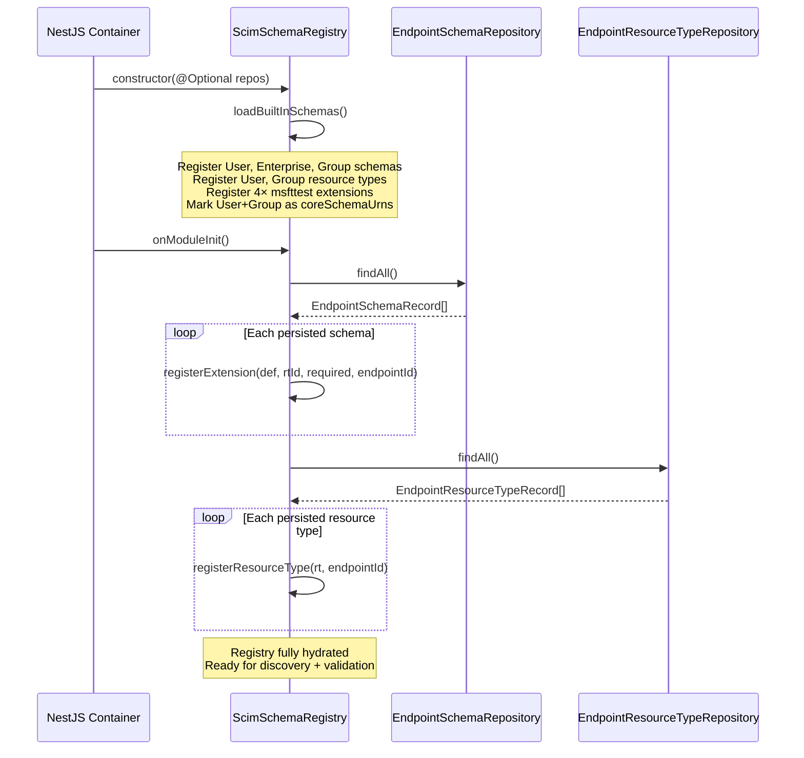
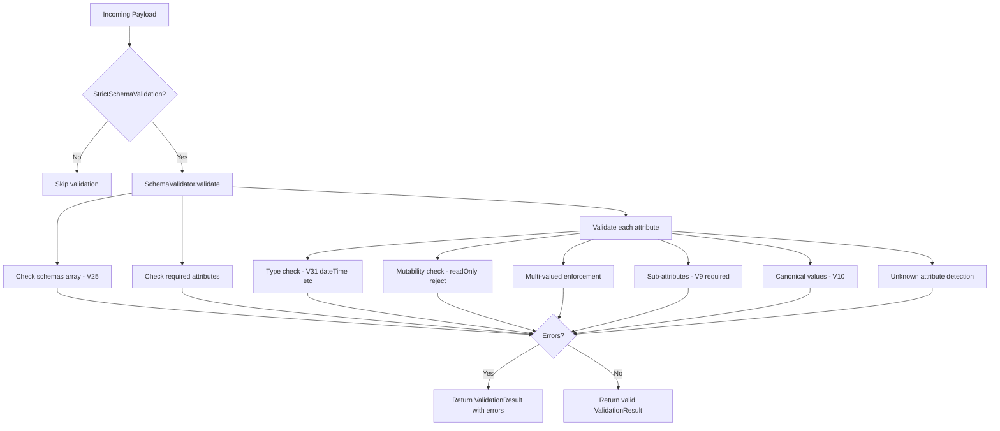
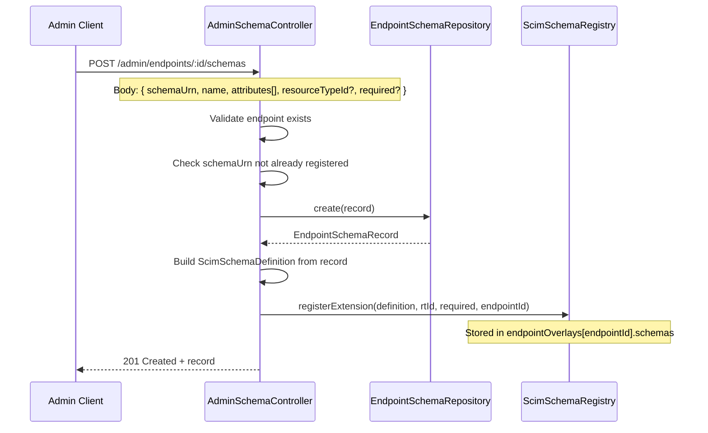
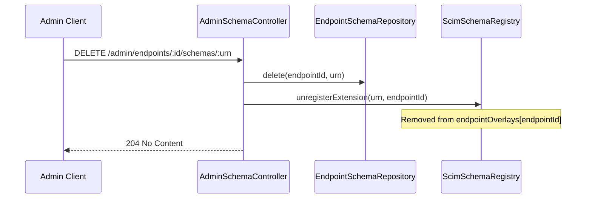
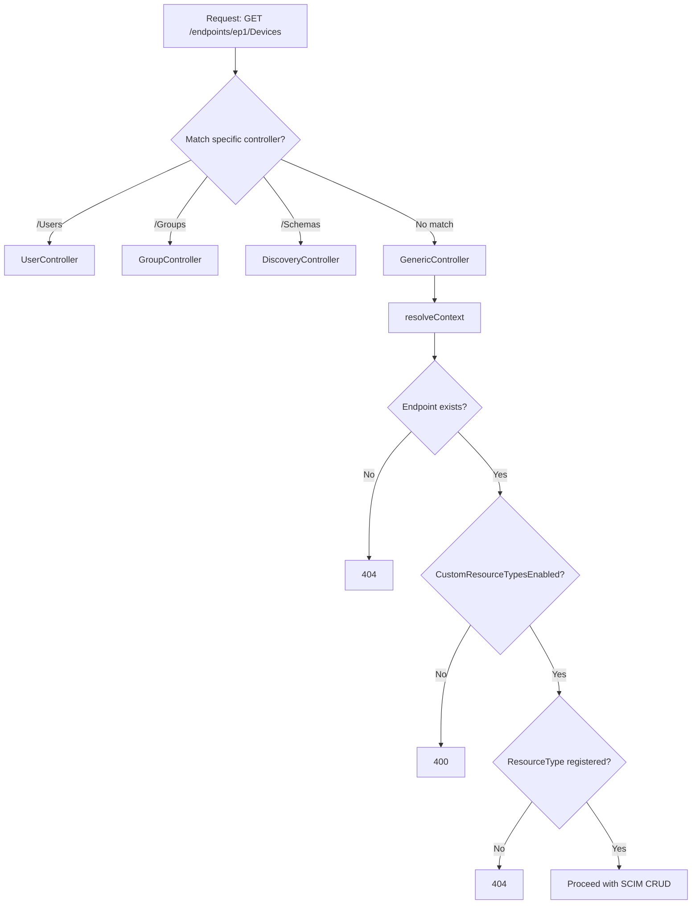

# Schema Lifecycle & Registry — Technical Internals

> **⚠️ Partially Superseded (v0.28.0)**: The `EndpointSchema` and `EndpointResourceType` tables/repos were removed in Phase 13. Schema data now lives in `Endpoint.profile` JSONB. See [SCHEMA_TEMPLATES_DESIGN.md](SCHEMA_TEMPLATES_DESIGN.md).

## Overview

**Document Type**: Architecture & Design Blueprint  
**Audience**: Contributors, maintainers, and anyone modifying schema-related code  
**Status**: ✅ Complete  
**Date**: March 2, 2026  
**Version**: 0.24.0

### Purpose

This document is the canonical technical reference for how SCIM schemas, extensions, and custom resource types are managed internally in the SCIMServer. It covers:

1. The two-layer registry architecture (global + per-endpoint overlay)
2. Schema lifecycle from boot to runtime mutation
3. Validation engine internals
4. Data persistence (Prisma + InMemory)
5. Discovery endpoint integration
6. Service-layer schema helpers
7. Configuration flag interactions

> **Cross-references:**
> - RFC rules → [RFC_SCHEMA_AND_EXTENSIONS_REFERENCE.md](RFC_SCHEMA_AND_EXTENSIONS_REFERENCE.md)
> - Operator how-to → [SCHEMA_CUSTOMIZATION_GUIDE.md](SCHEMA_CUSTOMIZATION_GUIDE.md)
> - Behavior matrices → [SCHEMA_EXTENSION_FLOWS_AND_COMBINATIONS.md](SCHEMA_EXTENSION_FLOWS_AND_COMBINATIONS.md)
> - Feature doc → [G8B_CUSTOM_RESOURCE_TYPE_REGISTRATION.md](G8B_CUSTOM_RESOURCE_TYPE_REGISTRATION.md)

---

## 1. Architecture Overview

```
┌──────────────────────────────────────────────────────────────────────────────┐
│                          SCIM Schema Architecture                           │
│                                                                              │
│  ┌─────────────────────────────────────────────────────────────────────────┐ │
│  │                    ScimSchemaRegistry (759 LOC)                         │ │
│  │                     @Injectable, OnModuleInit                          │ │
│  │                                                                         │ │
│  │  ┌───────────────────────────┐  ┌─────────────────────────────────────┐│ │
│  │  │     Global Layer          │  │      Per-Endpoint Overlays          ││ │
│  │  │                           │  │                                     ││ │
│  │  │  schemas: Map<urn, def>   │  │  endpointOverlays: Map<id, {       ││ │
│  │  │  resourceTypes: Map       │  │    schemas: Map<urn, def>          ││ │
│  │  │  extensionsByRT: Map      │  │    extensionsByRT: Map             ││ │
│  │  │  coreSchemaUrns: Set      │  │    resourceTypes: Map              ││ │
│  │  │                           │  │  }>                                ││ │
│  │  │  User, Group, Enterprise  │  │                                     ││ │
│  │  │  4× msfttest extensions   │  │  Per-endpoint extensions           ││ │
│  │  │                           │  │  Per-endpoint custom RTs           ││ │
│  │  └───────────────────────────┘  └─────────────────────────────────────┘│ │
│  └─────────────────────────────────────────────────────────────────────────┘ │
│                                                                              │
│  ┌──────────────────────┐  ┌──────────────────────┐  ┌──────────────────┐   │
│  │  SchemaValidator     │  │  ScimSchemaHelpers    │  │  GenericPatch    │   │
│  │  (1205 LOC)          │  │  (754 LOC)            │  │  Engine (195)    │   │
│  │  Pure domain class   │  │  Service integration  │  │  JSONB PATCH     │   │
│  │  All static methods  │  │  Config-gated         │  │  URN resolution  │   │
│  └──────────────────────┘  └──────────────────────┘  └──────────────────┘   │
│                                                                              │
│  ┌──────────────────────┐  ┌──────────────────────┐  ┌──────────────────┐   │
│  │  Schema Constants    │  │  Schema Types         │  │  SCIM Constants  │   │
│  │  (565 LOC)           │  │  (55 LOC)             │  │  (65 LOC)        │   │
│  │  deepFreeze'd defs   │  │  TypeScript ifaces    │  │  URN constants   │   │
│  └──────────────────────┘  └──────────────────────┘  └──────────────────┘   │
└──────────────────────────────────────────────────────────────────────────────┘
```

---

## 2. ScimSchemaRegistry — Central Lifecycle Manager

**File**: `api/src/modules/scim/discovery/scim-schema-registry.ts` (759 LOC)  
**Class**: `ScimSchemaRegistry` — `@Injectable()`, implements `OnModuleInit`

### 2.1 Data Structures

```typescript
// ─── Global Layer ───────────────────────────────
private readonly schemas = new Map<string, ScimSchemaDefinition>();
private readonly resourceTypes = new Map<string, ScimResourceType>();
private readonly extensionsByResourceType = new Map<string, Set<string>>();
private readonly coreSchemaUrns = new Set<string>();  // Immutable protection

// ─── Per-Endpoint Layer ─────────────────────────
private readonly endpointOverlays = new Map<string, EndpointOverlay>();
```

**`EndpointOverlay` interface:**

```typescript
interface EndpointOverlay {
  schemas: Map<string, ScimSchemaDefinition>;        // Extension schemas
  extensionsByResourceType: Map<string, Set<string>>; // URN → RT mapping
  resourceTypes: Map<string, ScimResourceType>;       // Custom resource types
}
```

### 2.2 Boot Sequence



### 2.3 `loadBuiltInSchemas()` — What Gets Registered at Boot

| Schema URN | Resource Type | Layer | Protected |
|------------|--------------|-------|-----------|
| `urn:ietf:params:scim:schemas:core:2.0:User` | User | Global | ✅ coreSchemaUrn |
| `urn:ietf:params:scim:schemas:core:2.0:Group` | Group | Global | ✅ coreSchemaUrn |
| `urn:ietf:params:scim:schemas:extension:enterprise:2.0:User` | User | Global | ❌ (extension) |
| `urn:msfttest:cloud:scim:schemas:extension:custom:2.0:User` | User | Global | ❌ |
| `urn:msfttest:cloud:scim:schemas:extension:custom:2.0:Group` | Group | Global | ❌ |
| `urn:ietf:params:scim:schemas:extension:msfttest:User` | User | Global | ❌ |
| `urn:ietf:params:scim:schemas:extension:msfttest:Group` | Group | Global | ❌ |

**Microsoft test extension structure** — Each msfttest extension has a single attribute:

```typescript
{
  name: 'name',
  type: 'string',
  multiValued: false,
  required: false,
  mutability: 'readWrite',
  returned: 'default',
  caseExact: false,
  uniqueness: 'none'
}
```

### 2.4 Core Schema Protection

The `coreSchemaUrns` Set prevents accidental or malicious modification:

```typescript
// In registerExtension():
if (this.coreSchemaUrns.has(schema.id)) {
  throw new Error(`Cannot overwrite core schema: ${schema.id}`);
}

// In unregisterExtension():
if (this.coreSchemaUrns.has(schemaUrn)) {
  throw new Error(`Cannot unregister core schema: ${schemaUrn}`);
}
```

Only two URNs are protected: `urn:...core:2.0:User` and `urn:...core:2.0:Group`.

### 2.5 Method Reference

#### Registration Methods

| Method | Signature | Description |
|--------|-----------|-------------|
| `registerExtension()` | `(schema: ScimSchemaDefinition, resourceTypeId?: string, required?: boolean, endpointId?: string): void` | Registers extension schema globally or per-endpoint. Validates: non-empty `id`, not a core schema URN, resource type exists. If `endpointId` is provided, stores in overlay; otherwise global. |
| `unregisterExtension()` | `(schemaUrn: string, endpointId?: string): boolean` | Removes extension from global or per-endpoint layer. Returns `false` for core schemas. |
| `registerResourceType()` | `(resourceType: ScimResourceType, endpointId: string): void` | Registers custom resource type in per-endpoint overlay only. |
| `unregisterResourceType()` | `(resourceTypeId: string, endpointId: string): boolean` | Removes custom resource type from endpoint overlay. |

#### Query Methods

| Method | Signature | Resolution Order |
|--------|-----------|-----------------|
| `getSchema()` | `(urn: string, endpointId?: string)` | Overlay first → global fallback |
| `getAllSchemas()` | `(endpointId?: string)` | Global + overlay merged (overlay wins on collision) |
| `getResourceType()` | `(id: string, endpointId?: string)` | Overlay first → global fallback |
| `getAllResourceTypes()` | `(endpointId?: string)` | Global merged with overlay extensions + custom RTs |
| `getExtensionUrns()` | `(endpointId?: string)` | All extension URNs across all resource types |
| `getExtensionUrnsForResourceType()` | `(rtId: string, endpointId?: string)` | Global + overlay combined |
| `hasSchema()` | `(urn: string, endpointId?: string)` | Boolean check in overlay then global |
| `hasResourceType()` | `(id: string, endpointId?: string)` | Boolean check in overlay then global |
| `isCoreSchema()` | `(urn: string)` | Checks `coreSchemaUrns` set |
| `findResourceTypeByEndpointPath()` | `(path: string, endpointId: string)` | Searches overlay custom RTs by `endpoint` field |

#### Config & Utility Methods

| Method | Signature | Description |
|--------|-----------|-------------|
| `getServiceProviderConfig()` | `(config?: EndpointConfig)` | Dynamic SPC with `bulk.supported` from config flag |
| `getEndpointIds()` | `(): string[]` | Returns all endpoint IDs that have overlays |
| `clearEndpointOverlay()` | `(endpointId: string): void` | Removes all per-endpoint customizations |

### 2.6 Merge Semantics

When querying schemas or resource types with an `endpointId`:

```
┌─────────────────────┐      ┌─────────────────────┐
│    Global Layer      │      │  Endpoint Overlay    │
│                      │      │                      │
│  User schema         │  +   │  CustomExt schema    │  →  Result includes both
│  Group schema        │      │                      │
│  Enterprise ext      │      │  Custom RT "Device"  │
│  4× msfttest         │      │                      │
│                      │      │                      │
│  User RT             │      │                      │
│  Group RT            │      │                      │
└─────────────────────-┘      └──────────────────────┘

getAllSchemas(endpointId) → Global schemas + Overlay schemas (deduped by URN, overlay wins)
getAllResourceTypes(endpointId) → Global RTs with overlay extensions merged + custom RTs
```

**Resource type merging logic** (in `getAllResourceTypes`):

For each global resource type (User, Group), the merged result includes:
- Global `schemaExtensions[]` PLUS overlay `extensionsByResourceType` entries
- This means a per-endpoint extension appears in the resource type's `schemaExtensions[]` in discovery

---

## 3. Schema Definitions — Static Constants

**File**: `api/src/modules/scim/discovery/scim-schemas.constants.ts` (565 LOC)

### 3.1 Exported Schema Constants

| Constant | Lines | Attributes | Description |
|----------|-------|------------|-------------|
| `USER_SCHEMA_ATTRIBUTES` | ~200 | 20 top-level | `id`, `userName`, `name` (6 subs), `displayName`, `nickName`, `profileUrl`, `title`, `userType`, `preferredLanguage`, `locale`, `timezone`, `active`, `emails` (3 subs), `phoneNumbers` (3 subs), `addresses` (8 subs), `roles` (4 subs), `groups` (4 subs, readOnly), `password` (writeOnly, returned:never), `externalId`, `meta` (5 subs, readOnly) |
| `ENTERPRISE_USER_ATTRIBUTES` | ~50 | 6 top-level | `employeeNumber`, `costCenter`, `organization`, `division`, `department`, `manager` (3 subs — `value`, `$ref`, `displayName` [readOnly]) |
| `GROUP_SCHEMA_ATTRIBUTES` | ~80 | 6 top-level | `id`, `displayName`, `members` (4 subs), `externalId`, `active`, `meta` (5 subs) |
| `SCIM_USER_SCHEMA_DEFINITION` | — | — | Full `ScimSchemaDefinition` wrapping `USER_SCHEMA_ATTRIBUTES` |
| `SCIM_ENTERPRISE_USER_SCHEMA_DEFINITION` | — | — | Full `ScimSchemaDefinition` wrapping `ENTERPRISE_USER_ATTRIBUTES` |
| `SCIM_GROUP_SCHEMA_DEFINITION` | — | — | Full `ScimSchemaDefinition` wrapping `GROUP_SCHEMA_ATTRIBUTES` |
| `SCIM_USER_RESOURCE_TYPE` | — | — | `endpoint: '/Users'`, `schemaExtensions: [EnterpriseUser]` |
| `SCIM_GROUP_RESOURCE_TYPE` | — | — | `endpoint: '/Groups'`, `schemaExtensions: []` |
| `SCIM_SERVICE_PROVIDER_CONFIG` | — | — | `patch:true`, `bulk:true/1000/1MB`, `filter:true/200`, `sort:true`, `etag:true`, `changePassword:false` |

### 3.2 Runtime Immutability

All constants are `deepFreeze()`d:

```typescript
export const SCIM_USER_SCHEMA_DEFINITION = deepFreeze({ ... });
export const SCIM_GROUP_SCHEMA_DEFINITION = deepFreeze({ ... });
// etc.
```

This means these objects cannot be modified at runtime — `Object.isFrozen()` returns `true` recursively. The constants serve as templates that the registry reads from but never mutates.

### 3.3 Key Attribute Characteristics

| Attribute | Type | Mutability | Returned | Required | UniqueNess | Multi-Valued |
|-----------|------|-----------|----------|----------|------------|-------------|
| `id` | string | readOnly | always | true (server) | server | false |
| `userName` | string | readWrite | default | true | server | false |
| `password` | string | writeOnly | **never** | false | none | false |
| `active` | boolean | readWrite | default | false | none | false |
| `groups` (User) | complex | **readOnly** | default | false | none | **true** |
| `emails` | complex | readWrite | default | false | none | true |
| `meta` | complex | **readOnly** | default | false | none | false |
| `displayName` (Group) | string | readWrite | default | true | none | false |
| `members` | complex | readWrite | default | false | none | true |
| `members.value` | string | **immutable** | default | false | none | false |

---

## 4. SchemaValidator — Pure Domain Validation Engine

**File**: `api/src/domain/validation/schema-validator.ts` (1205 LOC)  
**Class**: `SchemaValidator` — Pure domain class, **zero NestJS dependencies**, all methods are `static`

### 4.1 Validation Flow



### 4.2 Validation Methods Reference

| Method | Purpose | Invoked By | Gated By |
|--------|---------|-----------|----------|
| `validate()` | Full payload validation (10 checks) | `ScimSchemaHelpers.validatePayloadSchema()` | `StrictSchemaValidation` |
| `checkImmutable()` | H-2 immutable attribute enforcement | `ScimSchemaHelpers.checkImmutableAttributes()` | `StrictSchemaValidation` |
| `validatePatchOperationValue()` | G8c readOnly PATCH pre-validation | User/Group/Generic services | Always (not gated) |
| `validateFilterAttributePaths()` | V32 filter attribute path validation | Filter processing | `StrictSchemaValidation` |
| `collectBooleanAttributeNames()` | V16 boolean coercion target set | `ScimSchemaHelpers.getBooleanKeys()` | `AllowAndCoerceBooleanStrings` |
| `collectReturnedCharacteristics()` | G8e returned filtering targets | `ScimSchemaHelpers.getReturnedCharacteristics()` | Always |
| `collectCaseExactAttributes()` | R-CASE-1 case-sensitive filter paths | `ScimSchemaHelpers.getCaseExactAttributes()` | Always |
| `collectReadOnlyAttributes()` | readOnly stripping targets | `ScimSchemaHelpers.stripReadOnlyAttributesFromPayload()` | Always |

### 4.3 Reserved Keys

```typescript
private static readonly RESERVED_KEYS = new Set(['schemas', 'id', 'externalId', 'meta']);
```

These keys are skipped during unknown-attribute detection because they are RFC-defined common attributes, not part of individual schema definitions.

### 4.4 PATCH Path Resolution

The `resolvePatchPath()` method handles multiple path formats:

| Path Format | Example | Resolution |
|-------------|---------|------------|
| Simple | `displayName` | Look up in core attributes |
| Dotted | `name.familyName` | Walk attribute → subAttributes |
| URN-prefixed | `urn:...enterprise:2.0:User:department` | Split URN → look up in extension schemas |
| Filtered | `emails[type eq "work"]` | Strip filter → resolve base attribute |
| Filtered + sub | `emails[type eq "work"].value` | Strip filter → resolve base → subAttribute |

The URN regex used:

```typescript
const urnMatch = path.match(/^(urn:[^:]+(?::[^:]+)*):([^[]+)/);
```

---

## 5. Data Persistence Layer

### 5.1 Database Schema

**Table**: `EndpointSchema`

| Column | Type | Description |
|--------|------|-------------|
| `id` | UUID | Primary key |
| `endpointId` | String | FK to Endpoint table |
| `schemaUrn` | String | Extension URN (unique per endpoint) |
| `name` | String | Human-readable name |
| `description` | String | Optional description |
| `resourceTypeId` | String | Target resource type (e.g., "User") |
| `required` | Boolean | Whether extension is mandatory |
| `attributes` | JSONB | Full attribute definitions array |
| `createdAt` | DateTime | Creation timestamp |
| `updatedAt` | DateTime | Last update timestamp |

**Table**: `EndpointResourceType`

| Column | Type | Description |
|--------|------|-------------|
| `id` | UUID | Primary key |
| `endpointId` | String | FK to Endpoint table |
| `name` | String | Resource type name (unique per endpoint) |
| `schemaUri` | String | Core schema URN |
| `endpoint` | String | URL path (e.g., "/Devices") |
| `schemaExtensions` | JSONB | Extension declarations array |
| `active` | Boolean | Whether type is active |
| `createdAt` | DateTime | Creation timestamp |
| `updatedAt` | DateTime | Last update timestamp |

### 5.2 Repository Interfaces

**File**: `api/src/domain/repositories/endpoint-schema.repository.interface.ts`

```typescript
export interface IEndpointSchemaRepository {
  create(input: EndpointSchemaCreateInput): Promise<EndpointSchemaRecord>;
  findAll(): Promise<EndpointSchemaRecord[]>;
  findByEndpointId(endpointId: string): Promise<EndpointSchemaRecord[]>;
  findByUrn(endpointId: string, schemaUrn: string): Promise<EndpointSchemaRecord | null>;
  delete(endpointId: string, schemaUrn: string): Promise<void>;
  deleteAll(): Promise<void>;
}
```

### 5.3 Repository Implementations

| Implementation | File | Backend | Notes |
|---------------|------|---------|-------|
| Prisma | `prisma-endpoint-schema.repository.ts` | PostgreSQL | Full CRUD with Prisma ORM |
| InMemory | `inmemory-endpoint-schema.repository.ts` | JavaScript Map | Used for inmemory backend mode |

### 5.4 Domain Model

**File**: `api/src/domain/models/endpoint-schema.model.ts`

```typescript
export interface EndpointSchemaRecord {
  id: string;
  endpointId: string;
  schemaUrn: string;
  name: string;
  description: string;
  resourceTypeId: string;
  required: boolean;
  attributes: any[];  // ScimSchemaAttribute[]
  createdAt: Date;
  updatedAt: Date;
}

export interface EndpointSchemaCreateInput {
  endpointId: string;
  schemaUrn: string;
  name: string;
  description: string;
  resourceTypeId: string;
  required: boolean;
  attributes: any[];
}
```

### 5.5 DTO Validation

**File**: `api/src/modules/scim/dto/create-endpoint-schema.dto.ts`

```typescript
export class CreateEndpointSchemaDto {
  @IsString() @IsNotEmpty()
  schemaUrn: string;

  @IsString() @IsNotEmpty()
  name: string;

  @IsString() @IsOptional()
  description?: string;

  @IsString() @IsOptional()
  resourceTypeId?: string;

  @IsBoolean() @IsOptional()
  required?: boolean;

  @IsArray()
  attributes: any[];
}
```

---

## 6. Admin Controllers — Runtime Schema Mutation

### 6.1 AdminSchemaController

**File**: `api/src/modules/scim/controllers/admin-schema.controller.ts` (188 LOC)  
**Route**: `POST|GET|DELETE /admin/endpoints/:endpointId/schemas`

#### Registration Flow



#### Deregistration Flow



### 6.2 AdminResourceTypeController

**File**: `api/src/modules/scim/controllers/admin-resource-type.controller.ts` (209 LOC)  
**Route**: `POST|GET|DELETE /admin/endpoints/:endpointId/resource-types`

#### Guards and Validations

| Check | Error | Purpose |
|-------|-------|---------|
| `CustomResourceTypesEnabled` flag | 400 | Feature gating per endpoint |
| Reserved names (`User`, `Group`) | 400 | Cannot override built-in types |
| Reserved paths (`/Users`, `/Groups`, `/Schemas`, `/ResourceTypes`, `/ServiceProviderConfig`, `/Bulk`, `/Me`) | 400 | Cannot conflict with SCIM endpoints |
| Duplicate name check | 409 | Unique per endpoint |

#### Custom Resource Type Object

```typescript
{
  schemas: ["urn:ietf:params:scim:schemas:core:2.0:ResourceType"],
  id: "Device",
  name: "Device",
  endpoint: "/Devices",
  description: "Custom device resource",
  schema: "urn:example:scim:schemas:core:2.0:Device",
  schemaExtensions: [],
  meta: {
    resourceType: "ResourceType",
    location: "/ResourceTypes/Device"
  }
}
```

---

## 7. Discovery Integration

### 7.1 Discovery Controller

**File**: `api/src/modules/scim/controllers/endpoint-scim-discovery.controller.ts` (152 LOC)  
**Decorator**: `@Public()` — No authentication required (RFC 7644 §4)

| Route | Method | Delegates To |
|-------|--------|-------------|
| `GET /endpoints/:id/Schemas` | `getSchemas()` | `ScimDiscoveryService.getSchemas(endpointId)` |
| `GET /endpoints/:id/Schemas/:uri` | `getSchemaByUri()` | `ScimDiscoveryService.getSchemaByUrn(uri, endpointId)` |
| `GET /endpoints/:id/ResourceTypes` | `getResourceTypes()` | `ScimDiscoveryService.getResourceTypes(endpointId)` |
| `GET /endpoints/:id/ResourceTypes/:id` | `getResourceTypeById()` | `ScimDiscoveryService.getResourceTypeById(id, endpointId)` |
| `GET /endpoints/:id/ServiceProviderConfig` | `getServiceProviderConfig()` | `ScimDiscoveryService.getServiceProviderConfig(config)` |

### 7.2 Discovery Service

**File**: `api/src/modules/scim/discovery/scim-discovery.service.ts` (138 LOC)

Pure delegation layer to `ScimSchemaRegistry`:

```typescript
getSchemas(endpointId?) {
  const schemas = this.schemaRegistry.getAllSchemas(endpointId);
  return { schemas: [SCIM_LIST_RESPONSE_SCHEMA], totalResults: schemas.length, ... };
}

getSchemaByUrn(urn, endpointId?) {
  const schema = this.schemaRegistry.getSchema(urn, endpointId);
  if (!schema) throw new ScimException(404, 'Schema not found');
  return schema;
}
```

### 7.3 Response Schema Building

**`buildResourceSchemas()`** — Dynamically builds the `schemas[]` array for outbound resources:

```typescript
buildResourceSchemas(payload, coreSchema, extensionUrns?, endpointId?) {
  const schemas = [coreSchema];
  for (const urn of extensionUrns) {
    if (payload[urn] !== undefined) {
      schemas.push(urn);
    }
  }
  return schemas;
}
```

Only includes extension URNs that actually have data in the payload — matching RFC 7643 §3.1 semantics.

---

## 8. Service-Layer Schema Helpers

**File**: `api/src/modules/scim/common/scim-service-helpers.ts` (754 LOC)

### 8.1 Pure Utility Functions

| Function | Purpose | Used By |
|----------|---------|--------|
| `parseJson<T>()` | Safe JSON parse with error handling | General |
| `ensureSchema()` | Validates required schema URN in schemas[] (case-insensitive) | User/Group services |
| `enforceIfMatch()` | If-Match / 412 / 428 logic | PUT/PATCH handlers |
| `sanitizeBooleanStrings()` | Recursively converts "True"/"False" strings to booleans for declared boolean attributes only | `coerceBooleanStringsIfEnabled()` |
| `guardSoftDeleted()` | Throws 404 for soft-deleted resources | GET/PUT/PATCH handlers |
| `stripReadOnlyAttributes()` | Removes readOnly attributes from POST/PUT payload using schema definitions | User/Group/Generic services |
| `stripReadOnlyPatchOps()` | Filters out PATCH operations targeting readOnly attributes | PATCH handlers |

### 8.2 ScimSchemaHelpers Class

Parameterized by `SchemaRegistry` + core schema URN. Each service (User, Group, Generic) creates its own instance.

| Method | Config Gate | Description |
|--------|------------|-------------|
| `enforceStrictSchemaValidation()` | `StrictSchemaValidation` | Rejects undeclared/unregistered extension URNs in body |
| `validatePayloadSchema()` | `StrictSchemaValidation` | Runs full `SchemaValidator.validate()` |
| `buildSchemaDefinitions()` | None | Core schema + declared extensions from registry |
| `getSchemaDefinitions()` | None | Core + ALL registered extensions |
| `getBooleanKeys()` | None | Collects boolean attr names for coercion |
| `getReturnedCharacteristics()` | None | `SchemaValidator.collectReturnedCharacteristics()` |
| `getRequestOnlyAttributes()` | None | `returned:'request'` attrs |
| `getAlwaysReturnedAttributes()` | None | `returned:'always'` attrs |
| `getAlwaysReturnedSubAttrs()` | None | R-RET-3 sub-attrs |
| `getCaseExactAttributes()` | None | R-CASE-1 |
| `getExtensionUrns()` | None | Delegates to registry |
| `stripReadOnlyAttributesFromPayload()` | None | Schema-aware stripping |
| `stripReadOnlyFromPatchOps()` | None | Schema-aware PATCH op filtering |
| `coerceBooleanStringsIfEnabled()` | `AllowAndCoerceBooleanStrings` | Boolean string coercion |
| `checkImmutableAttributes()` | `StrictSchemaValidation` | H-2: Immutable enforcement |

### 8.3 Schema Definition Resolution

Two flavors depending on validation mode:

```
buildSchemaDefinitions(payload):
  1. Take core schema definition (User/Group)
  2. Check payload's schemas[] array
  3. For each declared extension URN → resolve from registry
  4. Return [coreSchema, ...declaredExtensions]
  → Used for: strict per-request validation

getSchemaDefinitions(endpointId):
  1. Take core schema definition
  2. Get ALL extension URNs from registry (for this endpoint)
  3. Resolve each → return [coreSchema, ...allExtensions]
  → Used for: returned characteristic filtering, readOnly stripping
```

---

## 9. Generic SCIM Controller & Service

### 9.1 Generic Controller

**File**: `api/src/modules/scim/controllers/endpoint-scim-generic.controller.ts` (269 LOC)  
**Route**: `endpoints/:endpointId/:resourceType` — Wildcard catch-all  
**Registration**: LAST in NestJS module to avoid conflicting with `/Users`, `/Groups`, `/Schemas`, etc.

#### Route Resolution



### 9.2 Generic Service

**File**: `api/src/modules/scim/services/endpoint-scim-generic.service.ts` (587 LOC)

Key schema-related method:

```typescript
getSchemaDefinitions(resourceType: ScimResourceType, endpointId: string): ScimSchemaDefinition[] {
  const coreSchema = this.schemaRegistry.getSchema(resourceType.schema, endpointId);
  const extensionUrns = this.schemaRegistry.getExtensionUrnsForResourceType(resourceType.id, endpointId);
  const extensions = extensionUrns.map(urn => this.schemaRegistry.getSchema(urn, endpointId)).filter(Boolean);
  return [coreSchema, ...extensions];
}
```

### 9.3 GenericPatchEngine

**File**: `api/src/domain/patch/generic-patch-engine.ts` (195 LOC)

**Key**: URN path resolution for extension attributes in PATCH operations:

```typescript
// Regex handles dots in URN version numbers (e.g., 2.0)
const urnMatch = path.match(/^(urn:[^.]+(?:\.\d+)*(?::[^.]+)*)\.(.+)$/);

if (urnMatch) {
  const [, urn, subPath] = urnMatch;
  // Navigate into: payload[urn][subPath] = value
}
```

---

## 10. Configuration Flags

### 10.1 Schema-Related Flags

**File**: `api/src/config/endpoint-config.interface.ts` (442 LOC)

| Flag | Default | Schema Impact |
|------|---------|---------------|
| `StrictSchemaValidation` | `false` | Full schema validation on write: required attrs, type checks, unknown attrs, schemas[] validation, immutable enforcement |
| `CustomResourceTypesEnabled` | `false` | Gates custom resource type registration and generic SCIM CRUD |
| `AllowAndCoerceBooleanStrings` | `true` | Coerces "True"/"False" strings to booleans using schema-declared boolean attributes |
| `IncludeWarningAboutIgnoredReadOnlyAttribute` | `false` | Adds warning URN to responses when readOnly attributes were stripped on write |
| `IgnoreReadOnlyAttributesInPatch` | `false` | Strip (instead of reject) readOnly attributes in PATCH operations when strict mode is on |

### 10.2 Flag Interaction Matrix

| Scenario | `StrictSchemaValidation` | Effect |
|----------|--------------------------|--------|
| Unknown extension URN in body | `false` | Stored as raw JSONB, no validation |
| Unknown extension URN in body | `true` | Rejected with 400 |
| ReadOnly attribute in POST body | `false` | Silently stripped |
| ReadOnly attribute in POST body | `true` | Rejected with 400 (unless `IgnoreReadOnly...` is true) |
| Immutable attribute changed in PUT | `false` | No check |
| Immutable attribute changed in PUT | `true` | Rejected with 400 (H-2) |
| schemas[] missing in POST body | `false` | Auto-built from core URN |
| schemas[] missing in POST body | `true` | Rejected with 400 |

---

## 11. Type System

### 11.1 Core TypeScript Interfaces

**File**: `api/src/modules/scim/common/scim-types.ts` (55 LOC)

```typescript
export interface ScimMeta {
  resourceType: string;
  created: string;
  lastModified: string;
  location: string;
  version?: string;
}

export interface ScimUserResource {
  schemas: string[];
  id: string;
  userName: string;
  externalId?: string;
  active?: boolean;
  name?: Record<string, string>;
  emails?: Array<Record<string, unknown>>;
  groups?: Array<Record<string, unknown>>;
  meta: ScimMeta;
  [key: string]: unknown;  // Extension pass-through
}

export interface ScimGroupResource {
  schemas: string[];
  id: string;
  displayName: string;
  active?: boolean;
  members?: Array<Record<string, unknown>>;
  meta: ScimMeta;
  [key: string]: unknown;  // Extension pass-through
}

export interface ScimListResponse<T> {
  schemas: string[];
  totalResults: number;
  startIndex: number;
  itemsPerPage: number;
  Resources: T[];
}
```

> **Key design**: `[key: string]: unknown` on both `ScimUserResource` and `ScimGroupResource` allows extension URN keys to pass through TypeScript type checking without explicit declarations.

### 11.2 Schema Registry Interfaces

**File**: `api/src/modules/scim/discovery/scim-schema-registry.ts` (exported interfaces)

```typescript
export interface ScimSchemaAttribute {
  name: string;
  type: string;           // 'string' | 'boolean' | 'integer' | 'decimal' | 'dateTime' | 'reference' | 'complex' | 'binary'
  multiValued: boolean;
  required: boolean;
  mutability: string;     // 'readOnly' | 'readWrite' | 'immutable' | 'writeOnly'
  returned: string;       // 'always' | 'never' | 'default' | 'request'
  caseExact: boolean;
  uniqueness: string;     // 'none' | 'server' | 'global'
  referenceTypes?: string[];
  subAttributes?: ScimSchemaAttribute[];
  canonicalValues?: string[];
  description?: string;
}

export interface ScimSchemaDefinition {
  schemas: string[];
  id: string;             // Schema URN
  name: string;
  description?: string;
  attributes: ScimSchemaAttribute[];
  meta?: { resourceType: string; location: string };
}

export interface SchemaExtensionRef {
  schema: string;         // Extension URN
  required: boolean;
}

export interface ScimResourceType {
  schemas: string[];
  id: string;
  name: string;
  endpoint: string;
  description?: string;
  schema: string;         // Core schema URN
  schemaExtensions: SchemaExtensionRef[];
  meta?: { resourceType: string; location: string };
}
```

---

## 12. File Inventory

| File | LOC | Layer | Purpose |
|------|-----|-------|---------|
| `scim-schema-registry.ts` | 759 | Application | Central registry — lifecycle, merge, query |
| `schema-validator.ts` | 1205 | Domain | Pure validation engine — all static methods |
| `scim-schemas.constants.ts` | 565 | Application | Deep-frozen schema definitions |
| `scim-service-helpers.ts` | 754 | Application | Service integration — config-gated helpers |
| `endpoint-config.interface.ts` | 442 | Config | Config flags + defaults + validators |
| `endpoint-scim-generic.controller.ts` | 269 | Controller | Wildcard SCIM CRUD for custom RTs |
| `endpoint-scim-generic.service.ts` | 587 | Service | Generic resource CRUD + schema resolution |
| `generic-patch-engine.ts` | 195 | Domain | JSONB PATCH with URN path resolution |
| `admin-schema.controller.ts` | 188 | Controller | Admin API for schema extensions |
| `admin-resource-type.controller.ts` | 209 | Controller | Admin API for custom resource types |
| `endpoint-scim-discovery.controller.ts` | 152 | Controller | RFC 7644 §4 discovery endpoints |
| `scim-discovery.service.ts` | 138 | Service | Discovery delegation to registry |
| `scim-constants.ts` | 65 | Shared | URN constants + error types |
| `scim-types.ts` | 55 | Shared | TypeScript interfaces |
| `endpoint-schema.model.ts` | ~40 | Domain | Domain model interfaces |
| `endpoint-schema.repository.interface.ts` | ~30 | Domain | Repository interface (6 methods) |
| `prisma-endpoint-schema.repository.ts` | ~80 | Infra | Prisma implementation |
| `inmemory-endpoint-schema.repository.ts` | ~60 | Infra | InMemory implementation |
| `create-endpoint-schema.dto.ts` | ~30 | DTO | class-validator DTO |
| **Total** | **~5,823** | | Schema-related code |

---

*Last updated: March 2, 2026*
