# Endpoint Profile Configuration — Design Document

> **Version**: 0.28.0 | **Phase**: 13 | **Status**: 📐 Design — All Decisions Finalized
> **RFC References**: RFC 7643 §2–§7; RFC 7644 §4; RFC 7642 §5
> **Date**: March 12, 2026

---

## Table of Contents

- [1. Problem Statement](#1-problem-statement)
- [2. Design Principle — Use the Standard](#2-design-principle--use-the-standard)
- [3. RFC Foundations](#3-rfc-foundations)
  - [3.1 The Three Discovery Documents](#31-the-three-discovery-documents)
  - [3.2 What the RFCs Require vs. Allow](#32-what-the-rfcs-require-vs-allow)
  - [3.3 The Tighten-Only Principle](#33-the-tighten-only-principle)
- [4. Current Admin API — Redundancy Audit](#4-current-admin-api--redundancy-audit)
- [5. The Unified Design](#5-the-unified-design)
  - [5.1 Core Idea](#51-core-idea)
  - [5.2 The Endpoint Object — Before & After](#52-the-endpoint-object--before--after)
  - [5.3 Embedded Profile — Design Rationale](#53-embedded-profile--design-rationale)
  - [5.4 Named Presets](#54-named-presets)
  - [5.5 Built-in Presets Summary](#55-built-in-presets-summary)
  - [5.6 RFC-Aware Auto-Expand](#56-rfc-aware-auto-expand)
  - [5.7 Validation Engine](#57-validation-engine)
- [6. Unified Admin API](#6-unified-admin-api)
  - [6.1 Complete API Surface](#61-complete-api-surface)
  - [6.2 Endpoint Creation — Three Paths](#62-endpoint-creation--three-paths)
  - [6.3 Endpoint Lifecycle](#63-endpoint-lifecycle)
  - [6.4 PATCH Merge Strategy](#64-patch-merge-strategy)
  - [6.5 What Gets Eliminated](#65-what-gets-eliminated)
- [7. Architecture](#7-architecture)
  - [7.1 High-Level Architecture](#71-high-level-architecture)
  - [7.2 Request Flow — Discovery](#72-request-flow--discovery)
  - [7.3 Data Model Changes](#73-data-model-changes)
- [8. Built-in Presets — Complete Definitions](#8-built-in-presets--complete-definitions)
  - [8.1 entra-id (Default)](#81-entra-id-default)
  - [8.2 entra-id-minimal](#82-entra-id-minimal)
  - [8.3 rfc-standard](#83-rfc-standard)
  - [8.4 minimal](#84-minimal)
  - [8.5 user-only](#85-user-only)
  - [8.6 Preset Comparison Matrix](#86-preset-comparison-matrix)
- [9. Settings Reference](#9-settings-reference)
  - [9.1 Persisted Settings (13)](#91-persisted-settings-13)
  - [9.2 Derived Settings (2)](#92-derived-settings-2)
- [10. RFC Compliance Analysis](#10-rfc-compliance-analysis)
  - [10.1 Required Attributes Audit](#101-required-attributes-audit)
  - [10.2 Guardrails — RFC vs. Project](#102-guardrails--rfc-vs-project)
  - [10.3 What Can Be Customized](#103-what-can-be-customized)
  - [10.4 What Cannot Be Customized](#104-what-cannot-be-customized)
- [11. Feature-by-Feature Validation](#11-feature-by-feature-validation)
- [12. Examples](#12-examples)
  - [12.1 Quick Start — Default Preset](#121-quick-start--default-preset)
  - [12.2 Explicit Preset Selection](#122-explicit-preset-selection)
  - [12.3 Inline Profile at Creation](#123-inline-profile-at-creation)
  - [12.4 Preset + Customize (Hybrid)](#124-preset--customize-hybrid)
  - [12.5 Clone from Existing Server](#125-clone-from-existing-server)
  - [12.6 Minimal Input — Auto-Expand](#126-minimal-input--auto-expand)
- [13. Deployment Notes](#13-deployment-notes)
- [14. Resolved Design Decisions](#14-resolved-design-decisions)
- [15. Implementation Plan](#15-implementation-plan)
  - [15.1 Phase 1 — Data Model & Presets](#151-phase-1--data-model--presets)
  - [15.2 Phase 2 — Validation Engine](#152-phase-2--validation-engine)
  - [15.3 Phase 3 — Admin API Changes](#153-phase-3--admin-api-changes)
  - [15.4 Phase 4 — Registry Hydration Refactor](#154-phase-4--registry-hydration-refactor)
  - [15.5 Phase 5 — InMemory Backend Alignment](#155-phase-5--inmemory-backend-alignment)
  - [15.6 Phase 6 — Test Suite](#156-phase-6--test-suite)
  - [15.7 Phase 7 — Cleanup & Documentation](#157-phase-7--cleanup--documentation)
  - [15.8 Dependency Graph](#158-dependency-graph)
  - [15.9 Effort Estimate](#159-effort-estimate)
- [16. Open / Deferred Items](#16-open--deferred-items)
- [17. Cross-References](#17-cross-references)

---

## 1. Problem Statement

Today, configuring a SCIM endpoint's schema requires **4 separate APIs** touching **3 child tables**:

```
POST /admin/endpoints                            Create endpoint + config flags
POST /admin/endpoints/:id/schemas                Register extension schema (per-extension)
POST /admin/endpoints/:id/resource-types         Register custom resource type (per-type)
POST /admin/endpoints/:id/credentials            Register auth credential (per-credential)
```

**Problems:**

| # | Problem | Impact |
|---|---------|--------|
| 1 | **No way to declare which core attributes an endpoint supports** | `/Schemas` always returns all 20+ User attributes even if the endpoint uses 5 |
| 2 | **No way to tighten attribute characteristics** | Can't express "require `emails` on User" — a universal real-world need |
| 3 | **No single view of endpoint's complete schema** | Must query 3 APIs + parse config flags to understand what an endpoint does |
| 4 | **No reusable profiles** | Every endpoint configured from scratch; can't say "make it like Entra ID" |
| 5 | **Redundant APIs** | Extension schemas and resource types have their own CRUD when they could live inside the endpoint profile |
| 6 | **Proprietary format** | The schema/resource-type Admin APIs use custom DTOs when the RFCs already define the exact JSON for these |
| 7 | **Can't clone from another server** | No way to say "give me the same schema as server X" |

**Goal**: Replace the fragmented approach with a single, RFC-native configuration mechanism.

```mermaid
graph TB
    subgraph "Current: 4 APIs, 3 Tables"
        A[POST /admin/endpoints] --> EP[(Endpoint)]
        B[POST /admin/.../schemas] --> ES[(EndpointSchema)]
        C[POST /admin/.../resource-types] --> ERT[(EndpointResourceType)]
        D[POST /admin/.../credentials] --> EC[(EndpointCredential)]
    end

    subgraph "New: 1 API, 1 Field"
        E[POST /admin/endpoints<br/>{ name, profilePreset? }] --> EP2[(Endpoint.profile JSONB)]
        F[POST /admin/.../credentials] --> EC2[(EndpointCredential)]
    end

    style EP fill:#f88,stroke:#a00
    style ES fill:#f88,stroke:#a00
    style ERT fill:#f88,stroke:#a00
    style EP2 fill:#8f8,stroke:#0a0
    style EC fill:#ff8,stroke:#aa0
    style EC2 fill:#ff8,stroke:#aa0
```

---

## 2. Design Principle — Use the Standard

The RFCs already define the exact JSON format for everything we need to configure:

| What | RFC Format | RFC Section |
|---|---|---|
| Schema definitions (attributes, characteristics) | `GET /Schemas` response body | RFC 7643 §7 |
| Resource types (which schemas, which extensions) | `GET /ResourceTypes` response body | RFC 7643 §6 |
| Server capabilities (patch, bulk, filter, sort) | `GET /ServiceProviderConfig` response body | RFC 7644 §4 |

**The insight**: The discovery response IS the configuration. If we accept the native SCIM discovery format as configuration input, we:

- Eliminate every proprietary DTO/interface
- Reuse existing TypeScript types (`ScimSchemaDefinition`, `ScimResourceType`)
- Enable "clone from any SCIM server" by copying its discovery responses
- Make the discovery endpoints trivial — just serve the stored config
- Enable infrastructure-as-code — full endpoint config in one POST
---

## 3. RFC Foundations

### 3.1 The Three Discovery Documents

Every SCIM server exposes three discovery endpoints (RFC 7644 §4). These are the **only three things** needed to fully describe an endpoint's schema:


Together, these three documents tell a client everything it needs to know to interact with the server.

### 3.2 What the RFCs Require vs. Allow

#### User Resource (RFC 7643 §4.1)

| Attribute | `required` | `mutability` | Notes |
|---|:---:|---|---|
| `id` | **true** | readOnly | Server-assigned |
| `userName` | **true** | readWrite | **Only RFC-mandated client-supplied required attribute** |
| All others (`name`, `displayName`, `emails`, `active`, `phoneNumbers`, `addresses`, `roles`, `groups`, `password`, etc.) | false | varies | Optional — server's discretion per RFC 7643 §2.6 |

#### Group Resource (RFC 7643 §4.2)

| Attribute | `required` | `mutability` | Notes |
|---|:---:|---|---|
| `id` | **true** | readOnly | Server-assigned |
| `displayName` | **true** | readWrite | **Only RFC-mandated client-supplied required attribute** |
| `members`, `externalId` | false | varies | Optional |
| `active` |  | — | **Not in RFC**  our project addition for soft-delete support |

#### Common Attributes (RFC 7643 §3.1)

`externalId` (`required: false`) and `meta` (`required: false`) are common attributes  present on all resources but not required. A server MAY omit them.

#### Resource Type Selection (RFC 7643 §6)

> "Implementations MAY define additional resource types."

There is **no requirement** to implement both User and Group. User-only, Group-only, or custom-only endpoints are all valid. `/ResourceTypes` exists so clients discover what's available.

#### Enterprise User Extension (RFC 7643 §4.3)

Not mandatory. A server that doesn't support EnterpriseUser simply doesn't list it in its discovery responses.

### 3.3 The Tighten-Only Principle

The RFCs define attribute characteristics as part of the schema definition (7). While the RFCs are silent on whether a server can modify these, industry universal practice establishes a clear rule:

> **A server can be stricter than the RFC baseline. It MUST NOT be more permissive.**

| Direction | Example | Safe? |
|---|---|:---:|
| Tighten `required`: `false`  `true` | "Require `emails` on User" |  |
| Loosen `required`: `true`  `false` | "Make `userName` optional" |  |
| Tighten `uniqueness`: `none`  `server` | "Make `externalId` unique" |  |
| Loosen `uniqueness`: `server`  `none` | "Allow duplicate `userName`" |  |
| Tighten `mutability`: `readWrite`  `immutable` | "Set-once `externalId`" |  |
| Loosen `mutability`: `readOnly`  `readWrite` | "Make `id` writable" |  |
| Change `type` | "Make `active` a string" |  |
| Change `multiValued` | "Make `emails` single-valued" |  |

Real-world examples: Entra ID requires `emails`, Okta requires `name`, Google requires `name.familyName`  all tightenings of RFC-optional attributes.

---

## 4. Current Admin API — Redundancy Audit

| Current API | Routes | DB Table | Redundant? | Why |
|---|---|---|:---:|---|
| **EndpointController** | `POST/GET/PATCH/DELETE /admin/endpoints` | `Endpoint` | ❌ Keep | Core endpoint CRUD — still needed |
| **AdminSchemaController** | `POST/GET/DELETE /admin/endpoints/:id/schemas` | `EndpointSchema` | **✅ Merge** | Extension schemas are just Schema documents — they belong inside the endpoint profile |
| **AdminResourceTypeController** | `POST/GET/DELETE /admin/endpoints/:id/resource-types` | `EndpointResourceType` | **✅ Merge** | Resource types are just ResourceType documents — they belong inside the endpoint profile |
| **AdminCredentialController** | `POST/GET/DELETE /admin/endpoints/:id/credentials` | `EndpointCredential` | ❌ Keep | Security concern — credentials are orthogonal to schema |
| **Config flags** | Inside `Endpoint.config` JSONB | — | **✅ Merge** | Behavioral flags belong inside the unified endpoint profile |

**What gets merged into `profile`**: Schemas + ResourceTypes + ServiceProviderConfig + settings — single `profile` JSONB on the `Endpoint` record.

**What stays separate**: Credentials (security concern, different lifecycle).

**Tables that become obsolete**: `EndpointSchema`, `EndpointResourceType` — their data moves into `Endpoint.profile`.

#### Config Migration: Before vs. After

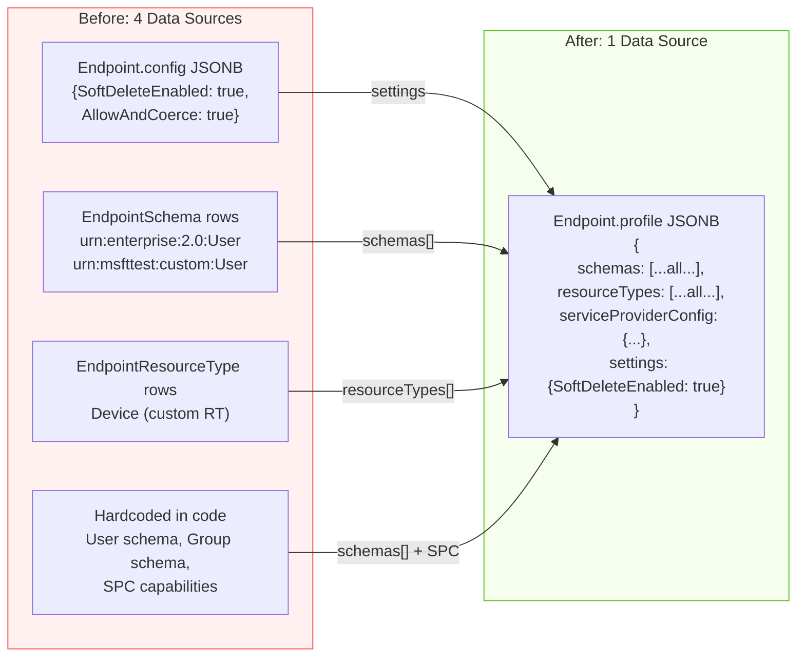

#### Current vs. New ER Diagram

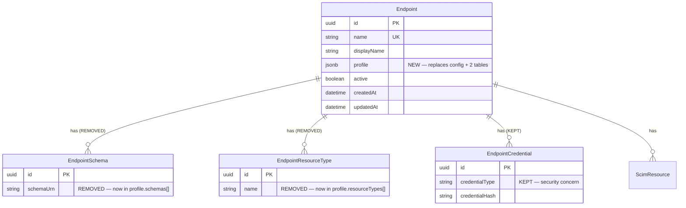

---

## 5. The Unified Design

### 5.1 Core Idea

An endpoint's complete schema configuration is a single JSON document containing four sections:

```typescript
interface EndpointProfile {
  schemas: ScimSchemaDefinition[];       // RFC 7643 §7 — attribute definitions
  resourceTypes: ScimResourceType[];     // RFC 7643 §6 — resource type declarations
  serviceProviderConfig: ServiceProviderConfig;  // RFC 7644 §4 — capability advertisement
  settings: ProfileSettings;             // Project-specific behavioral flags
}
```

The first three are **native SCIM RFC formats**. The fourth is the only project-specific addition (not governed by any RFC).

### 5.2 The Endpoint Object — Before & After

**Before (current):**

```
Endpoint
   name, displayName, description, active
   config: JSONB             15 flat string key-values
  
   EndpointSchema[]          Separate table, separate API
   EndpointResourceType[]    Separate table, separate API
   EndpointCredential[]      Separate table, separate API
```

**After (unified):**

```
Endpoint
   name, displayName, description, active
   profile: JSONB            { schemas, resourceTypes, serviceProviderConfig, settings }
                                Three RFC-native documents + project settings  ONE field
                                Single source of truth. No separate preset column.
   EndpointCredential[]      Stays separate (security concern)
```

### 5.3 Embedded Profile — Design Rationale

We embed the profile directly in the `Endpoint` record rather than using a separate `/endpoint-profile` sub-resource. The rationale:

| Factor | Embedded (chosen) | Sub-resource (rejected) |
|---|---|---|
| **Atomic creation** | `POST /admin/endpoints { profile }`  one call | Two calls: POST endpoint, then PUT profile |
| **Consistency** | Always consistent  single row | Two-phase creates risk orphan states |
| **Read simplicity** | `GET /:id` returns everything | Must join or fetch twice |
| **PATCH** | Standard JSON merge on the endpoint | Separate PATCH endpoint with its own semantics |
| **List performance** | List excludes `profile` (select projection) | Marginal difference |

**List vs. Detail behavior:**
- `GET /admin/endpoints`  returns metadata only (name, active, id, timestamps)  **excludes** `profile`
- `GET /admin/endpoints/:id`  returns full endpoint **including** expanded `profile`

### 5.4 Named Presets

Presets are named, reusable `EndpointProfile` definitions stored as **code constants** (not in a database table). They provide the "pit of success"  operators pick a preset for common IdP patterns.

**Key decisions:**
- `profilePreset` is a **creation-time parameter only**  not persisted as a column
- No `ProfilePreset` database table  built-in presets are hardcoded constants; YAGNI for custom presets
- The expanded profile is the **single source of truth**  no staleness from a "last-used preset" column
- Default preset is `entra-id` (not `rfc-standard`)  Entra ID is the primary deployment target

### 5.5 Built-in Presets Summary

| Preset | Default? | Resource Types | EnterpriseUser | msfttest Extensions | Description |
|---|:---:|---|:---:|:---:|---|
| **`entra-id`** | **** | User + Group |  |  | Entra ID provisioned attributes. `emails.required`, `active.returned: always`. |
| `entra-id-minimal` | | User + Group |  |  | Entra ID minimal  `userName`, `displayName`, `emails`, `active`, `externalId` only. |
| `rfc-standard` | | User + Group |  |  | Full RFC 7643. All core attributes, all capabilities. |
| `minimal` | | User + Group |  |  | Bare minimum for testing/PoC. No extensions. |
| `user-only` | | User only |  |  | No Group resource type. Common provisioning attributes. |

See 8 for complete JSON definitions.

### 5.6 RFC-Aware Auto-Expand

When operators provide Schema input, they can use a **minimal format**  just attribute names plus any overrides. The server fills the rest from the RFC baseline.

**Minimal input:**
```json
{
  "schemas": [{
    "id": "urn:ietf:params:scim:schemas:core:2.0:User",
    "name": "User",
    "attributes": [
      { "name": "userName" },
      { "name": "displayName", "required": true },
      { "name": "emails", "required": true },
      { "name": "active", "returned": "always" },
      { "name": "externalId", "uniqueness": "server" }
    ]
  }]
}
```

**Server auto-expands `{ "name": "userName" }` to:**
```json
{
  "name": "userName", "type": "string", "multiValued": false,
  "required": true, "mutability": "readWrite", "returned": "always",
  "uniqueness": "server", "caseExact": false,
  "description": "Unique identifier for the User..."
}
```

**Rules:**
1. If attribute `name` matches a known RFC 7643 §4.1/4.2/3.1 attribute  fill all missing fields from the RFC definition
2. If a field is explicitly provided (e.g., `"required": true`)  overrides the RFC default, subject to the tighten-only rule
3. If `name` is not a known RFC attribute  all fields are required (custom/extension attribute)
4. The shorthand `"attributes": "all"` expands to the full RFC attribute list for that schema
5. Always auto-expand and store the **canonical expanded form**  no opt-out

#### Auto-Expand Flow

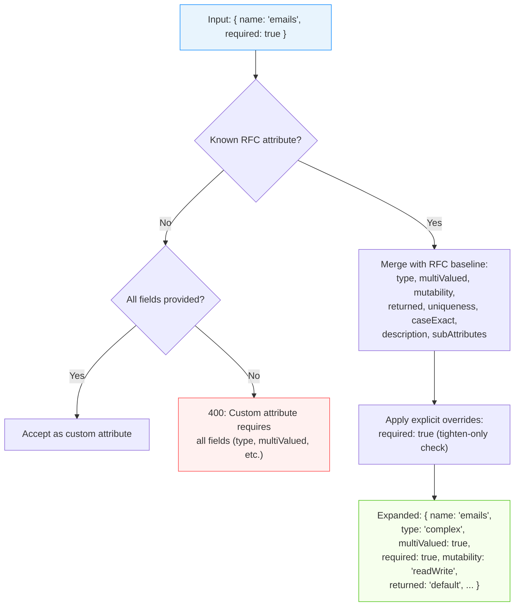

### 5.7 Validation Engine

When `EndpointProfile` is submitted (via preset expansion, inline profile, or PATCH), the server runs a 6-step pipeline:

```
1. AUTO-EXPAND   Fill missing attribute fields from RFC baseline
2. AUTO-INJECT   Ensure required structural attributes:
      id (required:true, readOnly) on every resource type schema
      userName on User, displayName on Group (RFC-mandated)
      externalId and meta on all schemas (project default)
      active on Group (always  simplest approach, supports soft-delete)
3. TIGHTEN-ONLY  For each explicitly set characteristic, verify same-or-tighter vs. RFC baseline:
     required:    only false  true
     returned:    validate direction (never=tightest exclusion, always=tightest inclusion)
     mutability:  readOnly=tightest, readWrite=loosest; only tighter
     uniqueness:  global > server > none; only tighter
     caseExact:   only false  true
     type:        REJECT any change
     multiValued: REJECT any change
4. SPC-TRUTHFUL  Verify ServiceProviderConfig only claims capabilities the server implements
5. STORE         Persist validated expanded profile as JSONB on Endpoint
6. HYDRATE       Load into ScimSchemaRegistry for runtime serving
```

#### Validation Pipeline Flowchart

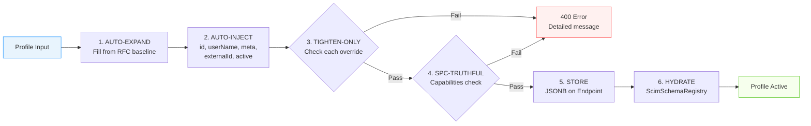

Validation errors return 400 with clear messages:

```json
{
  "schemas": ["urn:ietf:params:scim:api:messages:2.0:Error"],
  "status": "400",
  "detail": "Cannot loosen 'required' from true to false on 'userName' (User). RFC 7643 §4.1 mandates required:true."
}
```
---

## 6. Unified Admin API

### 6.1 Complete API Surface

```
#  Presets (read-only  code constants) 
GET    /admin/profile-presets                  # List all 5 built-in presets (name + description)
GET    /admin/profile-presets/:name            # Get preset detail (returns full expanded EndpointProfile)

#  Endpoints 
POST   /admin/endpoints                       # Create endpoint
                                               #   Accepts: { name, profilePreset?, profile? }
                                               #   profilePreset is creation-time only (not persisted)
                                               #   Default: entra-id preset if neither provided
GET    /admin/endpoints                       # List endpoints (metadata only  excludes profile)
GET    /admin/endpoints/:id                   # Get endpoint detail (includes full expanded profile)
PATCH  /admin/endpoints/:id                   # Update endpoint (metadata + profile partial merge)
DELETE /admin/endpoints/:id                   # Delete endpoint + cascade

#  Credentials (stays separate  security concern) 
POST   /admin/endpoints/:id/credentials       # Create credential
GET    /admin/endpoints/:id/credentials       # List credentials
DELETE /admin/endpoints/:id/credentials/:cid  # Revoke credential

#  Stats / Ops (unchanged) 
GET    /admin/endpoints/:id/stats             # Resource counts
```

### 6.2 Endpoint Creation — Three Paths

```
 Path A: Default (90% of cases  Entra ID)
   POST /admin/endpoints { "name": "contoso" }
    Server loads entra-id preset  expands  validates  stores as profile

 Path B: Named preset
   POST /admin/endpoints { "name": "contoso", "profilePreset": "rfc-standard" }
    Server loads rfc-standard preset  expands  validates  stores as profile

 Path C: Inline profile
   POST /admin/endpoints { "name": "contoso", "profile": { schemas: [...], ... } }
    Server expands  validates  stores as profile
```

When both `profilePreset` AND `profile` are provided  400 error (mutually exclusive).

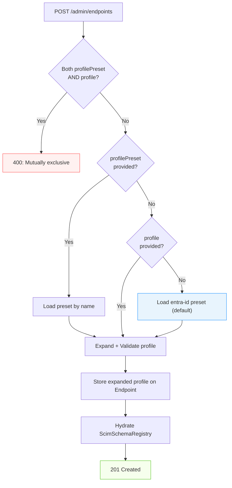

### 6.3 Endpoint Lifecycle

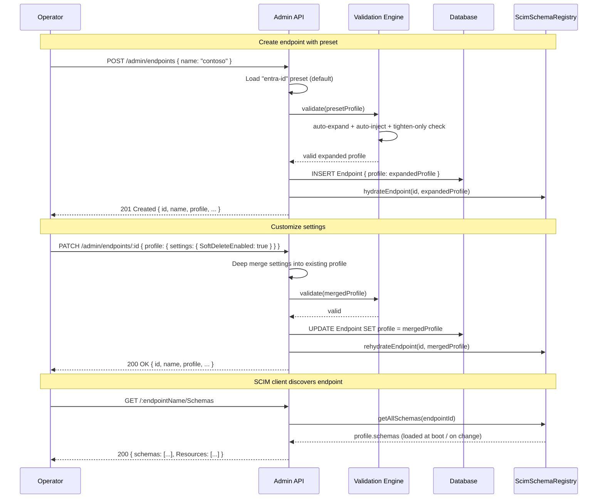

### 6.4 PATCH Merge Strategy

When PATCHing an endpoint's `profile` field:

| Profile Section | Merge Behavior | Rationale |
|---|---|---|
| `settings` | **Deep merge** | Individual flags are independent; merging allows updating one flag without resending all |
| `schemas` | **Full replace** | Schemas are interdependent; partial merge creates invalid states |
| `resourceTypes` | **Full replace** | Same as schemas  structural, must be consistent |
| `serviceProviderConfig` | **Full replace** | Capabilities are a coherent unit |

**Example  change one setting without touching schemas:**
```json
PATCH /admin/endpoints/:id
{
  "profile": {
    "settings": { "SoftDeleteEnabled": "True" }
  }
}
```
This deep-merges into existing settings. Schemas, resourceTypes, and SPC remain unchanged.

**Example  replace schemas entirely:**
```json
PATCH /admin/endpoints/:id
{
  "profile": {
    "schemas": [ ...new schemas... ]
  }
}
```
This replaces the entire schemas array. Settings, resourceTypes, and SPC remain unchanged.

#### PATCH Merge Visualization

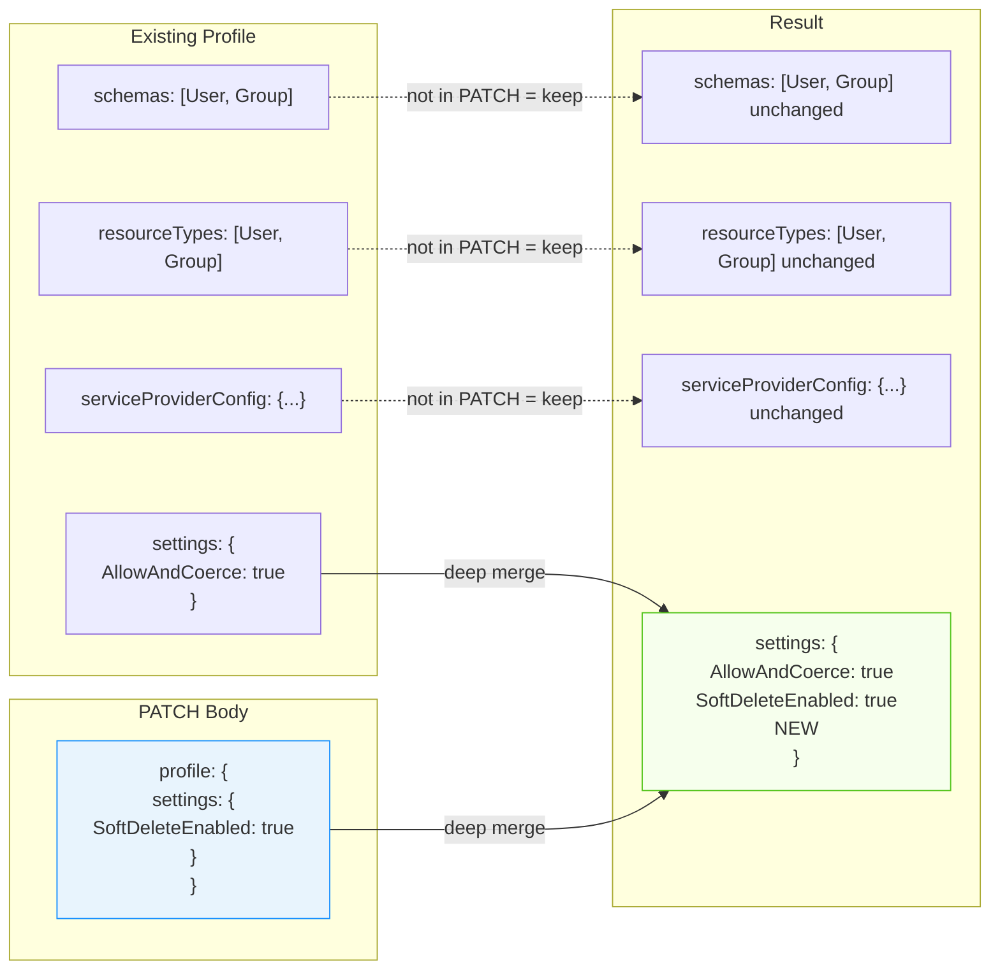

### 6.5 What Gets Eliminated

| Eliminated | Replacement | Files Saved |
|---|---|---|
| `AdminSchemaController` (3 routes) | Inline in `profile.schemas[]` | 1 controller + spec |
| `AdminResourceTypeController` (3 routes) | Inline in `profile.resourceTypes[]` | 1 controller + spec |
| `EndpointSchema` DB table + Prisma model | Entries in `Endpoint.profile.schemas[]` | 1 table, 1 model |
| `EndpointResourceType` DB table + Prisma model | Entries in `Endpoint.profile.resourceTypes[]` | 1 table, 1 model |
| `Endpoint.config` JSONB column | Moved into `profile.settings` | Column removed |
| `IEndpointSchemaRepository` + 2 impls + 2 specs | Data lives in Endpoint row | 5 files |
| `IEndpointResourceTypeRepository` + 2 impls + 1 spec | Data lives in Endpoint row | 4 files |
| `CreateEndpointSchemaDto` | Native format validated directly | 1 DTO |
| `CreateEndpointResourceTypeDto` | Native format validated directly | 1 DTO |
| Boot hydration from separate tables | Hydration reads `Endpoint.profile` directly | Simplified `onModuleInit` |

**Total eliminated**: ~2 controllers, ~2 DTOs, ~9 repo files, ~2 DB tables  **15+ files**.

---

## 7. Architecture

### 7.1 High-Level Architecture

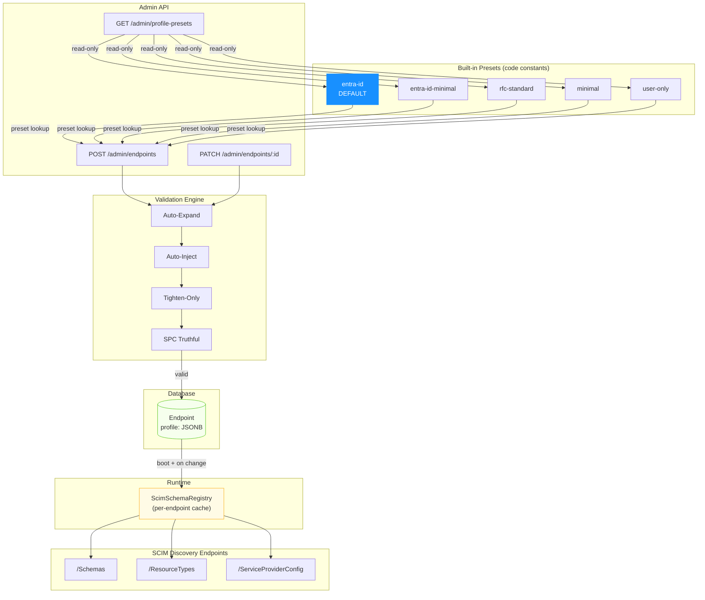

### 7.2 Request Flow — Discovery

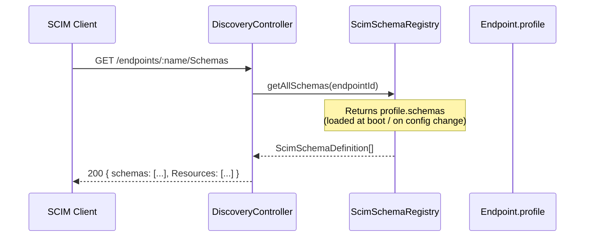

No transformation, no merge, no resolution engine. The stored profile IS the response.

#### Boot Hydration Sequence

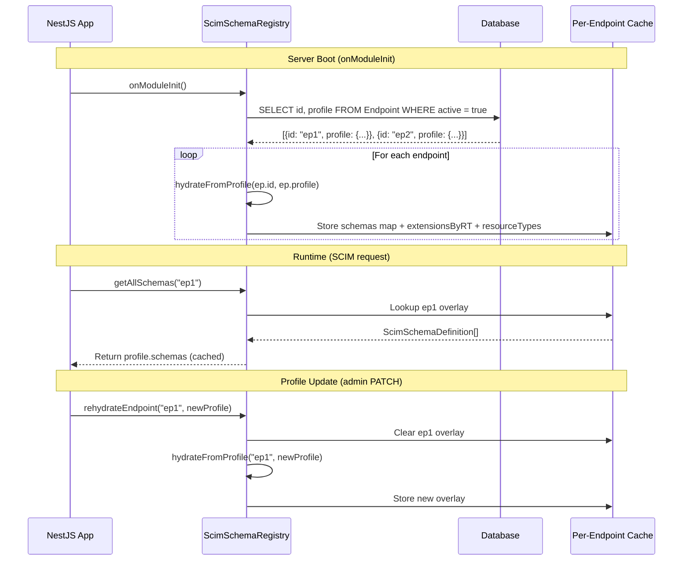

#### Runtime Data Flow: Profile to SCIM Response

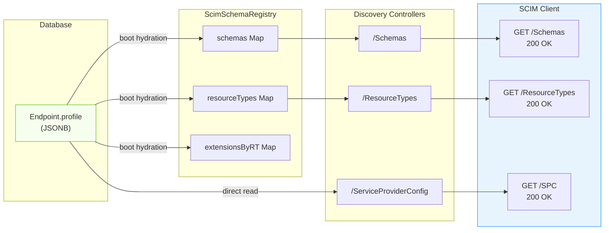

### 7.3 Data Model Changes

#### Changed: Endpoint Table

```prisma
model Endpoint {
  id          String   @id @default(dbgenerated("gen_random_uuid()")) @db.Uuid
  name        String   @unique
  displayName String?
  description String?
  profile     Json?    // JSONB  { schemas, resourceTypes, serviceProviderConfig, settings }
  active      Boolean  @default(true)
  createdAt   DateTime @default(now()) @db.Timestamptz
  updatedAt   DateTime @updatedAt     @db.Timestamptz
  // ... relations unchanged (logs, resources, credentials)
}
```

#### Dropped: EndpointSchema, EndpointResourceType Models

These Prisma models and their database tables are removed entirely. Their data now lives inside `Endpoint.profile.schemas[]` and `Endpoint.profile.resourceTypes[]`.

#### NOT Created: ProfilePreset Table

Built-in presets are code constants only. No database table needed  YAGNI.

#### NOT Created: profilePreset Column

The preset name is a creation-time parameter only. The expanded `profile` is the single source of truth.

#### Sample Endpoint Row After Creation

```sql
SELECT id, name, active,
       profile->'serviceProviderConfig'->'patch'->>'supported' AS patch,
       profile->'serviceProviderConfig'->'bulk'->>'supported'  AS bulk,
       jsonb_array_length(profile->'schemas')                  AS schema_count,
       jsonb_array_length(profile->'resourceTypes')            AS rt_count,
       profile->'settings'->>'AllowAndCoerceBooleanStrings'    AS bool_coerce
FROM   "Endpoint"
WHERE  name = 'contoso';
```

```
 id                                   | name    | active | patch | bulk  | schema_count | rt_count | bool_coerce
--------------------------------------+---------+--------+-------+-------+--------------+----------+------------
 a1b2c3d4-e5f6-7890-abcd-ef1234567890 | contoso | true   | true  | false | 7            | 2        | True
```

#### Sample profile JSONB Structure (abbreviated)

```json
{
  "schemas": [
    { "id": "urn:ietf:params:scim:schemas:core:2.0:User", "name": "User", "attributes": [ "...14 expanded attributes..." ] },
    { "id": "urn:ietf:params:scim:schemas:extension:enterprise:2.0:User", "name": "EnterpriseUser", "attributes": [ "...6 attributes..." ] },
    { "id": "urn:ietf:params:scim:schemas:core:2.0:Group", "name": "Group", "attributes": [ "...5 attributes..." ] },
    { "id": "urn:msfttest:cloud:scim:schemas:extension:custom:2.0:User", "name": "MsftTestCustomUser" },
    { "id": "urn:msfttest:cloud:scim:schemas:extension:custom:2.0:Group", "name": "MsftTestCustomGroup" },
    { "id": "urn:ietf:params:scim:schemas:extension:msfttest:User", "name": "MsftTestIetfUser" },
    { "id": "urn:ietf:params:scim:schemas:extension:msfttest:Group", "name": "MsftTestIetfGroup" }
  ],
  "resourceTypes": [
    { "id": "User", "name": "User", "endpoint": "/Users", "schema": "urn:...core:2.0:User", "schemaExtensions": [ "...3 extensions..." ] },
    { "id": "Group", "name": "Group", "endpoint": "/Groups", "schema": "urn:...core:2.0:Group", "schemaExtensions": [ "...2 extensions..." ] }
  ],
  "serviceProviderConfig": {
    "patch": { "supported": true },
    "bulk": { "supported": false },
    "filter": { "supported": true, "maxResults": 200 },
    "sort": { "supported": false },
    "etag": { "supported": true },
    "changePassword": { "supported": false }
  },
  "settings": {
    "AllowAndCoerceBooleanStrings": "True"
  }
}
```

---

## 8. Built-in Presets — Complete Definitions

### 8.1 `entra-id` (Default)

Optimized for Microsoft Entra ID provisioning. Scoped attributes, tightened requirements, msfttest extensions for SCIM Validator compatibility, EnterpriseUser extension.

```json
{
  "schemas": [
    {
      "id": "urn:ietf:params:scim:schemas:core:2.0:User",
      "name": "User",
      "description": "User Account",
      "attributes": [
        { "name": "userName" },
        { "name": "name" },
        { "name": "displayName", "required": true },
        { "name": "emails", "required": true },
        { "name": "active", "returned": "always" },
        { "name": "externalId", "uniqueness": "server" },
        { "name": "title" },
        { "name": "addresses" },
        { "name": "phoneNumbers" },
        { "name": "roles" },
        { "name": "preferredLanguage" },
        { "name": "locale" },
        { "name": "timezone" },
        { "name": "password" }
      ]
    },
    {
      "id": "urn:ietf:params:scim:schemas:extension:enterprise:2.0:User",
      "name": "EnterpriseUser",
      "description": "Enterprise User Extension",
      "attributes": "all"
    },
    {
      "id": "urn:ietf:params:scim:schemas:core:2.0:Group",
      "name": "Group",
      "description": "Group",
      "attributes": "all"
    },
    {
      "id": "urn:msfttest:cloud:scim:schemas:extension:custom:2.0:User",
      "name": "MsftTestCustomUser",
      "description": "Microsoft SCIM Validator custom User extension"
    },
    {
      "id": "urn:msfttest:cloud:scim:schemas:extension:custom:2.0:Group",
      "name": "MsftTestCustomGroup",
      "description": "Microsoft SCIM Validator custom Group extension"
    },
    {
      "id": "urn:ietf:params:scim:schemas:extension:msfttest:User",
      "name": "MsftTestIetfUser",
      "description": "Microsoft SCIM Validator IETF User extension"
    },
    {
      "id": "urn:ietf:params:scim:schemas:extension:msfttest:Group",
      "name": "MsftTestIetfGroup",
      "description": "Microsoft SCIM Validator IETF Group extension"
    }
  ],
  "resourceTypes": [
    {
      "id": "User", "name": "User", "endpoint": "/Users",
      "schema": "urn:ietf:params:scim:schemas:core:2.0:User",
      "schemaExtensions": [
        { "schema": "urn:ietf:params:scim:schemas:extension:enterprise:2.0:User", "required": false },
        { "schema": "urn:msfttest:cloud:scim:schemas:extension:custom:2.0:User", "required": false },
        { "schema": "urn:ietf:params:scim:schemas:extension:msfttest:User", "required": false }
      ]
    },
    {
      "id": "Group", "name": "Group", "endpoint": "/Groups",
      "schema": "urn:ietf:params:scim:schemas:core:2.0:Group",
      "schemaExtensions": [
        { "schema": "urn:msfttest:cloud:scim:schemas:extension:custom:2.0:Group", "required": false },
        { "schema": "urn:ietf:params:scim:schemas:extension:msfttest:Group", "required": false }
      ]
    }
  ],
  "serviceProviderConfig": {
    "patch": { "supported": true },
    "bulk": { "supported": false },
    "filter": { "supported": true, "maxResults": 200 },
    "sort": { "supported": false },
    "etag": { "supported": true },
    "changePassword": { "supported": false }
  },
  "settings": {
    "AllowAndCoerceBooleanStrings": "True"
  }
}
```

### 8.2 `entra-id-minimal`

Entra ID provisioning with the absolute minimum attribute set. Includes msfttest extensions and EnterpriseUser (since Entra ID provisions enterprise attributes like `manager`, `department`).

```json
{
  "schemas": [
    {
      "id": "urn:ietf:params:scim:schemas:core:2.0:User",
      "name": "User",
      "attributes": [
        { "name": "userName" },
        { "name": "displayName", "required": true },
        { "name": "emails", "required": true },
        { "name": "active", "returned": "always" },
        { "name": "externalId", "uniqueness": "server" },
        { "name": "password" }
      ]
    },
    {
      "id": "urn:ietf:params:scim:schemas:extension:enterprise:2.0:User",
      "name": "EnterpriseUser",
      "description": "Enterprise User Extension",
      "attributes": "all"
    },
    {
      "id": "urn:ietf:params:scim:schemas:core:2.0:Group",
      "name": "Group",
      "attributes": [
        { "name": "displayName" },
        { "name": "members" },
        { "name": "externalId" }
      ]
    },
    {
      "id": "urn:msfttest:cloud:scim:schemas:extension:custom:2.0:User",
      "name": "MsftTestCustomUser"
    },
    {
      "id": "urn:msfttest:cloud:scim:schemas:extension:custom:2.0:Group",
      "name": "MsftTestCustomGroup"
    },
    {
      "id": "urn:ietf:params:scim:schemas:extension:msfttest:User",
      "name": "MsftTestIetfUser"
    },
    {
      "id": "urn:ietf:params:scim:schemas:extension:msfttest:Group",
      "name": "MsftTestIetfGroup"
    }
  ],
  "resourceTypes": [
    {
      "id": "User", "name": "User", "endpoint": "/Users",
      "schema": "urn:ietf:params:scim:schemas:core:2.0:User",
      "schemaExtensions": [
        { "schema": "urn:ietf:params:scim:schemas:extension:enterprise:2.0:User", "required": false },
        { "schema": "urn:msfttest:cloud:scim:schemas:extension:custom:2.0:User", "required": false },
        { "schema": "urn:ietf:params:scim:schemas:extension:msfttest:User", "required": false }
      ]
    },
    {
      "id": "Group", "name": "Group", "endpoint": "/Groups",
      "schema": "urn:ietf:params:scim:schemas:core:2.0:Group",
      "schemaExtensions": [
        { "schema": "urn:msfttest:cloud:scim:schemas:extension:custom:2.0:Group", "required": false },
        { "schema": "urn:ietf:params:scim:schemas:extension:msfttest:Group", "required": false }
      ]
    }
  ],
  "serviceProviderConfig": {
    "patch": { "supported": true },
    "bulk": { "supported": false },
    "filter": { "supported": true, "maxResults": 200 },
    "sort": { "supported": false },
    "etag": { "supported": true },
    "changePassword": { "supported": false }
  },
  "settings": {
    "AllowAndCoerceBooleanStrings": "True"
  }
}
```

### 8.3 `rfc-standard`

Full RFC 7643 compliance. All core attributes, all capabilities. Includes EnterpriseUser but no msfttest extensions.

```json
{
  "schemas": [
    {
      "id": "urn:ietf:params:scim:schemas:core:2.0:User",
      "name": "User",
      "description": "User Account",
      "attributes": "all"
    },
    {
      "id": "urn:ietf:params:scim:schemas:extension:enterprise:2.0:User",
      "name": "EnterpriseUser",
      "description": "Enterprise User Extension",
      "attributes": "all"
    },
    {
      "id": "urn:ietf:params:scim:schemas:core:2.0:Group",
      "name": "Group",
      "description": "Group",
      "attributes": "all"
    }
  ],
  "resourceTypes": [
    {
      "id": "User", "name": "User", "endpoint": "/Users",
      "description": "User Account",
      "schema": "urn:ietf:params:scim:schemas:core:2.0:User",
      "schemaExtensions": [
        { "schema": "urn:ietf:params:scim:schemas:extension:enterprise:2.0:User", "required": false }
      ]
    },
    {
      "id": "Group", "name": "Group", "endpoint": "/Groups",
      "description": "Group",
      "schema": "urn:ietf:params:scim:schemas:core:2.0:Group",
      "schemaExtensions": []
    }
  ],
  "serviceProviderConfig": {
    "patch": { "supported": true },
    "bulk": { "supported": true, "maxOperations": 1000, "maxPayloadSize": 1048576 },
    "filter": { "supported": true, "maxResults": 200 },
    "sort": { "supported": true },
    "etag": { "supported": true },
    "changePassword": { "supported": false }
  },
  "settings": {}
}
```

### 8.4 `minimal`

Bare minimum for testing/PoC. No EnterpriseUser, no msfttest, no extensions.

```json
{
  "schemas": [
    {
      "id": "urn:ietf:params:scim:schemas:core:2.0:User",
      "name": "User",
      "attributes": [
        { "name": "userName" },
        { "name": "displayName" },
        { "name": "active" },
        { "name": "externalId" },
        { "name": "emails" },
        { "name": "password" }
      ]
    },
    {
      "id": "urn:ietf:params:scim:schemas:core:2.0:Group",
      "name": "Group",
      "attributes": [
        { "name": "displayName" },
        { "name": "members" },
        { "name": "externalId" }
      ]
    }
  ],
  "resourceTypes": [
    { "id": "User", "name": "User", "endpoint": "/Users",
      "schema": "urn:ietf:params:scim:schemas:core:2.0:User", "schemaExtensions": [] },
    { "id": "Group", "name": "Group", "endpoint": "/Groups",
      "schema": "urn:ietf:params:scim:schemas:core:2.0:Group", "schemaExtensions": [] }
  ],
  "serviceProviderConfig": {
    "patch": { "supported": true },
    "bulk": { "supported": false },
    "filter": { "supported": true, "maxResults": 100 },
    "sort": { "supported": false },
    "etag": { "supported": false },
    "changePassword": { "supported": false }
  },
  "settings": {}
}
```

### 8.5 `user-only`

User provisioning without Groups. Fully RFC-compliant (RFC 7643 §6  no requirement to implement Group). Includes EnterpriseUser.

```json
{
  "schemas": [
    {
      "id": "urn:ietf:params:scim:schemas:core:2.0:User",
      "name": "User",
      "attributes": [
        { "name": "userName" },
        { "name": "name" },
        { "name": "displayName" },
        { "name": "emails" },
        { "name": "active" },
        { "name": "externalId" },
        { "name": "title" },
        { "name": "password" }
      ]
    },
    {
      "id": "urn:ietf:params:scim:schemas:extension:enterprise:2.0:User",
      "name": "EnterpriseUser",
      "attributes": "all"
    }
  ],
  "resourceTypes": [
    { "id": "User", "name": "User", "endpoint": "/Users",
      "schema": "urn:ietf:params:scim:schemas:core:2.0:User",
      "schemaExtensions": [
        { "schema": "urn:ietf:params:scim:schemas:extension:enterprise:2.0:User", "required": false }
      ]
    }
  ],
  "serviceProviderConfig": {
    "patch": { "supported": true },
    "bulk": { "supported": false },
    "filter": { "supported": true, "maxResults": 200 },
    "sort": { "supported": true },
    "etag": { "supported": true },
    "changePassword": { "supported": false }
  },
  "settings": {}
}
```

### 8.6 Preset Comparison Matrix

| Feature | `entra-id` | `entra-id-minimal` | `rfc-standard` | `minimal` | `user-only` |
|---|:---:|:---:|:---:|:---:|:---:|
| User resource |  |  |  |  |  |
| Group resource |  |  |  |  |  |
| EnterpriseUser |  |  |  |  |  |
| msfttest extensions (4) |  |  |  |  |  |
| User attributes | 14 scoped | 6 core | all | 6 core | 8 common |
| Group attributes | all | 3 core | all | 3 core |  |
| `emails.required` |  |  |  |  |  |
| `displayName.required` (User) |  |  |  |  |  |
| `externalId.uniqueness: server` |  |  |  |  |  |
| `active.returned: always` |  |  |  |  |  |
| PATCH |  |  |  |  |  |
| Bulk |  |  |  |  |  |
| Filter |  (200) |  (200) |  (200) |  (100) |  (200) |
| Sort |  |  |  |  |  |
| ETag |  |  |  |  |  |
| `AllowAndCoerceBooleanStrings` |  |  |  |  |  |

#### Preset Selection Guide

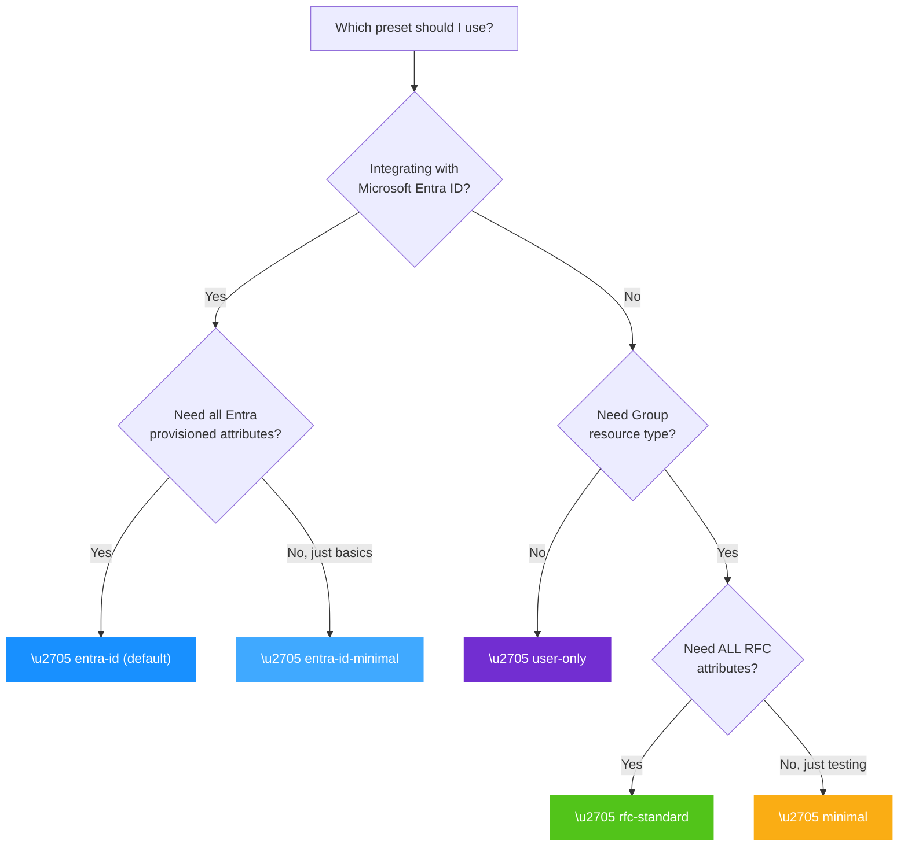

---

## 9. Settings Reference

### 9.1 Persisted Settings (13)

These settings live in `profile.settings` and are persisted as part of the endpoint profile.

| Setting Key | Type | Default | Description |
|---|---|---|---|
| `MultiOpPatchRequestAddMultipleMembersToGroup` | boolean | `false` | Allow multi-member PATCH add to group |
| `MultiOpPatchRequestRemoveMultipleMembersFromGroup` | boolean | `false` | Allow multi-member PATCH remove from group |
| `PatchOpAllowRemoveAllMembers` | boolean | `true` | Allow remove-all-members via `path=members` |
| `VerbosePatchSupported` | boolean | `false` | Enable dot-notation path resolution in PATCH |
| `logLevel` | string/number |  | Per-endpoint log level override |
| `SoftDeleteEnabled` | boolean | `false` | DELETE  soft-delete (`active=false`) |
| `StrictSchemaValidation` | boolean | `false` | Require extension URNs in `schemas[]` |
| `RequireIfMatch` | boolean | `false` | Mandatory ETag on PUT/PATCH/DELETE |
| `AllowAndCoerceBooleanStrings` | boolean | `true` | Coerce `"True"`/`"False"` strings to booleans |
| `ReprovisionOnConflictForSoftDeletedResource` | boolean | `false` | Re-activate soft-deleted on conflict |
| `PerEndpointCredentialsEnabled` | boolean | `false` | Enable per-endpoint bearer token validation |
| `IncludeWarningAboutIgnoredReadOnlyAttribute` | boolean | `false` | Warn on readOnly attribute stripping |
| `IgnoreReadOnlyAttributesInPatch` | boolean | `false` | Strip (don't reject) readOnly PATCH ops |

### 9.2 Derived Settings (2)

These are **not stored** in `profile.settings`. They are derived at runtime from other profile sections.

| Derived Setting | Derived From | Logic |
|---|---|---|
| `BulkOperationsEnabled` | `profile.serviceProviderConfig.bulk.supported` | `true` when SPC says `bulk.supported: true` |
| `CustomResourceTypesEnabled` | `profile.resourceTypes[]` | `true` when any resource type name is not `"User"` or `"Group"` |

#### Settings Architecture Diagram

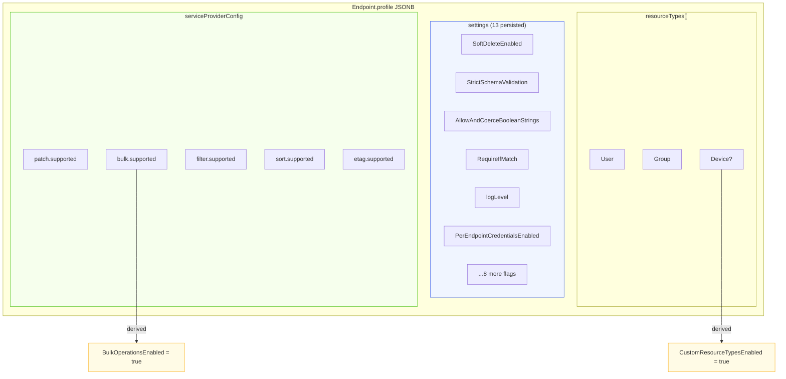

---

## 10. RFC Compliance Analysis

### 10.1 Required Attributes Audit

These are the absolute minimums that the validation engine enforces  everything else is operator's choice.

**User** (if User resource type is present):

| Attribute | What RFC Requires | Enforced |
|---|---|:---:|
| `id` | `required: true`, `mutability: readOnly` |  Auto-injected |
| `userName` | `required: true`, `uniqueness: server` |  Auto-injected if missing |
| Everything else | `required: false`  operator's discretion |  |

**Group** (if Group resource type is present):

| Attribute | What RFC Requires | Enforced |
|---|---|:---:|
| `id` | `required: true`, `mutability: readOnly` |  Auto-injected |
| `displayName` | `required: true` |  Auto-injected if missing |
| Everything else | `required: false`  operator's discretion |  |

### 10.2 Guardrails — RFC vs. Project

| Guardrail | Source | Basis |
|---|:---:|---|
| `userName` always present for User | **RFC** | RFC 7643 §4.1  `required: true` |
| `displayName` always present for Group | **RFC** | RFC 7643 §4.2  `required: true` |
| `id` always present on all resources | **RFC** | RFC 7643 §3.1  `required: true`, `readOnly` |
| Attribute characteristics: tighten only | **RFC** | RFC 7643 §7  characteristics are schema-defined; loosening violates the contract |
| `type` and `multiValued` cannot change | **RFC** | RFC 7643 §7  structural properties are immutable |
| SPC must reflect actual capabilities | **RFC** | RFC 7644 §4  discovery must be accurate |
| Endpoints can omit Group entirely | **RFC** | RFC 7643 §6  resource types are server-declared |
| `externalId` auto-included by default | **Project** | Not RFC-required, but most IdP clients expect it |
| `meta` auto-included by default | **Project** | Not RFC-required, but essential for ETag support |
| `active` always included on Group | **Project** | Not RFC-defined, but needed for soft-delete support |

### 10.3 What Can Be Customized

| Customization | RFC Basis |
|---|---|
| Which resource types are present (User, Group, both, neither, custom) | RFC 7643 §6 |
| Which optional attributes are listed per resource type | RFC 7643 §2.6 |
| Tighten `required` from `false` to `true` on any attribute | Industry norm (silent in RFC) |
| Tighten `uniqueness` from `none` to `server` | Industry norm |
| Tighten `mutability` from `readWrite` to `immutable` or `readOnly` | Industry norm |
| Tighten `returned` in either direction (`default`  `always` or `default`  `request`) | Industry norm |
| Which extensions are attached, and their attribute definitions | RFC 7643 §6 |
| Whether EnterpriseUser extension is present | RFC 7643 §4.3  not mandatory |
| All ServiceProviderConfig capabilities | RFC 7644 §4 |
| All behavioral settings | Not RFC-governed |

### 10.4 What Cannot Be Customized

| Restriction | RFC Basis |
|---|---|
| Cannot remove `userName` from User | RFC 7643 §4.1  `required: true` |
| Cannot remove `displayName` from Group | RFC 7643 §4.2  `required: true` |
| Cannot make `id` writable | RFC 7643 §3.1  `mutability: readOnly` |
| Cannot make `password` returned | RFC 7643 §4.1  `returned: never` |
| Cannot change `type` or `multiValued` on any attribute | RFC 7643 §7  structural |
| Cannot claim capabilities the server doesn't implement | RFC 7644 §4 |

#### Tighten-Only Direction Matrix

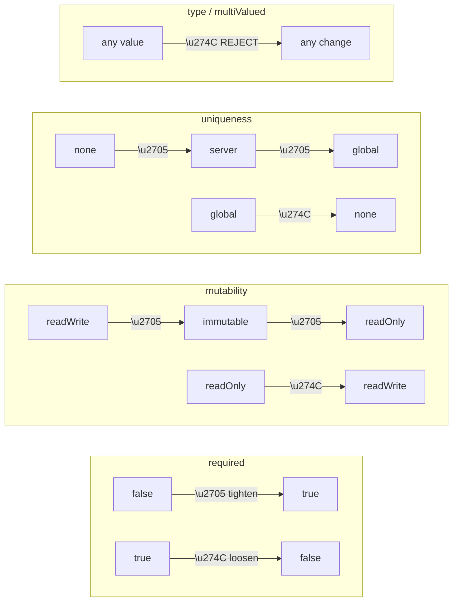

---

## 11. Feature-by-Feature Validation

All 38 existing SCIM features validated against the embedded profile model:

| # | Feature | Impact | Notes |
|---|---------|:---:|---|
| 1 | Multi-endpoint isolation |  None | Profile is per-endpoint  same isolation |
| 2 | User CRUD |  None | Reads settings from `profile.settings` |
| 3 | Group CRUD |  None | Same |
| 4 | Generic resource CRUD |  None | Custom RTs declared in `profile.resourceTypes[]` |
| 5 | PATCH engine |  None | Settings migration only |
| 6 | Bulk operations |  None | Derived from `profile.serviceProviderConfig.bulk.supported` |
| 7 | /Me endpoint |  None | Unaffected |
| 8 | Filtering |  None | `filter.maxResults` from SPC |
| 9 | Sorting |  None | `sort.supported` from SPC |
| 10 | Pagination |  None | Unaffected |
| 11 | ETag/Conditional requests |  None | `etag.supported` from SPC, `RequireIfMatch` from settings |
| 12 | Soft delete |  None | `SoftDeleteEnabled` from settings |
| 13 | Strict schema validation |  None | `StrictSchemaValidation` from settings |
| 14 | Boolean string coercion |  None | `AllowAndCoerceBooleanStrings` from settings |
| 15 | Re-provision on conflict |  None | Setting in `profile.settings` |
| 16 | Custom resource types |  None | Derived from `profile.resourceTypes[]` having non-User/Group entries |
| 17 | Extension schema registration |  Simplified | Now inline in `profile.schemas[]`  no separate API |
| 18 | Per-endpoint credentials |  None | Stays separate (`EndpointCredential` table) |
| 19 | Per-endpoint log level |  None | `logLevel` in settings |
| 20 | Discovery: /Schemas |  Simplified | Serve `profile.schemas` directly |
| 21 | Discovery: /ResourceTypes |  Simplified | Serve `profile.resourceTypes` directly |
| 22 | Discovery: /ServiceProviderConfig |  Simplified | Serve `profile.serviceProviderConfig` directly |
| 23 | Schema-driven attribute filtering (G8e) |  None | Reads schema from registry, registry reads from profile |
| 24 | PATCH readOnly pre-validation (G8c) |  None | Settings migration only |
| 25 | Write-response attribute projection (G8g) |  None | Unaffected |
| 26 | ReadOnly attribute stripping + warnings |  None | Settings migration only |
| 27 | Group uniqueness enforcement (G8f) |  None | Unaffected |
| 28 | Multi-member PATCH flags |  None | Settings migration only |
| 29 | Verbose PATCH dot-notation |  None | Settings migration only |
| 30 | Request logging |  None | Unaffected |
| 31 | Endpoint context storage (AsyncLocal) |  None | Unaffected |
| 32 | Health check |  None | Unaffected |
| 33 | Web UI |  None | Unaffected |
| 34 | Docker deployment |  None | Unaffected |
| 35 | Azure deployment |  None | Unaffected |
| 36 | InMemory backend |  Minor | In-memory endpoint record needs `profile` field |
| 37 | Prisma backend |  Minor | Schema migration  add `profile`, drop `config`/tables |
| 38 | msfttest extensions |  None | Declared in entra-id preset `profile.schemas[]` |

**Result**: 35 features unchanged, 3 need minor alignment (all settings reads + data model).
---

## 12. Examples

### 12.1 Quick Start — Default Preset

**Request:**
```http
POST /admin/endpoints HTTP/1.1
Host: localhost:6000
Authorization: Bearer changeme-oauth
Content-Type: application/json

{ "name": "contoso", "displayName": "Contoso AD" }
```

**Response:**
```http
HTTP/1.1 201 Created
Content-Type: application/json

{
  "id": "a1b2c3d4-e5f6-7890-abcd-ef1234567890",
  "name": "contoso",
  "displayName": "Contoso AD",
  "active": true,
  "scimEndpoint": "/endpoints/contoso/scim",
  "profile": {
    "schemas": [ "...7 schemas (entra-id preset expanded)..." ],
    "resourceTypes": [ "...User + Group..." ],
    "serviceProviderConfig": { "patch": { "supported": true }, "bulk": { "supported": false }, "..." : "..." },
    "settings": { "AllowAndCoerceBooleanStrings": "True" }
  },
  "createdAt": "2026-03-12T10:00:00.000Z",
  "updatedAt": "2026-03-12T10:00:00.000Z"
}
```

### 12.2 Explicit Preset Selection

**Request:**
```http
POST /admin/endpoints HTTP/1.1
Host: localhost:6000
Authorization: Bearer changeme-oauth
Content-Type: application/json

{ "name": "acme", "profilePreset": "rfc-standard" }
```

**Response:**
```http
HTTP/1.1 201 Created
Content-Type: application/json

{
  "id": "b2c3d4e5-f6a7-8901-bcde-f12345678901",
  "name": "acme",
  "active": true,
  "scimEndpoint": "/endpoints/acme/scim",
  "profile": {
    "schemas": [ "...3 schemas (User+EnterpriseUser+Group, all attributes)..." ],
    "resourceTypes": [ "...User + Group with EnterpriseUser extension..." ],
    "serviceProviderConfig": { "patch": { "supported": true }, "bulk": { "supported": true, "maxOperations": 1000 }, "sort": { "supported": true }, "..." : "..." },
    "settings": {}
  },
  "createdAt": "2026-03-12T10:05:00.000Z",
  "updatedAt": "2026-03-12T10:05:00.000Z"
}
```

### 12.3 Inline Profile at Creation

```bash
curl -X POST http://localhost:6000/admin/endpoints \
  -H "Authorization: Bearer $TOKEN" \
  -H "Content-Type: application/json" \
  -d '{
    "name": "custom-ep",
    "profile": {
      "schemas": [
        { "id": "urn:ietf:params:scim:schemas:core:2.0:User", "name": "User",
          "attributes": [
            { "name": "userName" },
            { "name": "displayName", "required": true },
            { "name": "emails", "required": true },
            { "name": "active" },
            { "name": "externalId" }
          ]}
      ],
      "resourceTypes": [
        { "id": "User", "name": "User", "endpoint": "/Users",
          "schema": "urn:ietf:params:scim:schemas:core:2.0:User", "schemaExtensions": [] }
      ],
      "serviceProviderConfig": {
        "patch": { "supported": true }, "bulk": { "supported": false },
        "filter": { "supported": true, "maxResults": 100 },
        "sort": { "supported": false }, "etag": { "supported": false },
        "changePassword": { "supported": false }
      }
    }
  }'
```

### 12.4 Preset + Customize (Hybrid)

```bash
# Step 1: Create from default preset
curl -X POST http://localhost:6000/admin/endpoints \
  -d '{ "name": "contoso" }'

# Step 2: Customize settings via PATCH (deep merge)
curl -X PATCH http://localhost:6000/admin/endpoints/$EP_ID \
  -d '{
    "profile": {
      "settings": {
        "SoftDeleteEnabled": "True",
        "StrictSchemaValidation": "True"
      }
    }
  }'

# Step 3: Replace schemas with custom set (full replace of schemas array)
curl -X PATCH http://localhost:6000/admin/endpoints/$EP_ID \
  -d '{
    "profile": {
      "schemas": [
        { "id": "urn:ietf:params:scim:schemas:core:2.0:User", "name": "User",
          "attributes": [
            { "name": "userName" },
            { "name": "displayName", "required": true },
            { "name": "emails", "required": true },
            { "name": "active", "returned": "always" },
            { "name": "externalId", "uniqueness": "server", "mutability": "immutable" },
            { "name": "name" }, { "name": "title" }, { "name": "password" }
          ]},
        { "id": "urn:ietf:params:scim:schemas:extension:enterprise:2.0:User",
          "name": "EnterpriseUser", "attributes": "all" },
        { "id": "urn:contoso:scim:ext:hr:2.0:User", "name": "ContosoHR",
          "description": "Contoso HR attributes",
          "attributes": [
            { "name": "costCenter", "type": "string", "multiValued": false,
              "required": false, "mutability": "readWrite", "returned": "default" },
            { "name": "hireDate", "type": "dateTime", "multiValued": false,
              "required": false, "mutability": "readWrite", "returned": "default" }
          ]},
        { "id": "urn:ietf:params:scim:schemas:core:2.0:Group", "name": "Group",
          "attributes": "all" }
      ],
      "resourceTypes": [
        { "id": "User", "name": "User", "endpoint": "/Users",
          "schema": "urn:ietf:params:scim:schemas:core:2.0:User",
          "schemaExtensions": [
            { "schema": "urn:ietf:params:scim:schemas:extension:enterprise:2.0:User", "required": false },
            { "schema": "urn:contoso:scim:ext:hr:2.0:User", "required": false }
          ]},
        { "id": "Group", "name": "Group", "endpoint": "/Groups",
          "schema": "urn:ietf:params:scim:schemas:core:2.0:Group", "schemaExtensions": [] }
      ]
    }
  }'
```

Note: the custom extension `urn:contoso:scim:ext:hr:2.0:User` is just another Schema document in the array. No separate Admin API call needed.

### 12.5 Clone from Existing Server

```bash
# Grab discovery responses from any existing SCIM server
SCHEMAS=$(curl -s https://other-server.com/scim/Schemas | jq '.Resources')
RTS=$(curl -s https://other-server.com/scim/ResourceTypes | jq '.Resources')
SPC=$(curl -s https://other-server.com/scim/ServiceProviderConfig)

# Create endpoint with inline profile from cloned data
curl -X POST http://localhost:6000/admin/endpoints \
  -d "{
    \"name\": \"cloned-ep\",
    \"profile\": {
      \"schemas\": $SCHEMAS,
      \"resourceTypes\": $RTS,
      \"serviceProviderConfig\": $SPC
    }
  }"
```

### 12.6 Minimal Input — Auto-Expand

Operator writes only what differs from RFC baseline:

```bash
curl -X POST http://localhost:6000/admin/endpoints \
  -d '{
    "name": "sparse-ep",
    "profile": {
      "schemas": [
        { "id": "urn:ietf:params:scim:schemas:core:2.0:User", "name": "User",
          "attributes": [ { "name": "userName" }, { "name": "active" }, { "name": "externalId" } ] }
      ],
      "resourceTypes": [
        { "id": "User", "name": "User", "endpoint": "/Users",
          "schema": "urn:ietf:params:scim:schemas:core:2.0:User", "schemaExtensions": [] }
      ],
      "serviceProviderConfig": {
        "patch": { "supported": true }, "bulk": { "supported": false },
        "filter": { "supported": true, "maxResults": 100 }, "sort": { "supported": false },
        "etag": { "supported": false }, "changePassword": { "supported": false }
      }
    }
  }'
```

Server auto-expands `{ "name": "userName" }`  full RFC 7643 §4.1 definition, auto-injects `id` and `meta`, stores the expanded form.

#### 12.7 Full Discovery Response After Configuration

After creating an endpoint with the `entra-id` preset, the SCIM discovery endpoints serve the profile directly:

**Request:**
```http
GET /endpoints/contoso/scim/Schemas HTTP/1.1
Host: localhost:6000
Authorization: Bearer changeme-oauth
```

**Response (abbreviated):**
```http
HTTP/1.1 200 OK
Content-Type: application/scim+json

{
  "schemas": ["urn:ietf:params:scim:api:messages:2.0:ListResponse"],
  "totalResults": 7,
  "Resources": [
    {
      "schemas": ["urn:ietf:params:scim:schemas:core:2.0:Schema"],
      "id": "urn:ietf:params:scim:schemas:core:2.0:User",
      "name": "User",
      "description": "User Account",
      "attributes": [
        {
          "name": "id", "type": "string", "multiValued": false,
          "required": true, "mutability": "readOnly", "returned": "always",
          "uniqueness": "server", "caseExact": true
        },
        {
          "name": "userName", "type": "string", "multiValued": false,
          "required": true, "mutability": "readWrite", "returned": "always",
          "uniqueness": "server", "caseExact": false
        },
        {
          "name": "emails", "type": "complex", "multiValued": true,
          "required": true, "mutability": "readWrite", "returned": "default",
          "subAttributes": [ "...value, type, primary..." ]
        }
      ],
      "meta": { "resourceType": "Schema", "location": "/Schemas/urn:ietf:params:scim:schemas:core:2.0:User" }
    },
    "...6 more schema resources (EnterpriseUser, Group, 4x msfttest)..."
  ]
}
```

#### 12.8 Validation Error Response

Attempting to loosen a required attribute:

**Request:**
```http
PATCH /admin/endpoints/a1b2c3d4-e5f6-7890-abcd-ef1234567890 HTTP/1.1
Host: localhost:6000
Authorization: Bearer changeme-oauth
Content-Type: application/json

{
  "profile": {
    "schemas": [{
      "id": "urn:ietf:params:scim:schemas:core:2.0:User",
      "name": "User",
      "attributes": [
        { "name": "userName", "required": false }
      ]
    }]
  }
}
```

**Response:**
```http
HTTP/1.1 400 Bad Request
Content-Type: application/scim+json

{
  "schemas": ["urn:ietf:params:scim:api:messages:2.0:Error"],
  "status": "400",
  "scimType": "invalidValue",
  "detail": "Cannot loosen 'required' from true to false on attribute 'userName' (schema: User). RFC 7643 §4.1 mandates required:true. Only tightening (false→true) is permitted."
}
```

#### 12.9 Preset List Response

**Request:**
```http
GET /admin/profile-presets HTTP/1.1
Host: localhost:6000
Authorization: Bearer changeme-oauth
```

**Response:**
```http
HTTP/1.1 200 OK
Content-Type: application/json

[
  { "name": "entra-id",         "description": "Entra ID provisioning. Scoped attributes, msfttest extensions, EnterpriseUser.", "default": true },
  { "name": "entra-id-minimal", "description": "Entra ID minimal. Core identity fields only + msfttest + EnterpriseUser." },
  { "name": "rfc-standard",     "description": "Full RFC 7643. All attributes, all capabilities, EnterpriseUser." },
  { "name": "minimal",          "description": "Bare minimum for testing. No extensions." },
  { "name": "user-only",        "description": "User provisioning only. No Group resource type. EnterpriseUser." }
]
```

---

## 13. Deployment Notes

> **Pre-release project**: SCIMServer is not yet generally deployed. This design targets a **fresh deployment**  no migration of existing data is required.

| Aspect | Approach |
|---|---|
| **Existing Admin Schema/ResourceType APIs** | Removed entirely (not deprecated  clean break) |
| **`EndpointSchema` table** | Dropped. Schema data lives in `Endpoint.profile.schemas[]` |
| **`EndpointResourceType` table** | Dropped. Resource type data lives in `Endpoint.profile.resourceTypes[]` |
| **`Endpoint.config` column** | Replaced by `Endpoint.profile` JSONB. Settings in `profile.settings` |
| **`profilePreset` column** | Not created. Preset name is a creation-time parameter only |
| **`ProfilePreset` table** | Not created. Presets are code constants  no DB table needed |
| **Default profile** | New endpoints without a preset default to `entra-id` |
| **GET endpoint detail** | Returns the **complete expanded** profile  all attributes fully resolved |
| **GET endpoint list** | Excludes `profile` for performance  metadata only |

---

## 14. Resolved Design Decisions

All design decisions finalized during the March 912, 2026 design sessions.

| # | Decision | Resolution | Rationale |
|---|----------|------------|-----------|
| D1 | Embedded vs. sub-resource for profile | **Embedded** in Endpoint | Atomic creation, no orphan states, single source of truth |
| D2 | Persist `profilePreset` column? | **No**  creation-time parameter only | Avoids staleness; expanded profile is the truth |
| D3 | PATCH merge strategy | **Deep merge for `settings`, full replace for `schemas`/`resourceTypes`/`serviceProviderConfig`** | Settings are independent flags; schemas are interdependent structures |
| D4 | `ProfilePreset` DB table? | **No**  code constants only | YAGNI; built-in presets don't need CRUD persistence |
| D5 | Default preset | **`entra-id`** (not `rfc-standard`) | Entra ID is the primary deployment target |
| D6 | POST accepts what? | `{ name, profilePreset? }` OR `{ name, profile? }` OR `{ name }` ( default `entra-id`) | Mutually exclusive `profilePreset` vs. `profile`; simple path for 90% case |
| D7 | Group `active` attribute | **Always included** (simplest approach) | Supports soft-delete without conditional logic |
| D8 | `BulkOperationsEnabled` flag | **Derived** from `serviceProviderConfig.bulk.supported` | Avoids redundant flag that can contradict SPC |
| D9 | `CustomResourceTypesEnabled` flag | **Derived** from `resourceTypes[]` having non-User/Group entries | Same  avoids contradiction |
| D10 | msfttest extensions placement | **Only in `entra-id` and `entra-id-minimal` presets** | Microsoft-specific; not needed for generic SCIM |
| D11 | EnterpriseUser per preset | **All except `minimal`** | Most IdPs provision enterprise attributes |
| D12 | `standard` preset renamed | **`rfc-standard`** | Clearer purpose; avoids ambiguity with "standard" meaning "default" |
| D13 | `custom` built-in preset | **Dropped**  redundant | Just POST with inline `profile` instead |
| D14 | Auto-expand opt-out | **No opt-out**  always expand and store canonical form | Simplicity; prevents partial/ambiguous stored state |
| Q6 | Tighten-only override mechanism | **Deferred** | No concrete use case yet; revisit when needed |
---

## 15. Implementation Plan

### 15.1 Phase 1 — Data Model & Presets

> **Goal:** Add the `profile` JSONB column, define RFC baselines and preset constants.
> **Estimated effort:** 1.5 days

**Step 1.1  Prisma schema migration**

| Action | File | Details |
|---|---|---|
| Add `profile Json?` to Endpoint | `prisma/schema.prisma` | Replace `config String?` with `profile Json?` |
| Remove `EndpointSchema` model | `prisma/schema.prisma` | Delete model and `@@unique`/`@@index` |
| Remove `EndpointResourceType` model | `prisma/schema.prisma` | Delete model and `@@unique`/`@@index` |
| Remove `schemaExtensions` relation from Endpoint | `prisma/schema.prisma` | Remove `EndpointSchema[]` relation |
| Remove `resourceTypes` relation from Endpoint | `prisma/schema.prisma` | Remove `EndpointResourceType[]` relation |
| Generate migration | `prisma/migrations/` | `npx prisma migrate dev --name add-endpoint-profile` |
| Regenerate Prisma client |  | `npx prisma generate` |

**Step 1.2  RFC baseline constants**

| Action | File (NEW) | Details |
|---|---|---|
| Create RFC baseline file | `src/modules/scim/endpoint-profile/rfc-baseline.ts` | Export `RFC_USER_ATTRIBUTES`, `RFC_GROUP_ATTRIBUTES`, `RFC_ENTERPRISE_USER_ATTRIBUTES`  full RFC 7643 §4.1/4.2/4.3 definitions with all characteristics. Extract from existing `scim-schemas.constants.ts` (`USER_SCHEMA_ATTRIBUTES`, `ENTERPRISE_USER_ATTRIBUTES`, `GROUP_SCHEMA_ATTRIBUTES`) to avoid duplication. |

**Step 1.3  TypeScript interfaces**

| Action | File (NEW) | Details |
|---|---|---|
| Define `EndpointProfile` | `src/modules/scim/endpoint-profile/endpoint-profile.types.ts` | `{ schemas, resourceTypes, serviceProviderConfig, settings }`. Reuse existing `ScimSchemaDefinition`, `ScimResourceType` from `scim-schema-registry.ts`. Define `ProfileSettings` with the 13 persisted flags. |

**Step 1.4  Built-in preset definitions**

| Action | File (NEW) | Details |
|---|---|---|
| Define 5 presets | `src/modules/scim/endpoint-profile/built-in-presets.ts` | `ENTRA_ID_PRESET`, `ENTRA_ID_MINIMAL_PRESET`, `RFC_STANDARD_PRESET`, `MINIMAL_PRESET`, `USER_ONLY_PRESET`  frozen `EndpointProfile` objects. Export `BUILT_IN_PRESETS` map for lookup by name. |

**Verification gate:** Presets compile, unit test validates each preset's structure.

---

### 15.2 Phase 2 — Validation Engine

> **Goal:** Implement auto-expand, auto-inject, tighten-only validation, and SPC truthfulness.
> **Estimated effort:** 23 days | **Highest complexity phase**

**Step 2.1  Auto-expand engine**

| Action | File (NEW) | Details |
|---|---|---|
| Create auto-expand service | `src/modules/scim/endpoint-profile/auto-expand.service.ts` | `expandProfile(input: Partial<EndpointProfile>): EndpointProfile`. Match `{ name }` to RFC baseline  fill all missing fields. Handle `"attributes": "all"` shorthand. Handle unknown attributes (require all fields). |

**Step 2.2  Auto-inject engine**

| Action | File | Details |
|---|---|---|
| Add auto-inject logic | Same file or helper | Ensure `id` always present with `required:true, mutability:readOnly`. Ensure `userName` on User, `displayName` on Group. Auto-inject `meta`, `externalId` as project defaults. Auto-inject `active` on Group always. |

**Step 2.3  Tighten-only validator**

| Action | File (NEW) | Details |
|---|---|---|
| Create validator | `src/modules/scim/endpoint-profile/tighten-only-validator.ts` | `validateTightenOnly(expanded: EndpointProfile): ValidationResult`. For each attribute with explicitly set characteristics, compare against RFC baseline. Return detailed error messages per violation. |

**Step 2.4  SPC truthfulness validator**

| Action | File | Details |
|---|---|---|
| Add SPC checks | Part of validation pipeline | Verify `patch.supported`, `bulk.supported`, `filter.supported`, `sort.supported`, `etag.supported` only claim capabilities the server actually implements. |

**Step 2.5  Profile validation orchestrator**

| Action | File (NEW) | Details |
|---|---|---|
| Create orchestrator | `src/modules/scim/endpoint-profile/endpoint-profile.service.ts` | `validateAndExpand(input): EndpointProfile`  runs the 6-step pipeline: autoExpand  autoInject  tightenOnlyValidate  spcTruthfulness  return expanded profile. Injectable NestJS service. |

**Step 2.6  Unit tests**

| Action | Files (NEW) | Details |
|---|---|---|
| Auto-expand tests | `auto-expand.service.spec.ts` | Expand shorthand, `"all"` expansion, unknown attributes require full definition |
| Tighten-only tests | `tighten-only-validator.spec.ts` | Accept tightening, reject loosening for each characteristic, reject type/multiValued changes |
| Orchestrator tests | `endpoint-profile.service.spec.ts` | End-to-end pipeline: preset loading, validation errors, SPC checks, auto-inject |

**Verification gate:** All unit tests pass. Can validate each built-in preset successfully.

---

### 15.3 Phase 3 — Admin API Changes

> **Goal:** Wire up new endpoint creation flow, preset read-only API, remove old controllers.
> **Estimated effort:** 2 days

**Step 3.1  Update CreateEndpointDto**

| Action | File | Details |
|---|---|---|
| Add fields | `src/modules/endpoint/dto/create-endpoint.dto.ts` | Add `profilePreset?: string` and `profile?: Partial<EndpointProfile>`. Validate mutual exclusivity. |

**Step 3.2  Update EndpointService.create()**

| Action | File | Details |
|---|---|---|
| Modify create logic | `src/modules/endpoint/services/endpoint.service.ts` | On create: if `profilePreset`  load from built-in presets map  expand  validate  store as `profile`. If `profile`  expand  validate  store. If neither  load `entra-id` default. Replace `config` column writes with `profile`. |

**Step 3.3  Update EndpointService.update()**

| Action | File | Details |
|---|---|---|
| Modify update logic | `src/modules/endpoint/services/endpoint.service.ts` | On PATCH: if `profile` in request body  apply merge strategy (deep merge settings, replace schemas/RTs/SPC)  re-validate  store. |

**Step 3.4  Update endpoint response**

| Action | Files | Details |
|---|---|---|
| List excludes profile | `endpoint.controller.ts`, `endpoint.service.ts` | `GET /admin/endpoints`  select projection excludes `profile`. `GET /admin/endpoints/:id`  includes full expanded `profile`. |

**Step 3.5  Create preset read-only API**

| Action | File (NEW) | Details |
|---|---|---|
| Create controller | `src/modules/scim/endpoint-profile/preset.controller.ts` | `GET /admin/profile-presets`  list all 5 presets (name + description). `GET /admin/profile-presets/:name`  full expanded profile. Read-only  no POST/PUT/DELETE. |

**Step 3.6  Remove AdminSchemaController**

| Action | Files (DELETE) | Details |
|---|---|---|
| Delete controller + spec | `admin-schema.controller.ts`, `admin-schema.controller.spec.ts` | Routes `POST/GET/DELETE /admin/endpoints/:id/schemas` removed |

**Step 3.7  Remove AdminResourceTypeController**

| Action | Files (DELETE) | Details |
|---|---|---|
| Delete controller + spec | `admin-resource-type.controller.ts`, `admin-resource-type.controller.spec.ts` | Routes `POST/GET/DELETE /admin/endpoints/:id/resource-types` removed |

**Step 3.8  Remove repository interfaces + implementations**

| Action | Files (DELETE) | Details |
|---|---|---|
| Delete schema repo interface | `domain/repositories/endpoint-schema.repository.interface.ts` |  |
| Delete Prisma schema repo + spec | `infrastructure/repositories/prisma/prisma-endpoint-schema.repository.ts` + spec |  |
| Delete InMemory schema repo + spec | `infrastructure/repositories/inmemory/inmemory-endpoint-schema.repository.ts` + spec |  |
| Delete RT repo interface | `domain/repositories/endpoint-resource-type.repository.interface.ts` |  |
| Delete Prisma RT repo | `infrastructure/repositories/prisma/prisma-endpoint-resource-type.repository.ts` |  |
| Delete InMemory RT repo + spec | `infrastructure/repositories/inmemory/inmemory-endpoint-resource-type.repository.ts` + spec |  |

**Step 3.9  Update module registrations**

| Action | File | Details |
|---|---|---|
| Update scim.module.ts | `src/modules/scim/scim.module.ts` | Remove old controllers/providers. Register `EndpointProfileService`, `PresetController`. Remove repo provider tokens. |
| Update endpoint.module.ts | `src/modules/endpoint/endpoint.module.ts` | No longer depends on schema/RT repositories. |

**Verification gate:** Admin API compiles. Can create endpoint with preset. Old routes return 404.

---

### 15.4 Phase 4 — Registry Hydration Refactor

> **Goal:** Make `ScimSchemaRegistry` hydrate from `Endpoint.profile` instead of separate tables.
> **Estimated effort:** 1.5 days

**Step 4.1  Refactor ScimSchemaRegistry.onModuleInit()**

| Action | File | Details |
|---|---|---|
| Remove table hydration | `src/modules/scim/discovery/scim-schema-registry.ts` | Remove `@Inject(ENDPOINT_SCHEMA_REPOSITORY)` and `@Inject(ENDPOINT_RESOURCE_TYPE_REPOSITORY)`. On boot: load all active endpoints  for each, read `profile.schemas` and `profile.resourceTypes`  build per-endpoint overlay. |

**Step 4.2  Add hydrateFromProfile() method**

| Action | File | Details |
|---|---|---|
| New method | `scim-schema-registry.ts` | `hydrateFromProfile(endpointId: string, profile: EndpointProfile)`. Builds per-endpoint overlay (schemas map, extensionsByResourceType, resourceTypes map). Called at boot and on profile update. |

**Step 4.3  Update rehydrateEndpoint()**

| Action | File | Details |
|---|---|---|
| Refactor | `scim-schema-registry.ts` | Called when profile is updated via admin API. Clear old overlay  rebuild from new profile using `hydrateFromProfile()`. |

**Step 4.4  Refactor discovery service**

| Action | File | Details |
|---|---|---|
| Simplify discovery | `src/modules/scim/discovery/scim-discovery.service.ts` | `GET /Schemas`  serve `profile.schemas` directly. `GET /ResourceTypes`  serve `profile.resourceTypes`. `GET /ServiceProviderConfig`  serve `profile.serviceProviderConfig`. Add `meta.location` at serve time. |

**Step 4.5  Migrate config flag reads codebase-wide**

| Action | Files (~30+ call sites) | Details |
|---|---|---|
| Replace `getConfigBoolean(config, ...)` | `endpoint-scim-users.service.ts`, `endpoint-scim-groups.service.ts`, `endpoint-scim-bulk.controller.ts`, `endpoint-scim-generic.controller.ts`, `scim-service-helpers.ts`, etc. | Change from reading `endpoint.config` (parsed JSON string) to `endpoint.profile.settings`. Create compatibility helper `getProfileSetting(profile, key)`. |

**Verification gate:** Server boots. Discovery endpoints return profile-sourced data. All existing E2E tests pass.

---

### 15.5 Phase 5 — InMemory Backend Alignment

> **Goal:** Ensure InMemory persistence uses the same profile model.
> **Estimated effort:** 1 day

**Step 5.1  Update InMemory endpoint record**

| Action | File | Details |
|---|---|---|
| Replace `config` with `profile` | `src/modules/endpoint/services/endpoint.service.ts` | In `InMemoryEndpointRecord`: replace `config` field with `profile: EndpointProfile | null`. Update all InMemory CRUD methods. |

**Step 5.2  Verify registry hydration works for both backends**

| Action | File | Details |
|---|---|---|
| Align boot hydration | `scim-schema-registry.ts` | `hydrateFromProfile()` is backend-agnostic  reads the profile object directly. |

**Step 5.3  Verify no dangling imports**

| Action | Details |
|---|---|
| Already deleted in Phase 3 Step 3.8 | Confirm no InMemory repo references remain. |

**Verification gate:** InMemory mode boots, creates endpoint with default preset, serves discovery correctly.

---

### 15.6 Phase 6 — Test Suite

> **Goal:** Full test coverage  unit, E2E, live integration.
> **Estimated effort:** 23 days

**Step 6.1  Unit tests: EndpointProfileService (~4060 tests)**

| Tests | Details |
|---|---|
| Auto-expand shorthand  full | `{ "name": "userName" }`  full RFC definition |
| Auto-expand `"all"` shorthand | `"attributes": "all"`  full attribute list |
| Auto-inject `id` on all schemas | Missing `id`  auto-added with correct characteristics |
| Auto-inject `userName` on User | Missing  auto-added |
| Auto-inject `displayName` on Group | Missing  auto-added |
| Auto-inject `active` on Group | Always added |
| Reject loosening `required` | `userName.required: false`  400 |
| Reject loosening `mutability` | `id.mutability: readWrite`  400 |
| Reject `type` change | `active.type: string`  400 |
| Reject `multiValued` change | `emails.multiValued: false`  400 |
| Accept valid tightening | `emails.required: true`   |
| Reject invalid SPC | `bulk.supported: true` when not implemented  400 |
| Custom extension requires full definition | Unknown attribute with only `name`  400 |

**Step 6.2  Unit tests: preset definitions**

| Tests | Details |
|---|---|
| Each preset validates successfully | All 5 presets pass the full validation pipeline |
| Each preset contains expected schemas/RTs/SPC | Structure assertions |
| Preset lookup by name | `getPreset("entra-id")` returns correct preset |

**Step 6.3  Controller tests: PresetController**

| Tests | Details |
|---|---|
| `GET /admin/profile-presets` | Returns 5 presets with name + description |
| `GET /admin/profile-presets/entra-id` | Returns full expanded profile |
| `GET /admin/profile-presets/nonexistent` | Returns 404 |

**Step 6.4  E2E tests: endpoint creation with presets**

| Tests | Details |
|---|---|
| Create with default (no preset) | Profile is `entra-id` expanded |
| Create with `profilePreset: "rfc-standard"` | Profile is `rfc-standard` expanded |
| Create with inline `profile` | Profile is expanded and stored |
| Create with both `profilePreset` and `profile` | 400 error |
| Create with invalid preset name | 400 error |

**Step 6.5  E2E tests: profile update via PATCH**

| Tests | Details |
|---|---|
| PATCH settings (deep merge) | Add `SoftDeleteEnabled: true`  only that setting changes |
| PATCH schemas (full replace) | Replace schemas array  settings unchanged |
| PATCH with validation error | Loosen `userName.required`  400 |
| Verify discovery reflects changes | After PATCH, `/Schemas` returns updated schemas |

**Step 6.6  E2E tests: discovery accuracy**

| Tests | Details |
|---|---|
| `/Schemas` matches profile.schemas | Exact match after expansion |
| `/ResourceTypes` matches profile.resourceTypes | Exact match |
| `/ServiceProviderConfig` matches profile.serviceProviderConfig | Exact match |

**Step 6.7  Live integration tests**

| Tests | Details |
|---|---|
| New section in `scripts/live-test.ps1` | Create endpoint with preset, verify discovery, update profile, verify changes. Test on local (port 6000), Docker (port 8080), and Azure. |

**Step 6.8  Regression testing**

| Tests | Details |
|---|---|
| Run full existing test suite | All ~4,000+ existing tests must pass with settings reads migrated |

**Verification gate:** Zero test regressions. New tests cover all creation paths, validation errors, PATCH merge, discovery accuracy.

---

### 15.7 Phase 7 — Cleanup & Documentation

> **Goal:** Remove dead code, update docs, bump version.
> **Estimated effort:** 1 day

**Step 7.1  Remove dead code**

| Action | Details |
|---|---|
| Verify no dangling imports | Search for references to deleted files/types |
| Remove `ENDPOINT_SCHEMA_REPOSITORY` token | `domain/repositories/repository.tokens.ts` |
| Remove `ENDPOINT_RESOURCE_TYPE_REPOSITORY` token | Same file |
| Clean up `endpoint-config.interface.ts` | Remove `DEFAULT_ENDPOINT_CONFIG`, `validateEndpointConfig()`. Keep `ENDPOINT_CONFIG_FLAGS` constants (still used as string key references). |

**Step 7.2  Update documentation**

| Document | Change |
|---|---|
| `ENDPOINT_CONFIG_FLAGS_REFERENCE.md` | Settings now live in `profile.settings`. Update examples. |
| `SCHEMA_CUSTOMIZATION_GUIDE.md` | Rewrite for unified profile API |
| `COMPLETE_API_REFERENCE.md` | Add preset API, update endpoint API with `profilePreset`/`profile` params |
| `SCHEMA_LIFECYCLE_AND_REGISTRY.md` | Update hydration source (profile not separate tables) |

**Step 7.3  Version management**

| Action | File | Details |
|---|---|---|
| Bump version | `api/package.json` | `0.27.0`  `0.28.0` |
| Add changelog entry | `CHANGELOG.md` | Feature summary + test counts |
| Update session context | `Session_starter.md`, `docs/CONTEXT_INSTRUCTIONS.md` | Version, feature status, test counts |

---

### 15.8 Dependency Graph

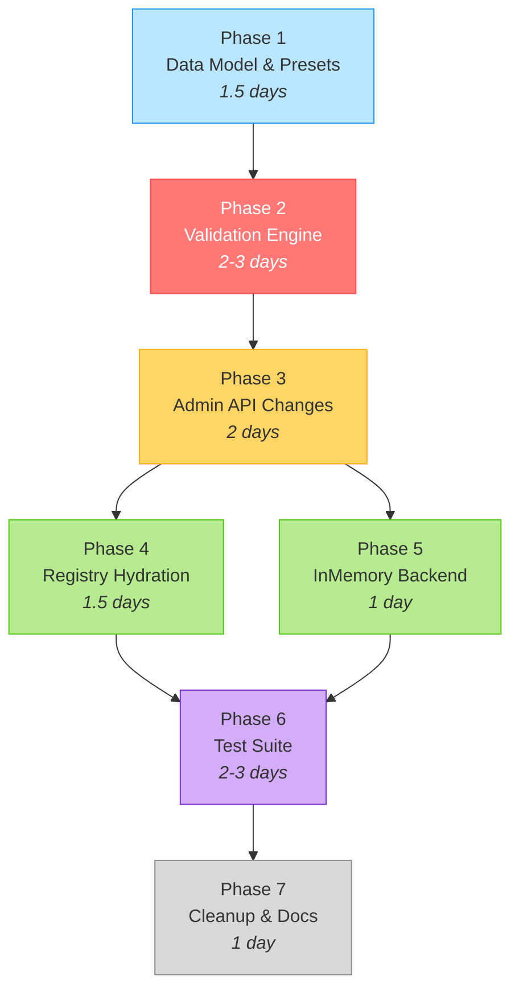

**Phases 4 and 5 can proceed in parallel** once Phase 3 is complete.

#### Implementation Gantt Chart

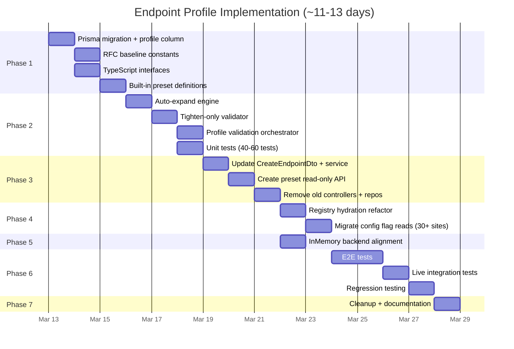

#### File Change Map


### 15.9 Effort Estimate

| Phase | Est. Days | Key Risk |
|-------|-----------|----------|
| 1  Data Model & Presets | 1.5 | Schema migration must be clean |
| 2  Validation Engine | 23 | **Highest complexity**  auto-expand + tighten-only logic with RFC fidelity |
| 3  Admin API Changes | 2 | Breaking API change (removing 2 controllers, 9+ repo files) |
| 4  Registry Hydration | 1.5 | ~30+ config read call sites need migration |
| 5  InMemory Backend | 1 | Must mirror Prisma behavior exactly |
| 6  Test Suite | 23 | Must maintain ~4,000+ existing test pass rate |
| 7  Cleanup & Docs | 1 |  |
| **Total** | **~1113 days** | |

### Files Created (New)

| Path (under `api/src/`) | Purpose |
|------|---------|
| `modules/scim/endpoint-profile/endpoint-profile.types.ts` | `EndpointProfile`, `ProfileSettings` interfaces |
| `modules/scim/endpoint-profile/rfc-baseline.ts` | RFC 7643 canonical attribute definitions |
| `modules/scim/endpoint-profile/built-in-presets.ts` | 5 named preset constants |
| `modules/scim/endpoint-profile/auto-expand.service.ts` | Shorthand  full RFC expansion |
| `modules/scim/endpoint-profile/tighten-only-validator.ts` | Validates override directionality |
| `modules/scim/endpoint-profile/endpoint-profile.service.ts` | Orchestrator: expand  validate  store  hydrate |
| `modules/scim/endpoint-profile/preset.controller.ts` | `GET /admin/profile-presets` read-only API |
| `+ corresponding .spec.ts files` | Unit tests for each new file |

### Files Deleted

| Path (under `api/src/`) | Reason |
|------|--------|
| `modules/scim/controllers/admin-schema.controller.ts` + spec | Merged into profile |
| `modules/scim/controllers/admin-resource-type.controller.ts` + spec | Merged into profile |
| `domain/repositories/endpoint-schema.repository.interface.ts` | Data in Endpoint.profile |
| `domain/repositories/endpoint-resource-type.repository.interface.ts` | Data in Endpoint.profile |
| `infrastructure/repositories/prisma/prisma-endpoint-schema.repository.ts` + spec | Data in Endpoint.profile |
| `infrastructure/repositories/prisma/prisma-endpoint-resource-type.repository.ts` | Data in Endpoint.profile |
| `infrastructure/repositories/inmemory/inmemory-endpoint-schema.repository.ts` + spec | Data in Endpoint.profile |
| `infrastructure/repositories/inmemory/inmemory-endpoint-resource-type.repository.ts` + spec | Data in Endpoint.profile |
---

## 16. Open / Deferred Items

| # | Item | Status | Notes |
|---|------|--------|-------|
| Q5 | `diff` endpoint (`GET /endpoint-profile/diff?base=rfc-standard`) | **Deferred** | Nice-to-have debugging tool; implement post-launch |
| Q6 | Tighten-only override mechanism | **Deferred** | No concrete use case; revisit when needed |
|  | Custom (user-defined) presets | **Deferred** | Built-in presets + inline profile covers all known use cases. Add CRUD presets if demand arises. |
|  | Profile versioning / audit trail | **Deferred** | Could track profile changes; YAGNI for now |

---

## 17. Cross-References

| Document | Relevance |
|----------|-----------|
| [SCHEMA_LIFECYCLE_AND_REGISTRY.md](SCHEMA_LIFECYCLE_AND_REGISTRY.md) | Current registry internals — `profile` hydration replaces multi-table boot |
| [SCHEMA_CUSTOMIZATION_GUIDE.md](SCHEMA_CUSTOMIZATION_GUIDE.md) | Operator guide — will need rewrite for unified API |
| [RFC_SCHEMA_AND_EXTENSIONS_REFERENCE.md](RFC_SCHEMA_AND_EXTENSIONS_REFERENCE.md) | RFC rules that constrain the validation engine |
| [SCHEMA_EXTENSION_FLOWS_AND_COMBINATIONS.md](SCHEMA_EXTENSION_FLOWS_AND_COMBINATIONS.md) | Behavior matrices — simplified by unified config |
| [ENDPOINT_CONFIG_FLAGS_REFERENCE.md](ENDPOINT_CONFIG_FLAGS_REFERENCE.md) | Config flags — now `profile.settings` |
| [G8B_CUSTOM_RESOURCE_TYPE_REGISTRATION.md](G8B_CUSTOM_RESOURCE_TYPE_REGISTRATION.md) | Custom RTs — now inline in `profile.resourceTypes[]` |
| [COMPLETE_AGNOSTIC_SCIM_ARCHITECTURE.md](COMPLETE_AGNOSTIC_SCIM_ARCHITECTURE.md) | Agnostic architecture — this design realizes the `ISchemaRepository` vision |
| [DISCOVERY_ENDPOINTS_RFC_AUDIT.md](DISCOVERY_ENDPOINTS_RFC_AUDIT.md) | Discovery accuracy — trivially satisfied when config IS the discovery response |
| [NEXT_ITEMS_V0.28.0_ROADMAP.md](NEXT_ITEMS_V0.28.0_ROADMAP.md) | v0.28.0 roadmap — this feature is the flagship item |

---

*Last updated: March 12, 2026*