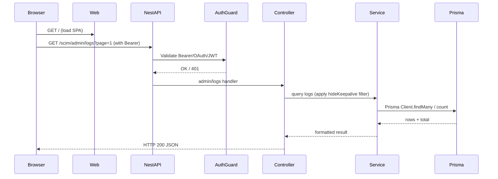
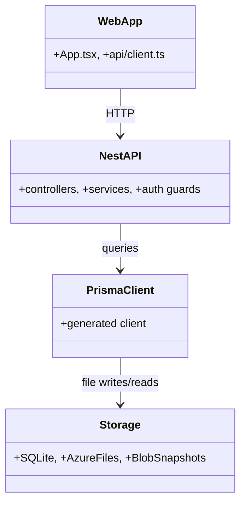
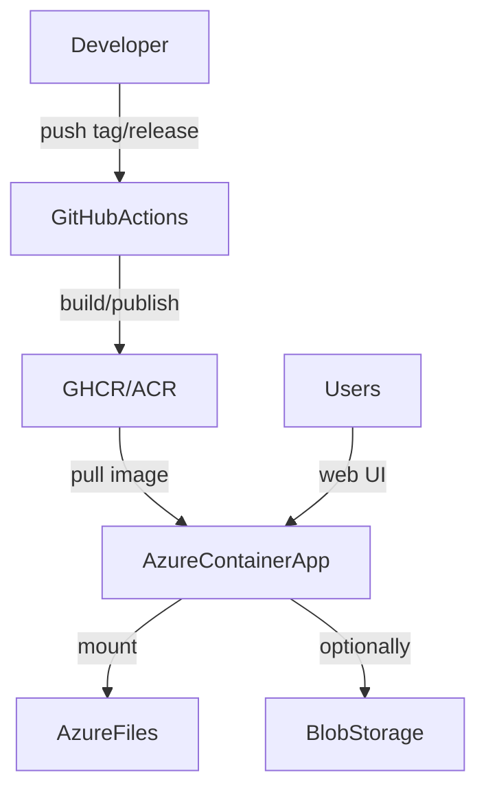
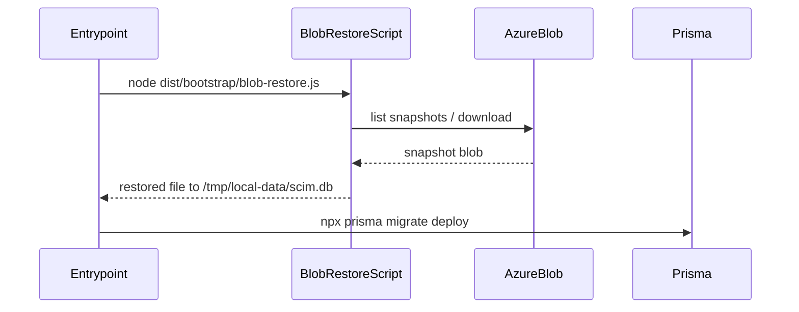

# SCIMTool — Microsoft Standard Analysis

Version: v0.8.15
Date: 2025-12-29

Purpose: provide a Microsoft-style technical analysis for the SCIMTool repository. This document summarizes architecture, request flows, deployment, security, operational considerations, key files, extensibility points, testing, and roadmap. Diagrams are included as mermaid blocks for easy rendering in supported markdown viewers.

## Executive Summary

SCIMTool is a lightweight SCIM 2.0 server with an integrated React-based UI designed for Microsoft Entra provisioning visibility and troubleshooting. It captures provisioning traffic, translates changes into human‑friendly activity messages, and provides admin surfaces for logs, backups, and manual provisioning. The solution is optimized for low operational cost (SQLite runtime with Azure Files / blob snapshot persistence) and deploys to Azure Container Apps.

Intended audience: Microsoft platform engineers, SREs, deployment authors, and maintainers.

## Scope

- Covers the repository at `C:\Users\v-prasrane\source\repos\SCIMTool2022` (branch: `master`).
- Includes backend (NestJS + Prisma), frontend (React + Vite), Docker packaging and PowerShell deployment automation.
- Does not include external Azure infrastructure templates (Bicep) that are referenced by the setup scripts (downloaded at deploy/runtime time).

## High-level architecture

```mermaid
graph LR
  A[Browser (React UI)] -->|HTTP fetch /scim/* & /scim/admin/*| B[Web Server (Same container)]
  B --> C[NestJS App (API)]
  C --> D[Auth Guard (Bearer / OAuth / JWT)]
  D --> E[Controllers]
  E --> E1[WebController (serves UI /assets)]
  E --> E2[SCIM Controllers (Users, Groups, Discovery)]
  E --> E3[AdminController (logs, version, backup APIs)]
  E2 --> F[ScimService (business logic)]
  E3 --> G[LoggingService / BackupService]
  F --> H[Prisma Client]
  G --> H
  H --> I[SQLite DB (runtime): /tmp/local-data/scim.db]
  H --> J[Azure Files backup: /app/data/scim.db]
  H --> K[Blob snapshots (optional restore)]
  subgraph RuntimeInit
    L[docker-entrypoint.sh] --> M[Blob snapshot restore (node dist/bootstrap/blob-restore.js)]
    M --> N[Set DATABASE_URL=file:/tmp/local-data/scim.db]
    N --> O[Run npx prisma migrate deploy]
  end
  C -. Logs & metrics .-> G
  A -. Upgrade checks .-> E3
```

## Key components and code locations

- Backend (NestJS + Prisma)
  - Source: `api/src` — controllers, services, modules
  - Entrypoint: `api/src/main.ts` (app bootstrap; global pipes/guards)
  - Web controller (serves static UI): `api/src/modules/web/web.controller.ts`
  - SCIM controllers & DTOs: `api/src/modules/scim/*` (example: `list-query.dto.ts`)
  - Admin endpoints (logs/version/backup): `api/src/modules/admin` (or `admin.controller.ts` / `activity.controller.ts`)
  - Prisma schema & client: `api/prisma/schema.prisma` and generated client under `node_modules/.prisma` after build

- Frontend (React + Vite)
  - Source: `web/src`
  - Api client: `web/src/api/client.ts` — all admin & scim calls used by UI
  - Keepalive detection: `web/src/utils/keepalive.ts` (heuristic for hiding Entra keepalive checks)
  - Main UI shell: `web/src/App.tsx`

- Packaging & runtime
  - Root `Dockerfile` (multi-stage, builds web then api then runtime)
  - `api/Dockerfile` (alternative build for api-only image)
  - Runtime entrypoint: `api/docker-entrypoint.sh` — restores backups, sets `DATABASE_URL`, runs migrations, starts app

- Deployment automation
  - `setup.ps1` — bootstrap one-liner for interactive or automated Azure deployment
  - `scripts/*.ps1` — deploy/update/test helpers (e.g. `deploy-azure.ps1`, `publish-acr.ps1`, `update-scimtool-*.ps1`)

## Request flow (sequence)



## Data storage & backup

- Runtime DB: SQLite stored in ephemeral `/tmp/local-data/scim.db` inside container. Prisma configured at runtime with `DATABASE_URL=file:/tmp/local-data/scim.db`.
- Persistent backup: Azure Files mount at `/app/data/scim.db`. On startup entrypoint copies from Azure Files to `/tmp/local-data` if present.
- Blob snapshot restore: optional process `dist/bootstrap/blob-restore.js` invoked by entrypoint to restore a DB from blob snapshots before migrations run.
- Migration strategy: `npx prisma migrate deploy` is executed at container start to apply pending migrations to the runtime DB.

## Security & authentication

- Primary auth for SCIM endpoints: shared bearer secret (SCIM secret) used by Microsoft Entra provisioning.
- Admin surfaces may also accept OAuth/JWT flows; runtime environment expects `JWT_SECRET` / `OAUTH_CLIENT_SECRET` supplied at deployment.
- Frontend stores the admin bearer token locally in browser and sends it in `Authorization: Bearer <token>` via `web/src/api/client.ts`. On 401 the UI clears token and prompts operator.
- Secrets are generated by `setup.ps1` when not provided; the bootstrap prints them and does not persist them elsewhere.

## Operational runbook (quick)

- Start locally
  - Backend dev: `cd api && npm run start:dev`
  - Frontend dev: `cd web && npm run dev`
  - Tests: `cd api && npm test`

- Container runtime (example)
  - Build: `docker build -t scimtool:local .`
  - Run: `docker run --rm -p 8080:80 scimtool:local`
  - Visit: `http://localhost:8080` and call `/scim/admin/version` with Authorization header

- Backup & restore
  - Entrypoint will attempt restore from `/app/data/scim.db` (Azure Files) and then blob snapshots. Review `api/docker-entrypoint.sh`.

## Extensibility and change points

- Change keepalive heuristic (frontend):
  - File: `web/src/utils/keepalive.ts`
  - Function: `isKeepaliveLog` and helper `looksLikeKeepaliveFromUrl`
  - Common changes: relax/stricten `GUID_LIKE` regex, alter `extractUserNameFilter` parsing, add URL patterns.

- Add admin endpoint (backend):
  - Add new controller under `api/src/modules/admin` or `api/src/modules/web` following NestJS pattern.
  - Example minimal route: add `AdminController` with `@Controller('scim/admin')` and new `@Get('ping')` method.
  - Register controller in module or existing module's `controllers` array.

- Schema changes (Prisma):
  - Edit `api/prisma/schema.prisma` to add/modify models.
  - Run `npx prisma migrate dev --name <desc>` during development, commit migration files, then CI/build will run `npx prisma migrate deploy` on start.
  - Run `npx prisma generate` after schema changes to refresh client types.

## Testing & quality

- Unit & integration tests: `api` contains test suites (e.g., `activity.controller.spec.ts`) focused on edge cases (keepalive filtering, pagination). Run with `cd api && npm test`.
- TDD approach used for keepalive pagination fix (9 test scenarios present per project memory).

## Diagrams (additional)

Component diagram



Deployment diagram



Blob restore flow (startup)



## Observations & risks

- SQLite single-file database is simple and low-cost but not suitable for high-concurrency or multi-instance scaling without shared storage. The design compensates by using Azure Files & blob snapshots, but operators should not run multiple active replicas against a single SQLite file without a reliable shared filesystem and appropriate locking.
- Keepalive heuristic is heuristic-based and may misclassify traffic if Entra changes patterns. Tuning may be required for edge cases.
- Secrets printed at deploy time must be captured and stored by operators; scripts auto-provision secrets but do not store them centrally.

## Recommendations

1. Add a minimal health/diagnostics endpoint (noted in backlog). Implement `/health` that returns aggregated status (DB exists, last backup time, migrations applied).
2. Add CI gate that runs `npx prisma validate` and a smoke test hitting `/scim/admin/version` after image build.
3. Consider moving to a small managed DB for production (Postgres) if multi-instance or higher throughput is required.
4. Surface deployment metadata via `/scim/admin/version` (already present) and include build commit/tag.

## How to contribute changes (developer quick start)

1. Clone: `git clone https://github.com/kayasax/SCIMTool.git`
2. Backend dev: `cd api && npm ci && npm run start:dev`
3. Frontend dev: `cd web && npm ci && npm run dev`
4. Run tests: `cd api && npm test`
5. For schema changes: `cd api && npx prisma migrate dev --name <desc>` then commit `prisma/migrations` files.

## Appendix — Important files reference

- `api/docker-entrypoint.sh` — startup DB restore, set `DATABASE_URL`, run migrations, start node
- `web/src/utils/keepalive.ts` — keepalive detection
- `web/src/api/client.ts` — client-side admin API surface
- `web/src/App.tsx` — UI shell and hideKeepalive interaction
- `api/src/modules/web/web.controller.ts` — serves static SPA files
- `api/prisma/schema.prisma` — DB models
- `setup.ps1`, `scripts/*.ps1` — deployment automation

---
This document was generated to provide maintainers and Microsoft reviewers with a compact, actionable analysis of the SCIMTool repository including diagrams and change points. For deeper code walk-throughs pick a controller or service and request an annotated read of that file.
