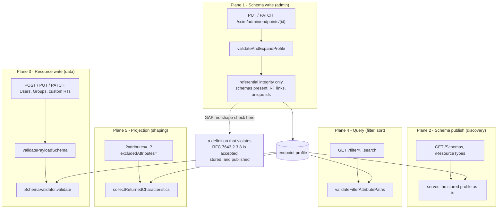
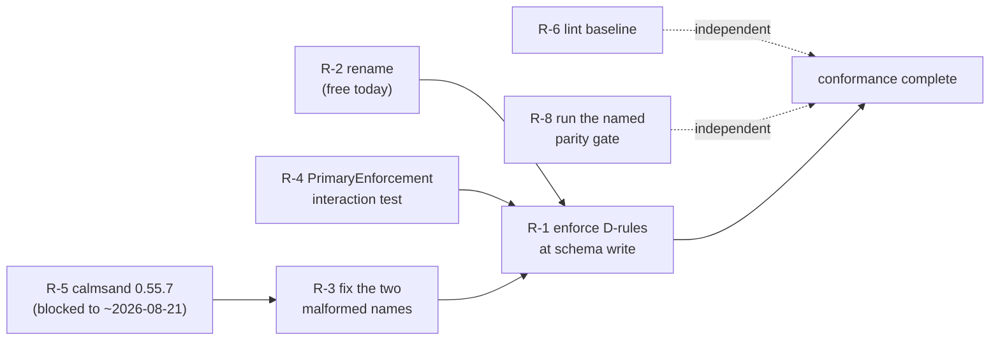

# SCIM Attribute and Sub-Attribute Validation: Conformance Roadmap

> **Status:** Living register - the single place that tracks *where* SCIMServer validates attribute and sub-attribute shape, *what* it enforces today, and *what is still outstanding*.
> **Product version:** `0.55.7` - **Last verified:** 2026-08-19 (code re-read, estates re-measured)
> **Question this answers:** across every flow and API that touches an attribute definition or an attribute value, which RFC 7643 / RFC 7644 rules does the server actually enforce, and which are still open?
> **Normative reference:** [rfcs/SCIM_SUBATTRIBUTE_TYPE_RULES.md](rfcs/SCIM_SUBATTRIBUTE_TYPE_RULES.md) states the rules. **This document does not restate them** - it tracks their implementation status and the remaining work.
> **Implementation reference:** [RFC_COMPLIANT_SUBATTRIBUTES.md](RFC_COMPLIANT_SUBATTRIBUTES.md) for the shipped flag.

---

## 1. Why this document exists

The rules, the measurements and the shipped behavior were spread across three
documents, and the *outstanding work* was spread across none of them - it lived
in commit messages and conversation. That is the state in which a plan quietly
stops existing.

This register consolidates:

- every **plane** (flow / API surface) where an attribute rule can be enforced,
- what each plane enforces **today**, measured from the code rather than recalled,
- the **status of every rule** in the catalogue, and
- the **remaining items**, each with an owner, a blocking condition, and a
  definition of done.

It deliberately duplicates no normative content. Where a rule needs explaining,
it links.

---

## 2. The five planes

An attribute rule can only be evaluated where the relevant information exists. A
rule about a *definition* can be checked the moment a schema is written; a rule
about a *value* needs a payload. Conflating the two is the central design error
in this area, and it is why a schema no compliant client could ever PATCH can be
accepted and published today.



The dotted edge is the whole argument for the remaining work: **plane 1 is the
only plane that can reject a bad definition, and it is the one plane that does
not look.** Planes 2 to 5 then operate on a contract nobody validated.

| # | Plane | Entry point in code | What it can see |
|---|---|---|---|
| 1 | Schema write | `validateAndExpandProfile` in [endpoint-profile.service.ts](../api/src/modules/scim/endpoint-profile/endpoint-profile.service.ts) | definitions only |
| 2 | Schema publish | [scim-schema-registry.ts](../api/src/modules/scim/discovery/scim-schema-registry.ts) | definitions only |
| 3 | Resource write | `validatePayloadSchema` in [scim-service-helpers.ts](../api/src/modules/scim/common/scim-service-helpers.ts), twinned in [endpoint-scim-generic.service.ts](../api/src/modules/scim/services/endpoint-scim-generic.service.ts) | definitions + values |
| 4 | Query | `SchemaValidator.validateFilterAttributePaths` | definitions + a path |
| 5 | Projection | `SchemaValidator.collectReturnedCharacteristics` | definitions + a path |

---

## 3. What each plane enforces today (measured 2026-08-19)

### 3.1 Plane 1 - schema write

`validateAndExpandProfile` runs three passes, and **none of them inspects
attribute shape**:

| Pass | Checks |
|---|---|
| `runTightenOnlyValidation` | a baseline attribute's `type` and `multiValued` may not be changed (they are structural per RFC 7643 section 7) |
| `validateSpcTruthfulness` | the advertised ServiceProviderConfig matches what the endpoint can actually do |
| `validateStructure` | at least one schema; at least one ResourceType; every ResourceType's core and extension schema exists; schema ids unique |

So a schema declaring `type: "complex"` inside `subAttributes` passes plane 1
unchallenged.

### 3.2 Plane 3 - resource write

This is where nearly all enforcement currently lives. Two flags govern it, and
they are not a hierarchy:

| Check | Gated on | Notes |
|---|---|---|
| complex sub-attribute populated (**P1**) | `RfcCompliantSubAttributes` | standalone: runs even when strict is OFF |
| unknown schema URN / attribute / extension attribute / sub-attribute | `StrictSchemaValidation` | the only four things `options.strictMode` gates inside the validator |
| attribute **type** (all 8 keywords) | strict ON | strict OFF performs **no** type checking at all |
| cardinality at level 1 and level 2 (**P2**) | strict ON, **no flag** | base behavior since v0.55.7 |
| `canonicalValues` membership | strict ON | case-insensitive compare |
| `mutability: readOnly` on create / replace | strict ON | |
| immutable changed on PUT | strict ON | via `checkImmutable` |
| `readOnly` in a PATCH op | strict ON -> 400; strict OFF -> silently stripped | |
| required attributes | **always** | RFC 7643 section 2.4 states it as a MUST |

> **The row that surprises people:** with `StrictSchemaValidation` off, lenient
> mode is not a gentler validator, it is essentially **no** validator. A wrong
> type is stored without complaint. That is a deliberate Entra-interop
> concession, not a correctness position. See
> [ENDPOINT_CONFIG_FLAGS_REFERENCE.md](ENDPOINT_CONFIG_FLAGS_REFERENCE.md).

### 3.3 Planes 2, 4, 5

| Plane | Today |
|---|---|
| 2 publish | serves whatever plane 1 stored. No shape gate. |
| 4 query | filter attribute paths are resolved against the schema; an unknown path is rejected |
| 5 projection | `returned` characteristic honoured, including `returned: never` |

---

## 4. Rule catalogue status

Rule IDs are defined in
[rfcs/SCIM_SUBATTRIBUTE_TYPE_RULES.md section 12](rfcs/SCIM_SUBATTRIBUTE_TYPE_RULES.md#12-the-machine-checkable-rule-catalogue).
This table is the status view only.

| ID | Rule | Plane | Status | Gate |
|---|---|---|---|---|
| **P1** | payload must not populate a complex sub-attribute | 3 | **shipped** v0.54.87 | `RfcCompliantSubAttributes` |
| **P2** | multi-valued simple sub-attribute honoured, each element type-checked | 3 | **shipped** v0.55.7 | none - base strict behavior |
| **D1** | `type` is one of the 8 keywords | 1 | not implemented | R-1 |
| **D2** | no `type: "complex"` inside `subAttributes` | 1 | not implemented | R-1 |
| **D3** | no `subAttributes` inside `subAttributes` | 1 | not implemented | R-1 |
| **D4** | only a `complex` attribute carries `subAttributes` | 1 | not implemented | R-1 |
| **D5** | a `complex` attribute has non-empty `subAttributes` | 1 | not implemented | R-1, **warn only** (SHOULD) |
| **D6** | no *meaningful* `uniqueness` / `caseExact` on complex | 1 | not implemented | R-1, **meaningful form only** |
| **D7** | `referenceTypes` only on `type: "reference"` | 1 | **accepted divergence** | none - see section 7.3 |
| **D8** | `referenceTypes` values are resource types, `external` or `uri` | 1 | **accepted divergence** | none |
| **D9** | characteristic keyword spellings | 1 | not implemented | R-1 |
| **D10** | `required` / `multiValued` / `caseExact` are booleans | 1 | not implemented | R-1 |
| **D11** | `name` matches `ATTRNAME` | 1 | not implemented | R-1, **`$ref` carve-out required** |

**Eight of thirteen rules are unimplemented, and all eight are plane-1 rules.**
That is the same observation as the dotted edge in section 2, stated as a count.

---

## 5. The remaining items register

This is the list. Everything outstanding in this area appears here.

| ID | Item | Size | Blocked by | Status |
|---|---|---|---|---|
| **R-1** | Enforce D1-D6, D9-D11 at plane 1, adding schema-write-time validation | large | R-2 (name it before shipping it) | open |
| **R-2** | Rename the flag | small | operator decision | open |
| **R-3** | Remediate the two malformed attribute names found by D11 | small | calmsand availability (R-5) | open |
| **R-4** | Test `PrimaryEnforcement` against a multi-valued `primary` sub-attribute | small | none | open |
| **R-5** | Promote calmsand to 0.55.7 | small | **billing pause until ~2026-08-21** | blocked |
| **R-6** | Correct the stale lint warning baseline in the instructions | trivial | operator consent | open |
| **R-7** | `referenceTypes` stays advertised-not-enforced | none | n/a | **accepted, no action** |
| **R-8** | Stage 2.6 `test-all-modes.ps1` was substituted, not run, for v0.55.7 | small | none | open |

---

## 6. Item detail

### R-1. Enforce the D-rules at schema-write time

**The gap.** Plane 1 validates referential integrity and nothing about attribute
shape, so a definition that no compliant client could address is accepted,
stored and published.

**Scope.** Implement D1, D2, D3, D4, D6, D9, D10, D11 as rejections; D5 as a
warning. Add the enforcement point inside `validateAndExpandProfile`. Keep the
existing plane-3 enforcement: section 15.2 of the rules document is explicit that
the schema-write point is **added**, not substituted, so both apply.

**A rejected write looks like this:**

```http
PATCH /scim/admin/endpoints/2f1c7b9e-0e5a-4a1b-9c33-6d2f0b8a4e77 HTTP/1.1
Authorization: Bearer <admin token>
Content-Type: application/json
```

```json
{
  "profile": {
    "schemas": [
      {
        "id": "urn:example:params:scim:schemas:extension:hr:2.0:User",
        "name": "HrUser",
        "attributes": [
          {
            "name": "address",
            "type": "complex",
            "multiValued": false,
            "required": false,
            "subAttributes": [
              {
                "name": "geo",
                "type": "complex",
                "multiValued": false,
                "required": false
              }
            ]
          }
        ]
      }
    ]
  }
}
```

```json
{
  "code": "SCHEMA_ATTRIBUTE_SHAPE",
  "detail": "Attribute 'address' declares sub-attribute 'geo' as complex, which RFC 7643 2.3.8 forbids: a complex attribute MUST NOT contain sub-attributes that have sub-attributes.",
  "rule": "D2"
}
```

**Definition of done.** RED-first per rule; unit + E2E + live coverage; a
negative control proving each rule can fail; the live-test section run on all
three form factors; docs updated; the flag's description rewritten to match its
new scope.

**Blast radius, measured.** Across 108 endpoints on 2026-07-31, exactly **one**
would fail: see R-3. D1-D5, D9 and D10 had **zero** violations, so they are
purely preventive.

### R-2. Rename the flag

`RfcCompliantSubAttributes` will be false the moment R-1 lands, because D1 and
D4-D11 are *attribute* rules, not sub-attribute rules.

| Candidate | Argument |
|---|---|
| `EnforceRfcAttributeRules` | accurate for all 13 rules; survives the next addition |
| `EnforceRfcAttributeTypeAndDepthRules` | accurate for D1-D3, **false** for D6, D9, D10, D11 (characteristic validity and naming are neither type nor depth) |

**Do this before R-1, not after.** The flag is currently set on **zero**
endpoints across all three estates, so the rename is free today and becomes a
breaking configuration change the moment anyone sets it.

**Guiding principle:** a flag name has to survive the next rule addition without
becoming a lie.

### R-3. The two malformed attribute names

D11 found a genuine production defect. On endpoint **`Visa-Spendclarity-ISV-1`**,
present on **both** the dev and customer-facing estates, two attributes are named:

```text
emails[type eq "work"].primary
phoneNumbers[type eq "work"].primary
```

Someone stored a **filter expression as an attribute name**. Neither can match
`ATTRNAME`, so neither is addressable by a PATCH path, a filter, or an
`attributes=` projection - the exact operations the names were written to
describe. It is inert data shaped like configuration.

**Decision needed:** rename them to `primary` under the right parent, delete
them, or carve the endpoint out. The fix on the customer estate is blocked by
R-5; the decision is not.

### R-4. `PrimaryEnforcement` and a multi-valued `primary`

`PrimaryEnforcement` normalises the `primary` sub-attribute across the elements
of a multi-valued complex attribute. Since v0.55.7 a sub-attribute may legally be
multi-valued, so a schema *could* declare `primary` as `multiValued: true`. The
interaction is untested. It is a narrow case, but it is now reachable without a
flag, which it was not before.

**Definition of done:** a unit test plus one live assertion covering
`PrimaryEnforcement` at each of its settings against a multi-valued `primary`.

### R-5. calmsand promotion

Dev and the proudbush canary run **0.55.7**. Customer-facing calmsand does not,
and is currently unreachable because its subscription hit its **monthly cost
limit**; the operator expects it back around **2026-08-21**.

- The version gap is the **expected canary-ahead window plus a billing pause**,
  not the v0.52.3 stale-prod mistake.
- The image is already on GHCR at digest
  `sha256:c9d9189b6be09d8348087638c7bf662b40cd7bbb683961eb2dde3c141d7d8b2e`.
- calmsand keeps `revisionKeep: 1`, so recovery there is **roll forward**, not
  rollback.
- Requires an explicit operator go-ahead and a separate tenant sign-in.

### R-6. Stale lint baseline

`.github/copilot-instructions.md` states the API ESLint baseline as
**465 warnings**. Measured on master 2026-08-18: **510**, with 0 errors. A
ratchet that names the wrong number cannot ratchet. Needs operator consent
because it edits the instructions file.

### R-7. `referenceTypes` (accepted, no action)

D7 and D8 stay **document-only** by deliberate decision, because Entra sends
`"$ref": null` in the single most common write it performs and Okta returns
`members` as `null`. Enforcing reference validity would break the dominant
client. RFC 7643 section 2.3.7 makes integrity enforcement a **MAY**, so
declining is conformant. Full reasoning:
[rfcs/SCIM_SUBATTRIBUTE_TYPE_RULES.md section 14](rfcs/SCIM_SUBATTRIBUTE_TYPE_RULES.md#14-referencetypes-advertised-not-enforced).

### R-8. Substituted parity gate

For v0.55.7 the named Stage 2.6 orchestrator (`test-all-modes.ps1`) was not run.
Equivalent coverage was obtained instead - backend-agnostic unit tests, E2E on
Prisma, and live runs on inmemory (local), Prisma (Docker) and Prisma (Azure),
with section `9z-CA` green on all three. The substitution was sound but should be
recorded rather than assumed, and the named gate run once to confirm agreement.

---

## 7. Traps that must not be re-learned

Each of these cost real time once. They are recorded so they cost nothing again.

### 7.1 D6 is not what a literal reading says

Section 2.3.8 says a complex attribute *has* no uniqueness or case sensitivity,
which reads as "the keys must be absent". Enforcing absence produced **228**
violations across two estates and would reject **SCIMServer's own default
schemas**, which emit `uniqueness: "none"` as a harmless default. The enforceable
predicate is narrower than the sentence:

```text
violation  <=>  type == "complex"
                AND ( (uniqueness present AND uniqueness != "none")
                      OR (caseExact present AND caseExact == true) )
```

Measured in that form: **0** violations.

### 7.2 D11 would reject `$ref`

`ATTRNAME` requires a leading `ALPHA`, but `$ref` is a canonical SCIM
sub-attribute name used throughout the RFC's own schemas and by every IdP. This
is open erratum [8924](https://errata.rfc-editor.org/eid8924/), *Reported*, not
Verified. Any D11 implementation must carve out `$ref` or it will reject the
specification's own examples.

### 7.3 A flag must move in one direction

v0.54.87 bundled P1 (a tightening) with P2 (a defect fix that loosens), so a flag
named "RfcCompliant..." made the server simultaneously stricter and more
permissive. v0.55.7 unbundled them. When adding a rule, ask first: **is this a
defect fix or a policy tightening?** A defect fix goes into base behavior; only a
tightening earns a flag.

### 7.4 Presence is not correctness

The P2 defect survived a release because every test exercised exactly **one**
flag setting, so the wrong behavior was locked in as *expected*. Anything whose
independence from a flag matters must be parameterised over every setting. The
specs now run `describe.each` over `[absent, false, true]` precisely so that
re-gating P2 turns them red.

### 7.5 Measure before enforcing

Every number in this document came from walking the live estates, not from
reasoning about the RFC. Two of the three most important findings - the 228 false
positives and the 2 real defects - were invisible from the specification alone.

---

## 8. Sequencing



**R-2 first** because a rename is free now and breaking later. **R-3 before R-1**
because shipping D11 while a live endpoint violates it would fail that endpoint
the moment an operator enabled the flag.

---

## 9. References

- [rfcs/SCIM_SUBATTRIBUTE_TYPE_RULES.md](rfcs/SCIM_SUBATTRIBUTE_TYPE_RULES.md) - the normative rules, the combination matrix, the estate measurements, the `referenceTypes` divergence
- [RFC_COMPLIANT_SUBATTRIBUTES.md](RFC_COMPLIANT_SUBATTRIBUTES.md) - the shipped flag's design and test matrix
- [ENDPOINT_CONFIG_FLAGS_REFERENCE.md](ENDPOINT_CONFIG_FLAGS_REFERENCE.md) - both flags, their full scope, and the comparison between them
- [ENDPOINT_PROFILE_ENFORCEMENT_DESIGN.md](ENDPOINT_PROFILE_ENFORCEMENT_DESIGN.md) - the profile enforcement model this plugs into
- [RFC7643_ATTRIBUTE_CHARACTERISTICS_FULL_AUDIT.md](RFC7643_ATTRIBUTE_CHARACTERISTICS_FULL_AUDIT.md) - the 11 characteristics across every flow
- [strategy/ENGINEERING_LESSONS_AND_PATTERNS.md](strategy/ENGINEERING_LESSONS_AND_PATTERNS.md) - where a recurring trap from section 7 gets promoted to a rule
