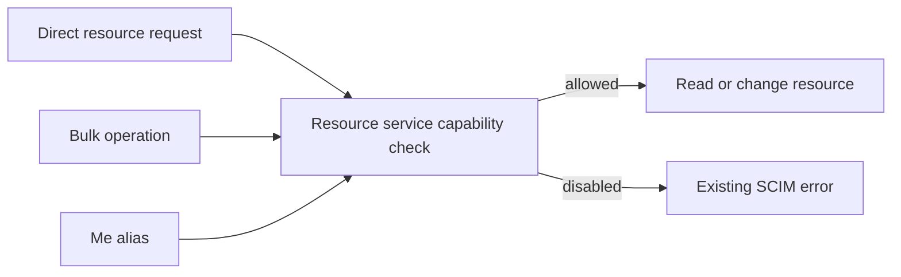

# SCIM capabilities: enforce the same decision before every operation

> **Last verified:** 2026-09-28
>
> **Package:** P6a, application capability boundary
>
> **Status:** Focused implementation gates passed on both backends; local commit prepared

## The problem

An endpoint could advertise `patch.supported:false`, reject direct User PATCH,
and still accept that PATCH inside Bulk. Custom-resource PATCH, filtering and
sorting also skipped the checks used by the built-in controllers.

The resource services now invoke the existing PATCH capability helper before
loading or changing resources. Direct routes, Bulk and aliases therefore reach
the same PATCH decision. The custom-resource list service also applies the
filter and sort helpers used by built-in query controllers.

User/Group client-query checks remain at their existing controller boundary.
This distinction matters: `/Me` internally looks up the signed-in user through
the User service's filtered lookup. Disabling client filtering must not disable
that internal identity lookup. An additional regression test proves this.
The change reuses existing statuses and error text; it adds no configuration.



## Contract

| Requested behavior | Disabled setting | Result |
|---|---|---|
| User, Group or custom PATCH | `patch.supported:false` | 501 before mutation |
| Embedded User/Group PATCH | Same | Bulk envelope 200, operation status `"501"`, unchanged resource/version |
| Custom filtering | `filter.supported:false` | 403 for GET and JSON search |
| Custom sorting | `sort.supported:false` | 403 for GET and JSON search |
| Unfiltered/unsorted reads | Unrelated capability disabled | Still available |

## Test-first evidence

The new HTTP suite failed **7/7** on the unmodified source. The actual failures
were successful mutations/queries where 501 or 403 was expected.
The first Group fixture was corrected to include the `members` field that the
DTO supplies. The corrected suite was rerun against the baseline before its
failure was counted as evidence.

With the implementation:

* New HTTP regression cases: **8/8 passed**, including `/Me` with client filtering disabled.
* Related profile/discovery/Bulk/Me HTTP suites: **69/69 across 5 suites passed**.
* The same five HTTP suites against real PostgreSQL **17.8**: **69/69 passed**.
  All 22 migrations applied to the task-owned database. The database identity,
  loopback mapping, owner labels and marker were verified before execution.
  Its exact container ID was removed afterward.
* Existing and new service/helper unit suites: **346/346 across 5 suites passed**.
* New direct service-boundary assertions: **5/5 passed**.
* API build passed.
* New test lint passed; changed production-file lint remained **0 errors /
  35 warnings**, identical to baseline.
* Independently runnable local live smoke: **7/7 passed**, including stored
  values/version after rejected writes and cleanup of the test endpoint.

Logs are under `test-results/p6/` in this worktree. The local live API was
stopped after the smoke run.

Independent code review found no significant issues. The first two
PostgreSQL-runner attempts stopped before migration or tests because of
guard/tooling problems; neither is counted as test evidence. The final run
reused the proven ownership guards, normalized the server's CIDR address before
comparing it to Docker's address, and used a non-shadowing `databaseUrl`
variable. Its sanitized receipt is `test-results/p6/postgres-receipt.json`.

## Reproduce the live check

Use an authorized test instance and a token held in a local variable:

```powershell
.\scripts\test-scim-capability-boundary.ps1 `
  -BaseUrl $testBaseUrl `
  -Token $testToken
```

The helper creates a dedicated synthetic endpoint and removes it in `finally`.
It is also called from the main [live test suite](../scripts/live-test.ps1).
It must not be run against a production estate without separate authorization.

## Remaining package scope

This is the capability-boundary portion of P6. Filter-before-projection, typed
ordering, page-limit differences, and filter schema resolution remain separate
work. No source analysis is relabeled as proof that those outcomes are fixed.

The overall tracker is [SCIM correctness design](SCIM_CORRECTNESS_DESIGN_AND_IMPLEMENTATION.md).
Release-version and consolidation gates remain pending until integration.

**Design disposition:** reuse the existing helpers rather than adding a
capability framework. **Test improvement:** assert rejected operations leave
the stored resource and version unchanged, not only that an error is returned.
Distinguish externally requested capabilities from internal lookup mechanisms.
