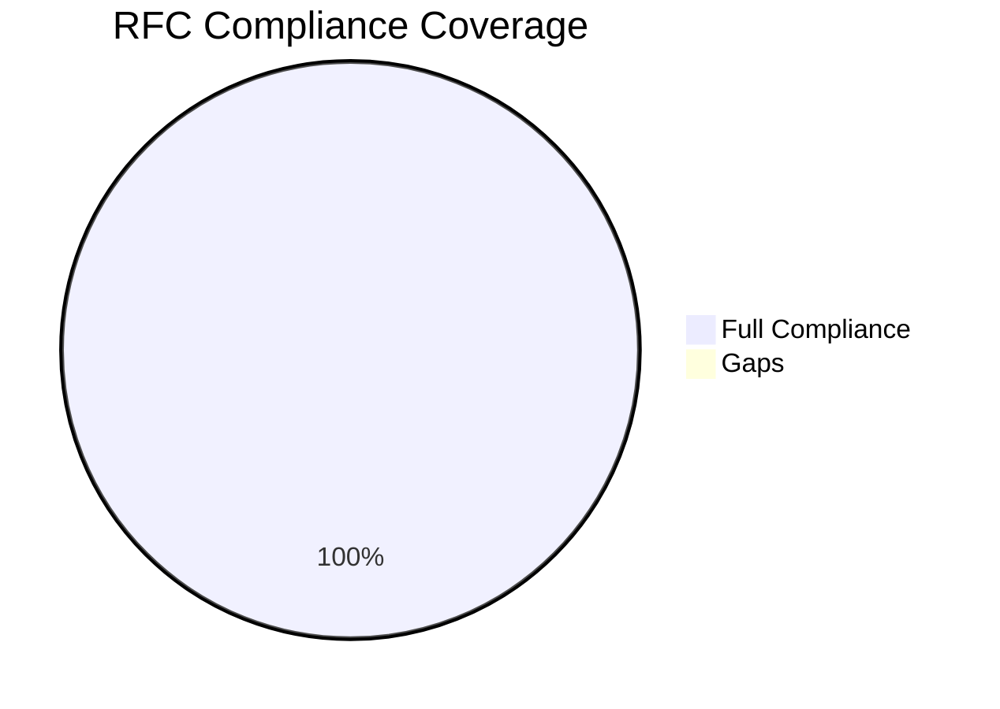
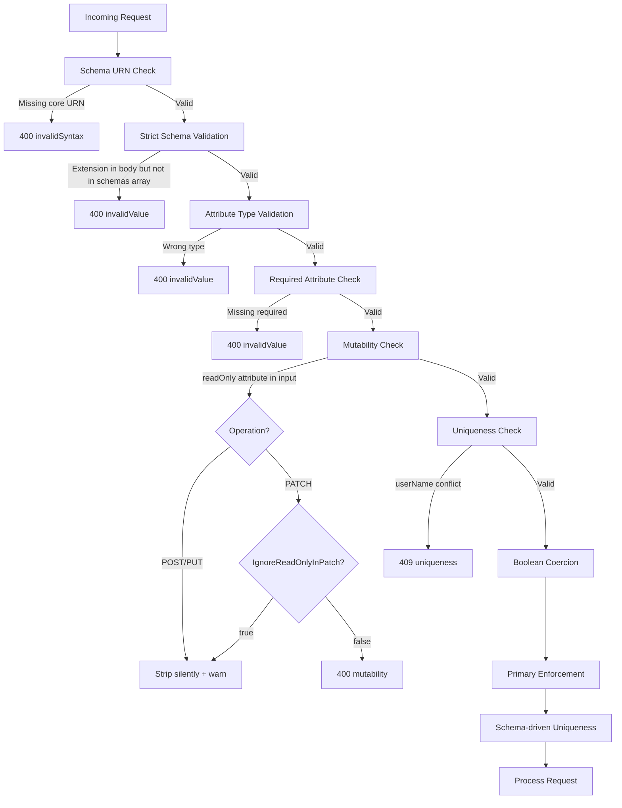

# SCIM 2.0 RFC Compliance

> **Version:** 0.40.0 - **Updated:** April 28, 2026  
> **Source of truth:** [api/src/modules/scim/](../api/src/modules/scim/)  
> **Status:** 100% compliant with RFC 7643 (Core Schema) and RFC 7644 (Protocol)

---

## Table of Contents

- [Compliance Summary](#compliance-summary)
- [RFC 7644 - Protocol Compliance](#rfc-7644---protocol-compliance)
- [RFC 7643 - Core Schema Compliance](#rfc-7643---core-schema-compliance)
- [Entra ID Compatibility](#entra-id-compatibility)
- [SCIM Error Types](#scim-error-types)
- [Schema Validation Pipeline](#schema-validation-pipeline)
- [Attribute Characteristic Enforcement](#attribute-characteristic-enforcement)
- [Test Evidence](#test-evidence)

---

## Compliance Summary



| Standard | Sections | Compliance | Notes |
|----------|----------|------------|-------|
| RFC 7643 (Core Schema) | 13 requirements | **100%** | All attribute characteristics enforced |
| RFC 7644 (Protocol) | 15 requirements | **100%** | All protocol operations implemented |
| Entra ID Compatibility | 8 requirements | **100%** | Boolean coercion, msfttest extensions, /scim/v2/ rewrite |

---

## RFC 7644 - Protocol Compliance

### Resource Operations (S3.1-3.6)

| Operation | Section | Status | Implementation |
|-----------|---------|--------|---------------|
| **POST (Create)** | S3.3 | Full | Users, Groups, custom resource types. Returns 201 + Location header + ETag |
| **GET (Read)** | S3.4.1 | Full | By ID with ETag. Supports If-None-Match (304 Not Modified) |
| **GET (List)** | S3.4.2 | Full | Filter, sort, pagination, attribute projection |
| **PUT (Replace)** | S3.5.1 | Full | Full resource replacement. Immutable attribute enforcement (H-2). If-Match |
| **PATCH (Modify)** | S3.5.2 | Full | add/replace/remove. ValuePath, extension URN, dot-notation, no-path |
| **DELETE (Remove)** | S3.6 | Full | Hard delete (configurable). Returns 204 No Content |

### PATCH Operations Detail (S3.5.2)

| PATCH Feature | Status | Implementation |
|--------------|--------|---------------|
| **add** operation | Full | Simple, valuePath, extension URN, no-path |
| **replace** operation | Full | Simple, valuePath, extension URN, dot-notation, no-path |
| **remove** operation | Full | Simple, valuePath, extension URN |
| Multi-op per request | Full | Up to 1,000 operations per PATCH request |
| Path: simple attribute | Full | `"displayName"`, `"active"` |
| Path: valuePath filter | Full | `emails[type eq "work"].value` |
| Path: extension URN | Full | `urn:...:enterprise:2.0:User:department` |
| Path: dot-notation | Full | `name.givenName` (requires `VerbosePatchSupported: true`) |
| Path: no-path merge | Full | `{"op":"replace","value":{...}}` - full resource merge |
| ReadOnly PATCH rejection | Full | 400 `mutability` when targeting readOnly attributes (G8c) |
| Immutable attribute check | Full | 400 on PUT/PATCH attempt to change immutable values (H-2) |

### Filtering (S3.4.2.2)

| Filter Feature | Status | Implementation |
|---------------|--------|---------------|
| `eq` (equal) | Full | Case-insensitive for strings (CITEXT) |
| `ne` (not equal) | Full | Database push-down |
| `co` (contains) | Full | Database push-down (pg_trgm) |
| `sw` (starts with) | Full | Database push-down |
| `ew` (ends with) | Full | Database push-down |
| `gt` (greater than) | Full | Database push-down |
| `ge` (greater or equal) | Full | Database push-down |
| `lt` (less than) | Full | Database push-down |
| `le` (less or equal) | Full | Database push-down |
| `pr` (present) | Full | Database push-down |
| `and` (logical AND) | Full | Compound expression push-down |
| `or` (logical OR) | Full | Compound expression push-down |
| `not` (logical NOT) | Full | In-memory fallback |
| ValuePath filter | Full | `emails[type eq "work"]` - in-memory evaluation |
| Nested group filters | Full | Parenthesized expressions |

### Sorting (S3.4.2.3)

| Sort Feature | Status | Implementation |
|-------------|--------|---------------|
| `sortBy` parameter | Full | Any first-class attribute |
| `sortOrder` parameter | Full | `ascending` (default), `descending` |
| Default sort | Full | `createdAt` ascending when unspecified |
| Case-insensitive sort | Full | Via CITEXT column type |

### Pagination (S3.4.2.4)

| Pagination Feature | Status | Implementation |
|-------------------|--------|---------------|
| `startIndex` parameter | Full | 1-based indexing per RFC |
| `count` parameter | Full | Default 100, max 1000 |
| `totalResults` in response | Full | Total matching count before pagination |
| `itemsPerPage` in response | Full | Actual items returned |

### Attribute Projection (S3.4.2.5)

| Projection Feature | Status | Implementation |
|-------------------|--------|---------------|
| `attributes` parameter | Full | Return only specified attributes |
| `excludedAttributes` parameter | Full | Return all except specified |
| Always-returned attributes | Full | `schemas`, `id`, `meta` never excluded |
| `returned: never` enforcement | Full | Password and writeOnly attributes never appear |
| `returned: request` handling | Full | Only included when explicitly requested via `attributes` |
| `returned: default` handling | Full | Included by default, excludable |
| `returned: always` handling | Full | Always included regardless of params |

### POST Search (S3.4.3)

| Search Feature | Status | Implementation |
|---------------|--------|---------------|
| POST `/.search` endpoint | Full | Users, Groups, custom resource types |
| Body: filter, startIndex, count | Full | Same as GET query parameters |
| Body: sortBy, sortOrder | Full | Full sort support |
| Body: attributes, excludedAttributes | Full | Full projection support |
| SearchRequest schema validation | Full | `urn:ietf:params:scim:api:messages:2.0:SearchRequest` |

### Bulk Operations (S3.7)

| Bulk Feature | Status | Implementation |
|-------------|--------|---------------|
| POST /Bulk endpoint | Full | Requires `bulk.supported: true` in SPC |
| POST, PUT, PATCH, DELETE methods | Full | All CRUD operations in bulk |
| `bulkId` cross-referencing | Full | `bulkId:identifier` in paths and data values |
| `failOnErrors` threshold | Full | Stop after N errors (0 = process all) |
| Sequential processing | Full | Operations processed in order |
| Per-operation ETag | Full | `version` field maps to If-Match |
| Max operations limit | Full | 1,000 per request |
| Max payload size | Full | 1 MB per request |
| BulkRequest schema validation | Full | `urn:ietf:params:scim:api:messages:2.0:BulkRequest` |

### /Me Endpoint (S3.11)

| /Me Feature | Status | Implementation |
|------------|--------|---------------|
| GET /Me | Full | Resolves OAuth JWT `sub` claim to userName |
| PUT /Me | Full | Replace current user |
| PATCH /Me | Full | Modify current user |
| DELETE /Me | Full | Delete current user |
| Identity resolution | Full | JWT `sub` - userName lookup, 404 for non-OAuth auth |

### Discovery (S4)

| Discovery Feature | Status | Implementation |
|------------------|--------|---------------|
| GET /Schemas | Full | Global + endpoint-scoped |
| GET /Schemas/{uri} | Full | Individual schema by URN |
| GET /ResourceTypes | Full | Global + endpoint-scoped |
| GET /ResourceTypes/{id} | Full | Individual resource type |
| GET /ServiceProviderConfig | Full | Global + endpoint-scoped |
| No auth required | Full | All discovery routes are public |
| `schemas[]` on Schema resources | Full | RFC 7643 S7 |
| `meta` on Schema resources | Full | With location and resourceType |

### Content-Type (S3.1)

| Content-Type Feature | Status | Implementation |
|---------------------|--------|---------------|
| Accept `application/scim+json` | Full | Primary SCIM content type |
| Accept `application/json` | Full | Fallback for compatibility |
| Response `application/scim+json` | Full | All SCIM responses |
| 415 on invalid Content-Type | Full | POST/PUT/PATCH validation middleware |

### ETag / Conditional Requests (S3.14)

| ETag Feature | Status | Implementation |
|-------------|--------|---------------|
| Weak ETags (`W/"version"`) | Full | Version-based, auto-increment |
| `ETag` response header | Full | On all resource responses |
| `If-Match` for write ops | Full | Pre-condition check on PUT/PATCH/DELETE |
| `If-None-Match` for reads | Full | 304 Not Modified on match |
| 412 on version mismatch | Full | `versionMismatch` scimType |
| `RequireIfMatch` enforcement | Full | Configurable per endpoint |

### Error Format (S3.12)

| Error Feature | Status | Implementation |
|-------------|--------|---------------|
| SCIM Error schema | Full | `urn:ietf:params:scim:api:messages:2.0:Error` |
| `status` as string | Full | Per RFC (e.g., `"409"` not `409`) |
| `scimType` field | Full | 11 standard error types |
| `detail` field | Full | Human-readable description |
| Diagnostics extension | Full | `urn:scimserver:api:messages:2.0:Diagnostics` with requestId, logsUrl |

---

## RFC 7643 - Core Schema Compliance

### Attribute Characteristics (S2)

| Characteristic | Status | Implementation |
|---------------|--------|---------------|
| `required` enforcement | Full | Validated on create/replace. Exempts readOnly attributes |
| `type` validation | Full | string, boolean, integer, decimal, complex, dateTime, reference, binary |
| `mutability` enforcement | Full | readOnly rejected on create/replace. readOnly/immutable on PATCH |
| `returned` filtering | Full | always, default, request, never - applied on all responses |
| `uniqueness` enforcement | Full | server/global uniqueness check on create/replace/PATCH |
| `caseExact` handling | Full | Case-insensitive comparison via CITEXT |
| `canonicalValues` validation | Full | Validated against allowed value sets |
| `multiValued` enforcement | Full | Single-valued vs multi-valued attribute type checking |
| Sub-attribute validation | Full | Complex type sub-attributes validated recursively |

### Case Insensitivity (S2.1)

| Case Feature | Status | Implementation |
|-------------|--------|---------------|
| Attribute names | Full | Case-insensitive canonicalization via `CANONICAL_KEY_MAP` |
| URN comparison | Full | Case-insensitive schema URN matching |
| Filter values (strings) | Full | CITEXT column type in PostgreSQL |
| Query parameter names | Full | Case-insensitive parameter handling |

### Multi-Valued Attributes (S2.4)

| MV Feature | Status | Implementation |
|-----------|--------|---------------|
| `primary` sub-attribute | Full | Tri-state enforcement: normalize, reject, passthrough |
| `type` sub-attribute | Full | Standard types (work, home, etc.) |
| `display` sub-attribute | Full | Auto-populated on group members |
| ValuePath operations | Full | Filter-based targeting of specific values |

### Schema URN Constants

| URN | Usage |
|-----|-------|
| `urn:ietf:params:scim:schemas:core:2.0:User` | Core User schema |
| `urn:ietf:params:scim:schemas:core:2.0:Group` | Core Group schema |
| `urn:ietf:params:scim:schemas:extension:enterprise:2.0:User` | Enterprise User extension |
| `urn:ietf:params:scim:api:messages:2.0:ListResponse` | List response wrapper |
| `urn:ietf:params:scim:api:messages:2.0:PatchOp` | PATCH operation request |
| `urn:ietf:params:scim:api:messages:2.0:BulkRequest` | Bulk request |
| `urn:ietf:params:scim:api:messages:2.0:BulkResponse` | Bulk response |
| `urn:ietf:params:scim:api:messages:2.0:SearchRequest` | POST .search request |
| `urn:ietf:params:scim:api:messages:2.0:Error` | Error response |
| `urn:ietf:params:scim:schemas:core:2.0:ServiceProviderConfig` | SPC discovery |
| `urn:ietf:params:scim:schemas:core:2.0:Schema` | Schema discovery |
| `urn:ietf:params:scim:schemas:core:2.0:ResourceType` | ResourceType discovery |

---

## Entra ID Compatibility

SCIMServer includes specific compatibility features for Microsoft Entra ID provisioning:

| Feature | Implementation |
|---------|---------------|
| **Boolean string coercion** | `AllowAndCoerceBooleanStrings` flag converts `"True"/"False"` to native booleans |
| **URL rewrite** | `/scim/v2/*` auto-rewritten to `/scim/*` in main.ts middleware |
| **Microsoft test extensions** | 4 msfttest extension schemas included in entra-id/entra-id-minimal presets |
| **Enterprise User** | Full EnterpriseUser extension with manager, department, costCenter |
| **PATCH compatibility** | Multi-member add/remove, no-path replace, valuePath filters |
| **409 on userName conflict** | Always returns 409 with `uniqueness` scimType and rich diagnostics |
| **Soft delete support** | PATCH active=false deactivates user (re-provisionable via POST) |
| **Case-insensitive userName** | PostgreSQL CITEXT column ensures case-insensitive matching |

### Entra ID Test Connection

Entra ID's "Test Connection" sends:

```http
GET /scim/endpoints/{id}/Users?filter=userName eq "nonexistent_user" HTTP/1.1
```

SCIMServer returns an empty ListResponse (200 OK) which Entra ID interprets as a successful connection.

---

## SCIM Error Types

All 11 RFC 7644 S3.12 error types are implemented:

| scimType | HTTP Status | Trigger |
|----------|-------------|---------|
| `uniqueness` | 409 | Duplicate userName (Users) or displayName (Groups) |
| `invalidFilter` | 400 | Malformed SCIM filter expression |
| `invalidSyntax` | 400 | Malformed request body or missing required fields |
| `invalidPath` | 400 | Invalid PATCH path expression |
| `noTarget` | 400 | PATCH target attribute/value not found |
| `invalidValue` | 400 | Attribute value fails type/canonical/schema validation |
| `mutability` | 400 | Attempt to modify readOnly or immutable attribute |
| `versionMismatch` | 412 | If-Match ETag does not match current version |
| `tooMany` | 400 | Too many results without filter |
| `sensitive` | 403 | Sensitive operation blocked |
| `tooLarge` | 413 | Payload exceeds size limit |

---

## Schema Validation Pipeline



The schema validator performs 10 validation types:

1. Required attributes (create/replace only, not PATCH; exempts readOnly)
2. Attribute type checking (string, boolean, integer, decimal, complex, dateTime, reference, binary)
3. Mutability constraints (readOnly rejected on write operations)
4. Unknown attribute detection (strict mode)
5. Multi-valued / single-valued enforcement
6. Sub-attribute validation for complex types
7. Canonical value enforcement
8. Required sub-attribute enforcement
9. Strict ISO 8601 dateTime format
10. `schemas[]` array validation

---

## Attribute Characteristic Enforcement

| Characteristic | POST | PUT | PATCH | GET (response) |
|----------------|------|-----|-------|----------------|
| `required` | Validated | Validated | N/A (partial) | N/A |
| `type` | Validated | Validated | Per-op value validated | N/A |
| `mutability: readOnly` | Stripped | Stripped | Rejected or stripped | Always included |
| `mutability: immutable` | Allowed (set once) | Rejected if changed | Rejected if changed | Always included |
| `mutability: writeOnly` | Allowed | Allowed | Allowed | Never returned |
| `returned: never` | N/A | N/A | N/A | Stripped from response |
| `returned: request` | N/A | N/A | N/A | Only with `?attributes=` |
| `returned: always` | N/A | N/A | N/A | Always included |
| `returned: default` | N/A | N/A | N/A | Included unless excluded |
| `uniqueness: server` | 409 on conflict | 409 on conflict | 409 on conflict | N/A |
| `canonicalValues` | Validated | Validated | Per-op validated | N/A |
| `primary` (multi-valued) | Enforced per mode | Enforced per mode | Post-merge enforced | N/A |

---

## Test Evidence

Compliance is verified through 4 layers of testing:

| Layer | Count | Coverage |
|-------|-------|----------|
| **Unit tests** | 3,429 (84 suites) | Schema validation, PATCH engines, filter parsing, attribute projection |
| **E2E tests** | 1,128 (53 suites) | Full HTTP request/response verification for all operations |
| **Live tests** | ~817 (60 sections) | Real HTTP against running server - all deployment targets |
| **ISV tests** | 112 (13 sections) | Lexmark SCIM Validator compliance verification |

### Key Test Suites

| Suite | Tests | Verified Features |
|-------|-------|-------------------|
| `rfc-compliance.e2e-spec.ts` | ~50 | Core RFC 7644 operations |
| `filter-operators.e2e-spec.ts` | ~30 | All 10 comparison operators + logical |
| `attribute-projection.e2e-spec.ts` | ~25 | Attributes/excludedAttributes + returned characteristic |
| `etag-conditional.e2e-spec.ts` | ~20 | If-Match, If-None-Match, version enforcement |
| `schema-validation.e2e-spec.ts` | ~30 | Schema-driven validation pipeline |
| `bulk-operations.e2e-spec.ts` | ~25 | Bulk CRUD, bulkId cross-ref, failOnErrors |
| `discovery-endpoints.e2e-spec.ts` | ~20 | All discovery endpoints, no-auth access |
| `returned-characteristic.e2e-spec.ts` | ~15 | never/request/default/always filtering |
| `primary-enforcement.e2e-spec.ts` | ~15 | normalize/reject/passthrough modes |
| `readonly-stripping.e2e-spec.ts` | ~15 | ReadOnly attribute handling on all operations |
