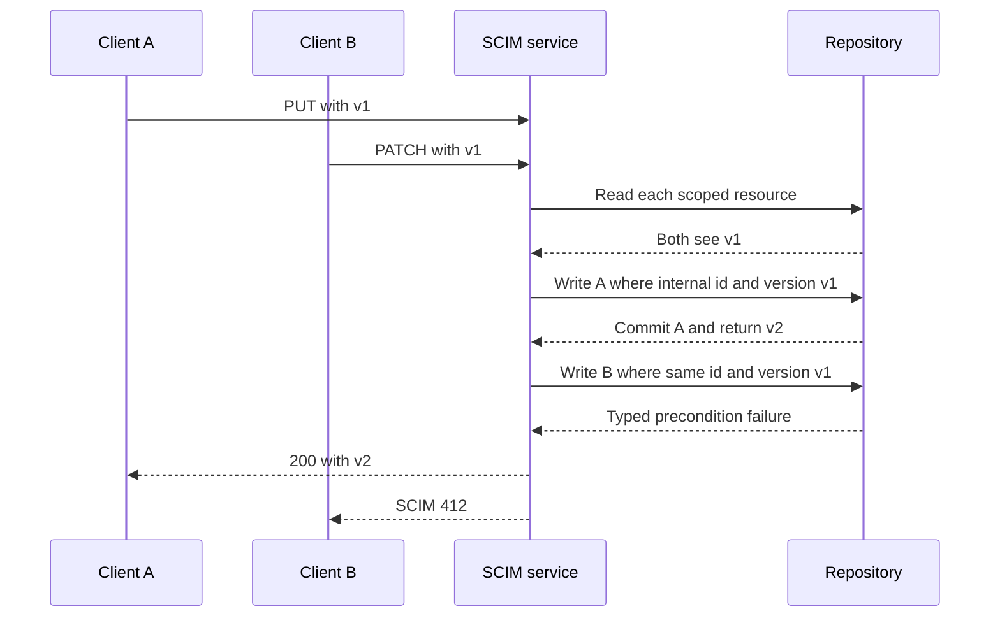
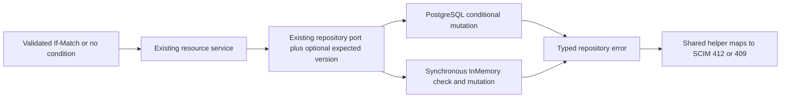

# Conditional resource writes and User uniqueness

**Last verified:** 2026-09-28

**Status:** P3 implemented and locally validated on both backends. Release,
reviewed integration, version metadata and deployment gates remain pending.

**P3b follow-up:** [atomic schema-driven uniqueness](SCIM_UNIQUENESS_IMPLEMENTATION.md)
extends persistence protection to Group/custom names and declared scalar/MV
extension leaves. It does not alter the conditional-write semantics below.

## What changes for a client

A client that reads `W/"v1"` and sends it back with PUT, PATCH or DELETE can
no longer silently overwrite a concurrent write. The condition is checked
when storage changes, not only when the request first reads the resource.
This applies to Users, Groups and registered custom resources.

Two clients can both pass the initial check. Only one version-specific write
can commit. The other receives a SCIM 412 response. The stored version advances
once, from 1 to 2. For a Group, the losing operation changes neither its
scalar fields nor its members.

InMemory also rejects case-insensitive duplicate User names atomically during
create and rename. Names remain isolated by endpoint. PostgreSQL already has
the required CITEXT uniqueness constraint, so this change adds no migration.

## Expected versus observed

All observations below use synthetic resources and actual original repository
methods, with a deterministic barrier immediately before persistence.

| Scenario | Before this change | Expected and observed after this change |
|---|---|---|
| Same-version PUT, each of three resource families | Both backends: 200/200, stored v3 | Both: one 200, one 412, stored v2 and winner's scalar value |
| Same-version PATCH, each family | Both: 200/200, stored v3 | Both: one 200, one 412, stored v2 |
| Same-version DELETE, each family | Both: one 204, one 404 | Both: one 204, one 412, row absent |
| Another write commits after DELETE's initial read | Deletion was unconditional | 412; intervening writer's value remains at v2 |
| Group conditional failure | Both writers could replace scalar and members | Losing candidate contributes no field or member changes |
| Concurrent User create, names differing only by case | InMemory stored both; PostgreSQL rejected one | One 201 and one 409; exactly one row at v1 |
| Concurrent User PUT/PATCH renames to the same name | InMemory accepted both | One 200 and one 409; versions exactly 2 for winner and 1 for loser |
| Same name in another endpoint | Allowed | Still allowed; foreign-endpoint resource writes return 404 |
| ETags disabled by profile | Generic service still checked supplied headers | All resource families ignore supplied conditions |

The historical analysis remains unchanged. The corrected current-source RED
run was `postgres-00fe566caa96aa32`: InMemory 11 passed / 13 failed,
PostgreSQL 14 passed / 10 failed. RED unit controls additionally showed
duplicate creation succeeding and the precondition helper returning no
persistence condition.

Final dual-backend run: `postgres-69bf7bf777debff5`. Each backend passed
**55 HTTP tests**: 28 new conditional-write tests plus 27 existing ETag tests.
The new suite includes one live PowerShell test with **33 assertions** per
backend. The targeted unit set passes **692 tests in 13 suites**.

## Condition semantics

| Input and state | Behavior |
|---|---|
| Matching `W/"vN"` with ETags enabled | Pass N to persistence; update/delete predicates must match N |
| Stored version changes before persistence | Typed `PRECONDITION_FAILED`, mapped to SCIM 412 |
| Target disappears after the initial successful read | Conditional write returns 412, including wildcard |
| Target absent at the initial scoped lookup | Existing 404 behavior is preserved |
| No If-Match | Existing unconditional write policy; successful updates increment once |
| `If-Match: *` | Requires existence at mutation, not a snapshot version; two wildcard updates may both succeed |
| Comma-separated ETag list | Existing parser does not support lists and rejects them with 412; no list is silently reduced to one version |
| `RequireIfMatch` enabled and header missing | Existing 428 behavior |
| Profile has `etag.supported: false` | Neither header validation nor persistence precondition applies |

The existing weak-tag comparison and `versionMismatch` error vocabulary are
preserved. This is not a redesign of HTTP validator parsing or the error
catalog. See RFC 7644 section 3.14 and RFC 9110 section 13.1.1 for conditional
request semantics; list support remains a compatibility limitation.

## How the implementation works



The existing repository ports take an optional `expectedVersion`, either a
number or `'*'`. The service first resolves the endpoint and resource type,
then looks up the resource in that scope. It passes the resulting immutable,
globally unique internal storage id to the write. A foreign endpoint cannot
substitute a resource's SCIM-visible id into this internal-id port. Updates
do not accept identity, endpoint or resource-type changes in their input.

* **Prisma:** a typed update/delete predicate combines the internal id and
  numeric version. PostgreSQL evaluates that predicate atomically with the
  version increment. Prisma P2025 from a conditional mutation becomes a typed
  precondition failure; without a condition it remains NOT_FOUND.
* **Group with members:** the version predicate is on the first write inside
  the existing transaction. A losing writer never deletes or inserts members.
* **InMemory:** lookup, precondition check and map mutation contain no `await`.
  Group replacement records are staged before either map is changed, and the
  complete aggregate mutation runs synchronously.
* **User uniqueness:** the InMemory repository checks endpoint plus lowercased
  name synchronously immediately before create/update. Updating one's own
  name with different casing is allowed. This follows the existing
  lowercasing/CITEXT policy; it does not introduce a new Unicode normalization
  or collation policy.
* **Error boundary:** one shared service helper turns repository precondition
  failures into 412 without exposing backend exceptions. Expected conflicts
  are logged at debug level, without request payloads or supplied headers.



Key sources:
[condition contract](../api/src/domain/repositories/write-precondition.ts),
[service helper](../api/src/modules/scim/common/scim-service-helpers.ts),
[Prisma error translation](../api/src/infrastructure/repositories/prisma/prisma-error.util.ts),
[Group transaction](../api/src/infrastructure/repositories/prisma/prisma-group.repository.ts),
[InMemory User](../api/src/infrastructure/repositories/inmemory/inmemory-user.repository.ts).

## Reproduce safely

Use the existing installed dependencies and a locally available
`postgres:17-alpine` image. The runner never accepts an existing database URL.

```powershell
node .\scripts\scim-conditional-writes\check-safety.cjs
node .\scripts\scim-conditional-writes\run.cjs
```

The new runner is independent of the deliberately pinned historical harness.
It rejects the normal E2E database marker, creates a uniquely named labeled
container, binds a random loopback-only port, uses tmpfs, and generates its
password only in memory. Docker identity, PostgreSQL 17 identity, cluster id
and task ownership marker are checked before all 22 migrations and before
the Prisma E2E lane. Normal destructive E2E setup/teardown is never invoked.

Actual final server: PostgreSQL **17.8**, Docker **29.6.2**. The final source
fingerprint over API and scripts was
`bd3249016313d081418f0bfa838e75f367bac164afd3bb849d472ec221c56bc7`
on base `cb2e1bcb4ad31366ef972ac5a163e8aae0e0707e` plus this worktree's changes.
Results and exact stored rows are saved under
`test-results/conditional-writes/postgres-<run-id>`.

Every run removed only its verified exact container id. The final removed id
was `a1bbe230e6996c46facd13d72687eb3865fbb6a2083db321330984f89cd9bc6b`.
No persistent volumes, custom networks, external databases or live estates
were used. No inherited DATABASE_URL was trusted. Test listeners were closed.
Generated Prisma files stay in this worktree; no dependency target was mutated.

| Gate | Result |
|---|---|
| RED before production edits | Confirmed unit, service helper and both actual HTTP backends |
| API build | PASS |
| Targeted ESLint | PASS, zero errors; measured 147 warnings before and after in 23 tracked files; new TypeScript files clean |
| Targeted repository/service/helper units | PASS, 692 tests |
| InMemory / PostgreSQL HTTP | PASS, 55 / 55 tests |
| Owned live HTTP | PASS, 33 / 33 PowerShell assertions |
| Safety negative controls | PASS, three rejected unsafe setups without DB contact |
| Documentation content/JSON/freshness | PASS: 26 manifest docs, coupled freshness, 41 JSON blocks |
| Relative links | All new links resolve; three pre-existing Session_starter links remain outside P3 scope |
| Real Mermaid render | PASS: five diagrams in both strict themes; built-in renderer discovery reports version 0.0.0 and warns, so no viewer-version equivalence is claimed |
| Full release matrix, reviewed PR, version metadata, deployment | PENDING parent consolidation; not claimed complete |

## Deliberately separate guarantees

**P3b requires its own design:** atomic schema-driven uniqueness, Group
displayName uniqueness, custom-resource names, externalId uniqueness,
global uniqueness semantics and arbitrary attribute indexes. Service-level
prechecks for those attributes can still race. This package does not claim
otherwise.

**P4 remains separate:** Group create-plus-members rollback, complete native
membership-constraint parity and injected membership-failure guarantees.
This package proves that a failed version condition cannot partially change
an existing Group aggregate; that is not proof of every Group transaction.

No parser/engine refactor, search/error redesign, data repair, release bump,
remote publication or deployment belongs to P3.

**Self-improvement:** applied deterministic barriers around real implementations,
stored-version/value assertions, typed-error checks and decoded live-response
checks. The [RCA ledger](SCIM_CORRECTNESS_EXECUTION_ISSUES_AND_RCA.md) records
fixture and environment issues separately from product defects.

**Design disposition: accepted.** Existing narrow repository ports and Group's
aggregate transaction are sufficient. A global Unit of Work, new migration or
general policy framework would add complexity without a second concrete need.
