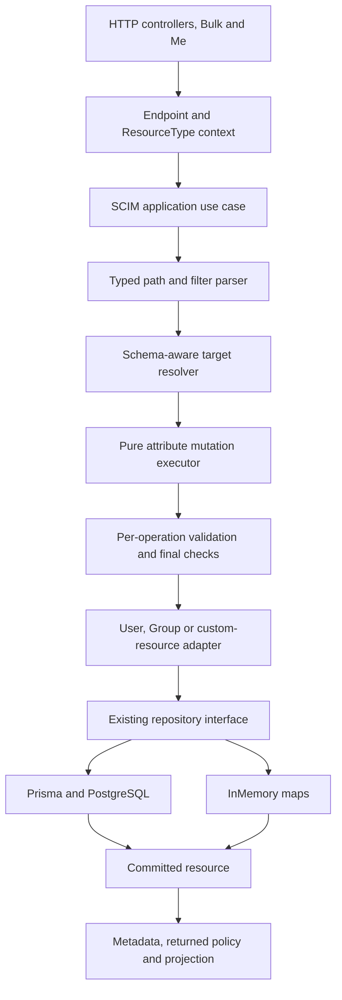
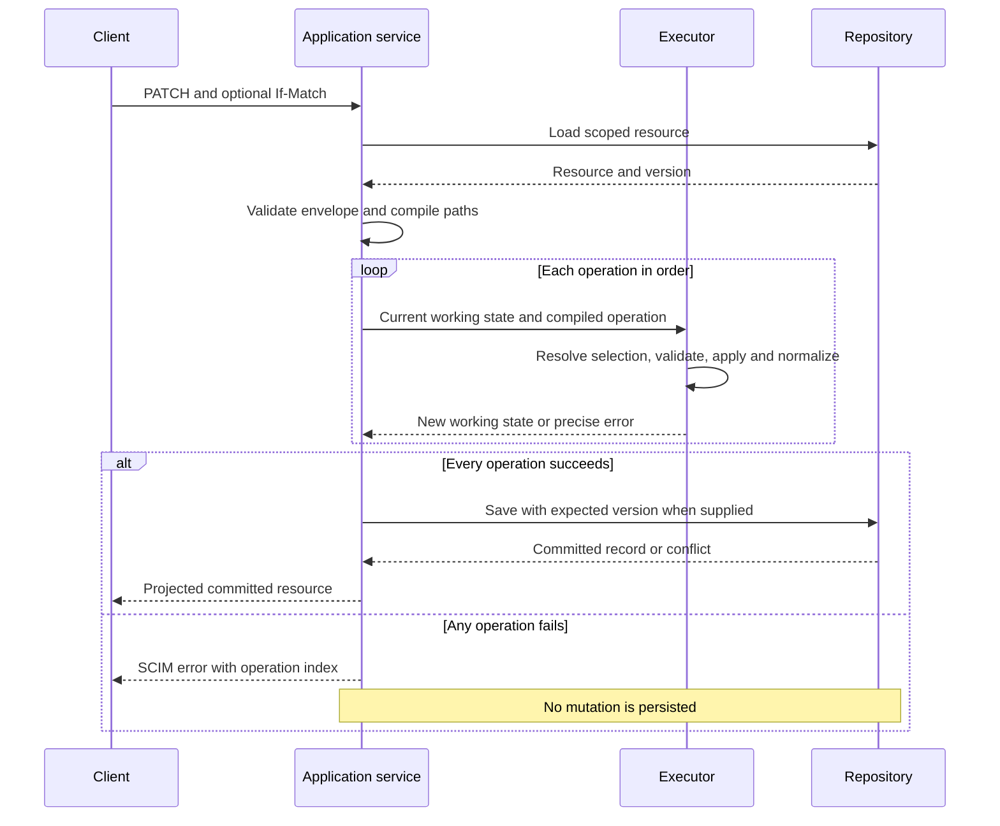

# SCIM correctness: design, implementation, and progress

> **Status:** Implementation authorized; work packages are tracked below
>
> **Last verified:** 2026-09-29
>
> **Starting source:** `ccde1d5d6b5129dd943c6e848989c668a0d00d7a`, version `0.55.35`
>
> **Evidence:** [Independent report](SCIM_FRESH_MASTER_ANALYSIS_2026-09-25.md),
> [82-case database comparison](evidence/scim-fresh-20260925/postgres-20260928-expanded.summary.json),
> and [reproduction instructions](evidence/scim-fresh-20260925/repro-postgres/README.md).

## 1. What we are delivering

The goal is to make SCIM requests behave correctly and consistently for Users,
Groups, and custom resource types on both PostgreSQL and InMemory.

The first release fixes the reported Boolean PATCH path. Later releases correct
operation behavior, conditional writes, Group transactions, search, capability
checks, profile validation, and endpoint lifecycle behavior. We will share the
code that interprets the protocol without hiding the real differences between
the resources or databases.

This is not one large rewrite. Each work package needs its own failing test,
implementation, validation evidence, documentation, and commit. A package is
not complete merely because another package's tests passed.

### What is not authorized by this implementation request

* No automatic change to live endpoint settings or stored customer resources.
* No automatic replay of the original PATCH.
* No customer-production promotion.
* No replacement of dependencies or lockfiles through an unapproved registry.
* No new SCIM protocol such as cursor pagination or security events.

Local disposable PostgreSQL testing is authorized. Remote publication,
reviewed merge, deployment, and data repair remain explicit checkpoints rather
than an implied consequence of a local test passing.

## 2. Why these changes are needed

The database comparison executed 82 cases per backend and 771 assertions.
It demonstrated incorrect behavior, not just missing tests:

| Problem | Consequence | Design response |
|---|---|---|
| Different code interprets the same PATCH path differently | A valid selector becomes a literal property name | One typed path representation |
| Three engines implement similar mutations differently | `add` can replace a list; selected updates change only one match | Shared operation primitives, then a shared executor |
| State is checked only before or after the whole PATCH | Required, immutable and primary rules can be wrong between operations | Validate each transition in request order |
| If-Match is checked before an unconditional write | Two clients with the same version can both save | Conditional repository writes |
| InMemory lacks database constraints and transactions | Duplicate or partially written resources | Explicit atomic map operations and contract tests |
| Capabilities are checked only in some controllers | Bulk or custom routes can bypass a disabled capability | Shared application-level checks |
| Querying uses response-shaped data | Hidden attributes disappear before filtering | Separate internal resource data from response projection |

The earlier evidence files stay unchanged. Implementation results are new
evidence; they must not overwrite the record of the failing product.

## 3. The intended architecture



The application service coordinates the work. The parser and executor do not
read environment variables, look up credentials, issue database queries, or
publish events. Repositories do not interpret SCIM filter text.

Keep existing repository interfaces and dependency-injection tokens:

* [IUserRepository](../api/src/domain/repositories/user.repository.interface.ts)
* [IGroupRepository](../api/src/domain/repositories/group.repository.interface.ts)
* [IGenericResourceRepository](../api/src/domain/repositories/generic-resource.repository.interface.ts)
* [RepositoryModule](../api/src/infrastructure/repositories/repository.module.ts)

Do not introduce a universal repository with a growing resource-type switch.
Use composition rather than a controller/service inheritance hierarchy.

### Resource-specific responsibilities

| Resource | Responsibilities that stay outside the generic executor |
|---|---|
| User | Promoted database fields, username uniqueness, active-state policy, computed groups, User events, and `/Me` subject resolution |
| Group | Member references, deduplication, member-operation settings, and atomic Group-plus-member persistence |
| Custom resource | Dynamic core schema, extension bindings, registered route, optional query columns, and resource events |
| Endpoint administration | Profile merge/replacement rules, schema registration, credentials, cache refresh and cascade cleanup; this is not Resource PatchOp |

## 4. Path interpretation and ordered PATCH execution

### 4.1 Parse syntax once; resolve matches at each operation

The path parser produces an immutable structure describing the namespace,
attribute, optional predicate and optional sub-attribute. It must preserve
typed predicate values and the original operation index for diagnostics.

The following is a proposed interface shape, not an existing implementation:

```typescript
type PatchPath =
  | { kind: 'resource' }
  | {
      kind: 'attribute';
      schemaUrn?: string;
      attribute: string;
      subAttribute?: string;
    }
  | {
      kind: 'selection';
      schemaUrn?: string;
      attribute: string;
      predicate: FilterNode;
      subAttribute?: string;
    };
```

Use the existing filter parser/evaluator where its behavior is proven by tests.
Do not assume it already handles every escape, numeric representation,
attribute spelling, or namespace correctly. Add targeted grammar tests before
extending or relocating it. Keep compatibility re-exports when moving pure
code out of the HTTP module tree.

**Parsing once is not selecting once.** If operation 1 adds an entry,
operation 2 must be able to select that entry. Resolve values against the
current working resource at each step.



### 4.2 Required operation rules

| Rule | Implementation requirement |
|---|---|
| Native Boolean/number/null predicates | Keep literal types; do not require string quotes |
| Invalid bracket syntax | Explicit path/filter error; never a literal property or silent success |
| Multi-valued `add` | Preserve existing values and append/merge according to the selected target |
| Filtered replacement | Update all matches; zero-match replacement returns `noTarget` |
| Complex replacement | Preserve unspecified sub-attributes as the PATCH rules require |
| Required removal | Reject the operation that unassigns a required attribute |
| Immutable values | Check against the current working state, including earlier operations |
| Primary handoff | When an operation selects a new primary, clear the others before the next operation |
| Whole-request failure | Discard working state, including all earlier operations |
| Hidden values | Keep internal state separate from the response view |

### 4.3 Compatibility decisions

Do not silently turn a refactor into a change to every endpoint:

* Keep quoted-Boolean support where it exists, with schema-aware conversion.
  Correct string values that happen to equal `"true"` remain strings.
* Support documented Entra Group remove value arrays through a compatibility
  normalizer; do not treat them as ordinary RFC remove syntax.
* Keep current zero-match Group-member idempotency until its policy is tested.
  RFC text and examples are not completely consistent here.
* Filtered add with no match needs a named policy. Preserve the proven
  equality-discriminator case; do not invent objects from arbitrary compound
  predicates.
* Do not add a new flag just to avoid fixing malformed path storage.
* Changes to literal dotted-key behavior, primary policies, requiredness and
  response status are behavior changes. Document their impact and cover
  existing presets before changing their defaults.

## 5. Schema characteristics and response rules

Use the effective endpoint schema, including published characteristics and
applicable RFC defaults. Read a characteristic from the resolved target rather
than finding it by a bare sub-attribute name shared by unrelated extensions.

| Characteristic | Where it is checked |
|---|---|
| `type`, `multiValued` | Schema registration, request values, selected elements and resulting shape |
| `required` | Create/replace requirements and individual removal transitions |
| `mutability` | Operation-specific readOnly, immutable and writeOnly behavior |
| `caseExact` | Predicate comparison, case preservation and the chosen uniqueness equality rule |
| `returned` | Write response and GET/list/search projection, after permitted filtering |
| `uniqueness` | Supported scope checked atomically where promised |
| `canonicalValues` | Provider restriction if enabled; not an automatic closed enum from the RFC |
| `referenceTypes` | URI/reference type checks and scoped local referential-integrity policy |
| Extension `required` | ResourceType binding, distinct from required fields inside that extension |
| `primary` | Per-operation list normalization; not a separate schema characteristic |

All eight types and both single/multi-valued forms remain in the test inventory.
Simple multi-valued children are not forbidden complex nesting. The Schema
discovery resource has its documented structural exception.

POST and PUT ignore client readOnly values under their rules. PATCH normally
rejects incompatible mutations; explicit ignore settings are compatibility.
Required checks and normalizers must run on the same candidate state that will
be saved, not a discarded temporary copy.

Response rules:

* A 200 PATCH response is compared to a later GET only for common visible
  attributes after projection. A valid 204 has no body.
* `returned:request` can differ between write responses and ordinary GET.
* Always suppress writeOnly and `returned:never` values.
* SCIM errors have string `status` and optional string `detail`; structured
  lists belong in the diagnostic extension.
* Do not put secrets or raw predicate values in new diagnostic logs.

## 6. Persistence design

### 6.1 Conditional update and delete

Extend each aggregate's existing write port with an optional expected version.
When supplied, PostgreSQL's update/delete predicate includes the version and
resource scope. InMemory checks and replaces/deletes the map entry in one
synchronous operation. A mismatch becomes the same typed repository conflict
on either backend and is mapped to HTTP 412.

**P3 implementation:** [conditional writes and User uniqueness](SCIM_CONDITIONAL_WRITES_IMPLEMENTATION.md).
The condition is a numeric version or wildcard existence requirement. The
initial endpoint/resource-type lookup resolves the unique internal storage id;
the atomic write predicates combine that id with the numeric version. A target
removed after the read fails the supplied precondition with 412; an initially
missing target retains 404. Existing unsupported ETag lists still fail rather
than being silently reduced to one version.

Without a client condition, preserve the documented existing write policy.
Do not add hidden retries that reinterpret a client's intended selection.
If a retry is required by a later design, re-read and reapply deliberately.

### 6.2 Group transactions

Group create plus members and Group update plus members are aggregate writes.
PostgreSQL must perform each in a transaction. InMemory must validate/stage
the new Group and member collection before publishing either.

Keep reference lookups outside a long-held transaction where safe, but verify
any constraint that can race at the actual commit boundary. After failure,
scalar values, payload, members and version must all match the original state.

**P4 implementation:** [Group aggregate transactions](SCIM_GROUP_TRANSACTIONS_IMPLEMENTATION.md).
The create port accepts initial members; the service resolves them before
persistence. Prisma uses one transaction and InMemory stages all members
before publishing either map. InMemory also reads the aggregate without an
intervening await, preventing old scalar fields with new members. No new
schema or Group-name uniqueness guarantee is introduced.

### 6.3 Uniqueness

Keep PostgreSQL's username constraint. Add equivalent atomic InMemory
enforcement, including update and simultaneous create. Service prechecks can
improve diagnostics but cannot be the sole protection.

For Group or schema-driven uniqueness, define the actual namespace and equality
rule before adding constraints. A local scan cannot promise global uniqueness.
Database migrations, if needed, require existing-data analysis and independent
replay tests; do not silently delete conflicting rows.

## 7. Reads, discovery, capabilities, and endpoint lifecycle


* JSON `.search` uses arrays for requested/excluded attributes; URL query
  parameters use their own parser. A compatibility string form must be
  explicit, not the only accepted form.
* Query filters validate the predicate relative to its parent namespace.
* Check whether filtering a hidden attribute is allowed before using internal
  values; never make secret search possible as a side effect.
* Do not cap candidates before residual filtering/counting unless correctness
  is preserved. Do not sort numbers as strings.
* Capability checks belong at a reusable application boundary that direct
  controllers, Bulk and `/Me` cannot bypass.
* Discovery and execution use the same resolved profile. Discovery collections
  retain their special RFC query behavior.
* Endpoint deletion defines all owned records and preserves audit history as
  intended. Test both backends, including credentials in the lifecycle package.
* Cross-process cache freshness needs a measured guarantee. Prefer an
  authoritative persisted revision check for PostgreSQL requests over an
  indefinite process-local cache. Benchmark the extra read; do not introduce
  a distributed cache dependency merely to solve this problem.

## 8. Work packages and completion checks

| ID | Outcome | Depends on | Tests that must turn green |
|---|---|---|---|
| D0 | Commit reviewed design, independent analysis and sanitized evidence | None | Docs, JSON/CSV, links, rendered diagrams, safety guard syntax |
| P1 | Safe, typed PATCH path interpretation on all resource families | D0 | `INC-*`, native/quoted/compound/number selectors, invalid-path no-write cases |
| P2 | Correct shared operation semantics and ordered transitions | P1 | Multi-value add, all matches, required/immutable/primary, selected-object shape |
| P3 | Atomic conditional writes and endpoint-scoped User name uniqueness parity | D0 | Same-version barriers, sequential If-Match, duplicate create/update on both backends |
| P3b | Design atomic schema-driven and Group/custom-name uniqueness | Separate design after P3 | Storage constraints, scope/equality policy and concurrent creates/renames for every promised characteristic |
| P4 | Atomic Group create/update plus members | P3 contract if shared | Native constraints and injected failure rollback, no partial create |
| P5 | JSON search arrays and well-formed errors | D0 | User/Group/custom `.search`, genuine invalid DTO with scalar error detail |
| P6 | Consistent query limits, sorting and capability checks | P1 query seam, P5 | `READ-FILTER-*`, typed sort, hidden fields, direct/Bulk/Me capability checks |
| P7 | Schema/profile validation and supported characteristic promises | P2 | Bad schema type/cardinality, reference/binary/date inputs, required extension and readOnly behavior |
| P8 | Endpoint cleanup and cross-process cache consistency | P3 if conditional admin writes | Cascade/orphan checks and two-reader freshness with stated bound |
| P9 | Honest compatibility/settings documentation and tests | Relevant packages | Modern/legacy Entra corpus, all registered settings reachable and accurately described |
| C0 | Consolidate independent evidence and reviewed release readiness | P1-P9 | Applicable static/unit/HTTP/backend/live/browser/CI gates on the same tip |

Work packages may be split further if one needs an independent migration or
behavior decision. A split is recorded here; it is not silently omitted.

## 9. Test-driven workflow and validation gates

For every implementation:

1. Write a failing test against the intended behavior. Record the actual
   failing assertion; a missing module or failed fixture is not the required RED.
2. Make the smallest complete fix for that work package.
3. Rerun the exact test and its neighboring compatibility tests.
4. Add HTTP contract coverage and a live-test section for externally visible
   behavior. Smoke-run that section against an owned local node before
   consolidation.
5. Run the same relevant behavior with actual Prisma/PostgreSQL and InMemory.
   Database ownership checks must run before migrations or destructive setup.
6. Review error handling, logging, RFC interpretation, test completeness and
   architectural impact.
7. Record evidence, update the implementation/RCA docs and user-facing guide,
   then commit a coherent change.

| Gate | Development lane | Consolidation/release lane |
|---|---|---|
| API build and lint | Changed package, compare warning baseline | Complete API gates |
| Unit tests | Targeted related suites in one invocation | Applicable full unit suite |
| HTTP tests | Relevant routes, outputs and error shapes | API E2E on both backends |
| Database | Task-owned PostgreSQL, relevant behavior | Fresh migration replay plus backend contracts |
| Live HTTP | New/changed section on owned local runtime | Local node and Docker evidence |
| Web/Playwright | Required if a UI surface changes | Browser tests against applicable build; inspect visual diffs |
| Docs | JSON, references, content and diagrams | Freshness and source coupling |
| Review | Changed-code self-review and specialist review where required | Independent review and exact-tip CI |
| Deployment | Not part of local iteration | Explicitly initiated pipeline, same image digest; customer approval separate |

Use the existing runners, not a parallel testing framework. Do not rerun an
unchanged full suite solely because documentation changed. Do not bypass hooks,
lower a gate, or call a setup failure a product failure.

The historical analysis harness refuses changed production input on purpose.
Promote its useful cases into permanent tests. Any adapted implementation
harness records the new source tip and new expected results separately; it must
retain the task-owned database guards.

## 10. Commit, release, and rollback rules

* D0 includes the independent report, sanitized machine-readable evidence,
  opt-in reproducers, design, RCA ledger, INDEX and session context.
* Exclude ignored execution logs, generated clients, dependency links, HTML
  build output, local credentials and disposable database state.
* Preserve the earlier documentation commit in its separate worktree.
* Begin implementation in a fresh context/worktree from the design commit.
* Use ordinary new commits with the required trailers. Never amend, force-push,
  rewrite the preserved evidence, or bypass verification.
* Record version/test changes accurately. Release version/lockfile updates
  follow the approved public-runner workflow; local corporate lockfile
  regeneration is not a shortcut.
* Reviewed PRs and exact-tip CI gate merge. A successful local commit is not
  described as merged, deployed, or production-ready.
* Roll back code independently from data repair. New parser behavior must not
  automatically reinterpret already-stored malformed keys.

## 11. Progress tracker

Statuses mean: **pending**, **in progress**, **implemented**, **validated**,
**committed**, **integrated**, or **blocked with a named reason**. Integrated
means assembled on the local integration branch, not merged to master or deployed.
Package validation counts below describe the original package evidence; the
combined checkpoint has its own counts in section 11.1.

| Package | Status | Evidence / next action |
|---|---|---|
| D0 | Committed | `cb2e1bcb`: reviewed design, independent report and immutable baseline evidence; 22 JSON artifacts, 140 relative links and 10 rendered diagrams verified |
| P1 | Integrated | [Implementation and evidence](SCIM_P1_IMPLEMENTATION.md): 1,476 focused unit / 65 HTTP passes; owned Prisma/PostgreSQL and InMemory each pass 24 permanent HTTP cases plus 58 live assertions. Central release metadata pending; no push/merge/deploy. |
| P2 | In progress separately | Await parent-supplied commit; pending diffs are not part of this assembly |
| P3 | Integrated | 692 targeted units; 55 HTTP tests and 33 live assertions per backend. PostgreSQL 17.8 and InMemory. See [implementation](SCIM_CONDITIONAL_WRITES_IMPLEMENTATION.md); release metadata/PR/matrix pending |
| P3b | Active parent-assigned worker | Promised schema-uniqueness closure is in progress; no new commit supplied for assembly. P3 alone does not claim these guarantees and C0 is not unblocked |
| P4 | Integrated; focused combined validation passed | `212a6b92` and `66a7229f`: source evidence 205 units, 111 PostgreSQL HTTP / 110 InMemory HTTP plus one explicit PostgreSQL FK skip. [Implementation and evidence](SCIM_GROUP_TRANSACTIONS_IMPLEMENTATION.md). Section 11.5 records the raw-error correction and live wiring |
| P5 | Integrated | Shared JSON search boundary and scalar SCIM errors; 354 unit tests, 61 HTTP tests per backend, 61 live assertions. [Implementation and evidence](SCIM_SEARCH_CONTRACT_IMPLEMENTATION.md). Release metadata and final consolidation remain pending |
| P6 | Integrated; focused combined validation passed | P6a capability boundary preserved. P6b `cc3ccdbc` adds [query semantics](SCIM_QUERY_SEMANTICS_IMPLEMENTATION.md): source evidence 616 units, 156 HTTP and 32 live checks per backend, PostgreSQL 17.8 and 22 migrations |
| P7 | P7a/readOnly follow-up integrated; focused revalidation passed | [POST/PUT proof](SCIM_P7A_PROFILE_VALIDATION.md) and [characteristic matrix](SCIM_P7_CHARACTERISTIC_STATUS.md). Recursive readOnly commit `892b74ba` preserves the existing map interface and POST/PUT-only scope. Final ordered PATCH integration still waits for P2; uniqueness and compatibility closure remain separately owned |
| P8 | P8a/P8b/P8c integrated; cleanup revalidation pending | Retain [freshness](SCIM_ENDPOINT_FRESHNESS_IMPLEMENTATION.md) and [conditional admin PATCH](ENDPOINT_WRITE_CONCURRENCY.md). [P8b cleanup](SCIM_ENDPOINT_DELETION_IMPLEMENTATION.md) adds lifecycle port, synchronous reversible InMemory cleanup, write barriers and retained audit history. Concurrent FK-error normalization remains a distinct parent-reviewed boundary |
| P9 | Active parent-assigned worker | Compatibility corpus and accurate guidance are in progress; no commit supplied for assembly and no compatibility closure claimed |
| C0 | Incremental assembly verified only | Checkpoints 11.1-11.7; evidence boundaries in 11.6 and blocking 82-case/backend ledger in 11.8. No full matrix until P2/P8b, final P7 PATCH integration and P3b/P9 work close |

**Current overall progress:** design/evidence validated for the baseline commit;
P1, P3/P4, P5, P6a/P6b, P7a, P8a and P8c are implemented and locally validated in their source worktrees,
and integrated here. The initial checkpoint and focused incremental integration
validation passed. The final combined matrix,
release metadata, PR, and deployment remain pending. Other statuses are owned by their independent
implementation contexts. This section is updated at package boundaries. Detailed
issues are recorded in the [execution RCA ledger](SCIM_CORRECTNESS_EXECUTION_ISSUES_AND_RCA.md).

### 11.1 Initial integration checkpoint, 2026-09-28

Branch: `integrate/scim-correctness-20260928`; base: D0 `cb2e1bcb`
on master `ccde1d5d`. Five source commits were cherry-picked in the supplied
order, without squash, amend, publication or deployment.

| Package | Source commit | Integration commit |
|---|---|---|
| P1 typed PATCH paths | `3ecaba55df5424b5427b8fdc41c1bdad0b8d0f51` | `9676fb94` |
| P3 conditional persistence and User uniqueness | `0aae30775a2888ff4bc6e67636d51ab234e717a5` | `c980e1fe` |
| P3 handoff cleanup | `41c5b8c52ece0d8b48042c754cbdefa68624248f` | `8cbf6349` |
| P5 JSON search/error contract | `e3da254a5ec4cdeac4a2985b8fe4a8817141126f` | `10e3305f` |
| P6a capability boundary | `a801935866e06c2c3907bc6fad92683f6b4f98e3` | `a5751028` |

**Merge decisions.** Keep P1 parsing and indexed diagnostics before mutation,
P3 expected-version conditions at each repository write, P5 validated projection
normalization at all search controllers, and P6a capability checks at the
appropriate client/application boundary. `/Me` internal identity lookup retains
its exception to client-filter capability checks. All production overlaps
auto-merged and were reviewed; conflicts were shared documentation and the live
runner. Documentation retains all package rows and evidence, not one side's
claim that the other work is still pending.

**Live wiring correction.** P1/P3 helpers existed but had no main-runner route,
and both P5/P6a claimed section `9z-CO`. Three permanent regressions failed
before wiring changed. The main runner now invokes one shared section before
cleanup: P5 `9z-CO`, P6a `9z-CP`, P1 `9z-CQ`, P3 `9z-CR`. Explicit-target HTTP
functions share the original assertions while original standalone ownership
guards remain intact. Every fixture is dedicated and cleaned in `finally`.

| Initial integration gate | Evidence |
|---|---|
| API build | PASS, after restoring missing tooling through an owned read-only dependency junction and generating only the local Prisma client |
| Focused source lint | PASS, 0 errors / 195 warnings across 50 merged source/test files; no gate or warning ceiling changed |
| Merge-sensitive units | PASS, 20 suites / 1,011 tests, including 3 new wiring regressions |
| Four package HTTP suites | PASS, 4 suites / 91 cases, explicit InMemory plus inert database URL |
| Combined live main section | PASS, 71 reported checks containing 58 P1 + 33 P3 assertions, 61 P5 + 7 P6a checks, and extra P3 endpoint cleanup |
| Resource cleanup | PASS, endpoint collection identical before/after; owned API stopped |
| Standalone harness isolation | PASS, P1/P3 reject unowned input before network/database access |
| Script syntax | PASS, four PowerShell files and two Node helpers |
| Documentation | Content audit passes; 15 literal JSON blocks in edited docs parse. Two F4-bound operator guides now explain P1. Final committed-range coupling verification runs after the integration wiring commit |
| Historical evidence and release metadata | Frozen; no prior analysis, version, manifest or lockfile changes |
| Full authoritative matrix / new PostgreSQL proof / publication / deployment | Not run or claimed at this initial assembly checkpoint |

Full logs stay in ignored `test-results/scim-integration-initial/`. Package-local
PostgreSQL receipts remain independent evidence, not relabeled as an
integration-branch database run. Other packages are still being authored; do
not start final C0 or release from this checkpoint.

### 11.2 P8a incremental assembly, 2026-09-28

Source `39841319ae658ab700fb92f23a6b13d0e1ee3c85` was appended as
`a1a62484` after the existing five source commits and integration wiring fix.
No history was rewritten. The endpoint service's authoritative PostgreSQL
reads, content fingerprints, schema/logging refresh and statistics existence
check were retained unchanged. Shared docs retain the actual integrated
package states, rather than restoring the source branch's earlier snapshot.

The package's `9z-CR` live section collided with P3. Before fixing it, the
expanded wiring regression failed two assertions: the shared orchestrator
lacked P8a, and five declarations had only four distinct identifiers. P8a now
runs as `9z-CS` through the same main-runner entry point. Its standalone
helper still supports separate writer/reader URLs and tokens, and still
cleans only its dedicated fixture.

| Incremental integration gate | Result |
|---|---|
| API build | PASS |
| Endpoint service, InMemory, controller, ETag and wiring units | 6 suites / 166 tests passed |
| Freshness/profile HTTP plus P6a interaction | 3 suites / 26 cases passed, explicit InMemory and inert database URL |
| Lint | 0 errors; 19 existing production warnings plus 3 existing service-test warnings; new wiring/freshness tests have none |
| Combined main live section | 78 checks passed: previous 71 plus 7 freshness checks |
| Cleanup | Endpoint collection identical before/after; owned API process stopped |
| Script syntax | 3 affected PowerShell files parsed |
| Documentation coupling | PASS for the committed package range; final wiring-commit check follows |

The package's 163-unit, 18-HTTP-per-backend, two-PostgreSQL-process live and
22-migration evidence remains in [its implementation report](SCIM_ENDPOINT_FRESHNESS_IMPLEMENTATION.md).
This increment does not repeat or reclassify that evidence as a new integrated
PostgreSQL run. Logs are in `test-results/scim-integration-p8a/`.
At this pre-P8c checkpoint, cleanup and conditional-admin-write guarantees
were separate. Section 11.3 adds P8c; P8b cleanup remains separate.
Final C0, version/lock updates, publication and deployment remain pending.

### 11.3 P8c incremental assembly, 2026-09-28

Source `8eb2f1620e27e4e98214ddda4744c0749633e5c9`, based on P8a, was
appended as `2c0536ef` without rewriting earlier commits. Its production
changes applied without conflicts. PostgreSQL compares the persisted editable
fields in the actual update predicate; InMemory checks the token and publishes
the update without an intervening await. `getEndpointWithETag` computes the
full editable-state token and requested response view from one authoritative
snapshot. The moved ETag helper remains in `endpoint/common`, not controllers.

The previous unconditional per-key-merge safety claim was corrected in the
operator/API docs. Per-key merge preserves sequential edits, not concurrent
read-modify-write requests without a condition. Missing `If-Match` and `*`
retain their established unconditional compatibility behavior. The imported
PC-4 pattern and instruction 3a.4 remain unchanged.

The source live section `9z-CS` collided with P8a. The cross-runner regression
caught six declarations with five distinct identifiers, and the package
inventory caught the missing shared invocation. P8c now runs as `9z-CT`;
all original eight assertions and dedicated cleanup remain in its helper.

| Incremental integration gate | Result |
|---|---|
| API build | PASS |
| P8a/P8c service, InMemory, controller, ETag and wiring units | 7 suites / 175 tests passed |
| Conditional writes, freshness/profile and P6a HTTP interaction | 4 suites / 30 cases passed on explicit InMemory with inert database URL |
| Focused lint | 0 errors / 21 existing warnings across 8 files; no gate changes |
| Combined main live section | 86 checks passed: previous 78 plus 8 conditional endpoint checks |
| Cleanup | Endpoint collection identical before/after; owned API process stopped |
| Script syntax | 2 PowerShell files and the Node helper parsed |

Original dual-backend/two-PostgreSQL-process evidence, 22 migration replays,
and the independent review are retained in [the concurrency report](ENDPOINT_WRITE_CONCURRENCY.md);
they are not claimed as a newly run integration database matrix. New logs are
in `test-results/scim-integration-p8c/`. P8b cleanup remains separately owned
and may change the endpoint deletion path later. No publication, deployment,
release metadata update or final C0 matrix is part of this assembly.

### 11.4 P6b/P7a incremental assembly, 2026-09-28

| Package | Source commit | Integration commit |
|---|---|---|
| P6b query semantics | `cc3ccdbca260033879e764d1bc05d85fe6713e97` | `5075a82c` |
| P7a declarations/scalars/POST-PUT | `8e42f15f54a955fd6b93d58e9471c393329f4d3a` | `0a6b9c5d` |

Both remain separate rollback units. The parent-confirmed master baseline is
still `ccde1d5d`. The important service resolutions were:

* P6b generic ETag checks retain P3's returned expected version, not only a
  pre-write assertion. The same resolved profile still disables ETags when
  configured.
* P7a prepares replacements from an earlier existing-resource snapshot.
  Bind the expected version to that snapshot and remove the obsolete second
  read in all three PUT services. The final write remains conditional.
* P6b evaluates authorized filters and typed ordering over internal data before
  pagination/projection. P7a's write-response projection uses the original
  POST/PUT input captured before service normalization. P5 search-array
  normalization and P6a capability checks remain intact.
* Shared documentation retains integrated P3/P5/P6/P8 states and each
  package's RCA and user guidance. No earlier failure evidence was rewritten.

P6b's `9z-CP` collided with the capability section, and P7a had no main-runner
route. Two wiring regressions failed before changes. The shared runner now
uses `9z-CU` for query semantics and `9z-CV` for profile validation. P7a's
explicit-target HTTP contract is shared without weakening its original
source, database, or loopback guards.

| Incremental integration gate | Result |
|---|---|
| API build | PASS |
| Focused query, schema, projection, service, conditional and wiring units | 16 suites / 1,044 tests passed |
| Query/sort/P7a/P1/P3/P5/P6a/projection/profile HTTP | 9 suites / 229 cases passed on explicit InMemory and inert database URL |
| Focused source lint | 0 errors / 99 warnings across 27 files; no gate or warning ceiling changed |
| Combined main live section | 119 reported checks passed, including 32 P6b checks and the full 156-assertion P7a contract |
| Cleanup | Endpoint collection identical before/after; owned API process stopped |
| Guard and syntax | Original P7 entry point rejects an unowned source context; new/affected Node and PowerShell files parse |
| Documentation | Content/source-coupling audits pass and 61 literal JSON blocks parse; final integration-fix range is checked after commit |

Original P6b and P7a PostgreSQL 17.8, 22-migration and InMemory receipts remain
in their feature reports; this is not a new integrated PostgreSQL matrix.
Logs are in `test-results/scim-integration-p6b-p7a/`.
**Final P7 PATCH integration still depends on P2.** Do not run the full
authoritative matrix until P2, P4, P8b and the P3b/compatibility dispositions
are closed. No version/lock regeneration, publication or deployment occurred.

### 11.5 P4 incremental assembly, 2026-09-29

| Source / correction | Integration commit |
|---|---|
| P4 `212a6b929683c3d853e23ec84f56310536941c3a` | `c95d0fb6` |
| P4 handoff `66a7229fe8646b15e620514c8bf82f7b1f72343c` | `de14fc5b` |
| Public repository server-error correction | `9991ff50` |

The original trailer-format issue stays documented; neither source history nor
the cherry-picked message was amended. Production aggregate changes applied
without conflicts. P4's staged InMemory writes and PostgreSQL Group-plus-member
transaction retain P3 conditions, P7a validation and P6b internal query behavior.
Documentation preserves all packages; the combined pattern chart now counts
both PA-10 and PC-4 rather than dropping either addition.

**The raw-error issue was not already fixed by P5.** P5 guarantees scalar
detail, not safe content. Two unit and two HTTP regressions proved that the
mapped Prisma error still exposed internal context/cause text. The separate
`9991ff50` rollback unit masks mapped 500/503 detail while preserving status,
diagnostics, client errors and the logged original cause. The full P4 HTTP
contract again rejects its original injected-error markers.

P4 now joins the main runner at `9z-CW`. A dedicated endpoint wraps the original
69 assertions; the standalone script retains its loopback/path/credential
guard. Two wiring assertions proved the missing route before the correction.

| Incremental integration gate | Result |
|---|---|
| API build | PASS |
| Group aggregate, Prisma/InMemory repository, service and error units | 7 suites / 390 tests passed |
| Wiring regression | 3 tests passed after 2 initial failures |
| Group aggregate/lifecycle/parity and P3 conditional HTTP | 5 suites / 112 cases passed; one PostgreSQL-only FK control explicitly skipped on InMemory |
| Public server-error regression | 2 unit and 2 HTTP REDs turned GREEN; original raw-marker checks restored |
| Combined main live section | 121 reported checks pass, including 69 P4 assertions plus dedicated endpoint cleanup |
| Cleanup and guard | Endpoint collection identical before/after; owned API stopped; original Group helper rejects unowned targets before HTTP |
| Focused merged-source lint | 0 errors / 66 existing warnings across 11 files; separate HTTP/error-boundary lint and wiring lint pass |
| Documentation | Content/coupling audits pass; 41 literal JSON blocks parse |
| Edited pattern-ledger diagrams | 2 diagrams render in both strict themes; existing renderer metadata sentinel 0.0.0 is recorded, not adopted as a version |

Logs are in `test-results/scim-integration-p4/`. The new error HTTP tests use
the actual Prisma error translator at the repository seam without accessing
PostgreSQL; this is not a new integration database matrix. Original P4 database
and 22-migration evidence remains unchanged. P3b uniqueness remains open.
No full authoritative matrix, publication, deployment or release-metadata
update is authorized by this checkpoint.

### 11.6 Parent evidence checkpoint and open work, 2026-09-29

The parent verified portable P4 evidence and completed-package ancestry
against the unchanged master `ccde1d5d`. This does not convert any scoped
package check into final release evidence.

| Evidence | What it proves | What remains separate |
|---|---|---|
| P4 package live receipt | Real HTTP against an owned loopback Nest listener in the Node test process | It does not establish execution through `dist/main.js` or the final built release artifact |
| Integration live spot checks | The recorded local smoke harness launches this worktree's `api/dist/main.js` and checks selected contracts and cleanup | C0 must still run distinct live proof against the exact built artifact; these focused local checks are not the authoritative artifact matrix |
| P6b correctness GREEN | Returned rows, ordering, totals, projection and capability behavior match the assertions | Residual filters materialize candidates. No unchanged-cost or performance-parity claim follows from functional GREEN |

The final performance assessment must explicitly account for candidate
cardinality and residual-filter selectivity, including latency, memory and
database/query work. Do not hide materialization cost behind page-size caps
or reuse correctness counts as performance evidence.

| Open work | Parent ownership reported | Assembly status |
|---|---|---|
| P3b promised schema uniqueness | Worker `b1929e07` | Active; awaiting committed result |
| P9 compatibility corpus and accurate guidance | Worker `34cb4c37` | Active; awaiting committed result |
| P7 nested-readOnly follow-up | Parent-owned follow-up | Active at this checkpoint; integrated later in 11.7. Final P7 PATCH integration still depends on P2 |
| P2 and P8b | Existing package owners | Still open in this assembly |

The worker identifiers above are not commit SHAs. No pending worker diffs
were read or imported. No authoritative full matrix starts until these open
items and their compatibility/uniqueness dispositions close.

**Assurance improvement: applied.** Evidence is labeled by the actual runtime
and claim it supports. **Design disposition: accepted.** This is an
evidence/coordination update, not a new runtime abstraction or optimization.

### 11.7 P7 recursive readOnly integration, 2026-09-29

Source `892b74ba262579d2f5aeed5df8bb2ca4704c2e6d` was appended as
`168c074f`. Its production diff is limited to recursive metadata collection in
`SchemaValidator.collectReadOnlyAttributes` and the object/array segment walker
in `stripReadOnlyAttributes`; signatures and map interfaces are unchanged.
This does not change PATCH execution, settings or defaults.

The shared live wrapper retains its original guard-first standalone entry
point. The new recursive fixture loads inside the explicit-target contract,
so both entry points execute the same assertions. A failing wiring regression
preceded the shared runner's expected-count update from 156 to 228.
Explicit lint of the touched HTTP spec also exposed unsafe Supertest values;
test-only wire/request types remove them while retaining all runtime assertions.

| Incremental integration gate | Result |
|---|---|
| API build | PASS |
| ReadOnly cached/fallback, schema cache, services, errors and wiring units | 9 suites / 645 tests passed |
| P7/P1/P3/P4/query/projection HTTP overlap | 6 suites / 186 cases passed; one PostgreSQL-only native FK control skipped on InMemory |
| Typed-fixture final rerun | All 67 P7 HTTP cases passed |
| Focused production, unit, HTTP and fixture lint | 0 errors / 14 existing warnings across 6 files |
| Shared main live section | 121 reported checks passed, now containing all 228 P7 assertions |
| Cleanup | Endpoint collection unchanged; owned built-local API process stopped |
| Test/gate improvement | Count-contract RED/GREEN and explicit HTTP lint; no lowered gates |

New logs use `test-results/scim-integration-p7-readonly/`. Source-package
PostgreSQL 17.8, 22-migration and both-backend evidence stays in its original
receipt; this incremental run is explicitly InMemory with an inert database
URL. The local `dist/main.js` smoke is not C0 exact-artifact release proof.

The imported [characteristic matrix](SCIM_P7_CHARACTERISTIC_STATUS.md) and
[uniqueness inventory](evidence/scim-p7-20260928/uniqueness-inventory.json)
inform separately owned P3b/P9 work. `global` is a valid RFC keyword rejected
by deliberate provider capability policy; whole merged-profile revalidation
can therefore reject an unrelated profile edit on a legacy declaration.
Neither uniqueness closure nor compatibility acceptance follows from the
readOnly tests. **P7 remains OPEN for final P2/PATCH integration.**

### 11.8 Final C0 case-level acceptance ledger

**Status: seeded, not yet reconciled. No full-suite rerun is authorized by this
ledger update.** The parent requires every original unique case on both
backends to be reconciled against the integrated source. Baseline suites
already passed while these defects existed, so aggregate GREEN counts are
not acceptance evidence for an individual case.

The immutable inventory is the [expanded baseline summary](evidence/scim-fresh-20260925/postgres-20260928-expanded.summary.json)
and its [case descriptions and original results](evidence/scim-fresh-20260925/postgres-20260928-expanded.cases.csv):
**77 initial cases + 5 alias cases = 82 unique IDs per backend, 164 backend
dispositions**. The table below has exactly those 82 IDs. Every initial `B`
means *case-level integrated proof has not yet been reconciled*, not that a
new product failure has been observed.

#### Dispositions and proof requirements

| Code | Required meaning and evidence |
|---|---|
| F | Fixed and verified against the integrated source. Link the permanent test or new implementation-harness case, exact source SHA/fingerprint, backend/runtime identity, command and result artifact. An originally correct control still needs outcome verification; say explicitly when no production fix was required. |
| P | Explicit intentional or supported-policy difference. State actual behavior, the precise RFC/errata/official compatibility reference, provider policy/capability and any affected settings. Prove the declared behavior and document compatibility impact; do not turn a bug into policy because a test is green. |
| N | Non-applicable on this backend or supported surface, with a specific reason and evidence for the boundary. A missing runner, unavailable database, failed setup, or unsupplied package is not non-applicability. |
| B | Still blocking: unresolved defect, missing exact-source case proof, unreviewed policy rationale, setup failure, or open package dependency. Name the missing proof or issue when known. |

InMemory and PostgreSQL dispositions are independent. A row can close only
when both cells are F/P/N with sufficient linked evidence. One backend's
GREEN cannot close the other. The final report must summarize all 164
dispositions and retain every B as a release blocker, not bury it in totals.

**Preserve the historical experiment.** Do not change its source/database
guards, expected failures, inputs or result artifacts to make new source pass.
Promote the relevant inputs/assertions into permanent tests or a new,
task-owned implementation harness recording a new source identity and
ownership-verified database. Link old case ID to new test ID explicitly;
similar test names and suite membership do not establish equivalence.

#### Original-case reconciliation

Until case-specific evidence is attached, `Pending` below means no per-case
disposition has been accepted. Existing package receipts remain available
evidence to inspect, not automatic row closures.

| Original case ID | InMemory | PostgreSQL | Exact-source case proof and disposition rationale |
|---|---|---|---|
| INC-STRICT | B | B | Pending |
| INC-LENIENT | B | B | Pending |
| CRUD-Users | B | B | Pending |
| SEARCH-ARRAY-Users | B | B | Pending |
| TYPES-Users | B | B | Pending |
| CRUD-Groups | B | B | Pending |
| SEARCH-ARRAY-Groups | B | B | Pending |
| TYPES-Groups | B | B | Pending |
| CRUD-Devices | B | B | Pending |
| SEARCH-ARRAY-Devices | B | B | Pending |
| TYPES-Devices | B | B | Pending |
| MV-ADD-Users | B | B | Pending |
| MV-ADD-Groups | B | B | Pending |
| MV-ADD-Devices | B | B | Pending |
| VP-STRING | B | B | Pending |
| VP-BOOLEAN | B | B | Pending |
| VP-QUOTED-BOOLEAN | B | B | Pending |
| VP-COMPOUND | B | B | Pending |
| VP-NUMBER | B | B | Pending |
| VP-MULTIMATCH | B | B | Pending |
| READ-FILTER-TYPED | B | B | Pending |
| REQUIRED-REMOVE-Users | B | B | Pending |
| IMMUTABLE-SEQUENCE-Users | B | B | Pending |
| IMMUTABLE-REMOVE-Users | B | B | Pending |
| IMMUTABLE-PUT-Users | B | B | Pending |
| REQUIRED-REMOVE-Groups | B | B | Pending |
| IMMUTABLE-SEQUENCE-Groups | B | B | Pending |
| IMMUTABLE-REMOVE-Groups | B | B | Pending |
| IMMUTABLE-PUT-Groups | B | B | Pending |
| REQUIRED-REMOVE-Devices | B | B | Pending |
| IMMUTABLE-SEQUENCE-Devices | B | B | Pending |
| IMMUTABLE-REMOVE-Devices | B | B | Pending |
| IMMUTABLE-PUT-Devices | B | B | Pending |
| PRIMARY-Users | B | B | Pending |
| CASEEXACT-Users | B | B | Pending |
| RETURNED-Users | B | B | Pending |
| PRIMARY-Groups | B | B | Pending |
| CASEEXACT-Groups | B | B | Pending |
| RETURNED-Groups | B | B | Pending |
| PRIMARY-Devices | B | B | Pending |
| CASEEXACT-Devices | B | B | Pending |
| RETURNED-Devices | B | B | Pending |
| CAPABILITIES-Users | B | B | Pending |
| LIMIT-Users | B | B | Pending |
| CAPABILITIES-Groups | B | B | Pending |
| LIMIT-Groups | B | B | Pending |
| CAPABILITIES-Devices | B | B | Pending |
| LIMIT-Devices | B | B | Pending |
| CUSTOM-NUMERIC-SORT | B | B | Pending |
| CUSTOM-ETAG-OFF | B | B | Pending |
| CAS-Users-WIRE | B | B | Pending |
| CAS-Users-BARRIER | B | B | Pending |
| CAS-Groups-WIRE | B | B | Pending |
| CAS-Groups-BARRIER | B | B | Pending |
| CAS-Devices-WIRE | B | B | Pending |
| CAS-Devices-BARRIER | B | B | Pending |
| UNIQUE-WIRE | B | B | Pending |
| UNIQUE-BARRIER | B | B | Pending |
| GROUP-NATIVE-ROLLBACK | B | B | Pending |
| GROUP-HTTP-FAULT | B | B | Pending |
| ENDPOINT-CASCADE | B | B | Pending |
| ENDPOINT-CACHE | B | B | Pending |
| CUSTOM-PATCH-DISABLED | B | B | Pending |
| TYPED-READ-CONTROL | B | B | Pending |
| CORE-MV-ADD | B | B | Pending |
| CORE-BOOLEAN-PATH | B | B | Pending |
| MULTIMATCH-REMOVE | B | B | Pending |
| NO-PATH-Users | B | B | Pending |
| ETAG-CONTROL-Users | B | B | Pending |
| CARDINALITY-NEGATIVE-Users | B | B | Pending |
| NO-PATH-Groups | B | B | Pending |
| ETAG-CONTROL-Groups | B | B | Pending |
| CARDINALITY-NEGATIVE-Groups | B | B | Pending |
| NO-PATH-Devices | B | B | Pending |
| ETAG-CONTROL-Devices | B | B | Pending |
| CARDINALITY-NEGATIVE-Devices | B | B | Pending |
| GROUP-POST-FAULT | B | B | Pending |
| ALIAS-BULK-SUCCESS | B | B | Pending |
| ALIAS-BULK-ATOMICITY | B | B | Pending |
| ALIAS-BULK-DISABLED | B | B | Pending |
| ALIAS-ME-USER | B | B | Pending |
| ALIAS-DISCOVERY-REFLECTION | B | B | Pending |

#### Mandatory acceptance overlays

The 82-case list is the minimum regression inventory, not a claim of exhaustive
Cartesian coverage. C0 must also map these outcome/coverage boundaries to
specific assertions and evidence, even where a package has already run a
similarly named suite:

| Required outcome or boundary | C0 evidence required | Current disposition |
|---|---|---|
| Exact four-operation incident, strict ON and OFF | Round-trip all four intended values, persisted readback, no literal bracket/dotted corruption, and a late-operation failure proving the whole stored resource/version is unchanged | B: reconcile exact integrated cases |
| Supported direct, Bulk, `/Me` and custom CRUD paths | Explicit operation/resource/route inventory, real response values and stored outcomes, capability-enabled/disabled behavior, documented unsupported combinations | B: P2/P7/P9 and route reconciliation remain open |
| All registered settings | Derive the registry inventory from the integrated source; map each key's documented policy, relevant enforcement tests and untested interactions. Do not infer coverage from registration or UI presence | B: registry-to-evidence reconciliation pending |
| Attribute characteristics | Core/extension namespace, scalar/MV/complex-child, required/readOnly/immutable/returned/caseExact/uniqueness boundaries, defaults when omitted, provider restrictions and compatibility consequences | B: P3b/P7/P9 and characteristic reconciliation pending |
| Controlled races and Group rollback | Deterministic same-condition races at real mutation boundaries on both backends; complete scalar/payload/member/version/timestamp rollback and no partial create or success event | B: reconcile P3/P4/P8c with final tip |
| Endpoint cleanup and freshness | Owned dependent-record inventory, intended retained audit history, no stale item/name/list/stats behavior, and independently identified persistent readers/processes where claimed | B: P8b and integrated freshness reconciliation pending |
| Built-runtime proof | Source SHA, build/artifact identity, actual launched command/runtime and backend, live wire outcomes and fixture cleanup. In-process test listeners and local spot checks are separate claims | B: final exact-artifact live gate pending |
| P6b resource cost | Measure residual candidate materialization, selectivity, latency, memory and database work on stated datasets; document trade-offs without inferring unchanged cost from functional GREEN | B: final performance assessment pending |

**Exit rule:** all original cases and mandatory overlays have accepted
dispositions, no B remains, all package/compatibility blockers are closed,
and the applicable final exact-source/artifact matrix has passed. Local tests
do not establish remote deployment state. Do not claim exhaustive combinations
unless the actual enumerated space was executed and recorded.

**Assurance improvement: applied.** A case-ID-complete, backend-specific ledger
prevents green-but-blind suite totals from closing the known defect inventory.
**Design disposition: accepted.** Reuse permanent tests and owned harness seams;
no weakened historical guard, universal testing framework or speculative
production behavior is introduced.

## 12. Architecture and self-improvement decisions

| Decision | Disposition and reason |
|---|---|
| Shared path representation | Applied in this design: one demonstrated input currently has inconsistent interpretations |
| Shared mutation primitives, then executor | Planned: three real implementations justify reuse |
| Resource-specific repository ports | Retained: Group membership is a real aggregate difference |
| General-purpose Unit of Work or policy DSL | Rejected: not needed for the first fixes |
| All-CRUD rewrite in one change | Rejected: obscures behavior and rollback |
| Backend-specific failure tests | Required: the measured storage differences cannot be proved with one mock |
| Plain-language evidence | Applied: explain the outcome before using test IDs or internal terminology |
| Existence-only tests | Rejected: each acceptance check must assert stored values, returned shape or a real failure outcome |

Relevant standards are traced in [report section 6](SCIM_FRESH_MASTER_ANALYSIS_2026-09-25.md#6-standards-and-microsoft-entra-interpretation).
RFC 7643/7644 and accepted errata define the base behavior; Entra-specific
wrappers and optional policies are not silently relabeled as RFC requirements.
