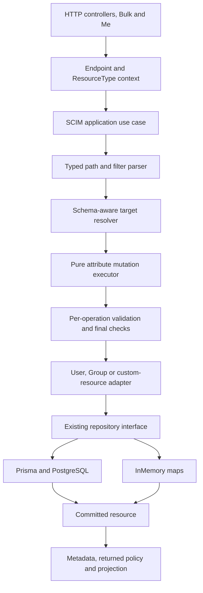
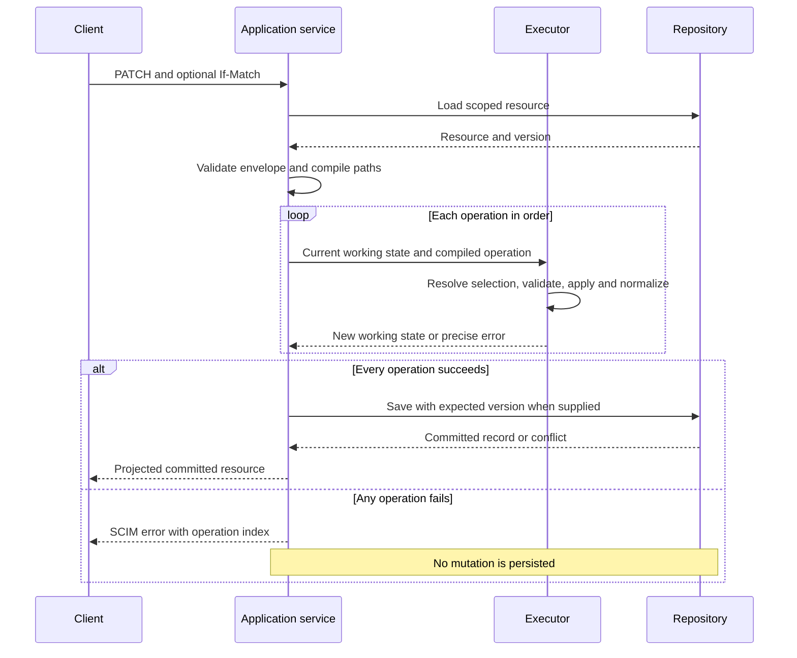
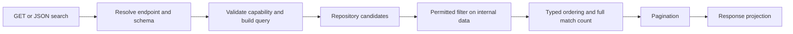

# SCIM correctness: design, implementation, and progress

> **Status:** Implementation authorized; work packages are tracked below
>
> **Last verified:** 2026-09-29
>
> **Starting source:** `ccde1d5d6b5129dd943c6e848989c668a0d00d7a`, version `0.55.35`
>
> **Evidence:** [Independent report](SCIM_FRESH_MASTER_ANALYSIS_2026-09-25.md),
> [82-case database comparison](evidence/scim-fresh-20260925/postgres-20260928-expanded.summary.json),
> and [reproduction instructions](evidence/scim-fresh-20260925/repro-postgres/README.md).

## 1. What we are delivering

**Bounded combined-source correction, 2026-09-29:** [PUT entry preservation](SCIM_PUT_ENTRY_PRESERVATION.md)
repairs first-match reuse and last-match immutable comparison on committed
`5581e6b7`. It shares neutral value/type/occurrence matching with PATCH and
preserves P3/P4 persistence boundaries. Its [RCA](SCIM_PUT_ENTRY_PRESERVATION_RCA.md)
records the independent discriminator-restoration finding and regression.
This closes only the PUT array-preservation blocker when its evidence is
accepted; it is not acceptance of later packages or the remaining 82-case ledger.

- [x] ✅ COMPLETED: Shared PUT/PATCH retained-entry matcher and focused RED/GREEN tests.
- [x] ✅ COMPLETED: Independent review finding reproduced and corrected with stable typed occurrence allocation.
- [ ] C0: integrate the bounded fix and its exact-source receipts; reconcile unrelated baseline readOnly expectations separately.

The goal is to make SCIM requests behave correctly and consistently for Users,
Groups, and custom resource types on both PostgreSQL and InMemory.

The first release fixes the reported Boolean PATCH path. Later releases correct
operation behavior, conditional writes, Group transactions, search, capability
checks, profile validation, and endpoint lifecycle behavior. We will share the
code that interprets the protocol without hiding the real differences between
the resources or databases.

This is not one large rewrite. Each work package needs its own failing test,
implementation, validation evidence, documentation, and commit. A package is
not complete merely because another package's tests passed.

### What is not authorized by this implementation request

* No automatic change to live endpoint settings or stored customer resources.
* No automatic replay of the original PATCH.
* No customer-production promotion.
* No replacement of dependencies or lockfiles through an unapproved registry.
* No new SCIM protocol such as cursor pagination or security events.

Local disposable PostgreSQL testing is authorized. Remote publication,
reviewed merge, deployment, and data repair remain explicit checkpoints rather
than an implied consequence of a local test passing.

## 2. Why these changes are needed

The database comparison executed 82 cases per backend and 771 assertions.
It demonstrated incorrect behavior, not just missing tests:

| Problem | Consequence | Design response |
|---|---|---|
| Different code interprets the same PATCH path differently | A valid selector becomes a literal property name | One typed path representation |
| Three engines implement similar mutations differently | `add` can replace a list; selected updates change only one match | Shared operation primitives, then a shared executor |
| State is checked only before or after the whole PATCH | Required, immutable and primary rules can be wrong between operations | Validate each transition in request order |
| If-Match is checked before an unconditional write | Two clients with the same version can both save | Conditional repository writes |
| InMemory lacks database constraints and transactions | Duplicate or partially written resources | Explicit atomic map operations and contract tests |
| Capabilities are checked only in some controllers | Bulk or custom routes can bypass a disabled capability | Shared application-level checks |
| Querying uses response-shaped data | Hidden attributes disappear before filtering | Separate internal resource data from response projection |

The earlier evidence files stay unchanged. Implementation results are new
evidence; they must not overwrite the record of the failing product.

## 3. The intended architecture



The application service coordinates the work. The parser and executor do not
read environment variables, look up credentials, issue database queries, or
publish events. Repositories do not interpret SCIM filter text.

Keep existing repository interfaces and dependency-injection tokens:

* [IUserRepository](../api/src/domain/repositories/user.repository.interface.ts)
* [IGroupRepository](../api/src/domain/repositories/group.repository.interface.ts)
* [IGenericResourceRepository](../api/src/domain/repositories/generic-resource.repository.interface.ts)
* [RepositoryModule](../api/src/infrastructure/repositories/repository.module.ts)

Do not introduce a universal repository with a growing resource-type switch.
Use composition rather than a controller/service inheritance hierarchy.

### Resource-specific responsibilities

| Resource | Responsibilities that stay outside the generic executor |
|---|---|
| User | Promoted database fields, username uniqueness, active-state policy, computed groups, User events, and `/Me` subject resolution |
| Group | Member references, deduplication, member-operation settings, and atomic Group-plus-member persistence |
| Custom resource | Dynamic core schema, extension bindings, registered route, optional query columns, and resource events |
| Endpoint administration | Profile merge/replacement rules, schema registration, credentials, cache refresh and cascade cleanup; this is not Resource PatchOp |

## 4. Path interpretation and ordered PATCH execution

### 4.1 Parse syntax once; resolve matches at each operation

The path parser produces an immutable structure describing the namespace,
attribute, optional predicate and optional sub-attribute. It must preserve
typed predicate values and the original operation index for diagnostics.

The following is a proposed interface shape, not an existing implementation:

```typescript
type PatchPath =
  | { kind: 'resource' }
  | {
      kind: 'attribute';
      schemaUrn?: string;
      attribute: string;
      subAttribute?: string;
    }
  | {
      kind: 'selection';
      schemaUrn?: string;
      attribute: string;
      predicate: FilterNode;
      subAttribute?: string;
    };
```

Use the existing filter parser/evaluator where its behavior is proven by tests.
Do not assume it already handles every escape, numeric representation,
attribute spelling, or namespace correctly. Add targeted grammar tests before
extending or relocating it. Keep compatibility re-exports when moving pure
code out of the HTTP module tree.

**Parsing once is not selecting once.** If operation 1 adds an entry,
operation 2 must be able to select that entry. Resolve values against the
current working resource at each step.



### 4.2 Required operation rules

| Rule | Implementation requirement |
|---|---|
| Native Boolean/number/null predicates | Keep literal types; do not require string quotes |
| Invalid bracket syntax | Explicit path/filter error; never a literal property or silent success |
| Multi-valued `add` | Preserve existing values and append/merge according to the selected target |
| Filtered replacement | Update all matches; zero-match replacement returns `noTarget` |
| Complex replacement | Preserve unspecified sub-attributes as the PATCH rules require |
| Required removal | Reject the operation that unassigns a required attribute |
| Immutable values | Check against the current working state, including earlier operations |
| Primary handoff | When an operation selects a new primary, clear the others before the next operation |
| Whole-request failure | Discard working state, including all earlier operations |
| Hidden values | Keep internal state separate from the response view |

### 4.3 Compatibility decisions

Do not silently turn a refactor into a change to every endpoint:

* Keep quoted-Boolean support where it exists, with schema-aware conversion.
  Correct string values that happen to equal `"true"` remain strings.
* Support documented Entra Group remove value arrays through a compatibility
  normalizer; do not treat them as ordinary RFC remove syntax.
* Keep current zero-match Group-member idempotency until its policy is tested.
  RFC text and examples are not completely consistent here.
* Filtered add with no match needs a named policy. Preserve the proven
  equality-discriminator case; do not invent objects from arbitrary compound
  predicates.
* Do not add a new flag just to avoid fixing malformed path storage.
* Changes to literal dotted-key behavior, primary policies, requiredness and
  response status are behavior changes. Document their impact and cover
  existing presets before changing their defaults.

## 5. Schema characteristics and response rules

Use the effective endpoint schema, including published characteristics and
applicable RFC defaults. Read a characteristic from the resolved target rather
than finding it by a bare sub-attribute name shared by unrelated extensions.

| Characteristic | Where it is checked |
|---|---|
| `type`, `multiValued` | Schema registration, request values, selected elements and resulting shape |
| `required` | Create/replace requirements and individual removal transitions |
| `mutability` | Operation-specific readOnly, immutable and writeOnly behavior |
| `caseExact` | Predicate comparison, case preservation and the chosen uniqueness equality rule |
| `returned` | Write response and GET/list/search projection, after permitted filtering |
| `uniqueness` | Supported scope checked atomically where promised |
| `canonicalValues` | Provider restriction if enabled; not an automatic closed enum from the RFC |
| `referenceTypes` | URI/reference type checks and scoped local referential-integrity policy |
| Extension `required` | ResourceType binding, distinct from required fields inside that extension |
| `primary` | Per-operation list normalization; not a separate schema characteristic |

All eight types and both single/multi-valued forms remain in the test inventory.
Simple multi-valued children are not forbidden complex nesting. The Schema
discovery resource has its documented structural exception.

POST and PUT ignore client readOnly values under their rules. PATCH normally
rejects incompatible mutations; explicit ignore settings are compatibility.
Required checks and normalizers must run on the same candidate state that will
be saved, not a discarded temporary copy.

Response rules:

* A 200 PATCH response is compared to a later GET only for common visible
  attributes after projection. A valid 204 has no body.
* `returned:request` can differ between write responses and ordinary GET.
* Always suppress writeOnly and `returned:never` values.
* SCIM errors have string `status` and optional string `detail`; structured
  lists belong in the diagnostic extension.
* Do not put secrets or raw predicate values in new diagnostic logs.

## 6. Persistence design

### 6.1 Conditional update and delete

Extend each aggregate's existing write port with an optional expected version.
When supplied, PostgreSQL's update/delete predicate includes the version and
resource scope. InMemory checks and replaces/deletes the map entry in one
synchronous operation. A mismatch becomes the same typed repository conflict
on either backend and is mapped to HTTP 412.

**P3 implementation:** [conditional writes and User uniqueness](SCIM_CONDITIONAL_WRITES_IMPLEMENTATION.md).
The condition is a numeric version or wildcard existence requirement. The
initial endpoint/resource-type lookup resolves the unique internal storage id;
the atomic write predicates combine that id with the numeric version. A target
removed after the read fails the supplied precondition with 412; an initially
missing target retains 404. Existing unsupported ETag lists still fail rather
than being silently reduced to one version.

Without a client condition, preserve the documented existing write policy.
Do not add hidden retries that reinterpret a client's intended selection.
If a retry is required by a later design, re-read and reapply deliberately.

### 6.2 Group transactions

Group create plus members and Group update plus members are aggregate writes.
PostgreSQL must perform each in a transaction. InMemory must validate/stage
the new Group and member collection before publishing either.

Keep reference lookups outside a long-held transaction where safe, but verify
any constraint that can race at the actual commit boundary. After failure,
scalar values, payload, members and version must all match the original state.

**P4 implementation:** [Group aggregate transactions](SCIM_GROUP_TRANSACTIONS_IMPLEMENTATION.md).
The create port accepts initial members; the service resolves them before
persistence. Prisma uses one transaction and InMemory stages all members
before publishing either map. InMemory also reads the aggregate without an
intervening await, preventing old scalar fields with new members. No new
schema or Group-name uniqueness guarantee is introduced.

### 6.3 Uniqueness

Keep PostgreSQL's username constraint. Add equivalent atomic InMemory
enforcement, including update and simultaneous create. Service prechecks can
improve diagnostics but cannot be the sole protection.

For Group or schema-driven uniqueness, define the actual namespace and equality
rule before adding constraints. A local scan cannot promise global uniqueness.
Database migrations, if needed, require existing-data analysis and independent
replay tests; do not silently delete conflicting rows.

**P3b implementation:** [atomic schema uniqueness](SCIM_UNIQUENESS_IMPLEMENTATION.md)
defines endpoint/resource-type/schema/path ownership and typed scalar/MV-leaf
equality. PostgreSQL namespace transaction locks and synchronous InMemory
commits enforce it, including Group members. No migration; unsupported
computed/complex/global declarations fail closed. P7 owns admission validation,
and P8 owns different-profile-revision coordination.

## 7. Reads, discovery, capabilities, and endpoint lifecycle



* JSON `.search` uses arrays for requested/excluded attributes; URL query
  parameters use their own parser. A compatibility string form must be
  explicit, not the only accepted form.
* Query filters validate the predicate relative to its parent namespace.
* Check whether filtering a hidden attribute is allowed before using internal
  values; never make secret search possible as a side effect.
* Do not cap candidates before residual filtering/counting unless correctness
  is preserved. Do not sort numbers as strings.
* Capability checks belong at a reusable application boundary that direct
  controllers, Bulk and `/Me` cannot bypass.
* Discovery and execution use the same resolved profile. Discovery collections
  retain their special RFC query behavior.
* Endpoint deletion defines all owned records and preserves audit history as
  intended. Test both backends, including credentials in the lifecycle package.
* Cross-process cache freshness needs a measured guarantee. Prefer an
  authoritative persisted revision check for PostgreSQL requests over an
  indefinite process-local cache. Benchmark the extra read; do not introduce
  a distributed cache dependency merely to solve this problem.

## 8. Work packages and completion checks

| ID | Outcome | Depends on | Tests that must turn green |
|---|---|---|---|
| D0 | Commit reviewed design, independent analysis and sanitized evidence | None | Docs, JSON/CSV, links, rendered diagrams, safety guard syntax |
| P1 | Safe, typed PATCH path interpretation on all resource families | D0 | `INC-*`, native/quoted/compound/number selectors, invalid-path no-write cases |
| P2 | Correct shared operation semantics and ordered transitions | P1 | Multi-value add, all matches, required/immutable/primary, selected-object shape |
| P3 | Atomic conditional writes and endpoint-scoped User name uniqueness parity | D0 | Same-version barriers, sequential If-Match, duplicate create/update on both backends |
| P3b | Design atomic schema-driven and Group/custom-name uniqueness | Separate design after P3 | Storage constraints, scope/equality policy and concurrent creates/renames for every promised characteristic |
| P4 | Atomic Group create/update plus members | P3 contract if shared | Native constraints and injected failure rollback, no partial create |
| P5 | JSON search arrays and well-formed errors | D0 | User/Group/custom `.search`, genuine invalid DTO with scalar error detail |
| P6 | Consistent query limits, sorting and capability checks | P1 query seam, P5 | `READ-FILTER-*`, typed sort, hidden fields, direct/Bulk/Me capability checks |
| P7 | Schema/profile validation and supported characteristic promises | P2 | Bad schema type/cardinality, reference/binary/date inputs, required extension and readOnly behavior |
| P8 | Endpoint cleanup and cross-process cache consistency | P3 if conditional admin writes | Cascade/orphan checks and two-reader freshness with stated bound |
| P9 | Honest compatibility/settings documentation and tests | Relevant packages | Modern/legacy Entra corpus, all registered settings reachable and accurately described |
| C0 | Consolidate independent evidence and reviewed release readiness | P1-P9 | Applicable static/unit/HTTP/backend/live/browser/CI gates on the same tip |

Work packages may be split further if one needs an independent migration or
behavior decision. A split is recorded here; it is not silently omitted.

## 9. Test-driven workflow and validation gates

For every implementation:

1. Write a failing test against the intended behavior. Record the actual
   failing assertion; a missing module or failed fixture is not the required RED.
2. Make the smallest complete fix for that work package.
3. Rerun the exact test and its neighboring compatibility tests.
4. Add HTTP contract coverage and a live-test section for externally visible
   behavior. Smoke-run that section against an owned local node before
   consolidation.
5. Run the same relevant behavior with actual Prisma/PostgreSQL and InMemory.
   Database ownership checks must run before migrations or destructive setup.
6. Review error handling, logging, RFC interpretation, test completeness and
   architectural impact.
7. Record evidence, update the implementation/RCA docs and user-facing guide,
   then commit a coherent change.

| Gate | Development lane | Consolidation/release lane |
|---|---|---|
| API build and lint | Changed package, compare warning baseline | Complete API gates |
| Unit tests | Targeted related suites in one invocation | Applicable full unit suite |
| HTTP tests | Relevant routes, outputs and error shapes | API E2E on both backends |
| Database | Task-owned PostgreSQL, relevant behavior | Fresh migration replay plus backend contracts |
| Live HTTP | New/changed section on owned local runtime | Local node and Docker evidence |
| Web/Playwright | Required if a UI surface changes | Browser tests against applicable build; inspect visual diffs |
| Docs | JSON, references, content and diagrams | Freshness and source coupling |
| Review | Changed-code self-review and specialist review where required | Independent review and exact-tip CI |
| Deployment | Not part of local iteration | Explicitly initiated pipeline, same image digest; customer approval separate |

Use the existing runners, not a parallel testing framework. Do not rerun an
unchanged full suite solely because documentation changed. Do not bypass hooks,
lower a gate, or call a setup failure a product failure.

The historical analysis harness refuses changed production input on purpose.
Promote its useful cases into permanent tests. Any adapted implementation
harness records the new source tip and new expected results separately; it must
retain the task-owned database guards.

## 10. Commit, release, and rollback rules

* D0 includes the independent report, sanitized machine-readable evidence,
  opt-in reproducers, design, RCA ledger, INDEX and session context.
* Exclude ignored execution logs, generated clients, dependency links, HTML
  build output, local credentials and disposable database state.
* Preserve the earlier documentation commit in its separate worktree.
* Begin implementation in a fresh context/worktree from the design commit.
* Use ordinary new commits with the required trailers. Never amend, force-push,
  rewrite the preserved evidence, or bypass verification.
* Record version/test changes accurately. Release version/lockfile updates
  follow the approved public-runner workflow; local corporate lockfile
  regeneration is not a shortcut.
* Reviewed PRs and exact-tip CI gate merge. A successful local commit is not
  described as merged, deployed, or production-ready.
* Roll back code independently from data repair. New parser behavior must not
  automatically reinterpret already-stored malformed keys.

## 11. Progress tracker

Statuses mean: **pending**, **in progress**, **implemented**, **validated**,
**committed**, **integrated**, or **blocked with a named reason**. Integrated
means assembled on the local integration branch, not merged to master or deployed.
Package validation counts below describe the original package evidence; the
combined checkpoint has its own counts in section 11.1.

| Package | Status | Evidence / next action |
|---|---|---|
| D0 | Committed | `cb2e1bcb`: reviewed design, independent report and immutable baseline evidence; 22 JSON artifacts, 140 relative links and 10 rendered diagrams verified |
| P1 | Integrated | [Implementation and evidence](SCIM_P1_IMPLEMENTATION.md): 1,476 focused unit / 65 HTTP passes; owned Prisma/PostgreSQL and InMemory each pass 24 permanent HTTP cases plus 58 live assertions. Central release metadata pending; no push/merge/deploy. |
| P2 | Authorized flags integrated and focused dual-backend proof passed | `29b3b2c6` -> `8d2110d1`; 356 HTTP cases/backend preserve ordered/common/P7 overlaps. Quoted active and explicit dotted User controls pass both strict modes; P2 built-live188/backend. Namespace-only strict prevalidation and final C0 remain separate; section 11.22 |
| P3 | Integrated | 692 targeted units; 55 HTTP tests and 33 live assertions per backend. PostgreSQL 17.8 and InMemory. See [implementation](SCIM_CONDITIONAL_WRITES_IMPLEMENTATION.md); release metadata/PR/matrix pending |
| P3b | Six-source history retained; corrected final state verified | `4ba9373c` -> `d93d1a0d` is superseded by `2d2da4e1` -> `43b01c4e`. All-core String/SV/exact common externalId, defaultnone and independent extension policies remain. Combined176units/367InMemory/369PostgreSQL HTTP and143live/backend pass; no standalone fifth-commit acceptance; section11.26 |
| P4 | Integrated; focused combined validation passed | `212a6b92` and `66a7229f`: source evidence 205 units, 111 PostgreSQL HTTP / 110 InMemory HTTP plus one explicit PostgreSQL FK skip. [Implementation and evidence](SCIM_GROUP_TRANSACTIONS_IMPLEMENTATION.md). Section 11.5 records the raw-error correction and live wiring |
| P5 | Integrated | Shared JSON search boundary and scalar SCIM errors; 354 unit tests, 61 HTTP tests per backend, 61 live assertions. [Implementation and evidence](SCIM_SEARCH_CONTRACT_IMPLEMENTATION.md). Release metadata and final consolidation remain pending |
| P6 | Integrated; focused combined validation passed | P6a capability boundary preserved. P6b `cc3ccdbc` adds [query semantics](SCIM_QUERY_SEMANTICS_IMPLEMENTATION.md): source evidence 616 units, 156 HTTP and 32 live checks per backend, PostgreSQL 17.8 and 22 migrations |
| P7 | Context source verified; legacy expectations reconciled | `8d5915ba` -> `e80da689` preserves PATCH/retention fixes with scoped proof in11.24. Parent test-only`df3ca957` -> `bd82e681` now closes the eight old expectations:142 merged units, exact outcomes, no skips. Namespace/common-view/compiler/admission and broader acceptance remain open |
| P8 | Exact interrupted-create contract integrated and focused parity verified | `d8441f46` -> `6a52ae32`; 247 units, 131 InMemory/135 PostgreSQL HTTP and 16 built-live checks per backend. P3/P3b/P4/P8c arguments/transactions preserved, exact 404 distinct from 412/member/outage/trigger errors. [Integrated receipt](evidence/scim-endpoint-errors-20260929/validation.json); final case-level lifecycle/C0 reconciliation remains |
| P9 | All 19 cases default-running; frozen receipt preserved | [Entra guidance/corpus](SCIM_ENTRA_COMPATIBILITY.md), [37 settings evidence/gaps](SCIM_SETTINGS_BEHAVIOR_EVIDENCE.md). Unchanged I02/I03 pass on both backends, then TODO/env dispatch removed. Separate built runtimes each pass 19/1228; source 17-supported/2-pending receipt remains historical |
| C0 | Corrected source assembly verified in focused lanes; final acceptance open | Checkpoints through11.27; measured numeric-displayName and explicit-role query failures now closed. Original82-case/backend ledger, broader P7b/characteristic/admission/coordination/performance/artifact acceptance remain open |
| P6c/P6d | Corrected source pair and cross-package query regression verified | `f77786c4` -> `09b59b43`, `2aa96f0b` -> `8f3510a8`; explicit-false role fix follows2unit/2HTTP REDs.398IM/399PG HTTP,52query live and45/45typed authority outcomes/backend. Initial numeric-common interpretation superseded, not accepted; section11.27 |

**Current overall progress:** design/evidence validated for the baseline commit;
P1, P3/P4, P5, P6a/P6b, P7a, P8a/P8b/P8c and P9 are implemented and locally validated in their source worktrees,
and integrated here. The bounded package and focused overlap checks passed;
P9's unchanged I02/I03 now pass by default after authorized P2 integration.
The final combined matrix,
release metadata, PR, and deployment remain pending. Other statuses are owned by their independent
implementation contexts. This section is updated at package boundaries. Detailed
issues are recorded in the [execution RCA ledger](SCIM_CORRECTNESS_EXECUTION_ISSUES_AND_RCA.md).

### 11.1 Initial integration checkpoint, 2026-09-28

Branch: `integrate/scim-correctness-20260928`; base: D0 `cb2e1bcb`
on master `ccde1d5d`. Five source commits were cherry-picked in the supplied
order, without squash, amend, publication or deployment.

| Package | Source commit | Integration commit |
|---|---|---|
| P1 typed PATCH paths | `3ecaba55df5424b5427b8fdc41c1bdad0b8d0f51` | `9676fb94` |
| P3 conditional persistence and User uniqueness | `0aae30775a2888ff4bc6e67636d51ab234e717a5` | `c980e1fe` |
| P3 handoff cleanup | `41c5b8c52ece0d8b48042c754cbdefa68624248f` | `8cbf6349` |
| P5 JSON search/error contract | `e3da254a5ec4cdeac4a2985b8fe4a8817141126f` | `10e3305f` |
| P6a capability boundary | `a801935866e06c2c3907bc6fad92683f6b4f98e3` | `a5751028` |

**Merge decisions.** Keep P1 parsing and indexed diagnostics before mutation,
P3 expected-version conditions at each repository write, P5 validated projection
normalization at all search controllers, and P6a capability checks at the
appropriate client/application boundary. `/Me` internal identity lookup retains
its exception to client-filter capability checks. All production overlaps
auto-merged and were reviewed; conflicts were shared documentation and the live
runner. Documentation retains all package rows and evidence, not one side's
claim that the other work is still pending.

**Live wiring correction.** P1/P3 helpers existed but had no main-runner route,
and both P5/P6a claimed section `9z-CO`. Three permanent regressions failed
before wiring changed. The main runner now invokes one shared section before
cleanup: P5 `9z-CO`, P6a `9z-CP`, P1 `9z-CQ`, P3 `9z-CR`. Explicit-target HTTP
functions share the original assertions while original standalone ownership
guards remain intact. Every fixture is dedicated and cleaned in `finally`.

| Initial integration gate | Evidence |
|---|---|
| API build | PASS, after restoring missing tooling through an owned read-only dependency junction and generating only the local Prisma client |
| Focused source lint | PASS, 0 errors / 195 warnings across 50 merged source/test files; no gate or warning ceiling changed |
| Merge-sensitive units | PASS, 20 suites / 1,011 tests, including 3 new wiring regressions |
| Four package HTTP suites | PASS, 4 suites / 91 cases, explicit InMemory plus inert database URL |
| Combined live main section | PASS, 71 reported checks containing 58 P1 + 33 P3 assertions, 61 P5 + 7 P6a checks, and extra P3 endpoint cleanup |
| Resource cleanup | PASS, endpoint collection identical before/after; owned API stopped |
| Standalone harness isolation | PASS, P1/P3 reject unowned input before network/database access |
| Script syntax | PASS, four PowerShell files and two Node helpers |
| Documentation | Content audit passes; 15 literal JSON blocks in edited docs parse. Two F4-bound operator guides now explain P1. Final committed-range coupling verification runs after the integration wiring commit |
| Historical evidence and release metadata | Frozen; no prior analysis, version, manifest or lockfile changes |
| Full authoritative matrix / new PostgreSQL proof / publication / deployment | Not run or claimed at this initial assembly checkpoint |

Full logs stay in ignored `test-results/scim-integration-initial/`. Package-local
PostgreSQL receipts remain independent evidence, not relabeled as an
integration-branch database run. Other packages are still being authored; do
not start final C0 or release from this checkpoint.

### 11.2 P8a incremental assembly, 2026-09-28

Source `39841319ae658ab700fb92f23a6b13d0e1ee3c85` was appended as
`a1a62484` after the existing five source commits and integration wiring fix.
No history was rewritten. The endpoint service's authoritative PostgreSQL
reads, content fingerprints, schema/logging refresh and statistics existence
check were retained unchanged. Shared docs retain the actual integrated
package states, rather than restoring the source branch's earlier snapshot.

The package's `9z-CR` live section collided with P3. Before fixing it, the
expanded wiring regression failed two assertions: the shared orchestrator
lacked P8a, and five declarations had only four distinct identifiers. P8a now
runs as `9z-CS` through the same main-runner entry point. Its standalone
helper still supports separate writer/reader URLs and tokens, and still
cleans only its dedicated fixture.

| Incremental integration gate | Result |
|---|---|
| API build | PASS |
| Endpoint service, InMemory, controller, ETag and wiring units | 6 suites / 166 tests passed |
| Freshness/profile HTTP plus P6a interaction | 3 suites / 26 cases passed, explicit InMemory and inert database URL |
| Lint | 0 errors; 19 existing production warnings plus 3 existing service-test warnings; new wiring/freshness tests have none |
| Combined main live section | 78 checks passed: previous 71 plus 7 freshness checks |
| Cleanup | Endpoint collection identical before/after; owned API process stopped |
| Script syntax | 3 affected PowerShell files parsed |
| Documentation coupling | PASS for the committed package range; final wiring-commit check follows |

The package's 163-unit, 18-HTTP-per-backend, two-PostgreSQL-process live and
22-migration evidence remains in [its implementation report](SCIM_ENDPOINT_FRESHNESS_IMPLEMENTATION.md).
This increment does not repeat or reclassify that evidence as a new integrated
PostgreSQL run. Logs are in `test-results/scim-integration-p8a/`.
At this pre-P8c checkpoint, cleanup and conditional-admin-write guarantees
were separate. Section 11.3 adds P8c; P8b cleanup remains separate.
Final C0, version/lock updates, publication and deployment remain pending.

### 11.3 P8c incremental assembly, 2026-09-28

Source `8eb2f1620e27e4e98214ddda4744c0749633e5c9`, based on P8a, was
appended as `2c0536ef` without rewriting earlier commits. Its production
changes applied without conflicts. PostgreSQL compares the persisted editable
fields in the actual update predicate; InMemory checks the token and publishes
the update without an intervening await. `getEndpointWithETag` computes the
full editable-state token and requested response view from one authoritative
snapshot. The moved ETag helper remains in `endpoint/common`, not controllers.

The previous unconditional per-key-merge safety claim was corrected in the
operator/API docs. Per-key merge preserves sequential edits, not concurrent
read-modify-write requests without a condition. Missing `If-Match` and `*`
retain their established unconditional compatibility behavior. The imported
PC-4 pattern and instruction 3a.4 remain unchanged.

The source live section `9z-CS` collided with P8a. The cross-runner regression
caught six declarations with five distinct identifiers, and the package
inventory caught the missing shared invocation. P8c now runs as `9z-CT`;
all original eight assertions and dedicated cleanup remain in its helper.

| Incremental integration gate | Result |
|---|---|
| API build | PASS |
| P8a/P8c service, InMemory, controller, ETag and wiring units | 7 suites / 175 tests passed |
| Conditional writes, freshness/profile and P6a HTTP interaction | 4 suites / 30 cases passed on explicit InMemory with inert database URL |
| Focused lint | 0 errors / 21 existing warnings across 8 files; no gate changes |
| Combined main live section | 86 checks passed: previous 78 plus 8 conditional endpoint checks |
| Cleanup | Endpoint collection identical before/after; owned API process stopped |
| Script syntax | 2 PowerShell files and the Node helper parsed |

Original dual-backend/two-PostgreSQL-process evidence, 22 migration replays,
and the independent review are retained in [the concurrency report](ENDPOINT_WRITE_CONCURRENCY.md);
they are not claimed as a newly run integration database matrix. New logs are
in `test-results/scim-integration-p8c/`. P8b cleanup remains separately owned
and may change the endpoint deletion path later. No publication, deployment,
release metadata update or final C0 matrix is part of this assembly.

### 11.4 P6b/P7a incremental assembly, 2026-09-28

| Package | Source commit | Integration commit |
|---|---|---|
| P6b query semantics | `cc3ccdbca260033879e764d1bc05d85fe6713e97` | `5075a82c` |
| P7a declarations/scalars/POST-PUT | `8e42f15f54a955fd6b93d58e9471c393329f4d3a` | `0a6b9c5d` |

Both remain separate rollback units. The parent-confirmed master baseline is
still `ccde1d5d`. The important service resolutions were:

* P6b generic ETag checks retain P3's returned expected version, not only a
  pre-write assertion. The same resolved profile still disables ETags when
  configured.
* P7a prepares replacements from an earlier existing-resource snapshot.
  Bind the expected version to that snapshot and remove the obsolete second
  read in all three PUT services. The final write remains conditional.
* P6b evaluates authorized filters and typed ordering over internal data before
  pagination/projection. P7a's write-response projection uses the original
  POST/PUT input captured before service normalization. P5 search-array
  normalization and P6a capability checks remain intact.
* Shared documentation retains integrated P3/P5/P6/P8 states and each
  package's RCA and user guidance. No earlier failure evidence was rewritten.

P6b's `9z-CP` collided with the capability section, and P7a had no main-runner
route. Two wiring regressions failed before changes. The shared runner now
uses `9z-CU` for query semantics and `9z-CV` for profile validation. P7a's
explicit-target HTTP contract is shared without weakening its original
source, database, or loopback guards.

| Incremental integration gate | Result |
|---|---|
| API build | PASS |
| Focused query, schema, projection, service, conditional and wiring units | 16 suites / 1,044 tests passed |
| Query/sort/P7a/P1/P3/P5/P6a/projection/profile HTTP | 9 suites / 229 cases passed on explicit InMemory and inert database URL |
| Focused source lint | 0 errors / 99 warnings across 27 files; no gate or warning ceiling changed |
| Combined main live section | 119 reported checks passed, including 32 P6b checks and the full 156-assertion P7a contract |
| Cleanup | Endpoint collection identical before/after; owned API process stopped |
| Guard and syntax | Original P7 entry point rejects an unowned source context; new/affected Node and PowerShell files parse |
| Documentation | Content/source-coupling audits pass and 61 literal JSON blocks parse; final integration-fix range is checked after commit |

Original P6b and P7a PostgreSQL 17.8, 22-migration and InMemory receipts remain
in their feature reports; this is not a new integrated PostgreSQL matrix.
Logs are in `test-results/scim-integration-p6b-p7a/`.
**Final P7 PATCH integration still depends on P2.** Do not run the full
authoritative matrix until P2, P4, P8b and the P3b/compatibility dispositions
are closed. No version/lock regeneration, publication or deployment occurred.

### 11.5 P4 incremental assembly, 2026-09-29

| Source / correction | Integration commit |
|---|---|
| P4 `212a6b929683c3d853e23ec84f56310536941c3a` | `c95d0fb6` |
| P4 handoff `66a7229fe8646b15e620514c8bf82f7b1f72343c` | `de14fc5b` |
| Public repository server-error correction | `9991ff50` |

The original trailer-format issue stays documented; neither source history nor
the cherry-picked message was amended. Production aggregate changes applied
without conflicts. P4's staged InMemory writes and PostgreSQL Group-plus-member
transaction retain P3 conditions, P7a validation and P6b internal query behavior.
Documentation preserves all packages; the combined pattern chart now counts
both PA-10 and PC-4 rather than dropping either addition.

**The raw-error issue was not already fixed by P5.** P5 guarantees scalar
detail, not safe content. Two unit and two HTTP regressions proved that the
mapped Prisma error still exposed internal context/cause text. The separate
`9991ff50` rollback unit masks mapped 500/503 detail while preserving status,
diagnostics, client errors and the logged original cause. The full P4 HTTP
contract again rejects its original injected-error markers.

P4 now joins the main runner at `9z-CW`. A dedicated endpoint wraps the original
69 assertions; the standalone script retains its loopback/path/credential
guard. Two wiring assertions proved the missing route before the correction.

| Incremental integration gate | Result |
|---|---|
| API build | PASS |
| Group aggregate, Prisma/InMemory repository, service and error units | 7 suites / 390 tests passed |
| Wiring regression | 3 tests passed after 2 initial failures |
| Group aggregate/lifecycle/parity and P3 conditional HTTP | 5 suites / 112 cases passed; one PostgreSQL-only FK control explicitly skipped on InMemory |
| Public server-error regression | 2 unit and 2 HTTP REDs turned GREEN; original raw-marker checks restored |
| Combined main live section | 121 reported checks pass, including 69 P4 assertions plus dedicated endpoint cleanup |
| Cleanup and guard | Endpoint collection identical before/after; owned API stopped; original Group helper rejects unowned targets before HTTP |
| Focused merged-source lint | 0 errors / 66 existing warnings across 11 files; separate HTTP/error-boundary lint and wiring lint pass |
| Documentation | Content/coupling audits pass; 41 literal JSON blocks parse |
| Edited pattern-ledger diagrams | 2 diagrams render in both strict themes; existing renderer metadata sentinel 0.0.0 is recorded, not adopted as a version |

Logs are in `test-results/scim-integration-p4/`. The new error HTTP tests use
the actual Prisma error translator at the repository seam without accessing
PostgreSQL; this is not a new integration database matrix. Original P4 database
and 22-migration evidence remains unchanged. P3b uniqueness remains open.
No full authoritative matrix, publication, deployment or release-metadata
update is authorized by this checkpoint.

### 11.6 Parent evidence checkpoint and open work, 2026-09-29

The parent verified portable P4 evidence and completed-package ancestry
against the unchanged master `ccde1d5d`. This does not convert any scoped
package check into final release evidence.

| Evidence | What it proves | What remains separate |
|---|---|---|
| P4 package live receipt | Real HTTP against an owned loopback Nest listener in the Node test process | It does not establish execution through `dist/main.js` or the final built release artifact |
| Integration live spot checks | The recorded local smoke harness launches this worktree's `api/dist/main.js` and checks selected contracts and cleanup | C0 must still run distinct live proof against the exact built artifact; these focused local checks are not the authoritative artifact matrix |
| P6b correctness GREEN | Returned rows, ordering, totals, projection and capability behavior match the assertions | Residual filters materialize candidates. No unchanged-cost or performance-parity claim follows from functional GREEN |

The final performance assessment must explicitly account for candidate
cardinality and residual-filter selectivity, including latency, memory and
database/query work. Do not hide materialization cost behind page-size caps
or reuse correctness counts as performance evidence.

| Open work | Parent ownership reported | Assembly status |
|---|---|---|
| P3b promised schema uniqueness | Worker `b1929e07` | Active; awaiting committed result |
| P9 compatibility corpus and accurate guidance | Worker `34cb4c37` | Active; awaiting committed result |
| P7 nested-readOnly follow-up | Parent-owned follow-up | Active at this checkpoint; integrated later in 11.7. Final P7 PATCH integration still depends on P2 |
| P2 and P8b | Existing package owners | Still open in this assembly |

The worker identifiers above are not commit SHAs. No pending worker diffs
were read or imported. No authoritative full matrix starts until these open
items and their compatibility/uniqueness dispositions close.

**Assurance improvement: applied.** Evidence is labeled by the actual runtime
and claim it supports. **Design disposition: accepted.** This is an
evidence/coordination update, not a new runtime abstraction or optimization.

### 11.7 P7 recursive readOnly integration, 2026-09-29

Source `892b74ba262579d2f5aeed5df8bb2ca4704c2e6d` was appended as
`168c074f`. Its production diff is limited to recursive metadata collection in
`SchemaValidator.collectReadOnlyAttributes` and the object/array segment walker
in `stripReadOnlyAttributes`; signatures and map interfaces are unchanged.
This does not change PATCH execution, settings or defaults.

The shared live wrapper retains its original guard-first standalone entry
point. The new recursive fixture loads inside the explicit-target contract,
so both entry points execute the same assertions. A failing wiring regression
preceded the shared runner's expected-count update from 156 to 228.
Explicit lint of the touched HTTP spec also exposed unsafe Supertest values;
test-only wire/request types remove them while retaining all runtime assertions.

| Incremental integration gate | Result |
|---|---|
| API build | PASS |
| ReadOnly cached/fallback, schema cache, services, errors and wiring units | 9 suites / 645 tests passed |
| P7/P1/P3/P4/query/projection HTTP overlap | 6 suites / 186 cases passed; one PostgreSQL-only native FK control skipped on InMemory |
| Typed-fixture final rerun | All 67 P7 HTTP cases passed |
| Focused production, unit, HTTP and fixture lint | 0 errors / 14 existing warnings across 6 files |
| Shared main live section | 121 reported checks passed, now containing all 228 P7 assertions |
| Cleanup | Endpoint collection unchanged; owned built-local API process stopped |
| Test/gate improvement | Count-contract RED/GREEN and explicit HTTP lint; no lowered gates |

New logs use `test-results/scim-integration-p7-readonly/`. Source-package
PostgreSQL 17.8, 22-migration and both-backend evidence stays in its original
receipt; this incremental run is explicitly InMemory with an inert database
URL. The local `dist/main.js` smoke is not C0 exact-artifact release proof.

The imported [characteristic matrix](SCIM_P7_CHARACTERISTIC_STATUS.md) and
[uniqueness inventory](evidence/scim-p7-20260928/uniqueness-inventory.json)
inform separately owned P3b/P9 work. `global` is a valid RFC keyword rejected
by deliberate provider capability policy; whole merged-profile revalidation
can therefore reject an unrelated profile edit on a legacy declaration.
Neither uniqueness closure nor compatibility acceptance follows from the
readOnly tests. **P7 remains OPEN for final P2/PATCH integration.**

### 11.8 Final C0 case-level acceptance ledger

**Status: seeded, not yet reconciled. No full-suite rerun is authorized by this
ledger update.** The parent requires every original unique case on both
backends to be reconciled against the integrated source. Baseline suites
already passed while these defects existed, so aggregate GREEN counts are
not acceptance evidence for an individual case.

The immutable inventory is the [expanded baseline summary](evidence/scim-fresh-20260925/postgres-20260928-expanded.summary.json)
and its [case descriptions and original results](evidence/scim-fresh-20260925/postgres-20260928-expanded.cases.csv):
**77 initial cases + 5 alias cases = 82 unique IDs per backend, 164 backend
dispositions**. The table below has exactly those 82 IDs. Every initial `B`
means *case-level integrated proof has not yet been reconciled*, not that a
new product failure has been observed.

#### Dispositions and proof requirements

| Code | Required meaning and evidence |
|---|---|
| F | Fixed and verified against the integrated source. Link the permanent test or new implementation-harness case, exact source SHA/fingerprint, backend/runtime identity, command and result artifact. An originally correct control still needs outcome verification; say explicitly when no production fix was required. |
| P | Explicit intentional or supported-policy difference. State actual behavior, the precise RFC/errata/official compatibility reference, provider policy/capability and any affected settings. Prove the declared behavior and document compatibility impact; do not turn a bug into policy because a test is green. |
| N | Non-applicable on this backend or supported surface, with a specific reason and evidence for the boundary. A missing runner, unavailable database, failed setup, or unsupplied package is not non-applicability. |
| B | Still blocking: unresolved defect, missing exact-source case proof, unreviewed policy rationale, setup failure, or open package dependency. Name the missing proof or issue when known. |

InMemory and PostgreSQL dispositions are independent. A row can close only
when both cells are F/P/N with sufficient linked evidence. One backend's
GREEN cannot close the other. The final report must summarize all 164
dispositions and retain every B as a release blocker, not bury it in totals.

**Preserve the historical experiment.** Do not change its source/database
guards, expected failures, inputs or result artifacts to make new source pass.
Promote the relevant inputs/assertions into permanent tests or a new,
task-owned implementation harness recording a new source identity and
ownership-verified database. Link old case ID to new test ID explicitly;
similar test names and suite membership do not establish equivalence.

#### Original-case reconciliation

Until case-specific evidence is attached, `Pending` below means no per-case
disposition has been accepted. Existing package receipts remain available
evidence to inspect, not automatic row closures.

| Original case ID | InMemory | PostgreSQL | Exact-source case proof and disposition rationale |
|---|---|---|---|
| INC-STRICT | B | B | Pending |
| INC-LENIENT | B | B | Pending |
| CRUD-Users | B | B | Pending |
| SEARCH-ARRAY-Users | B | B | Pending |
| TYPES-Users | B | B | Pending |
| CRUD-Groups | B | B | Pending |
| SEARCH-ARRAY-Groups | B | B | Pending |
| TYPES-Groups | B | B | Pending |
| CRUD-Devices | B | B | Pending |
| SEARCH-ARRAY-Devices | B | B | Pending |
| TYPES-Devices | B | B | Pending |
| MV-ADD-Users | B | B | Pending |
| MV-ADD-Groups | B | B | Pending |
| MV-ADD-Devices | B | B | Pending |
| VP-STRING | B | B | Pending |
| VP-BOOLEAN | B | B | Pending |
| VP-QUOTED-BOOLEAN | B | B | Pending |
| VP-COMPOUND | B | B | Pending |
| VP-NUMBER | B | B | Pending |
| VP-MULTIMATCH | B | B | Pending |
| READ-FILTER-TYPED | B | B | Pending |
| REQUIRED-REMOVE-Users | B | B | Pending |
| IMMUTABLE-SEQUENCE-Users | B | B | Pending |
| IMMUTABLE-REMOVE-Users | B | B | Pending |
| IMMUTABLE-PUT-Users | B | B | Pending |
| REQUIRED-REMOVE-Groups | B | B | Pending |
| IMMUTABLE-SEQUENCE-Groups | B | B | Pending |
| IMMUTABLE-REMOVE-Groups | B | B | Pending |
| IMMUTABLE-PUT-Groups | B | B | Pending |
| REQUIRED-REMOVE-Devices | B | B | Pending |
| IMMUTABLE-SEQUENCE-Devices | B | B | Pending |
| IMMUTABLE-REMOVE-Devices | B | B | Pending |
| IMMUTABLE-PUT-Devices | B | B | Pending |
| PRIMARY-Users | B | B | Pending |
| CASEEXACT-Users | B | B | Pending |
| RETURNED-Users | B | B | Pending |
| PRIMARY-Groups | B | B | Pending |
| CASEEXACT-Groups | B | B | Pending |
| RETURNED-Groups | B | B | Pending |
| PRIMARY-Devices | B | B | Pending |
| CASEEXACT-Devices | B | B | Pending |
| RETURNED-Devices | B | B | Pending |
| CAPABILITIES-Users | B | B | Pending |
| LIMIT-Users | B | B | Pending |
| CAPABILITIES-Groups | B | B | Pending |
| LIMIT-Groups | B | B | Pending |
| CAPABILITIES-Devices | B | B | Pending |
| LIMIT-Devices | B | B | Pending |
| CUSTOM-NUMERIC-SORT | B | B | Pending |
| CUSTOM-ETAG-OFF | B | B | Pending |
| CAS-Users-WIRE | B | B | Pending |
| CAS-Users-BARRIER | B | B | Pending |
| CAS-Groups-WIRE | B | B | Pending |
| CAS-Groups-BARRIER | B | B | Pending |
| CAS-Devices-WIRE | B | B | Pending |
| CAS-Devices-BARRIER | B | B | Pending |
| UNIQUE-WIRE | B | B | Pending |
| UNIQUE-BARRIER | B | B | Pending |
| GROUP-NATIVE-ROLLBACK | B | B | Pending |
| GROUP-HTTP-FAULT | B | B | Pending |
| ENDPOINT-CASCADE | B | B | Pending |
| ENDPOINT-CACHE | B | B | Pending |
| CUSTOM-PATCH-DISABLED | B | B | Pending |
| TYPED-READ-CONTROL | B | B | Pending |
| CORE-MV-ADD | B | B | Pending |
| CORE-BOOLEAN-PATH | B | B | Pending |
| MULTIMATCH-REMOVE | B | B | Pending |
| NO-PATH-Users | B | B | Pending |
| ETAG-CONTROL-Users | B | B | Pending |
| CARDINALITY-NEGATIVE-Users | B | B | Pending |
| NO-PATH-Groups | B | B | Pending |
| ETAG-CONTROL-Groups | B | B | Pending |
| CARDINALITY-NEGATIVE-Groups | B | B | Pending |
| NO-PATH-Devices | B | B | Pending |
| ETAG-CONTROL-Devices | B | B | Pending |
| CARDINALITY-NEGATIVE-Devices | B | B | Pending |
| GROUP-POST-FAULT | B | B | Pending |
| ALIAS-BULK-SUCCESS | B | B | Pending |
| ALIAS-BULK-ATOMICITY | B | B | Pending |
| ALIAS-BULK-DISABLED | B | B | Pending |
| ALIAS-ME-USER | B | B | Pending |
| ALIAS-DISCOVERY-REFLECTION | B | B | Pending |

#### Mandatory acceptance overlays

The 82-case list is the minimum regression inventory, not a claim of exhaustive
Cartesian coverage. C0 must also map these outcome/coverage boundaries to
specific assertions and evidence, even where a package has already run a
similarly named suite:

| Required outcome or boundary | C0 evidence required | Current disposition |
|---|---|---|
| Exact four-operation incident, strict ON and OFF | Round-trip all four intended values, persisted readback, no literal bracket/dotted corruption, and a late-operation failure proving the whole stored resource/version is unchanged | B: reconcile exact integrated cases |
| Supported direct, Bulk, `/Me` and custom CRUD paths | Explicit operation/resource/route inventory, real response values and stored outcomes, capability-enabled/disabled behavior, documented unsupported combinations | B: P2/P7/P9 and route reconciliation remain open |
| All registered settings | Derive the registry inventory from the integrated source; map each key's documented policy, relevant enforcement tests and untested interactions. Do not infer coverage from registration or UI presence | B: registry-to-evidence reconciliation pending |
| Generic custom fields sharing promoted names | For schema-valid custom-core displayName/active and extension homonyms, verify POST -> GET -> PUT/PATCH -> GET plus filtering/typed sorting against rawPayload authority. Distinguish builtin User/Group constraints; pushdown is valid only when its column faithfully represents the resolved schema | B: P3b owns tightly coupled reconstruction; integration owns cross-package probes; no storage-column-driven admission restriction authorized |
| Common externalId versus extension homonyms | Top-level externalId is the RFC common single-valued String, caseExact true and readWrite across all resource types; older declarations do not redefine it. Test POST/PUT and completed PATCH candidates, especially strict OFF, with invalid numeric/Boolean/MV values and exact rollback. Extension externalId types/cardinalities remain independent | B: P7 owns its bounded admission/POST-PUT correction; integration owns the completed-candidate PATCH seam and proof after its committed SHA arrives. Never use POST/PUT required checks on PATCH partial views |
| Attribute characteristics | Core/extension namespace, scalar/MV/complex-child, required/readOnly/immutable/returned/caseExact/uniqueness boundaries, defaults when omitted, provider restrictions and compatibility consequences | B: P3b/P7/P9 and characteristic reconciliation pending |
| Controlled races and Group rollback | Deterministic same-condition races at real mutation boundaries on both backends; complete scalar/payload/member/version/timestamp rollback and no partial create or success event | B: reconcile P3/P4/P8c with final tip |
| Endpoint cleanup and freshness | Owned dependent-record inventory, intended retained audit history, no stale item/name/list/stats behavior, and independently identified persistent readers/processes where claimed | B: P8b focused proof exists; exact-case/final-tip reconciliation remains pending |
| Concurrent deletion/FK error contract | Prove each raced User/Group/custom/applicable credential operation's exact status, SCIM envelope, diagnostics and sanitized detail separately from no-orphan/rollback checks; retain genuine DB faults, P3 conditional 412 and P4 atomicity | B: focused six-create dual-backend proof exists in 11.20; map exact cases/route boundaries to final source before closing the C0 overlay |
| Built-runtime proof | Source SHA, build/artifact identity, actual launched command/runtime and backend, live wire outcomes and fixture cleanup. In-process test listeners and local spot checks are separate claims | B: final exact-artifact live gate pending |
| P6b resource cost | Measure residual candidate materialization, selectivity, latency, memory and database work on stated datasets; document trade-offs without inferring unchanged cost from functional GREEN | B: final performance assessment pending |

**Exit rule:** all original cases and mandatory overlays have accepted
dispositions, no B remains, all package/compatibility blockers are closed,
and the applicable final exact-source/artifact matrix has passed. Local tests
do not establish remote deployment state. Do not claim exhaustive combinations
unless the actual enumerated space was executed and recorded.

**Assurance improvement: applied.** A case-ID-complete, backend-specific ledger
prevents green-but-blind suite totals from closing the known defect inventory.
**Design disposition: accepted.** Reuse permanent tests and owned harness seams;
no weakened historical guard, universal testing framework or speculative
production behavior is introduced.

### 11.9 P8b cleanup integration, 2026-09-29

| Source commit | Integration commit |
|---|---|
| `88b96c74388481d36632bf0fa787ecc86160a0c7` | `39a58c9a` |
| `2db239a9f6ebaffbde8a7ecb019c4ba93f21aa16` | `9178d60c` |

The lifecycle repository port and adapters are retained. Repository conflicts
preserve P3's expected-version checks and P4's staged Group-plus-member
creation/update, uniqueness checks and synchronous aggregate reads. Deleted
endpoint barriers execute before publishing staged creates/member additions;
the merge does not restore P8b's older per-member publication loop or P4's
obsolete await-between-scalar-and-members sequence.

Two integrated test assumptions needed correction. P8c's isolated module
requires a lifecycle provider after P8b. P8b's old Group race paused the scalar
`update` method, which P4 no longer calls during an aggregate update, so it
timed out instead of exercising a race. The test now pauses the caller before
the real atomic aggregate method and verifies deletion wins without restoring
rows, for both unconditioned NOT_FOUND and conditioned PRECONDITION_FAILED.
Late Group creation also supplies initial members to cover the P4/P8b seam.

P8b's source reservations are historical: the assembled map already uses
`9z-CS` for P8a and `9z-CT` for P8c. A failing route/uniqueness regression
preceded assigning P8b `9z-CX`. The existing deletion helper, its ten checks
and dedicated-fixture cleanup remain unchanged.

| Incremental integration gate | Result |
|---|---|
| API build | PASS |
| Lifecycle, repository, P3/P4/P8c and wiring units | 14 suites / 305 tests passed |
| Deletion/freshness/admin CAS/profile/Group aggregate/resource CAS HTTP | 6 suites / 69 cases passed on explicit InMemory; one PostgreSQL-only FK control skipped |
| Focused production and test lint | 0 errors / 32 existing warnings across 23 files |
| Combined built-local main live section | 131 reported checks passed, including all 10 deletion checks |
| Cleanup | Endpoint collection identical before/after; owned API process stopped |
| Script syntax | Main runner, shared section and deletion helper parsed |
| Concurrent FK-error normalization | NOT CLOSED: cleanup success and broad non-success assertions do not establish the exact public error contract |

Logs are in `test-results/scim-integration-p8b/`. Original P8b PostgreSQL 17.8,
22-migration and source-package evidence remains distinct. No new integrated
PostgreSQL matrix or final built-artifact release proof is claimed.
The parent is checking the precise concurrent FK-error boundary. Neither
P4's mapped-server-error masking nor P8b's no-orphan assertions should be
misrepresented as having closed every raced endpoint/resource/credential error.
P2/P7 PATCH, P3b/P9, the generic-field authority probes, and all case-level C0
dispositions remain open. No publication, deployment or release metadata changed.

**Assurance improvement: applied.** Match controlled interleaving tests to
the actual current commit boundary instead of reintroducing an obsolete await
to satisfy a spy. **Design disposition: accepted.** Keep lifecycle cleanup,
resource CAS and aggregate staging in their existing narrow repository seams;
test-module wiring is explicit and required, not optional silent fallback.

### 11.10 P9 compatibility integration, 2026-09-29

Source `109a10990ca97763fbb4497823d3d728111fade4` was appended as
`3ddd8a1b`. Runtime changes are limited to emitted startup guidance and
operator descriptions. No policy, default, parser, validator or UI behavior
was changed. Shared documentation preserves the earlier readOnly/global-policy
explanation and all integrated package states.

The owned harness now retains both `IS_P9` and the accepted P7 follow-up:
minimum selected HTTP counts are P9=17, P7=67, P1=24. Its branch/source,
database, container, marker and cleanup guards are not relaxed. The main live
runner shares only the explicit-target HTTP corpus through `9z-CY`.
`SCIM_P9_INTEGRATION=1` still selects the two normative integration cases;
the default bounded mode is clearly labeled as only 17 supported cases.
Two route/section regressions failed before the main-runner hookup. The new
CommonJS/Supertest adapter is typed without changing corpus assertions.

| Incremental integration gate | Result |
|---|---|
| API build | PASS |
| Startup/runtime config, descriptions, registered-setting inventory and wiring units | 7 suites / 383 tests passed |
| Explicit P9 integration HTTP run | **17 passed / 2 failed / 19 executed**, InMemory with inert database URL and `SCIM_P9_INTEGRATION=1` |
| I02 primary handoff | **Blocking RED:** expected two emails after append/primary handoff, received one |
| I03 verbose-disabled dotted path | **Blocking RED:** expected rejection, received 200; literal-key safety remains owned by P2 |
| E17 modern pathless dotted/enterprise-URN update | Supported case, passed; not counted as an unresolved defect |
| Bounded main live mode | 132 reported checks passed, including 17 P9 cases / 1,104 assertions; I02/I03 excluded from this bounded lane and not claimed passed |
| Focused source/HTTP lint | 0 errors / 6 existing warnings across 6 files |
| Cleanup and guard | Endpoint collection identical before/after, owned built-local API stopped, original guarded P9 entry point rejects this unowned source context |

Logs and the exact per-case result JSON are in `test-results/scim-integration-p9/`.
Original two-backend PostgreSQL 17.8/22-migration and built-live receipts remain
unchanged, not relabeled as a new integrated PostgreSQL run. The local
`dist/main.js` smoke is not C0's final exact-artifact release gate.

The all-37-settings document is an inventory of evidence and gaps, not proof of
every flag combination. Legacy active extraction's coercion-switch limitation
remains explicit. Any P2 decision to resolve I03's path instead of rejecting
it requires deliberate contract review and assertions of actual nested success
with no literal-key storage; do not simply change 400 to 200 to make it green.
All 82 original case IDs retain independent pending backend dispositions.

**Assurance improvement: applied.** Supported corpus results and actually
executed integration failures are separate columns, not mixed into a blanket
GREEN statement. **Design disposition: accepted.** One shared corpus supplies
Supertest and real HTTP adapters; no new compatibility policy or protocol
implementation is introduced by consolidation.

### 11.11 Concurrent-deletion follow-up and separate data-repair boundary

The parent assigned the original P8b worker
`0d433b20-691e-4f7a-955b-836928161c22` to close exact concurrent-deletion
error behavior. The current paused-HTTP assertion accepts 400 through 599,
which proves only that a losing write did not succeed. The follow-up must
prove exact status/envelope/diagnostics for Users, Groups, custom resources
and applicable credential routes on both backends. Normalize missing-parent
failures narrowly: do not turn genuine database faults into missing resources,
and do not overwrite P3's conditional-write 412 semantics. This remains a
pre-matrix blocker until the committed result is integrated and reconciled.
Integration does not duplicate that worker's production fix.

**P1 prevention is not retrospective remediation.** The typed parser prevents
new malformed selector keys; neither its deployment nor a successful normal
SCIM round-trip proves that old literal-bracket keys were removed from stored
live JSON. No package, local test, or deployment in this plan implicitly
authorizes a live-data scan or repair. Do not replay the original request or
delete suspicious keys automatically.

#### Proposed repair handoff, requiring separate operator approval

This is a required final-handoff proposal, not an approved or executed runbook.
Before any live access, fill in and obtain explicit operator approval for the
estate, endpoint/resource scope, tool/version, data-handling location, window,
responsible operator, and stop/rollback conditions.

| Stage | Required artifact and acceptance check | Authorization boundary |
|---|---|---|
| Scope and authority | Identify exact estate through the registry, resource IDs, relevant schemas/settings, incident paths and authoritative intended values. Distinguish literal malformed keys from valid schema data; mark uncertain/conflicting intent for manual review | Separate approval for bounded read-only assessment; no mutation |
| Backup and recovery | Capture an access-controlled, restorable database backup plus exact affected records, resource IDs/versions and related state. Verify restore on an isolated owned target. Record backup identity, storage/access policy and recovery procedure; keep sensitive payloads out of Git/chat | Approval of backup scope/location/retention and verified restore before any write |
| Dry-run transformation | Use the restorable snapshot in an isolated environment and the pinned proposed tool. Produce a per-resource before/after proposal, field mapping, conflict list and invariants. A literal key may conflict with a legitimate nested value; never guess which wins | No live mutation; ambiguous mappings fail closed and require operator decisions |
| Contract validation | Prove intended nested values, removal only of confirmed malformed keys, unchanged resource identity/unrelated attributes/members/credentials, correct version/cache behavior and applicable SCIM validation. Show replay/idempotency and rollback checks on the clone | Operator reviews the evidence and exact proposed delta |
| Approved execution | Select a reviewed mechanism that can actually address literal JSON keys without interpreting them as fresh selector syntax. Apply only the approved resource/field delta, atomically per required aggregate and conditional on the captured version/state. Stop or re-review changed resources; never blindly overwrite concurrent edits | Separate explicit repair approval naming the tool/artifact, backup, dry-run result and target list |
| Post-repair verification | Compare stored and SCIM readback values, IDs/counts, audit trail and unrelated state against the approved plan. Record successes, skips and failures individually; use the validated rollback or roll-forward procedure when stop conditions trigger | Report actual outcomes; code rollback and data recovery are separate decisions |

The final handoff must name any unresolved mechanism choice. Do not invent an
untested public PATCH request that claims to remove a literal selector key,
and do not silently substitute direct database writes for an approved API
operation. If no safe unambiguous repair can be demonstrated, hand off the
affected records as unresolved rather than presenting an automatic cleanup.

No live backup, dry run on live data, repair tool execution, tenant operation
or deployment has been performed by this documentation update.
**Assurance improvement: applied.** Prevention, code deployment and data
remediation have separate evidence and approval gates.
**Design disposition: accepted.** This adds no automatic migration, runtime
reinterpretation, parser fallback or speculative remediation framework.

### 11.12 P2 compatibility closure and permanent regression requirements

**Frozen-core scope clarification:** P2 `7113ee86` deliberately retains the
historical User non-selector literal-dotted-key mode when verbose support is
disabled. It does not claim to fix I03. The executed RED is therefore an
open acceptance item, not a newly introduced P2 regression.
The parent has now specified the follow-up: reject explicit core dotted User
paths when verbose support is OFF, and reject active strings when coercion is
OFF in every strict mode. This supersedes the earlier undecided
rejection-versus-nested-resolution discussion. Historical intent alone is not the
verified policy
disposition needed to close a C0 row. No default, behavior or assertion is
changed by this clarification.
**Assurance disposition: applied:** distinguish frozen-package intent from
release acceptance. **Design disposition: accepted:** documentation-only
clarification; no speculative compatibility mechanism is introduced.

The parent clarified the required closure of P9's remaining gaps. These are
parent-reviewed follow-up protocol decisions, not additional passing claims
of the frozen P2 core:

| Case or boundary | Required verified outcome |
|---|---|
| I02 primary handoff | Appending a new primary email retains the prior email, clears its primary flag, sets the new primary, and persists both entries without unrelated changes |
| I03 verbose-disabled dotted User path | Parent-authorized rejection for explicit core dotted paths with verbose support OFF. Preserve unchanged stored resource/version and do not create a literal dotted key; do not replace the expected rejection with an unreviewed 200 |
| Quoted active extraction | Parent-authorized rejection of active strings when AllowAndCoerceBooleanStrings is OFF in all strict modes. Prove native Boolean controls, enabled explicit legacy conversion, wrapper distinctions and unchanged state for rejected writes |

**Scope/ownership clarification:** frozen P2 did not promise to remove the
legacy active converter. Strict ON with coercion OFF rejects scalar quoted
active in service prevalidation; strict OFF with coercion OFF still converts
recognized strings later. P2's actual change is configured coercion ON before
execution in both strict modes, needed by primary transitions. P9 pins strict
ON for every endpoint, so its E04/E05 quoted-primary evidence cannot establish
strict-OFF raw storage or universal active precedence. The parent has explicitly
assigned the new rejection behavior to the P2 follow-up; it awaits committed
implementation and actual merged-source proof, rather than being reported as
a failed promise of the frozen core.
Any expanded test must use repository readback, not sanitized response values.

The coercion contract must name the exercised wire shapes and strict-validation
settings. Retain explicit legacy support; do not use blanket strict-off advice,
invent a new default, or silently describe an ignored flag as effective.
The existing 17 passing P9 cases do not prove this active-extraction boundary.

**Resolved cases must become ordinary permanent regressions.** Once the P2
behavior is integrated and verified, remove I02/I03's `integration` gating and
the corresponding `it.todo`/environment-only selection for those cases.
The default Supertest and shared built-live corpus must then execute their
assertions without `SCIM_P9_INTEGRATION=1`. Update receipt counts, settings
guidance and the main live runner together, without weakening assertions or
turning unsupported behavior into a baseline. Until resolution, retain and
report the actually executed RED results separately.

The complete P9 source sequence `109a1099` -> `8679e90f` -> `14129663` is
already integrated as `3ddd8a1b` -> `2c5067a4` -> `2fe767e4`.
Their 17-supported/2-pending receipts remain historical. The new integrated
receipt must measure both I02 and I03 on the actual merged follow-up before
removing the remaining `SCIM_P9_INTEGRATION`/TODO mechanism. Pathless dotted
resolution, explicit core paths, registered extension paths, selectors and
strict-mode/coercion axes are separate controls; E17 alone cannot cover them.

Final integration must verify default discovery selects these cases and attach
both-backend outcome proof to the relevant original-case and supplemental C0
rows. An opt-in-only test is not accepted as permanent coverage of a resolved
production defect. Integration coordinates this with the P2 owner and does not
duplicate fixes in their pending worktree.

#### P2/P7 merge contract

The P7 owner identified these required merge seams for committed P2 tip
`7113ee866b6b2a039e8cb332943dae48f9027682`, a single child commit after P1.
The tip was inspected, not imported at this coordination checkpoint; section
11.14 records its later integration. The P7
source remains frozen at accepted `8e42f15f` plus `892b74ba`; combined
verification belongs to the integration worktree.

| Seam | Required preservation and combined check |
|---|---|
| `SchemaValidator.deepEqual(a, b)` | Retain P2's public visibility; P7's inherited private visibility is not a requirement and must not hide it from executor callers |
| PATCH value validation | Preserve the unchanged `validatePatchOperationValue` signature, P7 scalar format rules and omitted-type string default. Child validation must use `validateAttribute` so cardinality is not bypassed |
| Required checks | Keep POST/PUT recursive required checks and ResourceType required-extension metadata. The unchanged `validateRequired` early return for PATCH does not replace P2's per-operation transition enforcement |
| Immutable checks | Retain the optional fifth `mode: 'patch' \| 'replace' = 'patch'` parameter; helpers pass explicit replacement mode only for PUT |
| Replacement preparation | Run `prepareReplacement(existing, incoming, schemas)` after writable normalization, preserving readOnly and omitted nonrequired immutable data |
| Recursive readOnly follow-up | Preserve its existing metadata-map interfaces and object/array walker. It changes POST/PUT stripping, not `stripReadOnlyPatchOps`, executor flags or schema-nesting policy |
| Selected singleton values | Run combined ordered PATCH HTTP/domain cases after P7's tightened child cardinality. Do not infer correct singleton normalization from either package's isolated GREEN |
| Characteristics | Canonical values remain suggestions; binary/reference/dateTime validation remains active. No flag/default or unsupported uniqueness policy is invented by merging the two packages |

**Assurance improvement: applied.** Temporary opt-in failure probes have an
explicit promotion-to-default gate after their fixes.
**Design disposition: accepted.** Preserve the shared corpus and existing
configuration policy boundaries; no parallel legacy parser or speculative
compatibility framework is introduced by this requirement.

### 11.13 Standards correction: common externalId is not a custom-core field

The parent corrected the earlier generic `externalId` generalization after
checking [RFC 7643 sections 3 and 3.1](https://www.rfc-editor.org/rfc/rfc7643.html#section-3.1).
Common attributes apply to every resource, including extended/custom resource
types, and their listed common characteristics take precedence over conflicting
older schema definitions. Top-level `externalId` is a single-valued String,
`caseExact:true`, `mutability:readWrite`, scoped to the provisioning client.
Its being preserved in `rawPayload` does not make a numeric/MV common
declaration standards-compliant.

| Attribute identity | Correct integration contract |
|---|---|
| Generic custom-core displayName or active | Follow the resolved custom schema; old string/Boolean convenience columns do not impose builtin semantics |
| Builtin User/Group attributes | Preserve the actual builtin/schema constraints, not assumptions based only on property spelling |
| Top-level externalId on any resource type | Enforce the RFC common characteristics for standards reasons, not because a promoted column happens to be String |
| Extension-namespaced externalId/displayName/active | Treat each registered namespace independently; apply its valid custom type/cardinality/characteristics without a common-name shortcut |

This supersedes the earlier statement that numeric/MV **custom-core
externalId** should automatically round-trip merely because the older response
retained raw JSON. The warning against restricting **displayName/active** by
storage representation remains valid. No new global/server uniqueness promise
is inferred solely from `externalId` being a common attribute.

P7 owns verification and any narrowly required common-attribute admission or
runtime correction. P3b retains ownership of atomic uniqueness and its tightly
coupled candidate reconstruction; it must use the standards-correct attribute
identity rather than treating every promoted-name occurrence alike. Integration
does not duplicate either production fix.

The cross-package acceptance probes must separate:

1. Valid custom-core displayName/active shapes through POST/GET/PUT/PATCH/GET,
   filtering and sorting without lossy column overlays/pushdown.
2. Common top-level externalId's effective String/single-value/caseExact/
   readWrite contract, including contradictory declaration and numeric/MV
   input controls under the reviewed P7 policy.
3. Extension externalId homonyms with valid custom scalar/MV types through
   the same persistence/query paths, proving common-attribute rules do not
   bleed into an extension namespace.

**P7 handoff boundary:** the in-progress common-attribute correction deliberately
does not edit PATCH callbacks/execution. Its create/replace required pass can
validate externalId even with strict OFF, but `validateRequired(..., 'patch')`
still returns early. Therefore source-package POST/PUT GREEN is not proof of
lenient PATCH correctness. On receipt of the committed SHA, integration must
independently test the completed candidate for explicit and pathless externalId
changes across resource families, native versus invalid scalar/array shapes,
extension homonyms and unchanged stored state/version on rejection.
Reuse the common-attribute value seam where appropriate; do not call complete
POST/PUT required-extension checks against touched partial PATCH views.
Preserve public deepEqual and selected-target shape normalization before type/
cardinality checks. This combined seam is integration-owned, not a second
competing P7 implementation.

These are pending probes, not newly verified runtime outcomes. The parent
owns the standards-correction RCA; this section updates the shared contract
and test plan so the superseded premise cannot guide further implementation.
No live data or profile was rewritten by this correction.
**Assurance improvement: applied.** Resolve RFC common-attribute precedence
before inferring supported contracts from historical storage behavior.
**Design disposition: accepted.** Keep schema identity and authoritative
representation separate from convenience-column layout; no new parallel
admission implementation is introduced here.

### 11.14 P2 core integration, 2026-09-29

Frozen source `7113ee866b6b2a039e8cb332943dae48f9027682` was appended as
`2242860d`. Original source/build fingerprints are retained in the P2 receipt,
not reused as fingerprints of the merged tree. The core source package remains
its own rollback unit; this assembly does not import the owner's pending
coercion/I03 work or P7's active common-attribute follow-up.

**Merge decisions.** Preserve public `SchemaValidator.deepEqual`, unchanged
PATCH-validation signatures, P7 `validateAttribute` child cardinality and
scalar formats, the fifth immutable mode argument and post-normalization PUT
preparation. P3 expected versions still reach every repository mutation; P4
aggregate writes and P8 lifecycle barriers remain intact. The original strict/
lenient incident and late-failure rollback tests run alongside selected-object/
singleton adds, ordered transitions and the recursive-readOnly P7 tests.

The shared owned harness now selects P1/P2/P7/P9 explicitly rather than
overwriting another package's source guard. P2 retains its exact PostgreSQL
17.8 guard, 201-case minimum and source/build fingerprints; P7 retains its
67-case minimum. This merged source guard still rejects the integration
worktree; focused integration tests use explicit InMemory and an inert URL,
not a weakened historical/owned database guard.

**I02 is resolved in the integrated local proof and now runs by default.**
Its default-discovery assertion failed before the corpus integration flag was
removed. The ordinary P9 HTTP/live corpus is now 18 cases; measured live
assertions are 1,162. I03 remains opt-in only while it is unresolved, and was
actually executed RED with expected 400 versus received 200. No assertion was
changed to accept literal dotted storage. Quoted active extraction remains an
unresolved parent-reviewed flag-precedence/policy item with separately assigned
follow-up ownership, not a correction claimed by the frozen P2 core.

| Incremental integration gate | Result |
|---|---|
| API build | PASS |
| Engines, ordered execution, P7 cache/cardinality/readOnly, service/controller overlap | 20 suites / 1,229 tests passed |
| Added default-case discovery regression | 1 additional test passed after RED; 1,230 distinct targeted units total |
| Initial combined HTTP with P9 integration enabled | 10 suites, 327 passed / 1 I03 failure / 1 PostgreSQL-only FK skip |
| Final touched-HTTP/default-corpus rerun | 3 suites / 162 passed; I03 is the sole default TODO and remains explicitly RED in the earlier run |
| Final type-only selected-add compile/run | 3 passed; all test source in the spec compiles |
| Production/test source lint | 0 errors / 102 warnings across 19 merged files; no ceilings changed |
| Explicit touched HTTP fixture lint | 0 errors / 0 warnings across 5 files after typing Supertest/stored JSON boundaries |
| Built-local combined live section | 133 reported checks pass, including P2 `9z-CZ` 112 assertions, P1 58, and default P9 18 cases / 1,162 assertions |
| Cleanup | Existing endpoint collection identical before/after; every owned API process stopped |

The new live route was added only after two wiring REDs. Typed HTTP adapters
keep the existing request helpers and tracing; a shared type-only helper has
two real test consumers and adds no production behavior. Logs are under
`test-results/scim-integration-p2/`.

**Still blocking:** I03, documented active-coercion control, P7 common
attributes, P3b atomic uniqueness/generic reconstruction, concurrent deletion
errors, final performance/case reconciliation and exact-artifact proof.
The 82 original IDs/164 backend dispositions remain pending. No final matrix,
new integrated PostgreSQL receipt, live-data repair or deployment is claimed.
**Assurance improvement: applied.** A resolved optional probe becomes an
unconditional default regression; unresolved probes retain explicit REDs.
**Design disposition: accepted.** Ordered mutation remains in the shared
executor while validation modes, resource hooks and conditional persistence
retain their separate responsibilities.

### 11.15 Retained-entry PUT preservation fix

The P7 owner found a concrete preservation defect after the preceding gates:
reordering `[{value:same,type:work,server:work-owned},
{value:same,type:home,server:home-owned}]` into home/work order could preserve
`work-owned` twice. The original PUT implementation repeatedly found the first
matching value; its immutable comparator instead retained the last same-value
record. Anonymous entries were paired by absolute array index. These were
competing identity rules, not safe retention.

This integration owns the focused fix, coordinated with the P7 worker so no
parallel PUT matcher is introduced. P2's one-to-one matching algorithm is now
in `api/src/domain/retained-entries.ts`, a dependency-free, operation-neutral
module. PUT preparation, immutable comparison and PATCH readOnly/immutable
paths use that single seam. The former PATCH export remains available for
compatibility. SchemaValidator does not import a PATCH implementation, avoiding
the cycle that would result from importing patch-values (which uses
SchemaValidator). Public deepEqual and all existing validation signatures stay.

Five scenarios run in core and extension namespaces, all three actual resource
adapters, strict ON/OFF, and readOnly/immutable modes: duplicate values with
different types reordered, identical value/type occurrence consumption,
anonymous entries, additions/removals and case-insensitive identity field names.
HTTP tests repeat PUT, verify version progression and GET, and read the stored
payload; new occurrences must not receive already-consumed server state.
An explicit immutable-change unit control still rejects reassignment.

| Gate | Evidence |
|---|---|
| RED before production edits | 9 unit failures / 7 positive controls; 48 HTTP failures / 12 positive controls |
| New targeted unit outcome | All 16 checks pass |
| Nearby unit run | 21 suites: 1,324 passes / 8 pre-existing failures; not reported as all GREEN |
| Baseline confirmation of the eight failures | Same 8 failures / 68 passes against untouched validator source at `5581e6b7`, supplied through an ignored Jest overlay without changing production or historical guards |
| InMemory HTTP | 289 passes across retention, P7 profile, P2 ordered PATCH and P3 conditional writes |
| PostgreSQL HTTP | Same 289 passes on verified PostgreSQL 17.8 after all 22 migrations |
| Focused built-runtime live | 60 cases / 1,260 assertions per backend; exact before/after endpoint collection equality |
| Main live wiring | `9z-DA`; two route/section REDs precede hookup; combined InMemory built-local section reports 134 checks |
| Build/lint | API build passes; 0 lint errors / 1 existing warning across seven changed source/test files |
| Cleanup | Owned InMemory/PG API processes stopped and exact newly created PG container removed |

Portable [sanitized proof](evidence/scim-retained-put-20260929/validation.json)
records the tested source fingerprint, runtime identity and scoped receipt.
Full artifacts are under `test-results/scim-integration-retained-put/`.
No inherited database URL was used: the new task-owned harness rejects markers,
checks container labels/port/database/user/cluster/system identity, uses TCP
readiness and pins the checked URL at test bootstrap. Earlier evidence and
guards remain unchanged. This focused proof is not the authoritative C0 matrix.

**Eight neighboring test expectations remain blocking:** three expect
canonical-value rejection, three expect malformed extension blocks to be
silently skipped, and two expect readOnly POST/PUT input rejection. They
conflict with accepted P7 behavior and fail on the untouched baseline as well.
They are reported to the P7 owner for explicit reconciliation; this change
does not weaken them or silently call them passed.

**Assurance improvement: applied.** Duplicate values are not unique identities;
both preservation and validation must consume prior occurrences once, with
controls for missing/added/anonymous values and actual stored readback.
**Design disposition: applied.** Extract one small operation-neutral helper
for three real consumers rather than copy a matcher or couple SchemaValidator
back to PATCH execution. No schema admission, uniqueness rule, default,
required-PATCH partial-view rule or live-data repair was added.

### 11.16 P3b core assembly with contract corrections open

Source `de05e67b72755c8a06df0e5fd210db3317c76e68`, based on P3/P4,
was appended as `1d37e7b8`. The atomic mechanics use PostgreSQL transaction
namespace locks, post-lock ReadCommitted scans and same-transaction writes;
InMemory checks and publication remain synchronous. No migration or global
process mutex was added.

**Runtime conflict decisions:** retain P3 expected-version checks, P4 staged
Group/member publication and P8 deleted-endpoint barriers together. Group
create and member append run uniqueness checks on staged data, then check the
endpoint barrier before publishing. Keep P4's safe mapped 500/503 error detail
while adding P3b's INVALID_VALUE-to-400/scimType mapping. Generic extension
definitions retain both P7 `required` metadata and explicit `isCoreSchema:false`;
neither the namespace identity nor required binding is discarded.

The now-required append-member uniqueness argument exposed four older deletion
fixture calls. They explicitly pass an empty policy because those fixtures test
lifecycle semantics; real uniqueness paths retain their compiled policy.
The port was not weakened back to optional. Original P3b live assertions are
shared by guarded standalone and main-runner paths; `9z-DB` owns a dedicated
endpoint and verifies 21 String/MV duplicate/conflict/no-write assertions plus
cleanup. Its route and section coverage were RED before hookup.

| Focused assembly check | Result and boundary |
|---|---|
| API build | PASS |
| Policy, repositories, services, P3/P4/P8 and wiring units | 13 suites / 524 tests passed |
| Initial HTTP mechanics/overlap run | Five executed suites passed 299 cases; two native database controls skipped; the sixth suite initially failed compilation for the required append policy argument |
| Follow-up lifecycle/P7/schema-uniqueness HTTP | Three suites / 83 passed; combined distinct HTTP passes are 382, not a full matrix |
| Final changed-HTTP compile check | Namespace-isolation case passes; 64 other cases intentionally not selected in this type-only rerun |
| Lint | 0 errors / 134 existing warnings across the 27-file merged scope after removing one redundant assertion; five edited integration test files have zero errors/warnings |
| Built-local main live section | 136 reported checks pass, including P3b's 21 String/MV assertions and dedicated endpoint cleanup |
| Cleanup | Endpoint collection identical before/after; owned local API stopped |

**These GREENs do not close policy acceptance.** Six no-write probes against
the compiled source are retained in
`test-results/scim-integration-p3b/contract-probes.json`:

| Observed source behavior | Required disposition |
|---|---|
| Boolean, dateTime and binary server uniqueness compile and normalize values | OPEN: these types have no uniqueness characteristic under the reviewed RFC clauses; do not invent normalized uniqueness as a requirement. P3b must explicitly handle unsupported/inconsistent promises |
| Generic core decimal or MV displayName server uniqueness is rejected because the promoted column is String | OPEN: valid custom-core displayName/active shapes are not restricted by convenience-column representation |
| Generic candidate reconstruction overwrites raw displayName/active with promoted column values | OPEN: P3b's extractor must use the resource-family/schema-authoritative representation, coordinated with P2/P7 rather than solved by new admission restrictions |
| Owner confirms references are folded by the String comparison default | OPEN: RFC 7643 section 2.3.7 requires reference case exactness; test distinct case-sensitive reference values and identical-value conflicts without silently borrowing String defaults |

Top-level externalId remains the separate RFC common String/single-value
contract owned by P7; extension homonyms are independent. The source package's
test outcomes are not an endorsement of its disputed policies. P3b has been
given the exact source locations/probe outcomes and owns the follow-up; no
competing policy correction is authored here.

Original P3b PostgreSQL 17.8/22-migration and independent-pool race receipts
remain source-package evidence. This incremental assembled run used explicit
InMemory/inert URL only and is not claimed as a new integrated PostgreSQL
or final exact-artifact matrix. Logs are in `test-results/scim-integration-p3b/`.
All 82 original IDs/164 backend dispositions remain pending independently of
the aggregate counts above.

**Assurance improvement: applied.** Separate locking correctness from the
correctness of the policy and candidate representation being locked.
**Design disposition: accepted for assembly mechanics; policy corrections
remain open.** Typed repository policies compose with existing CAS/lifecycle
ports; no copied mapper, admission framework or speculative type comparison is
added by the integration fix.

### 11.17 P9 owned-bootstrap hardening integration

Follow-up `8679e90f6c58cabac2003a6a95cdc3c610672743` was appended as
`2c5067a4`; its parent `109a1099` was already integrated and was not repeated.
P5 had already supplied the identical optional pinned-URL contract in
`app.helper.ts`, so that shared implementation is unchanged.

The new P9-only helper verifies ownership, confirms the checked URL did not
change, and passes it explicitly through app bootstrap so a later marker
cannot redirect the connection. The runner clears inherited DATABASE_URL
before provisioning and probes TCP readiness. P2/P7/P9 source guards,
case minimums, P2 baseline-transform scope and current default I02 coverage
are retained. P9's pre-existing version guard already required 17.8+ within
major 17; the worker corrected its earlier major-only description. The
receipt observes actual 17.8, not a version inferred from the image tag.

| Focused integration check | Result |
|---|---|
| P5/bootstrap isolation, default I02 discovery and live-route units | 3 suites / 8 passed |
| URL resolver and current default compatibility corpus | 2 suites / 23 passed; I03 remains the sole default TODO and was already executed RED at the prior checkpoint |
| Imported helper/resolver lint | 0 errors / 0 warnings |
| Shared config branch probe | P1/P2/P7/P9 selections checked; only P9 maps the owned helper, only P2 enables its baseline transformer. This probe stubs the source guard and proves selection only, not database ownership |
| Runtime impact | No production source, original pinned app helper or compatibility corpus change |
| Database/live replay in this integration increment | Not run: source package supplies its fresh 17-case-per-backend owned receipt; no unchanged full-suite or final matrix rerun |

The updated source-package receipt names both its new result and
`previousReceipt`/`previousSourceSha256`, preserving provenance. Its original
17 cases / 1,104 assertions must not be relabeled as the assembled
18-default-case corpus. Parent I03 safety/policy acceptance requirements remain
open even though the frozen P2 core never promised to fix the legacy mode.
No conflict resolution downgraded that requirement to an accepted policy.

Logs are in `test-results/scim-integration-p9-hardening/`.
**Assurance improvement: applied.** Target verification must survive bootstrap,
not only an earlier marker-absence check.
**Design disposition: accepted.** Reuse the existing optional pin seam; apply
the wrapper only to its owned harness instead of changing ordinary test behavior.

### 11.18 P3b RFC type-applicability follow-up

Only follow-up `cefb540be4f979f7019e99131f8b3f5e6759002a` was appended, as
`1f0a024a`; `de05e67b` was already integrated and not repeated. The corrected
runtime policy supports String/integer/decimal/reference scalar leaves and
MV elements. Explicit server uniqueness on Boolean/dateTime/binary/complex
fails with INVALID_VALUE rather than gaining invented normalized comparisons.
References are case-exact by type, even if the schema omitted or contradicted
`caseExact`. Legitimate nonunique values remain accepted.

| Focused integration check | Result |
|---|---|
| API build | PASS |
| Policy, mapped error, CAS and Group aggregate units | 5 suites / 211 passed |
| Corrected atomic-uniqueness/P7/CAS/endpoint-deletion HTTP | 4 suites / 167 passed; one native PostgreSQL-only control skipped on InMemory |
| Changed policy/tests lint | 0 errors / 0 warnings |
| Built-local scoped smoke | Original 21 String/MV assertions plus endpoint cleanup pass; two reported checks, unchanged pre-existing endpoint collection, owned API stopped |
| Compiled no-write checks | Four excluded types reject; three reference caseExact configurations retain distinct case-sensitive values and reject identical references |
| Generic representation checks | Three earlier generic restrictions/overlays still reproduce and remain OPEN |

The source package's corrected **640 units / 144 PostgreSQL HTTP /
142 InMemory HTTP plus two native N/A** counts remain in its
[new RFC receipt](evidence/scim-uniqueness-rfc-20260929.json).
The original 638/142/140 receipt is historical, not rewritten into the new
source proof. This integration increment used explicit InMemory/inert URL
and built-local smoke only; it makes no new integrated PostgreSQL claim.
Logs are in `test-results/scim-integration-p3b-rfc/`.

The corrected fixture declares Boolean/dateTime/binary nonunique and proves
repeats are allowed; acceptance checks must not keep relying on the earlier
inconsistent server declarations. P7 owns admission consistency. The generic
custom-core displayName/active column restrictions and candidate overlays
are untouched by this RFC commit and remain separately assigned to P3b.
No broad uniqueness/C0, deployment or data-repair closure is implied.

**Admission TODO remains explicit:** resource writes returning 400 for an
unsupported promise do not prove that registration/discovery cannot publish
that promise as supported. Final acceptance must verify or deliberately
dispose of declaration rejection for
whole-complex/Boolean/dateTime/binary server uniqueness and genuinely
unenforceable computed paths, using exact resource-type/schema/path identity.
Extensions sharing core names must not be rejected by spelling alone.
Legitimate `none`/omitted uniqueness remains accepted.

Do not interpret P3b's existing "incompatible promoted core" error as an
approved general admission category. Real builtin/common constraints need
their standards-backed identity, while valid custom-core displayName/active
must not be banned because older columns cannot represent them. P3b owns
that candidate-authority correction; P7 must not paper over it by adding
broader schema restrictions. The P7 status document and uniqueness-inventory
JSON remain historical pre-P3b evidence, not proof that every listed collector
gap is still present or that all gaps are now closed.

**Latest owner status:** P3b reports no further source edits underway after
`cefb540b`. Its namespace test demonstrates isolation by endpoint **and**
resource type, including one shared extension across families; it does not
promise whole-endpoint/global uniqueness. The registration/discovery gap has
not been closed by a committed P7 change and must not be attributed as fixed.
Parent assignment or explicit reviewed disposition is still needed.
Separately, the compiled generic-field probes remain valid: `promotedType`
still constrains generic core names and `uniquenessPayload` still overlays
their raw values. No pending fix is presumed merely because the concern was
previously routed to P3b. Parent decisions are required before C0, not inferred
from the absence of further worker edits.

**Subsequent owner update:** P3b has resumed one narrow runtime follow-up for
builtin Group membership: only represented relation leaves/type-shapes can
carry an enforceable uniqueness promise; unrepresented children are not
limited to `$ref`. Builtin classification must use the full RFC core URN
together with explicit core/extension identity, not suffix matching.
Positive controls must preserve custom-core/extension `members`, `groups`,
`$ref`, arbitrary represented readOnly values, and absent/none declarations.
This supersedes the no-edits status only for that specific follow-up; its SHA
and dual-backend proof are pending. Generic promoted-field reconstruction and
registration admission remain separately unclosed.

**Assurance improvement: applied.** Type-specific characteristic applicability
is checked before choosing equality semantics, with both rejection and
legitimate-no-constraint controls.
**Design disposition: accepted.** Remove unsupported comparison branches;
retain the existing typed policy and repository transaction seams.

### 11.19 Common externalId POST/PUT and PATCH integration

Source `8e8aa72e2a92d3389ea6fd4d72cf8c129c849e69` was appended as
`e8a6e487`. Source-package counts remain 1,687 focused units, 104 HTTP and
426 live assertions per backend; they are not relabeled as the new combined
proof. Public deepEqual, neutral retained-entry matching, explicit core versus
extension metadata and P3/P4/P8 persistence safeguards were retained.

The requested cross-package check then proved a missing seam: **13 domain
and 25 HTTP failures**. Lenient generic PATCH accepted non-string common
externalId. Group's resource hook could clear such input to null, including
strict pathless requests, so a final-state check alone would not recover the
original type. A strict fallback map could also still treat an old externalId
declaration as readOnly despite common precedence.

The integration correction extracts `validateCommonAttributeValues` from the
existing P7 create/replace check and reuses it before common-target hooks and
after PATCH normalization. It only validates common values; it does not invoke
the complete required/required-extension pass or alter its PATCH early return.
PATCH target/fallback maps use common metadata precedence without mutating a
supplied cache. Null/unassignment, value-insensitive remove, extension integer
arrays and arbitrary valid custom displayName/active shapes have controls.
The old Group unit expectation that invalid input silently clears externalId
was replaced with rejection and unchanged input-state proof.

| Focused combined check | Result |
|---|---|
| RED before integration production changes | 13 domain failures / 2 positive controls; 25 HTTP failures / 41 positive controls; stale P7 receipt-count check also RED |
| Final unit/profile/service checks | 20 suites / 973 passed, including 17 new domain controls |
| New HTTP matrix | 66 cases, all three resource families, both strict modes, explicit/pathless invalid values, late-op rollback, case preservation and namespace/custom-shape controls |
| InMemory HTTP | 392 cases passed across five focused suites |
| PostgreSQL HTTP | Same 392 cases passed on actual 17.8 after 22 migrations |
| Built-local live per backend | New `9z-DC`: 66 cases / 718 assertions; P7 `9z-CV`: 426 assertions |
| Combined InMemory main section | 137 reported checks passed; this bounded run still excludes unresolved I03 |
| API build / lint | Build passes; 0 errors / 14 existing warnings across 17 files |
| Cleanup | Exact newly owned PostgreSQL container removed, both APIs stopped, pre-existing endpoint collections unchanged |

The shared HTTP/live fixture prevents scenario drift. Persistent HTTP checks
compare repository records as well as GET responses and versions. The
guarded integration PostgreSQL runner uses a new random task identity, rejects
inherited targets/markers, checks port/database/user/cluster/system identity,
pins the verified URL at bootstrap, and cleans only its own container.
No earlier source/database guard or frozen failure evidence was edited.

See [the portable integrated receipt](evidence/scim-common-patch-20260929/validation.json);
full logs are in `test-results/scim-integration-common-externalid/`.
The original P7 source receipt remains separate. This focused parity run is
not the final authoritative matrix or final release-artifact gate. No already
stored invalid resource was automatically repaired.

**Remaining boundaries:** generic query/pushdown and uniqueness candidate
representation, unsupported-promise admission, exact concurrent-deletion
errors, eight previously established P7 expectation mismatches, authorized
I03/active-coercion follow-up and all case-level C0 dispositions remain
independent. Do not infer their closure from this value-validation proof.

**Assurance improvement: applied.** Validate original semantic type before
lossy adapters and validate completed common state without confusing it with
full-resource requiredness. **Design disposition: applied.** One pure
common-value checker serves POST/PUT and PATCH; resource adapters remain
small, required-check boundaries and protocol defaults stay unchanged.

#### Pending P7 binding-context and id/meta follow-up

The parent assigned P7 a separate focused follow-up on top of `8e8aa72e`.
It must verify common top-level id/meta precedence and a schema used as a
core by one ResourceType and as an extension by another. A schema's global
membership in a set of core IDs is not sufficient to decide every use.
Strict declaration syntax checks remain, while effective common overrides
belong only to the actual core binding; the separate extension declaration
and extension homonyms must not be mutated or rejected by that core use.
Top-level id/meta remain server-generated/ignored input even with older
conflicting declarations. No atomic-uniqueness or ordered-PATCH implementation
is assigned to this follow-up.

The assembled generic schema builder already preserves
`isCoreSchema:false` **and** `required:ext.required` for extension bindings
(from the P3b/P7 merge). That existing fix must survive the new merge; it does
not prove all private builders, shared-role admission/expansion or id/meta
paths are correct. A registered extension URI containing `:core:` needs an
explicit role, not prefix-based inference.

P7 owns RED-first implementation and committed evidence; integration will
reconcile it with public deepEqual, neutral retained-entry matching, the
common-value PATCH checker and repository policies. No pending P7 tree is
read or changed here. These controls remain open before C0.
**Assurance disposition: applied:** record binding-specific positive and
negative controls rather than inferring correctness from a schema name.
**Design disposition: accepted:** reuse explicit schema-role metadata, not a
second parser or endpoint-global common-attribute mutation.

### 11.20 Exact interrupted-create errors with assembled transactions

Follow-up `d8441f4660b11e076dab47155c9aa1e48328fe7f` was appended as
`6a52ae32`; preceding P8b cleanup commits were not repeated. The narrow
create-error translator handles only failed endpoint-owned INSERTs with
relevant Prisma relation/missing-row errors and confirms endpoint absence
before creating the safe EndpointNotFoundError. It does not relabel every FK
failure, failed lookup, arbitrary driver message or conditional write as 404.

**Merge decisions:** retain `wrapPrismaError(..., expectedVersion)` and its
conditional P2025 -> PRECONDITION_FAILED path. Keep P3b withUniqueWrite and
P4 Group/member transactions, placing the new create-only catch outside their
completed rollback. Preserve INVALID_VALUE mapping and the prior sanitized
500/503 public detail. Typed endpoint absence reuses existing plane-aware
SCIM error handling and diagnostics; unrelated faults retain their own path.

One integration test defect was closed first: `pauseCreate` forwarded only
the first argument, losing initial members and uniqueness policy. A permanent
negative control failed, then the helper was changed to forward the complete
tuple. The interrupted Group case includes an initial real member and native
pool-timeout controls now pass their policy/precondition arguments too.
The required append policy is supplied explicitly in the native member-FK
fixture. Two older fake outage messages were corrected to genuine ECONNREFUSED
shapes rather than weakening the new classifier back to bare connect matching.

| Focused combined check | Result |
|---|---|
| API build | PASS |
| Error translation, global/SCIM boundary, lifecycle, CAS and Group units | 9 suites / 247 passed |
| InMemory HTTP | 131 passed, four explicitly native-DB-only controls skipped |
| PostgreSQL HTTP | 135 passed on actual 17.8 after all 22 migrations |
| Interrupted creates | User, Group with initial member, custom Device, bearer, OAuth-client and WIF creation return exact sanitized 404 envelopes with ENDPOINT_NOT_FOUND diagnostics |
| Independent negative controls | Stale resource conditions remain 412; typed member errors remain 400; unrelated create/trigger faults remain 500; actual User pool-acquisition timeouts remain sanitized 503; native member-FK error with existing endpoint is not EndpointNotFound |
| Built-local live checks | 16 deletion checks per backend; InMemory combined main section reports 143 |
| Lint | 0 errors / 38 existing warnings across 16 files |
| Cleanup | Before/after endpoint collections identical; APIs stopped; exact new owned PostgreSQL container removed |

The PostgreSQL run used real guarded triggers, a held one-connection pool,
independent uniqueness writers and current repository argument tuples.
Controlled races execute through owned Nest HTTP listeners in Jest. The
separate `node api/dist/main.js` smoke verifies already-deleted route envelopes
and cleanup; it is not described as a synthetic storage barrier in a packaged
deployment. Both evidence layers are retained separately in the
[portable integrated receipt](evidence/scim-endpoint-errors-20260929/validation.json).
Full artifacts are under `test-results/scim-integration-p8-errors/`.

This focused integrated proof closes the named six-create/error boundary,
not every possible lifecycle operation or the 82-case C0 ledger. Other
packages' policy/representation holds, final source reconciliation, performance,
the authoritative artifact matrix, release metadata and approvals remain open.
No deployment, shared database mutation or historical data repair occurred.

**Assurance improvement: applied.** Delay the exact original persistence call
in race tests; never silently drop transaction inputs or policy arguments.
**Design disposition: accepted.** Missing-parent classification remains in a
small create-only helper and typed error, not a broad global FK rewrite; the
existing transaction, exception and conditional-write boundaries are preserved.

### 11.21 P3b represented Group-member follow-up

Only `6dc2bc63ff353f7acc00ff1f91917d2f56ea4080` was appended, as
`3766e9f4`; both preceding uniqueness commits were already integrated.
Builtin User/Group identity now requires exact RFC core URNs and a core
binding. Builtin Group member server-uniqueness promises are limited to
represented single-valued String/reference `value`, `type` and `display`
leaves under multi-valued members. Unsupported relation leaves/shapes fail
closed; independent custom/extension homonyms are preserved.

| Focused integrated check | Result |
|---|---|
| API build | PASS |
| Policy/aggregate/repository/lifecycle/error units | 6 suites / 144 passed |
| Atomic uniqueness, Group aggregate and deletion-error HTTP | 3 suites / 102 passed on explicit InMemory; four native-only controls skipped |
| Changed policy/regression lint | 0 errors / 0 warnings |
| Compiled no-write controls | 14 passed: represented leaves/types, rejected unsupported shapes, custom suffix URNs and explicit extension role even with builtin URN spelling |
| Scoped built-local live | Original 21 String/MV assertions plus endpoint cleanup pass; existing endpoint inventory unchanged and owned API stopped |
| Separate generic representation probes | Three still reproduce; this commit does not close them |

Source-package evidence remains **646 units / 147 PostgreSQL HTTP /
145 InMemory HTTP plus two native N/A**, in
[its new receipt](evidence/scim-uniqueness-members-20260929.json).
Earlier RFC and initial receipts remain historical checkpoints. This local
increment did not run a new integrated PostgreSQL matrix or claim endpoint-
wide/global uniqueness. Logs are in `test-results/scim-integration-p3b-members/`.

The P3b worker reports no further source edits underway. Generic custom
displayName/active column restrictions and candidate overlays, declaration/
discovery admission, profile-revision coordination and final case-level
acceptance remain explicitly separate parent-owned dispositions.
**Assurance improvement: applied.** Determine enforceability from the exact
binding and stored relation shape, not a URI suffix or attribute spelling.
**Design disposition: accepted for this narrow correction.** The existing
typed policy/transaction interfaces remain unchanged; no broad schema ban
or new admission implementation was introduced.

#### Subsequent generic-authority follow-up

The P3b owner subsequently verified that generic responses emit raw payload
without promoted-column overlay and accepted the remaining representation
defect. A new, separately committed follow-up is now active: remove
column-convenience restrictions on valid custom-core displayName/active,
make generic uniqueness candidates use raw payload plus authoritative
generated id, retain real User/Group adapter column authority, and align
generic immutable reconstruction with the response.

Required source controls include competing create/update with numeric and
multi-valued custom displayName, applicable case/equality behavior and `none`
controls. Common top-level externalId remains the RFC String contract; this
does not reintroduce numeric/MV common externalId. Extension homonyms and
explicit schema-role identity stay independent.

Integration will preserve P2 column-unassignment behavior, neutral retained-
entry matching, P7 common-value checks and P8 deletion barriers when the SHA
arrives. It separately owns final cross-package POST/GET/PUT/PATCH/readback
and filter/sort probes: write-side GREEN cannot prove column pushdown is
faithful to every custom schema. No generic-all-shapes or admission closure
is claimed while the follow-up is pending. No sibling worktree is read or
modified by this coordination note.

### 11.22 Authorized flag semantics and default corpus, 2026-09-29

P2 source `29b3b2c6a2177fed19e939ee4cf158fe2d320df8` is preserved as
integration `8d2110d103b7c3f17c10209cd68a2aca7e9e4500`. The merge retains
the common-value check before lossy hooks and after complete candidate
normalization, the neutral one-to-one matcher, public `deepEqual`, and P7's
fifth immutable-mode parameter. No repository/CAS/aggregate seam changed.

The authorized behavior rejects explicit core dotted **User** paths when
verbose support is OFF, with no write regardless of strict mode. No-path
dotted objects, registered extension child paths and selectors remain
independent. Quoted User active is rejected when coercion is OFF in both
strict modes. Native values, schema-defined string extension active and the
explicit lenient legacy-wrapper boundary have separate controls.
No default or new flag was introduced.

I02/I03 passed their unchanged intended assertions before optional dispatch
was removed. New REDs then caught the default corpus still excluding I03,
the shared runner's obsolete selection/counts, and operator descriptions
still promising literal-key storage or an ungated active converter.
The follow-up removes corpus metadata, HTTP TODO dispatch and live selection;
updates measured P9/P2 counts; and corrects only the misleading guidance.

| Focused evidence | Result and boundary |
|---|---|
| Build and lint | API build passes; 15 touched TypeScript files: zero errors, 56 existing warnings unchanged. New HTTP typing errors were fixed using the existing typed helper, not disabled rules |
| Unit overlap run | 15 suites / 717 passed |
| Default dispatch/config/guidance run | 4 suites / 353 passed; includes two default-discovery REDs, one main-wiring RED and two guidance REDs |
| HTTP | Five suites / 356 passed on each backend, zero pending/TODO, with the integration environment variable absent |
| Actual database | Owned PostgreSQL 17.8; all 22 migrations replayed and verified, pinned bootstrap, no inherited URL/marker |
| Separate built Node runtimes | Each backend: P9 19 cases / 1,228 assertions and P2 188 assertions. APIs stopped and endpoint inventories unchanged |
| Standard shared live entry | InMemory 143 reported checks / zero failures, including all new default outcomes; these check rows are not the nested assertion total |
| Documentation | 26 content/freshness/coupling checks; 30 literal JSON blocks and 12 new links; all82 original IDs/164 backend dispositions preserved unchanged. Four imported PATCH-guide diagrams render under pinned11.15.0, strict, both themes. Existing editor-version discovery0.0.0 means preview parity remains unverified |
| Portable receipt | [New integrated evidence](evidence/scim-flags-default-corpus-20260929/validation.json); frozen P9 17-supported/2-pending receipt remains unchanged |

Final review tightened only the two description-test predicates to exact
OFF/rejection/no-write claims. The relevant 353 units and lint reran. A
byte-level projection reproduces the saved HTTP/live source fingerprint
when replacing only that test with its at-run bytes; production, HTTP and
live source are unchanged. The receipt records both fingerprints instead
of claiming an unchanged full-source hash or repeating unrelated DB runs.

Whole registered namespace operations have lenient-mode controls; this is
not closure of their strict P7 prevalidation boundary. Nor does the P9
strict-ON corpus establish arbitrary strict-OFF raw complex-Boolean storage.
Remaining P7 role/id/meta and eight old expectations, P3b generic authority/
admission/query, profile coordination, P6 performance and every original
82-case/backend disposition still require their own evidence.

**Test/gate improvement: applied.** Verified behavior must become ordinary
default execution, not remain hidden behind an integration switch. Published
operator descriptions now have discriminating semantic regressions.
**Design/architecture disposition: accepted.** The existing User adapter
owns its flag policy; integration removes obsolete harness branching and
uses the existing type-only HTTP boundary. No speculative strategy or
framework was added. No release metadata, publication or deployment occurred.

### 11.23 Fourth P3b correction and separate read probes, 2026-09-29

Source `704d701f4a99363fd5840aa2e7a0113e65a71e6b` is preserved as
`7001d19419b0d3db44983adce6db7bb4b191f0e7`, after the three earlier P3b
rollback units. Documentation conflicts retained current P2/P7/P8/P9 state
and imported the new P3b evidence without regressing other packages to the
source branch's older global tracker.

The generic repositories now compare raw payload plus authoritative scimId;
builtin User/Group column authority is unchanged. Generic immutable
reconstruction matches its response. Typed transaction options preserve Group
atomicity and the create-only endpoint-absence classifier after rollback.
Common externalId checks and neutral retained-entry matching remain intact.

| Applicable focused check | Measured result |
|---|---|
| API build / touched lint | Build passes; eight touched TypeScript files: zero errors,23 warnings, no rule suppression |
| Policy, repository, generic service and retained-entry units | Seven suites,245 passed |
| Combined HTTP: uniqueness/CAS/Group/deletion/admin-CAS/common/retention/query | InMemory304 plus four native-only skips; actual PostgreSQL17.8:308 passed, zero pending/TODO |
| Built main shared live entry |143 reported checks pass on each separately started Node runtime; endpoint inventories unchanged |
| Additional generic representation probe | Five shapes,45 outcome checks/backend:30 CRUD/readback/uniqueness plus10 sorting checks pass; equality passes3 and fails2 |
| Ownership | Each PostgreSQL run verifies fresh loopback/tmpfs identity and all22 migrations. APIs stopped and exact containers removed |
| Receipt | [New integrated evidence](evidence/scim-custom-authority-integration-20260929/validation.json); original source receipts unchanged |

**Newly measured C0 query hold, not a writer regression claim:** create,
GET, self-PUT and PATCH preserve integer displayName `50` or `[50,51]`, and
duplicate writes reject correctly. `displayName eq 50` or `displayName eq 51`
should retrieve the resource, but returns200/zero results on InMemory and
500 on PostgreSQL. `GENERIC_DB_COLUMNS` still maps this schema-defined
attribute to a String/CITEXT convenience column. InMemory removes the
candidate; PostgreSQL rejects the numeric String predicate. A later residual
filter cannot recover discarded rows. Correct or avoid the unsafe query
hint; do not reintroduce a ban on valid numeric/MV attributes. Sorting and
pagination passed for these five shapes, not every possible query.

**Separate fixture/admission observation:** the first extra probe omitted
`resourceTypes[].schemaExtensions`, so all five scenarios failed at profile
creation with an unguarded-iteration500, before any resource assertion.
Supplying the explicit empty array used by the source fixture reached the
intended45 outcomes. Only that corrected extra probe was rerun; the unchanged
308 HTTP and143 shared live checks were not repeated. Whether omission
normalizes to `[]` or receives a documented400 is a P7b policy/validation
decision; returning500 remains unclosed. It is not a uniqueness failure.

**Test/gate improvement: applied to this acceptance pass.** Name-collision
probes verify actual returned values, exact query matches and sort order,
not merely successful writes or200 status. Promote their desired outcomes
to ordinary regression coverage with the eventual query fix.
**Design/architecture disposition: scheduled with the parent C0 query pass,
before release.** Reuse the existing representation/filter seams; no schema
restriction, new policy DSL or speculative abstraction was added here.
P7 common-context source is still pending; final82-case/backend reconciliation,
performance, exact packaged-artifact proof and publication remain separate.

### 11.24 Binding-context source integration, 2026-09-29

P7 source `8d5915ba4f1a5c3f900dbc2df363f5f6a279cfcc` is preserved as
`e80da689d4443d589e11538f9970ae99848d9d2c`, after the three earlier P7
source commits. This completes the supplied source-package assembly, not
the final C0 acceptance matrix.

Merge decisions:

* Keep both `effectiveCommonAttributes` and the integration-only
  `validateCommonAttributeValues` in the existing domain helper.
* Preserve public `deepEqual`, the fifth immutable-mode argument and the
  neutral retained-entry matcher; do not reintroduce the old PUT defect.
* Keep explicit extension `isCoreSchema:false` and required-binding metadata.
  Remove the duplicate identical property introduced by automatic merging.
* Preserve the guarded standalone P7 entry and shared explicit-target HTTP
  entry, with the new common-context fixture loader.
* Retain P1/P2/P9 harness branches while raising only P7's source minimum
  from104 to108. Other packages' current statuses survive the source docs.
* Preserve P3b's raw generic reconstruction and source-authoritative
  timestamps. Common views do not mutate stored shared schema declarations.

| Focused integrated evidence | Result |
|---|---|
| Build / touched lint | API build passed;13 files, zero errors/33 warnings, unchanged rules |
| Domain/helper/profile/retention units |14 suites,754 passed |
| Live wiring RED/GREEN | One RED while the main runner expected426; now requires the actually executed472 P7 assertions at9z-CV |
| HTTP typing correction | Five missing metadata-field diagnostics and one unsafe matcher assignment; only the wire interface/matcher typing changed |
| InMemory HTTP |537 distinct passes plus one native-only skip across nine suites:429 passed initially, then the previously uncompiled profile suite alone reran108 |
| PostgreSQL HTTP |538 passes, zero pending/TODO, actual17.8 and all22 migrations on a uniquely owned pinned target |
| Separate built runtimes |143 shared live checks/backend, including472 P7 assertions, with unchanged endpoint inventories and exact cleanup |
| Documentation |26 content/freshness/coupling docs pass;24 literal JSON blocks and27 new links checked. The one new diagram renders under11.15.0 in both strict themes; existing editor-version discovery0.0.0 leaves preview parity unverified |
| Receipt | [Integrated context proof](evidence/scim-common-context-integration-20260929/validation.json); source1698/108/472 receipt unchanged |

The proof retains default-running I02/I03, common externalId validation before
hooks/on complete candidates, typed generic payload authority and one-to-one
retention. It does not close whole-namespace strict PATCH validation, prior
eight P7 expectation mismatches, every common-characteristic/query consumer,
the numeric displayName filter hold, malformed-profile omission handling,
unsupported uniqueness admission, profile coordination or performance.
Those belong to the independent combined P7b/C0 pass on a fresh worktree.

**Test/gate improvement: applied.** A package's expanded live contract cannot
silently retain its old main-runner count; the permanent wiring test changed
RED before the integration wiring correction. Typed HTTP boundaries retain
the actual published metadata instead of weakening assertions.
**Design/architecture disposition: accepted.** Context views, PATCH value
checks and shared retention remain separate cohesive concerns in existing
seams; no global profile rewrite or duplicate matcher was introduced.

### 11.25 Held externalId relaxation, not imported, 2026-09-29

Committed source `4ba9373c509f6305c7f67cf082ce78bf03b6ae37`, child of
`704d701f`, was supplied after the completed source-assembly handoff.
At that checkpoint it was **held and not cherry-picked**. Inspection was
limited to committed content; no pending sibling diff was read or edited.
The later corrective child `2d2da4e1` supersedes this hold; both source
commits are retained together, never as independent acceptance of the fifth.

Its `compileUniquenessPolicy` change removes externalId from the all-core
String guard and applies that guard only to builtin User/Group. New positive
controls then permit numeric/MV top-level externalId on generic cores.
That is not the accepted distinction: [RFC7643 sections3/3.1](https://www.rfc-editor.org/rfc/rfc7643.html#section-3.1) common externalId
is String/SV/caseExact/readWrite on **every** resource core. Only an
extension-namespaced homonym is independently typed. Custom displayName and
active are not common attributes and retain their valid schema-defined types.

The source author timestamp is01:22, before the parent's authoritative06:06
checkpoint and explicit later approval of the `6fbd1770` clarification.
Its source-only GREEN receipt cannot replace that contract. No new runtime
test was needed to establish the contradictory code change; the existing
common-value negative controls are retained, not weakened to accept it.

**Initial disposition: held for parent reconciliation.** The accepted P3b chain
then stopped at the first four commits through `704d701f`. Do not silently cherry-pick
the fifth, relabel its invalid common-value positives as extension tests, or
add numeric common-externalId query support. Future coordinated compiler/
admission work must resolve common views per ResourceType binding before
checking policy, while preserving the shared declaration's extension use.

**Self-improvement: applied.** Admission to the integration branch depends
on the current accepted contract, not a stale handoff's approval wording or
passing implementation tests. **Design disposition: accepted.** No extra
validator, schema rewrite, default change or runtime edit is introduced by
this hold. Existing verification and source fingerprints remain unchanged.

### 11.26 Corrective source pair after the hold, 2026-09-29

The final net policy of source `2d2da4e1` was inspected against accepted
`704d701f` before importing history. It restores the all-core String/SV
guard and adds exact-case precedence for common externalId when an existing
explicit server policy reaches the repository. Default `none` stays
non-unique; no new admission or provisioning-client/global uniqueness claim
is introduced. Corrected positive numeric/MV homonyms are explicitly
extension-namespaced, not silently relabeled top-level common values.

For provenance, source4ba9373c and corrective child2d2da4e1 are retained
consecutively as `d93d1a0d` and `43b01c4e`. No runtime was launched and no
conformance validation was claimed on the intermediate fifth state.
Treat both commits as a paired rollback boundary; never revert the correction
alone to the superseded interpretation. Their original receipts are unchanged
and separately labeled historical/superseded versus corrected.

| Focused final-state check | Result |
|---|---|
| Build / lint | API build passed; policy/unit/HTTP files lint at zero errors and zero warnings |
| Policy/common/PATCH/retention/generic units | Five suites,176 passed |
| HTTP | Six suites:367 InMemory plus two native-only skips;369 PostgreSQL, zero pending/TODO |
| Database | Actual PostgreSQL17.8, all22 migrations, uniquely owned loopback/tmpfs target with pinned bootstrap |
| Built-live |143 main shared checks pass on each separately started runtime; endpoints unchanged, APIs stopped, exact container removed |
| Receipt | [Corrected common-uniqueness integration](evidence/scim-common-uniqueness-integration-20260929/validation.json) |

The tests preserve common string duplicates under defaultnone across User,
Group and Device, extension-specific numeric/MV races and equality,
GET/raw-payload/version outcomes and immutable self-PUT controls.
P7 common runtime and the integration's original-value/completed-candidate
checks remain. Admission and runtime policy consumers still need coordinated
role-qualified common views; this is not final admission or client-domain
namespace acceptance. Existing query/P7b/performance/artifact holds remain.

**Test/gate improvement: applied.** The initial hold caught a contract
conflict that isolated GREEN could not settle; only the corrected net state
received integrated evidence. **Design/architecture disposition: accepted.**
Reuse the existing compiler and common/runtime seams; no duplicate table,
schema restriction or implicit uniqueness default was added.

### 11.27 Query/write/schema integration, 2026-09-29

Source `f77786c4` and its corrective child `2aa96f0b` are retained in order
as `09b59b43` and `8f3510a8`. The final source policy checks type/cardinality
before scalar-column pushdown and fixes common externalId String/SV/exact
semantics while retaining independent extension homonyms. No runtime was
validated on the first source's mistaken numeric-common interpretation.

The merged P7 binding contract exposed one additional read bug: `false || URI`
treated an explicitly extension-bound RFC core URI as core. Two unit and two
HTTP tests failed on actual namespace matches/order before nullish fallback
replaced boolean OR in both role consumers. Undefined-role inference remains
for existing callers; explicit true/false is authoritative. No global schema
rewrite, second planner or schema-type ban was introduced.

| Final focused check | Measured result |
|---|---|
| Build / lint | API build passes; touched query/test files use unchanged lint rules |
| Query/common/cache/policy units | Five suites,273 passed |
| Wiring/cleanup regression | Six passed; injected role-only/main-only/both cleanup failures prove both owned endpoints receive deletion attempts |
| HTTP | Seven suites:398 InMemory plus one native-only skip;399 PostgreSQL17.8, zero pending/TODO, all22 migrations |
| Main built-runtime entry |163 checks/backend, including52 query outcomes (46 source plus six integration role/cleanup checks) |
| Original generic authority probe |45/45 per backend: CRUD/readback/uniqueness/sort plus all five equality cases now pass |
| Namespace proof | RFC core URI used as extension retains numeric/MV filter/sort semantics; root common externalId remains exact; GET and string-form search covered |
| Receipt | [New integrated evidence](evidence/scim-query-authority-integration-20260929/validation.json) |

C0-I38's integer scalar/MV displayName filter failures are closed by this
measured proof, not by an assumption about successful writes. Its earlier
43/45 receipt remains historical. The new binding-role failure is C0-I44.
The helper remains reachable through the shared main runner at9z-CU without
colliding with9z-CP capability checks. Both owned fixture endpoints are
removed, even if either individual cleanup throws.

Final review strengthened only the cleanup failure path and its regression
after the PostgreSQL run. A focused52-outcome built-local rerun and the
production-finally fault test cover that delta. The receipt records both
fingerprints; API production TypeScript/HTTP source is byte-identical.

**Test/gate improvement: applied.** Assert actual namespace IDs, order and
typed values, and fault-test cleanup of every owned fixture.
**Design/architecture disposition: accepted.** Honor explicit context in
the existing planner and reuse the existing representation guard. Broader
characteristic combinations, whole-namespace strict PATCH, prior expectation
reconciliation, admission/profile coordination, performance and exact
packaged-artifact/82-case acceptance remain independent.

### 11.28 Parent-owned expectation reconciliation, 2026-09-29

Parent source `df3ca95773eae65938e07d136c1f199b28746863`, based on the
committed retention fix `b21e44cb`, is preserved as `bd82e681`.
Its ownership was confined to `extension-flags-validation.spec.ts` and
two continuity documents. No pending sibling diff was read or competing
production/common/PATCH/admission change authored.

The source first reproduced8 failed/68 passed. Three canonical-value tests
now verify valid non-canonical strings without disabling type checks;
three malformed extension-container tests require exact invalidValue
errors; two POST/PUT readOnly tests require ignored input rather than
rejection. Four added controls retain invalid-scalar rejection, malformed
readOnly handling in both write modes and explicit PATCH mutability.
PUT server-owned preservation and an unchanged caller fixture are asserted.

On the current assembly, the reconciled suite plus schema-validator-p7 and
retained-entry-preservation pass **142 tests in three suites**. The changed
file lints at zero errors/two warnings. There are no skips or deletions of
the contested outcomes, and the source file is retained unchanged.
[Integrated receipt](evidence/scim-p7-expectation-integration-20260929.json).
Documentation merge conflicts keep both the later common-context ledger
and this reconciliation. Production TypeScript, HTTP specs and scripts
are unchanged, so no PostgreSQL/live/build repetition was performed.

The eight-test blocker is closed; the earlier RED and untouched-baseline
comparison remain historical evidence. This does not claim a full unit
matrix or close common-policy/admission, namespace-only PATCH, broader
characteristics, coordination, performance or exact-artifact acceptance.

**Test/gate improvement: applied.** Contract changes receive opposing
controls and exact errors/state assertions, not deletion or weakening.
**Design/architecture disposition: accepted.** Test-only alignment of
existing behavior; no new runtime responsibility or abstraction.

### 11.29 Additional reservation/restoration proof, 2026-09-29

Parallel source `414e14e8f3e1b42e4d39621b244700695da18c34` was based on
the same5581e6b7 predecessor as the already-integrated b21e44cb fix.
Only committed content was inspected. It was not treated as a wholesale
replacement for the newer assembly: parent expectation reconciliation,
common-PATCH/context, P3b, query and lifecycle work remain.

The net review found genuine residual behavior beyond the first fix:
an omitted or changed type could consume the entry a later exact type
identified; restored discriminators could change subsequent pairing; and
immutable traversal skipped descendants under non-immutable complex parents.
A current-helper assertion reproduced work-owned/home-owned where the
omitted-type-before-work input required home-owned/work-owned.

Source is retained as `d8c9a79a`. The single implementation is
`domain/attribute-values.ts`; the original neutral path and PATCH export
forward to it rather than retaining a second algorithm. Readonly input
array compatibility, public deepEqual, the fifth immutable mode and both
common helpers remain. Reservations choose type capacity; stable occurrence
redistribution preserves valid restoration. Null/missing types are unassigned
without merging null/missing value identities. PATCH append intent is not
introduced into PUT.

| Scoped integrated check | Result |
|---|---|
| Build / lint | Build passed; eight touched files, zero errors/two warnings |
| New/old/common/PATCH/parent-expectation units |10 suites,491 passed, including all107 new source contract cases and old retention cases |
| Harness selection |10 configuration-only checks preserve P1/P2/P7/P9/PUT selectors, scoped baselines and pinned P9/PUT bootstrap; no ownership claim from stubbed selection probes |
| HTTP |9 suites:509 InMemory plus two native-only skips;511 PostgreSQL17.8, zero pending/TODO, all22 migrations |
| Built-live |164 main shared checks/backend; new9z-DD executes6 cases/5474 assertions, alongside existing9z-DA60/1260 and current common/query contracts |
| Cleanup |Owned endpoints unchanged afterward, runtimes stopped and exact PostgreSQL container removed |
| Receipt |[Integrated residual retention](evidence/scim-retention-stability-integration-20260929/validation.json); both source and prior b21 receipts retained |

The source's standalone guard remains, while an explicit-target contract
feeds the normal main runner. A permanent wiring RED precedes the new route.
All source-worktree selectors/minimums and inherited-URL clearing remain;
PUT bootstrap is pinned like P9 rather than reintroducing marker redirection.
Ambiguous identical entries still use the stated occurrence policy, not an
invented identifier. Nested-complex coverage remains existing compatibility
behavior, not a new RFC requirement.

**Test/gate improvement: applied.** The first bounded GREEN did not establish
discriminator-restoration stability; additional properties and real wire
outcomes now cover it without deleting the original regressions.
**Design/architecture disposition: accepted.** One matcher, compatibility
exports only, existing recursive validator path, no new mutation engine.
Admission/common-policy bridges, whole-namespace strict PATCH, broader
characteristics, coordination/performance and exact82-case artifact
acceptance remain separate.

## 12. Architecture and self-improvement decisions

| Decision | Disposition and reason |
|---|---|
| Shared path representation | Applied in this design: one demonstrated input currently has inconsistent interpretations |
| Shared mutation primitives, then executor | Applied in P2: three concrete resource adapters use one ordered executor |
| Resource-specific repository ports | Retained: Group membership is a real aggregate difference |
| General-purpose Unit of Work or policy DSL | Rejected: not needed for the first fixes |
| All-CRUD rewrite in one change | Rejected: obscures behavior and rollback |
| Backend-specific failure tests | Required: the measured storage differences cannot be proved with one mock |
| Plain-language evidence | Applied: explain the outcome before using test IDs or internal terminology |
| Existence-only tests | Rejected: each acceptance check must assert stored values, returned shape or a real failure outcome |

Relevant standards are traced in [report section 6](SCIM_FRESH_MASTER_ANALYSIS_2026-09-25.md#6-standards-and-microsoft-entra-interpretation).
RFC 7643/7644 and accepted errata define the base behavior; Entra-specific
wrappers and optional policies are not silently relabeled as RFC requirements.
