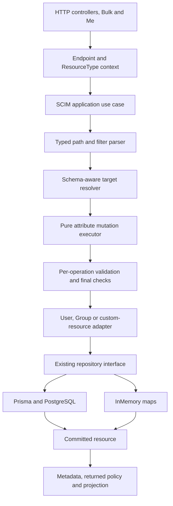
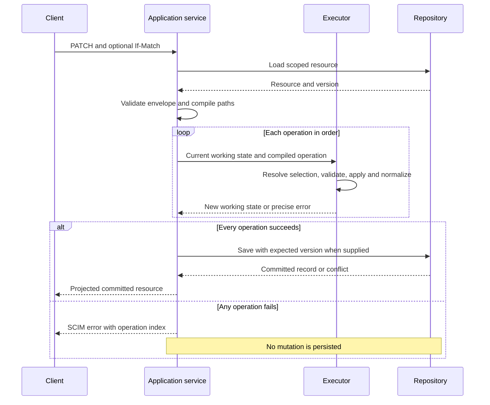

# SCIM correctness: design, implementation, and progress

> **Status:** Implementation authorized; work packages are tracked below
>
> **Last verified:** 2026-09-28
>
> **Starting source:** `ccde1d5d6b5129dd943c6e848989c668a0d00d7a`, version `0.55.35`
>
> **Evidence:** [Independent report](SCIM_FRESH_MASTER_ANALYSIS_2026-09-25.md),
> [82-case database comparison](evidence/scim-fresh-20260925/postgres-20260928-expanded.summary.json),
> and [reproduction instructions](evidence/scim-fresh-20260925/repro-postgres/README.md).

## 1. What we are delivering

The goal is to make SCIM requests behave correctly and consistently for Users,
Groups, and custom resource types on both PostgreSQL and InMemory.

The first release fixes the reported Boolean PATCH path. Later releases correct
operation behavior, conditional writes, Group transactions, search, capability
checks, profile validation, and endpoint lifecycle behavior. We will share the
code that interprets the protocol without hiding the real differences between
the resources or databases.

This is not one large rewrite. Each work package needs its own failing test,
implementation, validation evidence, documentation, and commit. A package is
not complete merely because another package's tests passed.

### What is not authorized by this implementation request

* No automatic change to live endpoint settings or stored customer resources.
* No automatic replay of the original PATCH.
* No customer-production promotion.
* No replacement of dependencies or lockfiles through an unapproved registry.
* No new SCIM protocol such as cursor pagination or security events.

Local disposable PostgreSQL testing is authorized. Remote publication,
reviewed merge, deployment, and data repair remain explicit checkpoints rather
than an implied consequence of a local test passing.

## 2. Why these changes are needed

The database comparison executed 82 cases per backend and 771 assertions.
It demonstrated incorrect behavior, not just missing tests:

| Problem | Consequence | Design response |
|---|---|---|
| Different code interprets the same PATCH path differently | A valid selector becomes a literal property name | One typed path representation |
| Three engines implement similar mutations differently | `add` can replace a list; selected updates change only one match | Shared operation primitives, then a shared executor |
| State is checked only before or after the whole PATCH | Required, immutable and primary rules can be wrong between operations | Validate each transition in request order |
| If-Match is checked before an unconditional write | Two clients with the same version can both save | Conditional repository writes |
| InMemory lacks database constraints and transactions | Duplicate or partially written resources | Explicit atomic map operations and contract tests |
| Capabilities are checked only in some controllers | Bulk or custom routes can bypass a disabled capability | Shared application-level checks |
| Querying uses response-shaped data | Hidden attributes disappear before filtering | Separate internal resource data from response projection |

The earlier evidence files stay unchanged. Implementation results are new
evidence; they must not overwrite the record of the failing product.

## 3. The intended architecture



The application service coordinates the work. The parser and executor do not
read environment variables, look up credentials, issue database queries, or
publish events. Repositories do not interpret SCIM filter text.

Keep existing repository interfaces and dependency-injection tokens:

* [IUserRepository](../api/src/domain/repositories/user.repository.interface.ts)
* [IGroupRepository](../api/src/domain/repositories/group.repository.interface.ts)
* [IGenericResourceRepository](../api/src/domain/repositories/generic-resource.repository.interface.ts)
* [RepositoryModule](../api/src/infrastructure/repositories/repository.module.ts)

Do not introduce a universal repository with a growing resource-type switch.
Use composition rather than a controller/service inheritance hierarchy.

### Resource-specific responsibilities

| Resource | Responsibilities that stay outside the generic executor |
|---|---|
| User | Promoted database fields, username uniqueness, active-state policy, computed groups, User events, and `/Me` subject resolution |
| Group | Member references, deduplication, member-operation settings, and atomic Group-plus-member persistence |
| Custom resource | Dynamic core schema, extension bindings, registered route, optional query columns, and resource events |
| Endpoint administration | Profile merge/replacement rules, schema registration, credentials, cache refresh and cascade cleanup; this is not Resource PatchOp |

## 4. Path interpretation and ordered PATCH execution

### 4.1 Parse syntax once; resolve matches at each operation

The path parser produces an immutable structure describing the namespace,
attribute, optional predicate and optional sub-attribute. It must preserve
typed predicate values and the original operation index for diagnostics.

The following is a proposed interface shape, not an existing implementation:

```typescript
type PatchPath =
  | { kind: 'resource' }
  | {
      kind: 'attribute';
      schemaUrn?: string;
      attribute: string;
      subAttribute?: string;
    }
  | {
      kind: 'selection';
      schemaUrn?: string;
      attribute: string;
      predicate: FilterNode;
      subAttribute?: string;
    };
```

Use the existing filter parser/evaluator where its behavior is proven by tests.
Do not assume it already handles every escape, numeric representation,
attribute spelling, or namespace correctly. Add targeted grammar tests before
extending or relocating it. Keep compatibility re-exports when moving pure
code out of the HTTP module tree.

**Parsing once is not selecting once.** If operation 1 adds an entry,
operation 2 must be able to select that entry. Resolve values against the
current working resource at each step.



### 4.2 Required operation rules

| Rule | Implementation requirement |
|---|---|
| Native Boolean/number/null predicates | Keep literal types; do not require string quotes |
| Invalid bracket syntax | Explicit path/filter error; never a literal property or silent success |
| Multi-valued `add` | Preserve existing values and append/merge according to the selected target |
| Filtered replacement | Update all matches; zero-match replacement returns `noTarget` |
| Complex replacement | Preserve unspecified sub-attributes as the PATCH rules require |
| Required removal | Reject the operation that unassigns a required attribute |
| Immutable values | Check against the current working state, including earlier operations |
| Primary handoff | When an operation selects a new primary, clear the others before the next operation |
| Whole-request failure | Discard working state, including all earlier operations |
| Hidden values | Keep internal state separate from the response view |

### 4.3 Compatibility decisions

Do not silently turn a refactor into a change to every endpoint:

* Keep quoted-Boolean support where it exists, with schema-aware conversion.
  Correct string values that happen to equal `"true"` remain strings.
* Support documented Entra Group remove value arrays through a compatibility
  normalizer; do not treat them as ordinary RFC remove syntax.
* Keep current zero-match Group-member idempotency until its policy is tested.
  RFC text and examples are not completely consistent here.
* Filtered add with no match needs a named policy. Preserve the proven
  equality-discriminator case; do not invent objects from arbitrary compound
  predicates.
* Do not add a new flag just to avoid fixing malformed path storage.
* Changes to literal dotted-key behavior, primary policies, requiredness and
  response status are behavior changes. Document their impact and cover
  existing presets before changing their defaults.

## 5. Schema characteristics and response rules

Use the effective endpoint schema, including published characteristics and
applicable RFC defaults. Read a characteristic from the resolved target rather
than finding it by a bare sub-attribute name shared by unrelated extensions.

| Characteristic | Where it is checked |
|---|---|
| `type`, `multiValued` | Schema registration, request values, selected elements and resulting shape |
| `required` | Create/replace requirements and individual removal transitions |
| `mutability` | Operation-specific readOnly, immutable and writeOnly behavior |
| `caseExact` | Predicate comparison, case preservation and the chosen uniqueness equality rule |
| `returned` | Write response and GET/list/search projection, after permitted filtering |
| `uniqueness` | Supported scope checked atomically where promised |
| `canonicalValues` | Provider restriction if enabled; not an automatic closed enum from the RFC |
| `referenceTypes` | URI/reference type checks and scoped local referential-integrity policy |
| Extension `required` | ResourceType binding, distinct from required fields inside that extension |
| `primary` | Per-operation list normalization; not a separate schema characteristic |

All eight types and both single/multi-valued forms remain in the test inventory.
Simple multi-valued children are not forbidden complex nesting. The Schema
discovery resource has its documented structural exception.

POST and PUT ignore client readOnly values under their rules. PATCH normally
rejects incompatible mutations; explicit ignore settings are compatibility.
Required checks and normalizers must run on the same candidate state that will
be saved, not a discarded temporary copy.

Response rules:

* A 200 PATCH response is compared to a later GET only for common visible
  attributes after projection. A valid 204 has no body.
* `returned:request` can differ between write responses and ordinary GET.
* Always suppress writeOnly and `returned:never` values.
* SCIM errors have string `status` and optional string `detail`; structured
  lists belong in the diagnostic extension.
* Do not put secrets or raw predicate values in new diagnostic logs.

## 6. Persistence design

### 6.1 Conditional update and delete

Extend each aggregate's existing write port with an optional expected version.
When supplied, PostgreSQL's update/delete predicate includes the version and
resource scope. InMemory checks and replaces/deletes the map entry in one
synchronous operation. A mismatch becomes the same typed repository conflict
on either backend and is mapped to HTTP 412.

**P3 implementation:** [conditional writes and User uniqueness](SCIM_CONDITIONAL_WRITES_IMPLEMENTATION.md).
The condition is a numeric version or wildcard existence requirement. The
initial endpoint/resource-type lookup resolves the unique internal storage id;
the atomic write predicates combine that id with the numeric version. A target
removed after the read fails the supplied precondition with 412; an initially
missing target retains 404. Existing unsupported ETag lists still fail rather
than being silently reduced to one version.

Without a client condition, preserve the documented existing write policy.
Do not add hidden retries that reinterpret a client's intended selection.
If a retry is required by a later design, re-read and reapply deliberately.

### 6.2 Group transactions

Group create plus members and Group update plus members are aggregate writes.
PostgreSQL must perform each in a transaction. InMemory must validate/stage
the new Group and member collection before publishing either.

Keep reference lookups outside a long-held transaction where safe, but verify
any constraint that can race at the actual commit boundary. After failure,
scalar values, payload, members and version must all match the original state.

### 6.3 Uniqueness

Keep PostgreSQL's username constraint. Add equivalent atomic InMemory
enforcement, including update and simultaneous create. Service prechecks can
improve diagnostics but cannot be the sole protection.

For Group or schema-driven uniqueness, define the actual namespace and equality
rule before adding constraints. A local scan cannot promise global uniqueness.
Database migrations, if needed, require existing-data analysis and independent
replay tests; do not silently delete conflicting rows.

## 7. Reads, discovery, capabilities, and endpoint lifecycle


* JSON `.search` uses arrays for requested/excluded attributes; URL query
  parameters use their own parser. A compatibility string form must be
  explicit, not the only accepted form.
* Query filters validate the predicate relative to its parent namespace.
* Check whether filtering a hidden attribute is allowed before using internal
  values; never make secret search possible as a side effect.
* Do not cap candidates before residual filtering/counting unless correctness
  is preserved. Do not sort numbers as strings.
* Capability checks belong at a reusable application boundary that direct
  controllers, Bulk and `/Me` cannot bypass.
* Discovery and execution use the same resolved profile. Discovery collections
  retain their special RFC query behavior.
* Endpoint deletion defines all owned records and preserves audit history as
  intended. Test both backends, including credentials in the lifecycle package.
* Cross-process cache freshness needs a measured guarantee. Prefer an
  authoritative persisted revision check for PostgreSQL requests over an
  indefinite process-local cache. Benchmark the extra read; do not introduce
  a distributed cache dependency merely to solve this problem.

## 8. Work packages and completion checks

| ID | Outcome | Depends on | Tests that must turn green |
|---|---|---|---|
| D0 | Commit reviewed design, independent analysis and sanitized evidence | None | Docs, JSON/CSV, links, rendered diagrams, safety guard syntax |
| P1 | Safe, typed PATCH path interpretation on all resource families | D0 | `INC-*`, native/quoted/compound/number selectors, invalid-path no-write cases |
| P2 | Correct shared operation semantics and ordered transitions | P1 | Multi-value add, all matches, required/immutable/primary, selected-object shape |
| P3 | Atomic conditional writes and endpoint-scoped User name uniqueness parity | D0 | Same-version barriers, sequential If-Match, duplicate create/update on both backends |
| P3b | Design atomic schema-driven and Group/custom-name uniqueness | Separate design after P3 | Storage constraints, scope/equality policy and concurrent creates/renames for every promised characteristic |
| P4 | Atomic Group create/update plus members | P3 contract if shared | Native constraints and injected failure rollback, no partial create |
| P5 | JSON search arrays and well-formed errors | D0 | User/Group/custom `.search`, genuine invalid DTO with scalar error detail |
| P6 | Consistent query limits, sorting and capability checks | P1 query seam, P5 | `READ-FILTER-*`, typed sort, hidden fields, direct/Bulk/Me capability checks |
| P7 | Schema/profile validation and supported characteristic promises | P2 | Bad schema type/cardinality, reference/binary/date inputs, required extension and readOnly behavior |
| P8 | Endpoint cleanup and cross-process cache consistency | P3 if conditional admin writes | Cascade/orphan checks and two-reader freshness with stated bound |
| P9 | Honest compatibility/settings documentation and tests | Relevant packages | Modern/legacy Entra corpus, all registered settings reachable and accurately described |
| C0 | Consolidate independent evidence and reviewed release readiness | P1-P9 | Applicable static/unit/HTTP/backend/live/browser/CI gates on the same tip |

Work packages may be split further if one needs an independent migration or
behavior decision. A split is recorded here; it is not silently omitted.

## 9. Test-driven workflow and validation gates

For every implementation:

1. Write a failing test against the intended behavior. Record the actual
   failing assertion; a missing module or failed fixture is not the required RED.
2. Make the smallest complete fix for that work package.
3. Rerun the exact test and its neighboring compatibility tests.
4. Add HTTP contract coverage and a live-test section for externally visible
   behavior. Smoke-run that section against an owned local node before
   consolidation.
5. Run the same relevant behavior with actual Prisma/PostgreSQL and InMemory.
   Database ownership checks must run before migrations or destructive setup.
6. Review error handling, logging, RFC interpretation, test completeness and
   architectural impact.
7. Record evidence, update the implementation/RCA docs and user-facing guide,
   then commit a coherent change.

| Gate | Development lane | Consolidation/release lane |
|---|---|---|
| API build and lint | Changed package, compare warning baseline | Complete API gates |
| Unit tests | Targeted related suites in one invocation | Applicable full unit suite |
| HTTP tests | Relevant routes, outputs and error shapes | API E2E on both backends |
| Database | Task-owned PostgreSQL, relevant behavior | Fresh migration replay plus backend contracts |
| Live HTTP | New/changed section on owned local runtime | Local node and Docker evidence |
| Web/Playwright | Required if a UI surface changes | Browser tests against applicable build; inspect visual diffs |
| Docs | JSON, references, content and diagrams | Freshness and source coupling |
| Review | Changed-code self-review and specialist review where required | Independent review and exact-tip CI |
| Deployment | Not part of local iteration | Explicitly initiated pipeline, same image digest; customer approval separate |

Use the existing runners, not a parallel testing framework. Do not rerun an
unchanged full suite solely because documentation changed. Do not bypass hooks,
lower a gate, or call a setup failure a product failure.

The historical analysis harness refuses changed production input on purpose.
Promote its useful cases into permanent tests. Any adapted implementation
harness records the new source tip and new expected results separately; it must
retain the task-owned database guards.

## 10. Commit, release, and rollback rules

* D0 includes the independent report, sanitized machine-readable evidence,
  opt-in reproducers, design, RCA ledger, INDEX and session context.
* Exclude ignored execution logs, generated clients, dependency links, HTML
  build output, local credentials and disposable database state.
* Preserve the earlier documentation commit in its separate worktree.
* Begin implementation in a fresh context/worktree from the design commit.
* Use ordinary new commits with the required trailers. Never amend, force-push,
  rewrite the preserved evidence, or bypass verification.
* Record version/test changes accurately. Release version/lockfile updates
  follow the approved public-runner workflow; local corporate lockfile
  regeneration is not a shortcut.
* Reviewed PRs and exact-tip CI gate merge. A successful local commit is not
  described as merged, deployed, or production-ready.
* Roll back code independently from data repair. New parser behavior must not
  automatically reinterpret already-stored malformed keys.

## 11. Progress tracker

Statuses mean: **pending**, **in progress**, **implemented**, **validated**,
**committed**, **integrated**, or **blocked with a named reason**. Integrated
means assembled on the local integration branch, not merged to master or deployed.
Package validation counts below describe the original package evidence; the
combined checkpoint has its own counts in section 11.1.

| Package | Status | Evidence / next action |
|---|---|---|
| D0 | Committed | `cb2e1bcb`: reviewed design, independent report and immutable baseline evidence; 22 JSON artifacts, 140 relative links and 10 rendered diagrams verified |
| P1 | Integrated | [Implementation and evidence](SCIM_P1_IMPLEMENTATION.md): 1,476 focused unit / 65 HTTP passes; owned Prisma/PostgreSQL and InMemory each pass 24 permanent HTTP cases plus 58 live assertions. Central release metadata pending; no push/merge/deploy. |
| P2 | In progress separately | Await parent-supplied commit; pending diffs are not part of this assembly |
| P3 | Integrated | 692 targeted units; 55 HTTP tests and 33 live assertions per backend. PostgreSQL 17.8 and InMemory. See [implementation](SCIM_CONDITIONAL_WRITES_IMPLEMENTATION.md); release metadata/PR/matrix pending |
| P3b | Deferred with explicit scope | Schema-driven, Group and custom-name atomic uniqueness need a separate design; P3 does not claim these guarantees |
| P4 | In progress separately | Await parent-supplied commit; native and injected member failures remain acceptance checks |
| P5 | Integrated | Shared JSON search boundary and scalar SCIM errors; 354 unit tests, 61 HTTP tests per backend, 61 live assertions. [Implementation and evidence](SCIM_SEARCH_CONTRACT_IMPLEMENTATION.md). Release metadata and final consolidation remain pending |
| P6 | Partly integrated | P6a capability boundary integrated: 69 HTTP tests on each backend, 346 unit tests, 7 local live checks and independent review; P6b query/projection/sort/limit work remains separate |
| P7 | In progress separately | Await P7a commit and remaining schema promises |
| P8 | In progress separately | Parent owns P8a source; cleanup/cache contracts are not claimed integrated |
| P9 | Pending | Follow changed behavior; preserve legitimate compatibility |
| C0 | Initial assembly verified | Section 11.1 only; final matrix/release readiness waits for remaining packages |

**Current overall progress:** design/evidence validated for the baseline commit;
P1, P3, P5, and P6a are implemented and locally validated in their source worktrees,
and integrated here. Focused initial validation passed; final combined matrix,
release metadata, PR, and deployment remain pending. Other statuses are owned by their independent
implementation contexts. This section is updated at package boundaries. Detailed
issues are recorded in the [execution RCA ledger](SCIM_CORRECTNESS_EXECUTION_ISSUES_AND_RCA.md).

### 11.1 Initial integration checkpoint, 2026-09-28

Branch: `integrate/scim-correctness-20260928`; base: D0 `cb2e1bcb`
on master `ccde1d5d`. Five source commits were cherry-picked in the supplied
order, without squash, amend, publication or deployment.

| Package | Source commit | Integration commit |
|---|---|---|
| P1 typed PATCH paths | `3ecaba55df5424b5427b8fdc41c1bdad0b8d0f51` | `9676fb94` |
| P3 conditional persistence and User uniqueness | `0aae30775a2888ff4bc6e67636d51ab234e717a5` | `c980e1fe` |
| P3 handoff cleanup | `41c5b8c52ece0d8b48042c754cbdefa68624248f` | `8cbf6349` |
| P5 JSON search/error contract | `e3da254a5ec4cdeac4a2985b8fe4a8817141126f` | `10e3305f` |
| P6a capability boundary | `a801935866e06c2c3907bc6fad92683f6b4f98e3` | `a5751028` |

**Merge decisions.** Keep P1 parsing and indexed diagnostics before mutation,
P3 expected-version conditions at each repository write, P5 validated projection
normalization at all search controllers, and P6a capability checks at the
appropriate client/application boundary. `/Me` internal identity lookup retains
its exception to client-filter capability checks. All production overlaps
auto-merged and were reviewed; conflicts were shared documentation and the live
runner. Documentation retains all package rows and evidence, not one side's
claim that the other work is still pending.

**Live wiring correction.** P1/P3 helpers existed but had no main-runner route,
and both P5/P6a claimed section `9z-CO`. Three permanent regressions failed
before wiring changed. The main runner now invokes one shared section before
cleanup: P5 `9z-CO`, P6a `9z-CP`, P1 `9z-CQ`, P3 `9z-CR`. Explicit-target HTTP
functions share the original assertions while original standalone ownership
guards remain intact. Every fixture is dedicated and cleaned in `finally`.

| Initial integration gate | Evidence |
|---|---|
| API build | PASS, after restoring missing tooling through an owned read-only dependency junction and generating only the local Prisma client |
| Focused source lint | PASS, 0 errors / 195 warnings across 50 merged source/test files; no gate or warning ceiling changed |
| Merge-sensitive units | PASS, 20 suites / 1,011 tests, including 3 new wiring regressions |
| Four package HTTP suites | PASS, 4 suites / 91 cases, explicit InMemory plus inert database URL |
| Combined live main section | PASS, 71 reported checks containing 58 P1 + 33 P3 assertions, 61 P5 + 7 P6a checks, and extra P3 endpoint cleanup |
| Resource cleanup | PASS, endpoint collection identical before/after; owned API stopped |
| Standalone harness isolation | PASS, P1/P3 reject unowned input before network/database access |
| Script syntax | PASS, four PowerShell files and two Node helpers |
| Documentation | Content audit passes; 15 literal JSON blocks in edited docs parse. Two F4-bound operator guides now explain P1. Final committed-range coupling verification runs after the integration wiring commit |
| Historical evidence and release metadata | Frozen; no prior analysis, version, manifest or lockfile changes |
| Full authoritative matrix / new PostgreSQL proof / publication / deployment | Not run or claimed at this initial assembly checkpoint |

Full logs stay in ignored `test-results/scim-integration-initial/`. Package-local
PostgreSQL receipts remain independent evidence, not relabeled as an
integration-branch database run. Other packages are still being authored; do
not start final C0 or release from this checkpoint.

## 12. Architecture and self-improvement decisions

| Decision | Disposition and reason |
|---|---|
| Shared path representation | Applied in this design: one demonstrated input currently has inconsistent interpretations |
| Shared mutation primitives, then executor | Planned: three real implementations justify reuse |
| Resource-specific repository ports | Retained: Group membership is a real aggregate difference |
| General-purpose Unit of Work or policy DSL | Rejected: not needed for the first fixes |
| All-CRUD rewrite in one change | Rejected: obscures behavior and rollback |
| Backend-specific failure tests | Required: the measured storage differences cannot be proved with one mock |
| Plain-language evidence | Applied: explain the outcome before using test IDs or internal terminology |
| Existence-only tests | Rejected: each acceptance check must assert stored values, returned shape or a real failure outcome |

Relevant standards are traced in [report section 6](SCIM_FRESH_MASTER_ANALYSIS_2026-09-25.md#6-standards-and-microsoft-entra-interpretation).
RFC 7643/7644 and accepted errata define the base behavior; Entra-specific
wrappers and optional policies are not silently relabeled as RFC requirements.
