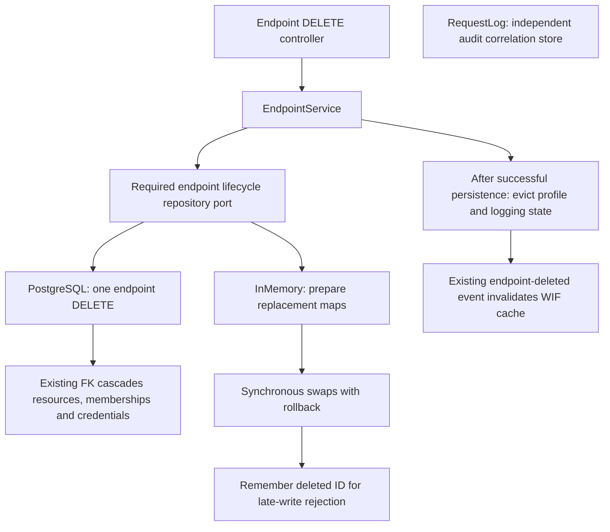
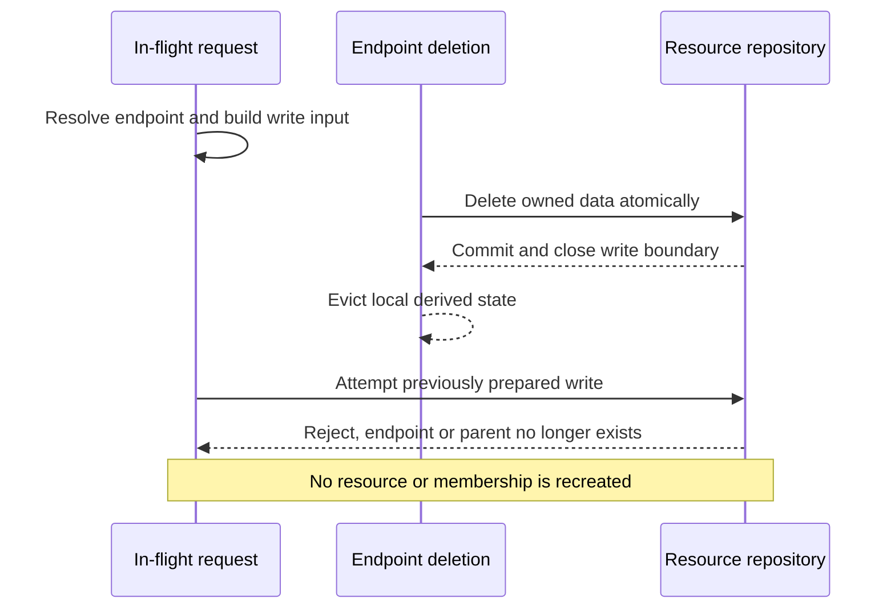
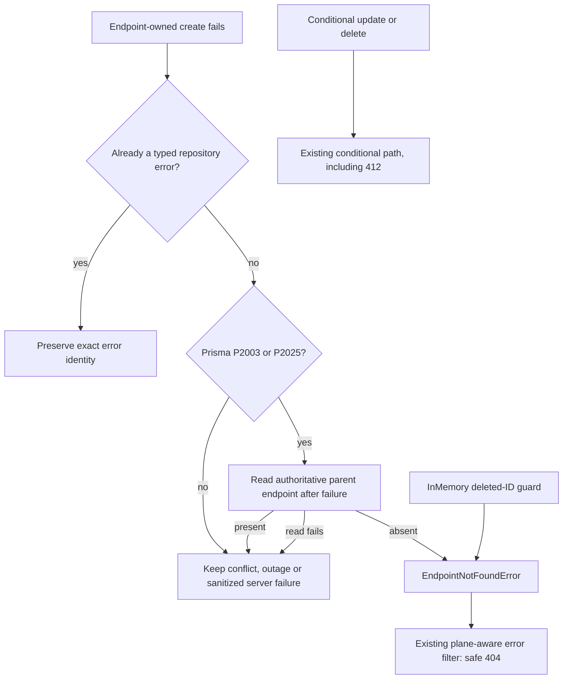

# Endpoint deletion: owned data, audit history and late writes

> **Last verified:** 2026-09-29
>
> **Status:** P8b implemented and validated locally; not deployed.
>
> **Base:** Reviewed P8a `39841319`; product remains `0.55.35`.
>
> **Related:** [Design and progress](SCIM_CORRECTNESS_DESIGN_AND_IMPLEMENTATION.md),
> [P8a freshness](SCIM_ENDPOINT_FRESHNESS_IMPLEMENTATION.md),
> [execution issues](SCIM_CORRECTNESS_EXECUTION_ISSUES_AND_RCA.md).

## 1. What changes for an operator

Deleting an endpoint removes its provisioning data, not its audit history.
Previously InMemory removed the endpoint from its cache but left the resource
and credential repositories populated. A later GET returned 404, which hid
the retained rows from an HTTP-only check.

Both backends now remove the endpoint's Users, Groups, Group memberships,
every custom resource type and every credential. A successful response is
`204 No Content`, with no response fields. Other endpoints remain intact.
Reusing the deleted endpoint's name creates a new identity with empty stores.

| State | Deletion behavior |
|---|---|
| Users, active or inactive | Removed |
| Groups, including nested Group relationships | Groups and their membership rows removed |
| Custom resources | Removed regardless of whether the type remains registered in the profile |
| Bearer and OAuth credentials | Active, revoked and expired rows removed, including stored envelopes |
| WIF trusts | Removed with the other credentials |
| Endpoint profile and schema characteristics cache | Evicted from the local endpoint cache |
| Endpoint logging overrides and file transport | Cleared/disabled; existing files are not erased |
| Local WIF credential cache | Invalidated on deletion, including when a PostgreSQL reader observes remote deletion |
| RequestLog | Retained with the old endpointId; buffered and later audit records can still be stored |
| Global credential encryption keys, server settings and JWKS allowlist | Not endpoint-owned; unchanged |

Endpoint administration is a server management API, not SCIM resource DELETE.
RFC 7644 section 3.6 governs SCIM resource deletion; this package defines the
application's enclosing endpoint ownership contract. It introduces no new
protocol, endpoint, payload or database migration.

## 2. The storage boundary



`IEndpointLifecycleRepository` is a narrow deletion port. `RepositoryModule`
binds it to the selected backend and `EndpointModule` explicitly imports that
module. The dependency is required: absent wiring fails application assembly
rather than silently skipping cleanup.

The existing InMemory repositories each own separate maps. No shared
InMemoryDatabase exists, and this change does not introduce one.

| Option considered | Decision |
|---|---|
| Await each repository's ordinary delete method | Rejected: another request can run between destructive stages, and failure leaves partial deletion |
| Move all repositories into a shared database or generalized UnitOfWork | Rejected: unnecessary ownership migration and broad overlap with the other correctness packages |
| Endpoint-specific synchronous preparation and reversible map swaps | Selected: preserves repository ownership, has no await inside commit/rollback, and can be fault-injected at each participant |

Each repository prepares a replacement map without mutating the live map.
The lifecycle adapter prepares all participants before applying any change.
If a commit throws, it restores the applied participants in reverse order,
including the participant that threw after its swap. The endpoint cache is
not evicted, no deletion event is published, and subsequent writes still work.
This guarantee covers ordinary preparation/commit failures, not process death
or unrecoverable memory exhaustion.

Preparation scans the InMemory stores and temporarily holds replacement maps.
This costs O(total stored rows) time and additional map storage during deletion,
in exchange for deterministic rollback without restoring partially modified
maps. It is a lightweight-backend trade-off, not a PostgreSQL performance change.

PostgreSQL still owns its transaction semantics: one endpoint delete cascades
through existing foreign keys. RequestLog intentionally has no endpoint FK.
The guarded test injects a database trigger error on credential deletion and
verifies that all earlier cascade effects roll back.

## 3. A request that was already running



InMemory create and credential-rotation paths check the shared deletion
barrier immediately before writing, with no intervening await. Existing
updates already require the row to exist. Membership insertion now requires
its parent Group to exist, closing the yield inside `updateGroupWithMembers`.
No User, Group or generic-resource update signature changes.

The barrier retains deleted UUIDs for the process lifetime. Its space cost is
one identifier per deleted endpoint. Expiring them would reopen the race for
an arbitrarily delayed request. It is deliberately a deletion barrier, not a
complete emulator of all PostgreSQL foreign keys: standalone repository
fixtures can still use previously unseen endpoint IDs. Production creates
resolve the endpoint before entering these repositories.

In particular, these cleanup tests do **not** prove shared-storage User-FK
semantics. The native PostgreSQL User-FK control is not applicable to the
independent InMemory User and Group repositories. Parent Group existence and
endpoint deletion barriers are the specific InMemory guarantees tested here.

Already-returned snapshots and in-flight authorization work are not cancelled.
The guarantee is that a write after deletion cannot repopulate owned storage.
The original paused HTTP probe only verified rejection and exact counts.
The separate [exact-error follow-up](#6-exact-concurrent-deletion-http-contract)
now requires a safe 404 for each supported interrupted create path on both
backends. Storage integrity alone was not a complete API error contract.

## 4. Evidence

The fixture seeds **each** of two endpoints with one User, two Groups, three
membership rows (User, nested Group and external reference), two custom
resource types and four credentials (active bearer, revoked OAuth, WIF and
expired bearer). It checks raw membership storage by the original Group IDs,
so missing parents cannot hide orphan members.

| Evidence | Result |
|---|---|
| Original TDD RED | Expected all counts zero; observed User 1, Group 1, custom 1, credentials 3 |
| Focused unit/controller matrix | 277 passed across 11 suites, including required-provider assembly failure |
| InMemory rollback | Fault after each of four participants' commits, plus preparation failure; all rows and endpoint preserved |
| Late-write boundary | Every owned insert, credential rotation, paused Group member update and paused User HTTP create reject without leftover rows |
| Both-backend HTTP | 6 new deletion cases plus 18 preserved P8a/profile cases passed per backend |
| PostgreSQL | Task-owned PostgreSQL 17.8; 22 migrations replayed; real FK cascade failure rolled back |
| Remote credential-cache RED/GREEN | Warmed reader retained one WIF trust after 404; deletion observation now invalidates it |
| Live built Node runtimes | 10 deletion checks and 7 P8a freshness checks per backend; PostgreSQL freshness used two processes |
| API static gates | Build passes; full lint has 0 errors and 527 existing warnings; new tests lint clean |
| Documentation | Content and coupled freshness gates pass for all 26 manifest docs; diagrams render in both strict themes |
| Scope | No dependency/lockfile/product-version change, shared database, deployment or push |

These are the original cleanup-package results. The follow-up's expanded
error-contract matrix and latest counts are in section 6.

Permanent evidence:

* [Service/storage tests](../api/src/modules/endpoint/services/endpoint-deletion.spec.ts).
* [Shared exact-count fixture](../api/test/helpers/endpoint-deletion.fixture.ts).
* [HTTP tests](../api/test/e2e/endpoint-deletion.e2e-spec.ts).
* [Live helper](../scripts/test-scim-endpoint-deletion.ps1), integrated into
  [live-test.ps1](../scripts/live-test.ps1) as `9z-CT`. P8a keeps `9z-CR`;
  sibling P8c reserves `9z-CS`.

The live helper creates and cleans up only its own UUID-named endpoints.
It proves public behavior; it does **not** claim that HTTP 404 proves physical
storage cleanup. The independent storage assertions above make that claim.

Ignored receipts, source identities, migration results and logs are under
`test-results/p8b/`. The reviewed P8a runner was copied there as task-owned
tooling. Database checks verify owner/run labels, loopback-only port mapping,
ephemeral storage, database/cluster identity and all 22 migrations. Cleanup
removes and verifies the exact owned container ID, never a name wildcard.

Ordinary PostgreSQL E2E runs use a nondestructive mocked delete failure.
Only an explicitly guarded `PG_ANALYSIS_RUN` database receives the trigger
fault. Both invocation paths are tested; task-only prerequisites do not break
the ordinary E2E entry point.

Documentation gates passed for 26 manifest documents; 17 diagrams in the
touched feature/architecture guides rendered in both strict themes. The
editor detector still reports the existing Mermaid version placeholder
`0.0.0`; browser rendering used pinned `11.15.0`. Exact editor-version parity
is not claimed, and no dependency was changed to that placeholder.

## 5. Review and remaining boundaries

Independent review found no production blocker. It identified a test-harness
compatibility issue: requiring task-only database variables in ordinary
PostgreSQL E2E runs. That requirement is now confined to the real-trigger path,
with a normal-entry-point run on another owned database.
The follow-up independent review reported no significant issues.

**Test/gate improvement: applied.** Exact raw counts, late-write barriers,
per-stage rollback and remote cache invalidation now have regression checks.
The live fixture explicitly enables the credential methods it creates.

**Design/architecture disposition: accepted.** The deletion adapter is cohesive
and small; it does not turn the already-large EndpointService into a storage
coordinator. Two real backend implementations justify the port. A generalized
transaction abstraction or all-store migration would add unnecessary scope.

P8c conditional endpoint-admin writes, P3 integration, full consolidation
gates and release/deployment remain separate. P8a's authoritative PostgreSQL
reads and fingerprint-based cache hydration remain intact.

Integration coordination: P4 Group aggregate commits `212a6b92` and
`66a7229f`, and P8c conditional endpoint-update commit `8eb2f162`, are merged
by the parent integration task, not this worktree. P8b does not import their
pending changes or change its delete scope to implement their write contracts.

## 6. Exact concurrent-deletion HTTP contract

The accepted cleanup commits `88b96c74` and `2db239a9` proved no orphan records
but accepted any HTTP status from 400 to 599 for an interrupted create. That
assertion allowed an avoidable 500. It also failed to distinguish a deleted
endpoint from a database outage, missing member or conditional-write conflict.

The follow-up first replaced that assertion with six deterministic paused
creates: User, Group, custom Device, bearer credential, OAuth credential and
WIF trust. All six went RED on each backend. The existing credential APIs are
admin management routes under `/scim/admin`; they use the existing SCIM error
envelope, not the RFC 6749 OAuth-token error body.

### Decision at the persistence boundary



The new domain subtype is narrower than a generic `NOT_FOUND`: it means the
owning endpoint disappeared during an attempted create. InMemory's existing
deletion barrier emits it. PostgreSQL considers it only after a failed insert
reports `P2003` or `P2025` **and** a fresh query proves the endpoint absent.
An FK error by itself does not identify which relation is missing.

The failed insert remains protected by the existing database constraints.
There is no new pre-check pretending to make a write atomic. Successful
creates issue no additional endpoint query. The rare failed-relation path
adds one read, after the failed operation; if that read fails, absence has not
been proved and no endpoint 404 is produced.

The shared translator preserves existing typed repository errors by identity.
The endpoint-create classifier is not called by conditional update or delete
operations. This keeps the P3 integration boundary intact: their precondition
failure must remain 412, not become a missing-parent classification.

Unknown create failures have a safe public message and retain their original
cause for server logging. Connection classification uses Prisma codes and
specific native pg timeout signals. A bare `connect` inside SQL/query source
is no longer mistaken for an outage; actual uncoded pg-pool timeouts still
produce sanitized 503 on SCIM resource writes.

### Response and negative controls

The stable fields for a create that loses its endpoint are:

```json
{
  "schemas": [
    "urn:ietf:params:scim:api:messages:2.0:Error"
  ],
  "detail": "Endpoint no longer exists",
  "status": "404",
  "urn:scimserver:api:messages:2.0:Diagnostics": {
    "errorCode": "ENDPOINT_NOT_FOUND"
  }
}
```

The response uses `application/scim+json`. Existing request diagnostics add
`requestId`, `endpointId`, `logsUrl` and, on resource creates, `operation:
create`. No `scimType` is invented for this admin-parent disappearance. Tests
assert the full key allowlist, scalar detail, status, diagnostics and absence
of Prisma codes, FK/constraint text, stack traces and driver internals.

| Situation | Proven result |
|---|---|
| Six creates paused immediately before persistence, endpoint deleted meanwhile | Exact safe 404, no new rows, other endpoint unchanged |
| Stale User, Group and Device If-Match | Existing 412 preserved, stored counts unchanged |
| Existing typed member-reference validation error | 400 `invalidValue` preserved; not labeled `ENDPOINT_NOT_FOUND` |
| Native PostgreSQL User-reference FK failure while endpoint exists | Still a distinct persistence failure, not a missing endpoint |
| Actual PostgreSQL trigger failure on resource or credential insert | Safe 500, no partial new records; endpoint remains available |
| Classified resource database outage | 503, never an endpoint 404 |
| Unrelated credential database failure | Existing sanitized 500 convention retained; no auth redesign |
| Actual one-slot pg Pool held until acquisition times out | User create and update return sanitized 503, no state change |

The member-validation HTTP check deliberately injects an already-classified
400 to prove pass-through. It is not evidence that this branch implements P4's
member validation. Native User-FK and pg-pool controls are PostgreSQL-only and
explicitly N/A for independent InMemory repositories.

### Final follow-up evidence and integration handoff

| Gate | Result |
|---|---|
| Focused unit/filter/repository matrix | 323 passed across 10 suites |
| PostgreSQL HTTP matrix | 39 passed: 21 deletion/error cases plus 18 P8a/profile cases |
| InMemory HTTP matrix | 37 passed, 2 explicit PostgreSQL-only N/A cases |
| Standard PostgreSQL E2E entry point | 21 passed without task-only test variables |
| Guarded database replay | PostgreSQL 17.8, all 22 migrations, real trigger faults and native pool timeout |
| Local built live smoke | 16 deletion checks plus 7 P8a freshness checks per backend |
| Build and lint | API build passed; full lint 0 errors / 527 unchanged warnings |
| Review | Native-timeout regression found, fixed with RED/GREEN controls; follow-up review found no significant issues |
| Documentation | 26-document content/freshness gates passed; all 3 feature diagrams rendered under both strict themes; 49 literal JSON blocks parsed in touched docs |
| Cleanup | Each exact owned database container removed; task-owned Node runtimes stopped |

The live helper now checks six late-create error envelopes after deletion.
It does not claim to schedule an in-flight race over an unmodified public
server. The deterministic HTTP tests provide that separate race evidence
without adding production test hooks. Receipts and red/green artifacts are
under ignored `test-results/p8b-errors/`.

**Test/gate improvement: applied.** No-orphan checks now have exact wire
contracts, positive native-driver controls and negative validation/outage
controls. **Design/architecture disposition: accepted.** A small domain
subtype plus a create-only classifier extends the existing error boundaries;
no shared InMemory database, general FK emulator or auth strategy redesign.

The previously deferred P8b HTTP contract is locally verified. Parent
integration must still run the combined P3/P4/P8c matrix, especially P4's
aggregate create boundary and P3's atomic same-version-write checks. No pending
sibling source was imported. P8 remains open at the integration level until
those independent package results are assembled and verified.
