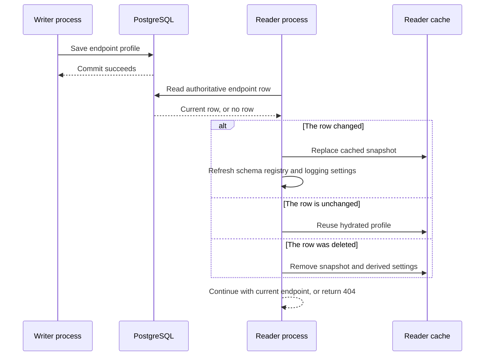

# Endpoint cache freshness across application instances

> **Last verified:** 2026-09-28
>
> **Status:** P8a implementation validated locally; not deployed.
>
> **Related:** [Overall design and progress](SCIM_CORRECTNESS_DESIGN_AND_IMPLEMENTATION.md),
> [execution lessons](SCIM_CORRECTNESS_EXECUTION_ISSUES_AND_RCA.md).

## 1. What was wrong

With PostgreSQL, two application processes share one database but do not share
memory. Previously, each process warmed an endpoint cache at startup. A later
request could return that cached profile without checking the database.

An operator could save a setting on process A while process B continued to use
the old setting indefinitely. The same problem affected endpoint lists,
deletion visibility and the separate statistics existence check.

This was not an InMemory database synchronization failure. InMemory storage is
local to one application instance by design. Two independent InMemory instances
do not represent replicas of the same data.

## 2. The new read boundary



The important ordering is the database commit followed by the reader's new
lookup. A read already in progress may still observe the earlier committed
snapshot. This change is not a transaction spanning an entire SCIM request, and
it does not claim to cancel in-flight requests when a setting changes.

| Entry point | PostgreSQL behavior | InMemory behavior |
|---|---|---|
| Endpoint by ID or name | Read the database before returning | Read the instance-owned endpoint |
| Endpoint list | Query current rows; unfiltered lists evict missing entries | List the instance-owned endpoints |
| Endpoint statistics | Verify existence through the same read boundary before counting | Verify the local endpoint before counting |
| Missing/deleted endpoint | Remove cached snapshot, logging overrides and schema overlay; return 404 | Return 404 |
| Database failure | Propagate the failure; do not return a stale profile as success | Not applicable |

## 3. Why the cache still exists

The cache now saves **derived work**, not the authoritative database read.
Profiles contain runtime schema indexes that should not be rebuilt every time
an unchanged endpoint is used.

The service hashes the normalized endpoint snapshot, excluding runtime-only
`_schemaCaches`. Equal fingerprints preserve the existing hydrated object.
Changed fingerprints refresh the snapshot and notify the existing profile
listener. Comparing content also detects two different writes with the same
timestamp; a millisecond timestamp alone is not a reliable revision token.

This uses the existing endpoint service, profile listener and Prisma boundary.
It adds no message broker, distributed cache, schema migration or new
dependency. Resource repositories remain responsible for resource persistence.

Names are not editable through the endpoint PATCH API. The service test for
an externally changed database name protects against stale aliases; it does
not introduce an admin rename feature.

## 4. Performance and consistency trade-off

An unchanged cached ID lookup previously issued zero endpoint queries. It now
issues one authoritative lookup. A failed UUID lookup may additionally try the
supported name fallback. A single HTTP request can resolve an endpoint more
than once in its existing middleware/guard/controller path.

The added database work is deliberate: an indefinite stale authorization or
schema profile is not a valid performance optimization. No claim of unchanged
latency is made. A future request-scoped snapshot optimization must preserve
the same fresh-read boundary rather than reinstate a cross-request cache.

The live helper measured 30 successful, sequential admin reads after warmup:

| Local runtime | p50 | p95 | p99 |
|---|---:|---:|---:|
| InMemory, one built Node process | 8.81 ms | 14.47 ms | 27.05 ms |
| PostgreSQL 17.8, two built Node processes sharing one owned database | 13.85 ms | 18.21 ms | 36.05 ms |

These are whole-request observations on a shared development machine, not a
load test or a before/after PostgreSQL benchmark. They must not be used as a
production latency promise. The query-count regression test separately proves
that two unchanged endpoint resolutions perform two authoritative reads while
avoiding repeated registry hydration.

## 5. Tests and reproduction

| Evidence | Result |
|---|---|
| Baseline cache cases | Six behavior failures before the freshness fix |
| Separate statistics regression | Returned statistics instead of 404 before its fix |
| Focused unit tests | 163/163 passed across five service, InMemory, controller and endpoint ETag suites |
| Endpoint profile and freshness HTTP tests | 18/18 on each backend |
| PostgreSQL HTTP setup | Two independent Nest application instances |
| Built-runtime live checks | 7/7 on InMemory; 7/7 across two PostgreSQL-backed Node processes |
| Database replay | 22/22 migrations on task-owned PostgreSQL 17.8 |
| Database cleanup | Exact owned containers removed after each run |
| API build and targeted lint | Build passed; 0 lint errors and 19 unchanged production warnings; new tests clean |
| Documentation | Content and coupled freshness passed; 11 diagrams in touched guides rendered in both strict themes |
| Independent review | No significant issues found in the production and regression-test changes |

The permanent tests are
[service freshness](../api/src/modules/endpoint/services/endpoint-cache-freshness.spec.ts),
[existing endpoint contracts](../api/src/modules/endpoint/services/endpoint.service.spec.ts),
and [HTTP freshness](../api/test/e2e/endpoint-cache-freshness.e2e-spec.ts).
The HTTP suite uses a separate token per application because its temporary
OAuth keys are intentionally independent.

The [live helper](../scripts/test-scim-endpoint-freshness.ps1) is also invoked
from section `9z-CR` of [the main live runner](../scripts/live-test.ps1). It
creates and deletes only its own endpoint. For a two-replica check, pass two
addresses that really target different processes sharing the same PostgreSQL
database:

```powershell
.\scripts\test-scim-endpoint-freshness.ps1 `
  -BaseUrl $WriterBaseUrl `
  -Token $WriterToken `
  -ReaderBaseUrl $ReaderBaseUrl `
  -ReaderToken $ReaderToken
```

Omitting the reader arguments checks one runtime. That is useful for regression
testing, but it is not evidence of cross-process consistency.

Ignored local artifacts are under `test-results/p8/`, including the migration
receipt, focused test logs, two-process live output and build/lint output.
Historical investigation evidence remains unchanged.
The existing renderer detector reports a placeholder editor Mermaid version
of `0.0.0`; actual browser rendering used the pinned 11.15.0. Exact editor
version parity is not claimed and no dependency was changed to that placeholder.

## 6. Boundaries and next steps

* This package fixes endpoint read freshness, not resource PATCH semantics.
* It does not make endpoint read-check-write updates atomic; conditional admin
  writes require their own persistence-boundary treatment.
* P8a did not clean up orphaned InMemory resources after endpoint deletion.
  The separate [P8b repository-lifecycle package](SCIM_ENDPOINT_DELETION_IMPLEMENTATION.md)
  now implements that cleanup and invalidates local WIF cache entries when a
  reader observes remote deletion, without removing the authoritative read.
* It does not turn independent InMemory instances into a replicated backend.
* Consolidation still owns release metadata, the complete applicable matrix,
  reviewed PR and exact-tip CI. This local evidence is not a deployment claim.

**Test/gate improvement: applied.** Added two-reader HTTP and two-process live
checks plus a separate statistics regression. A same-instance test alone could
not detect this defect.

**Design disposition: accepted.** The existing endpoint service already owns
endpoint snapshots and listener notification. The new helpers keep that
responsibility together. The file is already large; creating an abstraction
with only one use would not itself improve the persistence contract.
