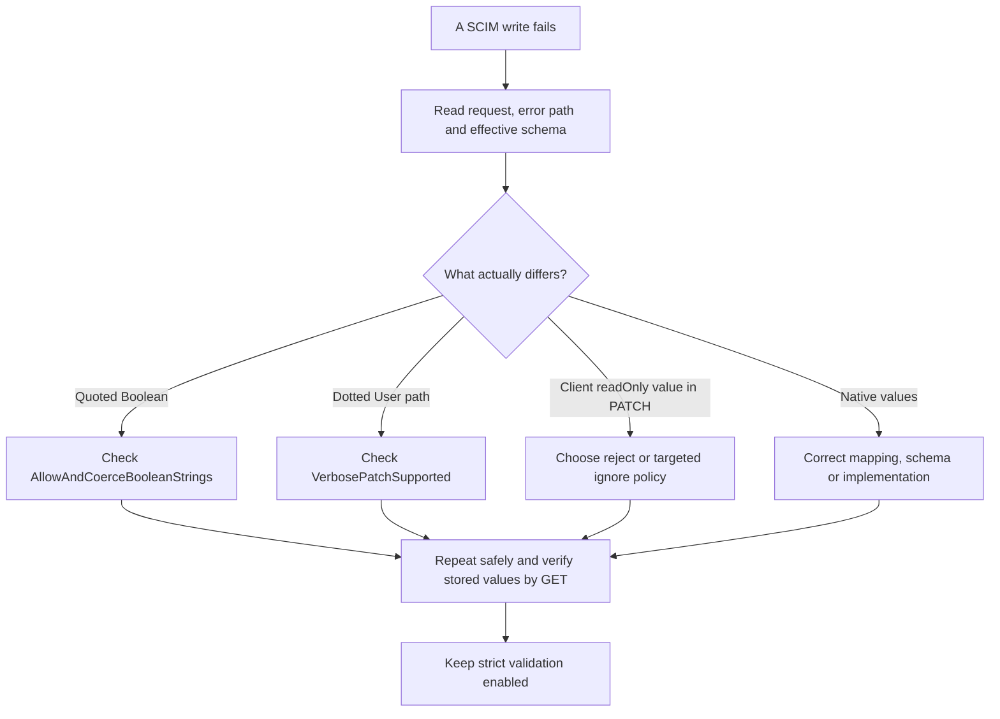

# SCIM and Microsoft Entra compatibility

**Last verified:** 2026-09-29

**Scope:** historical P9 on P7a/P1 base `8e42f15f54a955fd6b93d58e9471c393329f4d3a`,
plus the explicitly identified integration checkpoint below. Local evidence,
not a deployed-service certification.
See the [correctness tracker](SCIM_CORRECTNESS_DESIGN_AND_IMPLEMENTATION.md),
[37-setting evidence table](SCIM_SETTINGS_BEHAVIOR_EVIDENCE.md), and
[execution ledger](SCIM_P9_EXECUTION_RCA.md).

**Verified P2 integration checkpoint, September 29:** `29b3b2c6` is integrated
as `8d2110d1`. I02 and the unchanged I03 rejection/no-write assertions pass
on both InMemory and actual PostgreSQL 17.8. All **19 P9 cases / 1,228
built-live assertions** now run by default, with no TODO or environment
selection. The separate P2 flag suite verifies both strict modes and
repository readback; its built-live contract passes **188 assertions** per
backend. [New integrated receipt](evidence/scim-flags-default-corpus-20260929/validation.json).
The original P9 **17-supported / 2-pending** receipt remains historical and
unchanged. Frozen P2 `7113ee86` preserved literal-dotted behavior; the
parent-authorized follow-up deliberately replaces it, without changing defaults.

## Start here

**Keep strict schema validation enabled for Entra.** It checks that a value
matches the endpoint's schema. Turning it off does not fix a PATCH parser and
can hide a wrong update. First read the error's attribute path, the request
actually sent, and the endpoint's effective `/Schemas` and `/ResourceTypes`.
Use a specific compatibility setting only for a specific, verified mismatch.

The `entra-id` preset is not the RFC schema verbatim. It requires User
`displayName` and `emails`, in addition to `userName`. Our synthetic examples
include those fields. Microsoft documentation examples that omit them must
be adapted to the effective profile, or the profile must deliberately change.
Disabling strict validation does not remove required-attribute checks.



## What Microsoft documents, and what we prove

Sources retrieved on September 28 local time (September 29 UTC):

* [Microsoft endpoint tutorial][ms-tutorial]: mixed-case operation names,
  User lifecycle, filtered email updates, dotted names, Group lifecycle and
  `excludedAttributes=members`. Group displayName uniqueness is an **Entra
  integration requirement, not a general SCIM protocol requirement**.
* [Microsoft compatibility issues][ms-compat]: distinguishes old
  `customappsso` jobs from `scim` jobs, and documents `aadOptscim062020`
  native Boolean/pathless updates/filtered member removal versus legacy
  quoted Boolean/separate operations/value-array member removal.
  The page says this flag does not apply to on-demand provisioning.
  Do not infer a tenant's wire shape from its age or from the word "Entra".
* [RFC 7643][schema], especially 2.2, 2.3, 2.4, 4 and 7; [RFC 7644][protocol],
  especially 3.3 through 3.7 and 3.14. These are the baseline, not a claim
  that every optional protocol is implemented.
* Verified RFC 7643 errata [5607][e5607] (referenceTypes is multi-valued) and
  [8415][e8415] (binary is valid; complex sub-attributes are not).
  Both Verified statuses were checked on the RFC Editor pages. RFC 7644
  [7916][e7916] is Verified and corrects a malformed error example.
  [4690][e4690] is **Held for Document Update**, not Verified; neither it
  nor later *Reported* suggestions silently create new normative behavior.

The Microsoft-docs MCP catalog discovery returned no server. Official
Microsoft pages were fetched directly; RFC Editor pages were read in the
browser when plain retrieval omitted status fields. No private payload,
tenant identifier, credential or log was uploaded.

### Permanent corpus

[Corpus](../api/test/e2e/corpus/entra-compatibility.cjs),
[HTTP wrapper](../api/test/e2e/entra-compatibility.e2e-spec.ts) and
[built-live wrapper](../scripts/live-test-p9.cjs) run the **same assertions**.
Inputs use invented `example.com` identities and the effective `entra-id`
preset, not captured customer payloads. Native and legacy cases are distinct.
**Scope:** every P9 endpoint explicitly enables `StrictSchemaValidation`.
E04/E05's coercion-switch results therefore apply to strict ON only.
The P9 corpus itself does not prove strict-OFF raw persistence or universal
coercion-switch precedence. The separate 33-case P2 flag suite now supplies
the explicit User active/path controls described below.

| Case | Wire shape and setting | Outcome checked, not just HTTP status |
| --- | --- | --- |
| E01 | Native User create/read/filter/PUT/delete; coercion off | Actual identity, extension value, exact/empty query, omitted optional PUT fields removed, deleted resource 404 |
| E02 | Native `active:false`, then `true`; coercion off | GET returns the requested Boolean both times |
| E03 | Legacy `"False"`; coercion explicitly on | GET returns native false |
| E04/E05 | Quoted `emails[].primary`; coercion on/off | Native true after conversion, or 400 and no created User |
| E06 | Mixed-case op, filtered work email, dotted family name and nickName add | Correct nested values; given name preserved; no literal dotted key |
| E07 | Native Boolean selector `emails[primary eq true].value` | Target email changed with strict validation on and coercion off |
| E08 | Unknown attribute | 400 and no created User |
| E09 | Group create/filter/projection/PUT/delete | Matching ID, members excluded, renamed and emptied group, deletion 404 |
| E10/E11 | Modern filtered and legacy value-array Group removal | Added second member survives removal of first |
| E12 | Multiple members with multi-member switch off | 400 and unchanged Group |
| E13 | Native disable with soft-delete switch off | 400 and unchanged User |
| E14/E15 | User/Group hard-delete switch off | Product policy returns 400; resource and version unchanged |
| E16 | Array-wrapped `active:[{"value":"False"}]` | Rejected 400 invalidSyntax; no state change |
| E17 | Microsoft's modern pathless dotted-name and enterprise-URN update | Actual nested name and employeeNumber updated; no literal dotted key |
| I02 | New primary email appended to the existing collection | Both emails retained, old primary cleared, new primary true; now default-running after the P2 core integration proof |
| I03 | Explicit `name.familyName` with verbose support off | 400 SCIM error; complete subsequent GET including version unchanged; no literal key stored |

E16 is a product boundary probe, **not a claim that current Microsoft emits
that wrapper**. Quoted Boolean support does not promise arbitrary wrappers.
The existing legacy `{active: ...}` extractor is also not an RFC Boolean
representation. Do not generalize E03 to every wrapped form.

Every resource response uses a root-key and metadata-key allowlist. Error
responses assert a SCIM envelope, string status/detail, and key allowlist.
Successful mutations are checked by a subsequent GET. Endpoint cleanup checks
204 then 404. This catches a plausible-looking success with the wrong state.

### Resolved integration policy and its limits

The initial source run found I02/I03 RED; its evidence is not rewritten.
After the authorized follow-up, the unchanged intended outcomes passed before
default dispatch was enabled. Permanent discovery checks prevent either case
being made optional again. No special environment variable is needed.

`VerbosePatchSupported=false` rejects **explicit core dotted User paths**,
independently of strict validation. It does not disable legacy no-path
dotted objects, registered extension child paths or selectors. E17 remains
the original verbose-ON pathless baseline; the additional flag suite separately
proves no-path behavior with the switch OFF. Whole registered namespace
operations are tested in lenient mode; their strict prevalidation remains a
separate P7 integration boundary, not a claim from those passing controls.

The promoted User active extractor now receives the effective coercion flag:

| Strict validation | Coercion switch | Scalar quoted User active behavior | Evidence boundary |
|---|---|---|---|
| ON | ON | Recognized quoted active converted to a native Boolean | P9 E03 plus P2 HTTP repository readback and built-live controls |
| ON | OFF | Quoted active rejected without changing stored state/version | P2 explicit, qualified and no-path HTTP controls plus built-live |
| OFF | ON | Recognized quoted active converted to a native Boolean | Separate P2 HTTP repository readback and built-live controls |
| OFF | OFF | Quoted active rejected without changing stored state/version | Separate P2 HTTP repository readback and built-live controls |

Do not infer stored strict-OFF primary values from response sanitization.
Any expanded strict-OFF test must assert repository readback as well as HTTP
output and distinguish promoted active from other schema-aware Boolean paths.
Native active Booleans work with either coercion setting. String-typed
extension `active` remains a string. The legacy `{active: "False"}` wrapper
is separately tested in lenient mode: ON converts it, OFF rejects it without
a write. This does not promise arbitrary wrappers or strict-mode acceptance
of that object-shaped Boolean. No default or new flag changed. The strict-OFF
evidence belongs to P2, not retroactively to P9; output Boolean sanitization
may still differ from stored `emails[].primary` JSON.
No zero-match-remove, filtered-add or optional-protocol default was changed.

## Attributes and characteristics: supported is not universal

| Policy | Supported evidence and honest boundary |
| --- | --- |
| Types/cardinality | P7a validates seven simple types plus complex; each can be single or multi-valued. Simple list sub-attributes are legal. Core/extension, User/Group/custom POST/PUT are in P7a's HTTP suite, not newly certified by this User/Group corpus. |
| required | P7a enforces writable required fields and required extensions, even with strict off. An optional extension's absent internal fields are not independently required. |
| readOnly / immutable | P7a ignores readOnly POST/PUT input and preserves server-owned values on PUT; omitted non-required immutable data survives. Ordered PATCH transitions await P2. |
| returned | P7a covers request-only values in write responses and ordinary GET, and never/writeOnly suppression. Search operands and complete projection policy require the query package integration. |
| uniqueness | `none` and supported `server` scopes remain product capabilities. P7a rejects `global` because **this product cannot enforce it**. The RFC defines global; it does not mandate this rejection. Complete atomic arbitrary-attribute server uniqueness is separately owned work. |
| canonicalValues | P7a treats these as recommendations, not an implicit closed enum. Unlisted values are not rejected merely for missing the list. |
| caseExact | Controls value comparison, not attribute-name casing. Complete namespace-aware search/sort and uniqueness require the query/persistence packages. |
| referenceTypes | P7a checks declaration shape and URI syntax. It does not prove remote existence, all allowed target types, or referential integrity. |
| nested complex | RFC 7643 2.3.8 forbids complex sub-attributes. Existing flag-off acceptance is a product extension, not RFC conformance; strict RFC-shaped mode remains opt-in. |
| primary | POST/PUT policy can reject/normalize/pass through. I02 now proves ordered handoff by default on both backends and separate built runtimes. Complete final C0 characteristic acceptance remains separate. |

See [P7a](SCIM_P7A_PROFILE_VALIDATION.md) for scalar formats and limitations.
Use published characteristic values when present; otherwise use RFC defaults.
Never hardcode `Group.displayName.uniqueness:none` against an endpoint that
publishes/enforces server uniqueness.

### Existing profiles containing global uniqueness

`global` is a valid RFC keyword, but this provider rejects that unsupported
promise. There is an important compatibility consequence: editing **any
profile subblock** revalidates the entire merged stored profile. An old
profile with `uniqueness:global` can therefore reject even a settings-only,
authentication-only or capability-only profile edit.

This follows from [the merged-profile validation path](../api/src/modules/endpoint/services/endpoint.service.ts)
and P7a's declaration policy; P9 did not inject an old global profile into
a database to replay it. The failed edit must not silently rewrite the old
schema or downgrade its uniqueness promise. Read and export the profile,
identify the unsupported declaration, then make an explicit owner-approved
schema/capability decision. Turning `StrictSchemaValidation` off cannot
bypass admin profile validation. P7a GREEN is not evidence that every
`server` uniqueness placement is enforced atomically; that remains P3b's
separate contract.

## Reproduce the bounded proof

For example, native and quoted Boolean updates are different inputs:

```json
{
  "schemas": [
    "urn:ietf:params:scim:api:messages:2.0:PatchOp"
  ],
  "Operations": [
    {
      "op": "Replace",
      "path": "active",
      "value": false
    }
  ]
}
```

E03 instead sends `"value": "False"` with explicit coercion enabled.
Both are PATCH requests to the endpoint's User item route with a bearer token
and `Content-Type: application/scim+json`; the subsequent GET proves native
`false` was persisted. Neither requires disabling strict validation.

The following commands reproduce the **historical source-package harness
from its dedicated P9 worktree**, not from the consolidation worktree. That
harness deliberately refuses other branches,
an unrelated base, a pre-existing test database marker and arbitrary DB URLs.
It creates a uniquely labeled, loopback-only PostgreSQL container, checks
container/database/cluster/system identity, replays migrations and removes
only that exact owned container. No normal destructive E2E teardown is used.
The September 29 hardening clears inherited `DATABASE_URL` before provisioning,
waits for TCP readiness rather than PostgreSQL's temporary startup socket,
and pins the verified URL into application bootstrap so a later marker file
cannot redirect it. The pre-existing version guard requires PostgreSQL 17.8
or later in major 17; the executed image below is exactly 17.8.

```powershell
Set-Location .\api
npm run build
Set-Location ..
node .\scripts\p1-validation\check-safety.cjs
node .\scripts\p1-validation\run.cjs
```

Recorded hardened run: `test-results/p9/backends-255b25a57fc13ed9/run.json`;
[sanitized permanent receipt](evidence/scim-p9/validation.json).
The following counts describe the original P9 source-package checkpoint,
not the later 19-case integrated corpus:
Actual PostgreSQL **17.8**, all **22 migrations**, **17 HTTP cases passed per
backend**, **2 integration TODOs per backend**. Each built local runtime
passed **17 live cases / 1,104 assertions**, including cleanup assertions.
Both owned runtime PIDs stopped; exact container
`f24a57d2c5948cf5dd7b530fb641368b74452b21622cfee6cdfc57fb18320d81`
was removed. No shared database or deployment was touched.

Startup/registry guidance: RED against the original emitted message and
descriptions, then GREEN. Across targeted runs, **411 distinct tests / 7
suites** passed, including registry helpers, the negative-controlled
37-row documentation sentinel, JWKS policy/cache outcomes and mandatory
redaction. No full test suite was run.
The harness follow-up also passed five database-URL resolution tests,
including a RED/GREEN late-marker negative control and unchanged ordinary
marker behavior. This is test-harness protection, not a product behavior change.
Build passed; scoped ESLint: **0 errors, 6 existing warnings**.
The new diagram rendered in both strict-security themes. The existing doctor
reported the editor renderer version as `0.0.0`; renderer-version parity is
unverified, not a reason to change dependencies. This is focused package
evidence, not the parent's final matrix.

**Self-improvement applied:** asserted emitted guidance, not source presence;
the same state assertions now guard both HTTP harness and built-runtime paths.
**Design disposition accepted:** one bounded data-driven test corpus, two
thin adapters; no new production strategy, parser or repository responsibility.

[ms-tutorial]: https://learn.microsoft.com/en-us/entra/identity/app-provisioning/use-scim-to-provision-users-and-groups
[ms-compat]: https://learn.microsoft.com/en-us/entra/identity/app-provisioning/application-provisioning-config-problem-scim-compatibility
[schema]: https://www.rfc-editor.org/rfc/rfc7643.html
[protocol]: https://www.rfc-editor.org/rfc/rfc7644.html
[e5607]: https://errata.rfc-editor.org/eid5607/
[e8415]: https://errata.rfc-editor.org/eid8415/
[e4690]: https://errata.rfc-editor.org/eid4690/
[e7916]: https://errata.rfc-editor.org/eid7916/
