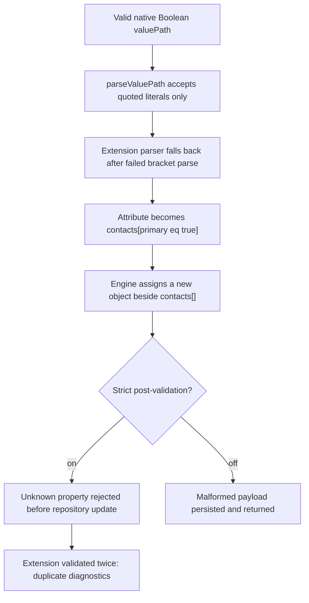
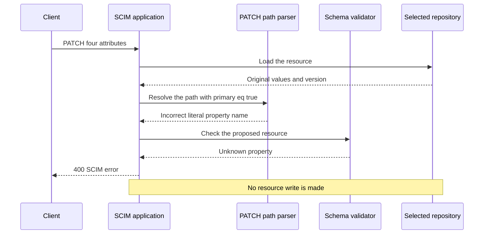
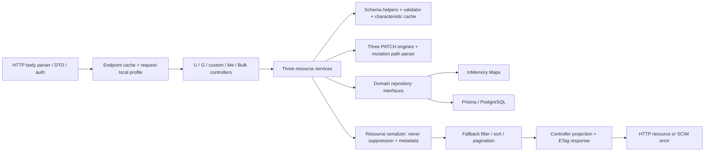
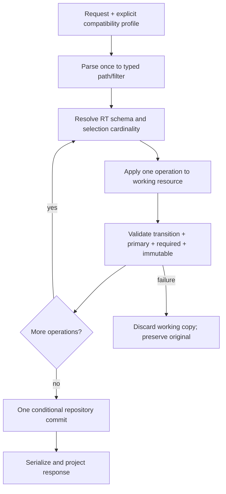
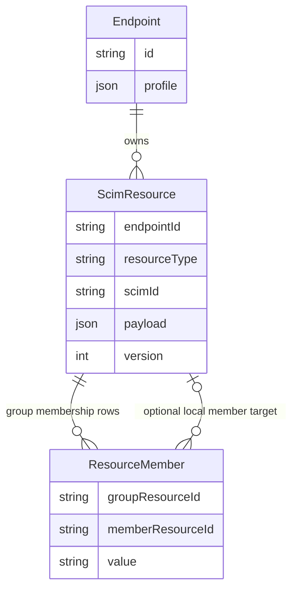
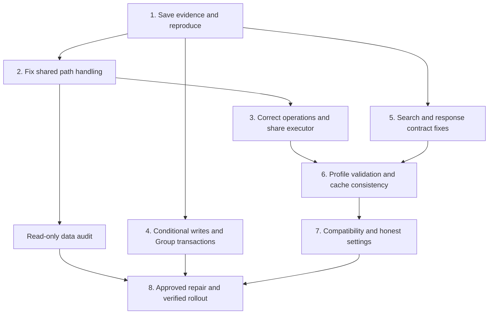

# SCIMServer: what went wrong, what we checked, and how to fix it

> **Status:** Analysis and isolated local verification only; no product fix, production migration, deployment, or live data repair
>
> **Last verified:** 2026-09-28
>
> The September 25 evidence is retained separately from the PostgreSQL follow-up.
>
> **Pinned source:** `ccde1d5d6b5129dd943c6e848989c668a0d00d7a`, product `0.55.35`
>
> **Branch:** `analysis/scim-fresh-master-20260925`
>
> The original evidence was collected on September 25 in the operator's UTC-06 time zone, crossing into September 26 UTC. That reassessment started without the earlier chat's findings or proposed design. The September 28 follow-up uses that independent evidence and the same source commit; it does not silently change the code being tested.

## 1. The short answer

**The incident is a server-side PATCH path interpretation defect, not evidence that strict validation should be disabled.** The Boolean literal in `contacts[primary eq true].value` is legal SCIM filter syntax. The mutation parser accepts only quoted comparison values. For an extension path, its failed parse falls back to treating the bracket expression as an attribute name. Strict post-validation detects the resulting unknown property. With strict validation off, that property is stored.

Retained production logs resolve the reporter's uncertainty:

* The original PATCH returned **400**, and the corresponding unchanged resource remained observable.
* After the operator disabled strict validation, the same four operations returned **200**. The three Google extension targets changed, but the actual Contoso contact did not. An additional literal `contacts[primary eq true]` object appeared.
* A read-only GET during this reassessment still returned that malformed object. No live write or repair was attempted.
* The exact four paths reproduce against pinned master using synthetic data, the current schema, the real User service, and the real InMemory repository.

There are other problems in the same request-handling code. For example, adding a value can replace an existing list, an update can change only the first matching record, and two requests can both pass a version check before either saves. Custom-resource endpoints also handle some settings and search requests differently from User and Group endpoints.

**The important distinction:** a passing test suite is not proof that every SCIM request is correct. On September 25, 974 existing unit tests and 179 existing HTTP tests passed. Three additional tests, written from the expected protocol behavior, failed: a valid Boolean PATCH returned 400, a valid User search returned 400, and a valid custom-resource search returned 500. The failures are useful evidence of defects, not a repaired product. Fifty smaller checks recorded what the production code actually did.

**My recommendation:** keep strict validation on; repair the shared path parser first; then fix how operations change a resource, how repositories save concurrent changes, and how read/search endpoints enforce settings. Move toward one shared PATCH implementation in small releases. Keep User, Group, and custom-resource storage differences explicit. Repair existing bad data separately, with a backup and approval.

### PostgreSQL follow-up: the storage difference is now tested

On September 28, we ran the same **82 cases on each backend**, including real
PostgreSQL **17.8** through Prisma. Three disposable local databases each replayed
all **22 migrations**. Neither a shared database nor a live deployment was
used.

**The reported bug is confirmed in PostgreSQL JSONB.** Strict mode rejects the
bad result before saving. With strict mode off, the server saves the extra
bracket-bearing property and leaves the actual contact unchanged.

| Storage behavior | PostgreSQL | InMemory |
|---|---|---|
| Reported Boolean PATCH defect | Reproduced | Reproduced |
| Ordinary User, Group and custom-resource CRUD examples | Passed | Passed |
| Duplicate username creation with forced overlap | Database constraint prevents the duplicate | Both users can be created |
| Group PATCH when member insertion fails | Transaction restores fields, members and version | Partial changes can remain |
| Group POST when member insertion fails | Partial Group remains | Partial Group remains |
| Two same-version writers, forced to reach the write together | Both can save | Both can save |
| Deleting an endpoint's User, Group and custom-resource records | Foreign-key cascades delete them | Records remain in the repositories even though HTTP access is blocked |
| Successful Bulk and `/Me` User updates | Match direct-route stored values | Match direct-route stored values |
| PATCH disabled in profile, requested through Bulk | Bulk still saves the change | Bulk still saves the change |

The two storage systems are **not equivalent today**. Sharing application code
does not remove the need to test database constraints, transactions, deletion
and concurrency separately.

The full run recorded **164 case executions and 771 assertions**, with no
setup failures. PostgreSQL had 28 passing cases and 54 cases that failed at
least one expected behavior. InMemory had 27 passing cases, 54 behavior-failing
cases and one not-applicable cache test. These are deliberately
defect-focused cases, not a product-wide pass percentage or 54 distinct bugs.
Read [section 10.2](#102-postgresql-and-inmemory-results-september-28) for the
test methods, counts and remaining limits.

### How to use this report

| If you need to understand... | Read |
|---|---|
| The reported failure and the surrounding requests | [Section 3](#3-read-only-incident-reconstruction) |
| Which resource types, settings, and attribute shapes were included | [Section 4](#4-what-the-review-covers) |
| The problems, their impact, and the evidence behind each one | [Section 5](#5-problems-found-and-behavior-that-already-works) |
| What the RFCs require, what Entra sends, and what remains untested | [Section 6](#6-standards-and-microsoft-entra-interpretation) |
| Why the repositories should stay separate | [Section 8](#8-where-to-share-code-and-where-to-keep-differences) |
| The order of work and how to decide that each step is finished | [Section 9](#9-recommended-step-by-step-plan) |
| Exact commands, recorded results, and limitations | [Section 10](#10-tests-results-and-limitations) |

### A few terms used below

* **ValuePath:** a SCIM path that selects entries in a list, such as `contacts[primary eq true].value`.
* **Repository:** the component that reads and saves a resource. Prisma repositories use PostgreSQL; InMemory repositories use JavaScript maps.
* **Atomic write:** either all parts of a change are saved, or none are.
* **Conditional write:** save only if the stored version still matches the version that was read. This is also called compare-and-swap.
* **Projection:** choosing which attributes to return to the client. It must not change the stored resource.
* **Characterization check:** a small executable example that records current behavior. It can confirm a bug without claiming that behavior is correct.
* **Discovery:** `/Schemas`, `/ResourceTypes`, and `/ServiceProviderConfig`, which tell clients what an endpoint supports.

## 2. Independence, identity, and evidence rules

### 2.1 Source isolation

All source, tests, Git inspection, and edits used only `SCIMServer-scim-fresh-analysis`. Initial Git status was clean; HEAD and `origin/master` both resolved to the pinned SHA above. Shell calls explicitly selected that worktree. The fetched baseline was supplied as current by the task and the local remote-tracking identity was independently checked.

The September 25 analyst did not use the prior analysis document, preserved analysis branch, other worktree source, parent transcript, or sibling results. That original run used no delegation or factory. Existing documentation and comments were checked against source and executable examples instead of being accepted as facts.

On September 28, a follow-up worker was assigned only the disposable PostgreSQL and matching InMemory tests. The main session updated this report's wording and standards checklist. This is an extension of the independent report, not a claim that the follow-up has no knowledge of its own earlier evidence.

Outside-worktree access was limited to authorized credential/tooling mechanisms and reuse of **already installed dependency directories**, expressly permitted by the task. Temporary directory junctions supplied root/API/web tooling; their targets were not modified. The source file paths in dependency stack traces therefore do not identify another source baseline.

### 2.2 Three independently identified artifacts

| Artifact | Identity and proof | What it proves |
|---|---|---|
| Source under analysis | `ccde1d5d6b5129dd943c6e848989c668a0d00d7a` | Current source and local characterization baseline |
| Incident revision | `scimserver--green-0917-1338`; image index digest `sha256:048ab5d8869819c9cd18b5ddf4d2836f9cad7619bc7cbf2cf8d968fad29062d7`; source `c10f9ea83822a50650c2b2867ceff9eeaa46c545`; version `0.55.23` | ARM revision plus [publish run 35183570046](https://github.com/pranems/SCIMServer/actions/runs/35183570046), whose log pushes that exact digest |
| Canary observed on September 25 | `scimserver--green-0925-1317`, 100% ingress traffic; image index digest `sha256:ad8594e2e2b7263e88dc4ae813436a20797cbea30b78457340fdb35dfe7eedfc`; source `bca4f6b46f584dfd3c233ec2956d610f9b7f47d3`; version `0.55.35` | ARM traffic/image state, authenticated version GET, and [publish run 36175535002](https://github.com/pranems/SCIMServer/actions/runs/36175535002) exact digest. Not a fresh September 28 deployment inspection. |

Both deployed source SHAs were verified ancestors of pinned master. OCI manifests/configs independently supplied platform digests and creation times. OCI labels and the live version response did **not** supply a commit SHA; the run-log digest match, not the semver or image creation time alone, supplied the source mapping.

The estate was resolved from [scim-estates.json](../scripts/scim-estates.json) by purpose `canary-prod`, using its isolated authorized credential mechanism. The reported host matched the ARM-derived host. No customer-production call was made. The incident revision was still retained and active, but at zero public traffic; retention is not evidence that it handles current requests.

[Machine-readable provenance](evidence/scim-fresh-20260925/provenance.json) records these distinctions. A source finding is not live mutation proof. Current live evidence here proves **readback of retained state**, not replay on the current image.

### 2.3 What each kind of evidence proves

| Evidence | What it proves | What it does not prove |
|---|---|---|
| Retained live logs and read-only GETs | What the deployed system received, returned, and still stored when read | An unrecorded request order or a complete historical profile |
| Local HTTP test (`H1` to `H3`) | A request went through the real application and returned the recorded response | Behavior on a different backend or deployment |
| Production-code check (`P01` to `P50`) | The named production function, service, or repository produced the recorded result | Every possible path through HTTP or every setting combination |
| Source review | How the implementation is wired, including database predicates and cache invalidation | That an unexecuted race or failure happened during a real request |
| Existing tests | The assertions in those selected tests passed | Complete RFC compliance |
| Not tested or unavailable | A clearly identified gap | Nothing is counted as verified simply because it appears in a matrix |

The evidence IDs are stable references into the JSON files. You do not need to
memorize them to understand the findings.

Severity is impact-oriented: **High** means wrong persisted state, violated invariants, or lost-update risk; **Medium** means valid requests rejected, capability/contract drift, or incomplete validation; **Low** means misleading diagnostics or operational metadata without demonstrated resource corruption. Confidence describes the specific evidence, not every possible configuration.

## 3. Read-only incident reconstruction

### 3.1 Scope and timeline

Target endpoint: `64b5f7bb-f4f7-4ec6-872b-352ecd498890`. Target User: `6cbe932c-3bfc-417e-9734-e02b35c49657`.

The first persistent-log query was endpoint-scoped, **22:10-23:10 UTC on September 24**, page size 100: **65 rows**, no pagination omission. A bounded surrounding-error query for the same endpoint, **21:00-23:10 UTC**, returned **two** errors: the reported SCIM PATCH and an earlier admin endpoint PATCH. It did not become an estate-wide log search.

| UTC time / log ID | Retained observation | Interpretation and limit |
|---|---|---|
| 21:03:41.929 / `7282fa8e-66cc-4805-baf1-734fe208516f` | Admin endpoint PATCH 400; request and response retrieved untruncated in follow-up | Submitted `Group.displayName.uniqueness:none` rejected against the product's `server` baseline; separate profile-policy error, not the later valuePath defect |
| 22:15:42.630 / `ead85761-fdea-42ca-96f7-38ef75b7cb18` | Admin endpoint PATCH 200; body and response contain truncation markers | Full at-time profile cannot be reconstructed from this row |
| 22:17:43.055 / `7f848ec2-c242-4643-a9c3-1e56ed7b6379` | Admin PATCH sets `VerbosePatchSupported:true` | This flag was already enabled before the incident; toggling it is not the Boolean-filter solution |
| 22:19:45.547 / `0ad11c5e-59c9-4ad5-a909-1bd66d39ad2f` | User POST 201; Google and Contoso targets carry the original value | Resource metadata creation time is 22:19:44.730 |
| 22:21:30.556 / `e0d83dad-362d-49d2-846d-64200ee7967c` | Four-operation PATCH 400, `invalidSyntax`, duplicated unknown-property paths | Matches supplied requestId `10a5d17a-c218-43df-958a-c6a5cc854e1c` and incident evidence |
| Same log timestamp / `1d68ae8f-13df-463b-b206-5b46b20a4b3f` | GET 200 returns original values and unmodified metadata | Does not prove GET happened after PATCH; equal buffered timestamps do not establish order |
| 22:28:20.301 / `ef40dbe6-ec0c-4bd9-83d8-33edf68af5c3` | Admin PATCH sets `StrictSchemaValidation:false` | Retained change, not an inferred workaround |
| 22:28:32.819 / `3a851554-41ac-4478-bf75-3bdbe5e1889a` | GET 200 still carries original values | Again, tied timestamp is not post-PATCH ordering evidence |
| Same log timestamp / `ddc478b1-280a-4adf-aa4a-4ef7276de0d0` | Same four-operation PATCH 200; Google targets updated; actual contact old; new literal bracket key | **Both unchanged intended target and malformed output**, not one or the other |
| 22:31:33.374 / `8b647a18-9708-42a4-b927-fd7bff4da79a` | Admin PATCH restores `StrictSchemaValidation:true` | Current endpoint `updatedAt` is 22:31:32.426 |
| Reassessment read | Current GET still has old actual contact plus malformed bracket-key object | Persistence, not just a transient response formatting error |

At the September 25 read, the settings were `PrimaryEnforcement:reject`,
`VerbosePatchSupported:true`, and `StrictSchemaValidation:true`. The schema
defined `contacts` as a multi-valued **complex** attribute with Boolean
`primary` and string `value`. `ScalarMVUser` is only the extension's name;
the contact itself is an object in a list, not a primitive string in a list.

The Google schema read at that time defined one complex `primaryOrganization`
and a list of complex `additionalOrganizations`; `location` and `symbol`
were strings. These are legal one-level shapes. The complete accepted schema
at the incident instant is still unavailable because historical profile bodies
were truncated. The later schema, retained resource shapes, and matching local
failure provide strong evidence without inventing a historical snapshot.

Only structural fields and arbitrary private-value labels are retained in [incident evidence](evidence/scim-fresh-20260925/incident.json). No original private contact values, scalar hashes, Authorization values, credential envelopes, or full raw logs are included.

**Preceding admin error closed:** the follow-up GET of the exact earlier log returned HTTP 200 with the matching log object; neither stored body was truncated. Its retained PATCH response has string status `400`, no `scimType`, and a human-readable tighten-only rejection. The request included a profile with `Group.displayName.uniqueness:none`; the error names `server` as the comparison baseline. [Earlier admin-error evidence](evidence/scim-fresh-20260925/earlier-admin-error.json) records the response, structural request excerpt, duration **83 ms**, and requestId `d6227c03-1386-4533-9094-b8eab4d66604`.

This is **high-confidence product profile-policy enforcement**, not a SCIM resource PATCH parse error. The [Group schema baseline](../api/src/modules/scim/discovery/scim-schemas.constants.ts#L439), [baseline map](../api/src/modules/scim/endpoint-profile/rfc-baseline.ts#L60), and [tighten-only comparison](../api/src/modules/scim/endpoint-profile/tighten-only-validator.ts#L127) explain it. The validator, baseline-map module, and profile-validation orchestrator are unchanged between incident source `c10f9ea8` and pinned master. The policy comparison occurs before profile persistence; it is not governed by the resource-payload `StrictSchemaValidation` flag. Crucially, `server` in that error is the **product baseline**, not proof of the previously stored endpoint profile and not an RFC requirement that all Group names be unique. The rejected submitted profile does not fill the missing accepted at-time profile snapshot. No broader live query, write, or repair was needed for this classification.

### 3.2 Causal chain



Source chain:

1. [parseValuePath / parseExtensionPath](../api/src/modules/scim/utils/scim-patch-path.ts#L162) recognizes only `"..."` comparison values. Native Boolean, number, null, presence, compound expressions, escaped strings, and some legal attribute spellings are not represented by this mutation grammar.
2. `parseExtensionPath` deliberately falls through to a flat/dotted interpretation after a failed valuePath parse.
3. [UserPatchEngine](../api/src/domain/patch/user-patch-engine.ts#L245) calls the extension updater, which assigns a literal bracket-containing parent.
4. [User service](../api/src/modules/scim/services/endpoint-scim-users.service.ts#L480) validates operation values first, runs all operations, validates the resulting touched payload, then writes.
5. [SchemaValidator.validate](../api/src/domain/validation/schema-validator.ts#L144) validates each extension during payload iteration and again in a second extension loop. That explains the duplicated error, without requiring duplicate operations.

**The strict failure is protecting storage from a shape the engine manufactured.** The proper result for the supplied valid request and matching contact is successful mutation of `contacts[0].value`, not merely changing `invalidSyntax` into a different error code.

### 3.3 A small example of the mistake

This example uses synthetic values. It explains the bug without exposing the
reported user's profile.

Before the request, the extension contains:

```json
{
  "contacts": [
    {
      "primary": true,
      "value": "old"
    },
    {
      "primary": false,
      "value": "other"
    }
  ]
}
```

The client asks to update only the primary contact:

```json
{
  "schemas": [
    "urn:ietf:params:scim:api:messages:2.0:PatchOp"
  ],
  "Operations": [
    {
      "op": "replace",
      "path": "urn:example:extension:2.0:User:contacts[primary eq true].value",
      "value": "new"
    }
  ]
}
```

| Expected change | Observed change with strict validation off |
|---|---|
| The first contact's `value` becomes `"new"` | Its `value` stays `"old"` |
| The second contact is untouched | The second contact is untouched |
| The extension still has one attribute, `contacts` | The extension also has a property literally named `contacts[primary eq true]` |
| A later GET shows the intended updated value | A later GET shows the old contact and the extra property |

The difference is not cosmetic. The extra property is stored in place of the
intended update. Hiding it from a response would not repair the contact.

### 3.4 Where strict validation helps

The diagram shows the reported strict-mode flow. The same validation and
mutation code runs before either storage implementation receives a write.



This is why the remedy is to fix path handling, not to remove schema
validation. A correct parser allows the legitimate update; strict validation
continues to reject genuinely unknown data.

## 4. What the review covers

### 4.1 Flow and architecture inventory

The review includes Users, Groups, and custom ResourceTypes. References
identify the relevant source; they do not mean that every combination has
been exercised. The original September 25 checks are summarized here; the
dated storage comparison in section 10 records the later database tests.

| Scope | Source owner and traced behavior | Evidence / unresolved boundary |
|---|---|---|
| Endpoint POST | [EndpointService](../api/src/modules/endpoint/services/endpoint.service.ts#L371): expand a preset or supplied profile, validate it, check name uniqueness, save and cache it | Source and profile HTTP tests; creation defaults to `entra-id`, while root discovery uses `rfc-standard` |
| Endpoint GET/list/by-name | Read cached endpoint by ID/name; query the database on a cache miss | Source and existing tests; two-process freshness was not tested on September 25 |
| Endpoint PATCH | Merge settings by key; replace schema/resource-type/authentication collections; validate before saving | Source and existing tests; checking If-Match separately from the database update leaves a race |
| Endpoint DELETE/stats | PostgreSQL cascades dependent rows; the InMemory path removes the cached endpoint | Source review found different cleanup behavior; see the later storage tests |
| Profiles/presets | [Expansion](../api/src/modules/scim/endpoint-profile/auto-expand.service.ts), [tightening](../api/src/modules/scim/endpoint-profile/tighten-only-validator.ts), [validation](../api/src/modules/scim/endpoint-profile/endpoint-profile.service.ts) | All six presets are inventoried. Check P26 shows that an invalid custom attribute type can be registered |
| User POST/PUT | [User service](../api/src/modules/scim/services/endpoint-scim-users.service.ts): validate input, extract database columns, check uniqueness, save, build response | Executed checks reveal readOnly ordering and omitted immutable-value problems |
| Group POST | [Group service](../api/src/modules/scim/services/endpoint-scim-groups.service.ts#L86): create Group, then resolve and insert members | Source shows two separate writes rather than one transaction |
| Group PUT/PATCH | Update fields and replace member rows through one repository method | Existing tests and source; PostgreSQL uses a transaction, but the version check happens before it |
| Custom POST/PUT | [Generic service](../api/src/modules/scim/services/endpoint-scim-generic.service.ts): resolve dynamic schemas and run its own validation pipeline | Source and executed checks; duplicates much of the User/Group pipeline |
| All resource PATCH | [Three engines](../api/src/domain/patch/index.ts), shared path helpers, before/after validation | Recorded checks P01-P18, P23-P35, P39-P44 and P50 show inconsistent behavior |
| All resource GET-by-id | Load the scoped record, build the resource, remove hidden/internal fields, apply requested projection | Live reads and local checks. Custom resources retain stored location metadata |
| List/filter | [Filter parser](../api/src/modules/scim/filters/scim-filter-parser.ts), [database filter builder](../api/src/modules/scim/filters/apply-scim-filter.ts), optional in-process filter | Check P36: removing hidden values before evaluating a filter loses otherwise valid matches |
| POST `.search` | User/Group [SearchRequestDto](../api/src/modules/scim/dto/search-request.dto.ts); separate custom-resource body handling | HTTP tests H2/H3: valid arrays of requested attributes cause 400 or 500 |
| Sorting/pagination | User/Group [fixed column mapping](../api/src/modules/scim/common/scim-sort.util.ts); custom-resource string comparison | Existing tests and P37/P38; numeric custom values can sort incorrectly |
| All resource DELETE | Delete permission, If-Match check, repository deletion | Source and tests; custom resources inherit the User-named policy; no production resource was deleted |
| Bulk | [Controller](../api/src/modules/scim/controllers/endpoint-scim-bulk.controller.ts), [processor](../api/src/modules/scim/services/bulk-processor.service.ts): limits, operation dispatch, prior bulkId references, error threshold | Existing HTTP tests; custom types are unsupported; forward/cyclic dependencies are not fully verified |
| `/Me` | [Controller](../api/src/modules/scim/controllers/scim-me.controller.ts): resolve OAuth subject to User and delegate | Existing tests and source; authentication design is not re-certified by this analysis |
| Discovery | [Profile-based discovery](../api/src/modules/scim/discovery/scim-discovery.service.ts) and [endpoint controller](../api/src/modules/scim/controllers/endpoint-scim-discovery.controller.ts) | Existing tests and source; check both what is advertised and what is allowed |
| Projection | [Projection utility](../api/src/modules/scim/common/scim-attribute-projection.ts) and service-level hidden-field removal | Existing tests passed; hardcoded always-returned fields still need a complete profile-override matrix |
| Auth boundary | [SharedSecretGuard](../api/src/modules/auth/shared-secret.guard.ts): ordered authenticators and endpoint isolation | Source plus the incident's successful authentication record; not a cryptographic or exploit audit |
| Errors/diagnostics | [createScimError](../api/src/modules/scim/common/scim-errors.ts), [SCIM exception filter](../api/src/modules/scim/filters/scim-exception.filter.ts) | Actual responses show repeated attribute paths and an array-valued error detail |
| Logging | [LoggingService](../api/src/modules/logging/logging.service.ts), [body capture](../api/src/modules/logging/request-body-capture.ts) | Retained logs and source; current master always redacts secrets; older truncated bodies limit reconstruction |
| Persistence | [Repository module](../api/src/infrastructure/repositories/repository.module.ts), interfaces, [Prisma schema](../api/prisma/schema.prisma) | September 25: InMemory executed, PostgreSQL source reviewed. September 28 results are recorded separately below |
| Browser/admin UI | Setting-to-UI coverage tests; no browser interaction in this analysis | Visual layout is not verified; no UI changes are included |



The placement of fallback filtering **after** serialization is intentional in this diagram: it is the observed source order and a correctness issue, not the recommended design.

### 4.2 Every registered endpoint setting

There are **37 controls: 20 booleans, 14 numerics, 3 other typed controls**. Every key, declared default, effective fallback, runtime owner, affected flows, coupling, bounds, production reference, and test reference is recorded in [JSON](evidence/scim-fresh-20260925/settings-inventory.json) and [CSV](evidence/scim-fresh-20260925/settings-inventory.csv).

The inventory locates names in source and test files; that alone does not
prove each path was executed. Tests for the settings registry and its UI
controls were run. The corrected inventory contains 176 production references
and 432 test references. Its classifier and correction history are retained
in the [reproduction evidence](evidence/scim-fresh-20260925/repro-validation.json).

There are three main ways effective values are resolved:

* **Ordinary setting:** use the endpoint's explicit value, otherwise the
  registry default. A preset may supply an explicit value different from the
  default.
* **Authentication method:** a matching method declaration in
  `profile.authentication.methods` controls enablement; otherwise use the
  dedicated setting and its default. These are not simply ANDed together.
* **JWKS limit:** use the endpoint override, then the server environment value,
  then the hard default, with the bounds in
  [egress-policy.ts](../api/src/oauth/egress-policy.ts#L114). JWKS means the JSON
  Web Key Set used to verify tokens; these limits do not control resource or
  schema caching.

The table states exceptions explicitly. No compatibility setting should turn
an invalid filtered path into a stored property name.

| Key | Unset/default and precedence | Owner, applicable flows, discovery/config coupling |
|---|---|---|
| `PatchOpAllowRemoveAllMembers` | false; ordinary setting | Restricts bare removal of all Group members. Bulk reaches the same Group policy |
| `VerbosePatchSupported` | false; ordinary setting | Controls User core dotted paths. Extensions and custom resources use different branches; disabling it can conflict with RFC path behavior |
| `logLevel` | Inherit unless overridden | Per-endpoint logging threshold above category/global settings; does not change resource data |
| `StrictSchemaValidation` | true; ordinary setting | Schema/value checks in User, Group and custom-resource writes; not a path-syntax switch |
| `RequireIfMatch` | false; ordinary setting | Conditional-write policy. User/Group honor ETag-disabled profiles; the custom-resource call omits that profile argument |
| `AllowAndCoerceBooleanStrings` | true; ordinary setting | Converts supported string Boolean values. Output conversion is unconditional in serializers; it does not fix the Boolean path parser |
| `SecretTokenBearerAuthEnabled` | false; authentication method resolution | Endpoint bearer credentials and resource authentication |
| `OAuthClientCredentialsAuthEnabled` | false; authentication method resolution | OAuth client credentials, tokens and advertised authentication schemes |
| `SharedSecretBearerAuthEnabled` | true; authentication method resolution | Global shared-secret acceptance on resource requests; admin authorization is separate |
| `IncludeWarningAboutIgnoredReadOnlyAttribute` | false; ordinary setting | Warning information on write responses. Complete `/Me` and Bulk warning consistency is not established |
| `IgnoreReadOnlyAttributesInPatch` | false; ordinary setting | Ignore rather than reject readOnly PATCH operations. Strict-off already ignores them |
| `UserSoftDeleteEnabled` | true; ordinary setting | User and custom-resource deactivation policy; can also block unrelated edits to an inactive resource |
| `UserHardDeleteEnabled` | true; ordinary setting | User and custom-resource DELETE, including User aliases and Bulk |
| `GroupHardDeleteEnabled` | true; ordinary setting | Group DELETE, including Bulk |
| `MultiMemberPatchOpForGroupEnabled` | true; ordinary setting | Multiple members in a Group PATCH operation; not a general rule for all list attributes |
| `SchemaDiscoveryEnabled` | true; ordinary setting | Endpoint discovery reads; does not itself disable resource writes |
| `logFileEnabled` | true; ordinary setting | Per-endpoint file logging |
| `PrimaryEnforcement` | Registry unset; runtime `passthrough` | `reject`, `normalize` or `passthrough` on the final payload. None replaces the required operation-by-operation primary handoff |
| `WifCredentialsEnabled` | false; authentication method resolution | Workload identity federation credentials/trusts, token flow and authentication discovery |
| `CredentialSecretVisibility` | Effective `always` | Current helper always resolves to `always`; new `once` values are rejected. Some comments still describe older behavior |
| `EnforceResourceTypes` | true; ordinary setting | Can relax unsupported User/Group list/search to an empty result with a warning; item reads and writes still reject |
| `JwksFetchTimeoutMs` | 5000 ms; JWKS limit | Timeout for one key-fetch attempt |
| `JwksFetchRetries` | 2; JWKS limit | Number of key-fetch retries |
| `JwksFetchRetryBackoffMs` | 200 ms; JWKS limit | Delay between retries |
| `JwksCacheMaxAgeMs` | 86400000 ms; JWKS limit | Key-set freshness, not profile-cache freshness |
| `JwksTotalDeadlineMs` | 10000 ms; JWKS limit | Time limit for the full key-fetch operation |
| `JwksMaxResponseBytes` | 1048576 bytes; JWKS limit | Maximum key-response size |
| `JwksMaxKeys` | 100; JWKS limit | Maximum number of keys in a response |
| `MaxActiveBearerCredentials` | 5, numeric owner fallback | Credential create/reactivation capacity, not resource mutation |
| `MaxActiveOAuthClientCredentials` | 5, numeric owner fallback | OAuth credential capacity |
| `MaxActiveWifTrusts` | 10, numeric owner fallback | WIF trust capacity |
| `JwksMaxCacheEntries` | 50; JWKS limit | Maximum cached key sets |
| `JwksRefreshIntervalMs` | 3600000 ms; JWKS limit | Background key refresh interval |
| `JwksUnknownKidMinIntervalMs` | 300000 ms; JWKS limit | Minimum interval between refreshes for unknown key IDs |
| `JwksStaleIfErrorMs` | 172800000 ms; JWKS limit | Maximum stale-key age when a fetch fails |
| `PersistRequestSecrets` | Registry unset; runtime always redacts | Description still suggests optional secret retention, but current logging does not permit that bypass. Keep redaction |
| `RfcCompliantSubAttributes` | false; ordinary setting | Restricts nested complex values independently of strict mode; does not validate every schema-definition rule |

ServiceProviderConfig has additional controls: `patch.supported`,
`bulk.supported/maxOperations/maxPayloadSize`, `filter.supported/maxResults`,
`sort.supported`, `etag.supported`, and `changePassword.supported`. They are
included in this review but are not part of the 37-setting count. Profile
expansion defaults PATCH/filter on and Bulk/sort/ETag off; setting
changePassword true is rejected as unimplemented. Profiles can override
supported defaults. Authentication settings affect the advertised
authentication schemes; logging settings do not.

### 4.3 Attribute shapes and characteristics

The [shape inventory](evidence/scim-fresh-20260925/attribute-shapes.json) has
48 entries. It includes the eight SCIM types, one value versus a list of
values, and attributes inside single-valued or multi-valued complex parents.
It includes prohibited shapes as negative test cases, not as supported
features.

The same shapes can appear in a core schema or an extension, on a User, Group,
or custom resource. That gives 288 placements before adding operations and
characteristic combinations. **This is a coverage checklist, not a claim that
288 full workflows passed.**

| Shape | RFC interpretation | Evidence |
|---|---|---|
| Top-level string, Boolean, integer, decimal, dateTime, binary, reference | Each may be single or multi-valued; multi-valued simple means a JSON array of the simple type | P47: 14 valid representatives; P07/P08/P40 primitive arrays already work in tested paths |
| Top-level complex | Object or array of objects; named sub-attributes | P47: two valid representatives; incident exercises both cardinalities |
| Simple sub-attribute | Supported under either complex parent cardinality | Validator recursion and existing shape tests |
| Multi-valued simple sub-attribute | Must not be confused with nested complex; verified erratum 5607 corrects the schema's `referenceTypes` cardinality | Existing `rfc-compliant-subattributes` suite; not all mutation paths exercised |
| Complex sub-attribute | RFC 7643 §2.3.8 forbids; verified erratum 8415 corrects the schema example | Product can allow under flag false; classify as explicit extension, not RFC conformance |
| Nested raw array, wrong primitive type, missing/unknown type definition | Different failure classes; a registered schema must be validated separately from data | P19-P26 show permissive holes; invalid calendar date, binary/reference format, unknown schema type |

| Characteristic | Required semantics or deliberate policy | Observed implementation and risk |
|---|---|---|
| `type` | Values must match the declared SCIM type; array elements must match the type individually | Sixteen valid top-level representatives were checked. Bad date, reference, binary, and unknown-schema-type cases expose gaps |
| `required` | Enforce effective schema on resulting writable state; do not confuse omitted PATCH attribute with explicit removal | Create/PUT required checks exist; P29 removes a required custom attribute; P48 accepts absent RT-required extension |
| `multiValued` | Array cardinality and element type; selected element/sub-attribute differs from whole array | P09 wrongly validates selected complex entry as whole array; primitive arrays are not categorically broken |
| `caseExact` | String comparison characteristic; structural attribute names are case-insensitive | Filter cache loses namespace, U PATCH omits caseExact config, extension helpers contain direct case-sensitive property access |
| `mutability` | readWrite, readOnly, immutable, writeOnly have different roles | Strict POST readOnly rejected before strip, P41; immutable remove/PUT omission/second assignment escape, P33/P34/P42 |
| `returned` | always/default/never/request; projection must not change internal query operands | Never suppression works for tested output paths; P36 filters on already-hidden data and returns zero; hardcoded always fields need profile audit |
| `uniqueness` | none/server/global; enforce supported declarations, or reject unsupported promises | User column uniqueness is DB-backed; G displayName is service-only; custom scalar subset scanned; P49 shows skipped declarations |
| `canonicalValues` | Recommended values may be restricted by provider; not automatically an RFC violation to reject outside values | Current strict validator restricts case-insensitively even with caseExact=true, P22; policy must be stated |
| `referenceTypes` | Reference type/URI and representation constraints; metadata alone does not prove enforcement | P21 accepts non-URI string; Group member resolution checks local User IDs only and permits unresolved references |
| `primary` | At most one true; PATCH setting true must automatically clear others | Final-payload reject/normalize/passthrough is not sequential semantics, P12/P35 |
| ResourceType extension `required` | A resource type can require an extension in addition to an attribute being required inside that extension | Check P48 accepts a missing required extension. Test this separately from required field removal |

These checks must use the endpoint's **effective** schema. For example, a
published `uniqueness:server` must not be tested as though it said `none`.
When a characteristic is legitimately omitted, use the RFC default:
`required:false`, `caseExact:false`, `mutability:readWrite`,
`returned:default`, `uniqueness:none`, no suggested canonical values, and the
applicable default type. Schema definitions also need their own validation:
defaults for processing a resource do not excuse malformed discovery
definitions. `primary` is a conventional sub-attribute, not a separate schema
characteristic.

### 4.4 Risk-based combination ledger

These combinations deliberately bound the next conformance corpus. They are not all claimed executed.

| Combination family | Finite cases | This run |
|---|---|---|
| Strict x Boolean coercion | 2 x 2; native versus quoted Boolean; body versus path literal | Native path strict/lenient proved; complete four-way body matrix T, not independently reenumerated |
| Strict x IgnoreReadOnly | 2 x 2; root, extension, complex child; add/replace/remove | Code/T; strict POST and immutable transitions P; remaining cross-products U |
| Primary policy | 3 modes x existing/absent primary x scalar/filtered/no-path write | reject handoff P; all normalize ordering combinations U |
| ValuePath selection | 0/1/many matches x add/replace/remove x core/extension/custom | One/many and unsupported literals P; unmatched add remains a separately classified compatibility choice |
| Typed filter grammar | string/Boolean/number/null/presence, AND/OR/NOT, escapes, whitespace | Mutation string/Boolean/compound P; full read AST T; complete grammar differential U |
| Required/immutable | unset/set x omitted/null/remove/replace x one/two operations | P29/P33/P34/P42/P48; parent-removal and all MV identity choices U |
| ETag | supported on/off x require on/off x absent/current/stale/wildcard x same-version concurrency | existing HTTP T, P30/P39; actual PostgreSQL race U |
| Group membership | single/multiple member x allow-multiple x bare-remove policy x U/G/external member | Existing HTTP T, source relational audit; nested-group referential integrity and rollback fault injection U |
| Shape validation | 8 types x 2 cardinalities | 16 representative validator successes, not 16 full CRUD proofs |
| Profile change/cache | one/two instances x schema/settings/auth change x warmed/cold reader | Same-instance source/T; cross-process U |
| Output/query coupling | default/request/never/always x GET/list/search/write x projection | Projection T, hidden filter P36, search arrays H2/H3; entire cross-product U |
| Persistence | InMemory/PostgreSQL x duplicate create/concurrent write/member update/endpoint delete | InMemory P; PostgreSQL S only |

These rows describe the original September 25 run. The follow-up does not
claim every combination has been tested merely because the same cases now
run on two backends. It adds a named result for each case actually executed.

## 5. Problems found and behavior that already works

All findings below remain **open in product code**. This reassessment did not implement fixes.

### 5.1 The problems in everyday terms

| Finding | What a client or operator can see | Why it matters | Recommended change |
|---|---|---|---|
| F01: invalid interpretation of a valid path | A PATCH fails, does nothing, or writes a property containing the filter text | Provisioning can report success without changing the intended value | Use one parser and never fall back to a literal property after recognizing a filter |
| F02: only part of the selection changes | Two entries match, but only the first changes; a non-equality filter can act like equality | The server changes the wrong entries or leaves part of the request unapplied | Use the shared filter evaluator and update every selected entry |
| F03: adding a value loses existing values | An `add` to a list can replace the list | A client can accidentally delete existing attributes | Append for multi-valued attributes; test explicit-path and no-path requests separately |
| F04: required fields and selected-object validation disagree | A selected object is rejected as not-an-array, while a required custom field can be removed | Valid requests fail and invalid resource states can be saved | Validate the target actually selected, including required fields and required extensions |
| F05: immutable fields can change | An immutable value can be removed, omitted on replacement, or set twice in one PATCH | The published schema does not protect the identity data it claims to protect | Check each operation against the working state at that point |
| F06: choosing a new primary value fails | Setting the new primary can reject the request or leave the wrong entry primary | Contact, email, or address preferences become wrong | Clear the old primary as soon as an operation sets the new one |
| F07: version and uniqueness races | Two writers with the same version can both save | One request can overwrite another despite If-Match | Include expected version in the database write; enforce uniqueness in the storage boundary |
| F08: endpoint cache and deletion differences | Cached profiles can outlive a change; InMemory cleanup differs from database cascades | Different processes or backends can enforce different endpoint state | Version cache entries and define complete endpoint cleanup for both backends |
| F09: valid search bodies fail | `attributes: ["userName"]` is rejected; a custom-resource search can return 500 | Standards-compliant search clients cannot use the endpoint reliably | Separate JSON search arrays from comma-separated URL parameters |
| F10: advertised settings are not consistently enforced | A custom-resource operation can run even when its capability is off | Operators cannot trust discovery or the settings page | Put capability checks in a shared application boundary, including Bulk |
| F11: filtering and sorting use the wrong view of data | Hiding an attribute changes filter matches; numbers can sort as text | Searches miss resources or return them in the wrong order | Filter internal data, sort using schema types, then hide response fields |
| F12: schema and scalar validation gaps | An unknown declared type or badly formatted scalar can pass | Discovery can advertise constraints that the server does not enforce | Validate schema definitions at registration, then validate values against them |
| F13: readOnly values are checked before being ignored | POST or PUT rejects a readOnly value instead of ignoring it | Otherwise valid client requests fail | Apply the operation-specific readOnly rule before validating writable input |
| F14: deactivation policy checks the wrong thing | An unrelated edit to an already inactive resource can fail | A lifecycle switch unexpectedly blocks routine updates | Check the requested active-state transition, not just the final Boolean |
| F15: Group creation spans separate writes | A Group can be saved before its member insertion fails | The client sees failure but a partial resource remains | Create the Group and members as one transaction |
| F16: diagnostics and control descriptions mislead | Repeated errors, short-lived log links, and settings with stale descriptions | Troubleshooting points the operator to the wrong fix | Return one clear error, durable correlation, and accurate setting descriptions |
| F17: error detail is not a string | A validation error returns an array in `detail` | Clients expecting the SCIM error shape may fail to display it | Keep `detail` readable text and place field-level lists in diagnostics |

The technical table below retains the exact code references and September 25
evidence. **High** means potential data loss, wrong stored state, or an
important invariant not being enforced. **Medium** means a request or public
contract behaves incorrectly. Evidence not exercised against a database is
explicitly identified; the PostgreSQL follow-up adds proof for the cases it
actually ran.

### 5.2 Technical evidence register

For readers tracing the original receipts: **L** means retained live evidence,
**H** an HTTP test, **P** a direct production-code check, **S** source review,
**T** an existing test, and **U** not exercised. The table records the original
evidence level. New storage-level checks are reported separately with their
date and backend; they do not retroactively turn a source review into a test.

| ID | Severity / confidence / evidence | Finding, source, and precise boundary |
|---|---|---|
| F01 | High / high / L H P S | **Legal paths become literal properties or successful no-ops.** P01-P03/P16/P50 and H1. Mutation regex differs from read AST; native Boolean extension fallback is the incident. [Path parser](../api/src/modules/scim/utils/scim-patch-path.ts#L162), [generic path split](../api/src/domain/patch/generic-patch-engine.ts#L236). |
| F02 | High / high / P S | **Selection semantics are incomplete.** `findIndex` updates/removes one selected sub-attribute when all matching entries must change; `ne/co/sw/...` parse but matcher falls back to equality. P04/P05. [Selection helper](../api/src/modules/scim/utils/scim-patch-path.ts#L280). |
| F03 | High / high / P S | **`add` can discard existing multi-valued data.** U core and no-path add replace arrays; C explicit core add concatenates, while its no-path assignment does not. Group add of a non-member scalar is rejected. P06/P15/P17/P18/P40. These are different semantics behind one protocol operation. |
| F04 | High / high / P S | **Post-state invariants and selected-value validation disagree.** P09 rejects a valid selected complex object as not-an-array; P29 removes a required custom value; P48 accepts omission of an RT-required extension. [Validator](../api/src/domain/validation/schema-validator.ts#L1164), [post-validation](../api/src/modules/scim/common/scim-service-helpers.ts#L1061). |
| F05 | High / high / P S | **Immutable handling is not a transition check.** P33 remove succeeds; P42 PUT omission loses immutable value; P34 unset -> first -> second is accepted in one PATCH. The comparator treats incoming undefined as untouched even when persistence removes it, and compares initial to final rather than each transition. [checkImmutable](../api/src/domain/validation/schema-validator.ts#L826). |
| F06 | High / high / P S | **Primary handoff is wrong.** P35 valid handoff returns 400 under reject. Normalize keeps the first true, potentially the old selection; passthrough retains multiple true. RFC 7644 §3.5.2 requires automatic clearing during the operation, independently of a final validation policy. [Primary helper](../api/src/modules/scim/common/scim-service-helpers.ts#L1389). |
| F07 | High / high / P S | **Version checks and some uniqueness checks are not atomic.** P30 both same-version writes succeed and advance v1 -> v2/v3; P31 duplicate InMemory userName creates both succeed. [Prisma U update](../api/src/infrastructure/repositories/prisma/prisma-user.repository.ts#L115) predicates only by id. G transactions also omit expectedVersion. DB-backed User uniqueness is stronger than InMemory; G/custom service-only uniqueness still races. PostgreSQL race not executed. |
| F08 | High / high source, runtime U / S | **Endpoint cache and deletion semantics are not cross-backend equivalent.** Cache hits have no TTL/version check or cross-process invalidation. A second warmed process can indefinitely retain changed/removed profile settings. InMemory endpoint delete removes cache, not U/G/C/credential repositories; PostgreSQL cascades resources/credentials. [EndpointService](../api/src/modules/endpoint/services/endpoint.service.ts#L504). |
| F09 | Medium / high / H P S | **POST `.search` has the wrong public representation.** RFC arrays for `attributes` are rejected by U DTO (H2 400); C forwards the array to `.split` (H3 500). `excludedAttributes` follows the same string contract. [DTO](../api/src/modules/scim/dto/search-request.dto.ts), [C controller](../api/src/modules/scim/controllers/endpoint-scim-generic.controller.ts#L215). |
| F10 | Medium / high / P S | **Custom capability behavior contradicts profile metadata.** C controller omits PATCH/filter/sort capability guards; P45 filters despite advertised false. C ignores profile filter maxResults, P37; C enforceIfMatch omits profile and requires a header even when ETag is off, P39. Bulk only supports U/G and bypasses their controller-only patch gate. [C service](../api/src/modules/scim/services/endpoint-scim-generic.service.ts#L285), [Bulk dispatch](../api/src/modules/scim/services/bulk-processor.service.ts#L169). |
| F11 | Medium / high / P S | **Read results depend on serialization and insufficient sort metadata.** P36 hidden query operand disappears before filtering. P38 numeric custom values sort `[10,2]`. U/G unsupported sort paths silently map to creation time; schema caseExact is not supplied to sort resolvers. [List source](../api/src/modules/scim/services/endpoint-scim-users.service.ts#L211), [sort utility](../api/src/modules/scim/common/scim-sort.util.ts). |
| F12 | Medium / high / P S | **Profile registration and scalar validation can promise unenforced constraints.** Unknown type `typo` passes expansion and is skipped by validator (P26); calendar-invalid dateTime, malformed binary/reference pass string/regex checks (P19-P21); non-object extension block ignored (P24). P49 shows uniqueness collector omits MV/child/global and promoted-name extension declarations. [Profile validation](../api/src/modules/scim/endpoint-profile/endpoint-profile.service.ts), [type checks](../api/src/domain/validation/schema-validator.ts#L427). |
| F13 | Medium / high / P S | **readOnly ordering rejects input that should be ignored.** Strict U/G/C POST/PUT validation runs before the stripping helper; P41 proves strict POST rejection. Server-generated id handling and readOnly PATCH rejection/compatibility stripping are separate concerns and should not be changed indiscriminately. |
| F14 | Medium / high / P S | **Lifecycle policy checks target state rather than requested transition.** P32 accepts inactive create with the soft-delete flag false, then refuses an unrelated PATCH because the resulting active value is false. C inherits the User-named delete/deactivation policy without an explicit RT policy model. |
| F15 | Medium / high source, failure injection U / S | **Group creation is a two-write operation.** Group row is persisted before member lookup/insertion; a later repository failure leaves a created group despite failure response. G PUT/PATCH transaction is an existing positive control, not proof that POST is atomic. [G create](../api/src/modules/scim/services/endpoint-scim-groups.service.ts#L164). |
| F16 | Low to Medium / high / L P S | **Diagnostics and operational claims are misleading.** Duplicate extension validation duplicates paths; links target volatile ring logs rather than durable history. P43 no-op add increments version and enters unconditional timestamp-update code; its same-millisecond sample does not itself demonstrate a different timestamp. Registered secret-persistence/visibility descriptions disagree with current implementations. Fix descriptions without weakening current redaction. |
| F17 | Medium / high / retained H2 + S | **Framework validation arrays escape into scalar Error.detail.** H2's retained response has a two-element array in `detail`. RFC 7644 §3.12 defines an optional human-readable message, with the SCIM string default from RFC 7643 §2.2, not a repeated message-list attribute. The [exception wrapper](../api/src/modules/scim/filters/scim-exception.filter.ts#L127) copies `raw.message` without normalizing its type. The correct string `status` and optional absence of `scimType` are not defects. [Evidence and standards review](evidence/scim-fresh-20260925/http-characterization.json). |

### 5.3 Behavior to preserve

1. Strict incident failure occurs **before repository update**; P27/P44 confirm unchanged stored synthetic resource. There is no evidence of partial persisted application for that failed User PATCH.
2. Core complex replacement preserves unspecified sub-attributes in P14, consistent with RFC 7644 §3.5.2.3. Do not “fix” it into whole-object replacement.
3. Primitive multi-valued attributes are accepted in P07/P08/P40/P47. An object-only universal array engine would introduce a regression.
4. U/G PUT/PATCH use schema helpers; G member updates have a PostgreSQL transaction. Keep that transaction while adding atomic preconditions.
5. Known string-filter noTarget handling exists. Unknown/unsupported syntax must not silently bypass it.
6. `externalId` is not globally unique by RFC default. G `displayName` uniqueness is an Entra integration requirement and a permitted provider tightening, not automatically a defect.
7. Required create/replace and immutable checks are not simply disabled with strict mode. Their surviving gaps are about scope/order/transition, not “no validation exists.”
8. Returned-never and internal-field suppression, scoped repositories, media-type handling with charset, string error status, and OAuth-specific error envelopes already have implementation and focused test evidence.
9. Custom types being profile-derived rather than controlled by an obsolete enablement flag is a useful simplification.
10. `/Me`, Bulk, sorting, versioning, and newer extension capabilities must be assessed as optional features with truthful advertisement, not mandatory additions merely because a newer RFC exists.

## 6. Standards and Microsoft Entra interpretation

**Were the standards and characteristics checked? Yes, at the level identified
below. Does that mean the server conforms to every applicable rule? No.**
Reading a rule, finding related source, running an isolated example, and
proving the whole workflow on both databases are different claims. The report
keeps those claims separate.

### 6.1 Primary references and errata

Primary texts consulted: [RFC 7643](https://www.rfc-editor.org/rfc/rfc7643.txt), [RFC 7644](https://www.rfc-editor.org/rfc/rfc7644.txt), and the live RFC Editor [7643 errata](https://www.rfc-editor.org/errata/rfc7643) / [7644 errata](https://www.rfc-editor.org/errata/rfc7644) records. The [time-stamped status inventory](evidence/scim-fresh-20260925/errata-status.json) distinguishes Verified, Reported, Held for Document Update, and Rejected rather than treating all submissions as corrections.

| Topic | Normative baseline / current errata status | Consequence |
|---|---|---|
| Typed filter values | RFC 7644 §3.4.2.2 `compValue` includes Boolean, null, number, string; PATCH valuePath uses filter grammar | Native `true` is not a malformed client value |
| Sequential and atomic PATCH | §3.5.2 says each result becomes the next operation's target; any failed operation restores original resource | Validate operation transitions, not just initial and final snapshots |
| Primary | §3.5.2 automatically clears other primary values when one is set true | Final reject/first-wins policy alone is insufficient |
| Replace selection | §3.5.2.3 changes **all matching** selected records/sub-attributes; zero matches -> 400 noTarget | F02, without generalizing noTarget to every add situation |
| Add and no-match | §3.5.2.1 adds missing targets and appends MV values; [8097](https://www.rfc-editor.org/errata/eid8097) is **Held for Document Update**, discussing Entra-style filtered add expectations | Record explicit compatibility behavior for filtered add; do not call the proposed erratum a verified mandate |
| Complex replace | §3.5.2.3 leaves unspecified sub-attributes unchanged | Preserve sibling values; separate this from PUT replacement |
| Search | §3.4.3 carries list parameters in JSON, including attribute-name arrays | H2/H3 are genuine contract failures |
| Shape | §2.3.8 prohibits complex children of complex attributes; [8415](https://www.rfc-editor.org/errata/eid8415) **Verified** corrects the subAttribute type example, including binary and excluding complex | Complex nesting policy is distinct from simple MV children |
| Simple MV child | [5607](https://www.rfc-editor.org/errata/eid5607) **Verified**, `referenceTypes` should be multi-valued | Never impose a blanket ban on all MV sub-attributes |
| Bulk/error examples | [7916](https://www.rfc-editor.org/errata/eid7916) and [8096](https://www.rfc-editor.org/errata/eid8096) **Verified** fix malformed examples | Use corrected JSON; example punctuation is not new mutation semantics |
| ResourceType endpoint | [8365](https://www.rfc-editor.org/errata/eid8365) **Verified**, one `endpoint` per RT | Admin profile should validate routing identity as well as schema references |
| Filter grammar proposals | 4690 Held, 7319 and 7322 Reported at retrieval | Distinguish proposed grammar clarification from original text; test intended accepted grammar explicitly |
| SPC spelling proposal | 4978 **Reported** | Do not rename `/ServiceProviderConfig` merely because a report proposes pluralization |
| New RFCs | [RFC 9865](https://www.rfc-editor.org/rfc/rfc9865.txt) cursor pagination; [RFC 9967](https://www.rfc-editor.org/rfc/rfc9967.txt) SCIM Security Event Tokens/optional asynchronous requests | Track as separately scoped optional capabilities; not prerequisites to fix this incident |

Error disposition should follow the failed layer: malformed JSON/envelope, invalid path, typed value, mutability, noTarget, uniqueness, or conditional-write failure. Existing `versionMismatch` is a product-specific `scimType`, not a Table 9 keyword. Decide an interoperable contract before changing it; retain useful diagnostics as a namespaced extension. This report does not presume a universal status remapping.

H2 exposes an independent **response shape** failure in addition to F09's rejection of a valid search request: its optional `detail` is an array of two validator strings. RFC 7644 §3.12 describes `detail` as a human-readable message; RFC 7643 §2.2 supplies the default string type. The source copies Nest's `message` array directly into that member. Normalize the scalar message at the error-envelope boundary, or omit optional `detail`; retain per-field lists in structured diagnostics if needed. Acceptance must exercise a **genuinely invalid DTO with multiple validation messages** and assert `detail` is absent or a string. Merely making H2 succeed with 200 would hide, not close, this separate error-contract gap. This conclusion reuses the captured local HTTP response and does not assert a new live observation.

### 6.2 Official Microsoft behavior, not folklore

A Microsoft Learn MCP server was searched for but unavailable. The fallback was the official Learn site, retrieved during this run:

* [SCIM endpoint implementation guidance](https://learn.microsoft.com/en-us/entra/identity/app-provisioning/use-scim-to-provision-users-and-groups).
* [Known compliance issues and compatibility flags](https://learn.microsoft.com/en-us/entra/identity/app-provisioning/application-provisioning-config-problem-scim-compatibility).

The current pages describe:

* U lifecycle plus optional G; PATCH, GET-by-id, query/list/pagination, bearer auth, inactive users remaining queryable.
* Entra query use primarily of `eq` and `and`; Group `displayName` uniqueness; `excludedAttributes=members`; and a client-side limitation that type values in complex MV collections should be unique.
* Modern colon-separated extension paths. The old pre-December-2018 `customappsso` behavior is not recommended for new implementations.
* `aadOptscim062020` changing Boolean active values, grouped replacements, and member removals; the page still describes flag-dependent behavior and says the flag does not work for on-demand provisioning. Do not turn a dated “next few months” promise into evidence that every tenant now uses it.
* Both PascalCase operation values and no-path objects with flattened dotted/URN keys occur in Microsoft examples. These need an explicit compatibility adapter, not corruption of internal attribute names.
* Bulk is not currently supported by the Entra provisioning client on that page. Schema discovery is used for certain gallery apps and is not described as universally supported for custom non-gallery SCIM apps.

The supplied `adscimversion` timestamp and activity ID do **not** identify which compatibility flags, job type, or mapping generated the incident. Those tenant-side settings were not retrieved. Nothing in the official material justifies treating native Boolean `true` as invalid, or globally disabling schema validation for Entra.

### 6.3 Standards checklist and what remains to prove

| Source | Relevant requirement | What this analysis checked | Remaining qualification |
|---|---|---|---|
| [RFC 7642](https://www.rfc-editor.org/rfc/rfc7642.html) | Provisioning concepts and use cases | User/Group lifecycle, service-provider and client responsibilities | Informational background, not the source of attribute validation rules |
| [RFC 7643 sections 2.1-2.5](https://www.rfc-editor.org/rfc/rfc7643.html#section-2) | Names, types, characteristics, single/multiple values, null and unassigned state | All type/shape categories inventoried; representative values and failure cases executed | Not every type has been exercised through every CRUD path and every setting combination |
| [RFC 7643 sections 3-4](https://www.rfc-editor.org/rfc/rfc7643.html#section-3) | Common attributes, extensions, User, Group and enterprise User | Resource identifiers, schemas, extension containers, members, manager and active-state behavior | Cross-resource references and every legacy client wrapper require dedicated cases |
| [RFC 7643 sections 5-7](https://www.rfc-editor.org/rfc/rfc7643.html#section-5) | Discovery documents and characteristic definitions | Registration, effective values, resource-type and capability checks, all 37 registered settings | All combinations of two simultaneous profile updates or two running replicas are not proven |
| [RFC 7644 sections 3.3 and 3.5.1](https://www.rfc-editor.org/rfc/rfc7644.html#section-3.3) | Create and replace | Required fields, readOnly handling, immutable values, uniqueness and returned state | PUT must be assessed separately from PATCH; they do not have the same omission semantics |
| [RFC 7644 section 3.4](https://www.rfc-editor.org/rfc/rfc7644.html#section-3.4) | GET, query filters, sorting, pagination and JSON search | Read parser, search arrays, query values before projection, numeric sort and endpoint limits | Large-result performance, all compound predicates, and all sort keys still need measurement |
| [RFC 7644 section 3.5.2](https://www.rfc-editor.org/rfc/rfc7644.html#section-3.5.2) | Ordered, atomic PATCH | Incident request, add/replace/remove, selected records, required/immutable and primary changes | Every operation sees the prior operation's result. Parse once, but do not freeze matching records before the request runs |
| [RFC 7644 sections 3.6-3.7](https://www.rfc-editor.org/rfc/rfc7644.html#section-3.6) | DELETE and Bulk | Delete flags, membership persistence, Bulk dispatch and supported types | Full forward/cyclic bulkId dependencies and custom-resource Bulk are not certified |
| [RFC 7644 sections 3.9-3.12](https://www.rfc-editor.org/rfc/rfc7644.html#section-3.9) | Projection, attribute notation, `/Me` and error responses | Requested/hidden fields, error detail/status, alias delegation and path errors | Error mapping must be based on the actual failure; `versionMismatch` is not a Table 9 keyword |
| [RFC 7644 section 3.14](https://www.rfc-editor.org/rfc/rfc7644.html#section-3.14) and [HTTP conditions, RFC 9110 section 13](https://www.rfc-editor.org/rfc/rfc9110.html#section-13) | ETag and conditional writes | Existing If-Match behavior and the read/check/write race | Wildcards, multiple ETags, and weak/strong comparison semantics need an explicit HTTP/SCIM compatibility decision and tests |
| [RFC 7644 section 4](https://www.rfc-editor.org/rfc/rfc7644.html#section-4) | Discovery endpoints | Endpoint schema/resource-type/capability source and runtime use | Discovery collections have special filter/sort/pagination rules; do not inherit ordinary resource-query behavior blindly |
| [RFC 8259](https://www.rfc-editor.org/rfc/rfc8259.html), [RFC 3986](https://www.rfc-editor.org/rfc/rfc3986.html), [RFC 4648](https://www.rfc-editor.org/rfc/rfc4648.html) | JSON, URI references and binary encoding | Types and malformed-value examples used by SCIM | Full JSON escape/number and URI/base64 grammar coverage is not claimed; dateTime must follow SCIM's stated XML Schema constraints |
| [RFC 9865](https://www.rfc-editor.org/rfc/rfc9865.html) | Optional cursor pagination | Reviewed for applicability | Not implemented or tested as a new feature in this work |
| [RFC 9967](https://www.rfc-editor.org/rfc/rfc9967.html) | SCIM security events and optional asynchronous behavior | Reviewed for applicability | Not a prerequisite for this fix; no new event protocol was tested |
| [RFC 6750](https://www.rfc-editor.org/rfc/rfc6750.html) and the repository's OAuth/JWT/JWKS references | Bearer and identity boundaries | The incident authenticated successfully; auth-related setting ownership was inventoried | This is not a new end-to-end OAuth, JWT cryptography, TLS, or security-vulnerability audit |

The September 25 [errata snapshot](evidence/scim-fresh-20260925/errata-status.json)
records the source and retrieval time. A **Verified** erratum is an accepted
correction. **Held for Document Update** and **Reported** items are useful
context but must not be presented as already adopted requirements. No rule
should be changed solely because a code comment says that an RFC requires it.

The six errata most directly used here were rechecked against the
[RFC Editor JSON feed](https://www.rfc-editor.org/errata.json) at
`2026-09-29T00:54:35Z` (September 28 locally): 5607, 7916, 8096, 8365 and 8415
remain **Verified**; 8097 remains **Held for Document Update**. The original
full snapshot has not been overwritten or relabeled as a new complete check.

### 6.4 Important distinctions for implementation

1. **A list is not always a list of objects.** Multi-valued simple attributes
   contain strings, numbers, booleans, or other simple values. A generic
   implementation must not reject them because Group members are objects.
2. **A complex attribute may contain a multi-valued simple child.** That is
   different from a complex child with its own sub-attributes. Ordinary
   resource schemas prohibit the latter; the Schema discovery resource has
   its own documented exception.
3. **A new primary selection must take effect before the next operation.**
   Keeping the first `primary:true` at the end can keep the old selection or
   make a later filter pick the wrong contact.
4. **ReadOnly handling depends on the operation.** POST/PUT ignore supplied
   readOnly values under their rules; incompatible PATCH changes return
   `mutability`. Silently ignoring a PATCH operation is an explicit
   compatibility choice, not the default rule for every verb.
5. **`canonicalValues` need not be a closed enum.** RFC 7643 describes suggested
   values and permits provider restrictions. Test the chosen policy and
   document it.
6. **`returned:request` differs between reads and writes.** An attribute
   explicitly supplied in a write can be returned even when an ordinary GET
   would omit it. Compare common projected values, not whole response strings.
   `returned:never` and writeOnly values must never be exposed.
7. **Zero-match removal is not a settled universal rule.** The Group-member
   example describes a successful no-op, while Table 9 describes `noTarget`
   for a filtered path with no match. Choose and test a documented policy.
   A filtered add that invents a missing entry also needs a compatibility
   decision; erratum 8097 is held, not verified.
8. **Entra compatibility is not permission to disable validation.** Support
   documented current and legacy request shapes at a clear input boundary.
   Keep the internal representation valid. Leave `RequireIfMatch` optional
   for clients that do not send it.
9. **A 200 PATCH body and a 204 PATCH response are both allowed.** With a
   requested `attributes` projection, RFC PATCH requires a 200 response.
   Entra commonly prefers 204 for Group changes; test any response-policy
   change separately.
10. **A declared global uniqueness constraint cannot be proved by one local
    database scan.** Define the namespace, guarantee, and unsupported cases
    before accepting the schema's promise.
11. **Default characteristics have type-specific exceptions.** For example,
    binary and reference values have their own case rules; Boolean values do
    not acquire string case semantics. Use the published schema and the
    applicable type rules instead of applying `caseExact:false` indiscriminately.
12. **Reference validation is not arbitrary URL fetching.** Validate URI
    syntax and allowed reference types. Resolve local resources through scoped
    repositories where the product enforces referential integrity; do not
    dereference caller-supplied external URLs just to validate a field.

## 7. When the problems entered the code

[Historical parser observations](evidence/scim-fresh-20260925/history-parser.json) compile the unmodified historical utility source for six verified ancestors. They use the enterprise URN common to all versions; the only current import is the unchanged-purpose constants dependency. This is a precise parser before/after check, not an old full-server replay.

| Commit / date | Exact before/after evidence | Classification |
|---|---|---|
| `9d7be46ba86f53aa9cc6cee4ba64882b801c877a`, Feb 9 | Introduces the quoted-value regex; native Boolean core path already returns null | Longstanding coverage gap, not a September regression |
| `ad8047c4d72c68672ad06c75a0a648dd3a2c8f8d`, Feb 11 | New SearchRequest DTO contains `attributes?: string` | Contract defect present at introduction |
| `9976c9b33b7ce9e47ca4410b3db2a5e8dadf1aef`, Feb 24 | Adds pre-write If-Match and version increment; repository update still `where:{id}` | Version feature introduced without atomic compare-and-swap |
| `0a520c56193edbacb4e838e8626a682a57e86961`, Feb 24 | Validator introduced with required checks excluded in patch mode | Required-PATCH gap predates later touched-state narrowing |
| `a1e3abac1468925ac7a9721e4e411372dc23f2cb`, Feb 24 | Adds immutable comparator's incoming-undefined allowance | Correct for an omitted input only if the caller preserves stored value; wrong for remove/replacement callers |
| `99571dd83efe7accd92ab7dda966d27c6a691853`, May 27 | Before: full remainder `contacts[primary eq true].value` was literal. After: failed filter parse plus dot split produces parent `contacts[primary eq true]`, child `value`. Quoted extension selectors become supported | Improvement for quoted paths; **changes the malformed shape**, does not introduce the underlying native-Boolean grammar gap |
| `4282dc24f6018f794d036e8fcf053eddb29fc34d`, June 10 | Adds touched-key post-validation scoping | Legitimate aim: avoid rejecting untouched legacy data. Not the origin of the Boolean parser or required-PATCH gap |
| Incident source, current image source, pinned master | All three parser snapshots still produce the bracket-literal extension parent | No relevant parser repair between incident and reassessment |

Dates above are commit dates paired with actual source diffs and executable parser observations, not proof of deployment dates. The incident's first observed production failure is September 24, not necessarily its first possible occurrence. Full historical service behavior for every finding was not replayed; no earlier analysis branch was searched.

## 8. Where to share code and where to keep differences

### 8.1 Duplication register

| Repetition | Measured consequence | Recommended ownership boundary |
|---|---|---|
| Read AST parser versus mutation regex/parser plus validator path stripping | Boolean/compound/escaping divergence; fallback corruption | One typed path/filter grammar, distinct read and mutation evaluators |
| U/G engines plus C engine | Array add, dotted keys, selected elements, and Group scalar operations differ | Shared attribute mutation semantics; small U/G adapters for promoted fields and membership |
| U/G schema helper versus C schema methods | Capability, ETag, cache and validation drift | Shared compiled resource-schema context keyed by RT and profile version |
| Three controllers' context, warnings, projection, capability checks | C misses guards; `/Me`/Bulk bypass or omit annotations | Explicit request policy/orchestration helper, not an inheritance hierarchy that hides behavior |
| Pre-validation, post-validation, readOnly stripping, Boolean coercion | Different definitions of target and value shape; validating an intermediate object as an array | Parse once; carry resolved schema and selection cardinality through each operation |
| Promoted columns plus raw JSON payload plus serialized resource | Stale copies, query operands hidden too early, metadata inconsistencies | Repository row mapping and one canonical working resource; projection only at output boundary |
| Service uniqueness scans plus DB constraints | InMemory races and G/custom race exposure | Repository-level conditional/invariant writes; schema-specific uniqueness strategy |
| Endpoint profile cache versus schema/JWKS caches | “Cache supported” conflates unrelated lifetime/consistency guarantees | Separate cache identity, invalidation, version, and freshness contracts |

[Physical line counts](evidence/scim-fresh-20260925/source-concentration.json): validator 1,864; schema helpers 1,787; C service 1,355; EndpointService 1,126; path utilities 887; U/G services 712/757. These are concentration signals, not an argument to split every file mechanically. The duplicated policy paths and demonstrated divergences justify seams; line count alone does not.

### 8.2 Options

| Option | Benefit | Cost/risk | Decision |
|---|---|---|---|
| A. Surgical parser rejection/support plus selected targeted fixes | Fastest incident containment; smallest rollback surface | Leaves multiple semantic implementations; future fixes must be repeated | Appropriate first delivery, but with explicit follow-up owners |
| B. Shared typed path + schema-aware mutation evaluator, retain resource services/repositories | Reuses existing read grammar; resolves selection/type/case once; U/G peculiarities remain explicit | Requires differential corpus, not a blind engine swap | Preferred incremental architecture after A |
| C. General resource framework replacing controllers/services/repositories at once | Maximum apparent deduplication | Very large rollback unit; risks membership, auth, profile and storage behavior together | Reject for this incident |
| D. Adopt an external SCIM library wholesale | Potential standards implementation reuse | Dependency, licensing, conformance, schema-extension and integration evidence not established | Research-only option; no dependency change authorized |

Sharing code does not mean putting everything into one large engine. Parsing,
finding the selected values, applying an operation, validating the result,
saving it, and building the response are separate jobs. The PATCH engine
should not contain database calls, Group-member lookups, or authentication
decisions.



Static envelope/path grammar checks may precede the loop. Value/state-dependent checks must respect sequential semantics. A later operation can target a value created by an earlier one; conversely, an immutable value assigned by an earlier operation is no longer unassigned.

### 8.3 The resource differences we must keep

| Resource | What can be shared | What stays resource-specific |
|---|---|---|
| User | Paths, filter evaluation, schema-characteristic checks, operation ordering, projection | Mapping `userName`, `displayName`, `externalId` and `active` to stored columns; username uniqueness; deactivation rules; User events and `/Me` identity resolution |
| Group | The same path and attribute semantics, including extensions | Resolving members, member-policy flags, member identity/deduplication, and saving the Group row and member rows together |
| Custom ResourceType | The same parser, evaluator, validation and query rules | Resolving its own core schema and extension set, mapping optional indexed columns, and selecting the registered endpoint and resource name |
| Endpoint administration | Setting validation and effective-schema construction shared by consumers | Admin profile merge/replacement rules, credential ownership, cache refresh and endpoint deletion. This is not a SCIM Resource PatchOp |

Keep the current repository interfaces. A User write and a custom-resource
write normally affect one resource row. A Group write can affect that row and
many membership rows. One shared interface that hides this difference would
make transaction requirements less clear, not more consistent.

This diagram shows the PostgreSQL relationships that matter to these tests.
The InMemory implementation needs to reproduce their intended behavior with
map operations; it does not inherit database constraints automatically.



The Group-membership write must be atomic on both backends. PostgreSQL uses
a transaction. InMemory needs to prepare the complete new state before
publishing it, with no partially updated maps visible after an error.
Similarly, a PostgreSQL unique constraint and an InMemory “check then insert”
are not equivalent when two requests race.

### 8.4 A shared read path, not a second mutation engine

Query execution should use the same parsed filter meaning as PATCH, but it
does a different job:


The order is important. If hidden values are removed before filtering,
resources can disappear from results. If candidate rows are cut off before
the remaining filter is evaluated, page contents and `totalResults` can be
wrong. Database optimization is welcome only when it preserves the same
observable result as the reference evaluator.

First check whether a caller may filter on the attribute at all. Do not
permit searching a secret merely because the internal value is available.
For an allowed filter, evaluate it before response projection; for a forbidden
filter, return the documented error rather than a misleading empty result.

### 8.5 How endpoint settings fit

Resolve one endpoint/profile snapshot for the request. Use that snapshot to
choose the ResourceType, schema characteristics, capabilities and effective
settings. Both the execution path and discovery response must use the same
resolution rules.

This does not mean moving every authentication or logging setting into the
PATCH engine. The engine needs mutation policy; repositories need persistence
inputs; authentication keeps its own boundary. A changed profile also needs
a defined way to become visible to other processes. Replacing a local cache
entry alone cannot notify another running replica.

## 9. Recommended step-by-step plan

No package is implemented here. Owner labels are roles for assignment, not claims that someone has accepted work.

The order below is designed to stop wrong writes first and then remove the
duplication that caused them. Each step should produce a small, reviewable
change that can be rolled back on its own.

### Step 1: preserve evidence and turn the reported request into a permanent test

1. Keep strict validation enabled. Do not “fix” the error by accepting the
   malformed property.
2. Use the synthetic four-operation request from the analysis harness.
3. Write the expected updated resource, unchanged sibling values, and absent
   bracket-bearing key into the test.
4. Run it against InMemory and a disposable PostgreSQL database before
   changing production code.

**Finished when:** the test fails for the actual incorrect result, not because
setup or authentication failed, and the original stored state/version remains
unchanged after a failed request.

### Step 2: give validation and mutation one understanding of a path

1. Parse the request path into a typed representation using the existing
   filter-language work where it is suitable.
2. Resolve core and extension names against the endpoint's effective schema.
3. Accept native Boolean/number/null values and legal string expressions.
4. Reject unsupported or malformed syntax explicitly. Never reinterpret a
   failed filtered path as a property name.
5. Use the same result for validation, mutation and error reporting.

**Finished when:** the incident test passes on both backends, string paths
continue to work, and invalid paths fail before a repository write.

### Step 3: correct one-operation semantics, then share the executor

1. Make multi-valued `add` preserve existing entries.
2. Replace or remove every selected entry where the operation requires it.
3. Check required and immutable values at each operation, not only at the end.
4. Apply primary handoff immediately, before a later operation evaluates its
   filter.
5. Keep filtered-add and zero-match-remove compatibility choices explicit.
6. Migrate the existing User, Group and custom-resource engines to the shared
   implementation, with small adapters for their real differences.

**Finished when:** the same fixture gives the same resource change across all
applicable resource types and both backends; multi-operation failure leaves no
partial state. Migrate custom resources, Users and Groups separately rather
than replacing all three in one release.

### Step 4: make concurrency and multi-row writes safe

1. Pass the expected version to the repository's update/delete operation.
2. Check and save atomically; do not rely only on a prior service-level check.
3. Test username and schema-defined uniqueness under simultaneous requests.
4. Preserve the Group-membership transaction and give InMemory equivalent
   failure behavior.
5. Address Group create-plus-members in its own transaction-focused change.

**Finished when:** two writers with the same ETag cannot both overwrite the
same state; duplicate creation cannot leave duplicate resources; an injected
member failure leaves no partial aggregate. Run these tests on actual
PostgreSQL, not a Prisma mock.

### Step 5: fix search, filtering, sorting and capability enforcement

1. Accept arrays for attributes in JSON `.search` requests.
2. Keep URL query parsing separate from JSON body parsing.
3. Filter internal data before response fields are hidden.
4. Sort numbers, dates, missing values and multi-valued attributes according
   to the schema and protocol.
5. Enforce profile capabilities and limits on custom-resource, Bulk and `/Me`
   paths as well as direct User/Group routes.
6. Normalize error `detail` to a readable string without losing field-level
   diagnostics.

**Finished when:** equivalent GET and `.search` requests return the same
projected values and totals on both backends. Disabled capabilities are not
reachable through an alternate route. Keep the search and error-envelope
fixes in separate changes if their tests and rollback are independent.

### Step 6: validate profiles and make cache changes dependable

1. Reject unknown types and invalid schema definitions during registration.
2. Validate that every declared constraint is supported or explicitly limited.
3. Preserve readOnly/immutable data according to each CRUD operation's rules.
4. Define profile versioning and refresh across processes.
5. Make endpoint deletion remove its owned resources consistently.

**Finished when:** invalid profiles fail before use, a second process observes
a profile change within a stated bound, and endpoint deletion has no leftover
resources on either backend.

### Step 7: make compatibility and operator controls honest

1. Maintain separate modern-Entra and documented legacy request examples.
2. Correct settings whose descriptions do not match their effective behavior.
3. Verify discovery and runtime behavior in both directions.
4. Review Group PATCH response preferences without changing all callers at
   once.

**Finished when:** each supported compatibility behavior has a named test, and
operators can tell which settings depart from the RFC baseline.

### Step 8: repair existing data and roll out with separate approval

1. First run a read-only inventory for malformed keys.
2. Review conflicts between intended historical values and later edits.
3. Back up affected records.
4. After approval, use conditional writes to repair selected records and
   verify subsequent GET/filter behavior.
5. Promote one tested image through dev and canary. Customer production needs
   its own approval.

**Finished when:** the runtime fix prevents new bad writes, approved records
are repaired, and the evidence proves both. Do not replay an old PATCH just
because its original request is available.



Search and concurrency work can proceed independently once their failing tests
exist. They do not have to wait for a complete engine rewrite. Data repair and
deployment remain separate approvals.

### Work-package reference

| Package / priority / owner | Outcome and dependencies | Measurable exit gate / rollback |
|---|---|---|
| W1 / immediate / SCIM protocol owner | Typed Boolean path support, no literal fallback after recognized bracket syntax, duplicate diagnostic removal; retain strict protection | H1 and P44 become correct; exact four-target result, no bracket key; failed later op leaves original byte-equivalent payload; U/G/C grammar corpus; revert code without rewriting data |
| W2 / high / protocol + schema owners | One-operation transition semantics: all selected records, correct add, required/immutable and primary behavior; follows stable W1 parser | P04-P06/P09/P12/P29/P33-P35/P42; sequence cases and 0/1/many selection; every returned shape schema-valid; explicit filtered-add compatibility decision |
| W3 / high / persistence owner | Atomic expected-version update/delete and uniqueness; separate Group POST atomicity sub-PR | Two same-version writers -> exactly one success and one 412; duplicate creates -> one resource/one 409 on both backends; injected member failure leaves no group; no shared/live DB test |
| W4 / high / read/API owner | `.search` JSON arrays, projection after query, typed sort, profile limits/capabilities across direct/C/Bulk/Me paths; a separate error-boundary fix for F17 | H2/H3 green with exact projected body; genuinely invalid DTO responses have scalar or absent `detail`; numeric/date/null/primary sort cases; same list/search results; profile disabled capabilities rejected at every entry point |
| W5 / high / endpoint/profile owner | Metaschema validation, supported-characteristic declarations, versioned cache invalidation, complete endpoint deletion semantics | Invalid type/cardinality/duplicate routing definitions rejected at admin boundary; two-process profile update visible within stated bound; no orphan backend records |
| W6 / medium / compatibility + docs owner | Named modern-Entra/legacy behavior; remove or clearly label inert registered knobs; truthful discovery | Both directions: every advertised capability exercised, every runtime control discoverable; modern and documented legacy payload corpus; no blanket strict-off recommendation |
| W7 / after W1 and explicit operator approval / data owner | Assess and repair malformed retained resources separately from runtime fix | Read-only inventory first; backup before any repair; resolve literal-key versus real-value conflict with owner; CAS update, audit, post-GET, no automatic replay of incident |

W3's versioning, uniqueness, and Group-create subchanges should be separate reviewed rollback units if they need separate storage changes. W4's search contract can land independently of the engine work. Do not hold the urgent parser correction hostage to every architectural improvement.

### Validation required for each implementation step

1. Keep the current RED characterizations. Replace each with normative service + HTTP assertions before changing its production path.
2. Build shared cases from the finite shape/characteristic ledger, including exact structural key allowlists, value assertions, cardinality, unchanged siblings, and forbidden literal keys. “200 OK” is not enough.
3. Run the same repository contract tests in InMemory and an **explicitly disposable** PostgreSQL database. Include concurrency barriers, injected write failures, and migration replay if a migration becomes necessary.
4. Test optional capability enforcement separately from advertising, across U/G/C, `.search`, Bulk, and `/Me`. Never infer C parity from User tests.
5. Measure cold/warm schema/profile behavior and large-list memory/query counts. Current list implementations load all candidate rows; no latency percentage improvement is claimed without a baseline.
6. Once authorized for implementation/deployment, follow the existing exact-tip CI and immutable-image dev/canary pipeline. Customer prod requires separate approval. This analysis does not authorize any deployment or data change.

### Data and compatibility cautions

* A bracket-containing stored key is not automatically safe to delete or reinterpret. It may encode a failed historical intent, conflict with later legitimate values, or be unknown data deliberately accepted under lenient policy.
* Fixing read serialization alone would hide evidence without repairing the actual contact.
* Do not use the current schema as proof that every old resource was created under it.
* Do not automatically replay the supplied PATCH: later state may have changed and the event's original concurrency context is unknown.
* Distinguish provider policies that tighten RFC defaults from unsupported data representations. Group display-name uniqueness and null/legacy wrappers need explicit contracts.
* Endpoint/schema cache changes require a rollout compatibility story across old and new replicas; a version field is useful only if readers check it.

## 10. Tests, results, and limitations

### 10.1 Original validation: September 25

| Run | Result | Meaning |
|---|---|---|
| Existing engine/validator/path utility suites | 5 suites, **424 passed** | Baseline compatibility evidence only |
| Existing settings/conformance/UI-coverage/projection/subattribute/egress/filter suites | 7 suites, **550 passed** | Additional independently scoped baseline evidence |
| Existing advanced PATCH/schema/generic filter/discovery/profile/Bulk/Me/ETag/sorting HTTP suites | 9 suites, **179 passed** | Real local HTTP, InMemory only |
| New production-code characterization | **50 recorded observations**, including **16/16 valid type/cardinality representatives** | [Full outputs](evidence/scim-fresh-20260925/characterization.json); expected wrong outcomes remain open |
| New normative HTTP probes | **3 expected failures**: H1 400, H2 400, H3 500 versus 200 | [Requests and responses](evidence/scim-fresh-20260925/http-characterization.json); not counted as GREEN |
| Historical parser probe | Six verified ancestor snapshots | Quoted versus native-Boolean before/after evidence |
| Live reconstruction | 65 bounded history rows; two surrounding errors; incident + initial POST + current schema/resource reads | Read-only production evidence |
| Documentation content, link/freshness, JSON, Mermaid parse/render | Recorded in [validation evidence](evidence/scim-fresh-20260925/validation.json) after artifact completion | No API/web product build required for docs-only final diff |

The deliberately failing HTTP spec is outside the product test tree. Reproducible synthetic source, exact lane commands, selected unit/E2E file lists, environment setup, prerequisite instructions, output paths, and expected GREEN versus RED results are preserved in [repro/README.md](evidence/scim-fresh-20260925/repro/README.md) and its [runner](evidence/scim-fresh-20260925/repro/run.ps1). The runner refuses a different source HEAD or changed production/test input and forces InMemory storage with an inert credential-free DB URL. Full CLI logs and regenerated outputs stay in ignored `test-results/fresh-analysis/`; the documented source needs no private profile, credentials, live estate, or absolute dependency junction path.

Follow-up validation retained the original **974 unit + 179 HTTP** selected-suite evidence instead of intentionally rerunning those unchanged lanes. The portable harness was executed: **50 observations**, **3 normative RED HTTP assertions** with statuses **400/400/500**, and the same **six historical parser snapshots**. Forty-nine unchanged observations matched after excluding generated identity/time/location fields. P44's portable fixture is now a minimal synthetic schema, rather than an input from the live profile; its strict rejection and lenient corruption outcomes were checked explicitly. The original live-schema P44 artifact remains unchanged and is not relabeled as a historical profile snapshot. [Follow-up receipt](evidence/scim-fresh-20260925/repro-validation.json) distinguishes reused evidence, fixture changes, and new harness validation.

Normal discovery lists **174 unit files and 97 E2E files**, including **zero** analysis probes. The opt-in RED lane preflights its own discovery and refuses to execute unless exactly its one `.cjs` spec is selected. Harness packaging initially changed Jest's working directory during config loading and inadvertently ran the default unit suite (**174 suites / 5,192 passed**); that run is recorded as tooling friction, not accepted as RED evidence. The final harness preserves Jest's cwd and has the explicit one-file execution guard. No product test or production logic was changed.

Document results: the existing content audit passed across its 26-document manifest. The new report and INDEX passed scoped freshness/link checks. Session context passed currency checks but retains **three pre-existing unresolved historical links**, byte-confirmed present at the pinned base: `.vscode/settings.json`, `web/e2e/preferences.spec.ts`, and `web/e2e/telemetry.spec.ts`. They were not created or silently repaired by this analysis. The original ten evidence JSON files parsed; follow-up adds the earlier-error record and reproduction receipt for twelve total. All three diagrams parsed and rendered in both themes under strict security; those unchanged diagrams reuse the original evidence. The renderer doctor embedded in the gate reported its detected built-in version as `0.0.0` versus the pinned Mermaid `11.15.0`; browser rendering succeeded, but exact editor-renderer version parity is **unverified**, not a reason to install version 0.0.0.

### 10.2 PostgreSQL and InMemory results: September 28

The new [plain-language database results](evidence/scim-fresh-20260925/postgres-20260928.md)
and [Bulk, `/Me`, and discovery addendum](evidence/scim-fresh-20260925/postgres-20260928-aliases.md)
extend the original analysis. The
[combined summary](evidence/scim-fresh-20260925/postgres-20260928-expanded.summary.json)
and [complete case table](evidence/scim-fresh-20260925/postgres-20260928-expanded.cases.csv)
record all 82 unique cases per backend. Linked run receipts record the exact
source, database version, migrations, assertions and cleanup.
The [reproduction instructions](evidence/scim-fresh-20260925/repro-postgres/README.md)
let another developer repeat a selected case or the whole comparison.
The [alias instructions](evidence/scim-fresh-20260925/repro-postgres/ALIASES.md)
also give the exact five-case follow-up command.

| Backend | Cases run | Passed | Failed expected behavior | Not applicable | Setup failures |
|---|---:|---:|---:|---:|---:|
| Prisma with PostgreSQL 17.8 | 82 | 28 | 54 | 0 | 0 |
| InMemory | 82 | 27 | 54 | 1 | 0 |

**How to read the result:** a case can contain several assertions. Its result
is “behavior failed” if at least one stated expectation was not met. For
example, the strict incident case correctly proves that no data was saved,
but still fails overall because a valid PATCH should have succeeded. A
successful evidence-collection process does not mean the server passed those
expectations.

The 771 assertions split as follows:

| Backend | Assertions passed | Assertions failed |
|---|---:|---:|
| PostgreSQL | 289 | 98 |
| InMemory | 281 | 103 |

The first run contained 62 cases per backend. A second fresh database run
added 15 different controls, and a third added five Bulk, `/Me`, and discovery
cases. Case IDs were checked for duplicates; none were counted twice. The
original 77-case files remain unchanged; the combined totals use separate new
files. The older 974 unit and 179 HTTP test results have not been relabeled as
PostgreSQL tests.

#### What now has direct database evidence

| Case or group | Result and implication |
|---|---|
| `INC-STRICT`, `INC-LENIENT` | The exact four paths were checked through HTTP, repository readback, PostgreSQL JSONB, GET and ETag. The strict failure leaves persisted state unchanged; the lenient request stores the wrong property |
| `CRUD-*` and `TYPES-*` | The three basic CRUD journeys passed. Across the three resource families, 48 valid native type/cardinality representatives per backend were checked on the wire and in storage |
| Search-array cases | User and Group return 400; custom resource returns 500. This is not just a unit-test limitation |
| Required, immutable, primary, add and multi-match cases | The earlier operation-level problems also occur with database-backed requests |
| `READ-FILTER-TYPED` and `TYPED-READ-CONTROL` | Some extension valuePath reads fail schema path validation, while the core Boolean/compound and custom numeric controls pass. Do not describe all typed read filters as broken |
| Capability, page-limit and sort cases | Custom-resource differences remain with PostgreSQL; changing the storage provider does not enforce missing application guards |
| Concurrent-write cases | Both backends accept two same-version writers when the requests are deliberately paused until both reach persistence. The test still calls the real repository methods |
| `UNIQUE-BARRIER` | PostgreSQL's unique constraint rejects the second User creation; InMemory can store both |
| `GROUP-NATIVE-ROLLBACK` | A real PostgreSQL membership constraint failure rolls back the Group update |
| `GROUP-HTTP-FAULT`, `GROUP-POST-FAULT` | Injected insertion failure proves Group PATCH rollback on PostgreSQL and partial state in InMemory; Group POST leaves partial state on both |
| `ENDPOINT-CASCADE` | PostgreSQL cascades deletion to the three tested resource families. InMemory leaves their stored records |
| `ENDPOINT-CACHE` | Two real endpoint-service instances sharing one PostgreSQL database can disagree after one instance updates a warmed profile. This is not a full multi-process deployment test |
| `ALIAS-BULK-SUCCESS`, `ALIAS-BULK-ATOMICITY` | Bulk and direct User updates produce matching stored values. A failed embedded PATCH is atomic; an independent operation in the same Bulk request can still commit |
| `ALIAS-BULK-DISABLED` | Discovery says PATCH is disabled; direct User PATCH returns 501, but Bulk accepts and saves the same mutation on both backends |
| `ALIAS-ME-USER` | A locally minted synthetic OAuth token reads and changes the same User through `/Me` and `/Users`; stored state and ETags agree |
| `ALIAS-DISCOVERY-REFLECTION` | Schema, ResourceType and capability changes appear in discovery in the same app; discovery hide/restore works. This does not close the separate two-instance stale-cache finding |

#### Why concurrency and failure tests are labeled separately

A normal concurrent HTTP sample depends on scheduling. It is not enough to
observe one success and one rejection once and declare the race fixed.

The controlled tests pause both requests immediately before their actual
repository writes, then release them together. They do not replace the
database with a mock. This makes the missing conditional-write check visible
reliably. The evidence also preserves the ordinary HTTP race samples without
claiming a failure probability.

Failure tests deliberately use different mechanisms: PostgreSQL constraint
failures and temporary test-only insertion triggers, versus a thrown error at
the InMemory insertion boundary. They prove rollback behavior under the
specified failure; they are not presented as ordinary client traffic.

#### Database safety and cleanup

All three databases used uniquely named, session-labeled Docker containers with
memory-backed storage and random loopback-only host ports. Before migrations,
the runner checked the container ID, ownership labels, database/user identity,
cluster identity and task marker. It did not run the normal destructive E2E
teardown against an unknown URL.

Each database applied 22/22 migrations and had the required extensions.
The [first cleanup receipt](evidence/scim-fresh-20260925/postgres-20260928.validation.json)
and [alias-run receipt](evidence/scim-fresh-20260925/postgres-20260928-aliases.validation.json)
record removal of all three exact container IDs, no persistent volumes or
custom networks, and removal of temporary dependency links/generated files.
The recorded container IDs were also checked separately after the runs.

### 10.3 Important limits

* **PostgreSQL is now tested, but complete backend equivalence is not proved.** The new 82-case corpus covers the named cases, not all possible inputs or database isolation schedules.
* **No live write replay**, settings toggle, repair, deployment, new cloud resource, or shared-database mutation. HTTP reads may naturally be logged by the application.
* **No complete accepted at-time profile snapshot**: the later successful admin profile bodies were truncated. The earlier 21:03 rejected request/response is now retrieved and classified, but a rejected proposal is not stored-state evidence. The exact Entra-side mapping/job flags remain unknown.
* No proof of every 288 placement or characteristic Cartesian product. The matrix separates executed representatives from remaining cases.
* No current-image mutation test, full multi-process cache deployment experiment, full security/exploit assessment, browser visual assessment, or measured response-time/DB-query performance baseline. The two-service cache test is narrower evidence.
* The added alias cases cover User Bulk PATCH and `/Me` GET/PATCH, not every Group/custom Bulk operation, cyclic bulkId dependency, `/Me` PUT/DELETE, credential-row cascade, or authentication method. The full authorization matrix remains outside this database run.
* The source inventory indexes references; it is not a claim that all 826 indexed source/test files were line-by-line audited.
* The normative HTTP corpus remains deliberately failing. Analysis completion is not product conformance or readiness for production.

### 10.4 Execution issues and prevention

| Issue / type / severity | Root cause and resolution | Earliest detection / actual detection / disposition |
|---|---|---|
| Estate helper unavailable / tooling / Low | Tenant module alone does not export estate resolution into the caller; explicitly source both modules | First read-only command / same; convention applied in local harness |
| Secret name without value / tooling / Low | ARM secret listing omits values unless requested; use authorized show-values in memory, never output/persist values | Credential resolution / same; applied, no live change |
| Missing root/API dependencies / environment / Low | Fresh worktree has no installs; first validation attempts failed; reuse installed dependency directories through removable junctions | First validation / same; applied without install/lockfile mutation |
| Missing generated Prisma client / environment / Low | InMemory app still imports Prisma types/modules; E2E failed before any test; generate from pinned schema with inert URL | E2E import / same; applied, no DB connection |
| Synthetic profile omitted an injected DTO property / test correctness / Low | First H1 failed during setup due to minimal schema missing active; added baseline active to fixture, reran and reached intended PATCH assertion | Fixture create / same; applied; initial setup failure is not incident proof |
| Current live profile required name / test correctness / Low | First P44 fixture lacked required name; corrected synthetic fixture from actual schema, then obtained exact duplicated incident error | Local create / same; applied; no production logic changed |
| Browser/editor diagnostic tool unavailable / tooling / Low | Problems tool failed for isolated disposable spec; Jest compiled/executed it instead | Editor check / same; accepted, not a compile success claim from that tool |
| Disposable-file move rejected / tooling / Low | An empty move-only patch was rejected; a content hunk plus move succeeded | Patch parse / same; applied without shell file editing |
| Scoped Session link gate fails / documentation / Low | Three historical links already missing at pinned base; new report and INDEX have no unresolved links | Scoped doc gate / same; accepted as unchanged historical debt, context-doc owner to resolve in its next cleanup |
| Renderer version signal is 0.0.0 / tooling / Low | Existing detector reports a non-useful built-in version; pinned 11.15.0 renders all diagrams in Chromium | Render gate / same; exact viewer parity remains unverified; tooling owner to investigate before claiming editor parity |
| SCIM response treated as byte-array JSON items / tooling / Low | PowerShell `Invoke-WebRequest` exposed this media type as bytes; piping individual bytes into the JSON parser produced meaningless fields. Decode UTF-8 first and require the returned log ID to match | Retrieval inspection / same; applied in local read-only harness; no false missing-log claim retained |
| Portable Jest config setup/discovery drift / tooling / Medium | Installing another TypeScript hook double-transformed setup; a config under the root ESM package used different loading rules; changing cwd during config evaluation selected the default unit project. Transpile only the existing config module, leave source transforms to Jest, preserve cwd, and preflight exactly one RED spec | Config/discovery validation / same; applied in durable harness; unintended full-unit run disclosed, final RED confirmed at the intended three assertions |
| Lexical test-reference mispartition / evidence correctness / Medium | The initial inventory recognized `.spec.` and test directories but missed `.test.ts(x)` names. Corrected one shared suffix/directory classifier, regenerated both formats, and proved complete disjoint partition with no reference loss | Operator review of fresh artifact / classifier self-check could have caught it; applied with 20 cases and full JSON/CSV invariants |
| H2 detail-array escape / response contract / Medium | DTO error wrapping forwards a framework list where the SCIM Error message member is scalar. The original expected-status probe already retained this evidence but did not separately classify the error-body type | Operator review of retained H2 / error-envelope assertion could have caught it; F17 recorded, product fix and permanent genuine-invalid-input regression scheduled with W4 |
| Green legacy suite missed valid requests / test coverage / High | Existing cases emphasize quoted strings and expected legacy contracts, not typed grammar and post-state outcome | Normative authoring was possible earlier / found by P/H here; gap exposed in-place, permanent product tests scheduled with W1/W4 |

This is an analysis activity, not an implementation RCA assembled from another session. The provenance is this run's local commands/artifacts; no parent or historical transcript was consulted. There is no claim of transcript-wide reconciliation beyond this isolated reassessment.

**Test/gate self-improvement disposition: applied and scheduled.** Applied: three independently derived normative HTTP failures, fifty observations, an explicit settings registry inventory, historical parser differential, and evidence-level labeling. Scheduled: promote the applicable cases to permanent regression tests in W1-W5. A test's title, successful status, or presence-only assertion must not substitute for the intended resource state.

**Design/architecture disposition: scheduled.** The demonstrated multiple implementations of paths, schema pipelines, capability guards, and conditional writes justify the concrete shared seams in W1-W5. SRP/coupling and open/closed risks are recorded in the duplication register. **YAGNI counter-check accepted:** no policy DSL, generic framework rewrite, or new dependency is justified by this incident; retain small resource-specific adapters and existing repositories.

**Completion boundary:** original report and evidence are delivered for review, not committed. Product defects and the explicitly unexercised scopes remain open. No prior analysis was consumed.
