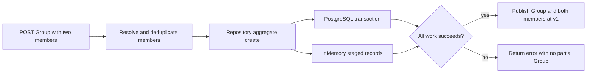
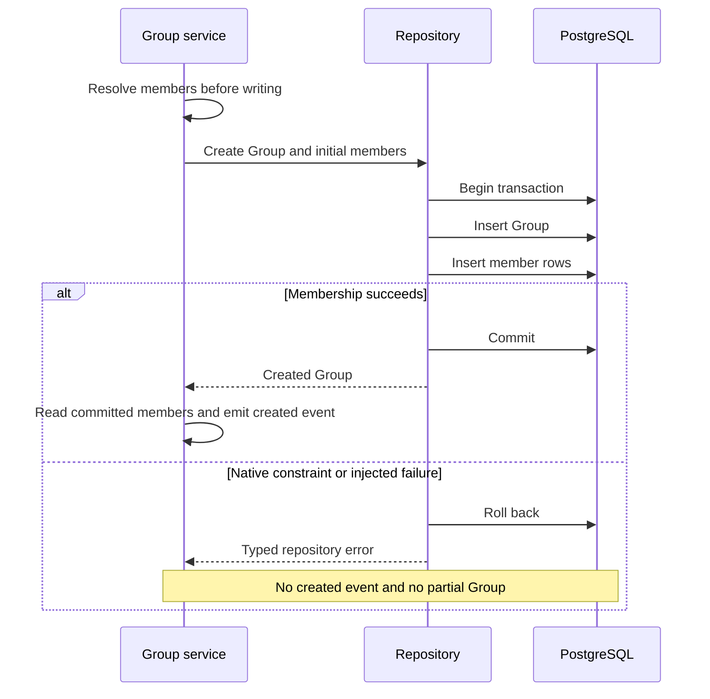

# Group creation and membership: one committed result

**Last verified:** 2026-09-28

**Status:** P4 implemented and locally validated. Not merged, released or deployed.

## What an operator should expect

A Group is stored as a resource row plus separate member rows. Those rows
describe one resource, so they must be saved together.

Before P4, POST saved the Group first. If looking up members or inserting
membership failed, the request returned an error but the empty Group remained.
A retry could then fail with "group already exists". This was a partial create,
not a client PATCH mistake.

Now POST either saves the Group with all its initial members, or saves nothing.
A membership failure during PUT or PATCH leaves the original resource intact:
name, external id, JSON payload, version, timestamps and every member row.
The existing conditional-write guarantee from P3 is preserved.



For example, creating Engineering with Alice and an external member must not
leave Engineering with only Alice if the second member cannot be saved.
After the fault is removed, the same request can be retried successfully.
The test suite injects precisely that late failure, as well as a real database
uniqueness violation.

## Standards and compatibility

* [RFC 7644 section 3.3](https://www.rfc-editor.org/rfc/rfc7644#section-3.3)
  defines resource creation. A 201 response now follows a complete Group
  create, not the first step of a multi-write operation.
* [RFC 7644 section 3.5.2](https://www.rfc-editor.org/rfc/rfc7644#section-3.5.2)
  requires atomic PATCH processing. P4 closes persistence-side member failures;
  it does not claim to fix the separate operation/parser issues in P1/P2.
* [RFC 7644 section 3.14](https://www.rfc-editor.org/rfc/rfc7644#section-3.14)
  covers versioning. P3's condition stays on the actual Group update inside
  the transaction. A stale writer returns 412 without replacing members.
* [RFC 7643 section 4.2](https://www.rfc-editor.org/rfc/rfc7643#section-4.2)
  describes Group members. Existing duplicate-value deduplication remains in
  the service. The lower repository layer rejects duplicates as defense in
  depth, matching PostgreSQL's `(groupResourceId, value)` unique key.

No schema, migration, package version, setting or endpoint profile changed.
Empty Group creation is still valid. Initial members do not increment the
initial version: it remains `W/"v1"`. A successful member replacement increments
the version once. Member values remain case-sensitive at the storage key;
scoped Group SCIM ids use the existing UUID/case-insensitive lookup semantics.

Local users are looked up within the endpoint before persistence. An
unresolved value continues to be stored as an external member with a null
internal User reference; P4 does not introduce strict local-reference-only
validation. PostgreSQL's internal reference foreign key can still reject a
reference that disappears after lookup, and the Group transaction rolls back.
InMemory has no cross-repository User foreign key; its native parity assertions
cover Group identity and member-value uniqueness, not that relational feature.

## How the change is structured

The [existing Group repository port](../api/src/domain/repositories/group.repository.interface.ts)
now accepts optional initial members in `create(input, members)`.
There is no new transaction manager and no controller change.

1. The [Group service](../api/src/modules/scim/services/endpoint-scim-groups.service.ts)
   validates the payload and resolves all initial members before calling create.
   It no longer performs a second `addMembers` write after creation.
2. [Prisma](../api/src/infrastructure/repositories/prisma/prisma-group.repository.ts)
   inserts the Group and members through the same interactive transaction client.
   Mapping and membership errors escape the callback, so PostgreSQL rolls
   back the new Group. Creating no members remains a single atomic insert.
3. [InMemory](../api/src/infrastructure/repositories/inmemory/inmemory-group.repository.ts)
   builds the Group and the complete member set before updating either map.
   It checks duplicate Group ids and member values without any `await` between
   the check and publication. Append checks the candidate against existing
   members; replacement checks only the replacement set.
4. The P3 conditional update still checks the version before member deletion
   or insertion. A failed candidate cannot consume a version that a valid
   concurrent writer needs.
5. InMemory reads also collect scalar fields and members in one synchronous
   turn. Otherwise an `await` could combine an old name/version with newly
   committed members. A deterministic regression proves this separate read bug.



## Reproduce safely

Use the existing installed dependencies or restore them using the repository's
approved dependency process. Generate the Prisma client in this worktree if
needed. The harness requires an already available `postgres:17-alpine` image
whose server reports **17.8**; it does not pull a replacement.

```powershell
node .\scripts\scim-conditional-writes\check-safety.cjs
$env:PERSISTENCE_TEST_SUITE = 'group-transactions'
node .\scripts\scim-conditional-writes\run.cjs
Remove-Item Env:PERSISTENCE_TEST_SUITE
```

This reuses the P3 harness rather than making a second copy. With no suite
selection its original conditional-write suite is unchanged. The P4 selection
adds the aggregate suite plus Group lifecycle/parity regressions.

The runner discards inherited database URLs, rejects a normal E2E database
marker, creates its own labeled container with an unpredictable run id, and
uses a random loopback port and tmpfs storage. It verifies the container id,
owner, port, database, PostgreSQL version, cluster id, system identifier and
ownership row before migrations and the Prisma suite. It replays all 22
migrations and verifies their completion. Teardown deletes only the exact
verified container id. No shared database, estate or persistent volume is used.

The reusable [live smoke](../scripts/live-group-aggregate.ps1) runs against the
owned Nest loopback HTTP listener inside the Node test process on each backend:

```powershell
.\scripts\live-group-aggregate.ps1 -EndpointUrl $ownedEndpointUrl
```

The caller supplies `E2E_TOKEN` and an explicitly owned loopback endpoint.
The smoke creates unique Groups, checks actual scalar/member values, response
keys, versions and stale-write rollback, and deletes only its own Group ids.
It does not expose fault-injection routes in the product. Native and injected
persistence failures are exercised by the separate HTTP tests at repository
boundaries, using the real implementations.

## Evidence and limits

The starting source is P3 `41c5b8c5`, following implementation `0aae3077`.
The corrected pre-fix RED run is `postgres-1278ff12d32dc28e`: InMemory
59 pass / 6 fail and PostgreSQL 60 pass / 5 fail, with no setup failures.
Separate unit RED checks proved the partial create, duplicate membership,
orphan append and torn-read failures before production changes.

| Gate | Actual result |
|---|---|
| Group repository/service units | 205 pass, four suites |
| PostgreSQL 17.8 HTTP | 111 pass, five suites |
| InMemory HTTP | 110 pass, five suites; one explicitly skipped PostgreSQL-only FK control |
| Existing P3 regression coverage included above | 55 tests per backend |
| Existing Group lifecycle/parity included above | 44 tests per backend |
| P4-specific HTTP cases included above | 12 PostgreSQL; 11 InMemory plus the FK skip |
| Migration replay | All 22 completed, no rollback records |
| Independent read-only review | No significant issues |
| Native failure and retry | PostgreSQL membership uniqueness and FK failures leave no Group; duplicate checks on both backends; clean retry succeeds |
| Injected create/update failure | No partial create, no stored field/payload/version/member changes, no create event on failure |
| Concurrent failed/valid update | Winner owns version 2, payload and members; failed writer contributes nothing |

Final verification is
[`postgres-5a349052c937bd39`](evidence/scim-group-transactions/summary.json),
recorded on 2026-09-29 UTC (2026-09-28 local date).
The complete API/scripts source tree SHA-256 is
`26b97869f2f53008a7d65a1b80776f0fef5ab46211caeda166faa4b85670a5b3`.
The source diff SHA-256 against P3 is
`b89f56c2f100d3bc86aeae97f340d2e9c832553c8d9391b3aac294009de9be53`.
The runner includes tracked and untracked source in the tree hash; source
identity does not rely on the base commit alone.

Additional measured gates:

* New Group live smoke: **69 assertions per backend**, stdout captured in
  each run's `inmemory-group-live.log` and `prisma-group-live.log`.
* Existing P3 live smoke: **33 assertions per backend**, included in the
  passing conditional-write HTTP suite.
* API build: pass. Targeted ESLint over nine changed TypeScript files: **zero
  errors, 52 baseline warnings before and after, zero new-file warnings**.
* Ownership negative controls: **3 pass** without contacting a database.
* Documentation content and coupled freshness: **26 manifest docs pass**;
  **41 JSON blocks parse** and **19 new relative links resolve**.
* **Seven Mermaid diagrams render in both strict light/dark themes**. The
  renderer-discovery tool reports the built-in version as `0.0.0`, so this
  proves actual Chromium rendering with pinned Mermaid 11.15.0, not verified
  editor-version equivalence. Do not install the spurious reported version.
* No UI behavior changed; browser UI/regression gates are not applicable.

PostgreSQL image id:
`sha256:3430fe182f5065a6ea505c3d432d2c7fff18fbab954df8f277c1dbf4c70124af`.
The final container
`a816a2367cbd4bf5d8f0f1db2f89325a0143e02ead6e0776f0702dc26fadc918`
was removed after verifying its owner and exact id. Every preceding run also
records successful exact-container removal. No persistent volumes or custom
networks were created. The owned Node test listeners were closed.
Package manifests and lockfiles are unchanged. Before commit, the two
dependency junctions were removed without traversing their targets; the owned
web dependency restore, generated Prisma client, API build and scratch lint
driver were removed too. Sanitized ignored test logs and receipts remain under
`test-results/group-transactions` for parent consolidation. No server is left
running. The committed API/scripts source hash was rechecked against the
validated receipt before cleanup.

**Separate work:** P3b still owns schema-driven/Group-name uniqueness races.
P1/P2 own PATCH parsing and operation semantics. P5/consolidation owns the
existing raw repository-error `detail` exposure identified during this run.
No User/custom implementation, active estate, UI, lockfile or package version
was changed. Full release gates and publication remain parent-owned.

**Self-improvement: applied.** Stored-state equality assertions and a torn-read
negative control strengthen the gate rather than accepting status-only evidence.

**Design disposition: accepted.** The existing Group port and two backend-local
helpers are sufficient; a generic Unit of Work or cross-repository coupling is
unnecessary. The [execution RCA](SCIM_GROUP_TRANSACTIONS_EXECUTION_RCA.md)
records the failures and detection-stage lessons.
