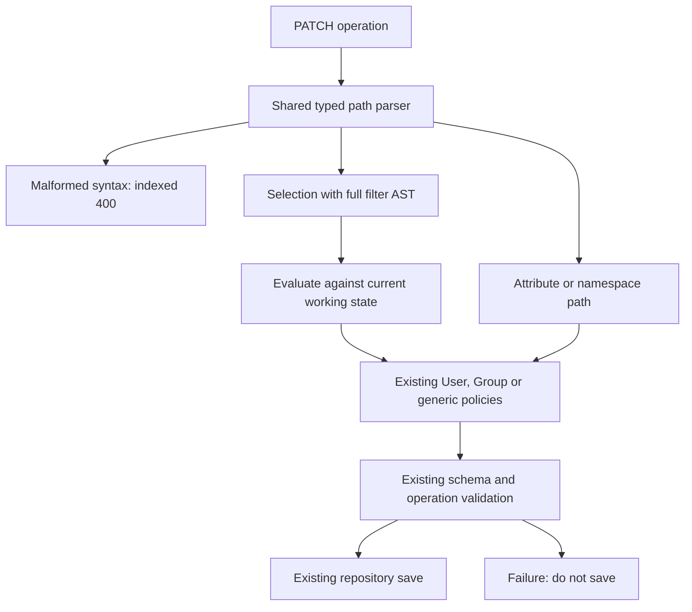
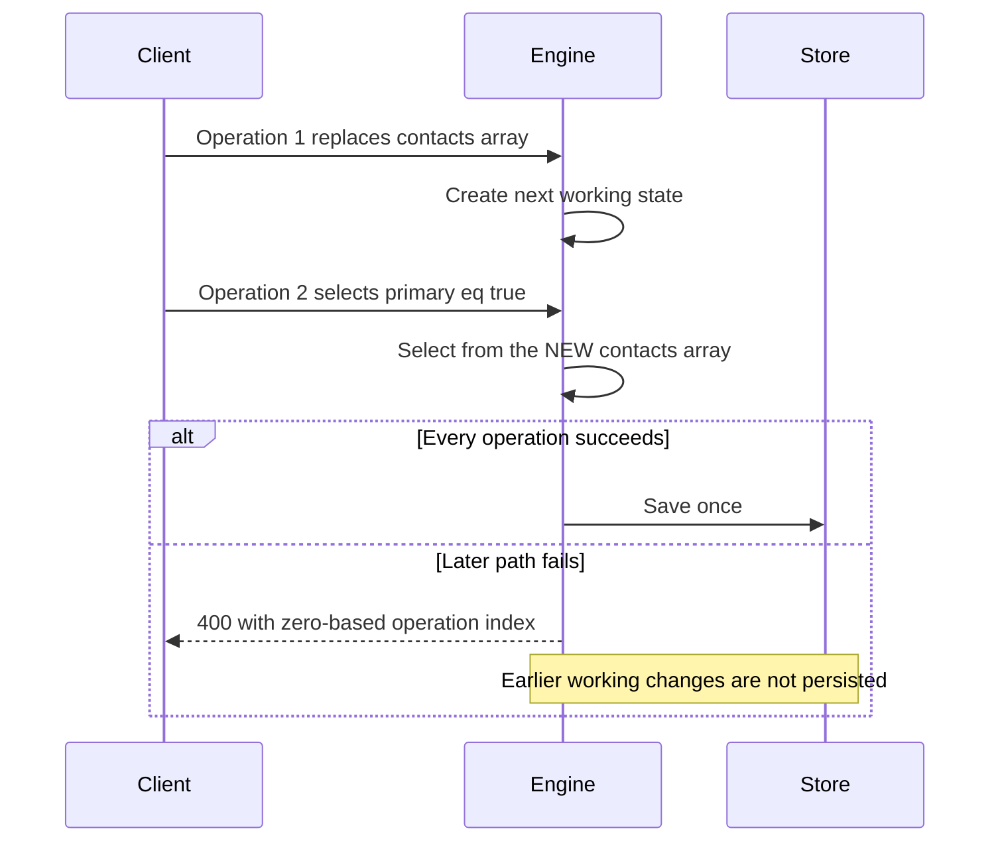

# P1: typed SCIM PATCH paths

**Last verified:** 2026-09-28

**Status:** Implemented and locally validated; included in the `0.55.36`
release candidate. Reviewed PR, merge, and dev deployment remain parent
integration gates.

Design base: `cb2e1bcb4ad31366ef972ac5a163e8aae0e0707e`.
Original failing source: `ccde1d5d6b5129dd943c6e848989c668a0d00d7a`.
See the [design tracker](SCIM_CORRECTNESS_DESIGN_AND_IMPLEMENTATION.md),
[independent analysis](SCIM_FRESH_MASTER_ANALYSIS_2026-09-25.md), and
[execution issues](SCIM_P1_EXECUTION_RCA.md). Historical evidence is unchanged.

## What changed

The server now interprets `contacts[primary eq true].value` as a selection,
not as a property name. The same grammar is used for Users, Groups, custom
resource cores, and extension namespaces. Turning strict schema validation
off no longer turns malformed bracket syntax into stored data.

| Input | Expected and observed after P1 |
| --- | --- |
| `contacts[primary eq true].value` | Select the Boolean primary contact and update its value |
| `contacts[primary eq "True"].value` | Retain existing quoted-Boolean compatibility when the stored attribute is Boolean |
| `contacts[rank ge 1.25e1 and type sw "WO"].value` | Numeric comparison and case-insensitive string prefix comparison |
| `contacts[value pr and missing eq null].value` | Evaluate presence and null using the existing full filter evaluator |
| `contacts[value eq "a]b"].rank` | A closing bracket inside a JSON string is data, not the end of the selector |
| `contacts[primary xx true].value` | 400 `invalidPath`, with the failing operation index; no save |
| `contacts[primary eq true].value.deep` | 400 `invalidPath`; RFC valuePath allows at most one trailing sub-attribute |
| Nested or repeated selectors | Explicit 400, not a literal key or a silent successful request |

Supported comparison operators are `eq`, `ne`, `co`, `sw`, `ew`, `gt`, `ge`,
`lt`, `le`, and `pr`. Predicates support `and`, `or`, parentheses and `not`.
JSON escapes and exponent-form numbers are parsed by the existing filter
parser, whose string decoding and numeric tokenization were corrected.
Strings that happen to contain `"true"` stay strings. Numeric strings are
not silently equated with native numbers.

Names are case-insensitive. Each predicate leaf resolves `caseExact` against
its own schema namespace. One case-exact extension attribute does not make
every string in a compound predicate case-sensitive.

## Architecture



* [patch-path.ts](../api/src/domain/patch/patch-path.ts) owns syntax,
  namespace identification, and predicate matching. Registered URNs are
  matched longest-first. Version dots and quoted filter colons cannot
  accidentally split a namespace.
* [patch-selection.ts](../api/src/domain/patch/patch-selection.ts) shares
  selection mechanics through the existing mutation helpers. It does not
  know about HTTP, repositories, credentials, or endpoint lookup.
* The three existing engines compile each explicit selector once per
  operation. Matches are evaluated at execution, not cached across operations.
* Validator resolution, touched-attribute scoping, read-only stripping and
  Boolean-value coercion use the same grammar rather than stripping brackets
  with separate regular expressions.
* Extension writes rebuild objects without mutating the caller's snapshot.
  Duplicate extension validation was removed, so one invalid extension
  attribute produces one diagnostic.



## Exact synthetic incident

The permanent fixture uses the original four path shapes with synthetic
values, not copied customer records. Both extensions are registered in the
endpoint profile before the test.

```json
{
  "schemas": [
    "urn:ietf:params:scim:api:messages:2.0:PatchOp"
  ],
  "Operations": [
    {
      "op": "replace",
      "path": "urn:ietf:params:scim:schemas:extension:google:2.0:CloudIdentityUser:primaryOrganization.location",
      "value": "new"
    },
    {
      "op": "replace",
      "path": "urn:ietf:params:scim:schemas:extension:google:2.0:CloudIdentityUser:additionalOrganizations[type eq \"school\"].symbol",
      "value": "new"
    },
    {
      "op": "replace",
      "path": "urn:ietf:params:scim:schemas:extension:google:2.0:CloudIdentityUser:additionalOrganizations[type eq \"work\"].symbol",
      "value": "new"
    },
    {
      "op": "replace",
      "path": "urn:ietf:params:scim:schemas:extension:contoso:2.0:ScalarMVUser:contacts[primary eq true].value",
      "value": "new"
    }
  ]
}
```

| Observation | Baseline | P1 |
| --- | --- | --- |
| Strict ON status | 400 for the valid request | 200 |
| Strict OFF status | Misleading 200 | 200 with correct values |
| Google location, school symbol, work symbol | Updated only in lenient mode | All equal `new` in both modes |
| Contoso primary contact value | Still `old` | `new` |
| Literal `contacts[primary eq true]` key | Stored in lenient mode | Absent in response and repository readback |
| Later malformed operation | Inconsistent errors or fallback | Indexed `invalidPath`; entire stored payload and version unchanged |

## Evidence and reproduction

The retained [RED/GREEN receipt](evidence/scim-p1-20260928/red-green.json)
records commands, actual baseline assertion failures, and final counts.
The [backend receipt](evidence/scim-p1-20260928/backend-validation.json)
records source identity, actual PostgreSQL identity, migration replay,
per-backend HTTP/live counts, and cleanup.

| Independent claim | Result |
| --- | --- |
| Baseline RED, permanent domain tests | 53 failures / 4 passes; actual value/key mismatches and missing errors |
| Baseline RED, permanent HTTP tests | 12 failures; valid incident rejected or malformed path accepted |
| Additional malformed selector-tail RED | 3 failures: `Received function did not throw` |
| Final focused API unit tests | 18 suites / 1,476 tests passed, including 66 new domain checks, service and controller coverage |
| Final focused HTTP regression tests | 5 suites / 65 tests passed |
| Actual Prisma/PostgreSQL and InMemory | 24 permanent HTTP tests per backend |
| Owned local live runtimes | 58 live assertions per backend |
| API build | Passed |
| Focused production lint | 0 errors / 55 warnings before and after; no increase |
| Database initialization | All 22 existing migrations replayed on the disposable database |

Run from this implementation worktree and branch:

```powershell
Set-Location C:\Users\v-prasrane\source\repos\SCIMServer-scim-implementation
node scripts\p1-validation\check-safety.cjs
node scripts\p1-validation\run.cjs
```

The second command runs permanent HTTP tests and the focused
[live-test-p1.cjs](../scripts/live-test-p1.cjs) sibling to the general live
runner. It creates its own database; it never accepts an external
`DATABASE_URL`. It uses a random in-memory password, a unique labeled
container, dynamic loopback port, tmpfs, container identity checks and a
database ownership marker before migrations. Normal E2E global teardown is
not invoked. Cleanup removes the verified exact container ID and stops the
two owned runtime PIDs. No shared/live database, cloud deployment, data
repair, push or merge is part of this package.

The source receipt includes HEAD plus a digest of tracked and untracked
implementation source, tests, migrations and harness files. This identifies
the tested uncommitted implementation without falsely labeling the design
commit as the implementation. The original historical reproducer retains its
exact-source guard.

Tooling was missing in the isolated worktree. After the failed Jest attempt,
a temporary API dependency junction reused the existing installed tooling.
Prisma generation wrote only to this worktree. Root/web tooling junctions
are used only for documentation gates. No dependency manifest or lockfile is
changed; owned junctions are removed before delivery.

## Compatibility and deliberate limits

This is P1, not a rewrite of PATCH semantics.

* Existing Entra quoted-Boolean and Group member-array wrappers remain.
  Simple paths, current verbose-dot behavior, manager wrapping, and
  resource-specific array policies remain.
* P2 owns append-versus-replace behavior, all-match updates, primary
  handoff, required/immutable transitions, and selected-object merge shape.
  The existing first-match update behavior is not claimed to be fixed here.
* Existing no-target policies remain: User core simple-equality add can
  synthesize an entry; extension updates and generic selectors require a
  match; Group member removal can remain a no-op. A new compound/non-equality
  add with no match returns `noTarget` because it cannot supply an unambiguous
  object-creation template.
* Full-request atomicity here means a parsing/validation failure before
  persistence. Repository-stage Group failures remain P4; concurrent writer
  compare-and-swap and uniqueness remain P3.
* Query DTO/controller search behavior is untouched and remains P5. The
  shared filter parser's corrected JSON escapes/numbers also benefit reads;
  its existing regression suite was run.
* Historical malformed stored data is not repaired.

## Remaining release gates and design disposition

Central version/CHANGELOG coordination, complete applicable consolidation
evidence, independent review, exact-tip CI and any deployment remain pending.
No UI files or behavior changed, so browser/visual gates are not applicable
to P1. No cloud validation is claimed.

Documentation content and freshness gates passed. All six diagrams in the
new implementation doc and edited PATCH guide rendered under strict security
in both themes. The renderer-discovery tool reported the editor's built-in
Mermaid version as `0.0.0`; exact editor-version parity is therefore unverified.
The pinned `11.15.0` render proof is valid, but that metadata warning is not
a reason to install an invalid version or change dependency locks.

**Test/gate improvement: applied.** Permanent tests assert concrete stored
values, structural key sets, and unchanged stored versions on failure.
They replace baseline tests that explicitly accepted literal-key fallback
and equality fallback for other operators.

**Design/architecture disposition: applied.** Three actual engines justify
one syntax and selection seam. Existing services/repositories are retained.
A general policy framework or wholesale executor rewrite would exceed P1;
that abstraction is declined until P2's concrete transition cases require it.
