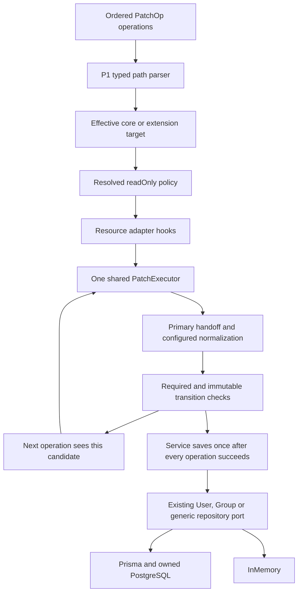
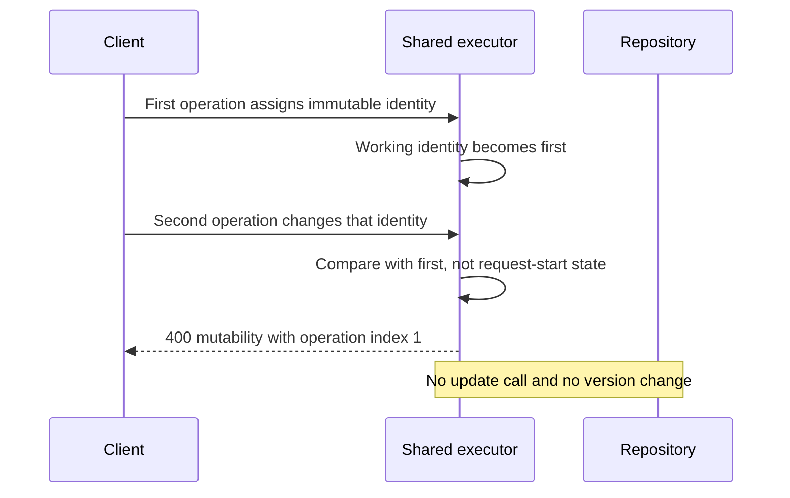

# P2: shared, ordered SCIM PATCH execution

**Last verified:** 2026-09-28

**Status:** Implemented and locally validated, with independent finding closure. Not pushed,
merged, released, or deployed. Product manifests remain `0.55.35`.

Base: `3ecaba55df5424b5427b8fdc41c1bdad0b8d0f51` (P1 typed paths).
This package implements Section 4/5/8 of the
[correctness design](SCIM_CORRECTNESS_DESIGN_AND_IMPLEMENTATION.md).
See the [independent finding matrix](SCIM_FRESH_MASTER_ANALYSIS_2026-09-25.md)
and [execution RCA](SCIM_P2_EXECUTION_RCA.md).

## What changes for a client

An `add` no longer discards existing list entries. A filtered replacement
changes every selected entry, not just the first. Selecting a complex entry
accepts an object rather than incorrectly requiring the entire containing
array. Every operation sees and validates the state produced by its predecessor.

| Operation | Result |
| --- | --- |
| Add an array or one element to a multi-valued attribute | Append to existing values |
| No-path add of a list inside a core or extension object | Same append behavior |
| Add to a complex attribute containing multi-valued children | Preserve unspecified children and append supplied list children |
| Replace a selected complex object | Merge its supplied children into every match |
| Remove a selected sub-attribute | Remove it from every match, preserving each parent |
| Remove required, then restore it later | Reject the removal; no repository write |
| Assign immutable, then change it later | Reject the second assignment; no repository write |
| Set a new primary, then select `primary eq true` | The second operation sees only the newly selected primary |
| Malformed or unknown selector | Indexed error; no literal bracket key or unconditional column write |

Required and immutable transitions are enforced when an effective schema
declares them, including when `StrictSchemaValidation` is disabled. That flag
still controls strict type/unknown-value checks. It is not permission to
violate a declared required or immutable attribute. Unrelated pre-existing
invalid data is not revalidated: resulting-shape checks are scoped to touched
roots.

## Architecture



| Component | Responsibility |
| --- | --- |
| [patch-executor.ts](../api/src/domain/patch/patch-executor.ts) | Ordered operation-atomic execution, typed selection, target resolution and touched-state checks |
| [patch-values.ts](../api/src/domain/patch/patch-values.ts) | Recursive add/merge, required/immutable transitions and primary handoff |
| [patch-readonly.ts](../api/src/domain/patch/patch-readonly.ts) | Reject/ignore policy, including expanded no-path keys and namespace clearing |
| [User adapter](../api/src/domain/patch/user-patch-engine.ts) | Promoted columns, active compatibility, manager shorthand, reserved-field handling |
| [Group adapter](../api/src/domain/patch/group-patch-engine.ts) | Member DTOs, deduplication, multi-member and remove-all settings, Entra removal arrays |
| [Custom adapter](../api/src/domain/patch/generic-patch-engine.ts) | Dynamic core URN and extension bindings |
| Application services | Effective profile, coercion/validation callbacks, uniqueness, metadata, repository save and response projection |

No repository interface, dependency-injection token, migration, or persistence
transaction was replaced. Conditional writes belong to P3. Group aggregate
transaction changes belong to P4. Schema/profile registration and broader
type-policy work belong to P7.

The generic adapter aligns nullable promoted `externalId`/`displayName`
columns with the completed payload, including removal and case-insensitive
keys. Otherwise a GET can omit an attribute while its old query-column value
survives. This is an adapter correction, not a query or repository redesign.

The legacy `patch-selection.ts` export is retained for historical consumers
and the pinned P1 negative control. None of the resource engines uses it.

## Example: the second operation sees the new primary

Starting value:

```json
{
  "emails": [
    {
      "type": "home",
      "value": "home@example.test",
      "primary": true
    },
    {
      "type": "work",
      "value": "work@example.test",
      "primary": false
    }
  ]
}
```

PatchOp body:

```json
{
  "schemas": [
    "urn:ietf:params:scim:api:messages:2.0:PatchOp"
  ],
  "Operations": [
    {
      "op": "replace",
      "path": "emails[type eq \"work\"].primary",
      "value": true
    },
    {
      "op": "replace",
      "path": "emails[primary eq true].value",
      "value": "selected@example.test"
    }
  ]
}
```

The home entry remains present with `primary:false`. Only the work entry gets
`selected@example.test`. Both changes are saved together or neither is saved.



## Characteristics and compatibility

| Concern | Policy retained or corrected |
| --- | --- |
| Eight SCIM types and single/multi-valued forms | Valid values retain their native shapes; all forms have shared unit and HTTP checks |
| `caseExact` | P1 namespace-aware predicate resolution retained |
| `readOnly` | Strict ON rejects unless ignore is enabled; strict OFF ignores. Expanded no-path keys obey the same policy. Ignored namespace clearing preserves server-owned descendants |
| `writeOnly`, `returned:never` | Stored values remain internal and absent from PATCH/GET responses |
| Required sub-attributes | Enforced on retained complex entries after each operation |
| Immutable sub-attributes | Selected entries checked directly; whole-list transitions use one-to-one retained entries by value, with type disambiguation and occurrence-order fallback for anonymous entries |
| Immutable complex equality | Uses structural equality, not JSON property order |
| `primary` | New explicit primary clears other entries before the next operation, including equality-synthesized User entries |
| `PrimaryEnforcement` | Existing reject/normalize/passthrough policy still handles multiple explicit primaries in one supplied value; it does not disable ordinary handoff |
| User `VerbosePatchSupported` | Existing non-selector dotted-key compatibility retained; malformed selectors never use this fallback |
| Group member settings | Multi-member add/remove limits and bare remove-all gate retained; replacement with null still explicitly clears members |
| Zero-match remove | Ordinary selectors retain `noTarget`; Group-member remove retains named idempotency compatibility |
| Filtered add with no match | Only existing User-core simple-equality synthesis retained. Extension/custom/compound no-match paths are not invented into objects |

The identity convention is not a universal identity algorithm for arbitrary
custom complex arrays. Removing an entry and adding a different `value` is
not treated as modifying the old entry's immutable descendants. Duplicate
values are consumed once each, with `type` disambiguation; anonymous entries
can only be paired by occurrence, not a fabricated global identifier.

ReadOnly processing carries the operation through recursive boundaries.
New append entries do not inherit server fields from existing entries;
retained replacement entries keep their own server fields. When ignoring
readOnly during a nested null-unassignment, retained state is a replacement,
not another append. An internal symbol-tagged intent is consumed by the
merge before JSON persistence; exact payload assertions guard this boundary.

**Do not describe zero-match remove as an uncontested universal RFC MUST.**
RFC prose and examples have a normative tension here. The Group behavior
above is an explicitly preserved interoperability policy. Likewise,
equality-discriminator synthesis is compatibility behavior, not a claim that
arbitrary predicates define a creatable object.

## Evidence and reproduction

| Evidence layer | Result |
| --- | --- |
| Initial TDD RED before production edits | 46 failed / 3 passed domain checks |
| Pinned P1 HTTP negative control | 39 failed / 6 passed; production source compiled from Git in memory, no source overwrite |
| Strict-off transition RED | Six HTTP failures, all unexpectedly returned 200 |
| Independent review RED | 15 failed / 101 passed domain checks; six finding classes |
| Focused unit/service/controller/schema suite | 21 suites / 1,522 passed / 0 failed |
| First owned backend run | 99 HTTP plus 170 live assertions on each backend; PostgreSQL 17.8 verified, 22 migrations replayed |
| Final owned backend run | 6 HTTP suites / 201 tests passed on each of InMemory and Prisma/PostgreSQL 17.8 |
| Final built live proof | 170 assertions per backend: P1 58 and P2 112; both owned processes stopped |
| Independent review | Six finding rounds, 15 findings addressed; final bounded preservation-intent closure passed. C0 integration/release review remains separate |
| API build and focused lint | Build passed; lint 0 errors, 105 warnings versus 106 on the same baseline file set |
| Documentation | 18 literal JSON blocks parse; 9 Mermaid diagrams render under strict security in both light/dark themes |
| Owned cleanup | Exact labeled container removed; no database marker or live estate touched |

Retained [RED/GREEN receipt and file inventory](evidence/scim-p2-20260928/red-green.json)
and [backend/build receipt](evidence/scim-p2-20260928/backend-validation.json).
The initial and supplemental RED controls record actual assertion failures,
not setup/compiler errors. The focused P1 and P2 aggregate unit selectors
differ, so their totals are not presented as an apples-to-apples test delta.

| Identity | SHA-256 |
| --- | --- |
| Source, tests, Prisma and guarded runners, 551 files | `72148497142cb37a4d86fa1fcc572bcbf81ee08460ef8ad96238f388dc29428f` |
| Built JavaScript, 235 files, Node v24.13.0 | `ac2fbd2be4443549ea1429409c732a3dca6f628b9de16bac063856594b30fa88` |

Mermaid used the pinned `11.15.0` renderer. Discovery reported local VS Code
built-in metadata `0.0.0`; no fictitious dependency was installed and local
preview version parity is not claimed. The actual browser render proof passed.

```powershell
Set-Location C:\Users\v-prasrane\source\repos\SCIMServer-scim-patch-semantics
node scripts\p1-validation\check-safety.cjs
node scripts\p1-validation\run.cjs
```

The reused runner now pins this P2 worktree/branch and P1 base. It refuses
external database URLs, shared database markers, persistent/bind mounts,
unexpected labels/ports, ownership-marker mismatches and source changes
during execution. It creates random credentials and disposable loopback
PostgreSQL, verifies the actual server version/system identifier, runs the
permanent HTTP suites, then starts/stops owned built API processes. Cleanup
removes only the exact labeled container ID it created.

Raw logs are in ignored `test-results/p2/`. Retained sanitized receipts carry
source hashes and final counts. No version bump, lockfile regeneration, push,
deployment, or live-estate access is part of this package.

Tooling-only `node_modules` junctions remain locally for reproducibility,
created only after missing-dependency failures. Owned generated Prisma,
builds, caches and logs are ignored artifacts, not shared target writes.

## Standards and completion boundary

* [RFC 7644 Section 3.5.2](https://www.rfc-editor.org/rfc/rfc7644#section-3.5.2):
  ordered and atomic PATCH operations.
* [Add](https://www.rfc-editor.org/rfc/rfc7644#section-3.5.2.1),
  [remove](https://www.rfc-editor.org/rfc/rfc7644#section-3.5.2.2), and
  [replace](https://www.rfc-editor.org/rfc/rfc7644#section-3.5.2.3).
* [RFC 7643 Section 2.2](https://www.rfc-editor.org/rfc/rfc7643#section-2.2):
  characteristics, mutability and defaults.

Applied design improvement: three concrete resource adapters share one
executor and one resolved readOnly policy. Accepted boundary: repositories,
projection, profile registration, capabilities and deployment gates remain
separate concerns. This is P2 completion, not whole-roadmap conformance.
