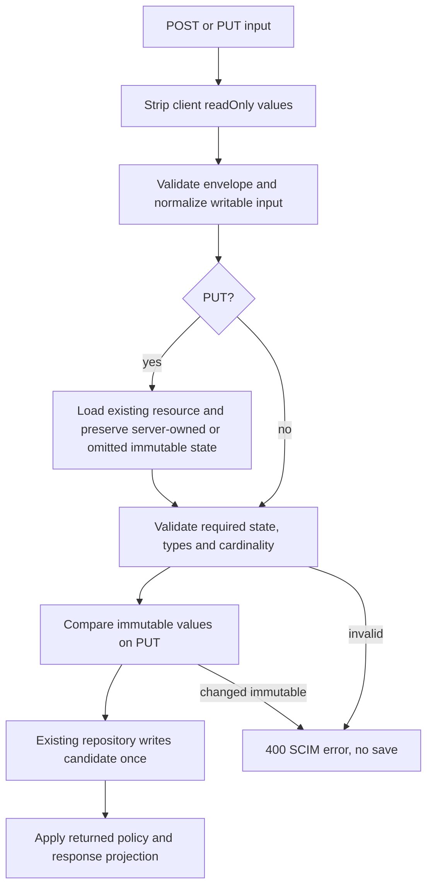

# P7a: schema declarations and resource-write validation

**Last verified:** 2026-09-28

**Status:** Implemented in the isolated `fix/scim-profile-validation-20260928`
worktree, based on P1 `3ecaba55`. Not pushed, merged or deployed.
Product versions and lockfiles are unchanged.

This is the first, bounded part of P7 in the
[correctness plan](SCIM_CORRECTNESS_DESIGN_AND_IMPLEMENTATION.md).
Ordered PATCH execution belongs to P2. The
[independent analysis](SCIM_FRESH_MASTER_ANALYSIS_2026-09-25.md) findings F12,
F13 and the PUT part of F05 are the starting evidence. Earlier failing
evidence is unchanged.

## What changes for an operator

* Admin endpoint creation and profile updates reject malformed attribute
  declarations before storing or publishing them.
* Strict resource validation checks scalar format and cardinality at both
  attribute and sub-attribute level. It does not silently accept an unknown
  declared type.
* POST and PUT ignore client readOnly values, even malformed ones. PUT keeps
  stored readOnly data; normalization cannot rewrite it.
* PUT keeps omitted, non-required immutable values. Supplying a different
  value or explicitly clearing an immutable value produces `400 mutability`.
  Required writable attributes must still be supplied.
* ResourceType-required extensions are checked independently of required
  attributes inside an optional extension. They are enforced with strict
  validation either on or off.
* `returned:request` attributes supplied on POST or PUT are included in the
  write response. An ordinary GET still omits them unless requested.
  `returned:never` and writeOnly values remain suppressed.

These apply to User and Group cores, custom resource cores, and their
registered extension objects. No new switch or optional SCIM protocol is
introduced. Existing Entra Boolean-string coercion and PATCH compatibility
settings are unchanged.

## Declaration rules and RFC defaults

The existing profile expansion pipeline now checks input before expansion,
then checks the expanded profile. This prevents a malformed `attributes`
container from becoming an empty valid schema.

| Declaration | Accepted behavior | Rejected examples |
| --- | --- | --- |
| `type` | Eight SCIM types; omission uses the existing RFC string default | `typo`, `null`, `42` |
| `multiValued`, `required`, `caseExact` | Boolean when present; omission remains omission | `"false"`, `"true"`, `1` |
| `mutability` | `readOnly`, `readWrite`, `immutable`, `writeOnly` | `readonly` |
| `returned` | `always`, `never`, `default`, `request` | `sometimes` |
| `uniqueness` | Valid keyword with supported scope | Unknown keyword; `global` is not supported |
| `canonicalValues` | Array of string suggestions, not an implicit closed enum | A string container or numeric member |
| `referenceTypes` | Array of strings | A string container or numeric member |
| `subAttributes` | Attribute definitions on a complex attribute | A non-array container or children on a simple type |
| Attribute names | Non-empty, unique within their parent ignoring case | Duplicate `value` and `VALUE` siblings |
| Extension binding | Schema string and optional Boolean `required` | `"required": "false"` |

Omitted characteristics are not written back merely to make them explicit.
Known RFC shorthand still expands from the existing baseline. Custom
attributes retain omission defaults: string, single-valued, not required,
case-insensitive, readWrite, returned default and uniqueness none.

`global` is a valid RFC keyword. Rejecting it is this provider's intentional
supported-capability policy, not an RFC mandate. A local duplicate scan does
not establish a global guarantee. See the
[capability matrix and stored-profile edit implications](SCIM_P7_CHARACTERISTIC_STATUS.md#3-global-uniqueness-is-a-supported-capability-policy)
and [compatibility/policy summary](SCIM_ENTRA_COMPATIBILITY.md).

Compatibility impact: any profile-subblock edit validates the entire merged
stored profile. A legacy `global` declaration may therefore block an unrelated
settings, authentication or capability edit. This is a provider capability
restriction, not proof that the RFC keyword is invalid. Do not silently
replace `global` with `server`, rewrite stored profiles, or disable strict
validation as a workaround; the owner must approve any change of promise.

## Value rules

### Integrated PUT preservation of repeated complex entries

The 2026-09-29 integration found a separate retained-entry bug after the
recursive readOnly fix: reordering two entries with the same `value` but
different `type` could copy the first entry's server-owned value into both.
`prepareReplacement` used an unconsumed first match; immutable comparison
used a last-value map. Earlier P7 GREEN counts did not prove this case.

PUT preparation, immutable comparison and P2 PATCH preservation now share
one operation-neutral matcher in `api/src/domain/retained-entries.ts`.
It matches each prior occurrence at most once, uses `type` to disambiguate
repeated values, and keeps anonymous occurrences in their own sequence.
New entries do not inherit a removed or already-consumed entry's server data.
This is deterministic retention matching, not a new uniqueness requirement.
The helper has no HTTP, repository, PATCH-executor or SchemaValidator dependency;
public `SchemaValidator.deepEqual` remains unchanged.

| Permanent control | Outcome |
|---|---|
| Equal values, different types, reordered | `home` retains home-owned state; `work` retains work-owned state |
| Equal value/type repeated, with an extra occurrence | Each old occurrence consumed once; the added occurrence receives no copied server state |
| Anonymous entries interleaved with removed/added identified entries | Anonymous state follows anonymous occurrence order, not absolute array index |
| Distinct removal and addition | Only the retained identity keeps server state |
| Mixed-case `value`/`type` keys | Attribute-name resolution remains case-insensitive |
| Omitted immutable data | Preparation and immutable checks agree on the same retained pair; explicit changes remain rejected |

RED: 9 unit and 48 HTTP failures, with 7 unit/12 HTTP positive controls.
GREEN: all 16 new unit checks and 60 HTTP cases pass. The latter exercise
User/Group/custom core and extension attributes, strict ON/OFF, readOnly and
immutable modes, repeated PUT, version progression, GET and repository
readback. Focused neighboring HTTP coverage totals **289 passes per backend**;
PostgreSQL was actual 17.8 with all 22 migrations on a new task-owned database.
The new live section runs **60 cases / 1,260 assertions** against owned built
local runtimes and retains exact endpoint cleanup. See the
[integration reconciliation](SCIM_CORRECTNESS_DESIGN_AND_IMPLEMENTATION.md#1115-retained-entry-put-preservation-fix)
for evidence boundaries and unrelated still-blocking checks.

| Type | Value validation |
| --- | --- |
| string | JSON string; canonical suggestions do not change or reject its case |
| Boolean | Native Boolean after configured Entra coercion |
| integer | Finite whole JSON number; no fractional value |
| decimal | Finite JSON number, including negative and exponent-valued numbers |
| dateTime | Calendar-valid xsd:dateTime: leap year, month/day, clock and timezone bounds |
| binary | Base64 alphabet and valid padding shape; standard and URL-safe forms supported; optional padding supported |
| reference | Absolute or relative URI syntax, including URNs; malformed escapes, whitespace, authorities and path brackets rejected |
| complex | Object whose children use the same type/cardinality validation as root attributes |

All types may be multi-valued. Such attributes require an array; each element
is checked using the same scalar/complex rule. Simple multi-valued
sub-attributes are legal and remain supported.

DateTime follows xsd:dateTime rather than JavaScript Date normalization.
For example, `2023-02-29T12:00:00Z` fails; `2024-02-29T12:00:00Z` passes.
A timezone is optional in xsd:dateTime; this package does not invent a
mandatory timezone rule. `24:00:00` denotes the permitted end-of-day form,
not an arbitrary out-of-range clock.

`StrictSchemaValidation=false` still disables type/unknown-attribute checks.
It does not disable required attributes, required extension bindings, or
immutable enforcement. Optional absent extensions do not cause their internal
required attributes to be demanded.

## Write ordering



PUT loads and checks If-Match before candidate processing. The diagram
highlights data flow rather than every preliminary check.

The implementation keeps the existing SchemaValidator and repository
interfaces. Small scalar predicates live in
[scim-scalar-formats.ts](../api/src/domain/validation/scim-scalar-formats.ts).
Declaration checks live inside the existing
[profile pipeline](../api/src/modules/scim/endpoint-profile/endpoint-profile.service.ts).
The new `prepareReplacement` helper prepares the actual candidate that
will be validated and saved. `checkImmutable` has an explicit replace
mode; its default PATCH behavior is unchanged for P2 integration.

## Concrete synthetic values verified over HTTP

The live smoke submits these values in a dedicated task-owned resource:

```json
{
  "fixed": "first",
  "serverOwned": {
    "malformed": true
  },
  "asked": "requested",
  "hidden": "never",
  "encoded": "+/8=",
  "link": "../Users/123",
  "stamp": "2024-02-29T12:30:00Z",
  "children": [
    {
      "value": "child",
      "labels": [
        "one",
        "two"
      ]
    }
  ]
}
```

This is the attribute portion of the
[live request](../scripts/live-test-p7.cjs), not a complete SCIM envelope.
The fixture adds the real core/extension schemas and User name or Group/
Widget display name. POST returns `201`; serverOwned and hidden are absent,
asked is `"requested"`, and children exactly matches the submitted array.
PUT omitting fixed retains `"first"`. PUT changing fixed to `"changed"`
returns `400` with `scimType: "mutability"`; the subsequent GET payload and
version equal the pre-failure snapshot.

## Evidence and reproduction

Run in the assigned worktree, with the existing dependencies available:

```powershell
Set-Location C:\Users\v-prasrane\source\repos\SCIMServer-scim-profile-validation
npm --prefix api run build
node scripts\p1-validation\check-safety.cjs
node scripts\p1-validation\run.cjs
```

The reused harness accepts only the exact P1 or P7 worktree/branch/base.
It refuses an existing DB marker, verifies the owned container ID/labels,
loopback port, PostgreSQL system identifier and ownership row, checks
PostgreSQL 17.8 or newer within major 17, and replays all 22 migrations.
No live estate or shared database is used. Each local runtime authenticates
with a random task credential and is stopped afterwards; the exact owned
container is removed.

| Claim | Evidence |
| --- | --- |
| Initial declaration/scalar RED | 45 failing assertions, 15 passing controls, not a compiler failure |
| First focused scalar/profile GREEN | 60 tests |
| Additional edge RED | DTO absent field, returned namespace/write behavior, URI/dateTime boundaries, immutable parent clear |
| Independent review | Three concrete findings; all reproduced with permanent RED tests and fixed |
| Final focused existing/new unit coverage | 21 suites, 1,507 tests |
| Actual PostgreSQL 17.8 and InMemory HTTP | 55 tests passed per backend; all 22 migrations verified |
| Owned local live runtimes | 156 assertions passed per backend; endpoints deleted and runtimes stopped |
| API build and focused production lint | Build passed; 0 errors, 62 warnings before and after |
| Documentation | 26-document freshness/content gates pass; 23 diagrams in touched docs render in both themes |
| Retained proof | [Sanitized receipt](evidence/scim-p7-20260928/validation.json) |
| Rejected-write atomicity | Full GET payload and meta.version equality after rejected PUT; profile and updatedAt equality after rejected admin update |
| Execution issues | [RCA ledger](SCIM_P7_EXECUTION_RCA.md) |

Three unnecessary TypeScript assertions were removed after the backend run
to preserve the lint ratchet. A successful rebuild confirmed byte-identical
emitted JavaScript for both affected files. Both source fingerprints and the
matching emitted hashes are retained; the backend run is not represented as
having executed a different source snapshot.

## Explicit remaining boundaries

P7 is **not complete**. P7a does not claim:

* Ordered PATCH required/immutable/primary transitions or P2 integration.
* Atomic concurrent uniqueness for custom attributes, or support for every
  multi-valued/sub-attribute server-uniqueness declaration. Those existing
  gaps need the persistence packages and remaining P7 promise review.
* External referential integrity is optional, not an automatically missing
  requirement. Explicit `referenceTypes` promises need a separate concrete
  assessment; do not implement speculative external lookups.
* Raw JSON lexical reconstruction is not itself a feature requirement.
  Integer value/encoding rules belong at the relevant parser/serializer
  boundary; no second raw JSON parser is proposed.
* The [recursive readOnly follow-up](SCIM_P7_CHARACTERISTIC_STATUS.md#4-recursive-readonly-follow-up)
  now closes POST/PUT stripping in the existing nested-complex compatibility
  mode. Its separate evidence is recorded below.
* Migration/repair of already stored malformed profiles or resources.

### Recursive readOnly follow-up to 8e42f15f

The fallback collector now records deep parent paths. The existing stripping
helper walks those paths segment by segment through objects and arrays,
matching the recursive cache. Literal dotted keys are not mistaken for nested
objects. P2 ordered PATCH execution is unchanged.

Follow-up gates: 1,517 focused unit tests; 67 HTTP tests and 228 local-live
assertions per backend; PostgreSQL 17.8 with all 22 migrations and InMemory.
See [the follow-up receipt](evidence/scim-p7-20260928/recursive-readonly.json)
and [the remaining characteristic matrix](SCIM_P7_CHARACTERISTIC_STATUS.md).

## Standards and design disposition

* [RFC 7643 2.2-2.5](https://www.rfc-editor.org/rfc/rfc7643#section-2.2):
  characteristics, types, multi-valued data and unassigned values.
* [RFC 7643 6-7](https://www.rfc-editor.org/rfc/rfc7643#section-6):
  required extension binding, schema declarations and canonical suggestions.
* [RFC 7644 3.3](https://www.rfc-editor.org/rfc/rfc7644#section-3.3) and
  [3.5.1](https://www.rfc-editor.org/rfc/rfc7644#section-3.5.1):
  POST/PUT readOnly and immutable behavior.

**Design gate: applied.** Reuse the profile pipeline, shared payload validator,
parent-qualified characteristic maps and existing repositories. Scalar format
predicates have one responsibility. No strategy hierarchy or second validation
engine is justified. **Self-improvement: applied.** Tests now assert actual
values, namespace isolation and unchanged stored versions, including
undefined DTO fields and readOnly-normalizer ordering discovered by review.
