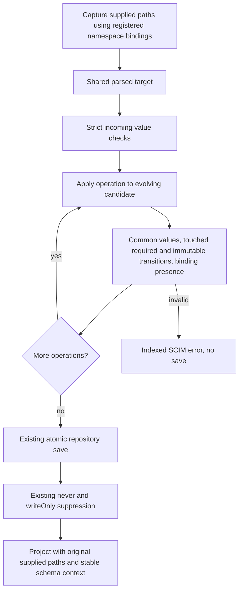

# P7b: PATCH namespace, transition and response contracts

**Last verified:** 2026-09-29

**Status:** Bounded local integration on
`fix/scim-patch-schema-integration-20260929`, based on
`2788304eb5727698a39c563cb544af56e18553e7`. No release, push or deployment.
This is not the final 82-case C0 acceptance matrix.

## Client-visible behavior

1. A registered extension URN is a whole namespace target, including a URN
   ending in a numeric version such as `urn:example:extension:p7b:2.0`.
   Explicit paths and no-path namespace objects validate the same attributes.
2. With strict validation enabled, scalar/array namespace containers,
   wrong child types and unknown children fail with a zero-based operation
   index. Nested values are checked before merging. No earlier operation is
   saved when a later one fails.
3. Required namespace removal and required/immutable attribute transitions
   are checked after each operation against the evolving candidate, even
   with strict validation off. A later operation cannot repair an invalid
   intermediate transition.
4. An unrelated PATCH is not a full POST/PUT revalidation of legacy data.
   Required attributes are checked in touched roots. An untouched namespace
   already absent before the request is not retroactively made mandatory.
   An optional namespace can be removed even when its attributes are required
   while that namespace is present; assigned immutable values still cannot
   be cleared.
5. A supplied `returned:request` field appears in the PATCH response, like
   POST/PUT. A later ordinary GET does not return it. Namespaced homonyms
   remain independent. An explicit `attributes` projection takes precedence;
   `excludedAttributes` can exclude supplied fields. Neither can revive a
   `returned:never` or writeOnly value.
6. Common top-level `externalId` remains a single string with caseExact true
   and readWrite for every core. Direct, core-qualified and no-path forms
   retain the original pre-hook and final-candidate checks. An extension's
   `externalId` may independently be an integer array; custom-core
   `displayName` and `active` retain their declared valid shapes.

No new flag, default, policy language, schema migration or blanket strict-OFF
type checking is introduced. P3b admission/query and reservation work is
separately owned and is not reimplemented here.

## Standards and policy

| Source | Applied contract |
| --- | --- |
| [RFC 7643 Section 7](https://www.rfc-editor.org/rfc/rfc7643.html#section-7) | returned:request explicitly includes PUT, POST **and PATCH** when specified by the client. |
| [RFC 7643 Section 2.2](https://www.rfc-editor.org/rfc/rfc7643.html#section-2.2) | Required and mutability characteristics apply to the attribute in its own schema context. |
| [RFC 7643 Section 3.1](https://www.rfc-editor.org/rfc/rfc7643.html#section-3.1) | Common externalId characteristics take precedence for all resource cores. |
| [RFC 7643 Section 6](https://www.rfc-editor.org/rfc/rfc7643.html#section-6) | ResourceType extension requiredness is distinct from attribute requiredness. |
| [RFC 7644 Section 3.5.2](https://www.rfc-editor.org/rfc/rfc7644.html#section-3.5.2) | Ordered atomic PATCH and response behavior. |
| [RFC 7644 Section 3.9](https://www.rfc-editor.org/rfc/rfc7644.html#section-3.9) | Explicit response attribute selection. |

The existing provider policy scopes ordinary validation to touched roots,
rather than rejecting unrelated pre-existing invalid data. PATCH merges
complex objects and accepts the existing single-element `add` compatibility
shape. Neither policy makes malformed strict namespace input valid.

An empty required namespace that would be pruned from the stored resource
cannot be produced by PATCH. Merely retaining its URN in a schemas array
does not establish an assigned namespace.

## Architecture



`SchemaValidator`, the shared executor and Group normalization use
`parsePatchTarget`; there is no new regex path dialect.
`patch-presence.ts` is a pure, small collector, not another mutation engine.
It records supplied attribute paths, ignores selector predicates as input,
and does not infer client presence from the completed resource.

Presence is computed before persistence. Stable bindings are essential: an optional namespace may disappear from the
final resource. Reparsing its original target against only the remaining
schemas can throw **after** a successful commit. Independent review found
this in the initial implementation; permanent HTTP and built-live controls
now require successful response as well as correct persisted state. Ignored
no-path keys are not reparsed in response generation. Cached User/Group
readOnly filtering retains the same definition context as uncached filtering.

## Example

Assume the registered namespace declares integer `count`, string-list `tags`,
and request-only string `requested`. Both operations below are valid; the
second sees the first's candidate.

```json
{
  "schemas": [
    "urn:ietf:params:scim:api:messages:2.0:PatchOp"
  ],
  "Operations": [
    {
      "op": "add",
      "path": "urn:example:extension:p7b:2.0",
      "value": {
        "count": 2,
        "tags": "new",
        "requested": "returned in this write response"
      }
    },
    {
      "op": "replace",
      "value": {
        "urn:example:extension:p7b:2.0": {
          "count": 3
        }
      }
    }
  ]
}
```

## Reproducible bounded validation

The [owned runner](../scripts/p7b-validation/run.cjs) reuses the existing P5
database guards and pinned app bootstrap. It discards inherited database
URLs, uses a fresh labelled loopback-only tmpfs PostgreSQL container, checks
server/cluster/system identity, verifies an empty database and replays every
migration before HTTP. It launches built `api/dist/main.js` on owned ports,
uses generated task secrets and stops those exact children. Exact-container
cleanup is checked even on failure.

```powershell
Set-Location api
npm run build
Set-Location ..
node scripts\p7b-validation\run.cjs
```

The fixture paths and minimum case discovery are explicit. The optional
`--inmemory` switch is only a focused development lane, not evidence of
PostgreSQL parity. Raw logs and source/build fingerprints are under
`test-results/p7b/<run>/`.

| Layer | Permanent coverage |
| --- | --- |
| Domain | Namespace types/unknown children; optional/required binding transitions; required children of malformed assigned containers; immutable evolving state; PATCH supplied-path semantics. |
| Controller | Snapshot Operations before service mutation; namespace-specific request projection. |
| HTTP | User, Group, Widget; both strict axes; core/extension children; whole/no-path namespaces; direct/core-qualified/no-path common externalId; full GET/meta/version and raw repository equality after rejection. |
| Aliases | User `/Me` response/rollback; User/Group Bulk delegate rejection and per-resource atomicity. Generic Bulk routing is not implemented and is not claimed. Bulk success envelopes carry status/location/version, not resource projection. |
| Built runtime | Same namespace and common-value boundary through live HTTP plus the existing P7a POST/PUT live helper; exact endpoint cleanup. |
| Independent review | Committed-but-500 namespace removal regression reproduced, fixed and covered. |

### Final measured checkpoint

[Persistent receipt and exact 34-file manifest](evidence/scim-patch-schema-p7b-20260929/validation.json):

| Gate | Measured outcome |
| --- | --- |
| Focused domain, service and controller units | 19 suites / 1,126 passed |
| Six focused HTTP suites on InMemory | 549 passed, 0 failed/pending |
| Same HTTP suites on owned PostgreSQL 17.8 | 549 passed, 0 failed/pending; all 22 migrations replayed |
| Built-runtime live helper on each backend | 153 P7b cases / 905 assertions, plus 426 existing P7a POST/PUT assertions |
| Build and full API lint | Passed; 0 errors / 517 warnings; changed-file ratchet 88 -> 88 |
| Documentation | JSON parses; content/freshness pass for 26 documents; diagrams rendered in both strict themes |
| Cleanup | Exact owned container removed; both API PIDs stopped; unchanged endpoint inventories; no database marker |

The receipt records source fingerprint
`dcd0af25b64fe4552ec18654a3ff20743e01d4b6966e98aec280c2db10ca76f6`
and built JavaScript fingerprint
`e2a64521a861b7c9ff8aeae6a8f2152a873f7d5ffc0e16d6e29c04301638d23e`.
No post-validation production source edit is included in this checkpoint.

Eight pre-existing
`extension-flags-validation.spec.ts` expectations still codify superseded
P7a policies; the base-source control distinguishes them from new regressions.

## Self-improvement and design disposition

**Applied:** response-after-removal regressions now test a successful HTTP
outcome, stored value and version, not only that persistence occurred.
Required binding and ordinary required-attribute scopes remain separate.

**Design disposition: accepted.** Existing responsibilities remain cohesive:
controllers snapshot context, the small pure collector records presence,
the shared executor owns transitions and repositories own save atomicity.
No speculative strategy or policy abstraction is warranted.

See [execution issues and detection-stage analysis](SCIM_P7_EXECUTION_RCA.md),
[P2 semantics](SCIM_P2_IMPLEMENTATION.md),
[P7a POST/PUT policy](SCIM_P7A_PROFILE_VALIDATION.md), and
[C0 acceptance boundaries](SCIM_CORRECTNESS_DESIGN_AND_IMPLEMENTATION.md#118-final-c0-case-level-acceptance-ledger).
