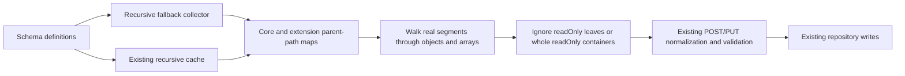

# P7 characteristic status and the P3b uniqueness handoff

**Last verified:** 2026-09-28

**Status:** P7 remains open until final P2 integration. This document describes
local source, not a deployment. P7a was accepted at `8e42f15f`; the recursive
readOnly follow-up is a separate commit.

## 1. Do not confuse a broken promise with a missing optional feature

| Concern | Classification | Status and next action |
| --- | --- | --- |
| Common top-level externalId on every resource core | RFC-defined contract, not column policy | [Common externalId correction](SCIM_P7_COMMON_EXTERNAL_ID.md): String/SV/caseExact true/readWrite, including custom resources; extension names remain independent |
| Common id/meta and dual core/extension schema use | Verified follow-up | [Context-aware common precedence](SCIM_P7_COMMON_ATTRIBUTE_CONTEXT.md): ignore client id/meta, retain authoritative metadata, preserve shared extension definitions, explicitly mark binding roles |
| Valid declaration shapes, type/Boolean/keyword checks, omitted defaults | Implemented P7a contract | Profile validation checks raw and expanded declarations. Existing defaults are unchanged. |
| Scalar and array/child cardinality under strict validation | Implemented P7a contract | Values use the existing SchemaValidator; strict-off behavior remains a deliberate compatibility choice. |
| POST/PUT readOnly at supported RFC depths | Implemented P7a contract | Ignore input, preserve server-owned state on PUT, and normalize only client-writable input. |
| POST/PUT readOnly in nested-complex compatibility mode | Previously promised-but-broken; fixed in this follow-up | Recursive stripping works through real objects and arrays with or without a cache. No new flag or default change. |
| PUT readOnly/immutable state on duplicate or anonymous array entries | [Local combined-source correction](SCIM_PUT_ENTRY_PRESERVATION.md) | One neutral matcher shared with PATCH; type-capacity reservation and stable occurrence fallback, recursive immutable comparison. Does not close unrelated P7/P3b acceptance rows. |
| Required attributes and ResourceType-required extensions on POST/PUT | Implemented P7a contract | Checks run in both strict modes, independent of optional extension attributes. |
| Required/immutable/primary transitions in ordered PATCH | Required integration work | P2 owns execution; P7 stays open until combined tests pass. |
| returned:request on POST/PUT, namespace isolation | Implemented P7a contract | Only defined client-supplied values count as implicit requests. PATCH integration remains separate. |
| canonicalValues closed-enum enforcement | Optional provider policy, not a missing requirement | RFC 7643 2.3.1 permits restrictions, but does not require them. This server currently treats canonicalValues as suggestions. No new enum flag is proposed. |
| Reference URI syntax | Implemented P7a contract | Invalid URI syntax fails strict validation. A URI check does not prove target existence. |
| External referential integrity | Optional behavior, not an automatic gap | RFC 7643 2.3.7 permits local SCIM referential-integrity enforcement. Do not fetch arbitrary external URLs or implement a network resolver merely to validate an attribute. |
| Published referenceTypes restrictions | Separate schema-promise assessment | An explicit type restriction and target existence are different questions. Current declarations are structurally checked; exact semantic enforcement needs a concrete contract/test, not speculative external lookups. |
| Integer/decimal values after JSON parsing | Implemented value check | Integers are finite whole numbers; decimals are finite. The RFC has JSON encoding rules, but reconstructing discarded lexical tokens is not itself an implementation requirement. Assess parser/serializer behavior at the boundary before proposing any parser change. |
| uniqueness:global | Intentional unsupported-capability policy | A valid RFC keyword is rejected by this provider at profile write. This is not an RFC-mandated rejection. See section 3. |
| Accepted uniqueness:server declarations skipped or scanned non-atomically | Actual capability gaps | Exact shapes and source/test pointers are in section 2. P3b owns the persistence/enforcement decision. |
| Uniqueness on Boolean, binary, dateTime or complex values | Inconsistent declaration, not a demand for a new comparison feature | RFC 7643 says these types have no uniqueness. Do not treat accepting such metadata as a requirement to invent object/binary/date uniqueness semantics. |

## 2. Exact server-uniqueness shapes for P3b

Both
[collectUniqueAttributes](../api/src/domain/validation/schema-validator.ts#L1517)
and the
[cached collector](../api/src/domain/validation/schema-validator.ts#L1742)
only collect top-level, single-valued, non-complex attributes whose uniqueness
is `server`. Both unconditionally skip the names `id`, `userName`,
`displayName`, and `externalId`, including inside extensions.

The following are not guesses: a local read-only probe called
`validateAndExpandProfile`, `collectUniqueAttributes`, and
`buildCharacteristicsCache` on ten synthetic declarations. Every profile
was accepted. Core/extension scalar `serial` controls produced descriptors;
all eight gap cases produced empty descriptor lists in both collectors.
The [retained inventory](evidence/scim-p7-20260928/uniqueness-inventory.json)
is observational evidence for P3b, not a conformance pass for those cases.

| Shape / example | Observed limitation | P3b acceptance test to add |
| --- | --- | --- |
| Core simple MV string `aliases`, uniqueness server | Entire attribute skipped because multiValued is true | Two resources sharing one alias, not only identical arrays; compare both backends and simultaneous writes |
| Extension simple MV string `urn:ext:aliases` | Same skip, despite a valid extension binding | Same element-level duplicate cases with namespace isolation |
| Simple child of single complex `contact.value`, uniqueness server on value | Collector never visits child uniqueness; cache requires isTopLevel | Duplicate child across resources, including PUT and PATCH |
| Simple child of MV complex `contacts[].value` | Same top-level-only restriction | Duplicate value across entries/resources; removing an entry is not assigning a new unique value |
| Extension scalar named `id`, `userName`, `displayName`, or `externalId` | Unqualified name skip mistakes an ordinary extension attribute for a promoted core column | Four namespace-specific duplicate tests; one core field must not exempt the same name in an extension |
| Core User displayName, custom-core userName/displayName | Same skip; not all names have a dedicated uniqueness check for that resource family | Test the declared scope on the actual family, not just a generic collector |
| Ordinary custom single scalar already collected | Service scan and subsequent save are separate operations | Two synchronized creates or replacements with the same value; one wins and one receives the documented conflict, with atomic rollback |

The MV/child rows also apply to other types for which uniqueness is meaningful
(for example integer/decimal/reference). Do not extrapolate them into a new
uniqueness promise for types whose RFC definition explicitly has none.

**Common externalId correction:** top-level externalId is not an arbitrary
custom-core field. RFC 7643 3.1 defines it as client-issued, provisioning-domain
scoped String/SV/caseExact true/readWrite and describes client-managed uniqueness.
Its name being skipped is therefore not by itself a missing default
server-uniqueness requirement. Assess any explicit stronger provider promise
separately. Extension-namespaced externalId is independent and remains in the
name-collision gap inventory. See [the verified admission/runtime fix](SCIM_P7_COMMON_EXTERNAL_ID.md).

### Source and existing test evidence

* [assertSchemaUniqueness](../api/src/modules/scim/common/scim-service-helpers.ts):
  `extractPayloadValue` resolves one top-level name in the core/extension;
  `uniquenessValuesMatch` uses exact non-string equality or string comparison
  according to caseExact. It does not expand paths or lists.
* [User service](../api/src/modules/scim/services/endpoint-scim-users.service.ts),
  [Group service](../api/src/modules/scim/services/endpoint-scim-groups.service.ts)
  and [generic service](../api/src/modules/scim/services/endpoint-scim-generic.service.ts):
  search `assertSchemaUniqueness`, `findAll`, and the following repository
  create/update. Each scan is resource-family scoped and precedes persistence.
* [Current Prisma schema](../api/prisma/schema.prisma):
  `(endpointId, userName)` has a unique constraint; there is no general
  profile-driven unique JSONB constraint. A historical displayName/externalId
  index in an earlier migration is not evidence that the final schema retains it.
* [Cache unit tests](../api/src/domain/validation/schema-validator-cache.spec.ts#L263):
  `uniqueAttrs` tests the name skip and a positive extension `employeeBadge`.
  It does not prove extension same-name fields or child/MV shapes are enforced.
* [HTTP uniqueness tests](../api/test/e2e/schema-driven-uniqueness.e2e-spec.ts):
  positive/negative single-scalar `employeeBadge` and `badgeAlias`, caseExact,
  self-exclusion, and non-unique department. These are controls, not MV/child
  coverage or concurrent-write proof.
* [Original P49 evidence](SCIM_FRESH_MASTER_ANALYSIS_2026-09-25.md)
  independently recorded skipped MV/child/global/promoted-name declarations.
  The new global rejection is a provider policy, not evidence that all other
  promised scopes are now enforced.

Group displayName has a separate service check; core User userName and
server-generated id also have separate paths. Therefore “a name is skipped”
alone does not prove a bug for every core resource. Check the exact family,
declaration and persistence constraint.

**Cross-resource-type scope needs an explicit decision.** Current scans read
only the current family. If one shared extension advertises server uniqueness
across User and Group resources in the same endpoint, those scans do not
establish that promise. P3b must state and test the intended scope rather than
silently assume per-family and per-endpoint are interchangeable.

## 3. Global uniqueness is a supported-capability policy

RFC 7643 7 defines `global` as a valid uniqueness keyword. Providers can
legitimately offer globally unique identifiers, including suitable
server-generated identifiers, without scanning every other server.
Consequently, rejecting the keyword is **not required by the RFC**.

P7a intentionally rejects `global` because this server does not currently
implement and document a global-uniqueness capability for arbitrary
operator-defined attributes. It returns an `UNSUPPORTED_DECLARATION` profile
validation error rather than interpreting a local endpoint scan as a global
guarantee. The policy is narrower than the RFC's universe of valid declarations.
This follow-up does not tighten or change that policy.

### What happens to an already stored profile

No existing profile is silently rewritten. Reading/loading a stored profile
does not invoke the new declaration validator as an automatic migration.

[EndpointService.updateEndpoint](../api/src/modules/endpoint/services/endpoint.service.ts#L601)
calls
[mergeProfilePartial](../api/src/modules/endpoint/services/endpoint.service.ts#L786)
when the update contains `profile`. That method validates the **whole merged
profile**, including unchanged schemas. As a result:

| Operation on an old profile containing global | Behavior |
| --- | --- |
| GET/read | Stored declaration remains visible; this does not certify enforcement |
| Update only top-level endpoint displayName/description/active, without profile | Does not run merged profile validation |
| Update profile.settings, SPC, authentication, or schemas | Fails profile validation while any global declaration remains, even if that attribute was not edited |
| Submit corrected complete schemas as part of the profile update | Validates against the new policy before saving |

An operator must deliberately choose a supported declaration consistent
with the desired behavior, or wait for a separately designed supported global
capability. Do not silently downgrade `global` to `server` or `none`, and do not
claim `server` is fully supported for the gap shapes above.

## 4. Recursive readOnly follow-up



The maps are metadata, not a second payload validator. A key literally named
`outer.inner` is not interpreted as the object path `outer` then `inner`.
Malformed writable values are left for existing validation, not coerced by
the stripping helper. Schema namespaces stay isolated and warning paths retain
actual key casing and array markers.

Coverage lives in
[scim-readonly-p7.spec.ts](../api/src/modules/scim/common/scim-readonly-p7.spec.ts),
the twelve new cases in
[profile-validation-p7.e2e-spec.ts](../api/test/e2e/profile-validation-p7.e2e-spec.ts),
and [live-test-p7.cjs](../scripts/live-test-p7.cjs). They cover User, Group and
custom cores plus extensions, strict on/off, nested arrays, malformed
readOnly values, retained server state after a profile change, and rejected
writable mutations with unchanged payload/version.

For example, the first detail object submitted by the live fixture is:

```json
{
  "value": "d1",
  "open": "keep-1",
  "sealed": "malformed",
  "serverBranch": {
    "value": "stored"
  }
}
```

It is nested below `nested.records[].details[]` in both the core and
extension. With sealed and serverBranch declared readOnly, POST/PUT and the
subsequent GET contain this exact detail object instead:

```json
{
  "value": "d1",
  "open": "keep-1"
}
```

The separate profile-transition test creates valid server state first, then
marks the same deep attributes readOnly. Later PUT input cannot overwrite
the stored integers 7 (core) and 9 (extension). Writable `open` remains
required; a rejected removal leaves the entire resource and version unchanged.

**Design gate: applied.** A single existing stripping helper replaces four
duplicated shallow loops. The existing collector/map interface is preserved;
no strategy layer, flag, repository change or second validator engine is added.
**Self-improvement: applied.** Cached and fallback paths, literal dotted keys,
namespace isolation, and independently cloned fixtures now have permanent tests.

Final proof: [recursive readOnly validation receipt](evidence/scim-p7-20260928/recursive-readonly.json).
The owned PostgreSQL container, its database, both local runtimes, and synthetic
endpoints were cleaned up. Product versions, dependencies and deployments did
not change.
