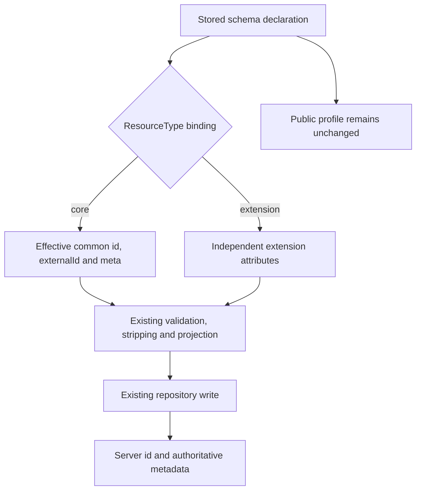

# P7: common attributes are resolved in their resource context

**Last verified:** 2026-09-29

**Status:** Local follow-up to `8e8aa72e`; no merge, push or deployment.
P7 remains open for final P2 integration. This change does not implement
atomic uniqueness or alter arbitrary custom displayName/active types.

## 1. What RFC precedence actually means

[RFC 7643 3.1](https://www.rfc-editor.org/rfc/rfc7643.html#section-3.1)
applies common attributes to all SCIM resources, including extended resource
types. Listed common characteristics take precedence over older definitions.

| Top-level resource field | Effective common contract |
| --- | --- |
| id | Server-issued stable String identifier, caseExact true, readOnly, returned always |
| externalId | Client-issued String, single-valued, caseExact true, readWrite, provisioning-domain scoped |
| meta | Server-owned complex metadata; client input ignored; common children are readOnly/default |

The earlier suggestion that numeric/multi-valued generic externalId was
valid because rawPayload retained it was wrong. Storage representation is
not the standard. The earlier
[externalId correction](SCIM_P7_COMMON_EXTERNAL_ID.md) repaired that error.

The reverse mistake is also possible: applying common semantics to every
attribute with a matching name, regardless of namespace or resource binding.
An extension's id, externalId, or meta may be independently defined custom
attributes. A shared schema may be a ResourceType's core while also being
another ResourceType's extension. Its extension use must not be rewritten
merely because a core use exists.

## 2. Admission policy versus runtime precedence

RFC 7643 does **not** mandate a particular admin API or require an admin 400
response for every conflicting schema declaration. This server chooses:

| Schema usage | Admin behavior | Runtime behavior |
| --- | --- | --- |
| Core only | Reject explicitly conflicting common type/cardinality/mutability/case/returned characteristics that the common contract defines | Apply common precedence, including to old stored profiles |
| Extension only | Preserve independent common-looking names | Use extension declarations, not top-level common semantics |
| Core in one RT and extension in another | Preserve the shared declaration instead of rejecting or rewriting it | Apply common overrides only in the core binding; retain custom semantics in the extension binding |
| Core with common fields omitted | Omission does not remove the common contract | Internal definitions include server-owned id/meta and client-owned externalId |

This policy prevents misleading new core-only declarations while retaining
shared-schema compatibility. An operator who wants different published
definitions can use separate schema URNs. Existing shared definitions are
not silently rewritten, and internal role markers do not appear in public
Schema or resource responses.

The same rule applies to known schema baseline expansion: common-looking
attributes on a schema used as an extension do not inherit builtin common
defaults merely because its URN happens to be a known core URN. Other
non-common baseline rules are unchanged.



## 3. Concrete shared-schema example

The permanent fixture uses this declaration fragment:

```json
{
  "id": "urn:ietf:params:scim:schemas:core:2.0:P7Shared",
  "name": "Shared",
  "attributes": [
    {
      "name": "externalId",
      "type": "integer",
      "multiValued": true,
      "caseExact": false
    },
    {
      "name": "id",
      "type": "integer",
      "multiValued": true,
      "mutability": "readWrite",
      "returned": "default"
    },
    {
      "name": "meta",
      "type": "string",
      "mutability": "readWrite"
    }
  ]
}
```

The fixture binds it as Shared's core and Other's extension. For Shared,
top-level externalId must still be a string, supplied id/meta are ignored,
and output id/meta are generated. For Other, this extension object is
accepted and round-trips unchanged:

```json
{
  "externalId": [
    11,
    13
  ],
  "id": [
    17,
    19
  ],
  "meta": "independent"
}
```

The fixture also proves custom displayName integer arrays and active strings
remain untouched. Admin GET after both sets of writes returns the original
schema attributes unchanged. Resource and metadata key allowlists prevent
internal fields such as isCoreSchema from leaking.

## 4. Narrow implementation

* [common-attributes.ts](../api/src/domain/validation/common-attributes.ts)
  supplies effective common attributes for a **core binding** only.
* The existing
  [SchemaValidator](../api/src/domain/validation/schema-validator.ts)
  characteristic cache and fallback readOnly collector include common id/meta,
  even when declarations omit or conflict with them.
* [Profile expansion](../api/src/modules/scim/endpoint-profile/auto-expand.service.ts),
  [declaration admission](../api/src/modules/scim/endpoint-profile/schema-declaration-validator.ts)
  and [tighten-only orchestration](../api/src/modules/scim/endpoint-profile/endpoint-profile.service.ts)
  preserve schemas used as extensions rather than rewriting common-looking
  attributes globally.
* Existing builtin/generic schema-definition builders explicitly set
  `isCoreSchema: false` for extensions. A URN containing `:core:` is not
  sufficient evidence that a particular resource uses it as its core.
* Generic response metadata now reads created/lastModified from the
  authoritative record timestamps. Previously create serialized meta before
  the repository assigned createdAt; a later PUT could change meta.created
  by a millisecond. A deterministic unit regression covers this defect.

No duplicate validator engine, new repository API, common-name blacklist,
feature flag, data migration or default-policy toggle is added.

## 5. Verification and boundaries

| Claim | Evidence |
| --- | --- |
| Initial domain RED | 9 failures with 14 passing prior common-externalId controls |
| Initial HTTP RED | 4 failures, covering strict on/off for shared binding and unlisted common fields |
| Known-schema baseline isolation RED | 1 additional failure, before the baseline-context correction |
| Metadata timestamp RED | 1 deterministic service failure, before authoritative timestamp repair |
| Focused regression | 25 suites, 1,698 tests passed |
| Backend/live proof | [Retained receipt](evidence/scim-p7-20260928/common-context.json) |

Permanent tests are in
[common-attributes-p7.spec.ts](../api/src/domain/validation/common-attributes-p7.spec.ts),
[generic service tests](../api/src/modules/scim/services/endpoint-scim-generic.service.spec.ts),
[HTTP tests](../api/test/e2e/profile-validation-p7.e2e-spec.ts),
and [the live runner](../scripts/live-test-p7.cjs).
The shared fixture is
[profile-p7-common-context.fixture.ts](../api/test/e2e/helpers/profile-p7-common-context.fixture.ts).

P2 integration still must use full evolving candidates for common-attribute
PATCH checks, rather than require missing fields on a touched partial view.
The separately confirmed PUT duplicate/anonymous entry-matching defect
remains an integration blocker. This package does not silently claim either
as fixed.

**Design gate: applied.** Keep role/context at the existing schema-definition
boundary and common precedence in the existing domain helper. Do not mutate
shared profile definitions. **Self-improvement: applied.** Shared core/extension
use, core-shaped extension URNs, case-insensitive id/meta input and metadata
timestamp authority now have executable regression checks.

Final validation: 108 HTTP tests and 472 local-live assertions passed on each
owned PostgreSQL 17.8 and InMemory backend. All 22 migrations were applied and
verified. The exact database container and runtime processes were removed;
synthetic endpoints were deleted. Build passed, lint remained 0 errors /
34 warnings, and 23 diagrams in touched docs rendered in both strict themes.

When an operator removes the last extension binding from a shared schema,
it becomes core-only for admission purposes. A later profile write must then
resolve any explicit common conflicts. This is an intentional admin policy,
not a silent mutation of the old declaration or an RFC-mandated admin API.
