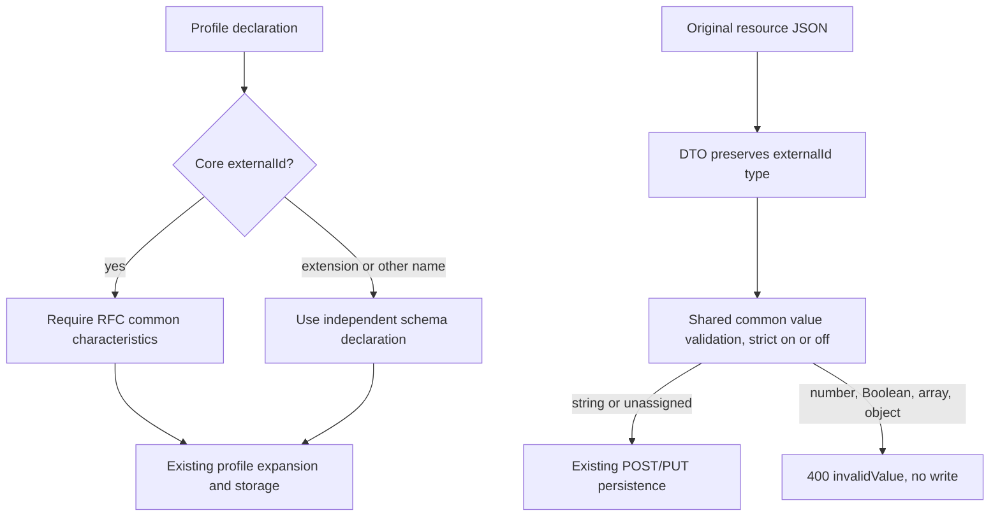

# P7: the common externalId contract

**Last verified:** 2026-09-29

**Status:** Local follow-up to `892b74ba`. Not merged, pushed or deployed.
P7 remains open until final P2 integration. Atomic uniqueness is P3b-owned.

## 1. The standard, not the storage column, decides the contract

[RFC 7643 3.1](https://www.rfc-editor.org/rfc/rfc7643.html#section-3.1)
says that common attributes apply to every resource, including extended
resource types. Their listed characteristics take precedence over older
schema definitions.

Therefore top-level `externalId` is a String, single-valued, caseExact true,
and readWrite for User, Group, and a custom resource such as Widget. It is
issued by the provisioning client and interpreted in that provisioning
domain. A provider must not silently invent a value for the client.

That does **not** make every familiar-looking custom attribute a common
attribute:

| Attribute | Contract |
| --- | --- |
| User core `userName` | The User definition applies |
| Group core `displayName` | The Group definition applies |
| Any resource's top-level `externalId` | The common-attribute definition applies |
| Custom core `displayName` or `active` | Its custom schema defines the type/cardinality; a convenience column does not impose a type |
| Extension `urn:example:extension:2.0:Widget` containing `externalId` | Independent custom attribute, not the common top-level field |

The earlier suggestion that rawPayload storage made numeric/multi-valued
top-level externalId legitimate was incorrect. Preserving a value does not
make it standards-conformant. Conversely, imposing a Boolean or string type
on custom-core active/displayName merely because of a convenience column
would also be incorrect.

## 2. What failed, and what changed

| Boundary | Observed defect | Correction |
| --- | --- | --- |
| Profile admission | A custom core could explicitly declare integer/MV externalId, caseExact false or non-readWrite mutability | Reject the conflicting core declaration with an actionable common-attribute explanation |
| Profile shorthand | An explicit custom-core `{name: externalId}` retained generic omission defaults | Expand its common characteristics without injecting restrictions into independent extension names |
| Shared value validation | externalId was a reserved-key bypass | Validate its original JSON value as a single string in both strict modes |
| User HTTP DTO | Implicit String conversion turned numeric/Boolean externalId into strings before validation | Keep its value unknown at the DTO boundary, then validate in the shared domain layer |
| Old conflicting definitions | ReadOnly stripping or immutable preservation could act on an obsolete core externalId declaration | Use common precedence in the internal characteristic cache, fallback collectors and PUT candidate preparation |
| Case-exact metadata | A custom core omitting externalId did not contribute its common caseExact behavior | Include common externalId in cached and fallback case-exact metadata |

The implementation uses
[common-attributes.ts](../api/src/domain/validation/common-attributes.ts)
inside the existing SchemaValidator and profile pipeline. It does not add a
second validator, repository check, migration, feature flag or storage policy.



## 3. Concrete verified values

This attribute fragment is valid when the extension declares its externalId
as a multi-valued integer. The two identically named fields have different
schema contexts:

```json
{
  "externalId": "Client-AbC",
  "urn:example:params:scim:schemas:extension:p7:2.0:Test": {
    "requiredValue": "present",
    "externalId": [
      7,
      9
    ]
  }
}
```

The permanent HTTP fixtures add the appropriate core schemas, resource name,
and extension binding before sending this data. The response and later GET
preserve `"Client-AbC"` and `[7, 9]`. PUT may replace the common value with
`"Client-aBc"`; readWrite and case preservation both remain observable.

The following values at the **top-level** externalId fail on POST and PUT
with `400`, `scimType: "invalidValue"` and a scalar detail:

```json
[
  42,
  false,
  [
    "client"
  ],
  {
    "value": "client"
  }
]
```

Each rejected PUT is followed by GET and exact full-payload/meta.version
equality against the pre-write snapshot. The same matrix runs for User,
Group and Widget, with strict validation both on and off.

The common field is optional. This change does not generate externalIds or
turn omitted/null unassigned values into a required field. Under a profile
with uniqueness none, two differently named resources can carry the same
externalId. That is a positive test of client-scoped identifiers, not a
server-uniqueness feature. Any explicitly supported stronger uniqueness
policy belongs to the separate P3b contract.

## 4. Profiles already in storage

There is no silent database migration. A new conflicting declaration fails
admin validation. On a later profile edit, the existing full-merged-profile
validation also finds a conflicting old declaration before saving.

Meanwhile runtime internal definitions apply the common String/SV/caseExact/
readWrite precedence rather than treating obsolete core metadata as authority.
This does not mean every old stored resource is repaired automatically, and
it does not certify an old discovery declaration as current.

## 5. Tests and remaining work

| Evidence | Result |
| --- | --- |
| Domain RED before production changes | 13 failures, 1 valid custom-type control |
| HTTP RED before production changes | 24 failures, 6 valid case/duplicate controls |
| Domain/common-contract unit cases | 14 passed |
| Focused regression | 25 suites, 1,687 passed |
| New HTTP coverage | 37 cases beyond the previous 67, including admin atomicity, discovery, custom-field flexibility and extension-name independence |
| Owned PostgreSQL 17.8 and InMemory HTTP | 104 tests passed per backend; 22 migrations applied and verified |
| Owned local live runtimes | 426 assertions passed per backend; synthetic endpoints and runtime processes cleaned up |
| API build / focused lint | Build passed; 0 errors and 14 warnings before/after |
| Documentation | 26-doc freshness/content checks passed; 22 touched diagrams rendered in both strict themes |
| Retained proof | [Common externalId receipt](evidence/scim-p7-20260928/common-externalid.json) |

Tests:
[common-attributes-p7.spec.ts](../api/src/domain/validation/common-attributes-p7.spec.ts),
[DTO regression](../api/src/modules/scim/dto/dto-hardening.spec.ts),
[profile HTTP matrix](../api/test/e2e/profile-validation-p7.e2e-spec.ts),
and [local live smoke](../scripts/live-test-p7.cjs).

This is a common-externalId correction, not an assertion that every common
attribute or query/serialization behavior has been audited. Final P2
integration must preserve PATCH-specific target shaping and validate common
values against the correct candidate view. The previously confirmed PUT
duplicate/anonymous entry-retention issue remains explicitly with integration.

The historical `validateRequired` entry point now carries the always-applicable
common externalId type check in addition to required-state checks. It still
returns immediately for PATCH, preserving P2's touched-partial-view boundary.
That is why combined PATCH common-attribute validation remains an explicit
integration item, not an implied pass from these POST/PUT tests.

**Design gate: applied.** One domain definition supplies core precedence;
extension names never inherit common-field policy. **Self-improvement:
applied.** HTTP tests preserve original input types and compare exact stored
state after rejection; valid custom displayName/active and namespaced
externalId controls prevent column-driven overrestriction.
