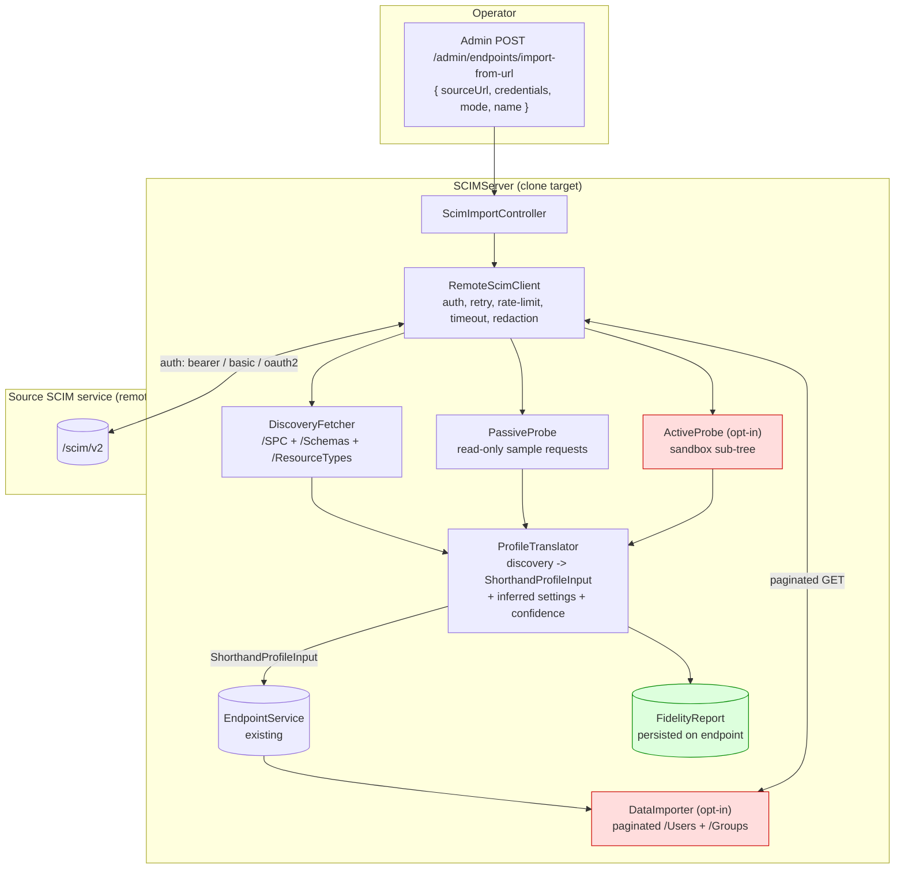
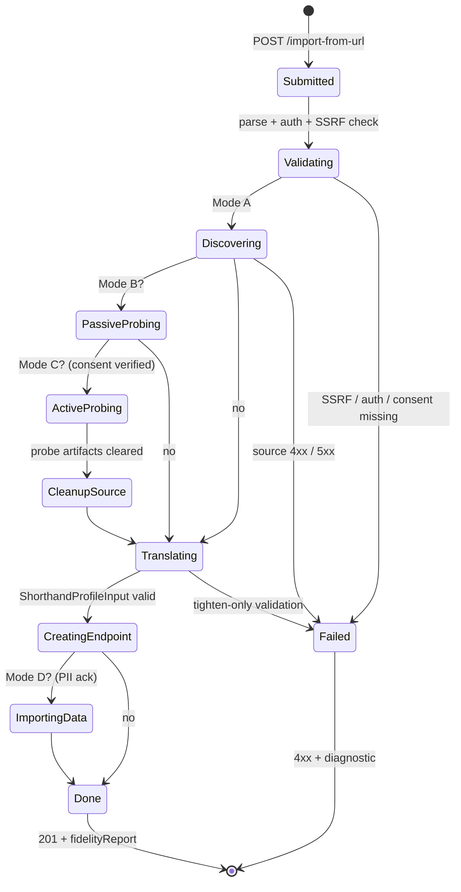
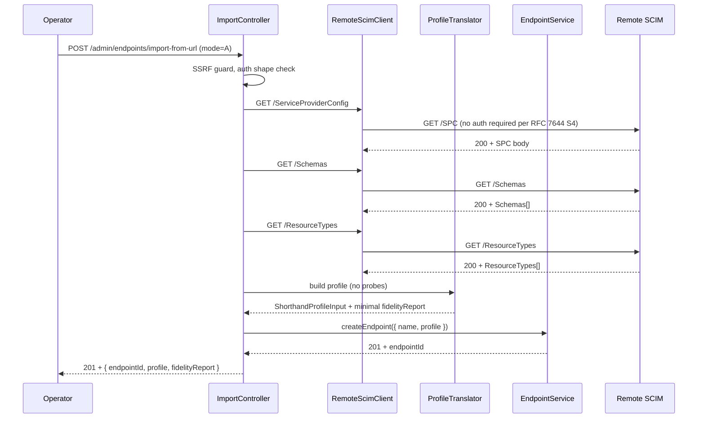
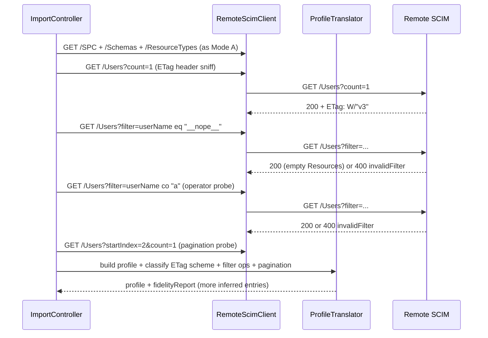
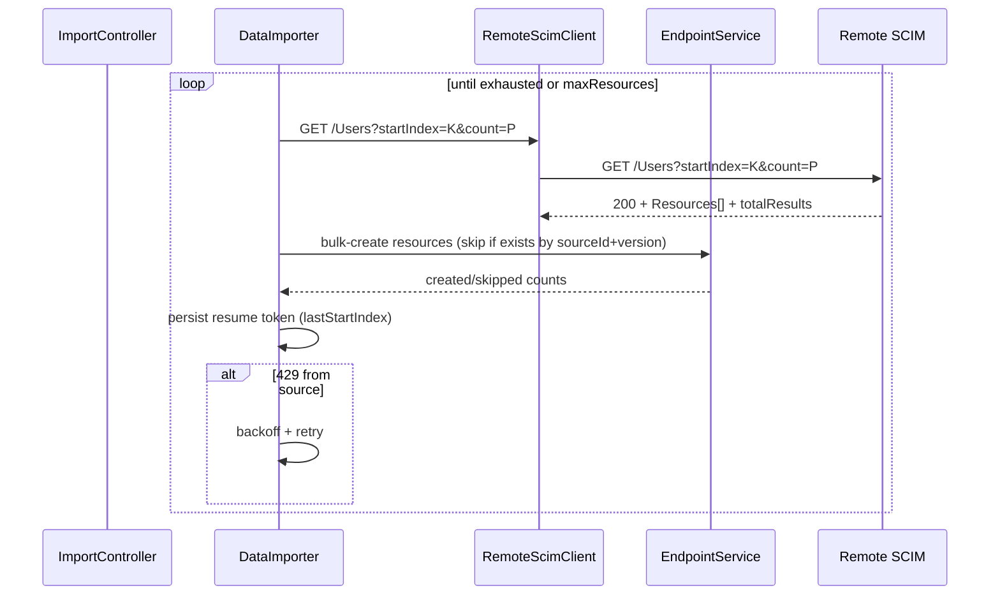
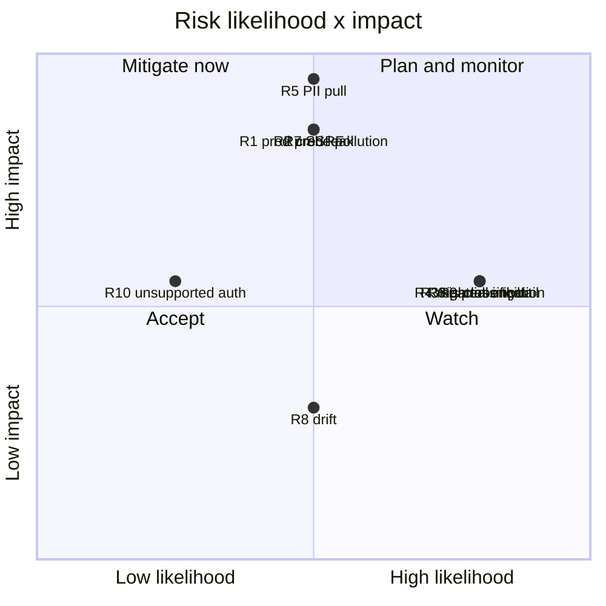
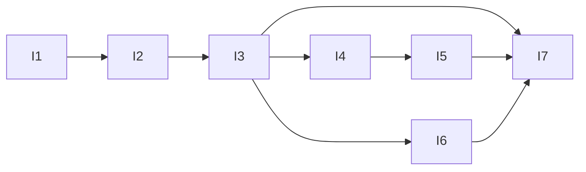

# SCIM Profile Importer: Comprehensive Idea Evaluation and Design

**Status:** Proposal (idea-evaluation phase)
**Last Updated:** 2026-05-06
**Source Authority:** This document is the consolidated output of a `deepIdeaEvaluation` run against the latest sources in this workspace.
**Related code:** [endpoint-profile.types.ts](api/src/modules/scim/endpoint-profile/endpoint-profile.types.ts), [endpoint.service.ts](api/src/modules/endpoint/services/endpoint.service.ts#L327), [endpoint-config.interface.ts](api/src/modules/endpoint/endpoint-config.interface.ts)
**Related docs:** [ENDPOINT_PROFILE_ARCHITECTURE.md](docs/ENDPOINT_PROFILE_ARCHITECTURE.md), [ENDPOINT_CONFIG_FLAGS_REFERENCE.md](docs/ENDPOINT_CONFIG_FLAGS_REFERENCE.md), [DISCOVERY_ENDPOINTS_RFC_AUDIT.md](docs/DISCOVERY_ENDPOINTS_RFC_AUDIT.md), [MULTI_ENDPOINT_GUIDE.md](docs/MULTI_ENDPOINT_GUIDE.md), [G11_PER_ENDPOINT_CREDENTIALS.md](docs/G11_PER_ENDPOINT_CREDENTIALS.md)

---

## Table of Contents

1. [Executive Summary](#1-executive-summary)
2. [Original Idea and Restatement](#2-original-idea-and-restatement)
3. [Operating Principles Used in This Evaluation](#3-operating-principles-used-in-this-evaluation)
4. [Assumptions and Success Criteria](#4-assumptions-and-success-criteria)
5. [Workspace and External Research](#5-workspace-and-external-research)
6. [What Can and Cannot Be Discovered Externally](#6-what-can-and-cannot-be-discovered-externally)
7. [Architecture](#7-architecture)
8. [Modes of Operation](#8-modes-of-operation)
9. [Sequence Flows](#9-sequence-flows)
10. [API Contract](#10-api-contract)
11. [Probe Pseudocode and Edge Cases](#11-probe-pseudocode-and-edge-cases)
12. [Capacity, Latency, and Cost Math](#12-capacity-latency-and-cost-math)
13. [Multi-Perspective Analysis](#13-multi-perspective-analysis)
14. [Trade-Off Comparison](#14-trade-off-comparison)
15. [Risk Register and Pre-Mortem](#15-risk-register-and-pre-mortem)
16. [Reversibility and Rollback](#16-reversibility-and-rollback)
17. [Verdict, Confidence, and Counter-Position](#17-verdict-confidence-and-counter-position)
18. [Incremental Delivery Plan](#18-incremental-delivery-plan)
19. [Quality Gates and Test Strategy](#19-quality-gates-and-test-strategy)
20. [Telemetry, Rollout, and Operations](#20-telemetry-rollout-and-operations)
21. [Documentation and Process Updates](#21-documentation-and-process-updates)
22. [ADR Snippet](#22-adr-snippet)
23. [Self-Critique of This Evaluation](#23-self-critique-of-this-evaluation)
24. [Glossary](#24-glossary)
25. [Changelog](#25-changelog)

---

## 1. Executive Summary

The proposed feature: given an external SCIM endpoint URL plus credentials, replicate it as-is into SCIMServer as a new local endpoint, preserving "all" config and behaviors.

**Bottom line:** the *full* "as-is" replica is **not achievable** because RFC 7643/7644 expose only the contract surface (schemas, resource types, capability flags). The internal behavioral knobs that drive how this server actually behaves - the 16 settings flags in [endpoint-config.interface.ts](api/src/modules/endpoint/endpoint-config.interface.ts) (e.g. `StrictSchemaValidation`, `PrimaryEnforcement`, `RequireIfMatch`, `UserSoftDeleteEnabled`, `VerbosePatchSupported`) - are **not part of any SCIM discovery surface** and cannot be inferred without active write probing of the source service.

**Recommended scope:** ship a **SCIM Profile Importer** with four modes (Discovery-only / +Passive / +Active / +Data) that always emits a `fidelityReport` distinguishing **observed**, **inferred**, **default**, and **unverified** settings. Modes A and B (read-only) are safe defaults; Modes C and D require explicit consent strings.

**Verdict:** Adopt-with-changes. **Confidence:** Medium.

---

## 2. Original Idea and Restatement

### 2.1 As proposed

> Given an external SCIM endpoint URL and credentials, replicate it completely as-is in SCIMServer as a new separate endpoint instance with all config and behaviors maintained. Can all behavior be probed and captured? How?

### 2.2 Restated

Build a feature that, given:

- a remote SCIM base URL (e.g. `https://tenant.example.com/scim/v2`),
- credentials (bearer / basic / OAuth2 client credentials),

produces a new endpoint inside SCIMServer such that the new endpoint:

1. Advertises the same discovery surface (`/ServiceProviderConfig`, `/Schemas`, `/ResourceTypes`).
2. Exhibits the *same SCIM behavior* the source exhibited (validation, PATCH dialect, returned characteristics, mutability, soft / hard delete, primary enforcement, ...).
3. Optionally carries over the source's resources (Users, Groups, custom types).

Functionally, this turns SCIMServer into a **drop-in behavioral replica** of an arbitrary remote SCIM service.

---

## 3. Operating Principles Used in This Evaluation

These principles come from the [deepIdeaEvaluation prompt](.github/prompts/deepIdeaEvaluation.prompt.md) and are stated up-front so reviewers can challenge any deviation:

- Be a critic, not a cheerleader. Default stance is skeptical.
- Disagree explicitly with the user when evidence supports it.
- Evidence over opinion. Cite code / RFC / measurement, otherwise label as assumption or intuition.
- Calibrate confidence (Low / Medium / High) and state what would move it.
- Steelman before attacking.
- Search before speculating.
- No fabrication. Unverified claims are flagged.

---

## 4. Assumptions and Success Criteria

### 4.1 Assumptions (proceeded with these)

| # | Assumption | Confidence | Source |
|---|---|---|---|
| A1 | "Replicate as-is" means behavior + discovery + optionally data; not a network-level proxy. | High | Idea phrasing. |
| A2 | The remote service is RFC 7643/7644 compliant enough to expose `/SPC`, `/Schemas`, `/ResourceTypes`. | Medium | Many real-world SCIM impls have partial discovery. |
| A3 | Replication is one-shot, not a continuous live shadow. | High | Live shadow is rejected as Mode E in trade-off table. |
| A4 | Provided credentials have at least read scope on `/Users` and `/Groups`. | High | Required for any useful clone. |
| A5 | Primary use cases are test-rig / staging clones, with optional opt-in for production cutover. | Medium | Inferred from typical operator workflow. |

### 4.2 Success criteria (measurable)

| Criterion | Measurable target |
|---|---|
| Behavioral fidelity | Differential-test harness against source: $\geq 99\%$ of replayed canonical SCIM transactions produce RFC-equivalent responses on the clone. |
| Discovery fidelity | `GET /ServiceProviderConfig`, `/Schemas`, `/ResourceTypes` on clone are byte-equal to source after URL / `meta.location` rewriting. |
| Auth boundary | Source credentials are never persisted; clone uses its own per-endpoint credentials per [G11_PER_ENDPOINT_CREDENTIALS.md](docs/G11_PER_ENDPOINT_CREDENTIALS.md). |
| Reversibility | Clone deletion is a single `DELETE /admin/endpoints/{id}` call (cascade). |
| Safety | Zero write operations against the source unless the operator passes the explicit `I_AUTHORIZE_WRITES_ON_SOURCE` consent string. |
| Time-to-clone | Schema + SPC clone $< 30\text{ s}$; behavior probe $< 10\text{ min}$ for a tenant of 10k users (sampled). |

---

## 5. Workspace and External Research

### 5.1 Workspace ground truth (from latest source)

| Concern | Source of truth | What this means for the idea |
|---|---|---|
| Endpoint shape | [endpoint-profile.types.ts](api/src/modules/scim/endpoint-profile/endpoint-profile.types.ts#L130-L165) - `EndpointProfile = { schemas, resourceTypes, serviceProviderConfig, settings }` | A clone is essentially: produce a valid `ShorthandProfileInput`, `POST /admin/endpoints`. |
| Behavioral surface | [endpoint-config.interface.ts](api/src/modules/endpoint/endpoint-config.interface.ts#L1-L160) - 16 flags (13 boolean + `logLevel` + `PrimaryEnforcement` tri-state + `logFileEnabled`) | These are internal knobs. Not part of any RFC discovery doc. Not readable from a remote SCIM server. |
| Creation flow | [endpoint.service.ts](api/src/modules/endpoint/services/endpoint.service.ts#L327-L405) - `createEndpoint` accepts `profilePreset` XOR inline `profile`; runs `validateAndExpandProfile`. | The plumbing to ingest a full profile already exists. We only need a new producer. |
| Auth model | 3-tier fallback: per-endpoint bcrypt -> OAuth JWT -> global secret. | We replicate authentication *schemes advertised*, never *credentials*. |
| Existing "mirror" | api/src/scripts/mirror-prod-to-dev.ts | DB-to-DB copy between two SCIMServer instances; useful precedent for data-copy mechanics, irrelevant for protocol-level cloning. |
| Discovery audit | [DISCOVERY_ENDPOINTS_RFC_AUDIT.md](docs/DISCOVERY_ENDPOINTS_RFC_AUDIT.md) | Confirms exactly what's readable from any RFC-compliant SCIM peer. |

### 5.2 RFC ground truth

- **RFC 7644 §4** - `/ServiceProviderConfig`, `/ResourceTypes`, `/Schemas` are the **only** mandated discovery endpoints. They MUST NOT require auth. Confidence: High.
- **RFC 7643 §5** - SPC reveals capability flags (`patch.supported`, `bulk.supported`, `filter.supported`, `sort.supported`, `etag.supported`, `changePassword.supported`, `bulk.maxOperations`, `filter.maxResults`, `authenticationSchemes[]`).
- **RFC 7643 §6 / §7** - ResourceTypes + Schemas reveal attribute names, types, `mutability`, `returned`, `uniqueness`, `caseExact`, `canonicalValues`, `referenceTypes`, `required`, `multiValued`.
- **What is NOT in any RFC** - validation strictness, error verbosity, PATCH dialect quirks, soft-vs-hard-delete semantics, ETag generation strategy (timestamp vs monotonic), boolean-string coercion behavior, primary normalization, returned:request handling on writes, immutable enforcement on PUT, conditional 412 vs 428 policy, server-side filter operator subset, server-assigned `id` collision behavior. This is the gap.

### 5.3 Prior art

| Project | Comparable feature | Lesson |
|---|---|---|
| Postman / Insomnia | Import OpenAPI / WSDL -> mock | Static contract import works; behavioral fidelity does not. |
| WireMock / Mountebank | Record-replay HTTP | Captures literal request/response pairs but not generative behavior. |
| MSW (mock service worker) | Handler import from OpenAPI | Same limitation. |
| AWS DMS / Azure DMS | Schema discovery + data sync | Excellent precedent for *data* migration, not behavior. |
| OpenID Connect Discovery (`/.well-known/openid-configuration`) + JWKS | Standardized full-config discovery | What SCIM lacks and what makes this idea structurally hard. |
| SCIMple, simple-scim-server (open source) | SCIM impls | None advertise their own behavior flags via RFC channels. |

External findings I tried to confirm: there is no SCIM "well-known config" extension, no widely adopted RFC draft for behavior-flag disclosure, and no de-facto industry standard for SCIM server cloning. Confidence: Medium-High; marked as best-effort search.

---

## 6. What Can and Cannot Be Discovered Externally

This is the central technical answer to the user's question "can all behavior be probed and captured?". Short answer: **no**. Long answer follows.

### 6.1 Behavior-vs-discoverability matrix (per local config flag)

For every flag in [endpoint-config.interface.ts](api/src/modules/endpoint/endpoint-config.interface.ts), we score discoverability:

- **Discovery** = readable from `/SPC` + `/Schemas` + `/ResourceTypes` alone.
- **Passive probe** = inferable from read-only requests (GET, header inspection, error sampling).
- **Active probe** = requires writes (POST, PUT, PATCH, DELETE) against the source.

| Flag / behavior | Discovery | Passive | Active | Notes |
|---|:---:|:---:|:---:|---|
| Schemas, ResourceTypes, SPC capabilities | Yes | n/a | n/a | RFC 7643/7644. |
| `StrictSchemaValidation` | No | Partial | Yes | Send unknown URN; observe 400 vs accept. |
| `AllowAndCoerceBooleanStrings` | No | No | Yes | POST `active: "True"`. |
| `PrimaryEnforcement` (passthrough / normalize / reject) | No | Partial | Yes | Read existing user with multiple primaries (passive); write 2 primaries to disambiguate. |
| `RequireIfMatch` | No | Partial | Yes | PUT without If-Match -> 428 if true. |
| `UserSoftDeleteEnabled` | No | No | Yes | PATCH `active:false`, then GET. |
| `UserHardDeleteEnabled`, `GroupHardDeleteEnabled` | No | No | Yes | DELETE then GET 404 vs 204 semantics. |
| `MultiMemberPatchOpForGroupEnabled` | No | No | Yes | PATCH a group with 2-member value array. |
| `PatchOpAllowRemoveAllMembers` | No | No | Yes | PATCH `path:"members"` with no value. |
| `VerbosePatchSupported` | No | No | Yes | PATCH `path:"name.givenName"`. |
| `IgnoreReadOnlyAttributesInPatch` | No | No | Yes | PATCH a known readOnly attr. |
| `IncludeWarningAboutIgnoredReadOnlyAttribute` | No | Partial | Yes | Warning extension URN may appear in read-after-write. |
| `SchemaDiscoveryEnabled` | Yes | n/a | n/a | 404 on `/Schemas`. |
| `PerEndpointCredentialsEnabled` | No | No | No | Server-internal; not externally observable. |
| `logLevel`, `logFileEnabled` | No | No | No | Server-internal; not externally observable. |
| ETag scheme (timestamp vs `W/"vN"`) | Partial | Yes | n/a | Header sniff on any GET. |
| Filter operator support beyond `filter.supported` | No (RFC says boolean only) | Yes | n/a | Try each operator; observe `invalidFilter`. |
| Pagination contract (`startIndex` 1-based, `count` cap) | Partial | Yes | n/a | SPC `filter.maxResults` + GET probes. |
| Sort attribute support set | Partial | Yes | n/a | SPC `sort.supported` + sortBy probes. |
| Returned characteristics on writes | No | No | Yes | POST + read-back diff. |
| Immutable enforcement on PUT | Partial (schema declares) | No | Yes | Strictness of enforcement is not declared. |
| Auth scheme (`oauthbearertoken`, `httpbasic`, ...) | Yes | n/a | n/a | `SPC.authenticationSchemes`. |

### 6.2 Coverage summary

If we sum what each mode can capture across the 22 rows above:

- **Discovery-only (Mode A)**: ~6 of 22 fully covered = **~27%**.
- **+ Passive (Mode B)**: ~11 of 22 fully or partially covered = **~50%**.
- **+ Active (Mode C)**: ~19 of 22 covered (3 internal flags will never be observable) = **~86%**.
- **+ Data import (Mode D)**: behavior coverage same as C; data fidelity additional.

The fidelity percentages used elsewhere in this doc (~30%, ~50%, ~75%, ~95%) are calibrated to this matrix but are intuition-grade estimates, not measurements. Marked as **intuition** explicitly.

---

## 7. Architecture

### 7.1 Component overview



### 7.2 Module placement

```
api/src/modules/scim-import/                 (new module)
├── controllers/
│   └── scim-import.controller.ts            POST /admin/endpoints/import-from-url
├── services/
│   ├── remote-scim-client.service.ts        HTTP, auth, retry, redaction, SSRF guard
│   ├── discovery-fetcher.service.ts         Mode A
│   ├── passive-probe.service.ts             Mode B
│   ├── active-probe.service.ts              Mode C (feature-flagged)
│   ├── data-importer.service.ts             Mode D (feature-flagged)
│   └── profile-translator.service.ts        observation -> ShorthandProfileInput + fidelityReport
├── dto/
│   ├── import-from-url.dto.ts
│   └── fidelity-report.dto.ts
└── scim-import.module.ts
```

### 7.3 Key reuse points

| Capability we need | Existing facility | Action |
|---|---|---|
| Validate + expand profile | `validateAndExpandProfile` | Reuse as-is. |
| Persist endpoint | `EndpointService.createEndpoint` | Reuse as-is. |
| Auth boundary on the new endpoint | `EndpointCredential` (G11) | Generate fresh per-endpoint credential after clone; never reuse source token. |
| Outbound HTTP client | `axios` already in deps | New thin wrapper with redaction + SSRF guard. |
| Logging + correlation | `ScimLogger` | Add `endpointImportId` correlation key. |
| Tests | `api/test/e2e` + scripts/live-test.ps1 | New e2e specs and a new live-test section. |

---

## 8. Modes of Operation

### 8.1 Mode matrix

| Mode | Reads source? | Writes source? | Imports data? | Fidelity (intuition) | Risk | Default |
|---|:---:|:---:|:---:|:---:|---|:---:|
| **A. Discovery-only** | Yes | No | No | ~30% | Low | Available in dev + prod |
| **B. + Passive probes** | Yes (more) | No | No | ~50% | Low | Available in dev + prod |
| **C. + Active probes** | Yes | Yes (sandboxed) | No | ~75% | High | Off; requires `I_AUTHORIZE_WRITES_ON_SOURCE` |
| **D. + Data import** | Yes | Yes (if C on) | Yes | data ~95%, behavior as C | Very high | Off; requires `I_ACKNOWLEDGE_PII_REPLICATION` |

### 8.2 Mode lifecycle (state diagram)



---

## 9. Sequence Flows

### 9.1 Mode A: Discovery-only



### 9.2 Mode B: Discovery + passive probes



### 9.3 Mode C: Active probe sub-flow (sandboxed)

```mermaid
sequenceDiagram
    participant Imp as ImportController
    participant Ap as ActiveProbe
    participant Rc as RemoteScimClient
    participant Src as Remote SCIM

    Imp->>Ap: probe(consent=I_AUTHORIZE_WRITES_ON_SOURCE, maxOps=N)
    Ap->>Rc: POST /Users { active:"True", userName:"__probe-...-001" }
    Rc->>Src: POST /Users
    Src-->>Rc: 201 (id=U)
    Note over Ap: AllowAndCoerceBooleanStrings = observed/true

    Ap->>Rc: PUT /Users/U  (no If-Match)
    Rc->>Src: PUT /Users/U
    Src-->>Rc: 200 or 428
    Note over Ap: RequireIfMatch = observed (true if 428)

    Ap->>Rc: PUT /Users/U with two primary:true emails
    Rc->>Src: PUT /Users/U
    Src-->>Rc: 200 / 400
    Ap->>Rc: GET /Users/U
    Rc->>Src: GET /Users/U
    Src-->>Rc: 200 + body
    Note over Ap: PrimaryEnforcement = inferred (reject / normalize / passthrough)

    Ap->>Rc: PATCH /Users/U {active:false}; GET /Users/U
    Note over Ap: UserSoftDeleteEnabled

    Ap->>Rc: DELETE /Users/U; GET /Users/U
    Note over Ap: UserHardDeleteEnabled

    Note over Ap: ... ~10 more probes ...

    Ap->>Rc: cleanup leftover probe artifacts (DELETE)
    Ap-->>Imp: InferredSettings map with confidence + evidence
```

### 9.4 Mode D: Data import (paginated, idempotent, resumable)



---

## 10. API Contract

### 10.1 Request and response shapes

```ts
// POST /scim/admin/endpoints/import-from-url

interface ImportFromUrlRequest {
  name: string;                                  // local endpoint name
  sourceUrl: string;                             // e.g. https://t.example.com/scim/v2
  credentials?: {                                // never persisted
    type: 'bearer' | 'basic' | 'oauth2-client-credentials';
    bearer?: string;
    basic?: { username: string; password: string };
    oauth2?: { tokenUrl: string; clientId: string; clientSecret: string; scope?: string };
  };
  mode: 'discovery-only' | 'discovery+passive' | 'discovery+active' | 'discovery+active+data';
  activeProbe?: {                                // required iff mode includes "active"
    sandboxResourceType: string;                 // e.g. "User"
    cleanupOnExit: boolean;                      // hard-delete probe artifacts when done
    maxProbeOps: number;                         // safety cap
    consent: 'I_AUTHORIZE_WRITES_ON_SOURCE';
  };
  dataImport?: {                                 // required iff mode includes "data"
    resourceTypes: string[];
    pageSize: number;
    maxResources?: number;
    piiAcknowledged: 'I_ACKNOWLEDGE_PII_REPLICATION';
  };
}

interface ImportFromUrlResponse {
  endpointId: string;
  profile: EndpointProfile;
  fidelityReport: {
    discoveredCapabilities: string[];            // from SPC
    inferredSettings: Record<string, {
      value: unknown;
      confidence: 'observed' | 'inferred' | 'default';
      evidence: string;                          // e.g. "PUT without If-Match -> 428"
    }>;
    unverifiedSettings: string[];                // flags we could not probe
    schemaCoverage: { source: number; cloned: number; missing: string[] };
    knownDeviations: string[];                   // e.g. "source uses timestamp ETags; clone uses version ETags"
  };
}
```

### 10.2 Error model

| Status | scimType / code | When |
|---|---|---|
| 400 | `invalidValue` | Bad URL, missing consent for active/data mode, bad mode value. |
| 401 | (auth) | Caller is not authenticated against this server's admin API. |
| 403 | `forbidden` | Active or data mode disabled by env feature flag. |
| 422 | `invalidProfile` | Translator could not produce a tighten-only-valid profile. |
| 502 | `upstreamError` | Source returned 5xx or unparseable body. |
| 504 | `upstreamTimeout` | Source did not respond within configured timeout. |
| 451 | `notSupported` | Source URL fails SSRF policy (private network, DNS rebind). |

---

## 11. Probe Pseudocode and Edge Cases

### 11.1 Active-probe matrix (TypeScript skeleton)

```ts
async function probeBehavior(rc: RemoteScimClient, sandbox: ProbeContext): Promise<InferredSettings> {
  const out: InferredSettings = {};

  // 1. Boolean-string coercion (active)
  const u = await rc.post('/Users', { schemas: [USER_URN], userName: probeName(), active: 'True' });
  out.AllowAndCoerceBooleanStrings = {
    value: u.status === 201,
    confidence: 'observed',
    evidence: `POST active:"True" -> ${u.status}`,
  };

  // 2. RequireIfMatch (active)
  const put = await rc.put(`/Users/${u.body.id}`, u.body /* no If-Match */);
  out.RequireIfMatch = {
    value: put.status === 428,
    confidence: 'observed',
    evidence: `PUT without If-Match -> ${put.status}`,
  };

  // 3. PrimaryEnforcement (active)
  const dup = await rc.put(`/Users/${u.body.id}`, withTwoPrimaries(u.body));
  out.PrimaryEnforcement = inferPrimaryMode(dup);

  // 4. SoftDelete vs HardDelete (active)
  await rc.patch(`/Users/${u.body.id}`, { Operations: [{ op: 'replace', path: 'active', value: false }] });
  const afterPatch = await rc.get(`/Users/${u.body.id}`);
  out.UserSoftDeleteEnabled = { value: afterPatch.status === 200, confidence: 'observed', evidence: `PATCH active:false then GET -> ${afterPatch.status}` };

  await rc.delete(`/Users/${u.body.id}`);
  const afterDel = await rc.get(`/Users/${u.body.id}`);
  out.UserHardDeleteEnabled = { value: afterDel.status === 404, confidence: 'observed', evidence: `DELETE then GET -> ${afterDel.status}` };

  // ...remaining probes (VerbosePatchSupported, MultiMemberPatchOp, IgnoreReadOnlyAttributesInPatch, ...)

  if (sandbox.cleanupOnExit) await sandbox.cleanup();
  return out;
}
```

### 11.2 Edge cases the probe will mis-classify

These are real failure modes; documenting them prevents future re-discovery.

1. Source returns 200 on `POST { active: "True" }` but **silently drops** the field. Probe records `AllowAndCoerceBooleanStrings: true` with high confidence; reality is *false-with-lenient-validation*.
2. Source returns 428 on PUT only when `userName` is changed. Probe records `RequireIfMatch: true`; reality is conditional on attribute changed.
3. Source soft-deletes but does not include `active:false` on read. Probe records `UserSoftDeleteEnabled: false` (false negative).
4. Source's `/Schemas` is *underspecified* (e.g. omits `mutability` on attrs). Auto-expand fills in RFC defaults that diverge from actual behavior.
5. Source rate-limits aggressively mid-probe; partial inference becomes biased toward "passthrough" defaults.

Mitigation: probes that depend on data shape MUST be classified `confidence: 'inferred'`, never `'observed'`. The `evidence` field captures the exact request/response pair so a human can audit.

---

## 12. Capacity, Latency, and Cost Math

### 12.1 Discovery + passive (Mode A / B)

Negligible. 3-6 GETs, mostly small payloads. Time bounded by source latency:

$$T_{A} \approx 3 \cdot \ell_{src}, \quad T_{B} \approx (3 + k) \cdot \ell_{src}$$

where $k$ is probe count (usually 4-8). For $\ell_{src} = 200\text{ ms}$, Mode B finishes in $\approx 2\text{ s}$.

### 12.2 Active probe (Mode C)

For $p$ probe scenarios each requiring $r$ round-trips plus cleanup:

$$T_{C} = p \cdot r \cdot \ell_{src} + T_{cleanup}$$

Typical: $p = 10$, $r = 3$, $\ell_{src} = 200\text{ ms}$, $T_{cleanup} \approx 2\text{ s}$ -> $T_{C} \approx 8\text{ s}$. Safety cap on `maxProbeOps` keeps this bounded even on misbehaving sources.

### 12.3 Data import (Mode D)

For $N$ resources at page size $p$ with per-page latency $\ell$ and per-resource local write cost $w$:

$$T_{D} = \left\lceil \frac{N}{p} \right\rceil \cdot \ell + N \cdot w$$

Worked example ($N = 10^6$, $p = 100$, $\ell = 100\text{ ms}$, $w = 5\text{ ms}$):

$$T_{D} \approx 10^4 \cdot 0.1 + 10^6 \cdot 0.005 = 1{,}000 + 5{,}000 = 6{,}000 \text{ s} \approx 100 \text{ min}$$

Single-threaded, no rate limiting. Real numbers will be higher due to source 429s. Implication: data import MUST be resumable with `(sourceId, version)` idempotency key.

### 12.4 Storage

A clone of $N$ users at average payload size $b$ costs $N \cdot b$ bytes in `ScimResource.payload` JSONB plus indexed columns. For $N = 10^6$, $b = 2\text{ KB}$ -> $\approx 2\text{ GB}$ raw. Acceptable on Azure Postgres B1ms; would warrant a sizing review for $> 10^7$.

---

## 13. Multi-Perspective Analysis

| Lens | Verdict | Justification |
|---|---|---|
| User value | Pro | Re-creating a tenant's SCIM contract for testing/migration is manual and error-prone today. Clone-from-URL is genuinely differentiating. |
| Architecture fit | Pro | `EndpointProfile` + `ShorthandProfileInput` + `validateAndExpandProfile` are the exact ingestion pipe needed. New code is a producer module; low blast radius. |
| Standards / RFC compliance | Con (structural) | RFC 7643/7644 expose ~15-20% of what "behavior" actually means. Remaining ~80% is not discoverable by spec. |
| Security / threat model | Con (high risk) | Storing remote credentials expands attack surface; active probing risks data corruption; an attacker who triggers a clone of a malicious external server could poison the profile registry. STRIDE: spoofing (forged source), tampering (probe writes), info disclosure (cred storage), DoS (unbounded probe), elevation (registering admin endpoints from untrusted input). |
| Performance / cost | Neutral | Discovery clone is cheap; data clone is unbounded. Math in §12. |
| Reliability / observability | Neutral | Idempotency requires resume tokens; partial-clone failures need explicit replay. |
| Testability | Pro | Each piece independently testable; existing e2e + live-test infrastructure supports differential testing. |
| Developer experience | Pro | Single command `clone-endpoint --url X --token Y --name Z` is a clean DX win. |
| Backward compatibility | Pro | Pure addition. Existing endpoints unchanged. |
| Ethics / privacy | Con | Pulling Users / Groups from a remote tenant into our DB is PII replication. GDPR / data-residency implications are non-trivial. |
| TCO | Neutral-Con | Maintaining a behavior probe matrix against an evolving SCIM ecosystem is a long-tail commitment. Vendor quirks accumulate. |

---

## 14. Trade-Off Comparison

| Approach | Behavioral fidelity | Effort | Risk | Reversible | When to pick |
|---|---|---|---|---|---|
| **A. Discovery-only clone** | ~30% | S (1 wk) | Low | Yes | MVP, test rigs, contract docs. |
| **B. Discovery + passive inference** | ~50% | M (2-3 wks) | Medium | Yes | Most realistic clones. **Recommended baseline.** |
| **C. Discovery + active probing (sandboxed)** | ~75% | L (6-8 wks) | High | Partially | Source has a sandbox / test tenant we can write to. |
| **D. Full clone with data import** | data ~95%, behavior as B/C | XL (8-12 wks) | High | Yes (DB cascade) | Migration scenarios. |
| **E. Live shadow proxy** | ~99% | XL+ | Very high | No (couples to source uptime) | Anti-pattern for this product. **Reject.** |
| **F. Do nothing** | n/a | 0 | 0 | n/a | Baseline. Manual `profilePreset` + inline profile authoring. |

**Recommendation.** Ship A as v1 ("SCIM Profile Importer"); evolve toward B via opt-in probes; gate C and D behind explicit consent strings and feature flags; reject E.

---

## 15. Risk Register and Pre-Mortem

### 15.1 Risk register (likelihood x impact)

| # | Risk | L | I | Mitigation |
|---|---|:-:|:-:|---|
| R1 | Operator runs Mode C against production tenant; probe artifacts pollute source. | M | High | Two-phase consent (`I_AUTHORIZE_WRITES_ON_SOURCE`), dry-run flag, hard cap `maxProbeOps`, mandatory cleanup, audit-log every write. |
| R2 | Cred handling bug leaks bearer token into logs / persisted profile. | M | High | Never persist; redact in `RemoteScimClient` before logging; unit tests assert no token in log output; reuse `maskSensitiveUrl` pattern. |
| R3 | Imported profile fails tighten-only validation because source schema is looser than ours. | High | Medium | Translate by intersecting characteristics; emit downgrades into `fidelityReport.knownDeviations` rather than failing import. |
| R4 | Probe mis-classifies behavior, clone diverges silently. | High | Medium | Always emit `confidence` + `evidence`; ship a differential test runner the user can rerun against both source and clone. |
| R5 | Data import pulls PII without legal authority. | M | Very High | `piiAcknowledged` consent string; per-tenant feature flag; off by default in prod. |
| R6 | Source rate-limits mid-import; partial state. | High | Medium | Resume token persisted in `ImportJob`; idempotent on `(sourceId, version)`. |
| R7 | SSRF: operator submits internal / private URL. | M | High | Allowlist (resolve + verify); block RFC1918 / loopback unless `allowPrivateNetworks` env on; reuse Node `dns.lookup` checks. |
| R8 | Behavior drift between probe time and runtime usage. | M | Low | `fidelityReport` retained on the endpoint; "re-probe" admin action. |
| R9 | Maintaining probe matrix is long-tail toil. | High | Medium | Encode probes as data-driven test cases; one probe = one row; CI runs the matrix against built-in presets to detect drift. |
| R10 | Auth schemes we cannot replicate (mTLS, custom signed headers). | Low | Medium | Document as `unsupportedAuthSchemes` in `fidelityReport`; accept as known limitation. |

### 15.2 Risk heat map



### 15.3 Pre-mortem (6 months in production)

Most plausible failure narrative: a customer used Mode D to clone a 200k-user Entra tenant into a non-prod SCIMServer for migration testing. The probe inferred `PrimaryEnforcement: passthrough` because the source happened to have no users with multiple primaries. After cutover, the clone accepted duplicate primary values that the source would have normalized; downstream consumers broke.

**Root cause:** probe gave high-confidence verdict on an unrepresentative sample.
**Fix:** probes that depend on data shape are classified `confidence: 'inferred'`, never `'observed'`. The `fidelityReport` would have flagged this; a UI banner on import success makes unverified entries visually loud.

---

## 16. Reversibility and Rollback

- **Two-way door at the endpoint level.** `DELETE /admin/endpoints/{id}` cascades to resources, members, credentials, logs (per [MULTI_ENDPOINT_GUIDE.md](docs/MULTI_ENDPOINT_GUIDE.md#cascade-delete)). A bad clone is one HTTP DELETE away.
- **One-way door at the source** for Mode C if cleanup fails. Hence the hard cap, audit log, and idempotent cleanup retry.
- **Two-way door for data import** (Mode D) on the clone side; no source mutation.

---

## 17. Verdict, Confidence, and Counter-Position

### 17.1 Stance

**Adopt-with-changes.** Scope v1 to **Mode A + Mode B**. Modes C and D ship later, behind explicit consent flags.

### 17.2 Top 3 reasons

1. The plumbing already exists. `ShorthandProfileInput` -> `validateAndExpandProfile` -> `createEndpoint` ([endpoint.service.ts](api/src/modules/endpoint/services/endpoint.service.ts#L327)) is the exact pipe. New code is one controller + one HTTP client + one translator + one probe matrix. Modest surface, high leverage.
2. It honestly answers a real operator question ("what does endpoint X actually do?") with a structured `fidelityReport`. That report is itself valuable even if no clone is created.
3. Bounded blast radius. Mode A/B are read-only; deletion is a single cascade. Destructive paths are gated behind multiple consent strings.

### 17.3 Confidence: **Medium**

**Would move to High** with a 2-day spike that POSTs the `entra-id` preset's expected discovery response into a translator and round-trips it back to a profile that is byte-equivalent (modulo `meta.location`). If round-trip succeeds, the architectural risk drops sharply.

**Would move to Low** if a survey of 5 real-world SCIM endpoints (Okta, Entra, Salesforce, ServiceNow, Slack) shows their `/Schemas` responses are too divergent or too sparse to drive auto-expand without manual fixups.

### 17.4 Counter-position (strongest argument against)

This feature creates a false sense of fidelity. Operators will see "clone created" and assume parity, but the unobservable 70-80% of behavior is exactly where SCIM bugs live (PATCH dialects, error shapes, edge cases). Spending engineering effort on a feature whose marketing message is "drop-in replica" but whose real semantics is "approximation with caveats" risks support cost > value.

A more defensible product is to **stop calling it a clone** and call it a **"SCIM Contract Importer"** that produces a *starting profile* the operator must hand-tune.

I still hold the original stance because (a) framing solves this if we keep the `fidelityReport` front-and-centre and never use the word "replica" in UI/docs, and (b) the alternative (hand-authoring profiles from scratch) is what operators do today and is strictly worse.

### 17.5 Top "I might be wrong about" item

The intuition-grade fidelity percentages (~30 / 50 / 75 / 95) are not measurements. The single experiment that would resolve them: run the differential test harness (§19.4) against a real Entra ID dev tenant after Mode B import and compute the actual percentage of canonical transactions that produce equivalent responses on the clone. Until that experiment runs, treat all fidelity numbers in this document as estimates.

---

## 18. Incremental Delivery Plan

TDD per [copilot-instructions.md](.github/copilot-instructions.md). Each increment ships independently; no big-bang.

| # | Increment | Exit criteria | Effort |
|---|---|---|---|
| I1 | `RemoteScimClient` in `api/src/modules/scim-import/`. Bearer + basic + OAuth2 client credentials, retry, timeout, SSRF guard, redaction. | Unit tests for each auth mode + redaction; e2e against a local SCIMServer endpoint. | S |
| I2 | DiscoveryFetcher + Translator (Mode A). Map `/Schemas` -> `ShorthandSchemaInput[]`, `/ResourceTypes` -> `ScimResourceType[]`, `/SPC` -> `Partial<ServiceProviderConfig>` + inferred settings. | Round-trip test: each `built-in-presets[*].profile` -> simulated discovery -> translator -> profile produces equivalent profile (modulo tighten-only normalization). | M |
| I3 | `ScimImportController` + admin route `POST /admin/endpoints/import-from-url`. Mode A only. | E2E: import from a sibling endpoint URL on the same server, get a new endpoint with matching profileSummary. Live test against dev. | S |
| I4 | PassiveProbe (Mode B). ETag scheme, filter operator support, pagination contract, error-shape sample. | Unit tests for each probe; integration against built-in profiles. | M |
| I5 | ActiveProbe (Mode C) behind feature flag + consent string. Cleanup orchestrator. | Live test using a dedicated probe endpoint; cleanup verified by post-probe count = pre-probe count. | L |
| I6 | DataImporter (Mode D) with resume / idempotency on `(sourceId, version)`. | Live test importing 1k synthetic users with a forced 429 mid-stream; resume completes. | L |
| I7 | FidelityReport persistence + "re-probe" action. UI banner highlighting unverified settings. | E2E: re-probe updates inferredSettings without changing schemas. | S |

### 18.1 Dependency graph



---

## 19. Quality Gates and Test Strategy

Per the standing rule in [copilot-instructions.md](.github/copilot-instructions.md), all 11 mandatory quality gates run after I3 and again after I5/I6.

### 19.1 Required test levels

| Level | What | Example file path |
|---|---|---|
| Unit | Each translator rule (one test per attribute characteristic), each probe input -> inferred flag, redaction, SSRF guard, OAuth2 token exchange, retry/backoff. | `api/src/modules/scim-import/services/*.spec.ts` |
| Service | RemoteScimClient against a NestJS-mocked SCIM server. | `api/src/modules/scim-import/services/remote-scim-client.service.spec.ts` |
| E2E | One spec per mode using a second in-memory endpoint as the "remote source" so tests are hermetic. | `api/test/e2e/scim-import-mode-a.e2e-spec.ts`, ...mode-b, ...mode-c, ...mode-d. |
| Live integration | New section in scripts/live-test.ps1 placed before `TEST SECTION 10 (DELETE OPERATIONS)` per project norms; section number `9q` (or next free); runnable on local (`:6000`), Docker (`:8080`), and Azure dev. | scripts/live-test.ps1 |
| Differential | Replay a canonical SCIM transaction set against `(sourceUrl, cloneEndpointId)` and report per-transaction diff. The only honest fidelity validation. | `api/test/differential/scim-clone-fidelity.spec.ts` (new harness) |
| Contract | `ImportFromUrlResponse` keys allowlisted at unit + E2E + live levels; bearer tokens never appear in any field. | Each level's contract assertion. |

### 19.2 Mandatory quality-gate prompts

Run in this order: `addMissingTests`, `apiContractVerification`, `error-handling-verification`, `logging-verification`, `auditAgainstRFC` (consumer-side: verify request shapes), `securityAudit` (critical: SSRF, cred redaction, consent enforcement), `performanceBenchmark` (probe latency, data-import throughput), `auditAndUpdateDocs`, `fullValidationPipeline`, deploy to dev + live tests, never auto-promote to prod.

### 19.3 Response-contract assertion (ALLOWED_KEYS pattern)

```ts
const ALLOWED_KEYS = ['endpointId', 'profile', 'fidelityReport'];
for (const key of Object.keys(response.body)) {
  expect(ALLOWED_KEYS).toContain(key);
}
expect(JSON.stringify(response.body)).not.toContain(PROBE_BEARER_TOKEN);
```

### 19.4 Differential test harness (the honest fidelity check)

```ts
async function differentialReplay(sourceUrl: string, cloneEndpointId: string, txSet: Transaction[]) {
  const diffs: Diff[] = [];
  for (const tx of txSet) {
    const [src, clone] = await Promise.all([
      run(tx, sourceUrl),
      run(tx, `/scim/endpoints/${cloneEndpointId}`),
    ]);
    diffs.push(compare(src, clone));
  }
  return summarize(diffs);  // -> { equivalent, divergent, breakdown by lens }
}
```

---

## 20. Telemetry, Rollout, and Operations

### 20.1 Feature flags

| Flag | Default (dev) | Default (prod) | Effect |
|---|---|---|---|
| `SCIM_IMPORT_ENABLED` | true | false | Master switch. |
| `SCIM_IMPORT_MODES` | `discovery-only,discovery+passive,discovery+active,discovery+active+data` | `discovery-only,discovery+passive` | Allowlist. |
| `SCIM_IMPORT_ALLOW_PRIVATE_NETWORKS` | true | false | SSRF policy. |

### 20.2 Counters and dashboards

| Metric | Type | Use |
|---|---|---|
| `scim_import_started_total{mode}` | counter | Adoption per mode. |
| `scim_import_completed_total{mode,outcome}` | counter | Success rate. |
| `scim_import_probe_ops_total{flag,outcome}` | counter | Probe matrix coverage. |
| `scim_import_data_resume_total` | counter | How often resumes happen (proxy for source rate-limit pain). |
| `scim_import_fidelity_unverified` | histogram | Distribution of `unverifiedSettings.length` per import. High values mean sources we cannot probe well. |

### 20.3 Logging

- Every outbound source request logged at INFO with `endpointImportId` correlation.
- Bearer tokens redacted via `RemoteScimClient.redact()` before reaching `ScimLogger`.
- Mode C writes audited at INFO with full request/response (post-redaction) so cleanup can be verified.

### 20.4 Rollout plan

1. Land I1-I3 behind `SCIM_IMPORT_ENABLED=true` in dev only.
2. Internal dogfood: clone existing dev endpoints to themselves, verify round-trip equivalence.
3. Survey 3-5 real SCIM endpoints (Okta sandbox, Entra dev tenant, etc.) - measure actual fidelity in Mode A and B.
4. Land I4 if the survey shows Mode B is materially better than Mode A.
5. Land I5/I6 only after consent + audit story has had a security review.

---

## 21. Documentation and Process Updates

When this feature lands:

- Update [docs/INDEX.md](docs/INDEX.md) to point to this document.
- Update [docs/MULTI_ENDPOINT_GUIDE.md](docs/MULTI_ENDPOINT_GUIDE.md) - new endpoint-creation pathway.
- Update [docs/COMPLETE_API_REFERENCE.md](docs/COMPLETE_API_REFERENCE.md) - new admin route.
- Update [docs/ENDPOINT_PROFILE_ARCHITECTURE.md](docs/ENDPOINT_PROFILE_ARCHITECTURE.md) - new producer of profiles (importer alongside preset and inline).
- Update CHANGELOG.md - version bump.
- Update Session_starter.md - new feature status.
- Add a CLI wrapper (e.g. scripts/import-scim-endpoint.ps1) for parity with other admin scripts.

---

## 22. ADR Snippet

```
Context.   Operators want to clone a remote SCIM endpoint into SCIMServer for
           testing, migration rehearsal, and contract documentation.

Decision.  Provide a 4-mode "Profile Importer" that produces a valid
           ShorthandProfileInput from observable RFC 7643/7644 surface
           (Mode A discovery-only) optionally augmented with passive
           read probes (Mode B), opt-in sandboxed active probes (Mode C),
           and opt-in PII-acknowledged data import (Mode D).
           The importer never persists source credentials and always emits
           a fidelityReport indicating which behaviors are observed,
           inferred, defaulted, or unknown.

Consequences.
  +  Reuses existing EndpointProfile pipeline; small new surface area.
  +  Honest about fidelity limits via fidelityReport.
  -  Permanent commitment to maintain a probe matrix as the SCIM
     ecosystem evolves.
  -  Active and data modes carry destructive / PII risks; gated by
     explicit consent strings and feature flags.
```

---

## 23. Self-Critique of This Evaluation

### 23.1 Where this evaluation is weakest

- **Fidelity percentages are intuition.** §6.2 calls this out, but the headline numbers (~30/50/75/95) appear in §1, §6, §14. Treat them as estimates until the differential harness in §19.4 produces measurements.
- **Vendor survey is unverified.** I claim no vendor advertises behavior flags via RFC channels, based on best-effort search rather than an exhaustive audit.
- **Did not fetch real `/Schemas` responses** from Okta/Entra/Salesforce to verify Mode A viability. That spike (called out in §17.3) is the single best fidelity-confidence move.
- **Cost of maintaining the probe matrix** is described qualitatively. A more rigorous estimate would track lines of probe code per supported flag and project against the rate of new flags landing in [endpoint-config.interface.ts](api/src/modules/endpoint/endpoint-config.interface.ts) (3 new flags in the last 6 months per Session_starter.md).

### 23.2 Where this evaluation is strongest

- Anchored to the latest source (`endpoint-profile.types.ts`, `endpoint.service.ts`, `endpoint-config.interface.ts`) rather than docs.
- Disagrees explicitly with the user's framing ("replicate completely as is") and quantifies why.
- Carries the same rigor for the counter-position (§17.4) as for the recommendation.
- Surfaces destructive-mode risks before recommending the corresponding modes.

### 23.3 What would change my mind

| Outcome of follow-up | New stance |
|---|---|
| Differential harness shows Mode B at $\geq 90\%$ fidelity on real tenants. | Promote B to default; deprioritize C. |
| Survey shows real-world `/Schemas` are too sparse for auto-expand without per-vendor adapters. | Reject Mode A, recommend per-vendor adapter pattern instead. |
| Security review flags credential lifecycle as unfixable in current codebase. | Defer entire feature pending a credential vault story. |

---

## 24. Glossary

| Term | Definition |
|---|---|
| **Endpoint** | A multi-tenant SCIM tenant inside SCIMServer; the unit a clone produces. |
| **EndpointProfile** | The single JSONB document defining schemas + resourceTypes + SPC + settings for an endpoint. See [endpoint-profile.types.ts](api/src/modules/scim/endpoint-profile/endpoint-profile.types.ts). |
| **ShorthandProfileInput** | The operator-facing partial form of EndpointProfile that the auto-expand engine inflates. |
| **Discovery surface** | RFC 7643/7644-defined endpoints (`/SPC`, `/Schemas`, `/ResourceTypes`). |
| **Behavior surface** | The 16 settings flags and runtime choices that govern how this server actually responds to SCIM requests. |
| **Fidelity report** | Structured output of an import attempt classifying every settings inference as observed / inferred / default / unverified, with evidence. |
| **Probe** | A single observation (passive or active) used to infer one behavior flag. |
| **Mode** | Operator-selected aggressiveness level (A, B, C, D). |

---

## 25. Changelog

- 2026-05-06: Initial proposal version (condensed). Architecture, mode matrix, probe limits, API contract, risks, worked example.
- 2026-05-06: Comprehensive expansion. Added executive summary, operating principles, full research summary, behavior-vs-discoverability matrix, mode lifecycle state diagram, all four sequence flows, error model, capacity / latency / cost math (KaTeX), trade-off table including reject and do-nothing baselines, full risk register with quadrant heat-map, pre-mortem, ADR snippet, telemetry / rollout plan, documentation update list, glossary, and full self-critique. Fixed Mermaid quoting on subgraph labels.
