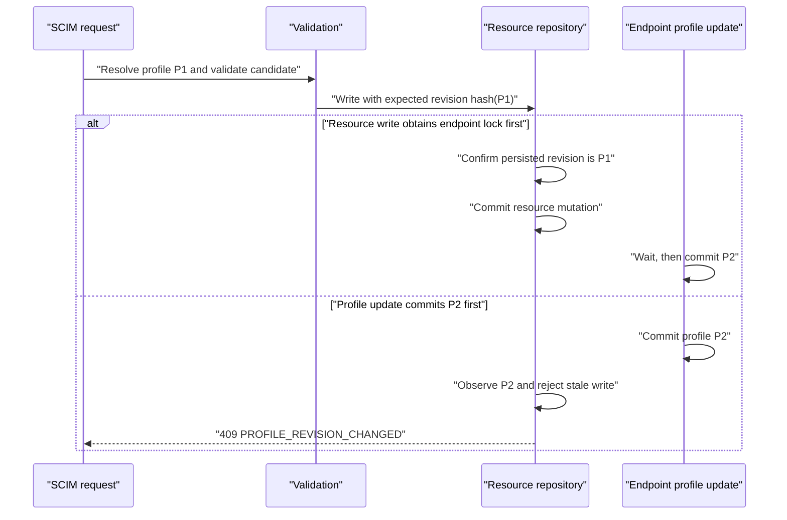

# Endpoint Profile Revision and Resource Write Coordination

> **Status:** Implemented locally, not released or deployed  
> **Last verified:** 2026-09-29  
> **Product version:** `0.55.35`

## Problem

A resource request resolves an endpoint profile before it validates the
candidate. Previously, the profile could change after that validation and
before repository mutation. The late write could then return success even
though it had been evaluated with obsolete schema characteristics or settings.

This is separate from resource ETags. An `If-Match` token coordinates two
writes to one resource. The profile revision coordinates a resource write with
an endpoint-profile update.

## Commit boundary



The request context captures a SHA-256 content revision of the normalized
profile. Object keys are canonicalized recursively, so equivalent JSON object
ordering does not create a false conflict. Arrays remain ordered because schema
and ResourceType array order is part of the persisted profile representation.

### PostgreSQL

Resource mutations and profile updates use the same endpoint-scoped
transaction advisory lock. A resource transaction acquires the lock, reads the
current endpoint profile, compares its content revision, and only then mutates
the resource. This ordering prevents a profile update from committing between
the revision comparison and the resource write.

The existing uniqueness transaction remains authoritative. Profile locking is
added before the resource-type uniqueness lock, giving one consistent lock
order. No schema migration or second transaction framework is introduced.

### InMemory

The existing endpoint write guard now tracks the current profile revision as
well as deletion tombstones. Endpoint cache publication records the new
revision synchronously. User, Group aggregate, and custom-resource repositories
compare the expected revision immediately before publishing their map
mutation.

## Public failure contract

A stale resource mutation returns HTTP 409 with no misleading SCIM
`uniqueness` or `mutability` classification:

```json
{
  "schemas": [
    "urn:ietf:params:scim:api:messages:2.0:Error"
  ],
  "status": "409",
  "detail": "Endpoint profile changed while the resource write was in progress. Read the current endpoint schema and retry.",
  "urn:scimserver:api:messages:2.0:Diagnostics": {
    "errorCode": "PROFILE_REVISION_CHANGED",
    "triggeredBy": "configuration"
  }
}
```

The rejected operation publishes no resource, scalar update, member
replacement, deletion, version increment, or success event. The client must
read current discovery/profile state, rebuild the request deliberately, and
retry. The server does not reinterpret or silently retry a stale candidate.

## Coverage and evidence

| Boundary | Outcome |
|---|---|
| User, Group, and custom create | Controlled pause after validation; profile change wins; each stale create returns 409 and publishes no row |
| User, Group aggregate, and custom replace | Same interleaving; original row, payload, members, version, and timestamp remain unchanged |
| User, Group, and custom delete | Same interleaving; target remains readable and stored |
| InMemory | 9/9 controlled HTTP races pass |
| PostgreSQL 17.8 | 9/9 controlled HTTP races pass after all 22 migrations |
| Optional omitted `schemaExtensions` | Endpoint discovery publishes `[]`; custom POST, GET, PUT, PATCH, DELETE pass; malformed explicit containers still return 400 |
| Affected units | 10 suites / 611 tests pass |
| Combined guarded HTTP lane | 571/571 per backend, zero failed or pending |
| Built runtime | P7b 153 cases / 905 assertions and P7a 472 assertions per backend |

The guarded run used working-tree source fingerprint
`499e06389e887394d3f427ab43b7d232f48272452b718ed594476a35dd88c39c`.
The disposable PostgreSQL container and both exact owned API processes were
removed. See the
[validation receipt](evidence/scim-profile-revision-20260929/validation.json).

## Scope

This change does not alter client resource ETag policy, profile merge policy,
schema declarations, endpoint defaults, database schema, release metadata, or
live data. It does not make a multi-operation Bulk request globally atomic;
each embedded resource mutation is coordinated at its own commit boundary.

**Test/gate improvement: applied.** Presence-level concurrency tests are
insufficient. The permanent tests pause the actual repository call after
validation and assert both the public error and complete stored non-mutation.

**Design/architecture disposition: applied.** One small content-revision
utility and the existing repository transaction/write-guard seams serve three
resource implementations. A new universal repository, policy DSL, or
standalone lock service would duplicate established boundaries.
