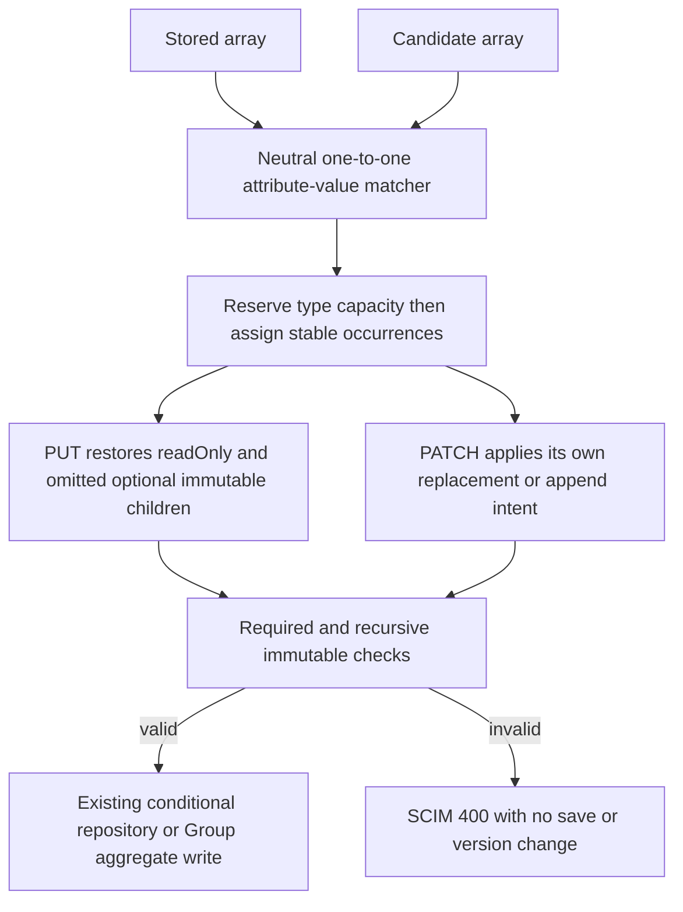

# PUT preserves the right complex-array entry

**Last verified:** 2026-09-29

**Status:** Local fix on committed combined source
`5581e6b73d8ba9fd206ddf92fa303c96c90ba610`. Not pushed, merged or deployed.
Product and lockfile versions are unchanged.

**Current integration:** source`414e14e8` is preserved as`d8c9a79a`.
The earlier assembly fix`b21e44cb` already covered its exact work/home and
anonymous cases. This source contributes additional type-capacity reservation,
stable restored-discriminator pairing and nested immutable traversal.
A direct assertion against the current old helper first reproduced
omitted/changed type stealing the later explicit work match.

[New integration receipt](evidence/scim-retention-stability-integration-20260929/validation.json)
records491 units,509 InMemory/511 PostgreSQL HTTP and164 main built-live
checks/backend, including this6-case/5474-assertion corpus. The original
retained-entry path was initially a compatibility export. Authoritative
parent source89810f0c subsequently restores it as the canonical implementation
and original consumer path; attribute-values now forwards to it instead.
There is only one implementation. Both old and new test/live contracts
remain, as do the later common-attribute, query and parent-owned expectation
corrections. Source counts below remain historical, not final C0 proof.

## The defect and the fix

A PUT that reordered two `records` entries with the same `value`, but different
`type`, copied the first entry's readOnly state into both results. The old
immutable comparator had the opposite collision: its map kept only the last
entry. Anonymous entries and nested immutable children could escape comparison.

[The canonical neutral domain helper](../api/src/domain/retained-entries.ts) now supplies
one-to-one pairing for PUT preparation, PUT immutable validation, PATCH readOnly
preservation and PATCH immutable transitions. Neither flow owns a separate
matcher. PATCH-specific append/replacement markers remain in PATCH.

The later parent-only matcher/fixture delta has its own
[integration receipt](evidence/scim-parent-reservation-integration-20260929.json).
It preserves the original filename and consumers and expands9z-DA to
84 cases/1764 assertions. Earlier committed source work remains recorded;
the restoration/null guards address hazards of reservation rather than
two additional independently reproduced bugs in the greedy b21 matcher.

The underlying obligations are
[RFC 7644 section 3.5.1](https://www.rfc-editor.org/rfc/rfc7644#section-3.5.1)
(PUT replacement and mutability),
[RFC 7643 section 2.2](https://www.rfc-editor.org/rfc/rfc7643#section-2.2)
(characteristics), and
[RFC 7643 section 2.5](https://www.rfc-editor.org/rfc/rfc7643#section-2.5)
(unassigned values). The deterministic occurrence policy below is explicitly
local policy for ambiguous entries, not an additional RFC identifier.

| Input situation | Matching and preservation policy |
| --- | --- |
| Same value, different types, reordered | Reserve exact type capacity before fallback. Each old entry is consumed at most once. |
| Omitted or unknown type before a later exact type | Reserve the explicit match first, then use the remaining value-bucket capacity. |
| Same value and same type | Pair selected occurrences in candidate order with stored occurrences in original order. There is no unique identity to infer. |
| Optional immutable/readOnly type restored by PUT | Occurrence order within an equal-typed bucket stays stable after restoration; comparison must not invent a new pairing. |
| Null and absent types | Both are unassigned discriminators; restoring null cannot gain exact-type priority. Payload representations remain unchanged. |
| Anonymous entries | Match only the missing-value bucket, by type when available, otherwise occurrence. Never use the global array index. |
| Missing value versus explicit null | Separate buckets at matching time. No stringification or scalar coercion. |
| Added or removed identities | Unmatched additions inherit nothing; removed entries are not resurrected. PUT is replacement, never append. |
| Core, extension, nested compatibility arrays | Same recursive policy, independently scoped to each array. No cross-namespace pairing. |
| Omitted optional immutable field on a retained entry | PUT restores stored state. Explicit changes still fail. Required writable fields must still be provided. |

### Limits: ambiguity does not create identity

`value` is not a universal unique entry identifier. Equal value/type duplicates
and anonymous entries can be indistinguishable. Their deterministic occurrence
fallback is a provider policy, not a claim that an RFC mandates a hidden ID.
Removing the first indistinguishable occurrence cannot reliably identify the
survivor. Supply a distinguishable value/type when that distinction matters.
Attribute names are case-insensitive; identity values are compared exactly,
without lowercasing, stringifying or guessing from protected fields.

PATCH has an additional existing transformation: explicit null unassigns a
field. If normalizing null to absence removes the discriminator between two
entries with different immutable state, the operation rejects atomically rather
than silently transferring immutable state. This package does not redesign
PATCH unassignment or common-attribute admission.

## Data flow



No repository, transaction, migration, route, endpoint default or public
response field changed. P3 conditional-write and P4 aggregate-atomicity tests
remain part of the bounded backend run.

## Concrete JSON verified by the HTTP and built-runtime corpus

These are the exact `records` portions of the `typed reorder` case, not
invented resource IDs or redacted production data. The corpus supplies the
registered core and extension schemas and a unique resource name.

Stored state:

```json
{
  "records": [
    {
      "value": "same",
      "type": "work",
      "label": "kept",
      "server": "server-0",
      "fixed": "fixed-0"
    },
    {
      "value": "same",
      "type": "home",
      "label": "kept",
      "server": "server-1",
      "fixed": "fixed-1"
    }
  ]
}
```

PUT writable input (`server` is readOnly, `fixed` is optional immutable):

```json
{
  "records": [
    {
      "value": "same",
      "type": "home",
      "label": "kept"
    },
    {
      "value": "same",
      "type": "work",
      "label": "kept"
    }
  ]
}
```

HTTP 200 result:

```json
{
  "records": [
    {
      "value": "same",
      "type": "home",
      "label": "kept",
      "server": "server-1",
      "fixed": "fixed-1"
    },
    {
      "value": "same",
      "type": "work",
      "label": "kept",
      "server": "server-0",
      "fixed": "fixed-0"
    }
  ]
}
```

The [wire corpus](../api/test/e2e/corpus/put-entry-preservation.cjs) uses actual
POST, admin profile PATCH, resource PUT/PATCH and GET requests with
`Authorization: Bearer` and `Content-Type: application/scim+json`.
It first stores synthetic writable server values, then tightens their schema
to readOnly. Both core and extension arrays and nested arrays are checked.
Rejected required/immutable PUTs also change the resource name deliberately;
subsequent full GET equality proves no partial payload, name or version save.
Tests assert response key allowlists as well as values.

## Verification and reproduction

```powershell
Set-Location C:\Users\v-prasrane\source\repos\SCIMServer-scim-put-preservation
npm --prefix api run build
node scripts\p1-validation\check-safety.cjs
node scripts\p1-validation\run.cjs
```

The existing guarded runner has one new explicit dispatch for this worktree,
branch and committed base. Historical branch/base guards are unchanged.
It discards inherited DATABASE_URL, refuses an existing database marker,
creates a task-labelled loopback-only PostgreSQL 17.8 container with ephemeral
storage, checks the exact container and database system identity, and replays
all 22 migrations. Built `api/dist/main.js` gets a random task credential and
an owned listener per backend. Exact PIDs, endpoints and container are cleaned.
Source and emitted-build hashes must stay unchanged during the run.

| Gate | Result |
| --- | --- |
| Initial behavioral RED | 48 genuine failures plus four fixture/policy expectation errors, 34 passing controls |
| Independent review RED | 16 failures, 88 controls: restoring optional immutable type exposed unstable duplicate pairing |
| Review closure RED | Two valid null/absent-type first-assignment cases fail before correction |
| Focused final unit contract | 107 passed, including core/extensions, cached/fallback comparison, both flows and exhaustive valid short type combinations |
| Applicable domain/service/controller regression | 26 suites, 1,771 tests passed |
| Exact-base HTTP negative control | All six new resource/strict matrix cases fail against committed base code |
| New HTTP matrix | Six resource/strict cases, each with eleven array scenarios and core/extension/nested checks |
| Existing baseline mismatch | Eight extension-flags-validation expectations fail identically on base; 68 controls pass. Not fixed or hidden by this package. |
| PostgreSQL HTTP | 249 passed, zero skipped, real PostgreSQL 17.8 and all 22 migrations |
| InMemory HTTP | 248 passed; one native PostgreSQL foreign-key rollback test is correctly not applicable |
| Built-runtime live HTTP | Six cases / 5,474 assertions on each backend using the same emitted build |
| P3/P4 regression within that matrix | 28 conditional-write tests; 14 Group aggregate tests on PostgreSQL and 13 applicable on InMemory |
| Static and docs | Build passes; focused lint zero errors, one unchanged warning; 26-document content/freshness/coupling gates pass; 17 diagrams render in both strict themes |
| Source and cleanup | [Sanitized immutable receipt](evidence/scim-put-preservation-20260929/validation.json), including exact file manifest |

Source SHA-256:
`b0596676047b9d70b1fbf66616e368e795cfb7d5bab79c847d2dca374dab466f`.
Emitted build SHA-256:
`416879aa3cc606d4bc4703f3bdf72ea86e0b77d1a532fe338d60b20e543169e9`.
The source hash covers 605 source/test/schema/runner/manifest files; the build
hash covers 246 JavaScript files on Node v24.13.0. The receipt's `head` is the
committed base plus this then-uncommitted patch; final commit identity is
provided in the handoff, avoiding a self-referential commit hash in the receipt.

The renderer used pinned Mermaid 11.15.0. Installed VS Code metadata reports
0.0.0, so exact editor-version parity remains an environment warning, not a
reason to repin the dependency or call a skipped render successful.
Literal JSON examples in the two coupled guides were expanded without changing
their data; schematic server-generated response metadata uses jsonc fences.

Independent review caught a real issue and the fix includes its permanent RED/
GREEN tests, including the second null-type edge found during bounded closure.
The [RCA](SCIM_PUT_ENTRY_PRESERVATION_RCA.md) records both product
and harness failures. C0 must still reconcile the broader 82-case ledger;
common-attribute PATCH/admission/query and pending P3b remain owned elsewhere.

**Architecture disposition: applied.** One dependency-free, linear-pass matcher
replaces duplicate first/last-match policies. **Simplicity: accepted.** No
persisted identity, hidden metadata, request-global matching cache or new
repository seam is necessary. **Self-improvement: applied.** Outcomes include
the entire permutation and stability after restoration, not presence alone.
