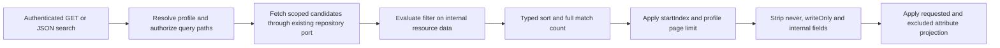
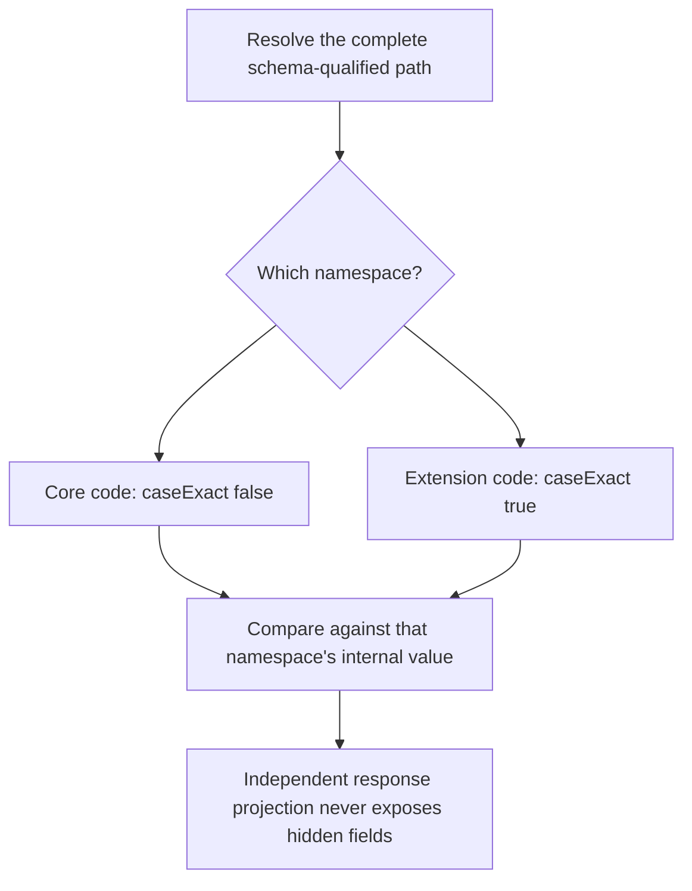

# SCIM queries: filter first, return only permitted fields

> **Last verified:** 2026-09-29
>
> **Scope:** P6b, following the committed [P6a capability fix](SCIM_CAPABILITY_BOUNDARY_IMPLEMENTATION.md).
> Local implementation evidence, not a release or deployment claim.
>
> **Starting commit:** `a801935866e06c2c3907bc6fad92683f6b4f98e3`

**Current integration:** the corrected P6c pair is preserved as
`f77786c4` -> `09b59b43`, then `2aa96f0b` -> `8f3510a8`.
Only the final fixed-common-externalId policy is accepted. An additional
merged regression found URI inference overriding explicit extension roles:
two unit/two HTTP REDs now require explicit `isCoreSchema:false` to win over
the fallback in both ordinary and common-qualified query paths.

[Integrated query/write/schema receipt](evidence/scim-query-authority-integration-20260929/validation.json)
records398 InMemory/399 PostgreSQL HTTP,52 query live outcomes and45/45
additional typed authority outcomes per backend. The earlier numeric/MV
displayName false-negative/500 is closed. A standard core URI bound as an
extension now filters/sorts its own numeric/MV homonym, while top-level
common externalId stays an exact String. The source's46 live checks are
historical; six integration role/cleanup checks bring the shared helper to52.
In this assembly, query coverage remains at9z-CU;9z-CP remains the already
assigned capability section. Existing helper behavior and owned cleanup are
retained. Full C0 acceptance and candidate-materialization cost remain open.

## What changes for a client

Users, Groups and custom resources now use the same schema-aware read plan.
The server evaluates permitted filters against internal resource values,
sorts the matches, counts them, selects a page, and only then removes fields
that must not be returned. GET and the existing string-form JSON `.search`
inputs share this behavior.

| Request or situation | Before P6b | After P6b |
|---|---|---|
| Three records match a `returned:never` field | Zero matches when response mapping had removed the operand | Three matches; the field is still absent from every response |
| Custom integer values `10`, `2` | Text order: `10`, `2` | Numeric order: `2`, `10` |
| Sort a published User/Group extension attribute | Silently fell back to creation time | Uses the actual schema-qualified attribute |
| Extension `entries[primary eq true and value gt 2]` | Child names could be validated as unrelated top-level fields | Children resolve relative to that extension's `entries` |
| Core `code` is case-insensitive; extension `code` is caseExact | A flattened name could apply the wrong rule | Each namespace keeps its own characteristic |
| Custom page count 50, profile maximum 1 | Could return more than one | At most one, without reducing `totalResults` |
| Custom write, ETag disabled and RequireIfMatch enabled | Incorrect 428 response | No If-Match requirement while ETag is disabled |
| Unknown or writeOnly sort field | Could silently sort something else | 400 `invalidValue` |

The immutable [P36-P39 evidence](evidence/scim-fresh-20260925/characterization.json)
and [database comparison](evidence/scim-fresh-20260925/postgres-20260928-expanded.summary.json)
remain unchanged. New execution receipts live separately under `test-results/p6b/`.

## The read pipeline



[scim-read-query.ts](../api/src/modules/scim/common/scim-read-query.ts) owns
schema path resolution, predicate compilation, ordering and pagination.
The three resource services still own their repository calls and authoritative
resource assembly. They pass record-to-internal and record-to-response
functions into the plan; the internal object is never returned directly.

The existing repository interfaces are unchanged. Safe indexed equality and
substring filters can still be pushed down. Comparisons whose database
semantics could lose SCIM matches, including caseExact over CITEXT, null
literals, inequality and range comparisons, retain all candidates for the
shared evaluator. There is no new query-spec migration or per-record database
lookup.

This is a correctness-first implementation, not a scalability claim.
Residual queries and schema-aware sorts materialize all scoped candidates.
Counting must remain correct if a future implementation adds database paging.

## A concrete example

These are synthetic stored values used to explain the test, not response
bodies. `hidden` is declared `returned:never`, not `writeOnly`.

```json
[
  {
    "rank": 10,
    "hidden": "match"
  },
  {
    "rank": 2,
    "hidden": "match"
  }
]
```

For `filter=hidden eq "match"&sortBy=rank&count=1&attributes=rank,hidden`,
the result has `totalResults: 2`, `itemsPerPage: 1`, and its single resource
has `rank: 2`. Neither the explicit projection nor the filter returns
`hidden`. The server still supplies the resource's required identifiers.

A request with `count=0` has the same total and an empty `Resources` array.
A page starting beyond the last match also returns an empty array. A
startIndex below one is normalized to one.

## Namespaces, types and output policy

* Schema and attribute path matching is case-insensitive, including qualified
  URNs. String **values** follow the selected attribute's `caseExact`.
* A valuePath binds all its predicates to the same selected complex value.
  Core aliases such as `urn:...:User:entries.value` resolve to the core data,
  while extension aliases resolve inside their own extension object.
* Numeric fields use numeric ordering. dateTime fields compare instants,
  including equivalent offset representations. Strings use deterministic
  case-sensitive or case-insensitive ordering without a machine locale.
* Multi-valued sorting selects the primary item if present, otherwise the
  first item. Complex sort paths must identify a scalar child, for example
  `entries.value`; `sortBy=entries` is rejected rather than guessed.
* Missing sort values are last in ascending order and first in descending
  order. Equal sort keys retain candidate order; pagination is not a snapshot.
* `returned:request` fields may be filter operands but are omitted from an
  ordinary read unless requested. `returned:never` alone does not prohibit
  filtering under this product's existing policy.
* `writeOnly` fields remain unqueryable, including children of writeOnly
  parents and valuePath predicates. They cannot be used as sort keys either.
  This does not introduce a new permission to search secrets.
* Output stripping now checks hidden children independently of whether their
  parent has a hidden top-level sibling. Promoted User/Group columns are
  assembled before stripping, so they cannot reintroduce a hidden value.
  Server metadata remains authoritative and internal keys remain excluded.



## Profile consistency and preserved P6a behavior

All three custom PUT/PATCH/DELETE calls to `enforceIfMatch` now receive the
resolved endpoint profile. When ETag is enabled, missing required headers
still produce 428, stale versions produce 412, and current versions work.
When disabled, conditional enforcement and ETag headers are inactive.
The existing informational `meta.version` policy is unchanged.

The external User/Group filter/sort checks remain in their controllers.
`/Me` calls User lookup internally; disabling client filtering must not block
that lookup. P6a's direct/custom/Bulk capability tests remain in the validation
matrix and have not been removed or weakened.

Atomic compare-and-write behavior is P3, not established by this sequential
ETag test. JSON search **arrays** and DTO/error normalization are P5.

## Standards and explicit policy choices

* [RFC 7644 section 3.4.2.2](https://www.rfc-editor.org/rfc/rfc7644.html#section-3.4.2.2):
  filter expressions, typed operators and valuePath semantics.
* [RFC 7644 sections 3.4.2.3 and 3.4.2.4](https://www.rfc-editor.org/rfc/rfc7644.html#section-3.4.2.3):
  typed sorting, scalar complex paths, primary/first selection and pagination.
* [RFC 7643 section 2.2](https://www.rfc-editor.org/rfc/rfc7643.html#section-2.2):
  caseExact, returned and mutability characteristics.
* [RFC 7644 section 3.14](https://www.rfc-editor.org/rfc/rfc7644.html#section-3.14):
  versioning and conditional requests.

Rejecting unknown/unqueryable sort paths with `invalidValue` is an explicit
server policy replacing a misleading fallback. Allowing a non-writeOnly
never-returned operand preserves this server's existing query policy; it is
not described as a universal requirement for every SCIM deployment.
No canonical-value enum restrictions were added.

## Validation and ownership

| Layer | Evidence |
|---|---|
| Original behavior RED | 24 HTTP failures after valid fixture setup; 3 caseExact push-down unit failures |
| Additional boundary RED | 2 retained unit regressions for simple-list sorting and nested-only suppression, plus 1 invalid null push-down predicate; a draft complex-parent shorthand expectation was corrected after reading the RFC and is not counted as normative RED |
| Focused unit GREEN | 616 tests in 9 suites |
| InMemory HTTP GREEN | 156 tests in 10 suites, including 33 new P6b scenarios |
| PostgreSQL HTTP GREEN | 156 tests in the same 10 suites, actual PostgreSQL 17.8 with Prisma |
| Local live HTTP | 32 checks passed on each owned InMemory/PostgreSQL API |
| Static | API build passed; production-file warnings decreased 51 to 48, errors stayed zero; new files have zero lint errors/warnings |
| Existing test lint | Changed legacy sorting test errors decreased 64 to 62; no increase and no unrelated cleanup |
| Documentation | Content/freshness passed; 42 literal JSON blocks parsed; seven diagrams rendered in both themes with strict security. The link check found no new broken links; three existing historical Session links remain. |

The task-owned PostgreSQL runner is
`test-results/p6b/run-currenttip-postgres.cjs`, not the pinned historical
reproducer. It records HEAD, a working-diff hash, database identity, image,
migration results, tests, live checks and exact cleanup. Before migration it
verifies a newly created loopback-only container, run/owner labels, matching
database/user/cluster/system identity, empty public schema and an ownership
marker. The standard destructive E2E teardown is not used. All 22 migrations
are replayed on the owned database. Cleanup removes only the verified exact
container ID; each smoke run removes its own endpoint and stops its API.

The renderer reported VS Code's built-in version as `0.0.0`; the installed
gate itself rendered with the repository-pinned Mermaid `11.15.0`. This is
recorded as a viewer-version diagnostic limitation, not evidence of matching
the editor's bundled version. No extension or dependency pin was changed.
The existing historical Session links to `telemetry.spec.ts`,
`preferences.spec.ts` and the ignored `.vscode/settings.json` were verified
on the starting commit and left outside this query change.

Run the independently reusable live check against an authorized test instance:

```powershell
.\scripts\test-scim-query-semantics.ps1 `
  -BaseUrl $ownedTestBaseUrl `
  -Token $testToken
```

The main [live suite](../scripts/live-test.ps1) invokes it as section **9z-CP**.
No inherited/shared/live database, cloud deployment, or data repair was used.

## Completion boundaries

### P6c follow-up: a published name does not guarantee column equivalence

**Historical result, corrected by P6d below:** P6c correctly identified that
custom `displayName` can be numeric or multi-valued, with values held in
`rawPayload` rather than its optional scalar string query column. It
incorrectly generalized this permission to common top-level `externalId`.
RFC 7643 section 3.1 fixes common externalId to a single-valued caseExact
string for every ResourceType. Only an extension-qualified homonym is
independent. The historical P6c commit and receipts are retained for RCA,
not treated as proof that numeric/MV common externalId acceptance is valid.

The read plan now supplies each resolved attribute's type and cardinality to
the existing filter builder. The builder pushes a mapped comparison only
when those characteristics agree with the column representation. A compound
filter containing an incompatible mapped operand stays entirely residual;
qualified paths retain the existing residual behavior. Compatible scalar
strings and built-in Boolean columns still use the existing indexed path.
There is no new repository port and no change to POST/PUT/PATCH persistence.

The corrected example is a custom resource containing `displayName: 2`,
common `externalId: "Z"` and `urn:live:query:Extension` containing an
independent `externalId: ["other", "needle"]`. It matches all of these:

```text
displayName eq 2
externalId eq "Z"
urn:live:query:Extension:externalId eq "needle"
displayName pr and urn:live:query:Extension:externalId pr
urn:live:query:Extension:externalId co "eed"
```

The follow-up tests assert matching IDs, scalar/list payload values,
unqualified/qualified equivalence, compound AND/OR, count zero, and the
unchanged compatible string push-down. RED on `cc3ccdbc` was **2 unit tests
and 4 HTTP tests**, with successfully created POST fixtures and actual
zero-match errors. The top-level externalId fixtures were subsequently
identified as standards-invalid and replaced in P6d.
Historical focused GREEN was **100 unit tests, 92 HTTP tests per backend, and 40 live
checks per backend**. Actual PostgreSQL 17.8 replayed 22 migrations under the
same task-owned identity guards; the exact container and both owned API
processes were removed/stopped. API build passed. Changed-file lint is
**0 errors / 2 existing warnings**, with no increase. Documentation content
and freshness passed, 42 JSON blocks parsed, 381 relative links resolved,
and both diagrams rendered in two themes. The previously documented editor
version-detection warning is unchanged.

Receipts are separately recorded under `test-results/p6c/`; they do not
overwrite original P6b results. The current-tip harness validates the changed
source and excludes the standard destructive E2E teardown.

The live helper remains section **9z-CP**; no sibling's section IDs changed.
P3 owns write policy and preservation; P7 owns common-attribute admission.
Cross-package integration and release validation remain parent-owned.
**Design disposition accepted:** explicit schema shape is a narrow extension
of the existing filter-builder input, not another query framework. The
filter compiler still has one responsibility and the three services share it.

### P6d correction: common externalId is fixed, extension homonyms are not

The read plan now enforces the
[RFC 7643 section 3.1](https://www.rfc-editor.org/rfc/rfc7643.html#section-3.1)
shape for common `externalId`: string, single-valued, caseExact. This also
applies to core-qualified aliases and to an existing profile declaration
that omits or weakens caseExact. Existing writeOnly query denial is preserved.
No write admission or mutation code changes in this P6 follow-up.

The new regression creates valid string values `"Z"` and `"a"`. Common
`externalId eq "z"` must return no matches and ascending sort must return
`"Z"` before `"a"`. An extension `externalId` with caseExact false can still
match `"z"` against `"Z"`. Separate extension tests cover numeric and
multi-valued externalId values, filtering and sorting. Custom displayName
and active continue to use their declared types and payload representation.

Confirmed RED on `f77786c4`: **3 unit failures and 1 HTTP failure**, all
actual wrong-case matches, not fixture failures. Focused GREEN:
**106 unit tests, 97 HTTP tests per backend, 46 live checks per backend**.
The owned PostgreSQL 17.8 database replayed 22 migrations; exact container
cleanup and both API shutdowns were verified. API build and changed-file
lint passed with zero errors/warnings. Content/freshness, literal JSON,
relative links and both diagrams in two themes passed; the earlier
editor-version-detection diagnostic is unchanged. P6c's invalid
top-level externalId tests were replaced, not silently renamed as valid.

Receipts are under `test-results/p6d/`. Section **9z-CP** remains unchanged.
The parent must integrate the P3/P7 corrections and rerun the applicable
combined admission, write and query matrix; no sibling commits were merged.

**Test/design improvement applied:** common-attribute contracts precede
schema customization. Tests that demonstrate implementation acceptance do
not establish standards validity. The narrow read normalization reuses the
existing common-attribute map and preserves namespace-aware query semantics.

The [P6 tracker](SCIM_CORRECTNESS_DESIGN_AND_IMPLEMENTATION.md#11-progress-tracker)
and [P6b RCA entries](SCIM_CORRECTNESS_EXECUTION_ISSUES_AND_RCA.md#p6b-confirmed-corrections)
are the handoff. Release version metadata, full consolidation gates, exact-tip
CI, review and deployment remain with the parent workflow.

**Test improvement applied:** query tests assert matching values, order, totals,
page contents and forbidden output keys, not only HTTP success. Namespace
collision and nested-only secrecy controls cover weaknesses that broad green
CRUD tests missed.

**Design disposition accepted:** one cohesive request-scoped helper serves
three real resource implementations and reduces service duplication. Existing
repository ports and capability boundaries stay intact. A wholesale query-port
rewrite, persistent query cache, or new strategy framework is not justified here.
