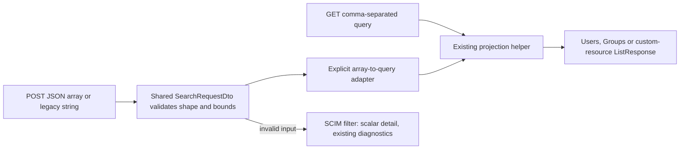

# JSON search and SCIM error contracts

> **Last verified:** 2026-09-28
>
> **Package:** P5, local implementation of F09 and F17
>
> **Source baseline:** `cb2e1bcb4ad31366ef972ac5a163e8aae0e0707e`
>
> **Release:** pending parent consolidation; no product version was changed.

## What changed

Clients can send RFC 7644 JSON arrays in `attributes` and
`excludedAttributes` to Users, Groups and registered custom-resource `.search`
routes. Existing clients sending comma-separated JSON strings still work.
GET query parameters remain comma-separated strings.

Genuinely invalid requests return a client error, not a projection crash.
SCIM `detail`, when present, is a string. Multiple Nest validation messages
are joined with `; `; existing field-level diagnostic arrays remain in the
diagnostics extension. OAuth token errors retain their own JSON envelope.

This fixes [independent findings F09/F17](SCIM_FRESH_MASTER_ANALYSIS_2026-09-25.md)
and the retained H2/H3 failures. The
[historical HTTP evidence](evidence/scim-fresh-20260925/http-characterization.json)
and [PostgreSQL comparison](evidence/scim-fresh-20260925/postgres-20260928-expanded.cases.csv)
are unchanged. This is new implementation evidence, not a rewritten baseline.

## Request contract

| Input | Accepted behavior |
|---|---|
| JSON array of attribute paths | Preferred RFC form; each item is one path |
| Comma-separated JSON string | Explicit backwards-compatible form |
| GET `?attributes=a,b` or `?excludedAttributes=a,b` | Existing URL projection behavior, unchanged |
| Empty array or empty legacy string | No selection; use the existing default returned policy |
| Missing projection member | No selection |
| Null, object, number, mixed/nested array | HTTP 400 |
| Empty/whitespace-only array item or comma inside an item | HTTP 400; arrays must not conceal a second list syntax |
| More than 100 array items | HTTP 400 |
| More than 2000 characters including joining commas | HTTP 400, for either input form |

Bounds apply separately to each projection field. Dotted sub-attributes and
schema URN paths pass through unchanged. Projection still preserves
always-returned attributes. In this implementation User `userName` and Group
`displayName` remain present even when not selected. If both projection
members are supplied, existing `attributes` precedence remains unchanged.
This package does not redefine filter grammar, query limits, capabilities,
schema characteristics or hidden-field search policy; those belong to P6/P7.

### Preferred request

The endpoint ID and bearer below are placeholders. The body shape and projected
values are exercised by the local HTTP tests.

```http
POST /scim/endpoints/<endpointId>/Users/.search HTTP/1.1
Authorization: Bearer <token>
Content-Type: application/scim+json

{
  "schemas": [
    "urn:ietf:params:scim:api:messages:2.0:SearchRequest"
  ],
  "attributes": [
    "name.givenName"
  ]
}
```

The test fixture's `name` becomes the following object; `familyName` is absent.
Its original ID, schema list, metadata and always-returned username remain.

```json
{
  "givenName": "Search"
}
```

### Genuine invalid request

```json
{
  "count": -1,
  "startIndex": 0,
  "sortOrder": "sideways"
}
```

All three resource families return HTTP 400 with string `status: "400"`.
`detail` is one string containing the three validation messages, rather than
an array. Correlation metadata may also appear under
`urn:scimserver:api:messages:2.0:Diagnostics`.

## Implementation boundary



* [SearchAttributeSelection](../api/src/modules/scim/dto/search-attribute-selection.ts)
  validates the original union-shaped input without global string coercion.
  Its adapter joins only already validated arrays.
* All three search controllers now use
  [SearchRequestDto](../api/src/modules/scim/dto/search-request.dto.ts).
  Generic search previously used an inline TypeScript shape, which Nest cannot
  validate at runtime.
* [ScimExceptionFilter](../api/src/modules/scim/filters/scim-exception.filter.ts)
  normalizes only SCIM detail, including already SCIM-shaped exceptions.
  It does not serialize unknown nested objects into messages.
* No projection service, repository, PATCH engine or filter parser changed.

### Caller compatibility

The existing search E2E fixture and controller units use comma-separated JSON
strings; they stay supported. The existing GET projection tests stay green.
The current web [Workbench request builder](../web/src/pages/WorkbenchPage.tsx)
parses the editor body as JSON and sends the resulting object without rewriting
projection members. Arrays and strings therefore reach the boundary intact.
No web source or user-visible browser flow changed; no UI refactor or new
Playwright requirement was introduced by this API-only package.

## TDD and validation evidence

Logs are under the ignored worktree-local `test-results/p5` directory.
The [sanitized validation summary](evidence/scim-search-contract-20260928.validation.json)
is committed so the result survives without those local logs.

| Layer | RED before production changes | GREEN |
|---|---|---|
| New DTO plus exception units | 15 failed / 54 passed; arrays rejected, null accepted, detail non-scalar | 351 passing targeted unit tests across 9 suites |
| Bootstrap isolation units | Verified URL lost to a subsequently discovered marker | 3 passing tests; aggregate 354 units across 10 suites |
| Search/projection HTTP | Run `598c934a6a5d816f`: 19 failed / 42 passed | 61 passed on InMemory and 61 on PostgreSQL |
| Actual PostgreSQL | Historical arrays failed on both backends | Final staged-source run `c9cc727551f7d7fe`: PostgreSQL 17.8, all 22 migrations replayed, 61 HTTP tests passed |
| Local production HTTP | Same section authored and smoke-run in this package | 61 assertions passed; only dedicated endpoint created/deleted |
| API build | Existing TypeScript compiler | Passed |
| New-file lint | Explicitly checks the new E2E file as well as DTOs | No errors or warnings |
| Changed-source lint | Before and after compared on the same changed paths | 0 errors; 44 pre-existing warnings, unchanged |
| Harness fail-closed controls | Existing marker, wrong container ID, inherited DB URL, unknown backend | 4 negative controls plus 1 positive control passed |
| Documentation | No skipped render counted as pass | Four diagrams render in both strict themes; 26-document freshness/content audits pass |

RED messages included `expected 200, got 400` for built-ins,
`expected 200, got 500` for custom resources, and
`Expected: "string", Received: "object"` for validly rejected DTOs.
The initial HTTP compile-only failure is classified as harness correction,
not as normative RED. Assertions verify ListResponse keys/counts, original IDs,
projected values and exclusions, always-returned fields, legacy compatibility,
and real multiple-error detail.

### Reproduce without touching any existing database

From this worktree root, with the existing pinned API tooling available:

```powershell
node scripts\scim-search-validation\check-safety.cjs
node scripts\scim-search-validation\run.cjs
node scripts\scim-search-validation\smoke.cjs
```

Use `run.cjs --inmemory` for the development-only lane. The default runner
creates its own randomly named PostgreSQL 17 container with a loopback-only
random port, tmpfs storage and a random password held in memory. It verifies
container labels/name/ID, database/user/cluster/system identity, empty initial
tables and its ownership marker before replaying migrations. The Jest setup
rechecks ownership; destructive global teardown is not used. Only that exact
container ID is removed in `finally`. An existing E2E DB marker fails closed.
Each app bootstrap re-verifies ownership and pins the actual connection URL,
so even a later concurrent marker cannot redirect it. Readiness probes TCP,
not the temporary initialization server's Unix socket.
Inherited `DATABASE_URL` is never used.

The smoke runner starts the locally built API with isolated InMemory storage
and random synthetic credentials. It invokes the same
[live section](../scripts/live-test-sections/search-contract.ps1) wired into
`scripts/live-test.ps1`, then stops its own exact child process.

## Review, scope and remaining release gates

**Test/gate self-improvement: applied.** A green legacy string suite was blind
to the RFC array contract. The new matrix proves accepted shape, projected
outcome and malformed-input behavior independently, including genuine DTO
errors after valid searches turn green.

**Design/architecture disposition: accepted.** Three concrete consumers justify
one small validator and one adapter, not a controller hierarchy or generalized
query rewrite. No new dependency or persisted schema is needed.

See the [P5 execution issues](SCIM_CORRECTNESS_EXECUTION_ISSUES_AND_RCA.md).
Parent consolidation still owns release version/CHANGELOG metadata, full
applicable matrix, independent review, exact-tip CI and any deployment decision.
Local specialist review found two harness issues (marker race and socket-only
readiness), both corrected and revalidated. Remaining baseline notes: three
old broken links in Session history; renderer detector reports 0.0.0 despite
successful rendering; frozen web tooling install reports 12 high/3 moderate
advisories, and root tooling reports 2 moderate. No dependency fixes or
lockfile changes were made, so a clean dependency-security gate is not claimed.
No push, merge, cloud write, deployment, production readiness or data repair
is claimed here.

## Standards

* [RFC 7644 section 3.4.3](https://www.rfc-editor.org/rfc/rfc7644.html#section-3.4.3):
  JSON search request.
* [RFC 7644 section 3.4.2.5](https://www.rfc-editor.org/rfc/rfc7644.html#section-3.4.2.5):
  attribute projection.
* [RFC 7644 section 3.12](https://www.rfc-editor.org/rfc/rfc7644.html#section-3.12):
  SCIM error envelope.
